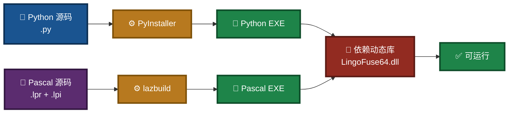
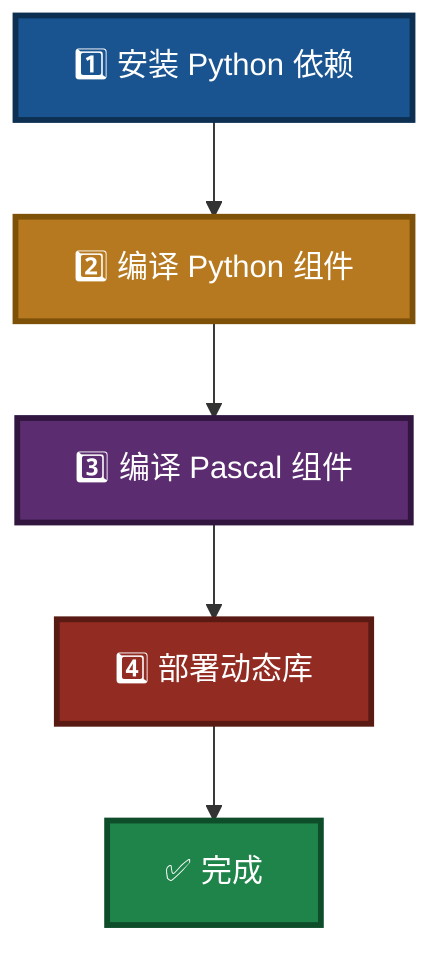
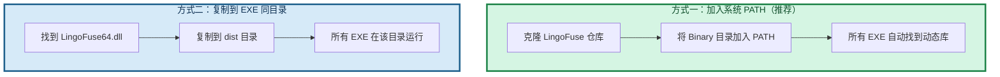

# LingoFuse-pasAgent 组件编译指南（Windows）

> **文档版本**：V4.1  
> **最后更新**：2026-09-14  
> **适用平台**：Windows 10/11（64 位）  
> **相关文档**（同目录）：
> - 依赖安装：`Dependency_Installation_Guide.md`
> - MCP 新手指南：`mcp_api_tool_doubao_guide.md`
> - LLM 服务命令行：`src/LingoFuse_LLM_Service_CLI_guide.md`
> - LLM 代理命令行：`src/LingoFuse_LLM_Proxy_CLI_Guide.md`
> - 生态体系总览：`src/LingoFuse_LLM_Ecosystem_User_Guide.md`

---

## 阅读引导

本文档介绍如何将 LingoFuse-pasAgent 中的 Python 脚本和 Pascal 源代码编译为可执行文件（EXE）。建议按以下顺序阅读：

1. **只想快速编译** → 直接跳到第二章「快速开始」。
2. **想了解前置软件** → 读第一章「前置准备」。
3. **想编译某个特定组件** → 读第三、四、五章。
4. **想了解动态库部署** → 读第六章。
5. **遇到问题** → 读第七章「常见问题」。

如果你只是想**运行**预编译包而不想自己编译，请直接下载预编译包并按 `mcp_api_tool_doubao_guide.md` 操作。

**本次更新（V4.1）** 修正内容：
- 1.3 节目录树中「`pascal_agent_api_ref_json.md`」补充到 `src/` 文件列表（此前遗漏）。
- 3.3 节 `llm_proxy_tool` 的 PyInstaller 命令中 `--hidden-import http.client` 修正为 `--collect-submodules http.client`（`http.client` 是标准库，PyInstaller 默认会打包，但显式声明 `--hidden-import` 无意义；保留 `--hidden-import ssl` 与 `--hidden-import requests` 即可）。
- 第八章「编译产物目录」补充 `mcp_api_proxy.exe` 与 `LingoFuse64.dll` / `z_ipc_64.dll` 在 `dist\` 中的说明。
- 明确区分「本仓库文件」（可编译）与「LingoFuse 核心仓库文件」（不在本仓库中，需另行获取）。

---

## 一、前置准备

### 1.1 操作系统

- Windows 10/11（64 位推荐）

### 1.2 必需软件

| 软件 | 用途 | 获取方式 |
|------|------|----------|
| **Python 3.8+**（64 位） | 运行 PyInstaller 及 Python 脚本 | [python.org](https://python.org) |
| **PyInstaller** | 将 Python 脚本打包为 EXE | `pip install pyinstaller` |
| **Lazarus**（含 Free Pascal 3.2+） | 编译 Pascal 项目（必须使用 lazbuild 或 IDE） | [Lazarus IDE](https://lazarus-ide.org) |
| **LingoFuse 动态库** | 所有 EXE 的运行时依赖 | 由 LingoFuse 核心项目提供（不在本仓库） |

> **重要**：Pascal 项目的编译**不要直接使用 `fpc` 命令行**，因为项目依赖复杂的单元搜索路径（Z 框架、LingoFuse 等）。必须使用 `lazbuild` 或 Lazarus IDE，它们能正确读取 `.lpi` 文件中的配置。

### 图 1：编译工具链全景



### 1.3 源代码目录结构

本项目根目录（假设为 `D:\LingoFuse-pasAgent`）的实际布局如下：

```
LingoFuse-pasAgent\
├── readme.md
├── Build_Guide.md                  ← 本文档
├── Dependency_Installation_Guide.md
├── mcp_api_tool_doubao_guide.md
├── NVIDIA-Nemotron-3-Nano-Omni-30B-A3B-Reasoning-UD-IQ4_XS.md
├── code_generate_mcp.md
├── pascal_code_mcp_rule.md
├── C_code_mcp_rule.md
├── LingoFuse_mcp_api_tool_Implementation_Memo.md
├── LingoFuse_Python_Binding_Migration_Record.md
├── Qwen2.5-7B-Instruct-Q4_K_M.md
├── Local LLM Agent Handbook CPU First, GPU Optional.md
├── LICENSE
└── src\                              ← 所有源码与编译脚本
    ├── build_mcp_api_tool.ps1        # 编译 mcp_api_tool.exe + mcp_api_proxy.exe
    ├── build_bridge.ps1              # 编译 bridge.exe（可选）
    ├── build_llm_service.ps1         # 编译 4 个 LLM EXE（见 3.3 节）
    ├── build_pascal_agent.bat        # 一键编译所有 Pascal 项目
    ├── init_env.ps1                  # PowerShell 环境初始化脚本
    ├── clear_.bat                    # 清理编译中间产物
    ├── generate_agent_json.py        # MCP 配置生成器
    ├── language_middleware.py        # MCP 中间件
    ├── mcp_api_tool.py               # MCP 网关源码
    ├── mcp_api_proxy.py              # stdio 调试代理
    ├── llm_service.py                # 本地 LLM 推理服务
    ├── llm_proxy.py                  # 纯文本代理
    ├── llm_proxy_tool.py             # 转发 + 服务端侧工具执行（LTB）
    ├── llm_test.py                   # 交互式测试客户端
    ├── chat_template.jinja           # Jinja2 聊天模板
    ├── pascal_agent_service.lpr      # 信标源码
    ├── pascal_agent_service.lpi      # 信标 Lazarus 项目
    ├── pascal_agent_api.lpr          # 工具提供者示例源码
    ├── pascal_agent_api.lpi          # 工具提供者 Lazarus 项目
    ├── pascal_agent_api_ref_json.md  # agent_main / register_agent 的 JSON 结构详解
    ├── lingofuse_helper.pas          # 写工具时的辅助单元
    ├── lingofuse_import.pas          # 导入单元
    ├── requirements.txt              # Python 依赖清单
    ├── CreateHealthCheck\            # 环境健康检查 Pascal 项目
    │   ├── HealthCheck.lpi
    │   ├── HealthCheck.lpr
    │   └── ...
    ├── lingofuse\                    # LingoFuse Python 绑定包
    │   ├── __init__.py
    │   ├── core.py / client.py / server.py / bridge.py / errors.py
    │   ├── _lf_native.py / serializers.py
    │   ├── test_lingofuse.py / test_bridge.py
    │   └── Bridge_User_Guide.md
    └── LingoFuse_LLM_*.md（7 份 LLM 生态文档）：
        LingoFuse_LLM_Ecosystem_User_Guide.md
        LingoFuse_LLM_Service_CLI_guide.md
        LingoFuse_LLM_Proxy_CLI_Guide.md
        LingoFuse_LLM_Proxy_Compatibility_Guide.md
        LingoFuse_LLM_Pitfalls_For_AI.md
        LingoFuse_LLM_Service_Work_Summary.md
        llama_cpp_python_guide.md
```

**关键说明**：

- **没有** `llm-service\` 子目录。所有 `llm_*.py` 都直接位于 `src\`。
- **没有** `tools\` 子目录。代码生成器 `code_decl_to_mcp` 的**源码未包含在本仓库中**，只有使用手册 `code_generate_mcp.md`（根目录）。若要使用该工具，请参考手册获取独立发布版本。
- 所有 LLM 生态文档（`LingoFuse_LLM_*.md`、`llama_cpp_python_guide.md`）位于 `src\` 下。
- **LingoFuse 核心库文件**（如 `Z.LingoFuse_Core.pas`、`Z.LingoFuse_Export.pas`、`Z.Pascal_Func_Tool.pas`、`pascal_func_model.pas`、`pas_mcp_generator_tool.pas`、`llm_client.pas`）**均不在本仓库中**，需从 [LingoFuse 仓库](https://github.com/PassByYou888/LingoFuse) 获取。

---

## 二、快速开始

如果你已经安装好所有前置软件，执行以下步骤即可：

### 图 2：快速编译流程



**在 `src` 目录打开 PowerShell，依次执行**：

```powershell
cd D:\LingoFuse-pasAgent\src

# 1. 安装依赖
pip install -r requirements.txt
pip install pyinstaller

# 2. 编译 Python 组件（按需选择）
.\build_mcp_api_tool.ps1          # mcp_api_tool.exe + mcp_api_proxy.exe
.\build_llm_service.ps1           # llm_service.exe + llm_proxy.exe + llm_proxy_tool.exe + llm_test.exe
.\build_bridge.ps1                # bridge.exe（可选）

# 3. 编译 Pascal 组件
.\build_pascal_agent.bat
```

编译产物在 `src\dist\` 目录下。

---

## 三、Python 组件编译

所有 Python 脚本均可通过 PyInstaller 打包为独立的 EXE。项目已在 `src` 目录提供了 PowerShell 脚本，**强烈建议使用这些脚本**，它们已配置好必要的参数（依赖收集、数据文件等）。

### 3.1 环境准备

打开 PowerShell，进入 `src` 目录，执行以下命令安装依赖：

```powershell
cd D:\LingoFuse-pasAgent\src
pip install -r requirements.txt
pip install pyinstaller
```

### 3.2 编译 mcp_api_tool.exe（含 mcp_api_proxy.exe）

运行脚本：

```powershell
.\build_mcp_api_tool.ps1
```

脚本内容大致如下（供参考）：

```powershell
pyinstaller --onefile `
    --collect-all fastmcp `
    --collect-all pydantic `
    --collect-all tzdata `
    --hidden-import language_middleware `
    --hidden-import generate_agent_json `
    --paths . `
    --add-data "lingofuse;lingofuse" `
    mcp_api_tool.py

pyinstaller --onefile `
    --name mcp_api_proxy `
    --clean `
    --noconfirm `
    mcp_api_proxy.py
```

编译完成后，在 `dist\` 目录下将生成：

- `mcp_api_tool.exe`
- `mcp_api_proxy.exe`

> **说明**：
> - `--collect-all fastmcp / pydantic / tzdata`：这些包在运行时依赖数据文件，`--collect-all` 确保它们被完整打包。
> - `--hidden-import language_middleware`：`language_middleware.py` 是项目内模块，`mcp_api_tool.py` 通过 `try/except ImportError` 保护导入，PyInstaller 静态分析无法看到，必须显式声明。
> - `--hidden-import generate_agent_json`：同理，`--generate-configs` 功能依赖该模块。
> - `--add-data "lingofuse;lingofuse"`：将 `lingofuse` 包作为数据文件打包（Windows 下用 `;` 分隔源与目标）。

### 3.3 编译 4 个 LLM EXE

`build_llm_service.ps1` 一次性编译 **4 个** EXE：

| 源文件 | 输出 | 特殊依赖 |
|--------|------|----------|
| `llm_service.py` | `llm_service.exe` | `llama_cpp`、`jinja2` |
| `llm_proxy.py` | `llm_proxy.exe` | `requests`、`http.client`、`ssl` |
| **`llm_proxy_tool.py`** | **`llm_proxy_tool.exe`** | `requests`、`ssl`、**`language_middleware`** |
| `llm_test.py` | `llm_test.exe` | 仅 `lingofuse` |

运行脚本：

```powershell
.\build_llm_service.ps1
```

脚本会对每个目标执行一次 PyInstaller 调用。以 `llm_proxy_tool.py` 为例：

```powershell
pyinstaller --onefile `
    --name llm_proxy_tool `
    --paths . `
    --collect-all lingofuse `
    --hidden-import lingofuse `
    --hidden-import language_middleware `
    --hidden-import requests `
    --hidden-import ssl `
    --noconfirm `
    llm_proxy_tool.py
```

> **注意**：
> - `llm_proxy_tool.py` 必须显式声明 `--hidden-import language_middleware`，因为源码中该模块是 `try/except ImportError` 保护导入，PyInstaller 的静态分析无法看到。`generate_agent_json` 对 `mcp_api_tool.py` 同理。
> - `http.client` 与 `ssl` 均为 Python 标准库，PyInstaller 默认会打包，无需显式声明 `--hidden-import`。仅在极少数环境下缺失时才追加。
> - `--collect-all lingofuse`：`lingofuse` 是本地包，包含 `_lf_native.py` 等 ctypes 绑定，需完整收集。

编译完成后，在 `dist\` 目录下将生成：

- `llm_service.exe`
- `llm_proxy.exe`
- `llm_proxy_tool.exe`
- `llm_test.exe`

> 如需支持 CUDA 或 Vulkan，请先安装对应的 `llama-cpp-python` GPU 版本，再运行脚本。

### 3.4 编译 bridge.exe（可选）

如需 HTTP 桥接网关：

```powershell
.\build_bridge.ps1
```

生成 `bridge.exe`。

---

## 四、Pascal 组件编译

Pascal 项目必须使用 **Lazarus**（或 `lazbuild`）编译，**不要直接调用 `fpc`**。

### 4.1 环境准备

- 安装 Lazarus IDE（包含 Free Pascal 编译器）。
- 确保 `lazbuild.exe` 位于系统 PATH 中，或使用绝对路径。

### 4.2 使用 build_pascal_agent.bat 一键编译

在 `src` 目录双击或命令行执行：

```bat
build_pascal_agent.bat
```

该脚本内容如下：

```bat
lazbuild.exe -B ./pascal_agent_service.lpi
lazbuild.exe -B ./pascal_agent_api.lpi
lazbuild.exe -B ./CreateHealthCheck/HealthCheck.lpi
echo 所有项目编译完成。
timeout /t 5 /nobreak >nul
```

执行后，将编译并生成：

- `pascal_agent_service.exe`（信标）
- `pascal_agent_api.exe`（工具提供者示例）
- `HealthCheck.exe`（在 `CreateHealthCheck\` 目录下）

### 4.3 单独编译某个 Pascal 项目（使用 lazbuild）

```cmd
lazbuild.exe -B .\pascal_agent_service.lpi
```

或者使用 Lazarus IDE：打开 `.lpi` 文件，按 `Ctrl+F9` 编译。

### 图 3：Pascal 编译流程


---

## 五、代码生成器（工具源码不在本仓库）

本仓库**只提供**代码生成器的**使用手册**（根目录 `code_generate_mcp.md`）和**声明规范**（`pascal_code_mcp_rule.md`、`C_code_mcp_rule.md`），**不包含** `code_decl_to_mcp` 工具的 Pascal 源码。

如果你需要使用代码生成器：

1. 阅读根目录 `code_generate_mcp.md` 了解 5 层转换模型、界面结构、工作流程。
2. 阅读 `pascal_code_mcp_rule.md`（Pascal 侧）或 `C_code_mcp_rule.md`（C 侧）确认声明规范。
3. 从项目的预编译发布页获取 `code_decl_to_mcp.exe`，或从源码仓库（不公开）自行编译。

> **历史说明**：早期文档曾提及 `tools/pascal_c_to_mcp/` 目录，该目录不存在于本仓库中。请以实际目录结构为准。

---

## 六、LingoFuse 动态库部署

所有编译出的 EXE 运行时都需要 `LingoFuse64.dll`（Windows）或 `liblingofuse.so`（Linux）。该库由 LingoFuse 核心项目提供，不包含在本仓库中。

### 图 4：动态库部署两种方式



### 6.1 推荐部署方法：加入系统 PATH

1. 克隆 LingoFuse 仓库（需 `--recursive` 拉取子模块）：

```bash
git clone --recursive https://github.com/PassByYou888/LingoFuse.git
```

2. 将 LingoFuse 的 `Binary` 目录（或包含 `LingoFuse64.dll` 的目录）加入系统 `PATH`：

   - **Windows（永久）**：系统属性 → 环境变量 → 编辑 `Path`，添加该目录。
   - **Windows（临时）**：
     ```powershell
     $env:PATH = "D:\LingoFuse\Binary;$env:PATH"
     ```
   - **Linux/macOS**：
     ```bash
     export PATH=/path/to/LingoFuse/Binary:$PATH
     ```

### 6.2 备选方案：复制到每个 EXE 目录

如果不想修改 PATH，可以将动态库复制到每个 EXE 所在目录（例如 `src\dist\`）。

### 6.3 ⚠️ 运行环境依赖

预编译 DLL 使用 **Visual Studio 2022** 编译，运行时需要安装 **VS2022 可再发行组件（VC++ Redistributable）**。

请从微软官方下载并安装对应架构的版本：

- [VC++ Redistributable for Visual Studio 2022 (x86/x64)](https://learn.microsoft.com/en-us/cpp/windows/latest-supported-vc-redist?view=msvc-170)

---

## 七、常见问题

### Q1：运行 EXE 时提示 `Failed to load LingoFuse64.dll`

**原因**：动态库不在 PATH 或 EXE 同目录。

**解决**：

- 确保 `LingoFuse64.dll` 与 EXE 在同一目录，或已在系统 `PATH` 中。
- 检查动态库位数是否与 EXE 一致（64 位 vs 32 位）。
- 检查是否安装了 VC++ Redistributable。

### Q2：PyInstaller 打包后运行报 `ModuleNotFoundError`

**原因**：某些模块未被打包。

**解决**：

- 增加 `--hidden-import` 参数，或检查 `--add-data` 是否正确包含 `lingofuse` 包。
- `llm_proxy_tool.exe` 需要 `--hidden-import language_middleware`（源码里是 `try/except` 导入，静态分析不可见）。
- `mcp_api_tool.exe` 需要 `--hidden-import language_middleware --hidden-import generate_agent_json` 才能支持 `--generate-configs`。
- 参考项目提供的脚本，它们已配置好所需参数。

### Q3：Pascal 编译报 `Can't find unit Z.Core`

**原因**：单元搜索路径未配置。

**解决**：

- 确保使用 `lazbuild` 编译，因为 `.lpi` 中已配置单元搜索路径。
- 若手动调用 `fpc`，需手动指定 `-Fu` 路径，极易出错，请改用 `lazbuild`。

### Q4：编译的 EXE 体积过大

**解决**：

- 使用 `--upx-dir` 参数启用 UPX 压缩（需先下载 UPX），可显著减小体积。
- 但 `--onefile` 模式本身会增大启动解压开销，若体积敏感，可改用 `--onedir` 模式。

### Q5：使用 `--generate-configs` 时找不到 `generate_agent_json` 模块

**解决**：

- 确保 `generate_agent_json.py` 在 `src\` 目录（与 `mcp_api_tool.py` 同目录）。
- 打包时已包含 `--hidden-import generate_agent_json`。

### Q6：`build_llm_service.ps1` 编译时找不到 `llama_cpp` 模块

**原因**：未安装 `llama-cpp-python`。

**解决**：

```powershell
# CPU 版本
pip install llama-cpp-python --extra-index-url https://abetlen.github.io/llama-cpp-python/whl/cpu

# 或 CUDA 版本（根据你的 CUDA 版本选择）
pip install llama-cpp-python --extra-index-url https://abetlen.github.io/llama-cpp-python/whl/cu124
```

详见 `src\llama_cpp_python_guide.md`。

### Q7：编译完成后，如何知道每个 EXE 的用途？

| EXE | 用途 |
|-----|------|
| `pascal_agent_service.exe` | 信标，管理所有工具注册 |
| `pascal_agent_api.exe` | 工具提供者示例 |
| `mcp_api_tool.exe` | MCP 网关，连接 AI 客户端和信标（路径 A） |
| `mcp_api_proxy.exe` | stdio 调试代理 |
| `llm_service.exe` | 本地 LLM 推理服务（加载 GGUF） |
| `llm_proxy.exe` | 纯文本代理，转发到外部 OpenAI 兼容后端 |
| **`llm_proxy_tool.exe`** | **转发 + 服务端侧工具执行（LTB，路径 B）** |
| `llm_test.exe` | 命令行 LLM 测试客户端 |
| `bridge.exe` | HTTP 网关（可选） |
| `HealthCheck.exe` | 环境健康检查工具 |

**路径 A vs 路径 B 选哪个**：

- 客户端支持 MCP 工具（LM Studio、Claude Desktop 等） → 用 `mcp_api_tool.exe`
- 客户端只发 `generate`（部分 Pascal GUI、自研前端） → 用 `llm_proxy_tool.exe`

---

## 八、编译产物目录

最终编译后，建议将所有 EXE 和依赖动态库放在同一目录，以便分发：

```
src\dist\
├── LingoFuse64.dll                    # 从 LingoFuse 仓库复制或通过 PATH 提供
├── z_ipc_64.dll                       # IPC 依赖（从 LingoFuse 仓库获取）
├── mcp_api_tool.exe
├── mcp_api_proxy.exe
├── llm_service.exe
├── llm_proxy.exe
├── llm_proxy_tool.exe                 # LTB
├── llm_test.exe
├── pascal_agent_service.exe
├── pascal_agent_api.exe
├── HealthCheck.exe
├── NVIDIA-Nemotron-3-Nano-Omni-30B-A3B-Reasoning-UD-IQ4_XS.gguf    # 可选，用于 llm_service
└── (配置文件、文档等)
```

> **提示**：`mcp_api_proxy.exe` 在 stdio 调试模式下作为独立的代理进程使用，需要与 `mcp_api_tool.exe` 位于同一目录；它与 `mcp_api_tool.exe` 会一起被 `build_mcp_api_tool.ps1` 打包。

---

## 九、相关文档

### 根目录文档

| 文档 | 说明 |
|------|------|
| `Dependency_Installation_Guide.md` | 依赖安装详细步骤 |
| `mcp_api_tool_doubao_guide.md` | 新手零基础教程 |
| `NVIDIA-Nemotron-3-Nano-Omni-30B-A3B-Reasoning-UD-IQ4_XS.md` | 推荐模型下载与部署 |
| `code_generate_mcp.md` | 代码生成器使用手册 |
| `pascal_code_mcp_rule.md` | Pascal 声明规范（解析契约） |
| `C_code_mcp_rule.md` | C 声明规范（解析契约） |
| `LingoFuse_mcp_api_tool_Implementation_Memo.md` | MCP 网关实施备忘 |
| `LingoFuse_Python_Binding_Migration_Record.md` | Python 绑定迁移与工作总结（历史参考） |
| `Qwen2.5-7B-Instruct-Q4_K_M.md` | 旧版入门模型（历史参考） |
| `Local LLM Agent Handbook CPU First, GPU Optional.md` | 智能体原理与本地 LLM 入门 |

### src 目录文档

| 文档 | 说明 |
|------|------|
| `src/LingoFuse_LLM_Ecosystem_User_Guide.md` | 闭环架构与生态总览（三种服务端 + 两条路径） |
| `src/LingoFuse_LLM_Service_CLI_guide.md` | `llm_service.exe` 命令行手册 |
| `src/LingoFuse_LLM_Proxy_CLI_Guide.md` | `llm_proxy.exe` 命令行手册 |
| `src/LingoFuse_LLM_Proxy_Compatibility_Guide.md` | 129+ 后端兼容清单 |
| `src/LingoFuse_LLM_Pitfalls_For_AI.md` | 踩坑大全 |
| `src/LingoFuse_LLM_Service_Work_Summary.md` | LLM 工具链版本演进总结 |
| `src/llama_cpp_python_guide.md` | `llama-cpp-python` 安装与使用 |
| `src/lingofuse/Bridge_User_Guide.md` | HTTP 桥接网关使用指南 |
| `src/pascal_agent_api_ref_json.md` | `agent_main` / `register_agent` JSON 结构详解 |

---

**文档版本**：V4.1（修正目录树遗漏、PyInstaller 命令中的无效 `--hidden-import`、编译产物说明，明确本仓库与核心仓库文件边界）  
**维护者**：LingoFuse-pasAgent 团队  
**反馈**：问题提 Issue，急事加 Q（600585）