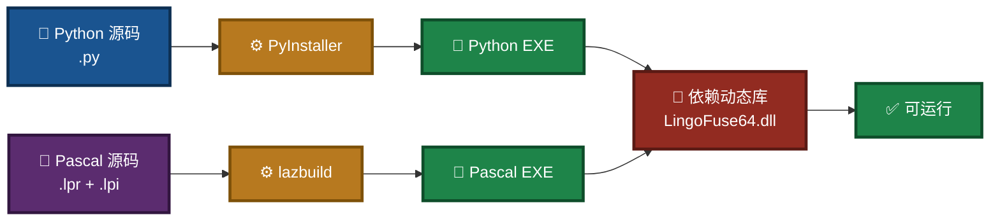
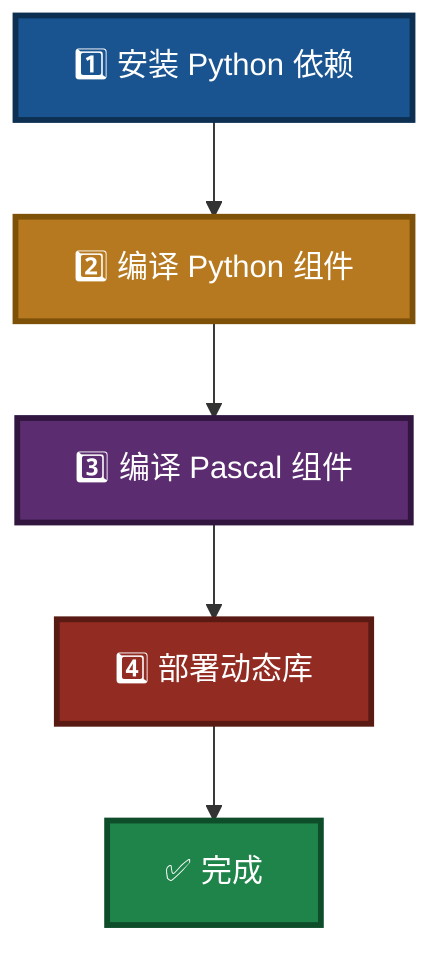

# LingoFuse-pasAgent 组件编译指南（Windows）

> **文档版本**：V4.2
> **最后更新**：2026-09-17
> **适用平台**：Windows 10/11（64 位）
> **相关文档**（同目录）：
> - 项目总览：`readme.md`
> - Pascal 开发者切入：`Pascal_Integration_Guide.md`
> - 推荐模型：`NVIDIA-Nemotron-3-Nano-Omni-30B-A3B-Reasoning-UD-IQ4_XS.md`
> - 代码生成器使用手册：`code_generate_mcp.md`
> - 声明规范：`pascal_code_mcp_rule.md`（Pascal 侧）、`C_code_mcp_rule.md`（C 侧）
> - 生态总览：`src/LingoFuse_LLM_Ecosystem_User_Guide.md`

---

## 阅读引导

本文档介绍如何将 LingoFuse-pasAgent 中的 Python 脚本和 Pascal 源代码编译为可执行文件（EXE）。建议按以下顺序阅读：

1. **只想快速编译** → 直接跳到第二章「快速开始」。
2. **想了解前置软件** → 读第一章「前置准备」。
3. **想编译某个特定组件** → 读第三、四、五章。
4. **想了解动态库部署** → 读第六章。
5. **遇到问题** → 读第七章「常见问题」。

如果你只是想**运行**预编译包而不想自己编译，请直接下载预编译包并按 `readme.md` 操作。

**本次更新（V4.2）** 修正内容：

- 1.3 节目录树完全重写，与实际仓库 `tree /f /a` 一致：补充 `llm_client_v3.pas` / `llm_client_v3.md` / `llm_tool_v3.*` / `llm_common\` / `tools\` 子目录，移除历史遗留文档。
- 3.2 / 3.3 / 3.4 节 PyInstaller 命令与仓库中 `build_*.ps1` 脚本严格对齐。
- 3.3 节依赖表修正：`llm_proxy.py` / `llm_proxy_tool.py` 已不再依赖 `requests`（SSE 客户端已改为 `http.client`）。
- 新增 4.4 节：`llm_client_v3.pas`（SDK）与 `llm_tool_v3`（GUI 演示）的编译说明。
- 重写第五章：`tools\pascal_c_to_mcp\` 目录说明（含 `code_decl_to_mcp` 的 Pascal 源码）。
- 第八章「编译产物目录」补齐全部 EXE + DLL 清单。
- 第七章 Q&A 增加 Q8–Q10（SDK 编译、生成器源码、tools 目录）。

---

## 一、前置准备

### 1.1 操作系统

- Windows 10/11（64 位推荐）

### 1.2 必需软件

| 软件 | 用途 | 获取方式 |
|------|------|----------|
| **Python 3.10+**（64 位） | 运行 PyInstaller 及 Python 脚本 | [python.org](https://python.org) |
| **PyInstaller** | 将 Python 脚本打包为 EXE | `pip install pyinstaller` |
| **Lazarus**（含 Free Pascal 3.2+） | 编译 Pascal 项目（必须使用 `lazbuild` 或 IDE） | [Lazarus IDE](https://lazarus-ide.org) |
| **LingoFuse 动态库** | 所有 EXE 的运行时依赖 | 由 LingoFuse 核心项目提供（不在本仓库），或使用预编译包内置的 DLL |

> **重要**：Pascal 项目的编译**不要直接使用 `fpc` 命令行**，因为项目依赖复杂的单元搜索路径（Z 框架、LingoFuse、SynEdit 等）。必须使用 `lazbuild` 或 Lazarus IDE，它们能正确读取 `.lpi` 文件中的配置。

### 图 1：编译工具链全景



### 1.3 源代码目录结构

本项目根目录（假设为 `D:\LingoFuse-pasAgent-v3`）的实际布局如下：

```
LingoFuse-pasAgent-v3\               ← 仓库根目录
├── readme.md
├── Build_Guide.md                   ← 本文档
├── Pascal_Integration_Guide.md
├── NVIDIA-Nemotron-3-Nano-Omni-30B-A3B-Reasoning-UD-IQ4_XS.md
├── code_generate_mcp.md             ← 代码生成器使用手册
├── pascal_code_mcp_rule.md          ← Pascal 声明规范
├── C_code_mcp_rule.md               ← C 声明规范
├── llms.txt
├── LICENSE
└── src\                             ← 所有源码与编译脚本
    ├── build_bridge.ps1             # 编译 bridge.exe
    ├── build_llm_service.ps1        # 编译 4 个 LLM EXE
    ├── build_mcp_api_tool.ps1       # 编译 mcp_api_tool.exe + mcp_api_proxy.exe
    ├── build_pascal_agent.bat       # Lazarus 一键编译 Pascal 项目
    ├── init_env.ps1                 # PowerShell 环境初始化
    ├── clear_.bat                   # 清理编译中间产物
    ├── chat_template.jinja          # Jinja2 聊天模板示例
    ├── generate_agent_json.py       # MCP 配置生成器
    ├── language_middleware.py       # MCP 中间件
    ├── mcp_api_tool.py              # MCP 网关源码
    ├── mcp_api_proxy.py             # MCP stdio 调试代理
    ├── llm_service.py               # 本地 LLM 推理服务（文本）
    ├── llm_proxy.py                 # 纯文本代理（多模态转发到后端）
    ├── llm_proxy_tool.py            # LTB：服务端工具执行 + 多模态转发
    ├── llm_test.py                  # 交互式测试客户端
    ├── llm_client_v3.pas            # Pascal 客户端 SDK
    ├── llm_client_v3.md             # Pascal SDK 文档
    ├── llm_tool_v3.lpr              # GUI 演示客户端（主程序）
    ├── llm_tool_v3.lpi              # GUI 演示客户端（Lazarus 项目）
    ├── llm_tool_v3.res              # GUI 资源文件
    ├── llm_tool_v3_frm.pas          # GUI 主窗体单元
    ├── llm_tool_v3_frm.lfm          # GUI 主窗体设计文件
    ├── pascal_agent_service.lpr/.lpi  # 信标源码
    ├── pascal_agent_api.lpr/.lpi    # 工具提供者示例
    ├── pascal_agent_api_ref_json.md # agent_main / register_agent JSON 结构详解
    ├── lingofuse_helper.pas         # 写工具时的辅助单元
    ├── lingofuse_import.pas         # 导入单元
    ├── requirements.txt             # Python 依赖清单
    ├── CreateHealthCheck\           # 环境健康检查 Pascal 项目
    │   ├── HealthCheck.lpi / .lpr / .res
    │   ├── frmMain.pas / .lfm
    │   ├── frmNewRecord.pas / .lfm
    │   └── frmnewrecord_tool_provider_unit.pas
    ├── lingofuse\                   # LingoFuse Python 绑定包
    │   ├── __init__.py
    │   ├── core.py / client.py / server.py / bridge.py / errors.py
    │   ├── _lf_native.py / serializers.py
    │   ├── test_lingofuse.py / test_bridge.py
    │   └── Bridge_User_Guide.md
    ├── llm_common\                  # LLM 共享模块（被 PyInstaller 打包）
    │   ├── __init__.py
    │   ├── attachments.py / banner.py / capabilities.py
    │   ├── headers.py / logging_setup.py / option_sanitizer.py
    │   ├── runtime.py
    │   ├── session_base.py / session_multimodal.py
    │   └── sse_client.py
    ├── tools\                       # 开发工具
    │   ├── build.bat
    │   └── pascal_c_to_mcp\         # 代码生成器 GUI（Pascal 源码）
    │       ├── code_decl_to_mcp.lpi / .lpr / .res
    │       ├── code_decl_to_mcp_frm.pas / .lfm
    │       ├── code_decl_to_mcp.ico
    │       ├── pas_mcp_generator_tool.pas
    │       ├── py_mcp_generator_tool.pas
    │       ├── code_generate_mcp.md
    │       ├── pascal_code_mcp_rule.md / .html
    │       └── C_code_mcp_rule.md / .html
    └── LingoFuse_LLM_*.md（8 份 LLM 生态文档）：
        LingoFuse_LLM_Ecosystem_User_Guide.md
        LingoFuse_LLM_Service_CLI_guide.md
        LingoFuse_LLM_Proxy_CLI_Guide.md
        LingoFuse_LLM_Proxy_Tool_CLI_Guide.md
        LingoFuse_LLM_Proxy_Compatibility_Guide.md
        LingoFuse_LLM_Pitfalls_For_AI.md
        LingoFuse_LLM_Service_Work_Summary.md
        LingoFuse_Pascal_Complete_Guide.md
```

**关键说明**：

- **没有** `llm-service\` 子目录。所有 `llm_*.py` 都直接位于 `src\`。
- **`llm_common\` 是本仓库自带的 Python 包**，被 `llm_service.py` / `llm_proxy.py` / `llm_proxy_tool.py` 共享。打包时必须一起收集。
- **`tools\pascal_c_to_mcp\` 是代码生成器的 Pascal 源码**（GUI 应用 `code_decl_to_mcp`）。它**位于本仓库**，但作为独立子系统；生成器编译产物不随主工具链一起打包。
- **LingoFuse 核心库文件**（如 `Z.LingoFuse_Core.pas`、`Z.LingoFuse_Export.pas` 等）**不在本仓库**，需从 [LingoFuse 仓库](https://github.com/PassByYou888/LingoFuse) 获取。

---

## 二、快速开始

如果你已经安装好所有前置软件，执行以下步骤即可：

### 图 2：快速编译流程



**在 `src` 目录打开 PowerShell，依次执行**：

```powershell
cd D:\LingoFuse-pasAgent-v3\src

# 1. 安装依赖
pip install -r requirements.txt
pip install pyinstaller

# 2. 编译 Python 组件（按需选择）
.\build_mcp_api_tool.ps1          # mcp_api_tool.exe + mcp_api_proxy.exe
.\build_llm_service.ps1           # llm_service.exe + llm_proxy.exe + llm_proxy_tool.exe + llm_test.exe
.\build_bridge.ps1                # bridge.exe（可选）

# 3. 编译 Pascal 组件
.\build_pascal_agent.bat
# 该脚本会用 lazbuild 编译：
#   pascal_agent_service.lpi   →  pascal_agent_service.exe
#   pascal_agent_api.lpi       →  pascal_agent_api.exe
#   CreateHealthCheck/HealthCheck.lpi → HealthCheck.exe
```

编译产物在 `src\dist\` 目录下。

---

## 三、Python 组件编译

所有 Python 脚本均可通过 PyInstaller 打包为独立的 EXE。项目已在 `src` 目录提供了 PowerShell 脚本，**强烈建议使用这些脚本**，它们已配置好必要的参数（依赖收集、数据文件等）。

### 3.1 环境准备

打开 PowerShell，进入 `src` 目录，执行以下命令安装依赖：

```powershell
cd D:\LingoFuse-pasAgent-v3\src
pip install -r requirements.txt
pip install pyinstaller
```

`requirements.txt` 按组件分场景组织，典型内容如下（具体版本以实际文件为准）：

| 依赖 | 用途 |
|------|------|
| `fastmcp` | `mcp_api_tool.py` 的 MCP 服务框架 |
| `pydantic` | FastMCP 依赖的数据模型 |
| `tzdata` | 时区数据（Windows 下 PyInstaller 需要显式收集） |
| `flask` | `bridge.py` 的 HTTP 框架 |
| `jinja2` | Flask 依赖，模板引擎 |
| `llama-cpp-python` | `llm_service.py` 的本地推理后端（按 CPU / CUDA 选择不同 wheel） |

> **注意**：`llm_proxy.py` / `llm_proxy_tool.py` **不再依赖 `requests`**——SSE 客户端已改用标准库 `http.client`。

### 3.2 编译 mcp_api_tool.exe（含 mcp_api_proxy.exe）

运行脚本：

```powershell
.\build_mcp_api_tool.ps1
```

脚本实际使用的 PyInstaller 参数（以 `mcp_api_tool.py` 为例）：

```powershell
pyinstaller --onefile `
    --name mcp_api_tool `
    --noconfirm `
    --clean `
    --paths . `
    --collect-submodules lingofuse `
    --collect-submodules llm_common `
    --collect-all fastmcp `
    --collect-all pydantic `
    --collect-all tzdata `
    --hidden-import language_middleware `
    --hidden-import generate_agent_json `
    mcp_api_tool.py
```

编译完成后，在 `dist\` 目录下将生成：

- `mcp_api_tool.exe`
- `mcp_api_proxy.exe`

> **说明**：
> - `--collect-submodules lingofuse`：收集本仓库的 `lingofuse` Python 包（含 `_lf_native.py` 等 ctypes 绑定）。
> - `--collect-submodules llm_common`：收集本仓库的共享模块。`mcp_api_tool` 运行时不直接使用，但脚本保持一致。
> - `--collect-all fastmcp / pydantic / tzdata`：这些第三方包在运行时依赖数据文件，`--collect-all` 确保完整打包。
> - `--hidden-import language_middleware`：`mcp_api_tool.py` 通过 `try/except ImportError` 保护导入该模块，PyInstaller 静态分析无法看到，必须显式声明。
> - `--hidden-import generate_agent_json`：同理，`--generate-configs` 功能依赖该模块。

### 3.3 编译 4 个 LLM EXE

`build_llm_service.ps1` 一次性编译 **4 个** EXE：

| 源文件 | 输出 | 运行/打包依赖 |
|--------|------|--------------|
| `llm_service.py` | `llm_service.exe` | `llama_cpp`、`jinja2`（**打包时需已安装 `llama-cpp-python`**） |
| `llm_proxy.py` | `llm_proxy.exe` | 标准库 `http.client` / `ssl`（无第三方依赖） |
| **`llm_proxy_tool.py`** | **`llm_proxy_tool.exe`** | 标准库 + **`language_middleware`**（本仓库模块） |
| `llm_test.py` | `llm_test.exe` | 仅 `lingofuse`（本仓库模块） |

运行脚本：

```powershell
.\build_llm_service.ps1
```

脚本会对每个目标执行一次 PyInstaller 调用，公共参数如下：

```powershell
--onefile
--name <target>
--noconfirm
--clean
--paths .
--collect-submodules lingofuse
--collect-submodules llm_common
```

以 `llm_proxy_tool.py` 为例，额外追加：

```powershell
--hidden-import language_middleware
```

> **注意**：
> - **`--collect-submodules llm_common` 是必需的**——`llm_proxy.py` / `llm_proxy_tool.py` 直接导入 `llm_common.attachments`、`llm_common.sse_client` 等模块，静态分析可以看见，但用 `--collect-submodules` 更保险。
> - `llm_proxy_tool.py` 必须显式声明 `--hidden-import language_middleware`，因为源码中该模块是 `try/except ImportError` 保护导入。
> - **不再需要** `--hidden-import requests`：`sse_client.py` 已改写为纯标准库 `http.client`。
> - `http.client` 与 `ssl` 是 Python 标准库，PyInstaller 默认会打包，无需显式声明。

编译完成后，在 `dist\` 目录下将生成：

- `llm_service.exe`
- `llm_proxy.exe`
- `llm_proxy_tool.exe`
- `llm_test.exe`

> 如需支持 CUDA 或 Vulkan，请先安装对应的 `llama-cpp-python` GPU 版本，再运行脚本。

### 3.4 编译 bridge.exe

`bridge.py` 位于 `src\lingofuse\` 子目录（不是 `src\` 根目录）。脚本会自动使用正确的源文件路径。

```powershell
.\build_bridge.ps1
```

脚本实际使用的 PyInstaller 参数：

```powershell
pyinstaller --onefile `
    --name bridge `
    --noconfirm `
    --clean `
    --paths . `
    --collect-submodules lingofuse `
    --collect-all flask `
    --collect-all jinja2 `
    --hidden-import requests `
    lingofuse\bridge.py
```

生成 `bridge.exe`，位于 `dist\` 目录下。

> **说明**：`--hidden-import requests` 保留是因为 `bridge.py` 的 `--debug` 分支可能探测后端 `/v1/models`；实际上主流程不依赖它，但保留声明以保证完整打包。

---

## 四、Pascal 组件编译

Pascal 项目必须使用 **Lazarus**（或 `lazbuild`）编译，**不要直接调用 `fpc`**。

### 4.1 环境准备

- 安装 Lazarus IDE（包含 Free Pascal 编译器）。
- 确保 `lazbuild.exe` 位于系统 PATH 中，或使用绝对路径。

### 4.2 使用 build_pascal_agent.bat 一键编译

在 `src` 目录双击或命令行执行：

```bat
build_pascal_agent.bat
```

该脚本内容大致如下：

```bat
lazbuild.exe -B ./pascal_agent_service.lpi
lazbuild.exe -B ./pascal_agent_api.lpi
lazbuild.exe -B ./CreateHealthCheck/HealthCheck.lpi
echo 所有项目编译完成。
timeout /t 5 /nobreak >nul
```

执行后，将编译并生成：

- `pascal_agent_service.exe`（信标）
- `pascal_agent_api.exe`（工具提供者示例）
- `HealthCheck.exe`（在 `CreateHealthCheck\` 目录下）

### 4.3 单独编译某个 Pascal 项目（使用 lazbuild）

```cmd
lazbuild.exe -B .\pascal_agent_service.lpi
```

或者使用 Lazarus IDE：打开 `.lpi` 文件，按 `Ctrl+F9` 编译。

### 4.4 编译 `llm_client_v3`（Pascal SDK）

`llm_client_v3.pas` 是 **SDK 单元**，本身**不能单独编译为 EXE**——它需要被你的 Pascal 项目引用。有两种使用方式：

**方式 A：把 SDK 作为单元引入你的项目**

在项目 `.lpr` / 单元的 `uses` 段加上：

```pascal
uses
  ..., llm_client_v3, lingofuse_import;
```

并在项目搜索路径中加入 `src\`（`llm_client_v3.pas` 和 `lingofuse_import.pas` 所在目录）。

**方式 B：编译 `llm_tool_v3`（GUI 演示客户端）**

`llm_tool_v3.lpi` 是一个完整的 Lazarus 项目，可以直接编译：

```cmd
cd D:\LingoFuse-pasAgent-v3\src
lazbuild.exe -B .\llm_tool_v3.lpi
```

生成 `llm_tool_v3.exe`（GUI 演示程序），演示内容：

- 连接 `llm_service` / `llm_proxy` / `llm_proxy_tool`
- 多会话管理
- 流式输出（`chunk` / `think`）
- 多模态附件发送（图片 / 文本）
- 能力矩阵查询

`llm_tool_v3.lpi` 的编译依赖：

| 依赖项 | 来源 |
|--------|------|
| `llm_client_v3.pas` | 本仓库 `src\` |
| `lingofuse_import.pas` | 本仓库 `src\` |
| `lingofuse_helper.pas` | 本仓库 `src\` |
| `zCore\`（Z 框架） | git 子模块，需 `git submodule update --init --recursive` |
| SynEdit 组件（Lazarus 内置） | Lazarus IDE 自带 |

### 图 3：Pascal 编译流程


---

## 五、代码生成器（`tools\pascal_c_to_mcp\`）

代码生成器 **`code_decl_to_mcp`** 的 **Pascal 源码位于本仓库**：

```
src\tools\pascal_c_to_mcp\
├── code_decl_to_mcp.lpi / .lpr / .res      # Lazarus 项目
├── code_decl_to_mcp_frm.pas / .lfm         # GUI 主窗体
├── code_decl_to_mcp.ico                    # 图标
├── pas_mcp_generator_tool.pas              # Pascal 输出生成器
├── py_mcp_generator_tool.pas               # Python 输出生成器（v5.0 新增）
├── code_generate_mcp.md                    # 使用手册（与本仓库根目录同名文档内容一致）
├── pascal_code_mcp_rule.md / .html         # Pascal 声明规范
└── C_code_mcp_rule.md / .html              # C 声明规范
```

### 5.1 编译步骤

```cmd
cd D:\LingoFuse-pasAgent-v3\src\tools\pascal_c_to_mcp
lazbuild.exe -B .\code_decl_to_mcp.lpi
```

生成 `code_decl_to_mcp.exe`（GUI 应用）。

> **注意**：该生成器依赖 **LingoFuse 核心仓库** 中的 `Z.Pascal_Func_Tool.pas`、`pascal_func_model.pas` 等单元。若源码不完整，编译会报 `Can't find unit Z.Pascal_Func_Tool`——请从 [LingoFuse 仓库](https://github.com/PassByYou888/LingoFuse) 获取对应单元并加入搜索路径。

### 5.2 使用方式

生成器是 **GUI 应用**，不是命令行工具。使用流程：

1. 启动 `code_decl_to_mcp.exe`
2. 粘贴 Pascal / C 声明
3. 走完 5 层转换（source → LV0 JSON → LV1 JSON → final source）
4. 在「Final source」Tab 中：
   - `pas_TabSheet` → 复制 → 保存为 `.pas` → `lazbuild` 编译
   - `Py_TabSheet` → 复制 → 保存为 `.py` → 直接 `python xxx_tool_provider.py`

详见根目录 `code_generate_mcp.md`。

### 5.3 快速使用（无需自己编译）

如果你不想自己编译生成器，可以直接从项目的预编译发布页获取 `code_decl_to_mcp.exe`，或从预编译包中取用。

---

## 六、LingoFuse 动态库部署

所有编译出的 EXE 运行时都需要 `LingoFuse64.dll`（Windows）或 `liblingofuse.so`（Linux）。该库由 LingoFuse 核心项目提供，不包含在本仓库中。

### 图 4：动态库部署两种方式


### 6.1 推荐部署方法：加入系统 PATH

1. 克隆 LingoFuse 仓库（需 `--recursive` 拉取子模块）：

```bash
git clone --recursive https://github.com/PassByYou888/LingoFuse.git
```

2. 将 LingoFuse 的 `Binary` 目录（或包含 `LingoFuse64.dll` 的目录）加入系统 `PATH`：

   - **Windows（永久）**：系统属性 → 环境变量 → 编辑 `Path`，添加该目录。
   - **Windows（临时）**：
     ```powershell
     $env:PATH = "D:\LingoFuse\Binary;$env:PATH"
     ```
   - **Linux/macOS**：
     ```bash
     export PATH=/path/to/LingoFuse/Binary:$PATH
     ```

### 6.2 备选方案：复制到每个 EXE 目录

如果不想修改 PATH，可以将动态库复制到每个 EXE 所在目录（例如 `src\dist\`）。

### 6.3 ⚠️ 运行环境依赖

预编译 DLL 使用 **Visual Studio 2022** 编译，运行时需要安装 **VS2022 可再发行组件（VC++ Redistributable）**。

请从微软官方下载并安装对应架构的版本：

- [VC++ Redistributable for Visual Studio 2022 (x86/x64)](https://learn.microsoft.com/en-us/cpp/windows/latest-supported-vc-redist?view=msvc-170)

### 6.4 预编译包中的 DLL 清单

使用预编译包（`releases/tag/pre_build`）时，以下 DLL 已随包提供：

| 类别 | 文件 |
|------|------|
| LingoFuse 核心 | `LingoFuse32.dll` / `LingoFuse64.dll` |
| IPC 依赖 | `z_ipc_32.dll` / `z_ipc_64.dll`（及调试版 `z_ipc_32d.dll` / `z_ipc_64d.dll`） |
| 内存分配器 | `mimalloc32.dll` / `mimalloc64.dll` / `mimalloc-redirect.dll` / `mimalloc-redirect32.dll` |

---

## 七、常见问题

### Q1：运行 EXE 时提示 `Failed to load LingoFuse64.dll`

**原因**：动态库不在 PATH 或 EXE 同目录。

**解决**：

- 确保 `LingoFuse64.dll` 与 EXE 在同一目录，或已在系统 `PATH` 中。
- 检查动态库位数是否与 EXE 一致（64 位 vs 32 位）。
- 检查是否安装了 VC++ Redistributable。

### Q2：PyInstaller 打包后运行报 `ModuleNotFoundError`

**原因**：某些模块未被打包。

**解决**：

- 检查项目的 `build_*.ps1` 脚本，它们已配置好所需参数。
- `llm_proxy_tool.exe` 需要 `--hidden-import language_middleware`（源码里是 `try/except` 导入，静态分析不可见）。
- `mcp_api_tool.exe` 需要 `--hidden-import language_middleware --hidden-import generate_agent_json`（`--generate-configs` 功能依赖后者）。
- **`llm_proxy` / `llm_proxy_tool` 不再需要 `--hidden-import requests`**——SSE 客户端已改为纯标准库 `http.client`。如你的构建脚本里仍保留该 flag，可以安全移除。
- `llm_common` 包用 `--collect-submodules llm_common` 收集，避免遗漏子模块。

### Q3：Pascal 编译报 `Can't find unit Z.Core`

**原因**：单元搜索路径未配置，或 git 子模块未初始化。

**解决**：

- 先执行 `git submodule update --init --recursive` 拉取 `zCore\`。
- 确保使用 `lazbuild` 编译，因为 `.lpi` 中已配置单元搜索路径。
- 若手动调用 `fpc`，需手动指定 `-Fu` 路径，极易出错，请改用 `lazbuild`。

### Q4：编译的 EXE 体积过大

**解决**：

- 使用 `--upx-dir` 参数启用 UPX 压缩（需先下载 UPX），可显著减小体积。
- 但 `--onefile` 模式本身会增大启动解压开销，若体积敏感，可改用 `--onedir` 模式。

### Q5：使用 `--generate-configs` 时找不到 `generate_agent_json` 模块

**解决**：

- 确保 `generate_agent_json.py` 在 `src\` 目录（与 `mcp_api_tool.py` 同目录）。
- 打包时已包含 `--hidden-import generate_agent_json`。

### Q6：`build_llm_service.ps1` 编译时找不到 `llama_cpp` 模块

**原因**：未安装 `llama-cpp-python`。

**解决**：

```powershell
# CPU 版本
pip install llama-cpp-python --extra-index-url https://abetlen.github.io/llama-cpp-python/whl/cpu

# 或 CUDA 版本（根据你的 CUDA 版本选择）
pip install llama-cpp-python --extra-index-url https://abetlen.github.io/llama-cpp-python/whl/cu124
```

> **注意**：`llama-cpp-python` 是 `llm_service.py` 的运行时依赖。打包 `llm_service.exe` **前** 必须在当前 Python 环境安装它。

### Q7：编译完成后，如何知道每个 EXE 的用途？

| EXE | 用途 |
|-----|------|
| `pascal_agent_service.exe` | 信标，管理所有工具注册 |
| `pascal_agent_api.exe` | 工具提供者示例 |
| `mcp_api_tool.exe` | MCP 网关（路径 A） |
| `mcp_api_proxy.exe` | stdio 调试代理 |
| `llm_service.exe` | 本地 LLM 推理服务（文本） |
| `llm_proxy.exe` | 纯文本代理，转发到外部 OpenAI 兼容后端（多模态转发） |
| **`llm_proxy_tool.exe`** | **转发 + 服务端侧工具执行（LTB，路径 B）** |
| `llm_test.exe` | 命令行 LLM 测试客户端 |
| `llm_tool_v3.exe` | Pascal GUI 演示客户端（演示 `llm_client_v3` 用法） |
| `bridge.exe` | HTTP 网关（可选） |
| `HealthCheck.exe` | 环境健康检查工具 |
| `code_decl_to_mcp.exe` | 代码生成器（GUI，Pascal + Python 双输出） |

**路径 A vs 路径 B 选哪个**：

- 客户端支持 MCP 工具（LM Studio、Claude Desktop 等） → 用 `mcp_api_tool.exe`
- 客户端只发 `generate`（部分 Pascal GUI、自研前端） → 用 `llm_proxy_tool.exe`

### Q8：如何编译 `llm_client_v3` / `llm_tool_v3`？

**A**：

- `llm_client_v3.pas` 是 **SDK 单元**，不需要单独编译——把它加入你的 Pascal 项目搜索路径，在 `uses` 段引用即可（详见 4.4 节）。
- `llm_tool_v3.lpi` 是一个完整的 Lazarus GUI 项目，执行 `lazbuild.exe -B .\llm_tool_v3.lpi` 即可生成 `llm_tool_v3.exe`。
- 编译前确保 git 子模块 `zCore\` 已初始化。

### Q9：`code_decl_to_mcp` 源码在哪里？

**A**：在 **本仓库** 的 `src\tools\pascal_c_to_mcp\` 目录下（Pascal 源码 + Lazarus 项目 + 声明规范 + 使用手册）。它**不是**独立发布的二进制——源码随仓库分发。

### Q10：`src\tools\pascal_c_to_mcp\` 是什么？

**A**：它是 **代码生成器 GUI 子系统**，包含：

- `code_decl_to_mcp.*`：GUI 主程序（把 Pascal / C 声明转换为工具提供者）
- `pas_mcp_generator_tool.pas`：Pascal 输出生成器
- `py_mcp_generator_tool.pas`：Python 输出生成器（v5.0 新增）
- `*_rule.md` / `.html`：声明规范（与根目录同名文档内容一致）

它与主工具链（`pascal_agent_*`、`mcp_api_*`、`llm_*`）**独立**，可以单独编译和运行。

---

## 八、编译产物目录

最终编译后，建议将所有 EXE 和依赖动态库放在同一目录，以便分发：

```
src\dist\
├── LingoFuse32.dll                       # 从 LingoFuse 仓库复制或通过 PATH 提供
├── LingoFuse64.dll
├── z_ipc_32.dll / z_ipc_64.dll           # IPC 依赖
├── z_ipc_32d.dll / z_ipc_64d.dll         # 调试版（可选）
├── mimalloc32.dll / mimalloc64.dll       # 内存分配器
├── mimalloc-redirect.dll / mimalloc-redirect32.dll
│
├── pascal_agent_service.exe              # 信标
├── pascal_agent_api.exe                  # 工具提供者示例
├── mcp_api_tool.exe                      # MCP 网关（路径 A）
├── mcp_api_proxy.exe                     # MCP stdio 调试代理
├── llm_service.exe                       # 本地推理（文本）
├── llm_proxy.exe                         # 纯文本代理
├── llm_proxy_tool.exe                    # LTB（路径 B）
├── llm_test.exe                          # CLI 测试客户端
├── llm_tool_v3.exe                       # Pascal GUI 演示客户端（可选）
├── bridge.exe                            # HTTP 桥接（可选）
├── HealthCheck.exe                       # 环境健康检查
├── code_decl_to_mcp.exe                  # 代码生成器（GUI）
│
├── NVIDIA-Nemotron-3-Nano-Omni-30B-A3B-Reasoning-UD-IQ4_XS.gguf  # 可选，用于 llm_service
├── mmproj-F16.gguf                        # 可选，VLM 视觉编码器（后端加载）
└── (配置文件、文档等)
```

> **提示**：
> - `mcp_api_proxy.exe` 在 stdio 调试模式下作为独立的代理进程使用，需要与 `mcp_api_tool.exe` 位于同一目录；它与 `mcp_api_tool.exe` 会一起被 `build_mcp_api_tool.ps1` 打包。
> - `llm_tool_v3.exe` 是 **Pascal GUI 程序**，与 Python 打包脚本无关，需通过 `lazbuild` 单独编译。

---

## 九、相关文档

### 根目录文档

| 文档 | 说明 |
|------|------|
| `readme.md` | 项目总览与四大核心应用组件 |
| `Pascal_Integration_Guide.md` | Pascal 开发者切入指南 |
| `NVIDIA-Nemotron-3-Nano-Omni-30B-A3B-Reasoning-UD-IQ4_XS.md` | 推荐模型下载与部署 |
| `code_generate_mcp.md` | 代码生成器使用手册 |
| `pascal_code_mcp_rule.md` | Pascal 声明规范（解析契约） |
| `C_code_mcp_rule.md` | C 声明规范（解析契约） |
| `llms.txt` | 面向 AI 助手的项目速览 |

### `src` 目录文档

| 文档 | 说明 |
|------|------|
| `src/LingoFuse_LLM_Ecosystem_User_Guide.md` | 生态总览（四大应用组件 + 两条路径） |
| `src/LingoFuse_LLM_Service_CLI_guide.md` | `llm_service.exe` 命令行手册 |
| `src/LingoFuse_LLM_Proxy_CLI_Guide.md` | `llm_proxy.exe` 命令行手册 |
| `src/LingoFuse_LLM_Proxy_Tool_CLI_Guide.md` | `llm_proxy_tool.exe`（LTB）命令行手册 |
| `src/LingoFuse_LLM_Proxy_Compatibility_Guide.md` | 250+ 后端兼容清单 |
| `src/LingoFuse_LLM_Pitfalls_For_AI.md` | 踩坑大全（P0–P8 系列） |
| `src/LingoFuse_LLM_Service_Work_Summary.md` | LLM 工具链版本演进 |
| `src/LingoFuse_Pascal_Complete_Guide.md` | Pascal 核心层完整指南 |
| `src/llm_client_v3.md` | Pascal 客户端 SDK 文档 |
| `src/lingofuse/Bridge_User_Guide.md` | HTTP 桥接网关使用指南 |
| `src/pascal_agent_api_ref_json.md` | `agent_main` / `register_agent` JSON 结构详解 |

---

**文档版本**：V4.2（目录树重写、PyInstaller 命令与脚本对齐、SDK 编译章节、tools 目录说明、DLL 清单补全）
**维护者**：LingoFuse-pasAgent 团队
**反馈**：问题提 Issue，急事加 Q（600585）
