# C 声明规范（Z.Pascal_Func_Tool 工具链兼容）

**版本**：1.0
**最后更新**：2026-09-12
**约束对象**：`Fill_C` → `Translate_C_Typ_To_Pascal` → `Z.Pascal_Func_Model` → `pas_mcp_generator_tool` 完整工具链
**文档定位**：本规范即 **C 解析契约**。任何偏离都会导致声明被 **静默跳过**。请严格按本规范书写。

---

## 0. 三十秒速览

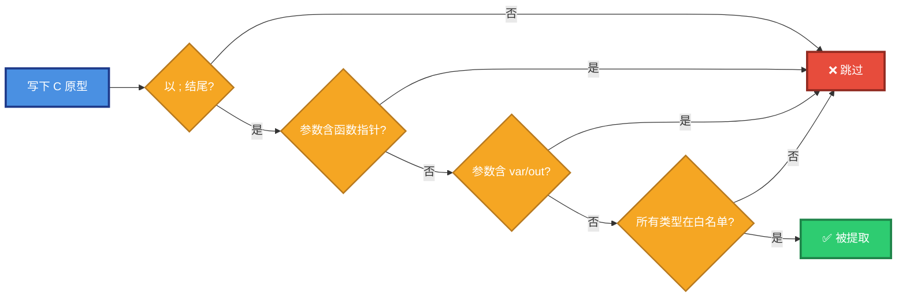

**五条铁律**：

| # | 铁律 | 说明 |
|:-:|------|------|
| 1 | 🎯 **形式** | **顶层函数原型，以 `;` 结尾** |
| 2 | 📍 **位置** | **不在 `{ ... }` 函数体内、不在类型定义中** |
| 3 | 🚫 **参数** | **不含函数指针**（`(*name)(...)`） |
| 4 | ✅ **类型** | **必须命中 C 类型白名单** |
| 5 | 💬 **注释** | **紧邻上方**（允许空行） |

> ⚠️ **一条铁律违反 = 整条声明跳过**，不做局部忽略。

---

## 1. 声明位置规则

### 1.1 C 头文件的解剖图

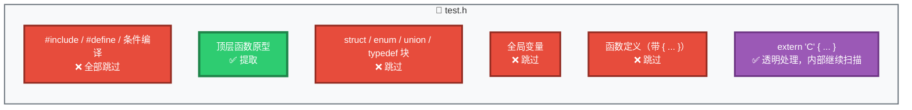

### 1.2 会提取 vs 不会提取

| 位置 | 结果 | 示例 |
|------|:----:|------|
| 顶层函数原型 | 🟢 ✅ **提取** | `int add(int a, int b);` |
| `extern "C" { ... }` 内部原型 | 🟣 ✅ **提取**（透明块） | `extern "C" { int foo(void); }` |
| 预处理指令 | 🔴 ❌ **跳过** | `#include <stdio.h>` |
| `struct` / `enum` / `union` / `typedef` 块 | 🔴 ❌ **跳过** | `struct Point { int x; };` |
| 全局变量声明 | 🔴 ❌ **跳过** | `int global_var;` |
| 带初始化的变量 | 🔴 ❌ **跳过** | `int x = 42;` |
| 函数定义（带 `{ ... }`） | 🔴 ❌ **跳过** | `int f() { return 1; }` |
| 含函数指针参数的原型 | 🔴 ❌ **跳过** | `void set_cb(void (*cb)(int));` |

### 1.3 位置示例

```c
/* test.h - 位置示例 */
#ifndef TEST_H
#define TEST_H

#include <stdio.h>              /* 🔴 跳过：预处理 */
#define MAX_SIZE 1024           /* 🔴 跳过：预处理 */

/* ✅ 提取：顶层函数原型 */
int add(int a, int b);

/* 🔴 跳过：函数定义（带函数体） */
int sub(int a, int b) {
    return a - b;
}

/* 🔴 跳过：结构体定义 */
struct Point {
    int x;
    int y;
};

/* 🔴 跳过：全局变量 */
int global_counter;

/* 🔴 跳过：带初始化的变量 */
int initialized = 42;

/* 🟣 提取：extern "C" 内的原型 */
extern "C" {
    int mul(int a, int b);
}

#endif /* TEST_H */
```

---

## 2. 参数修饰符规则

### 2.1 修饰符判定图

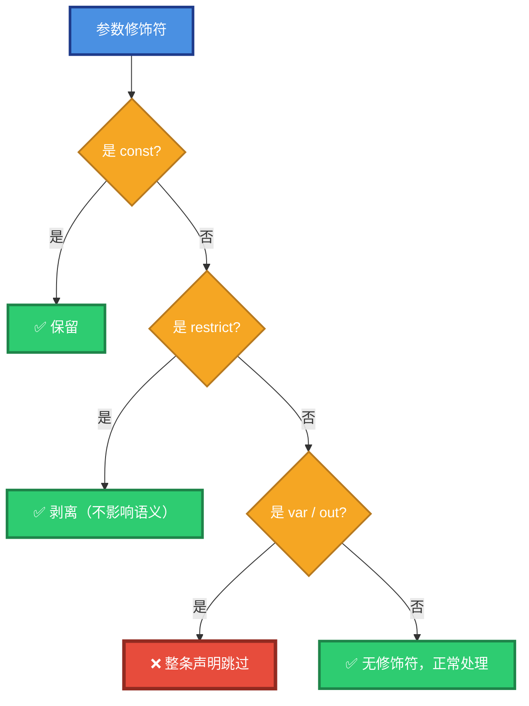

### 2.2 修饰符白名单

| 修饰符 | 是否允许 | 处理方式 |
|--------|:--------:|----------|
| 无修饰符 | 🟢 ✅ **允许** | 默认值传递 |
| `const` | 🟢 ✅ **允许** | **保留**，前置到类型前 |
| `restrict` / `__restrict` / `__restrict__` | 🟢 ✅ **允许** | **静默剥离**，仅保留基类型 |
| `volatile` | 🟡 ⚠️ **允许**（返回类型中被过滤） | 参数中会被保留在类型文本里 |
| `var`（Pascal 专属） | 🔴 ❌ **禁止** | **整条声明跳过** |
| `out`（Pascal 专属） | 🔴 ❌ **禁止** | **整条声明跳过** |

### 2.3 `const` 的两种位置都可识别

C 允许 `const` 出现在类型的**前缀或后缀**：

```c
/* ✅ 前缀形式 */
int foo(const char *s);

/* ✅ 后缀形式（等价） */
int foo(char const *s);

/* ✅ 指针后置形式 */
int bar(int * const p);
```

> 🟢 三种形式都会在 `param_mod` 中被标记为 `const`。

### 2.4 `restrict` 剥离的原因


`restrict` 是优化提示，不改变原型语义。但直接透传会污染类型字符串，导致下游映射失败。

```c
/* 输入 */
int memcpy_opt(void * restrict dst, const void * restrict src, size_t n);

/* 剥离后类型 */
/* dst: void *  /  src: const void *  /  n: UInt64 */
```

### 2.5 为什么禁止 `var` / `out`

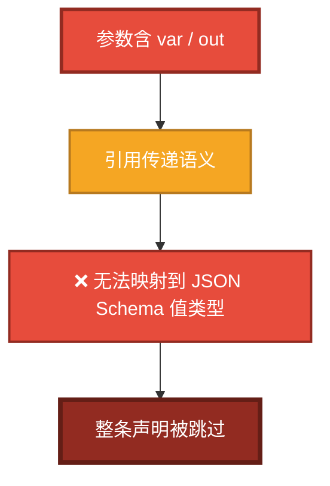

> 🔴 `var` / `out` 是 Pascal 的引用传递语法，**C 中不存在**。工具链在 C 模式下会检测声明中是否含这类修饰符（防御性检查），若存在则跳过整条声明。

---

## 3. 类型白名单

### 3.1 类型分类图

```mermaid
mindmap
  root(("C 类型白名单"))
    有符号整数
      signed char
      short
      int
      long
      long long
      int8_t / int16_t / int32_t / int64_t
    无符号整数
      unsigned char
      unsigned short
      unsigned int
      unsigned long
      unsigned long long
      uint8_t / uint16_t / uint32_t / uint64_t
    指针宽度整数
      size_t
      uintptr_t
      ssize_t
      ptrdiff_t
      intptr_t
    浮点
      float
      double
      long double
    字符串
      char *
      const char *
      char const *
    通用指针
      任意含 * 的类型
    Void
      void（仅作返回值）
```

### 3.2 C → Pascal 精确映射表

| C 类型 | Pascal 归一化 | JSON Schema | 颜色 |
|--------|:-------------:|:-----------:|:----:|
| `signed char` / `int8_t` | `ShortInt` | `integer` | 🔵 |
| `short` / `int16_t` | `SmallInt` | `integer` | 🔵 |
| `int` / `int32_t` | `Integer` | `integer` | 🔵 |
| `long` | `LongInt` | `integer` | 🔵 |
| `long long` / `int64_t` | `Int64` | `integer` | 🔵 |
| `unsigned char` / `uint8_t` | `Byte` | `integer` | 🟢 |
| `unsigned short` / `uint16_t` | `Word` | `integer` | 🟢 |
| `unsigned int` / `uint32_t` | `Cardinal` | `integer` | 🟢 |
| `unsigned long` | `LongWord` | `integer` | 🟢 |
| `unsigned long long` / `uint64_t` | `UInt64` | `integer` | 🟢 |
| `size_t` / `uintptr_t` | `UInt64` | `integer` | 🟢 |
| `ssize_t` / `ptrdiff_t` / `intptr_t` | `Int64` | `integer` | 🔵 |
| `float` | `Single` | `number` | 🟡 |
| `double` | `Double` | `number` | 🟡 |
| `long double` | `Extended` | `number` | 🟡 |
| `char *` / `const char *` / `char const *` | `string` | `string` | 🟣 |
| 任意其他 `T *` | `Pointer` | `string` | 🟣 |
| `void`（返回值） | `''` | 降级为 procedure | ⚪ |

### 3.3 明确禁止的类型

> 🔴 **以下类型一律导致整条声明跳过**

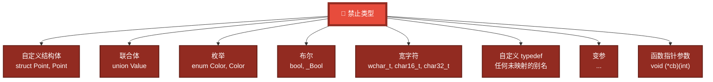

### 3.4 边界示例

```c
/* 🟢 ✅ 通过 */
int add(int a, int b);
unsigned int get_unsigned(void);
long long get_longlong(void);
float get_float(void);
double get_double(void);
const char * get_error_message(int code);
void * void_ptr_return(int size);
void restrict_param(void * p);
int arr_param(int buf[], int len);

/* 🔴 ❌ 跳过：Boolean */
_Bool is_even(int x);

/* 🔴 ❌ 跳过：结构体参数 */
double distance(struct Point p1, struct Point p2);

/* 🔴 ❌ 跳过：枚举参数 */
int set_color(enum Color c);

/* 🔴 ❌ 跳过：宽字符 */
int print_wide(wchar_t *s);

/* 🔴 ❌ 跳过：函数指针 */
void set_callback(void (*cb)(int));

/* 🔴 ❌ 跳过：变参 */
int printf_like(const char *fmt, ...);

/* 🔴 ❌ 跳过：联合体参数 */
void set_value(union Value v);
```

---

## 4. 数组后缀规则

### 4.1 数组后缀识别

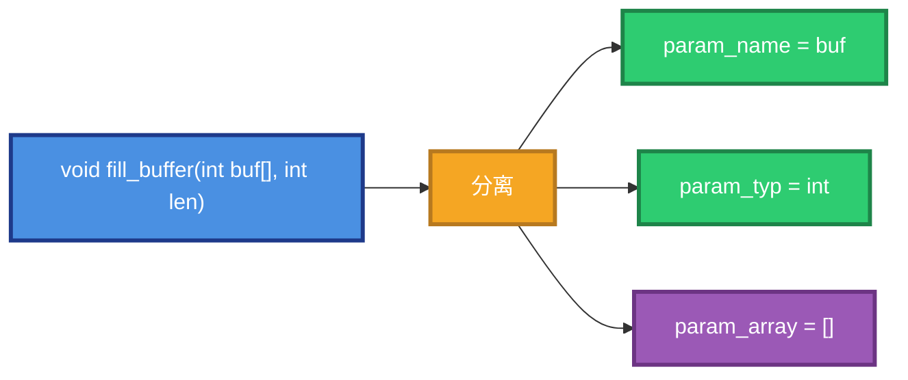

### 4.2 支持的数组后缀形式

| 输入 | `param_array` | 颜色 |
|------|:-------------:|:----:|
| `int buf[]` | `[]` | 🟢 |
| `int buf[10]` | `[10]` | 🟢 |
| `int buf[N]` | `[N]` | 🟢 |
| `int buf` | `''`（无后缀） | ⚪ |

### 4.3 下游输出对照

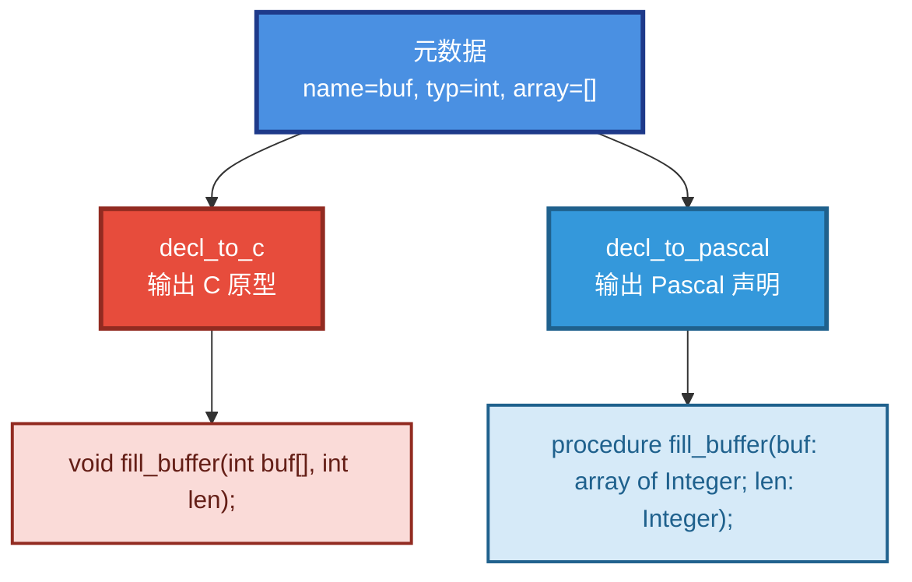

### 4.4 多维数组

> 🔴 **不支持**。`int arr[][]` 会被跳过。

---

## 5. 注释绑定规则

### 5.1 绑定规则图

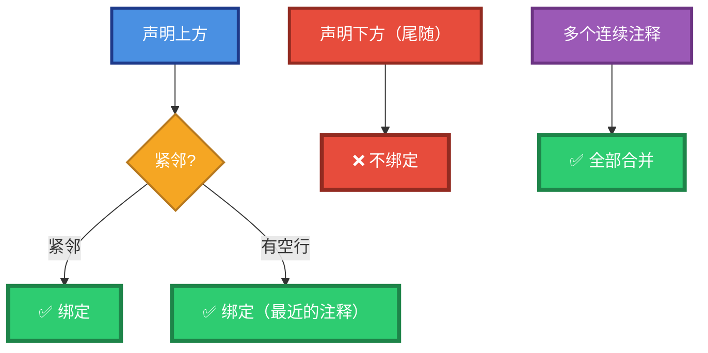

### 5.2 绑定规则表

| 情形 | 是否绑定 | 说明 |
|------|:--------:|------|
| `/* ... */` 紧邻声明上方 | 🟢 ✅ **绑定** | 标准写法 |
| `//` 单行注释紧邻上方 | 🟢 ✅ **绑定** | 单行风格 |
| Doxygen `/** ... */` 上方 | 🟢 ✅ **绑定** | 剥离 `*` 前缀 |
| 多行注释 → 声明 | 🟢 ✅ **绑定** | 自动规范化 |
| 注释1 → 注释2 → 声明 | 🟢 ✅ **全部绑定** | 按顺序拼接 |
| 声明 → 尾随注释 | 🔴 ❌ **不绑定** | 尾随注释被忽略 |
| 无注释 | 🟡 ⚠️ **允许** | `Comment` 为空 |

### 5.3 多行注释自动规范化


**输入**：
```c
/* This is a comment
that spans multiple
lines */
int foo(void);
```

**元数据中的 Comment**：
```
/* This is a comment
 * that spans multiple
 * lines */
```

### 5.4 Doxygen 风格


**输入**：
```c
/**
 * 计算两个整数的和。
 * @param a 第一个加数
 * @param b 第二个加数
 */
int add(int a, int b);
```

**元数据中的 Comment**（Pascal 风格）：
```
{ 计算两个整数的和。
 * @param a 第一个加数
 * @param b 第二个加数 }
```

---

## 6. Unit Name 智能提取

### 6.1 提取策略（优先级）

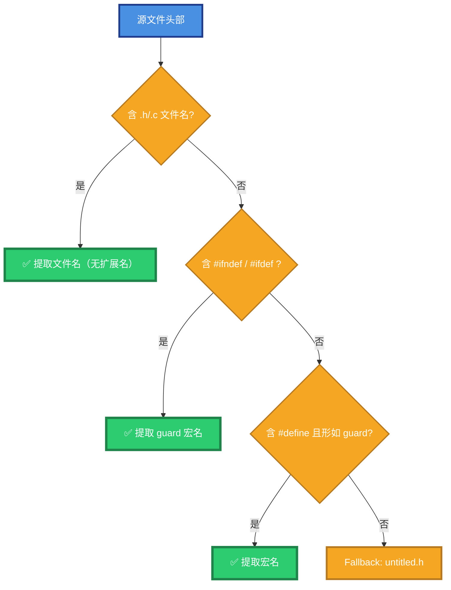

### 6.2 提取效果

| 输入头部 | 输出 unit name | 结果 |
|----------|----------------|:----:|
| `/* foo.h ... */` | `foo` | 🟢 |
| `// bar.c` | `bar` | 🟢 |
| `#ifndef FOO_H` | `FOO` | 🟢 |
| `#ifndef __FOO_H__` | `FOO` | 🟢 |
| `#ifndef FOO_HPP` | `FOO` | 🟢 |
| `#ifndef FOO_INCLUDED` | `FOO` | 🟢 |
| `#define MAX_SIZE 1024` | `untitled.h`（不是 guard） | 🟡 |
| `/* 1.0.3.h */` | `untitled.h`（非法标识符） | 🟡 |
| 空文本 | `untitled.h` | 🟡 |

### 6.3 Guard 后缀剥离


支持的 guard 后缀（最长优先）：

- `_INCLUDED`
- `_HXX` / `_HPP`
- `_H__` / `_H_` / `_H`

同时剥离前后下划线。

---

## 7. 完整示例

### 7.1 正面示例（全部通过）

```c
/* sample.h - 正面示例 */
#ifndef SAMPLE_H
#define SAMPLE_H

#include <stddef.h>

/* 计算两个整数的和。 */
int add(int a, int b);

/*
 * 无符号整数示例。
 */
unsigned int get_unsigned(void);

/* 64 位有符号整数。 */
long long get_longlong(void);

/* 单精度浮点。 */
float get_float(void);

/* 双精度浮点。 */
double get_double(void);

/**
 * 获取错误信息。
 * @param code 错误码
 * @return 错误描述字符串
 */
const char * get_error_message(int code);

/* 返回无类型指针。 */
void * void_ptr_return(int size);

/* 带 restrict 修饰的指针参数。 */
void restrict_param(void * p);

/* 数组参数示例。 */
void fill_buffer(int buf[], int len);

#endif /* SAMPLE_H */
```

> 🟢 **解析结果**：8 条原型全部提取，类型精确映射，注释规范化。

### 7.2 反面示例（全部跳过）

```c
/* bad.h - 反面示例 */

/* 🔴 跳过：函数定义（带函数体） */
int internal_helper(void) {
    return 42;
}

/* 🔴 跳过：布尔返回类型 */
_Bool is_even(int x);

/* 🔴 跳过：结构体参数 */
double distance(struct Point p1, struct Point p2);

/* 🔴 跳过：枚举参数 */
int set_color(enum Color c);

/* 🔴 跳过：宽字符 */
int print_wide(wchar_t *s);

/* 🔴 跳过：函数指针参数 */
void set_callback(void (*cb)(int));

/* 🔴 跳过：变参 */
int printf_like(const char *fmt, ...);

/* 🔴 跳过：联合体参数 */
void set_value(union Value v);

/* 🔴 跳过：全局变量 */
int global_counter;

/* 🔴 跳过：带初始化 */
int initialized = 42;

/* 🔴 跳过：结构体定义 */
struct Foo {
    int x;
    int y;
};
```

> 🔴 **解析结果**：全部跳过，Report 中显示每条跳过原因。

---

## 8. 常见错误对照表

| 错误写法 | 后果 | 正确写法 |
|----------|:----:|----------|
| `int f() { ... }` | 🔴 整条跳过（函数定义） | `int f(void);` 声明 |
| `int f(int a, ...)` | 🔴 整条跳过（变参） | 使用固定参数 |
| `void set_cb(void (*cb)(int))` | 🔴 整条跳过（函数指针） | 改用整型句柄 |
| `int f(struct Point p)` | 🔴 整条跳过（结构体） | 拆成 `int x, int y` |
| `int f(enum Color c)` | 🔴 整条跳过（枚举） | 用 `int` 传枚举值 |
| `_Bool f(int x)` | 🔴 整条跳过（布尔） | 用 `int` 返回 0/1 |
| `int f(wchar_t *s)` | 🔴 整条跳过（宽字符） | 用 `char *` |
| `int global_var;` | 🔴 整条跳过（变量） | 移到函数内 |
| `int x = 42;` | 🔴 整条跳过（初始化） | 移到函数内 |
| 声明在 `{ ... }` 内 | 🔴 整条跳过 | 移到顶层 |
| 注释与声明之间夹了另一条声明 | 🟡 注释不绑定 | 注释紧邻声明 |
| 尾随注释 `int f(); // 说明` | 🟡 注释被忽略 | 改为前置注释 |
| 头文件里的 `1.0.3.h` | 🟡 unit name 落到 `untitled.h` | 用规范的 `foo.h` 或 guard |

---

## 9. 自检清单（写完原型后逐项核对）

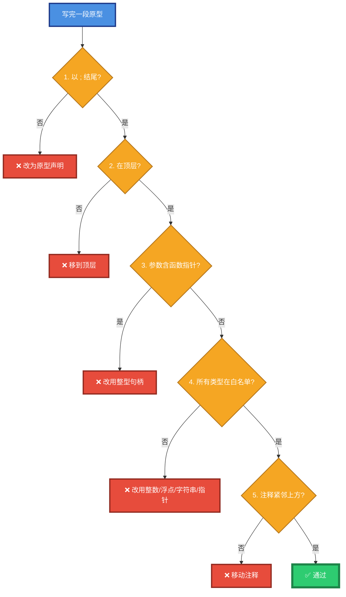

**五项检查**：

| 序号 | 检查项 | 不通过的动作 |
|:----:|--------|--------------|
| 1 | 以 `;` 结尾（原型不是定义）？ | 去掉 `{ ... }` 函数体 |
| 2 | 在顶层（不在函数体/类型定义中）？ | 移到顶层 |
| 3 | 参数不含函数指针？ | 改用整型句柄 |
| 4 | 所有类型在白名单？ | 改用整数/浮点/字符串/指针 |
| 5 | 注释紧邻上方？ | 移动注释（可留空行） |

---

## 10. 最小可解析模板

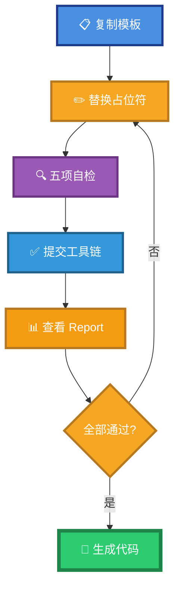

**复制以下模板，替换占位符即可**：

```c
/* <文件名>.h */
#ifndef <GUARD>
#define <GUARD>

/*
 * <函数的自然语言说明>。
 * @param <参数1> <参数1的说明>
 * @param <参数2> <参数2的说明>
 * @return <返回值的说明>
 */
<返回类型> <函数名>(<参数1类型> <参数1名>, <参数2类型> <参数2名>);

#endif /* <GUARD> */
```

**填空规则**：

| 占位符 | 可选值 |
|--------|--------|
| `<GUARD>` | 形如 `FOO_H` / `FOO_HPP` / `FOO_INCLUDED` |
| `<函数名>` | 合法 C 标识符（非保留字） |
| `<参数N名>` | 合法 C 标识符（非保留字） |
| `<参数N类型>` | 见 §3 白名单 |
| `<返回类型>` | 见 §3 白名单（`void` 允许） |

---

## 11. 设计原则

### 11.1 工具链的三个硬性假设

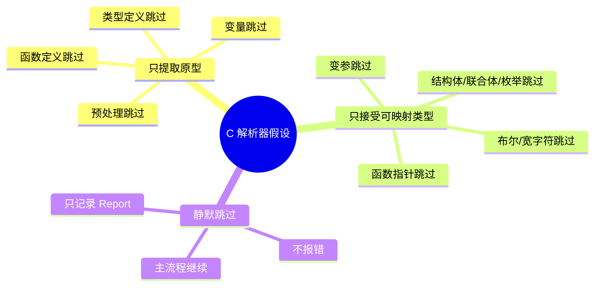

### 11.2 使用者的三条铁律


### 11.3 与 Pascal 侧的对称性

| 维度 | Pascal 侧 | C 侧 |
|------|-----------|------|
| 输入 | `.pas` 源码 | `.h` 头文件 |
| 提取对象 | `interface` 段顶层函数/过程 | 顶层函数原型 |
| 注释风格 | `{ ... }` / `(* ... *)` / `//` | `/* ... */` / `//` / `#` |
| 字符串 | 单引号 `'...'` | 双引号 `"..."` |
| 关键字检查 | `Pascal_Keyword` | `IsCReservedWord` |
| 返回值 const | 无 | `ResultMod` 字段 |
| 数组参数 | `array of X` | `param_array` 后缀 |
| 唯一化约束 | 无 | `restrict` 剥离 |

### 11.4 关键设计决策

| 决策 | 原因 |
|------|------|
| 🟣 **元数据采用 Pascal 风格为规范态** | `decl_to_pascal` verbatim 输出，`decl_to_c` 反转换 |
| 💬 **注释统一归化为 Pascal `{ ... }`** | 单一风格简化下游实现 |
| 🎯 **类型按宽度+符号精确映射** | 实现 C → Pascal → C 的往返保真 |
| 🔄 **`restrict` 主动剥离** | 不损失语义，避免下游映射失败 |
| 📦 **数组后缀独立存储** | 基类型保持简单标识符，便于双向生成 |
| 🚫 **函数指针参数整条跳过** | 无法表达为 JSON Schema 值类型 |
| 🤫 **静默跳过而非抛异常** | 与 Pascal 侧保持一致的工具链行为 |

---

## 12. 修订历史

- **v1.0（2026-09-12）**：初版。对齐 `Fill_C.inc` + `Translate_C_Typ_To_Pascal.inc` 的现行实现，覆盖位置规则、修饰符、类型白名单、数组后缀、注释绑定、Unit Name 提取、自检清单。**使用醒目的多色制图**强化视觉辨识度。
