# NVIDIA-Nemotron-3-Nano-Omni-30B-A3B-Reasoning-UD-IQ4_XS.gguf 多模态模型下载与部署指南

> **文档版本**：V3.1（v3 多模态重写版 · 量化架构扩充版）
> **最后更新**：2026-09-17
> **适用组件**：`llm_service.exe`、`llm_proxy.exe`、`llm_proxy_tool.exe`
> **相关文档**（同目录 / `src/` 子目录）：
> - 项目总览：[`readme.md`](readme.md)
> - 编译指南：[`Build_Guide.md`](Build_Guide.md)
> - 生态总览：[`src/LingoFuse_LLM_Ecosystem_User_Guide.md`](src/LingoFuse_LLM_Ecosystem_User_Guide.md)
> - 本地推理服务：[`src/LingoFuse_LLM_Service_CLI_guide.md`](src/LingoFuse_LLM_Service_CLI_guide.md)
> - 纯转发代理：[`src/LingoFuse_LLM_Proxy_CLI_Guide.md`](src/LingoFuse_LLM_Proxy_CLI_Guide.md)
> - LTB 工具桥：[`src/LingoFuse_LLM_Proxy_Tool_CLI_Guide.md`](src/LingoFuse_LLM_Proxy_Tool_CLI_Guide.md)
> - 踩坑大全：[`src/LingoFuse_LLM_Pitfalls_For_AI.md`](src/LingoFuse_LLM_Pitfalls_For_AI.md)

---

## 阅读引导

本文档介绍 pasAgent v3 推荐的**多模态（Omni）模型**的下载与部署。建议按以下顺序阅读：

1. **想理解为什么选它** → 读第零章「模型定位：综合选择，而非替代」
2. **想快速了解这个模型** → 读第一章「模型简介」
3. **想知道量化架构差别** → 读第二章「量化架构多样性」
4. **想理解多模态是怎么运作的** → 读第三章「多模态基本知识点」
5. **想下载模型 + 视觉编码器** → 读第四、五章
6. **想部署到 LingoFuse LLM 服务** → 读第六章「部署说明」
7. **想了解为什么没有语音** → 读第七章「语音支持特别说明」

---

## 零、模型定位：综合选择，而非替代

### 0.1 本模型是 v3 的推荐模型——但不是"唯一"模型

pasAgent v3 把 **`NVIDIA-Nemotron-3-Nano-Omni-30B-A3B-Reasoning-UD-IQ4_XS.gguf`** 列为**推荐模型**。这是**经过多轮对比后的综合选择**，而非"旧模型已废弃"式的替换。

| 模型资产 | 定位 | 能力 | 状态 |
|---------|------|:----:|------|
| `NVIDIA-Nemotron-3.5-Lightning-30B-A3B-UD-IQ4_NL.gguf` | 纯文本时代的推荐模型 | 纯文本 | **仍可用**，不作 v3 首选 |
| **`NVIDIA-Nemotron-3-Nano-Omni-30B-A3B-Reasoning-UD-IQ4_XS.gguf`** | **v3 现阶段的推荐模型** | **文字 + 图片** | **本文档主题** |
| Qwen3.6 / Qwen3.8 / Meta 系列 | 对比过的备选 | 视版本而定 | 未选为推荐 |

> ⚠️ **重要澄清**：本文档**不是**宣布"旧模型被替代"。旧的纯文本模型、Qwen 系列、Meta 系列**依然可以继续使用**。只是在 v3 的多模态叙事下，经过多轮实测对比后，**这个 Nemotron Omni 模型是综合表现最优的选择**。

### 0.2 为什么选它：三个维度的综合权衡

选它不是因为"新技术"，而是因为**在以下三个维度上达成了最佳平衡**：

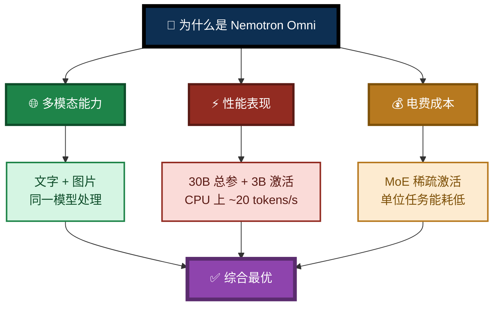

### 0.3 对比过程：为什么不是 Qwen3.6 / Qwen3.8 / Meta 系列

v3 团队在选型阶段**实测过**多家模型，包括：

| 候选家族 | 情况 | 未被选为 v3 推荐的原因（简） |
|---------|------|-----------------------------|
| **Qwen3.6** | 性能不错 | 电费成本高，多模态需另配视觉模型 |
| **Qwen3.8** | 更新，能力更强 | 同上，且对 CPU 推理不如 MoE 稀疏架构友好 |
| **Meta 系列** | 生态成熟 | 参数量大、功耗高、多模态需分体架构 |
| **Nemotron 3.5 Lightning Omni** | ✅ **综合最优** | —— |

**关键差异**在于**"电费"这个常被忽略的维度**：

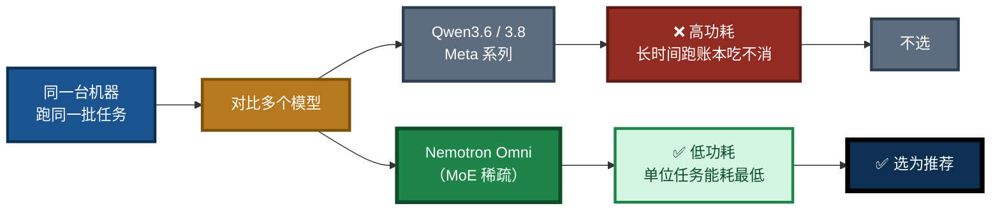

> **核心洞察**：**"这是最省电费的模型。"** 这不是营销口号，而是长时间运行、批量任务场景下的**真实经济账**。MoE 架构每次只激活 3B 参数，单位 token 的计算开销远低于同量级稠密模型。

### 0.4 v3 为什么独立开仓

多模态是**衍生型机制**——它不是单个程序的升级，而是需要**周边程序协同支持**才能完整运转的架构级变革。

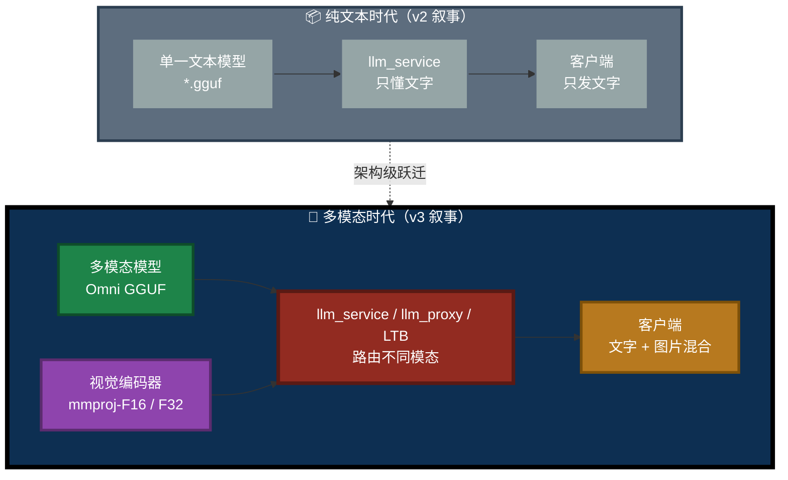

### 0.5 组件的多模态行为

| 组件 | 多模态行为 | 说明 |
|------|-----------|------|
| **`llm_service`** | **本地加载多模态模型 + mmproj** | 通过本地 llama.cpp 的 VLM 路径处理图片 |
| **`llm_proxy`** | **原样转发**图片附件到后端 | 是否支持取决于后端 |
| **`llm_proxy_tool`（LTB）** | **原样转发**图片附件到后端 | 首轮传图，工具链后续轮次用占位符 |
| **`llm_client.pas`** | **构建**多模态内容（文本 + 图片附件） | 通过 `GenerateWithAttachments` / `GenerateWithImageFile` |

---

## 一、模型简介

`NVIDIA-Nemotron-3-Nano-Omni-30B-A3B-Reasoning-UD-IQ4_XS.gguf` 是 NVIDIA **Nemotron 3.5 Lightning Omni** 系列模型的 **4-bit 量化（IQ4_XS）GGUF 格式**版本，专为**长时间运行的智能体（Agent）**中的**高频任务执行**而设计。

与纯文本模型（如 `NVIDIA-Nemotron-3.5-Lightning-30B-A3B-UD-IQ4_NL.gguf`）相比，本模型的**核心差异是它是 Omni 多模态模型**：不仅能理解**文字**，还能理解**图片**。

### 1.1 架构

Nemotron 3.5 Lightning Omni 采用**混合专家（MoE）架构**：

- **总参数量**：**300 亿（30B）**，但每次推理仅激活约 **30 亿（3B）** 参数
- **主干架构**：Mamba-2 + MoE + Attention 混合架构，共 52 层（23 层 Mamba-2、23 层 MoE、6 层 Attention）
- **视觉通道**：由**独立的视觉编码器（mmproj）**负责图片 → 视觉 token 的转换
- **上下文长度**：最高支持 **100 万（1M）tokens**，单卡 H100 部署时默认 256K

**"大容量、低激活"设计**意味着：模型**知识储备接近 30B 稠密模型**，但**推理开销仅相当于 3B 小模型**，因此可以在 CPU 上实现**约 20 tokens/s** 的生成速度——这是传统 30B 模型在纯 CPU 环境下难以企及的。

**这也正是"省电费"的根本原因**：每次只激活 3B 参数，单位 token 的计算量小，功耗自然低。

### 1.2 量化的多样性（详见第二章）

本模型支持**多种量化架构**。本文档标题中的 `UD-IQ4_XS` 只是其中一种：

- `IQ4_XS`（本文档示例）
- `IQ4_NL`
- `UD-Q4_K_XL`
- `Q4_K_M`
- ……以及更多

**每种量化架构在 llama.cpp 支持层下的分载表现、性能表现、兼容性表现都有差异**。强烈建议**下载多种架构，自行评估在你设备上的最佳表现**。详见第二章。

### 图 1：多模态模型在 pasAgent 闭环中的位置

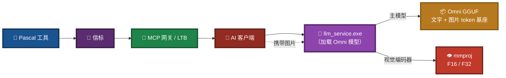

---

## 二、量化架构多样性：IQ4_XS、IQ4_NL 及其他

> 本章是 V3.1 新增的核心内容。**理解这一章，能让你在 llama.cpp 生态下做出更适合自己设备的选择。**

### 2.1 什么是"量化架构"

**量化（Quantization）** 是把模型权重从高精度（如 FP16）压缩到低精度（如 4-bit）的过程，目的是减小文件体积、降低内存占用、提高推理速度。

**量化架构**指的是**量化算法本身的设计**。同样目标为"4-bit"，不同架构的实现方式不同，产生的文件在**体积、精度、速度、兼容性**上都可能有差异。

### 2.2 常见量化架构一览

| 量化架构 | 位宽 | 典型体积 | 精度 | 兼容性 | 特点 |
|---------|:----:|:--------:|:----:|:------:|------|
| **`Q4_K_M`** | 4-bit | 中 | 中上 | 极好 | 最通用、兼容性最好，llama.cpp 老版本也支持 |
| **`Q4_K_XL`（含 `UD-Q4_K_XL`）** | 4-bit | 中 | 高 | 好 | 动态量化，按层分配精度，质量优于 K_M |
| **`IQ4_NL`** | 4-bit | 中 | 高 | 好 | 非线性格子量化，精度与体积平衡优秀 |
| **`IQ4_XS`** | 4-bit | 略小 | 中上 | 好 | 极小块量化，体积更小，适合内存紧张场景 |
| **`Q5_K_M`** | 5-bit | 大 | 很高 | 极好 | 精度更高，体积更大，适合内存宽裕场景 |
| **`Q8_0`** | 8-bit | 很大 | 极高 | 极好 | 几乎无损，体积近 2×，一般仅用于对比验证 |

> **注意**：不同仓库可能对同一算法的命名略有差异（如 `UD-Q4_K_XL` 中的 `UD` 前缀表示 Unsloth 动态量化），但核心算法是同一类。

### 2.3 为什么"多下载几份"是明智之举

**关键事实**：即使量化位宽相同（都是 4-bit），**不同架构在 llama.cpp 支持层下的表现不同**——这不是理论，而是实测中常见的现象。

具体差异体现在三个维度：

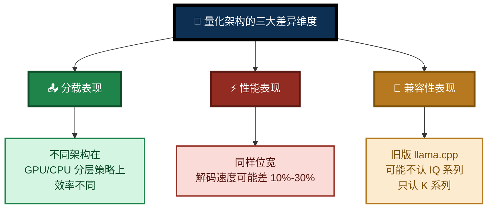

#### 差异一：分载表现

`--gpu-layers` 的作用是把模型层分配到 GPU。**不同量化架构在分层时的效率不同**：

- 某些架构的层边界与 GPU 内存分配更契合，分层效率高。
- 某些架构在部分分层时会产生额外的数据搬运开销。

**实测建议**：在你的机器上，从 `--gpu-layers 0` 到 `--gpu-layers -1` 逐一试，看哪个架构在某个分层点上明显更稳/更快。

#### 差异二：性能表现

同样 4-bit，**不同架构的解码速度（tokens/s）可能相差 10%–30%**：

- `Q4_K_M` 通常最快（CPU 上有优化）。
- `IQ4_XS` 体积小但可能在部分 CPU 上反而略慢（解码成本高）。
- `IQ4_NL` 在多数设备上表现均衡。

**实测建议**：用同一批提示词、同一上下文长度，测每个架构的 tokens/s。

#### 差异三：兼容性表现

- **旧版 `llama-cpp-python` / `llama.cpp`** 可能**不支持 IQ 系列**（IQ4_XS、IQ4_NL 等），只支持 Q 系列（Q4_K_M、Q5_K_M 等）。
- **新版**才逐步加入对 IQ 系列的支持。

**实测建议**：如果加载 IQ 系列失败，先升级 `llama-cpp-python`；若无法升级，改用 `Q4_K_M` 或 `Q4_K_XL`。

### 2.4 建议的下载策略

**不要只下载一种架构。** 建议一次性下载 2–3 种：

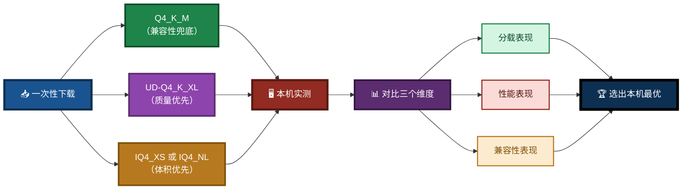

**推荐组合**：

| 优先级 | 架构 | 用途 |
|:------:|------|------|
| ① | **`Q4_K_M`** | 兼容性兜底——保证在老设备/老版本上一定能跑 |
| ② | **`UD-Q4_K_XL`** 或 **`Q4_K_XL`** | 质量优先——对比看是否值得为质量多花一点性能 |
| ③ | **`IQ4_XS`** 或 **`IQ4_NL`** | 体积优先——内存紧张时选它，看是否更省 |

> **实测心态**：不要预设"哪个一定最好"。**在你的机器、你的任务、你的电费账单下**，实测出的结果才算数。

### 2.5 实测对比的简单方法

```powershell
# 用同一个提示词、同一个上下文，跑三种架构
$prompts = @("解释什么是 MoE 架构", "写一段快速排序", "分析这张图")  # 最后一条需要图片

# 逐个跑，记录 tokens/s
.\llm_service.exe --model-path .\NVIDIA-Nemotron-3-Nano-Omni-...Q4_K_M.gguf --mmproj .\mmproj-F16.gguf --gpu-layers -1
.\llm_service.exe --model-path .\NVIDIA-Nemotron-3-Nano-Omni-...UD-Q4_K_XL.gguf --mmproj .\mmproj-F16.gguf --gpu-layers -1
.\llm_service.exe --model-path .\NVIDIA-Nemotron-3-Nano-Omni-...IQ4_XS.gguf --mmproj .\mmproj-F16.gguf --gpu-layers -1
```

**观察三个指标**：

1. **加载速度**：模型能不能顺利加载？
2. **生成速度**：tokens/s 是多少？
3. **功耗/温度**：风扇噪音、CPU/GPU 温度、功耗计读数。

**记录在表格里对比**，选出你机器上综合最优的那一个。

---

## 三、核心参数速查

| 参数项 | 规格 |
|---|---|
| **模型名称** | NVIDIA-Nemotron-3-Nano-Omni-30B-A3B-Reasoning |
| **模型类型** | **多模态（Omni）**——文字 + 图片 |
| **架构** | MoE — Mamba-2 + MoE + Attention 混合 |
| **总参数量** | 30B |
| **激活参数量** | ~3B / token |
| **上下文长度** | 最高 1M tokens（256K 原生默认） |
| **支持的量化架构** | `Q4_K_M` / `UD-Q4_K_XL` / `IQ4_NL` / `IQ4_XS` / `Q5_K_M` / `Q8_0` 等 |
| **本文档示例量化** | `IQ4_XS`（block-32, ~4.0 bpw） |
| **示例主模型文件大小** | ~19.7 GB |
| **视觉编码器** | **mmproj-F16**（推荐） / **mmproj-F32**（更高精度） |
| **推理模式** | 可配置思考模式（`enable_thinking=True/False`） |
| **投机解码** | 支持 DSpark、DFlash、MTP（Multi-Token Prediction） |
| **支持语言** | 英语（含代码）、西班牙语、法语、德语、意大利语、日语 |
| **推荐采样** | 思考模式：Temperature 1.0, Top_P 0.95 |
| **许可证** | OpenMDW License Agreement v1.1（可商用） |
| **发布日期** | 2026 年 8 月 11 日 |
| **预训练数据截止** | 2025 年 9 月 |
| **后训练数据截止** | 2026 年 5 月 |

> **关键理解**：30B 总参数意味着模型拥有丰富知识；3B 激活参数意味着每次推理只调用其中一小部分专家网络，因此**CPU 推理速度远超传统 30B 模型**，**单位任务能耗也远低于同量级稠密模型**。

---

## 四、多模态基本知识点

> 本章面向**第一次接触多模态模型的读者**，解释"它是什么、怎么运作、为什么需要额外文件"。

### 4.1 什么是多模态

**多模态（Multimodal）** 指模型能同时理解**多种输入模态**。本模型支持两种：

| 模态 | 说明 | 示例 |
|------|------|------|
| **文字** | 用户提问、系统提示、多轮历史 | "分析这张图" |
| **图片** | 图表、截图、照片、扫描件 | `chart.png` |

**与传统纯文本模型的区别**：

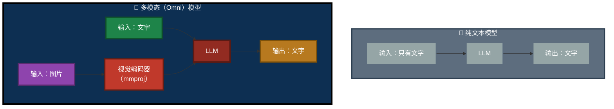

### 4.2 多模态模型如何运作

一次图片问答的完整链路：

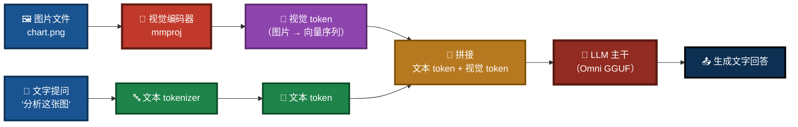

**四个关键步骤**：

1. **图片 → 视觉 token**：视觉编码器（mmproj）把图片编码成一串**向量**（称为"视觉 token"）。这一步是 mmproj 的职责。
2. **文字 → 文本 token**：文本 tokenizer 把文字切分成 token。
3. **拼接**：视觉 token 和文本 token 按顺序拼成一个序列。
4. **LLM 主干推理**：Omni GGUF 的主模型（LLM 部分）在这个混合序列上继续做自回归生成，输出文字回答。

### 4.3 为什么需要 mmproj 编码器

> **核心认知**：**Omni GGUF 主模型不含视觉编码器。**

这是很多初次接触多模态模型的开发者最容易踩的坑。GGUF 格式的设计哲学是**模块化**：

| 组件 | 职责 | 文件 |
|------|------|------|
| **主模型（LLM 主干）** | 语言理解与生成 | `NVIDIA-Nemotron-3-Nano-Omni-...gguf`（~19.7 GB） |
| **视觉编码器（mmproj）** | 图片 → 视觉 token | `mmproj-F16.gguf` 或 `mmproj-F32.gguf`（几百 MB） |

**没有 mmproj**：


**有 mmproj**：


### 4.4 mmproj-F16 与 mmproj-F32 的选择

视觉编码器有两种精度版本：

| 版本 | 精度 | 文件大小（约） | 质量 | 内存/显存占用 | 推荐场景 |
|------|:----:|:-------------:|:----:|:------------:|---------|
| **mmproj-F16** | 16-bit 浮点 | 较小 | 高 | 较低 | **绝大多数场景（推荐）** |
| **mmproj-F32** | 32-bit 浮点 | 较大 | 更高 | 较高 | 对图片理解精度极致要求 |

**选择建议**：

- **默认选 `mmproj-F16`**——质量已经足够好，占用更小。
- **仅在以下情况考虑 `mmproj-F32`**：
  - 需要极高精度的图片细节识别（如医疗影像、工程图纸）
  - 你的硬件内存/显存充裕，不在乎额外的占用
  - 你对 F16 的量化误差敏感，做了对比测试发现 F32 明显更优

> **注意**：mmproj 的精度与主模型的量化精度是**独立**的。你可以用 IQ4_XS 的主模型 + F16 的 mmproj，也可以用 Q4_K_M 主模型 + F32 mmproj。二者互不影响。

### 4.5 多模态能力矩阵

pasAgent v3 的各组件对多模态的支持程度：

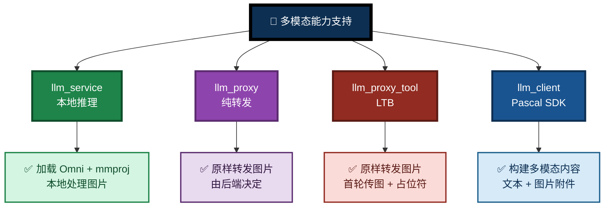

---

## 五、模型与 mmproj 下载

### 5.1 主模型下载

#### 5.1.1 下载源

| 来源 | 仓库主页 | 说明 |
|------|---------|------|
| **Unsloth** | [unsloth/NVIDIA-Nemotron-3.5-Lightning-30B-A3B-GGUF](https://huggingface.co/unsloth/NVIDIA-Nemotron-3.5-Lightning-30B-A3B-GGUF) | 动态量化（`UD-*`），质量优秀 |
| **AtomicChat** | [AtomicChat/NVIDIA-Nemotron-3.5-Lightning-30B-A3B-GGUF](https://huggingface.co/AtomicChat/NVIDIA-Nemotron-3.5-Lightning-30B-A3B-GGUF) | IQ4_NL 等量化版本 |
| **ModelScope 魔搭** | [modelscope.cn/collections/nv-community/Nemotron-35-Lightning](https://modelscope.cn/collections/nv-community/Nemotron-35-Lightning) | 国内加速访问 |

#### 5.1.2 下载建议：多架构并行

**再次强调**（见第二章）：**不要只下载一种架构**。建议下载 2–3 种，自行评估。

**用 `huggingface-cli` 一并下载多个架构**：

```bash
pip install -U huggingface_hub

# 下载三种典型架构 + mmproj
huggingface-cli download unsloth/NVIDIA-Nemotron-3.5-Lightning-30B-A3B-GGUF \
    --include "*Q4_K_M*.gguf" "*UD-Q4_K_XL*.gguf" "*mmproj*F16*.gguf" \
    --local-dir . \
    --local-dir-use-symlinks False
```

### 5.2 视觉编码器（mmproj）下载

mmproj 编码器通常与主模型**放在同一个 Hugging Face 仓库**中，因此你可以在上面这些仓库里一并找到。

**文件名约定**：

```
mmproj-F16.gguf      ← 推荐
mmproj-F32.gguf      ← 可选，精度更高
```

不同仓库可能命名略有差异，例如 `mmproj-model-f16.gguf`、`mmproj-Nemotron-F16.gguf` 等。**只要文件名含 `mmproj` 且为 GGUF 格式即可**。

**单独下载 mmproj**：

```bash
huggingface-cli download unsloth/NVIDIA-Nemotron-3.5-Lightning-30B-A3B-GGUF \
    --include "*mmproj*" \
    --local-dir . \
    --local-dir-use-symlinks False
```

### 5.3 下载后的文件重命名

为与 LingoFuse LLM 服务的默认扫描规则兼容，建议重命名：

| 下载得到的文件 | 建议重命名为 |
|---------------|-------------|
| `NVIDIA-Nemotron-3.5-Lightning-30B-A3B-...-IQ4_XS.gguf` | `NVIDIA-Nemotron-3-Nano-Omni-30B-A3B-Reasoning-UD-IQ4_XS.gguf` |
| `...-Q4_K_M.gguf` | `NVIDIA-Nemotron-3-Nano-Omni-30B-A3B-Reasoning-Q4_K_M.gguf` |
| `...-UD-Q4_K_XL.gguf` | `NVIDIA-Nemotron-3-Nano-Omni-30B-A3B-Reasoning-UD-Q4_K_XL.gguf` |
| `mmproj-*.gguf`（F16 或 F32） | `mmproj-F16.gguf` 或 `mmproj-F32.gguf`（保留标识即可） |

> **提示**：重命名只是为了让默认扫描规则生效。你也可以不重命名，改用 `--model-path` 显式指定。

### 图 2：下载与放置流程

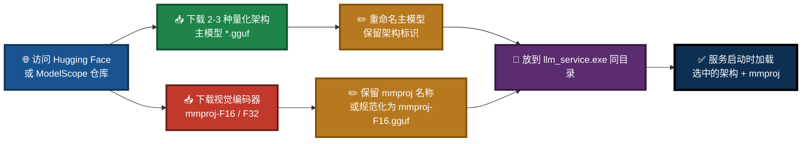

---

## 六、部署说明（针对 LingoFuse LLM 服务）

### 6.1 文件放置要求

将下面这些文件放在 `llm_service.exe` 同目录下：

```
<llm_service.exe 同目录>/
├── NVIDIA-Nemotron-3-Nano-Omni-30B-A3B-Reasoning-UD-IQ4_XS.gguf    ← 主模型（示例架构）
├── NVIDIA-Nemotron-3-Nano-Omni-30B-A3B-Reasoning-Q4_K_M.gguf       ← 备选架构 1
├── NVIDIA-Nemotron-3-Nano-Omni-30B-A3B-Reasoning-UD-Q4_K_XL.gguf   ← 备选架构 2
└── mmproj-F16.gguf                                                  ← 视觉编码器
```

> **重要**：
> - 只放主模型 → 文本可用、图片不可用。
> - **必须主模型 + mmproj 都在，多模态才完整**。
> - 可以**放多份不同架构的主模型**，启动时用 `--model-path` 选一个。

### 6.2 前置准备：确认 `llama-cpp-python` 后端

`llm_service.exe` 的 CPU / CUDA 支持**不是通过切换 exe 文件名实现的**，而是由所安装的 `llama-cpp-python` wheel 决定：

- **CPU 版**：
  ```bash
  pip install llama-cpp-python --extra-index-url https://abetlen.github.io/llama-cpp-python/whl/cpu
  ```
- **CUDA 版**（示例 CUDA 12.4）：
  ```bash
  pip install llama-cpp-python --extra-index-url https://abetlen.github.io/llama-cpp-python/whl/cu124
  ```

> **注意**：多模态（mmproj）支持需要 `llama-cpp-python` 的**较新版本**。若你的版本较旧，请升级到最新版。

### 6.3 启动命令示例

**纯 CPU 模式（以 IQ4_XS 为例）**：

```powershell
.\llm_service.exe `
  --model-path .\NVIDIA-Nemotron-3-Nano-Omni-30B-A3B-Reasoning-UD-IQ4_XS.gguf `
  --mmproj .\mmproj-F16.gguf `
  --gpu-layers 0 `
  --threads 8 `
  --context-size 8192
```

**CUDA 加速模式（以 Q4_K_M 为例）**：

```powershell
.\llm_service.exe `
  --model-path .\NVIDIA-Nemotron-3-Nano-Omni-30B-A3B-Reasoning-Q4_K_M.gguf `
  --mmproj .\mmproj-F16.gguf `
  --gpu-layers -1 `
  --threads 4 `
  --context-size 32768
```

> **参数名以实际实现为准**：`--mmproj` 的具体名称请参考 [`src/LingoFuse_LLM_Service_CLI_guide.md`](src/LingoFuse_LLM_Service_CLI_guide.md)。

### 6.4 内存需求估算

| 配置 | 内存需求（估算） |
|---|---|
| Omni 主模型 + mmproj-F16 + 8K 上下文，纯 CPU | ~24–26 GB |
| Omni 主模型 + mmproj-F16 + 32K 上下文，纯 CPU | ~28–30 GB |
| Omni 主模型 + mmproj-F16 + 8K 上下文，GPU 全卸载 | ~20 GB 显存 + mmproj 少量内存 |

> **提示**：主模型本身约 19.7 GB（不同量化架构略有浮动），mmproj-F16 额外增加数百 MB，加上 KV cache 和运行时开销，建议系统内存至少 **32 GB**。

### 图 3：内存与上下文长度权衡

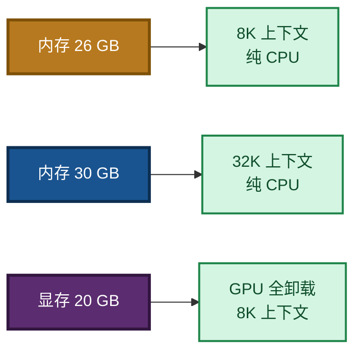

### 6.5 显存不足时的渐进式调整

若出现 `CUDA out of memory`，逐步下调 `--gpu-layers`：

```powershell
# 先试 20 层
.\llm_service.exe --gpu-layers 20 --mmproj .\mmproj-F16.gguf

# 若仍 OOM，降到 10 层
.\llm_service.exe --gpu-layers 10 --mmproj .\mmproj-F16.gguf

# 最后回退纯 CPU
.\llm_service.exe --gpu-layers 0 --mmproj .\mmproj-F16.gguf
```

### 6.6 替代方案：用 `llm_proxy.exe` / LTB 转发

如果你不想在本地加载 20 GB 模型，可以改用 `llm_proxy.exe` 或 `llm_proxy_tool.exe` 转发到 LM Studio 或其他 OpenAI 兼容后端：

```powershell
# 纯对话
.\llm_proxy.exe --backend-url http://127.0.0.1:1234/v1

# 需要工具调用
.\llm_proxy_tool.exe --backend-url http://127.0.0.1:1234/v1 --mcp-reg-agent-app llm_proxy_agent

# 需要多模态（后端加载 VLM）
.\llm_proxy_tool.exe --backend-url http://127.0.0.1:1234/v1 --backend-model "qwen2-vl-7b-instruct" --vision
```

详细用法见 [`src/LingoFuse_LLM_Proxy_CLI_Guide.md`](src/LingoFuse_LLM_Proxy_CLI_Guide.md) 与 [`src/LingoFuse_LLM_Proxy_Tool_CLI_Guide.md`](src/LingoFuse_LLM_Proxy_Tool_CLI_Guide.md)。

### 6.7 客户端如何发图片

**Pascal 客户端（`llm_client.pas`）示例**：

```pascal
var
  images: TLLMImageAttachmentArray;
  sid, err: string;
begin
  SetLength(images, 1);
  images[0].Name.Text := 'chart.png';
  images[0].Mime.Text := 'image/png';
  images[0].DataB64.Text := LoadBase64('chart.png');

  LLM.GenerateWithAttachments('分析这张图', '', images, sid, err);
end;
```

---

## 七、模型适用场景

### 7.1 智能体任务（核心定位）

Nemotron 3.5 Lightning Omni **专为智能体设计**。NVIDIA 官方描述其为"长时间运行的智能体中的高频任务执行"而构建，面向频繁的智能体调用，包括：**工具使用、输出验证、结果格式化、子智能体委派**。

在 **PinchBench** 基准测试中，该系列模型达到 **86% 准确率**，完成 10,000 个任务的速度比 Qwen3.6 35B **快 30%**。

### 7.2 多模态任务（v3 新增价值）

| 场景 | 说明 |
|------|------|
| **图表分析** | 上传数据图表，让模型解读趋势、异常、对比 |
| **截图理解** | 上传软件界面截图，让模型给出操作建议或错误诊断 |
| **文档扫描件** | 上传扫描 PDF 页面，让模型提取关键信息 |
| **多模态 + 工具** | 一边看图片，一边调用 Pascal 工具完成后续动作 |

### 7.3 日常对话与主线任务

30B 的知识储备使模型能够处理复杂的**多步推理**和**长上下文任务**。1M tokens 的上下文窗口使其特别适合需要**大量文档阅读**或**长对话历史**的场景。

### 7.4 CPU 推理（约 20 tokens/s）

由于每个 token 仅激活 3B 参数，CPU 推理速度显著优于传统 30B 稠密模型。在支持 AVX2 的现代 CPU（i5-12 代以上 / Ryzen 5000 以上）上，配合合理的线程数设置，可实现**约 15–25 tokens/s** 的生成速度，满足日常对话和智能体调用的实时性需求。

### 7.5 长时间高负载任务（省电费）

这是**本模型最被低估的价值**：

| 维度 | 传统 30B 稠密 | Nemotron Omni（MoE） |
|------|:------------:|:-------------------:|
| 每次推理激活参数 | 30B | **3B** |
| 单位 token 计算量 | 高 | **低** |
| 单位任务功耗 | 高 | **低** |
| 7×24 小时运行电费 | 高 | **低** |

**这就是为什么"这是最省电费的模型"**——当你要让 AI 长时间、高频地跑在本地（工业现场、内网服务、边缘设备），**MoE 稀疏激活带来的能耗优势会直接反映在电费账单上**。

### 图 4：与传统 30B 模型的对比

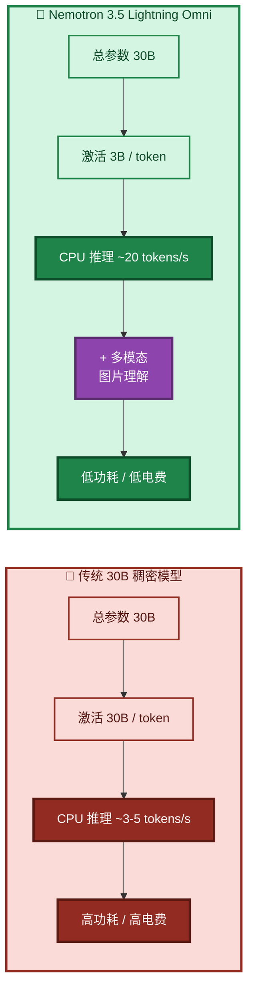

---

## 八、语音支持特别说明

> **本章是必须明确告知读者的一块边界。**

### 8.1 当前状态

pasAgent v3 的推荐 Omni 模型**不支持语音输入与语音输出**。

| 模态 | 支持状态 |
|------|:--------:|
| **文字** | ✅ 支持 |
| **图片** | ✅ 支持（需 mmproj） |
| **语音（输入 / 输出）** | ❌ **未支持** |

### 8.2 为什么不做语音支持

这不是技术能力不够，而是**两方面的现实约束**：

#### 约束一：中文语音的复杂性——普通话 + 方言

中文的语音处理比英文复杂得多：

| 挑战 | 说明 |
|------|------|
| **普通话内部差异** | 即便都是"普通话"，不同地区的口音差异依然很大 |
| **方言种类繁多** | 粤语、闽南语、吴语、川渝方言、客家话…… 每种都有自己的音系 |
| **方言内部再分化** | 同一方言内部还有子口音差异（如粤语本身就有广府、四邑、高阳等片） |
| **训练语料稀缺** | 高质量、带标注的方言语音数据集远不如英语丰富 |
| **兼容成本极高** | 要让一个模型"听懂"所有方言，训练成本和推理成本都会激增 |

**简单说**：把"普通话 + 主要方言"都做进一个模型，是一个**巨大且不断膨胀**的工程，非常不好兼容。

#### 约束二：语音朗读 / 播报系统的开源协议与所有权限制

即便语音**识别**（ASR）问题解决了，语音**合成**（TTS）也有一堆麻烦：

| 问题 | 说明 |
|------|------|
| **开源协议限制** | 许多高质量 TTS 模型采用**非商业**许可，或对**商用**有额外条款 |
| **训练数据版权** | 部分 TTS 模型的训练语音来自**有版权的音源**（配音演员、广播节目等） |
| **所有权争议** | 某些音色与特定人物声音高度相似，涉及**声音所有权**问题 |
| **商用风险** | 一旦用于生产环境，可能触发法律纠纷 |

**简单说**：语音**播报**这一侧，能用的**高质量**方案，很多**都带着法律枷锁**——这对于一个 MIT 许可、强调"自由使用、自由商用"的项目而言，是不可接受的。

### 8.3 未来计划

> **这会在未来找机会来做出支持。**

pasAgent v3 团队**没有放弃语音**，只是**当前不做**。未来的可能路径：

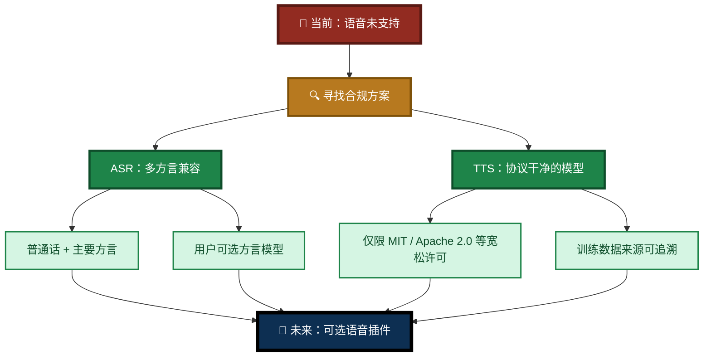

**当前建议**：

- 若你需要语音，**请先使用外部的合规 ASR / TTS 服务**，通过 `llm_proxy` / LTB 的附件机制与 pasAgent 集成。
- 若你有**商用级、协议干净**的中文语音方案，欢迎向项目反馈——这会是未来语音支持的重要参考。

---

## 九、与其他模型的对比

| 对比项 | Qwen2.5-7B | Qwen3.6 / 3.8 | Meta 系列 | **Nemotron Omni（本文档）** |
|---|:---:|:---:|:---:|:---:|
| 总参数量 | 7B | 视版本 | 视版本 | 30B（激活 3B） |
| **多模态** | ❌ | 部分版本 | 部分版本 | ✅ **文字 + 图片** |
| 上下文长度 | 32,768 | 视版本 | 视版本 | 最高 1,000,000 tokens |
| CPU 推理速度 | ~5–10 t/s | 较慢 | 较慢 | **~20 t/s** |
| 单位任务功耗 | 中 | **高** | **高** | **低（最省电费）** |
| 智能体稳定性 | 一般 | 良好 | 良好 | **优秀，专为智能体高频调用设计** |
| 文件大小 | ~4.7 GB | 视版本 | 视版本 | ~19.7 GB（+ mmproj） |
| 推荐用途 | 学习、演示 | 通用 | 通用 | **生产、智能体、多模态、长时间高负载** |

> **迁移建议**：Qwen2.5-7B 已作为 pasAgent 1.0 的入门学习模型。**新项目推荐使用 Nemotron Omni**——它在**多模态、性能、电费**三个维度的综合表现最优。旧模型**仍然可用**，可根据具体场景继续选择。

---

## 十、故障排查

### Q1：模型文件未找到

**排查**：

- 确认主模型文件名与你实际使用的架构一致（如 `...-UD-IQ4_XS.gguf` 或 `...-Q4_K_M.gguf`）。
- 确认文件与 `llm_service.exe` 在同一目录。
- 或使用 `--model-path` 指定绝对路径。

### Q2：加载 IQ 系列架构失败

**症状**：加载 `IQ4_XS` / `IQ4_NL` 时提示不支持。

**解决**：

- 升级 `llama-cpp-python` 到最新版（旧版本不支持 IQ 系列）。
- 或换用 `Q4_K_M` / `UD-Q4_K_XL` 等 Q 系列架构。

### Q3：图片问答不工作 / 后端提示"看不到图片"

**排查顺序**：

1. **是否提供了 mmproj？** 检查启动命令中是否有 `--mmproj` 参数，且路径指向真实存在的文件。
2. **mmproj 文件是否完整？** 下载可能中断，检查文件大小是否合理（数百 MB）。
3. **mmproj 版本是否与主模型兼容？** 必须来自**同一仓库**的配套文件，不要混用不同模型的 mmproj。
4. **`llama-cpp-python` 版本是否够新？** 旧版本可能不支持 VLM 加载。

### Q4：不同架构表现差异大

**症状**：同样 4-bit，`IQ4_XS` 和 `Q4_K_M` 的速度/兼容性差异明显。

**解读**：这是**正常现象**（见第二章）。llama.cpp 对不同量化架构的支持程度与优化程度不同。

**解决**：

- 逐一实测，选出本机最优。
- 若追求稳定，直接用 `Q4_K_M`（兼容性最好）。

### Q5：内存不足（纯 CPU 场景）

**解决**：

- 降低 `--context-size`（如 4096）。
- 减少 `--threads`。
- 换用体积更小的量化架构（如 `IQ4_XS`）。
- 若只是纯文本任务，可以**不加载 mmproj**（若服务允许省略该参数）。
- 改用 `llm_proxy.exe` 转发到 LM Studio（LM Studio 可在有独显的机器上运行）。

### Q6：显存不足（CUDA 场景）

**解决**：

- 逐步降低 `--gpu-layers`（如 20 → 10 → 0）。
- 降低 `--context-size`。
- 视觉编码器 mmproj 也可考虑放到 CPU（视实现而定）。

### Q7：CPU 太慢 / 风扇狂转

**解决**：

- 减少 `--threads`（如从 8 降到 4）。
- 检查 CPU 是否支持 AVX2/AVX512。
- 换用 `Q4_K_M`（CPU 上有针对性的优化）。

### Q8：启动后立刻退出

**排查**：

- 是否缺少主模型文件（见 Q1）。
- 是否指定了 mmproj 但文件不存在（会报错退出）。
- 是否有另一个 `llm_service` 或 `llm_proxy` 已占用 `ipc:llm_service`。
- 查看窗口中的错误信息。

### Q9：语音问答能不能用？

**明确回答**：**当前不支持**。原因见第八章「语音支持特别说明」。请使用外部合规的 ASR / TTS 服务与 pasAgent 集成。

---

## 十一、相关文档

### 根目录文档

| 文档 | 说明 |
|------|------|
| [`readme.md`](readme.md) | 项目总览与四大核心组件 |
| [`Build_Guide.md`](Build_Guide.md) | 编译指南 |
| [`Pascal_Integration_Guide.md`](Pascal_Integration_Guide.md) | Pascal 开发者切入指南 |
| [`code_generate_mcp.md`](code_generate_mcp.md) | 代码生成器使用手册 |
| [`pascal_code_mcp_rule.md`](pascal_code_mcp_rule.md) | Pascal 声明规范 |
| [`C_code_mcp_rule.md`](C_code_mcp_rule.md) | C 声明规范 |

### `src/` 子目录文档

| 文档 | 说明 |
|------|------|
| [`src/LingoFuse_LLM_Ecosystem_User_Guide.md`](src/LingoFuse_LLM_Ecosystem_User_Guide.md) | 生态总览（四大应用组件 + 两条路径） |
| [`src/LingoFuse_LLM_Service_CLI_guide.md`](src/LingoFuse_LLM_Service_CLI_guide.md) | `llm_service.exe` 命令行手册（含 `--mmproj` 参数详情） |
| [`src/LingoFuse_LLM_Proxy_CLI_Guide.md`](src/LingoFuse_LLM_Proxy_CLI_Guide.md) | `llm_proxy.exe` 命令行手册 |
| [`src/LingoFuse_LLM_Proxy_Tool_CLI_Guide.md`](src/LingoFuse_LLM_Proxy_Tool_CLI_Guide.md) | `llm_proxy_tool.exe`（LTB）命令行手册 |
| [`src/LingoFuse_LLM_Proxy_Compatibility_Guide.md`](src/LingoFuse_LLM_Proxy_Compatibility_Guide.md) | 250+ OpenAI 兼容后端清单 |
| [`src/LingoFuse_LLM_Pitfalls_For_AI.md`](src/LingoFuse_LLM_Pitfalls_For_AI.md) | 踩坑大全（含 P8 多模态专项） |
| [`src/LingoFuse_LLM_Service_Work_Summary.md`](src/LingoFuse_LLM_Service_Work_Summary.md) | 版本演进与架构决策 |
| [`src/NVIDIA-Nemotron-3.5-Lightning-30B-A3B-UD-IQ4_NL.md`](src/NVIDIA-Nemotron-3.5-Lightning-30B-A3B-UD-IQ4_NL.md) | 旧纯文本模型（仅历史参考） |

---

## 十二、核心要点速记

> 📌 **六句话记住本文档**：

1. **本模型是"综合选择"，不是"替代"**——`NVIDIA-Nemotron-3-Nano-Omni-30B-A3B-Reasoning-UD-IQ4_XS.gguf` 是 v3 在**多模态 + 性能 + 电费**三维度综合权衡后的推荐；旧模型**仍可用**。
2. **为什么选它？因为最省电费**——实测对比过 Qwen3.6、Qwen3.8、Meta 系列，**MoE 稀疏激活**让它在长时间高负载下单位任务能耗最低。
3. **多模态需要 mmproj**——主模型**不含视觉编码器**，必须另外下载 **mmproj-F16**（推荐）或 **mmproj-F32**。
4. **量化架构很多，建议多下载几份**——`IQ4_XS`、`IQ4_NL`、`Q4_K_M`、`UD-Q4_K_XL`……**分载、性能、兼容性表现各异**，**自行实测本机最优**。
5. **语音不支持**——中文普通话 + 方言兼容性太复杂，加上 TTS 的协议与所有权限制，**当前不做**，**未来会找机会支持**。
6. **部署 = 主模型（可多份）+ mmproj 同目录**——启动时用 `--model-path` 选架构，`--mmproj` 指定视觉编码器。

> 🎯 **记住这句话就够了**：
>
> **v3 推荐 Nemotron Omni，不是因为"它是新的"，而是因为实测下来它"最能干活、最省电费、还看得懂图"。至于量化架构——多下载几份，用你自己的机器去选出最佳。**

---

**文档版本**：V3.1（v3 多模态重写版 · 量化架构扩充版——新增第二章「量化架构多样性」；第零章改为"综合选择，非替代"叙事；强调"省电费"的选型理由；全文使用 Mermaid 流程图，禁止字符制图）
**维护者**：LingoFuse-pasAgent 团队
**反馈**：问题提 Issue，急事加 Q（600585）