# Pascal Integration Guide — pasAgent v3（V5.2 修正版）

> **文档版本**：V5.2（AI 协作重写版 · 自查修正版）
> **最后更新**：2026-09-17
> **适用**：Pascal 开发者（默认你已经是老手）
> **核心主张**：**你 + AI 一起做。你负责执行，AI 负责查文档。**

---

## 零、这份文档怎么用

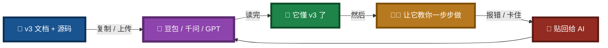

### 具体怎么"喂"

| 平台 | 怎么喂 |
|------|--------|
| **豆包 / 千问** | 上传文件，或直接粘贴文本 |
| **GPT** | 上传文件，或粘贴文本 |
| **任何支持附件的 AI** | 把 `.md` / `.txt` / `.pas` / `.py` / `.lpi` / `.lpr` / `.lfm` 丢进去 |

> ⚠️ **v3 的文档和绝大多数源码都是纯文本，可以放心喂给 AI。**
> 例外：`.res`、`.ico` 是二进制资源文件，不用喂（AI 也读不懂）。

### 三个开箱话术模板（照抄即可）

**模板 1 · 让它教你上手**
> 我在读 pasAgent v3 项目的 `readme.md` 和 `Pascal_Integration_Guide.md`。
> 我是 Pascal 老手，第一次接触这个项目。
> 请**按顺序**告诉我：我想做 [你的目标]，第一步该做什么？每一步给出**具体命令**。
> 需要我读哪份文档，直接告诉我文件名。

**模板 2 · 让它解释报错**
> 我按你的步骤执行，报了下面的错：
> ```
> [贴你的完整报错]
> ```
> 请告诉我：**这是哪份文档的第几节**在讲这个问题？修法是什么？

**模板 3 · 让它教你查文档**
> 我在看 `src/LingoFuse_LLM_Proxy_Tool_CLI_Guide.md`。
> 我想搞懂 `--vision` 到底怎么用，以及它跟后端的什么配置配套。
> 请引用**原文段落**解释，不要概括。

---

## 一、能力边界（必须懂）

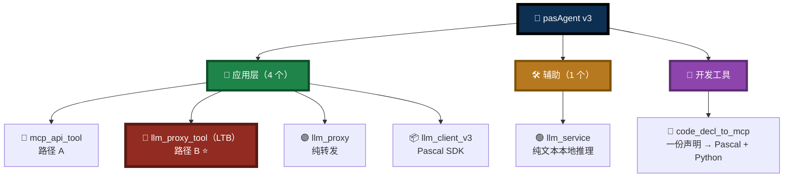

### 三条硬边界

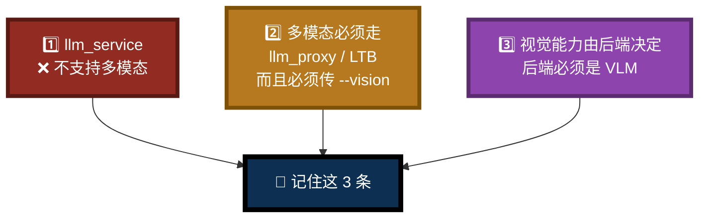

> 💡 **让 AI 展开讲这三条**：
> 「请引用 `readme.md` 和 `src/LingoFuse_LLM_Ecosystem_User_Guide.md`，逐条解释这三条边界背后的源码事实。」

---

## 二、决策图

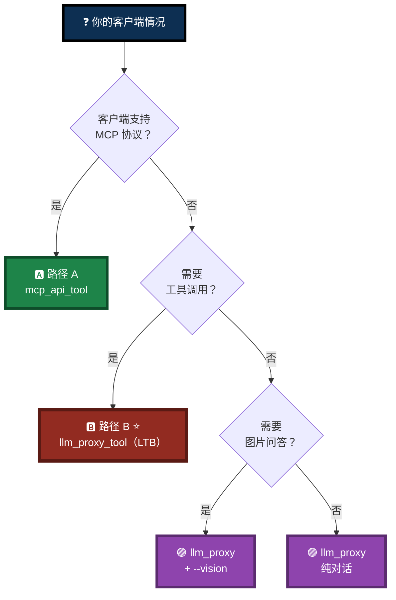

📖 **路径 A**：`src/LingoFuse_LLM_Ecosystem_User_Guide.md`
📖 **路径 B**：`src/LingoFuse_LLM_Proxy_Tool_CLI_Guide.md`
📖 **纯转发**：`src/LingoFuse_LLM_Proxy_CLI_Guide.md`

---

## 三、把 Pascal 函数接进 AI：四个步骤

> 每一步都配一个 **"问 AI 的话术模板"**，照抄即可。

### 步骤 1 · 写声明

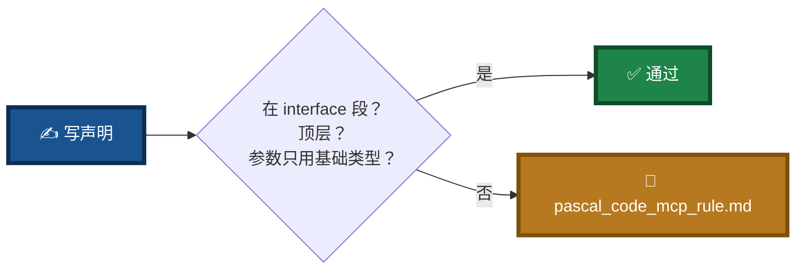

**四条铁律**：`interface` 段 + 顶层 + 禁 `var/out` + 只用整数/浮点/字符串。

**🎤 话术模板**：
> 把 `pascal_code_mcp_rule.md` 全文丢给 AI，然后问：
> 「我要暴露一个 Pascal 函数 `function DoXxx(...)`，请按这份规范**逐条检查**我写的是否合规。如果不合规，告诉我具体违反了第几节。」

---

### 步骤 2 · 生成工具提供者

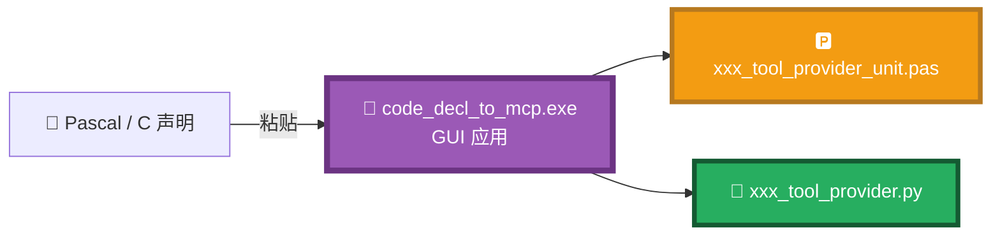

**关键点**：
- 生成器是 **GUI**，不是命令行
- 走完 5 个 Tab，最后一步复制产物
- `.pas` → `lazbuild`；`.py` → 直接 `python` 跑

**🎤 话术模板**：
> 把 `code_generate_mcp.md` 丢给 AI，然后问：
> 「我准备在 code_decl_to_mcp.exe 里粘贴我的声明。请告诉我**每个 Tab 我应该重点检查什么**，以及生成后 Pascal 侧要怎么编译。」

---

### 步骤 3 · 启动信标 + 工具提供者

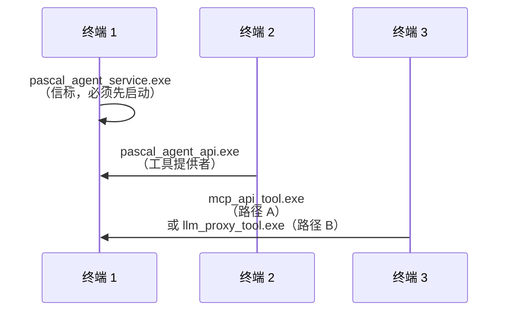

> **顺序不能乱**：信标 → 工具提供者 → 网关。

**🎤 话术模板**：
> 把 `src/LingoFuse_LLM_Proxy_Tool_CLI_Guide.md` 丢给 AI，然后问：
> 「我要用路径 B。请给我**可直接复制的启动命令**：终端 1、终端 2、终端 3 分别跑什么？我的后端是 LM Studio（127.0.0.1:1234）。」

---

### 步骤 4 · Pascal 客户端只发 `generate`

```pascal
LLM := TLLMClient.Create('LLM_Service', 'ipc:llm_service', 10000);
LLM.OnChunk := Do_LLM_Chunk;
if not LLM.Connect(err) then Exit;
if not LLM.Generate('5 加 7 等于几？', '', sid, err) then Exit;
// 客户端完全不知道工具、MCP、tool_calls 的存在
```

**🎤 话术模板**：
> 把 `src/llm_client_v3.md` 丢给 AI，然后问：
> 「我要写一个 Pascal GUI 客户端，连接 LTB。请给我**最小可运行代码**，包括连接、发送、接收流式 chunk，以及回调线程怎么 marshalling 到主线程。」

---

## 四、多模态：必须按步骤走

> ⚠️ **四条同时满足，缺一不可。** 任何一条不满足，图片都会被拒。

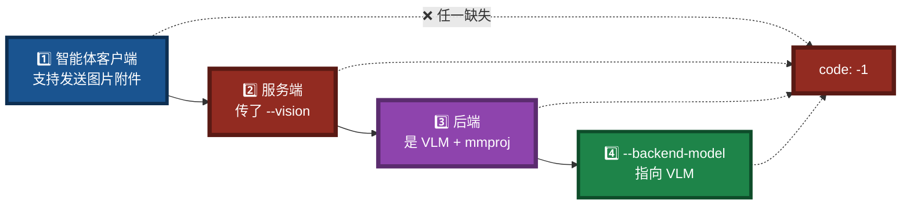

### 一步一步操作

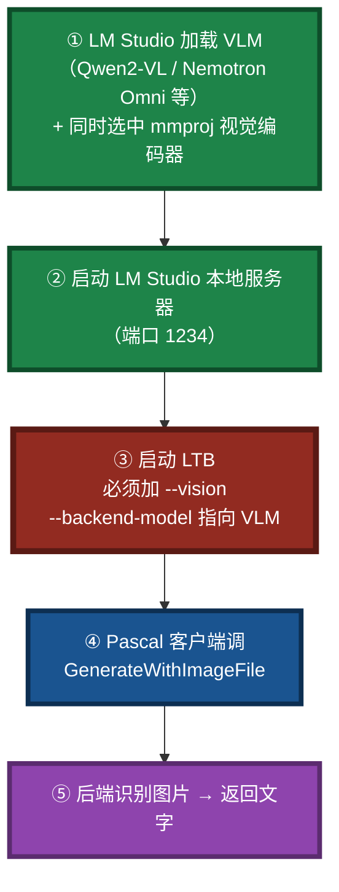

**第 3 步的正确样子**：

```powershell
.\llm_proxy_tool.exe `
  --backend-url http://127.0.0.1:1234/v1 `
  --backend-model "qwen2-vl-7b-instruct" `   # ← 必须指向 VLM
  --vision                                    # ← 必须显式加
```

### 绝对不要做的事

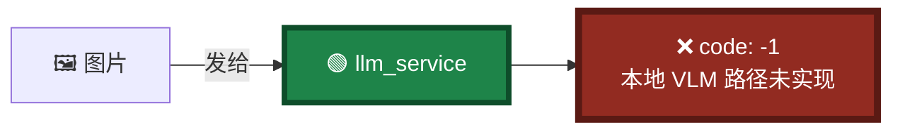

📖 **模型部署**：`NVIDIA-Nemotron-3-Nano-Omni-30B-A3B-Reasoning-UD-IQ4_XS.md`
📖 **`--vision` 详解**：`src/LingoFuse_LLM_Proxy_Tool_CLI_Guide.md` 第 4.5 节
📖 **P8 多模态坑**：`src/LingoFuse_LLM_Pitfalls_For_AI.md`

**🎤 话术模板**：
> 把 `NVIDIA-Nemotron-...md` 和 `src/LingoFuse_LLM_Proxy_Tool_CLI_Guide.md` 一起丢给 AI，然后问：
> 「我要用 LM Studio + Nemotron Omni 做图片问答。请按顺序列出**每一个操作**：LM Studio 里点什么、LTB 命令怎么敲、Pascal 客户端怎么调。任何一步我做错会报什么错？」

---

## 五、六个场景：一句话方向

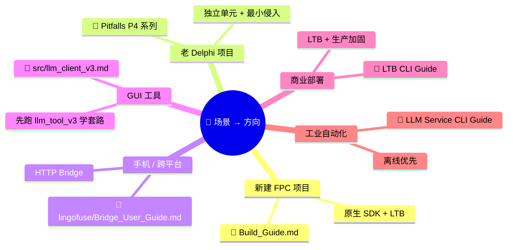

| 场景 | 关键点 |
|------|--------|
| **A 新建 FPC** | 用 `lazbuild`，不要直接 `fpc` |
| **B 老 Delphi** | 只加不改；回调要 marshalling |
| **C 手机 / Web** | `bridge.py` 是同步模式，不支持 SSE |
| **D GUI 工具** | 先编译 `llm_tool_v3` 跑通，再读源码 |
| **E 商业部署** | 密钥用文件；LTB 有四重上限 |
| **F 工业自动化** | 离线：`llm_service` + 本地 GGUF |

---

## 六、文档地图

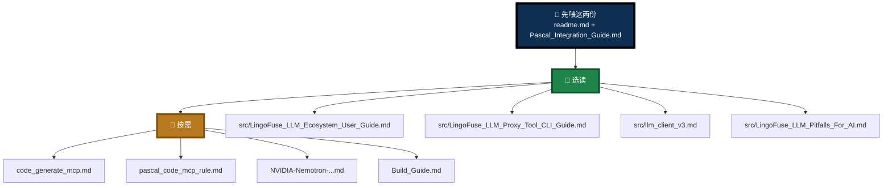

---

## 七、核心要点速记

> 📌 **三句话**：

1. **先喂 AI，再动手** —— 把 `readme.md` + 本指南丢给豆包 / 千问 / GPT，让它教你一步步做。
2. **多模态四条件同时满足** —— 智能体客户端支持图片 + 服务端 `--vision` + 后端 VLM + model 指向 VLM。
3. **细节都在专项文档** —— 本指南只给方向，参数 / 架构 / 坑点都在 `src/` 各手册里。

> 🎯 **记住这句话就够了**：
>
> **v3 的文档和代码都是给 AI 读的。让 AI 读、让 AI 教、你只管执行和反馈。遇到问题贴回去——它会告诉你翻哪份文档的第几节。**

---

**文档版本**：V5.2（AI 协作重写版 · 自查修正版——修正三步走/四步矛盾、删除虚构 token 限制、修正二进制文件陈述、统一术语）
**维护者**：LingoFuse-pasAgent 团队
**反馈**：问题提 Issue，急事加 Q（600585）