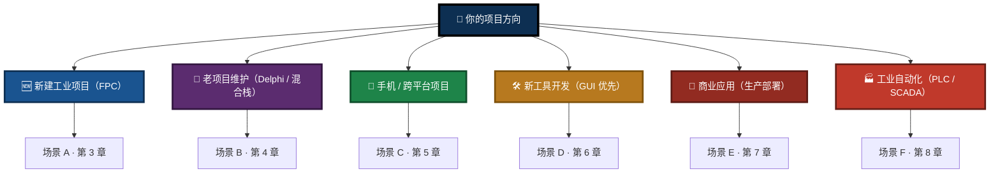
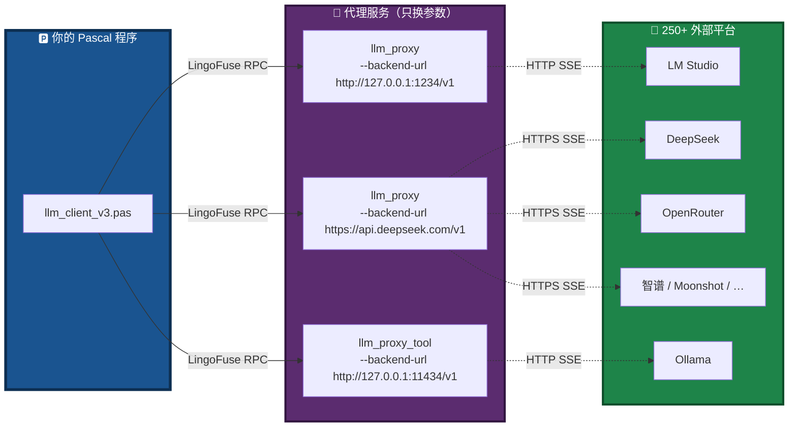
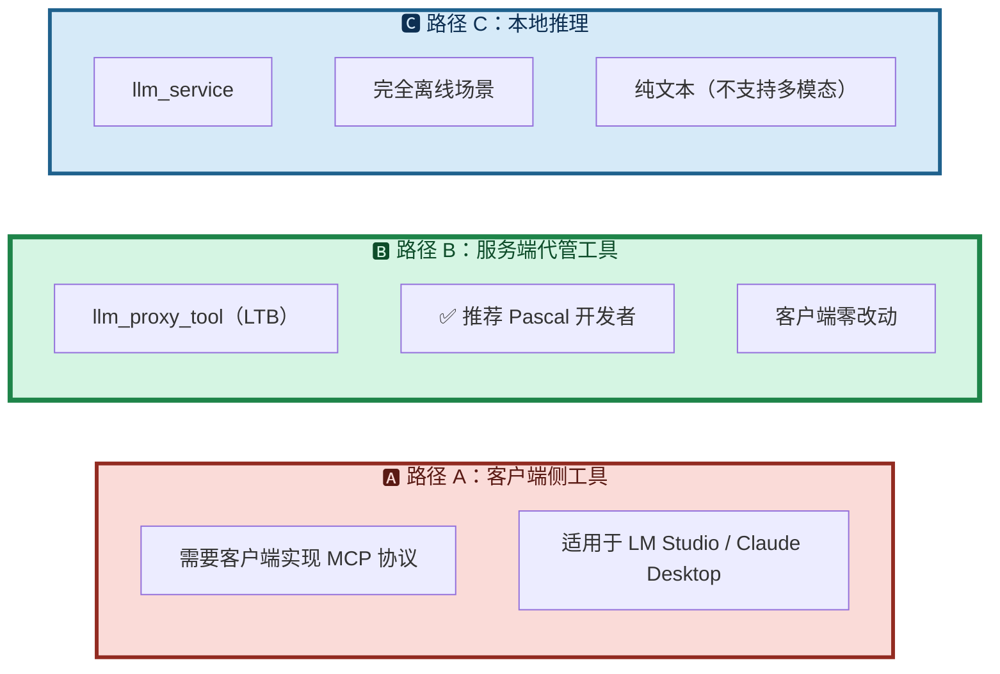
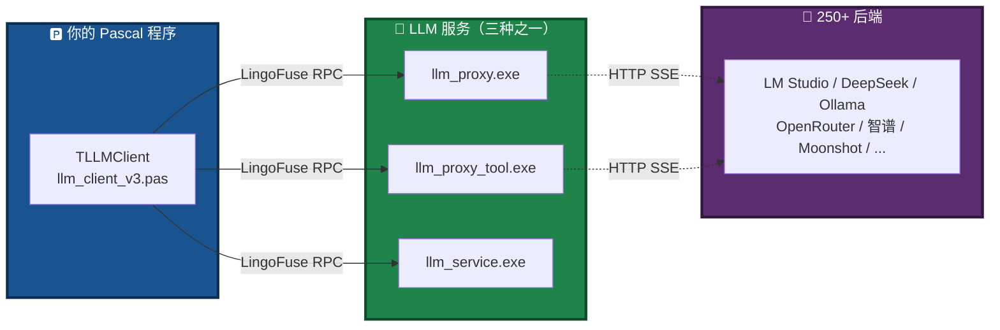
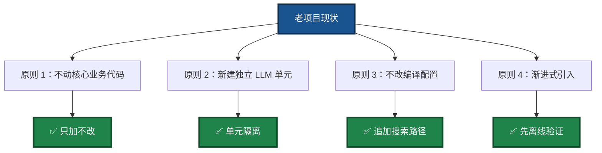
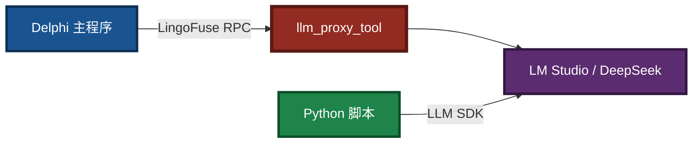
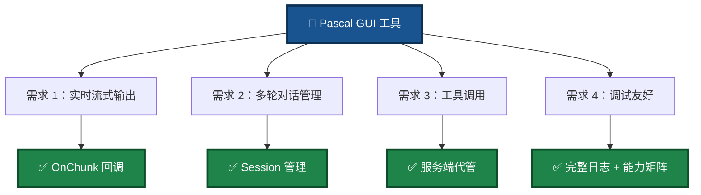
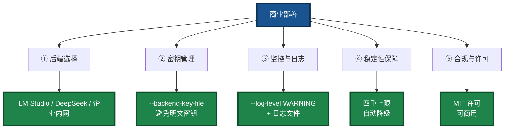
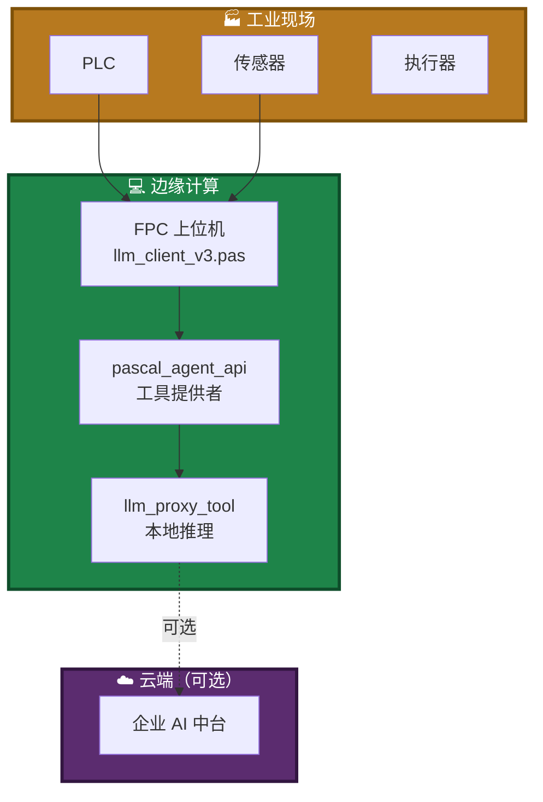

# Pascal Integration Guide — 按场景切入 pasAgent v3

> **文档名**：`Pascal_Integration_Guide.md`
> **文档版本**：V4.1（场景化重构版）
> **最后更新**：2026-09-17
> **核心价值**：**用 Pascal 写代码，让 AI 像调用本地函数一样调用你的函数；一次开发，接入 250+ 外部平台**
> **同目录相关文档**：
> - 项目总览：[`readme.md`](readme.md)
> - 编译指南：[`Build_Guide.md`](Build_Guide.md)
> - 推荐模型：[`NVIDIA-Nemotron-3-Nano-Omni-30B-A3B-Reasoning-UD-IQ4_XS.md`](NVIDIA-Nemotron-3-Nano-Omni-30B-A3B-Reasoning-UD-IQ4_XS.md)
> - 生态总览：[`src/LingoFuse_LLM_Ecosystem_User_Guide.md`](src/LingoFuse_LLM_Ecosystem_User_Guide.md)
> - LTB 手册：[`src/LingoFuse_LLM_Proxy_Tool_CLI_Guide.md`](src/LingoFuse_LLM_Proxy_Tool_CLI_Guide.md)
> - 代理手册：[`src/LingoFuse_LLM_Proxy_CLI_Guide.md`](src/LingoFuse_LLM_Proxy_CLI_Guide.md)
> - 兼容清单：[`src/LingoFuse_LLM_Proxy_Compatibility_Guide.md`](src/LingoFuse_LLM_Proxy_Compatibility_Guide.md)
> - 踩坑大全：[`src/LingoFuse_LLM_Pitfalls_For_AI.md`](src/LingoFuse_LLM_Pitfalls_For_AI.md)
> - HTTP 桥接：[`src/lingofuse/Bridge_User_Guide.md`](src/lingofuse/Bridge_User_Guide.md)
> - SDK 文档：[`src/llm_client_v3.md`](src/llm_client_v3.md)

---

## ⭐ 开篇速览（30 秒读完）

> **一句话**：pasAgent v3 让 Pascal 存量代码接入 AI 智能体，**无需写 IDL、无需生成桩代码、无需搭 HTTP 服务**。

**三个关键事实**：

| # | 事实 | 含义 |
|:-:|------|------|
| **1** | **`src/llm_client_v3.pas` 是 Pascal 标准客户端 SDK** | Pascal 程序通过它连接 LLM 生态，**代码一次开发，无需为换后端改代码** |
| **2** | **通过代理转发，可对接 250+ 外部平台** | LM Studio / Ollama / DeepSeek / OpenRouter / 智谱 / Moonshot / vLLM / … |
| **3** | **客户端代码不需要任何 MCP 知识** | 工具调用由服务端代管（路径 B），Pascal 程序只发 `generate` |

> 🟢 **全部 Pascal 代码同时兼容 Delphi 7+ 和 Free Pascal 3.0+**。

---

## 📖 阅读引导：按场景选择入口

本文档**按应用场景组织**。请根据你的项目方向选择对应章节：



**快速定位**：

| 你的项目 | 推荐章节 | 推荐路径 |
|---------|:--------:|---------|
| **FPC / Lazarus 新建项目** | 场景 A | 原生 SDK（`llm_client_v3`） |
| **Delphi 老项目** | 场景 B | 原生 SDK（最小化改动） |
| **手机 / 跨平台 / Web** | 场景 C | HTTP Bridge（`bridge.py`） |
| **需要调试 UI 的工具** | 场景 D | 原生 SDK + GUI 集成（参考 `llm_tool_v3`） |
| **商业部署** | 场景 E | 原生 SDK（+ 生产加固） |
| **工业自动化** | 场景 F | 原生 SDK + 信标工具 |

> **通用内容**（核心 SDK、250+ 平台、工具、多模态）见**第 2 章**。

---

## 第 1 章 · 核心价值：一次开发，250+ 平台接入

### 1.1 核心洞察

> **Pascal 程序代码不变，只改服务端的 `--backend-url` 参数，就能对接 250+ 种外部平台。**



### 1.2 平台接入矩阵（概览）

> **完整清单**（每条目附链接）→ [`src/LingoFuse_LLM_Proxy_Compatibility_Guide.md`](src/LingoFuse_LLM_Proxy_Compatibility_Guide.md)

| 类别 | 数量 | 代表平台 | 适用场景 |
|------|:----:|---------|---------|
| **云 API（国际）** | 40+ | OpenAI / Anthropic / Mistral / Groq / Together / OpenRouter | 商业级推理 |
| **云 API（中国区）** | 20+ | DeepSeek / 硅基流动 / 阿里百炼 / 火山豆包 / 智谱 / Moonshot | 国内合规 |
| **本地推理服务器** | 30+ | LM Studio / llama.cpp / vLLM / Ollama / LocalAI / TGI | 完全离线 |
| **网关 / 代理 / 路由** | 35+ | LiteLLM / Portkey / Helicone / New API / One API | 统一管理 |
| **API 聚合 / 中转站** | 25+ | OpenRouter / Ollama Cloud / AI/ML API / TokenMix | 多模型可选 |
| **桌面客户端（自带 Server）** | 25+ | LM Studio / GPT4All / Jan / Lobe Chat / Chatbox | 开箱即用 |
| **Web UI（OpenAI 兼容前端）** | 20+ | Open WebUI / NextChat / LibreChat | 浏览器访问 |
| **嵌入 / 重排序 / TTS / STT** | 25+ | HuggingFace TEI / Kokoro-FastAPI / faster-whisper | 部分支持 |
| **智能体框架** | 20+ | LangChain / LlamaIndex / CrewAI / AutoGen | 复杂编排 |
| **RAG 平台** | 20+ | Dify / FastGPT / AnythingLLM / RAGFlow | 知识库问答 |
| **合计** | **250+** | | |

### 1.3 三条路径，三种选择



| 路径 | 服务端 | 工具位置 | Pascal 客户端代码 | 推荐给 |
|:----:|--------|---------|:----------------:|:------:|
| **A** | `mcp_api_tool` | 客户端 | 需实现 MCP | 支持 MCP 的客户端 |
| **B** ⭐ | `llm_proxy_tool`（LTB） | 服务端 | **零改动** | **Pascal 开发者** |
| **C** | `llm_service` | 无 | 零改动 | 完全离线场景 |

---

## 第 2 章 · 核心 SDK：`llm_client_v3.pas`

> ⭐ **本章是六大场景的公共基础**。任何场景下，你都会用到本章的 SDK。

### 2.1 SDK 位置与获取

> **`llm_client_v3.pas` 位于本仓库 `src\` 目录下**，随项目一起分发。

**文件位置**：

```
<项目根>\src\llm_client_v3.pas     ← SDK 单元
<项目根>\src\llm_client_v3.md      ← SDK 文档（面向 AI / 开发者）
<项目根>\src\llm_tool_v3.lpr/.lpi  ← GUI 演示客户端
<项目根>\src\llm_tool_v3_frm.pas/.lfm
<项目根>\src\lingofuse_import.pas  ← LingoFuse 底层绑定
<项目根>\src\lingofuse_helper.pas  ← 工具辅助
```

**如果你的项目不在本仓库内**，把下面这些文件复制到你的项目搜索路径：

- `llm_client_v3.pas`
- `lingofuse_import.pas`
- `lingofuse_helper.pas`（如果你要写工具提供者）
- `zCore\`（Z 框架，`git submodule` 拉取）

### 2.2 SDK 角色



**`llm_client_v3.pas` 的角色**：Pascal 程序与 LingoFuse LLM 服务对话的**标准协议客户端**。它**不走 OpenAI 协议**，而是走 LingoFuse 二进制 RPC——**OpenAI 兼容性由服务端负责对外**。

### 2.3 为什么只有 Pascal 版本？

> **Python 没有 `llm_client_v3` 的对应物。**

- **Python 天生就能接入智能体生态**——LangChain、LlamaIndex、OpenAI SDK 都是 Python 原生，直接用即可，**不需要绕道 LingoFuse**。
- **Pascal 生态缺乏这样的基础设施**——所以 pasAgent 为 Pascal 提供了 `llm_client_v3.pas`。

### 2.4 API 速览

`TLLMClient` 的方法按功能分为 6 组：

| 组别 | 方法 | 说明 |
|------|------|------|
| **生命周期** | `Create` / `Destroy` / `Connect` / `Disconnect` | 创建、连接、断开 |
| **会话管理** | `CreateSession` / `CloseSession` / `CancelSession` / `ListSessions` | 会话增删查改 |
| **生成** | `Generate` / `GenerateWithAttachments` / `GenerateWithTextFile` / `GenerateWithImageFile` / `GenerateCurrent` | 5 种生成变体 |
| **服务端设置** | `SetSystemMessage` / `Health` | 全局设置与健康检查 |
| **能力发现** | `GetAPICapabilities` / `HasCapabilityInfo` / `LLMSupported` / `IsToolBridge` / `HasVision` / `HasAttachments` | 运行时查询服务端能力 |
| **附件释放** | `ClearTextAttachments` / `ClearImageAttachments` | 显式释放附件数组 |

> 📖 **完整的 API 参考、错误消息索引、升级模板**：见 [`src/llm_client_v3.md`](src/llm_client_v3.md)。

### 2.5 最小客户端示例

```pascal
uses
  llm_client_v3, lingofuse_import;

var
  LLM: TLLMClient;
  sid, err: string;
begin
  LLM := TLLMClient.Create('LLM_Service', 'ipc:llm_service', 10000);
  LLM.OnChunk := Do_LLM_Chunk;
  LLM.OnThink := Do_LLM_Think;
  LLM.OnFinish := Do_LLM_Finish;

  if not LLM.Connect(err) then
  begin
    WriteLn('连接失败: ', err);
    Exit;
  end;

  if not LLM.CreateSession('你是一个有用的助手。', sid, err) then
  begin
    WriteLn('建会话失败: ', err);
    Exit;
  end;

  if not LLM.Generate('你好', '', sid, err) then
    WriteLn('发送失败: ', err);

  ReadLn;
  LLM.Disconnect;
  LLM.Free;
end.
```

### 2.6 事件回调

| 事件 | 触发时机 | 建议用途 |
|------|---------|---------|
| `OnChunk(SessionId, Text)` | 收到一段正文 | 追加到输出区 |
| `OnThink(SessionId, Text)` | 收到一段思考链 | 灰色显示 |
| `OnFinish(SessionId, Reason)` | 生成结束 | 更新状态栏 |
| `OnError(SessionId, ErrMsg)` | 服务端错误 | 错误提示 |
| `OnClosed(SessionId, Reason)` | 会话关闭 | 清理会话列表 |

> 🟢 **回调在 LingoFuse 通知线程执行**。若需操作 UI，请用 `TThread.Queue` 或 `TCompute.SyncM`。详见 [`src/LingoFuse_LLM_Pitfalls_For_AI.md`](src/LingoFuse_LLM_Pitfalls_For_AI.md) 中 P4-1。

### 2.7 属性

| 属性 | 类型 | 读/写 | 说明 |
|------|------|:-----:|------|
| `CurrentSessionId` | `string` | 读/写 | 当前会话（可写以强制新会话） |
| `ClientName` | `string` | 读 | 本客户端的 LingoFuse App 名 |
| `Connected` | `boolean` | 读 | 连接状态 |
| `ServerKind` | `string` | 读 | `'service'` / `'proxy'` |
| `CapabilitiesRawJson` | `TZ_JsonString` | 读 | 能力矩阵原始 JSON |
| `LastException` | `string` | 读 | 通知线程最后捕获的异常 |

### 2.8 GUI 演示客户端：`llm_tool_v3`

`llm_tool_v3.lpi` 是 **SDK 的官方 GUI 演示程序**，展示以下能力的完整用法：

| 能力 | 演示位置 |
|------|---------|
| 连接 / 断开 / 重连 | `conn_Button` / `disconn_Button` |
| 多会话管理 | `new_session_Button` / `session_ListBox` |
| 流式输出（chunk + think） | `sse_Edit`（SynEdit）+ 独立 think 面板 |
| 多模态附件发送 | `attachment panel`（文本 + 图片） |
| 能力矩阵查询 | 启动时自动拉取 + 状态栏显示 |
| 系统提示词 | `sys_prompt_Memo`（配合 `new_session_Button` 生效） |

**编译方式**：

```cmd
cd <项目根>\src
lazbuild.exe -B .\llm_tool_v3.lpi
```

**学习建议**：先跑通 `llm_tool_v3` 的编译，通读 `llm_tool_v3_frm.pas` 源码，再动手写自己的客户端。

---

## 第 3 章 · 场景 A：新建工业项目（FPC / Lazarus）

> **适用**：用 Lazarus / FPC 从头开始开发的工业软件、桌面工具、嵌入式上位机。

### 3.1 场景定位

| 维度 | 说明 |
|------|------|
| **技术栈** | FPC 3.0+ / Lazarus 4.8+ |
| **目标平台** | Windows / Linux（可选 macOS） |
| **推荐路径** | **路径 B**（`llm_proxy_tool`）+ **原生 SDK** |
| **后端选择** | 本地 LM Studio（免费）/ DeepSeek（云） |

### 3.2 为什么选路径 B

- **客户端零改动**：Pascal 程序只发 `generate`
- **工具调用由服务端代管**：不需要 Pascal 端实现 MCP
- **接入 250+ 平台**：Pascal 程序不感知后端差异

### 3.3 项目结构建议

```
MyIndustrialApp/
├── src/
│   ├── main.lpr              # 主程序
│   ├── llm_module.pas        # LLM 集成模块（使用 llm_client_v3.pas）
│   └── ui/                    # UI 单元
├── vendor/
│   ├── llm_client_v3.pas     # 从本仓库 src\ 复制
│   ├── lingofuse_import.pas
│   ├── lingofuse_helper.pas
│   └── zCore/                 # Z 框架源码
├── MyIndustrialApp.lpi        # Lazarus 项目
└── README.md
```

### 3.4 快速上手

**第 1 步：启动 LLM 服务**

```powershell
# 启动 LM Studio 本地服务器（或 Ollama / DeepSeek）
# 然后启动 LTB
.\llm_proxy_tool.exe `
  --backend-url http://127.0.0.1:1234/v1 `
  --mcp-reg-agent-app llm_proxy_agent
```

**第 2 步：集成 `llm_client_v3.pas`**

把 `llm_client_v3.pas` + `lingofuse_import.pas` + `lingofuse_helper.pas` + `zCore/` 加入 Lazarus 项目搜索路径。

**第 3 步：写一个 LLM 集成单元**

```pascal
unit llm_module;

{$mode delphi}{$H+}

interface

uses
  Classes, SysUtils,
  llm_client_v3, lingofuse_import;

type
  TMyLLMModule = class
  private
    FClient: TLLMClient;
    FSessionId: string;
    FOnText: TProc<string>;
    procedure HandleChunk(const SessionId, Text: string);
    procedure HandleFinish(const SessionId, Reason: string);
    procedure HandleError(const SessionId, ErrorMsg: string);
  public
    constructor Create;
    destructor Destroy; override;
    function Connect(out AError: string): boolean;
    function Ask(const APrompt: string; out AError: string): boolean;
    property OnText: TProc<string> read FOnText write FOnText;
  end;

implementation

constructor TMyLLMModule.Create;
begin
  inherited;
  FClient := TLLMClient.Create('LLM_Service', 'ipc:llm_service', 10000);
  FClient.OnChunk := HandleChunk;
  FClient.OnFinish := HandleFinish;
  FClient.OnError := HandleError;
end;

destructor TMyLLMModule.Destroy;
begin
  if FClient <> nil then
  begin
    FClient.Disconnect;
    FClient.Free;
  end;
  inherited;
end;

function TMyLLMModule.Connect(out AError: string): boolean;
begin
  Result := FClient.Connect(AError);
end;

function TMyLLMModule.Ask(const APrompt: string; out AError: string): boolean;
begin
  Result := FClient.Generate(APrompt, '', FSessionId, AError);
end;

procedure TMyLLMModule.HandleChunk(const SessionId, Text: string);
begin
  if Assigned(FOnText) then
    FOnText(Text);
end;

procedure TMyLLMModule.HandleFinish(const SessionId, Reason: string);
begin
  // 更新状态栏
end;

procedure TMyLLMModule.HandleError(const SessionId, ErrorMsg: string);
begin
  // 错误提示
end;

end.
```

**第 4 步：在主程序里使用**

```pascal
uses
  llm_module;

var
  LLM: TMyLLMModule;
  err: string;
begin
  LLM := TMyLLMModule.Create;
  try
    LLM.OnText := procedure(const S: string)
      begin
        Write(S);  // 或追加到 UI
      end;

    if not LLM.Connect(err) then
    begin
      WriteLn('连接失败: ', err);
      Exit;
    end;

    if not LLM.Ask('你好', err) then
      WriteLn('提问失败: ', err);

    ReadLn;
  finally
    LLM.Free;
  end;
end.
```

### 3.5 编译

```bash
lazbuild MyIndustrialApp.lpi
```

### 3.6 注意事项

- **不要直接调 `fpc`**——用 `lazbuild` 读取 `.lpi` 中的搜索路径
- **回调在后台线程**——UI 操作必须 marshalling
- **动态库依赖**——`LingoFuse64.dll` 在 PATH 或 exe 同目录

### 3.7 相关文档

- 编译：[`Build_Guide.md`](Build_Guide.md)
- 踩坑：[`src/LingoFuse_LLM_Pitfalls_For_AI.md`](src/LingoFuse_LLM_Pitfalls_For_AI.md)
- LTB 参数：[`src/LingoFuse_LLM_Proxy_Tool_CLI_Guide.md`](src/LingoFuse_LLM_Proxy_Tool_CLI_Guide.md)

---

## 第 4 章 · 场景 B：老项目维护（Delphi / 混合栈）

> **适用**：已有的 Delphi 7+ / FPC 存量系统，需要在不破坏现有代码的前提下接入 AI。

### 4.1 场景定位

| 维度 | 说明 |
|------|------|
| **技术栈** | Delphi 7+ / FPC 3.0+ |
| **代码规模** | 大（数千到数百万行） |
| **集成目标** | **最小化侵入**，不破坏现有稳定性 |
| **推荐路径** | **路径 B**（服务端代管工具，客户端零改动） |

### 4.2 核心原则



### 4.3 集成策略：三步走

**第 1 步：独立单元，不改核心**

新建一个 `ai_llm_unit.pas`，**不修改**任何现有单元：

```pascal
unit ai_llm_unit;

interface

uses
  llm_client_v3, lingofuse_import;

type
  TAIHelper = class
  private
    FClient: TLLMClient;
    FSessionId: string;
  public
    constructor Create;
    destructor Destroy; override;
    function Connect(out AError: string): boolean;
    function Ask(const APrompt: string; out AError: string): boolean;
  end;

implementation

// ...（同场景 A）
end.
```

**第 2 步：在已有 UI 里加按钮**

在你的主窗体上**新增一个按钮**（不改现有按钮）：

```pascal
procedure TMainForm.btnAIAssistClick(Sender: TObject);
var
  helper: TAIHelper;
  err: string;
begin
  helper := TAIHelper.Create;
  try
    if not helper.Connect(err) then
    begin
      ShowMessage('AI 服务连接失败: ' + err);
      Exit;
    end;

    helper.OnText := procedure(const S: string)
      begin
        // 追加到现有 memo
      end;

    helper.Ask(edtQuestion.Text, err);
  finally
    helper.Free;
  end;
end;
```

**第 3 步：渐进式替换**

一旦 AI 功能验证通过，逐步扩展到其他场景——**每次只改一个地方**。

### 4.4 Delphi 7 / Delphi 2009+ 兼容

| Delphi 版本 | 兼容性 | 注意事项 |
|:-----------:|:------:|---------|
| **Delphi 7** | ⚠️ 可编译 | 需要 Unicode 条件编译分支 |
| **Delphi 2009+** | ✅ 完整支持 | — |
| **Delphi 11+** | ✅ 完整支持 | — |

### 4.5 混合栈场景

如果老项目是 **Delphi 主程序 + Python 脚本**：



**共享同一后端**——Delphi 用 `llm_client_v3.pas`，Python 用 OpenAI SDK，二者**可以共存**。

### 4.6 注意事项

- **不要修改现有的编译配置**——只追加搜索路径
- **不要动核心业务单元**——只新增文件
- **回调线程 marshalling**——Pascal UI 不是线程安全的
- **保留现有代码的稳定性**——任何 AI 失败都不应该拖垮主流程

### 4.7 相关文档

- 踩坑：[`src/LingoFuse_LLM_Pitfalls_For_AI.md`](src/LingoFuse_LLM_Pitfalls_For_AI.md) 中 P1-5（var/out 同签名）、P1-6（事件签名）

---

## 第 5 章 · 场景 C：手机 / 跨平台项目（HTTP Bridge）

> **适用**：手机 App、网页前端、Node.js / PHP / Go 等任意 HTTP 客户端。

### 5.1 场景定位

| 维度 | 说明 |
|------|------|
| **技术栈** | 任意支持 HTTP 的语言/平台（Swift / Kotlin / JS / PHP / Go / ...） |
| **接入方式** | **HTTP POST** → `bridge.py` → LingoFuse RPC |
| **推荐路径** | HTTP Bridge（`bridge.py`） |
| **适用场景** | 工具调用、数据查询、非流式 AI 请求 |

### 5.2 为什么用 HTTP Bridge


**核心优势**：

- **跨语言**：手机端不需要 LingoFuse 原生库
- **HTTP 标准**：任何 HTTP 客户端都能用
- **CORS 支持**：浏览器可直接调用
- **零依赖**：仅需 HTTP 请求

### 5.3 启动 Bridge

**基础启动**：

```bash
python bridge.py --endpoint ipc:lingofuse_bridge --app my_app --port 8081
```

**推荐参数**：

| 参数 | 说明 |
|------|------|
| `--host 0.0.0.0` | 监听所有网卡（默认） |
| `--port 8081` | 监听端口 |
| `--endpoint ipc:lingofuse_bridge` | LingoFuse 端点 |
| `--app my_app` | 默认目标 App（路径只有 API 名时使用） |
| `--timeout 5000` | 调用超时（毫秒） |
| `--no-precheck` | 禁用 `check_api` 预检（避免缓存误报） |
| `--debug` | 输出调试日志 |

**完整手册** → [`src/lingofuse/Bridge_User_Guide.md`](src/lingofuse/Bridge_User_Guide.md)

### 5.4 手机端调用示例

**路径格式**：

- `/app_name/api_name` —— 显式指定 App 和 API
- `/api_name` —— 使用 `--app` 指定的默认 App

**示例 1：调用工具 API（同步返回）**

```bash
# 调用 my_calculator 应用的 add API
curl -X POST http://192.168.1.100:8081/my_calculator/add \
  -H "Content-Type: application/json" \
  -d '{"a": 5, "b": 7}'

# 返回：{"result": 12}
```

**示例 2：Swift（iOS）**

```swift
let url = URL(string: "http://192.168.1.100:8081/my_calculator/add")!
var request = URLRequest(url: url)
request.httpMethod = "POST"
request.setValue("application/json", forHTTPHeaderField: "Content-Type")
request.httpBody = "{\"a\": 5, \"b\": 7}".data(using: .utf8)

URLSession.shared.dataTask(with: request) { data, response, error in
    if let data = data {
        let json = try? JSONSerialization.jsonObject(with: data)
        print(json)  // {"result": 12}
    }
}.resume()
```

**示例 3：Kotlin（Android）**

```kotlin
val client = OkHttpClient()
val body = "{\"a\": 5, \"b\": 7}".toRequestBody("application/json".toMediaType())
val request = Request.Builder()
    .url("http://192.168.1.100:8081/my_calculator/add")
    .post(body)
    .build()

client.newCall(request).enqueue(object : Callback {
    override fun onResponse(call: Call, response: Response) {
        println(response.body?.string())  // {"result": 12}
    }
    override fun onFailure(call: Call, e: IOException) { }
})
```

**示例 4：JavaScript / 浏览器**

```javascript
fetch('http://192.168.1.100:8081/my_calculator/add', {
  method: 'POST',
  headers: { 'Content-Type': 'application/json' },
  body: JSON.stringify({ a: 5, b: 7 })
})
.then(r => r.json())
.then(data => console.log(data));  // {"result": 12}
```

### 5.5 桥接的实际用途

| 用途 | 说明 |
|------|------|
| **移动端工具调用** | 手机 App 通过 HTTP 调用 Pascal 工具 |
| **网页端集成** | 浏览器直接调用后端工具（无需 WebSocket） |
| **跨语言微服务** | Node.js / PHP / Go 等访问 Pascal 服务 |
| **IoT 设备** | 嵌入式设备通过 HTTP 调用远程工具 |

### 5.6 流式输出的限制与替代

> ⚠️ `bridge.py` 是**同步请求-响应**模式，**不支持流式（SSE）**。

**原因**：`bridge.py` 转发 `LF_Call` 并等待响应，不参与 LingoFuse 的 Notify 流。

**替代方案**：

| 需求 | 方案 |
|------|------|
| **同步工具调用** | 直接用 `bridge.py`（推荐） |
| **流式 LLM 输出** | 手机端需实现 SSE 客户端，配合专门的 HTTP 代理（不在本仓库） |
| **非流式 AI 请求** | 用 `bridge.py` 调用一个同步封装的 LLM 工具 |

### 5.7 安全建议

- **反向代理**：生产环境建议在 `bridge.py` 前置 nginx 做 TLS/认证
- **限制 App 白名单**：只暴露必要的 API
- **CORS 配置**：`bridge.py` 默认 `Access-Control-Allow-Origin: *`，生产环境应收紧
- **超时保护**：`--timeout` 参数防止长时间挂起

### 5.8 相关文档

- HTTP Bridge 完整手册：[`src/lingofuse/Bridge_User_Guide.md`](src/lingofuse/Bridge_User_Guide.md)

---

## 第 6 章 · 场景 D：新工具开发（GUI 优先）

> **适用**：需要复杂交互、调试界面、实时反馈的 Pascal 桌面工具。

### 6.1 场景定位

| 维度 | 说明 |
|------|------|
| **技术栈** | Lazarus / Delphi + LCL / VCL |
| **核心诉求** | **调试 UI 好用** + **实时反馈** |
| **推荐路径** | **路径 B** + **原生 SDK** |
| **特色** | 流式回调 + 多轮对话 + 会话管理 |
| **参考实现** | **`llm_tool_v3`**（本仓库 GUI 演示客户端） |

### 6.2 为什么 Pascal GUI 工具用 pasAgent



### 6.3 学习起点：先跑通 `llm_tool_v3`

在动手写自己的 GUI 之前，**先编译并运行官方演示 `llm_tool_v3`**：

```cmd
cd <项目根>\src
lazbuild.exe -B .\llm_tool_v3.lpi
.\llm_tool_v3.exe
```

它展示了所有关键模式的**可运行实现**，是最快的上手法：

- 连接 / 断开 / 重连
- 多会话切换
- 流式输出（正文 + 思考）
- 多模态附件
- 系统提示词生效路径

**源码**：`src\llm_tool_v3_frm.pas`。

### 6.4 关键设计模式

**模式 1：会话隔离**

每个 UI 会话维护独立的 `session_id`：

```pascal
type
  TChatTab = class
  private
    FSessionId: string;
    FClient: TLLMClient;
    FOutputMemo: TMemo;
  public
    procedure SendMessage(const Text: string);
    procedure HandleChunk(const SessionId, Text: string);
  end;

procedure TChatTab.HandleChunk(const SessionId, Text: string);
begin
  // ✅ 会话过滤：只处理当前 tab 的会话
  if SessionId <> FSessionId then Exit;

  // ✅ 主线程 marshalling
  TThread.Queue(nil,
    procedure
    begin
      FOutputMemo.Lines.Add(Text);
    end);
end;
```

**模式 2：思考流与正文流分离**

```pascal
procedure TChatTab.HandleThink(const SessionId, Text: string);
begin
  if SessionId <> FSessionId then Exit;
  TThread.Queue(nil,
    procedure
    begin
      // 思考流显示在单独的"推理过程"面板
      FThinkMemo.Lines.Add(Text);
    end);
end;
```

**模式 3：多会话标签页**

```pascal
type
  TMainForm = class(TForm)
  private
    FTabs: TObjectList<TChatTab>;
  public
    procedure NewTab;
    procedure CloseTab(Index: integer);
  end;
```

### 6.5 调试 UI 推荐配置

| 组件 | 用途 |
|------|------|
| **sse_Edit（SynEdit）** | 输出区，支持语法高亮 |
| **LogMemo** | 调试日志（含能力矩阵、健康检查） |
| **sys_prompt_Memo** | 系统提示词编辑 |
| **attachment panel** | 附件管理（文本 / 图片） |
| **sysTimer** | 驱动 `LF_Sync`（周期 30ms） |

### 6.6 关键实现

**Timer 驱动软同步**：

```pascal
procedure TMainForm.sysTimerTimer(Sender: TObject);
begin
  while LF_GetStatusCount > 0 do
    DoStatus(LF_GetStatusEx);
  Check_Soft_Thread_Synchronize(0);
  LF_Sync;
end;
```

**设置 Timer**：

```pascal
sysTimer.Interval := 30;  // 30ms
sysTimer.Enabled := True;
```

### 6.7 多模态支持（可选）

若后端为 VLM：

```pascal
procedure TChatTab.SendWithImage(const Text, ImagePath: string);
var
  err: string;
  sid: string;
begin
  sid := FSessionId;
  if not FClient.GenerateWithImageFile(Text, '', ImagePath, sid, err) then
    ShowMessage('发送失败: ' + err);
end;
```

> ⚠️ **`llm_service` 不支持多模态**。要走多模态，请连接 `llm_proxy` / `llm_proxy_tool`，后端加载 VLM。

### 6.8 相关文档

- LTB 手册：[`src/LingoFuse_LLM_Proxy_Tool_CLI_Guide.md`](src/LingoFuse_LLM_Proxy_Tool_CLI_Guide.md)
- 踩坑 P4 系列：[`src/LingoFuse_LLM_Pitfalls_For_AI.md`](src/LingoFuse_LLM_Pitfalls_For_AI.md)
- SDK 文档：[`src/llm_client_v3.md`](src/llm_client_v3.md)

---

## 第 7 章 · 场景 E：商业应用（生产部署）

> **适用**：商业软件、企业内网系统、需要长期稳定运行的生产环境。

### 7.1 场景定位

| 维度 | 说明 |
|------|------|
| **技术栈** | Delphi / FPC 生产系统 |
| **核心诉求** | **稳定性** + **可维护性** + **合规** |
| **推荐路径** | 路径 B（LTB）+ 生产加固 |

### 7.2 生产部署 Checklist



### 7.3 后端选择矩阵

| 场景 | 推荐后端 | 理由 |
|------|---------|------|
| **完全离线** | LM Studio + 本地 GGUF | 数据不出本机 |
| **企业内网** | 自建 vLLM / Ollama | 集中管理，高吞吐 |
| **公有云** | DeepSeek / 智谱 | 无需运维，按量付费 |
| **多模型混用** | OpenRouter / LiteLLM | 一次接入，多模型可选 |

### 7.4 密钥管理

```powershell
# ❌ 不要：密钥出现在命令行
.\llm_proxy_tool.exe --backend-key sk-xxxxxxxx

# ✅ 推荐：从文件读取
echo "sk-xxxxxxxx" > api_key.txt
.\llm_proxy_tool.exe --backend-key-file ./api_key.txt
```

**文件权限**：

- Windows：`icacls api_key.txt /inheritance:r /grant:r "%USERNAME%:R"`
- Linux：`chmod 600 api_key.txt`

### 7.5 监控与日志

**生产日志配置**：

```powershell
.\llm_proxy_tool.exe `
  --backend-url https://api.deepseek.com/v1 `
  --backend-key-file ./api_key.txt `
  --log-level WARNING
```

**日志内容**：

- 启动 / 关闭
- 会话生命周期
- 错误与警告
- LTB 工具调用（仅 DEBUG 级别）

### 7.6 稳定性保障

**LTB 的四重上限**：

| 参数 | 默认值 | 作用 |
|------|:------:|------|
| `--max-tool-rounds` | 100 | 防无限循环 |
| `--max-total-tool-calls` | 50 | 防批量爆炸 |
| `--max-tool-result-chars` | 8000 | 防单结果过大 |
| `--max-total-tool-result-chars` | 200000 | 防累积爆炸 |

**自动降级**：工具不可用时自动降级为纯文本代理。

**会话回收**：

- `llm_proxy` / LTB：单条件（超时）
- `llm_service`：双条件（超时 + 客户端离线）

### 7.7 合规与许可

- **MIT 许可证**——自由商用、修改、分发
- **无商业捆绑**——无付费订阅、无隐藏收费
- **数据可控**——本地 / 内网部署方案完全自主

### 7.8 生产部署架构

```mermaid
flowchart TB
    subgraph Clients["🖥️ 客户端"]
        C1["Pascal 桌面"]
        C2["手机 App"]
        C3["Web 前端"]
    end

    subgraph Servers["🎯 服务端集群"]
        S1["llm_proxy_tool<br/>主"]
        S2["llm_proxy_tool<br/>备"]
        S3["bridge.py<br/>HTTP 网关"]
    end

    subgraph Backends["🔌 后端"]
        B1["LM Studio 集群"]
        B2["DeepSeek 云"]
    end

    C1 --> S1
    C2 --> S3
    C3 --> S3
    S3 --> S2
    S1 --> B1
    S2 --> B2

    style Clients fill:#1A5490,stroke:#0D2F52,stroke-width:3px,color:#FFFFFF
    style Servers fill:#1E8449,stroke:#0E4D2A,stroke-width:3px,color:#FFFFFF
    style Backends fill:#5B2C6F,stroke:#321640,stroke-width:3px,color:#FFFFFF
```



### 7.9 相关文档

- 生产部署：[`src/LingoFuse_LLM_Proxy_Tool_CLI_Guide.md`](src/LingoFuse_LLM_Proxy_Tool_CLI_Guide.md)
- 稳定性经验：[`src/LingoFuse_LLM_Service_Work_Summary.md`](src/LingoFuse_LLM_Service_Work_Summary.md)

---

## 第 8 章 · 场景 F：工业自动化（PLC / SCADA）

> **适用**：工业控制系统、PLC 上位机、SCADA、MES 等。

### 8.1 场景定位

| 维度 | 说明 |
|------|------|
| **技术栈** | FPC / Delphi + 工控协议（Modbus / OPC UA / ...） |
| **核心诉求** | **确定性** + **可追溯** + **离线可用** |
| **推荐路径** | **路径 B + 本地推理** |

### 8.2 典型架构



### 8.3 工业场景的 AI 用途

| 用途 | 说明 |
|------|------|
| **故障诊断** | 输入报警文本，AI 给出诊断建议 |
| **工艺优化** | 输入参数序列，AI 推荐优化方案 |
| **报表生成** | 输入生产数据，AI 生成自然语言报告 |
| **操作辅助** | 输入设备状态，AI 给出操作建议 |
| **异常检测** | AI 分析异常模式 |

### 8.4 离线优先的部署

**完全离线方案**：


**启动命令**：

```powershell
.\llm_service.exe `
  --model-path D:\models\nemotron.gguf `
  --gpu-layers 0 `
  --threads 8 `
  --context-size 8192 `
  --quiet
```

**优点**：

- 完全离线——数据不出本地
- 无网络依赖
- 确定性高

**注意**：

- **不支持多模态**（图片问答请用 LTB + VLM 后端）
- **显存/内存需求较大**（30B 模型需 ~24GB 内存）

### 8.5 工业工具调用

若需要调用工业工具（如 PLC 读取、数据库查询）：

```pascal
// 1) 工具提供者（Pascal 服务端）
// 注册工具到信标
App.RegisterCall('read_plc', 'Read PLC register', nil, @do_read_plc);

// 2) LTB 启动
// .\llm_proxy_tool.exe --backend-url ... --mcp-tool-provider-app your_app

// 3) 客户端调用（零改动）
LLM.Generate('读取 PLC 寄存器 100 的值', '', sid, err);
```

### 8.6 数据安全

| 层级 | 措施 |
|------|------|
| **传输** | IPC（本地）或 TLS（跨机） |
| **存储** | 本地加密 |
| **访问** | 网络隔离 + 认证 |
| **审计** | 完整日志（`--log-level DEBUG`） |

### 8.7 可靠性保障

| 措施 | 说明 |
|------|------|
| **进程守护** | 用 systemd / NSSM 守护 `llm_proxy_tool` |
| **超时设置** | `--backend-timeout` 防止长挂起 |
| **自动重启** | 异常退出时自动重启 |
| **健康检查** | 定期调用 `health` API |
| **离线降级** | 云端不可用时自动切换到本地模型 |

### 8.8 相关文档

- 本地推理：[`src/LingoFuse_LLM_Service_CLI_guide.md`](src/LingoFuse_LLM_Service_CLI_guide.md)
- 模型部署：[`NVIDIA-Nemotron-3-Nano-Omni-30B-A3B-Reasoning-UD-IQ4_XS.md`](NVIDIA-Nemotron-3-Nano-Omni-30B-A3B-Reasoning-UD-IQ4_XS.md)

---

## 第 9 章 · Delphi / FPC 双编译器兼容

> 🟢 **本指南涉及的所有 Pascal 代码，同时兼容 Delphi 和 Free Pascal 两种编译器。**

### 9.1 兼容性一览

| 组件 | Delphi 7+ | Delphi 2009+ | FPC 3.0+ | Lazarus 4.8 |
|------|:---------:|:------------:|:--------:|:-----------:|
| `llm_client_v3.pas` | ⚠️ | ✅ | ✅ | ✅ |
| `llm_tool_v3_frm.pas` | ⚠️ | ✅ | ✅ | ✅ |

> **说明**：
> - ⚠️ Delphi 7 可编译，但 Unicode / 泛型等特性需要条件编译分支
> - ✅ 完整支持

### 9.2 编译方式对照

| 场景 | Delphi 用户 | FPC / Lazarus 用户 |
|------|-------------|-------------------|
| **编译 `.dpr`（Delphi 项目）** | Delphi IDE 打开 → `Ctrl+F9` | ⚠️ 建议用 Lazarus 转换 |
| **编译 `.lpi`（Lazarus 项目）** | ⚠️ 需手工转换 | `lazbuild project.lpi` |
| **编译 `.lpr`（FPC 命令行程序）** | 可改用 `program xxx;` 语法编译 | `lazbuild xxx.lpi` 或 `fpc xxx.lpr` |
| **推荐做法** | 使用 Delphi IDE | 使用 `lazbuild`（**不要用 `fpc` 命令行**） |

### 9.3 条件编译技巧

在源码中已通过条件编译指令统一两端：

```pascal
{$ifdef FPC}
  {$mode delphi}{$H+}
  {$modeswitch advancedrecords}
  {$CODEPAGE UTF8}
{$endif}
{$APPTYPE CONSOLE}
```

### 9.4 获取 LingoFuse 动态库

所有 Pascal EXE 运行都需要 **`LingoFuse64.dll`** / **`liblingofuse.so`**：

```bash
git clone --recursive https://github.com/PassByYou888/LingoFuse.git
# 然后将 LingoFuse/Binary 目录加入系统 PATH
```

> 💡 **预编译包已内置所需动态库**，无需单独安装。

---

## 第 10 章 · 常见问题

### Q1：我是 Delphi 用户，能用吗？

> ✅ **能**。`llm_client_v3.pas` 同时兼容 Delphi 7+ 和 FPC 3.0+。

### Q2：我的 Pascal 函数有复杂参数类型怎么办？

> ⚠️ **这是工具提供者侧的问题，不是客户端侧的问题**。
>
> 若你要把 Pascal 函数暴露为工具，需要遵守声明规范（复杂类型会被跳过）。若你只是用 Pascal 客户端**调用** AI，则**没有任何类型限制**。

### Q3：`llm_client_v3.pas` 在哪里下载？

> **就在本仓库 `src\` 目录下**，随项目一起分发。
>
> 如果你的项目不在本仓库内，直接复制以下文件到你的项目搜索路径：
> - `src\llm_client_v3.pas`
> - `src\lingofuse_import.pas`
> - `src\lingofuse_helper.pas`（写工具时）
> - `zCore\`（`git submodule update --init --recursive` 拉取）

### Q4：如何切换后端？

> **只改服务端启动参数**。Pascal 代码一行不改。
>
> ```powershell
> # 换成 DeepSeek
> .\llm_proxy.exe --backend-url https://api.deepseek.com/v1 --backend-key sk-xxx
> ```

### Q5：250+ 后端具体有哪些？

> 见 [`src/LingoFuse_LLM_Proxy_Compatibility_Guide.md`](src/LingoFuse_LLM_Proxy_Compatibility_Guide.md)。

### Q6：手机 App 怎么接入？

> 用 `bridge.py`（HTTP Bridge）。手机端只需发 HTTP POST。详见**第 5 章**。

### Q7：能商用吗？

> ✅ **能**。**MIT 许可证**。自由使用、修改、分发、商用，**无需付费**。

### Q8：Pascal 客户端需要实现 MCP 协议吗？

> ❌ **不需要**。用 `llm_proxy_tool.exe`（LTB），工具调用由服务端代管。

### Q9：Pascal 客户端能处理图片吗？

> ✅ **能**——只要后端是 VLM（通过 `llm_proxy` / `llm_proxy_tool` 转发）。用 `GenerateWithImageFile` / `GenerateWithAttachments`。
>
> ⚠️ 注意：**`llm_service` 本身不支持多模态**，请不要把图片发给它。

### Q10：编译时提示找不到单元怎么办？

> - 确保用 `lazbuild` 编译（**不要直接调 `fpc`**）
> - 确认 `.lpi` 文件中的单元搜索路径已正确配置
> - 缺少的单元从 **本仓库 `src\`** 或 **LingoFuse 核心仓库** 获取（视具体单元而定）

### Q11：有没有 GUI 演示可以直接跑？

> ✅ **有**。`src\llm_tool_v3.lpi` 是官方 GUI 演示客户端：
>
> ```cmd
> cd src
> lazbuild.exe -B .\llm_tool_v3.lpi
> .\llm_tool_v3.exe
> ```
>
> 它展示连接、多会话、流式输出、多模态附件、系统提示词等全部关键用法。源码：`src\llm_tool_v3_frm.pas`。

---

## 第 11 章 · 相关文档

### 根目录文档

| 文档 | 说明 |
|------|------|
| [`readme.md`](readme.md) | 项目总览与四大核心应用组件 |
| [`Build_Guide.md`](Build_Guide.md) | 编译指南 |
| [`NVIDIA-Nemotron-3-Nano-Omni-30B-A3B-Reasoning-UD-IQ4_XS.md`](NVIDIA-Nemotron-3-Nano-Omni-30B-A3B-Reasoning-UD-IQ4_XS.md) | 推荐模型下载与部署 |
| [`code_generate_mcp.md`](code_generate_mcp.md) | 代码生成器使用手册 |
| [`pascal_code_mcp_rule.md`](pascal_code_mcp_rule.md) | Pascal 声明规范 |
| [`C_code_mcp_rule.md`](C_code_mcp_rule.md) | C 声明规范 |

### `src/` 子目录文档

| 文档 | 说明 |
|------|------|
| [`src/LingoFuse_LLM_Ecosystem_User_Guide.md`](src/LingoFuse_LLM_Ecosystem_User_Guide.md) | 生态总览 |
| [`src/LingoFuse_LLM_Proxy_Tool_CLI_Guide.md`](src/LingoFuse_LLM_Proxy_Tool_CLI_Guide.md) | LTB 命令行手册 |
| [`src/LingoFuse_LLM_Proxy_CLI_Guide.md`](src/LingoFuse_LLM_Proxy_CLI_Guide.md) | 纯转发代理命令行手册 |
| [`src/LingoFuse_LLM_Proxy_Compatibility_Guide.md`](src/LingoFuse_LLM_Proxy_Compatibility_Guide.md) | **250+ 后端兼容清单** |
| [`src/LingoFuse_LLM_Pitfalls_For_AI.md`](src/LingoFuse_LLM_Pitfalls_For_AI.md) | 踩坑大全 |
| [`src/LingoFuse_LLM_Service_CLI_guide.md`](src/LingoFuse_LLM_Service_CLI_guide.md) | 本地推理服务手册 |
| [`src/LingoFuse_LLM_Service_Work_Summary.md`](src/LingoFuse_LLM_Service_Work_Summary.md) | 版本演进 |
| [`src/llm_client_v3.md`](src/llm_client_v3.md) | **Pascal 客户端 SDK 文档** |
| [`src/lingofuse/Bridge_User_Guide.md`](src/lingofuse/Bridge_User_Guide.md) | HTTP 桥接手册 |
| [`src/pascal_agent_api_ref_json.md`](src/pascal_agent_api_ref_json.md) | `agent_main` / `register_agent` JSON 结构详解 |

### LingoFuse 核心仓库

| 资源 | 说明 |
|------|------|
| [LingoFuse 主仓库](https://github.com/PassByYou888/LingoFuse) | 跨语言 RPC 网格 + 服务发现基础设施 |
| [zIPC 仓库](https://github.com/PassByYou888/zIPC) | 进程通信组件 |

---

## 第 12 章 · 核心要点速记

> 📌 **三句话记住本文档**：

1. **`src/llm_client_v3.pas` 是 Pascal 标准客户端 SDK**——**位于本仓库 `src\` 目录**，随项目一起分发。
2. **一次开发，250+ 平台接入**——Pascal 程序代码不变，只改服务端的 `--backend-url`。
3. **工具调用客户端零改动**——用 `llm_proxy_tool.exe`（LTB），服务端代管工具调用。

> 🎯 **六大场景一句话**：

| 场景 | 一句话 |
|------|--------|
| **A 新工业项目** | FPC / Lazarus 原生 SDK + 路径 B |
| **B 老项目维护** | 独立单元 + 最小化侵入 + 渐进引入 |
| **C 手机 / 跨平台** | HTTP Bridge（`bridge.py`）——任何 HTTP 客户端都能用 |
| **D 新工具开发** | 原生 SDK + GUI 集成（先跑 `llm_tool_v3` 学套路） |
| **E 商业部署** | 路径 B + 生产加固（密钥 / 日志 / 上限） |
| **F 工业自动化** | 路径 B + 本地推理（离线优先） |

> 🎯 **记住这句话就够了**：
>
> **用 Pascal 写客户端 → 用 `llm_proxy_tool` 转发 → AI 调用你的工具 / 处理你的图片 / 对接 250+ 平台。全程 Pascal，无需重写。**

---

**文档版本**：V4.1（场景化重构版——SDK 位置修正为本仓库、`129+` → `250+` 统一、GUI 演示 `llm_tool_v3` 补充、文档索引更新）
**维护者**：LingoFuse-pasAgent 团队
**反馈**：问题提 Issue，急事加 Q（600585）
