# code_decl_to_mcp 使用手册

**版本**：V5.0  
**最后更新**：2026-09-15  
**适用工具**：`code_decl_to_mcp.exe`（LingoFuse-pasAgent 工具链）  

**本次更新（V5.0）** 重大更新内容：

- 🎉 **新增 Python 目标代码生成，已实测通过** —— 一个 Pascal/C 声明，现在可以一键生成 **Pascal 工具提供者** 和 **Python 工具提供者** 两种形态。
- ✅ **修正 Python 生成器的两处历史缺陷**：UnboundLocalError（v1.1）与非 ASCII 字符截断（v1.0），生成代码可直接运行。
- 🚀 **新增「几十种语言的未来蓝图」章节** —— 展示从双语言到多语言的演进路线。
- 📊 **补充双目标生成的对比结构** —— Pascal 版本与 Python 版本的逐层差异对照。
- 🔄 **同步最新 GUI 源码**：确认「Final source」Tab 中 `pas_TabSheet` / `Py_TabSheet` 双页并存。
- 📌 相关文档链接路径修正为「同目录 / `src/` 子目录」两种。

---

## 0. 一图总览

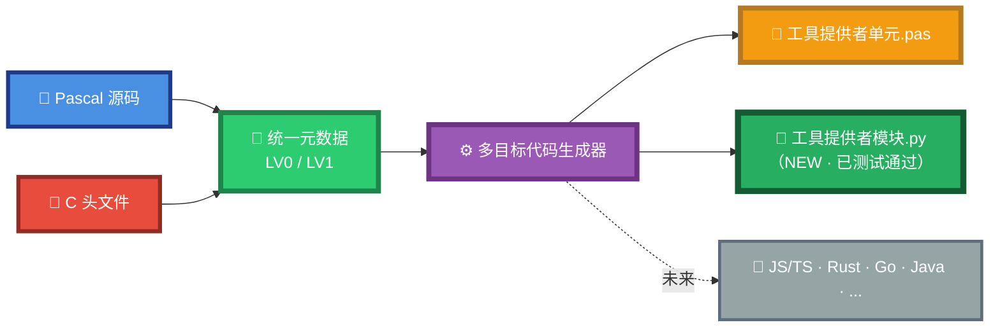

**一句话**：**把 Pascal/C 的函数声明，自动变成 AI 可调用的 MCP 工具**——**同时输出 Pascal 和 Python 两种工具提供者**。

> **⚠️ 工具源码归属**：本仓库（`LingoFuse-pasAgent`）**只提供** `code_decl_to_mcp` 的**使用手册**（本文档）和**声明规范**（`pascal_code_mcp_rule.md`、`C_code_mcp_rule.md`），**不包含**该工具的 Pascal 源码（`Z.Pascal_Func_Tool.pas`、`pascal_func_model.pas`、`pas_mcp_generator_tool.pas`、`py_mcp_generator_tool.pas`）。这些源码属于 **LingoFuse 核心仓库**（[github.com/PassByYou888/LingoFuse](https://github.com/PassByYou888/LingoFuse)）。若需使用该工具，请从预编译发布页获取 `code_decl_to_mcp.exe`。

---

## 1. 工具使命

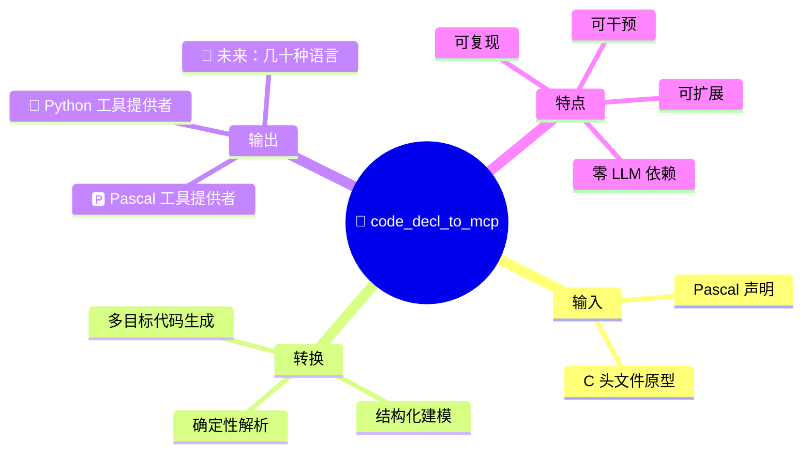

> ⚠️ **不是"AI 帮你写代码"**——主链路完全确定性，不依赖 LLM 随机性。

---

## 2. 双目标代码生成（V5.0 核心亮点）

> 🎉 **一个声明，两份工具提供者**——**Pascal 和 Python 同时输出，均已实测可用**。

### 2.1 双目标生成全景

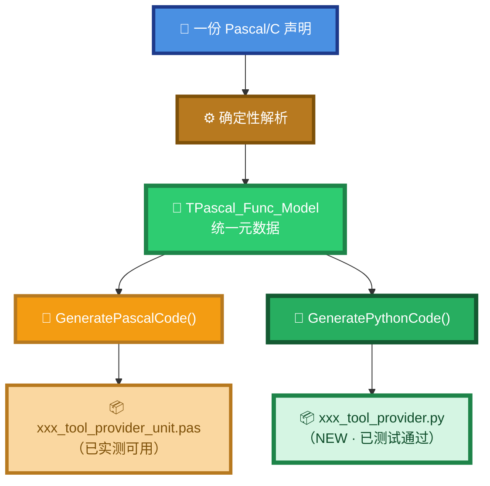

### 2.2 一次点击，双份产物

在 GUI 的「5️⃣ Final source」Tab 中，你会看到**两个子标签页**：

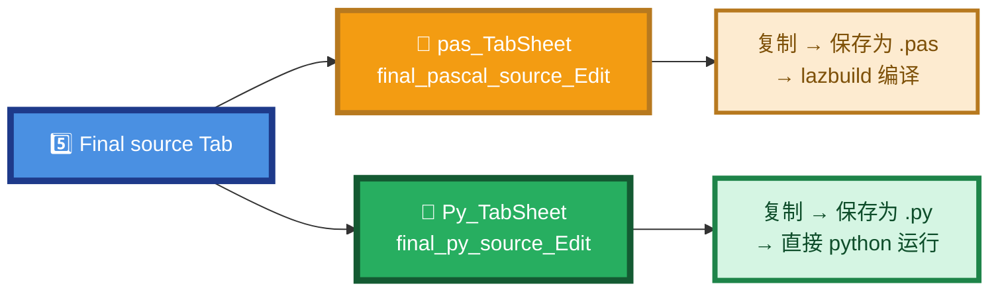

**GUI 内部的调用链**（来自 `code_decl_to_mcp_frm.pas` 的 `Button6Click`）：

```pascal
// 1) 从 LV1 模型加载
func_model := TPascal_Func_Model.Create;
func_model.LoadFromJson(model_json_edit.Text);

// 2) 生成 Pascal 工具提供者
l := GeneratePascalCode(func_model);
if l <> nil then
begin
  l.AssignTo(final_pascal_source_Edit.Lines);   // → pas_TabSheet
  disposeObjectAndNil(l);
end;

// 3) 生成 Python 工具提供者
l := GeneratePythonCode(func_model);
if l <> nil then
begin
  l.AssignTo(final_py_source_Edit.Lines);        // → Py_TabSheet
  disposeObjectAndNil(l);
end;
```

> ⭐ **两份产物同源**——都从同一份 `TPascal_Func_Model` 生成，**内容语义完全一致**，只是目标语言不同。  
> ⭐ **两份产物可用**——Pascal 版本经过长期使用验证，Python 版本经过测试通过（见 2.4 节）。

### 2.3 两份产物结构对照

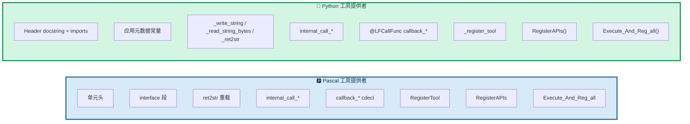

**逐层对照**：

| 层次 | Pascal 版本 | Python 版本 |
|------|-----------|-----------|
| **头部** | `unit xxx_tool_provider_unit;` + 编译指令 | `# -*- coding: utf-8 -*-` + docstring |
| **导入** | `uses lingofuse_import;` | `from lingofuse._lf_native import (...)` |
| **元数据常量** | `MY_APP_NAME` / `IPC_ENDPOINT` / ... | `MY_APP_NAME` / `IPC_ENDPOINT` / ... |
| **底层字符串 I/O** | `LF_ReadStringBytes` / `LF_WriteStringBytes` | `_write_string` / `_read_string_bytes` |
| **类型转换** | `ret2str` 重载（Int64/Double/string） | `_ret2str(v)` 单一函数 |
| **内部包装** | `internal_call_*` 函数 | `internal_call_*` 函数（**TODO 占位**） |
| **回调** | `procedure Callback_*(...); cdecl;` | `@LFCallFunc def callback_*(...):` |
| **注册单个工具** | `function RegisterTool(...): boolean;` | `def _register_tool(tool_def) -> bool:` |
| **注册所有工具** | `function RegisterTools: Boolean;` | `def RegisterTools() -> bool:` |
| **创建应用** | `function RegisterAPIs: TAppHnd___;` | `def RegisterAPIs() -> Optional[Any]:` |
| **一站式** | `function Execute_And_Reg_all: Boolean;` | `def Execute_And_Reg_all() -> bool:` |
| **入口** | 由宿主程序调用 | `if __name__ == "__main__":` |

### 2.4 Python 目标：实测通过 ✅

**Python 生成器已经过两轮修复**，从"能生成"到"能跑"，已完成实测验证：

#### ✅ 修复 1（v1.1）：`RegisterTools` 的 `UnboundLocalError`

**问题**：Python 会把函数体内**任何位置**出现的赋值都视为**局部变量**。原代码在函数开头就 `print(f"...{total_count}...")`，但 `total_count` 的赋值却在后面，导致运行时抛 `UnboundLocalError`。

**修复**：把 `total_count` 和 `reg_count` 的初始化移到函数顶部、`print` 之前：

```python
def RegisterTools() -> bool:
    total_count = 5         # ← 先赋值
    reg_count = 0           # ← 先赋值
    if DEBUG_LOG:
        print(f"[RegisterTools] Starting registration of {total_count} tools...")
    # ...后续正常使用
```

#### ✅ 修复 2（v1.0）：非 ASCII 字符截断

**问题**：早期版本用 `SystemChar`（AnsiChar）逐字符处理，**每个多字节 UTF-8 字符被截断成单字节**——中文注释、Emoji 全部变成 `?`。

**修复**：`PyStrLit` / `MakePythonIdentifier` / `IsPythonIdentChar` 全部改用 `TP_Char`（UTF-16）迭代；`GetFullDescription` 直接对 UTF-16 字符串切分，**不再经过 `string` 中转**。

**结果**：生成的 Python 源码中，**中文描述、Emoji 完整保留**：

```python
tool_def = {
    "name": 'add',
    "description": '计算两个整数的和。',
    # ... 中文完整
}
```

> 📌 **实测结论**：修复后的 Python 生成器，输出的 `.py` 文件**可以直接 `python xxx_tool_provider.py` 运行**，无需手工修 bug。

### 2.5 Python 生成器内部结构剖析

以 `py_mcp_generator_tool.pas` 的最新实现为例，Python 生成器的 10 个模块：

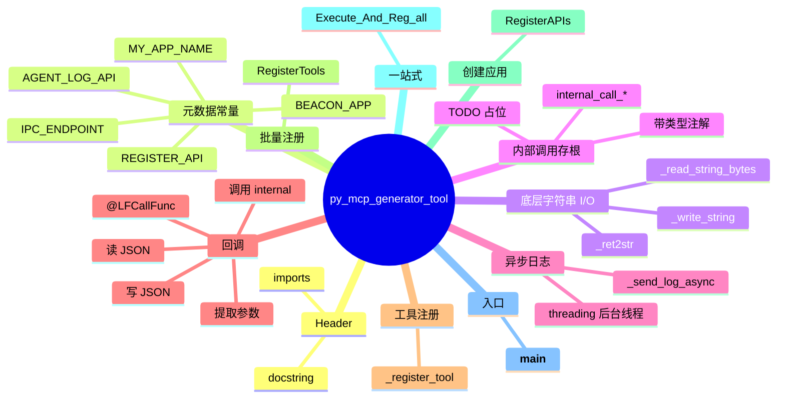

#### 关键代码片段 1：回调函数

```python
@LFCallFunc
def callback_add(_Trigger, _In, _Out):
    """Auto-generated callback for API 'add'."""
    try:
        json_bytes = _read_string_bytes(_In)
        data = json.loads(json_bytes.decode("utf-8"))

        a = data.get('a') or 0
        b = data.get('b') or 0

        ret = internal_call_add(a, b)
        _write_string(_Out, json.dumps({"result": ret}, ensure_ascii=False).encode("utf-8"))
    except Exception as _err:
        try:
            _write_string(_Out, json.dumps({"error": str(_err)}).encode("utf-8"))
        except Exception:
            pass
```

> 📌 **注意**：`ensure_ascii=False` 是关键——它保证生成的 JSON 中**中文不被转义为 `\uXXXX`**。

#### 关键代码片段 2：一站式启动

```python
def Execute_And_Reg_all() -> bool:
    """Full startup sequence."""
    app = RegisterAPIs()
    if app is None:
        return False

    LF_ResetPrepare()
    LF_PrepareClient(IPC_ENDPOINT.encode("utf-8"), app)
    if LF_PrepareDone() > 0:
        return RegisterTools()
    return False
```

#### 关键代码片段 3：入口

```python
if __name__ == "__main__":
    print(f"=== {MY_APP_NAME} tool provider ===")
    if not Execute_And_Reg_all():
        print("Startup failed.")
        sys.exit(1)
    print("Ready. Type 'exit' and press Enter to quit.")
    try:
        while True:
            line = input()
            if line.strip().lower() == "exit":
                break
    except (KeyboardInterrupt, EOFError):
        pass
    LF_ExitMainThread()
    LF_Shutdown()
```

**直接运行**：

```bash
python my_provider_tool_provider.py
```

看到类似输出，即 Python 工具提供者已上线：

```
=== MyUnit tool provider ===
[RegisterAPIs] Application 'MyUnit' created
[RegisterTools] Starting registration of 5 tools...
[RegisterTool] Registering add -> MyUnit.add
[RegisterTool] OK: add
[RegisterTools] Registered 5 / 5
Ready. Type 'exit' and press Enter to quit.
```

### 2.6 Python 目标 vs Pascal 目标：选哪个？

| 你的场景 | 推荐目标 |
|---------|----------|
| 已有 Pascal 存量代码，要复用 | 🅿️ **Pascal** |
| 已有 Pascal 项目，工具需要和现有代码同栈 | 🅿️ **Pascal** |
| 想把 Pascal 声明快速集成到 Python AI 栈 | 🐍 **Python** |
| 团队主要写 Python，但算法在 Pascal 里 | 🐍 **Python**（存根里调 `ctypes` 或子进程） |
| 想让**同一份声明**同时供两个生态使用 | 🎯 **两个都生成** |
| 想要**零编译**、**跨平台**部署 | 🐍 **Python** |

> 💡 **实用技巧**：**两份都生成**。Pascal 版本用于快速验证，Python 版本用于跨平台集成。二者语义完全一致，可以互为对照。

---

## 3. 5 层透明转换模型

### 3.1 全景

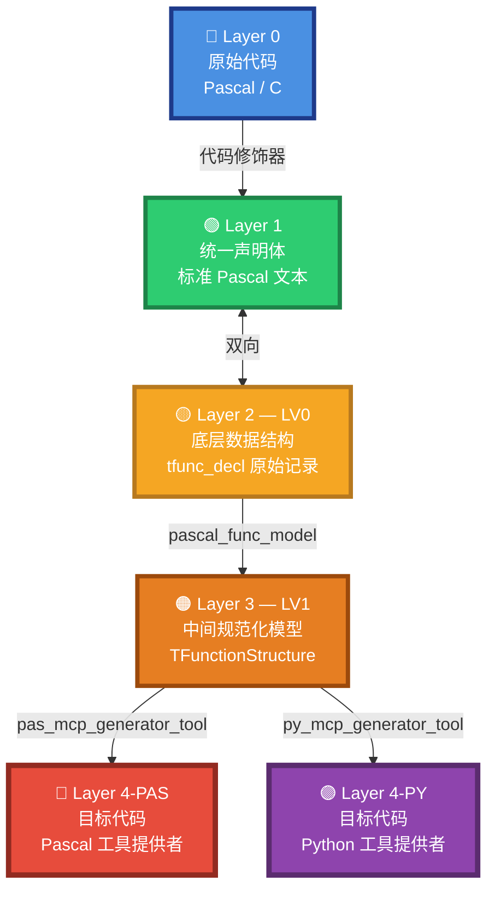

> ⭐ **Layer 3 是分岔点**——同一份 LV1 模型，喂给两个生成器，产出两份目标代码。

### 3.2 每层可导出、可编辑

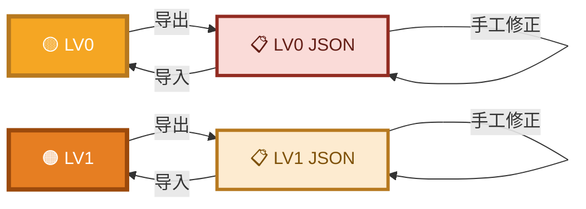

### 3.3 双语言输入统一化

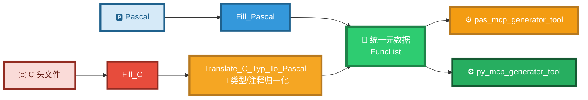

### 3.4 核心哲学

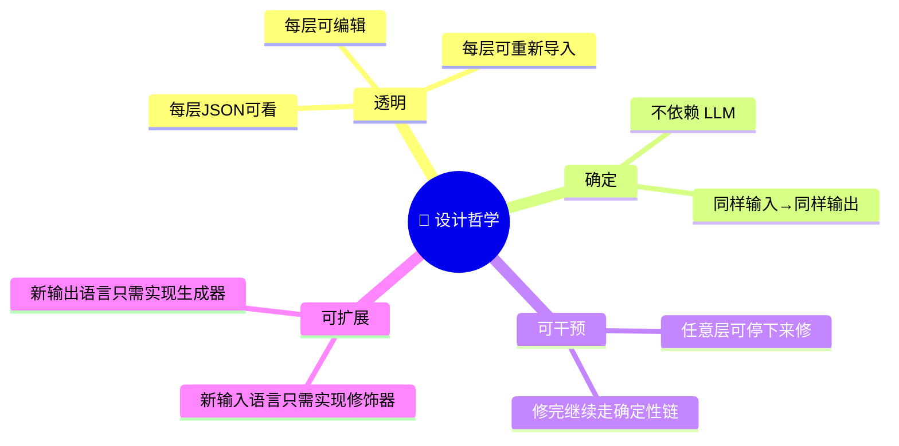

---

## 4. 界面结构

### 4.1 五个 Tab


> **第 5 步是终点，不是终点线**：
> - 生成的 `.pas` 单元**不会自动编译**——需 `lazbuild` 编译
> - 生成的 `.py` 模块**可以直接运行**——`python xxx_tool_provider.py`

### 4.2 第 5 步：Final Source 双标签

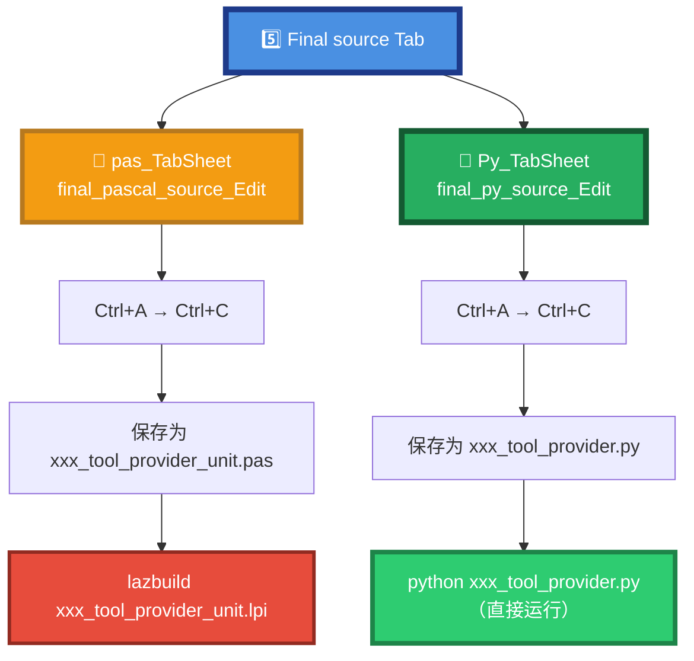

### 4.3 底部日志区

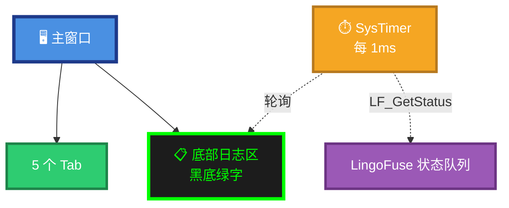

### 4.4 语言选择控件

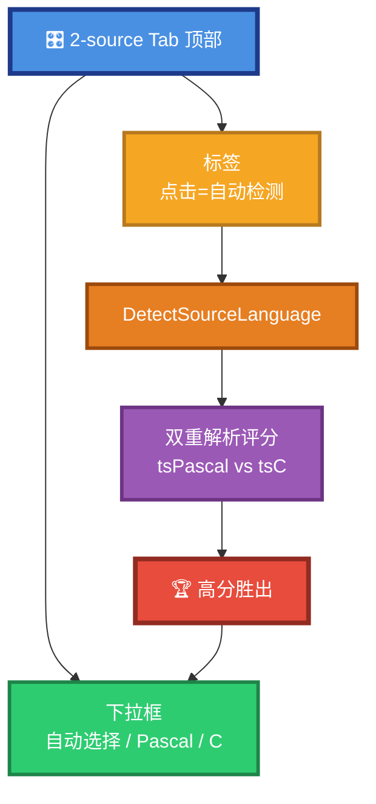

### 4.5 语法高亮自动切换

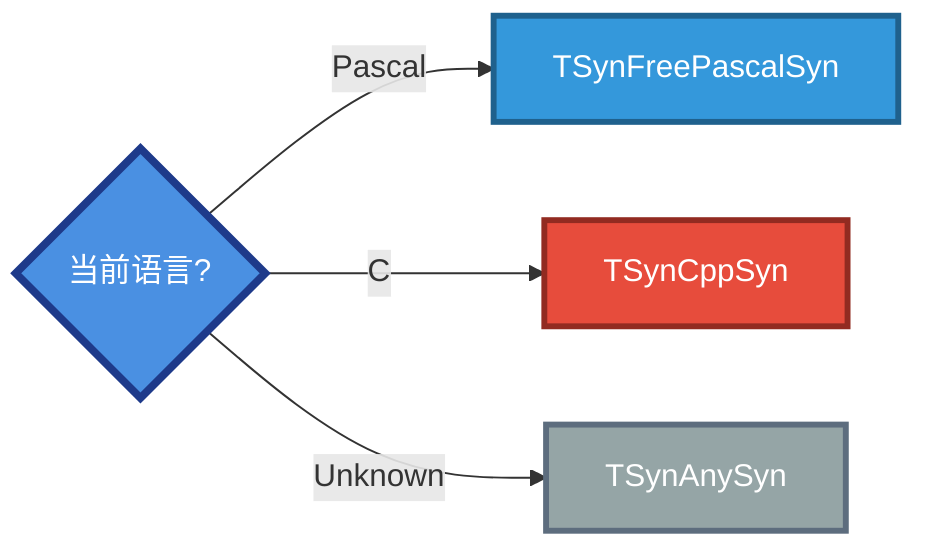

---

## 5. 完整工作流程

### 5.1 五步流程

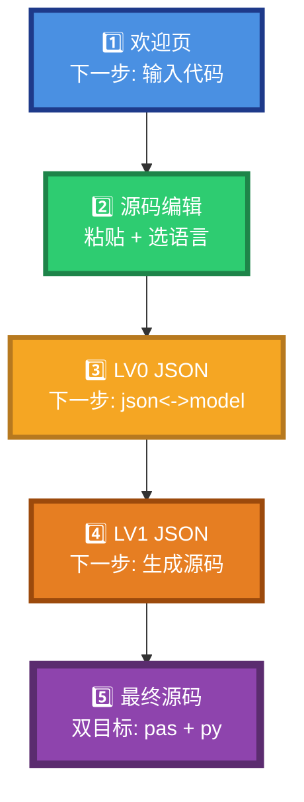

### 5.2 第 2 步：源码编辑按钮

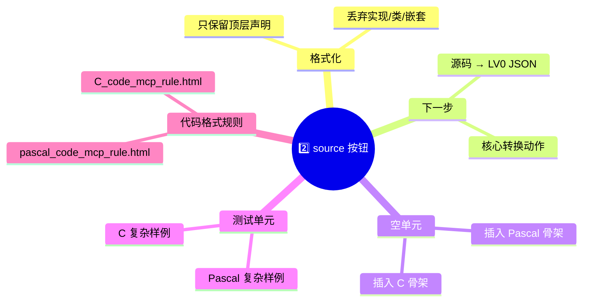

### 5.3 第 3 步：LV0 JSON 双向转换

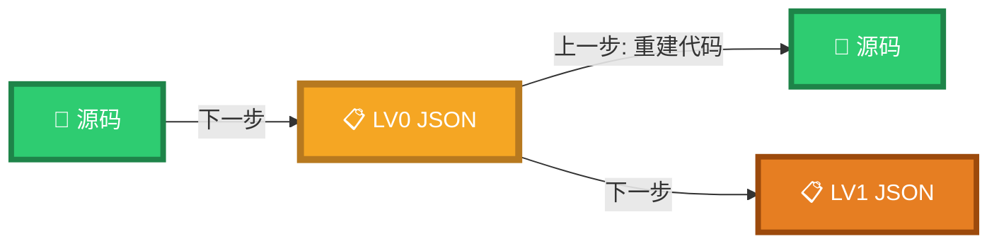

### 5.4 第 4 步：LV1 模型 JSON 功能

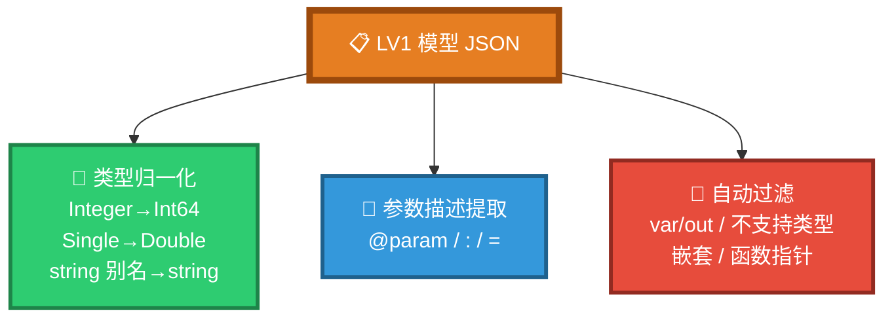

### 5.5 第 5 步：生成的文件名规则

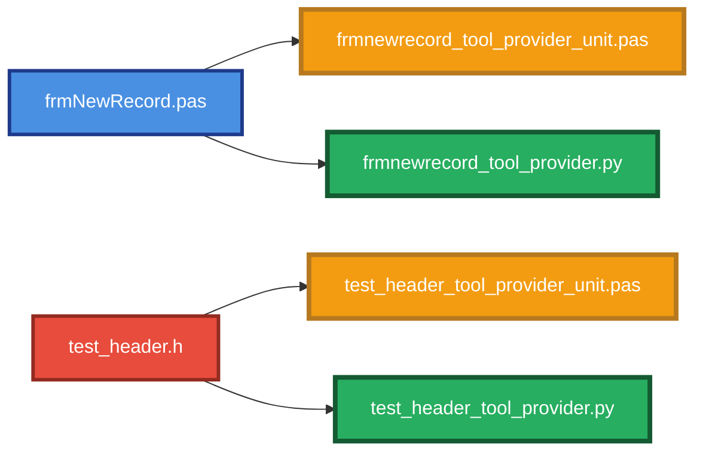

---

## 6. 各层数据结构

### 6.1 Layer 1：Pascal 声明体

```mermaid
flowchart TB
    subgraph P["🅿️ Pascal 输入"]
        P1["function FillRecord(...): string;"]
        P2["function NewRecord(): integer;"]
    end

    subgraph C["🇨 C 输入"]
        C1["int add(int a, int b);"]
        C2["void noop(void);"]
    end

    subgraph OUT["🟢 统一 Pascal 文本"]
        O1["function add(a: Integer; b: Integer): Integer;"]
        O2["procedure noop;"]
    end

    P --> OUT
    C --> OUT

    style P fill:#D6EAF8,stroke:#1F618D,stroke-width:4px,color:#1F618D
    style C fill:#FADBD8,stroke:#922B21,stroke-width:4px,color:#641E16
    style OUT fill:#D5F5E3,stroke:#1E8449,stroke-width:4px,color:#1E8449
```

### 6.2 Layer 2：LV0 JSON 结构

```mermaid
flowchart TB
    ROOT["📋 LV0 JSON"] --> UN["unit_name"]
    ROOT --> FS["funcs[]"]

    FS --> F1["name"]
    FS --> F2["is_function"]
    FS --> F3["return_type"]
    FS --> F4["result_mod（C 侧）"]
    FS --> F5["comment"]
    FS --> F6["params[]"]

    F6 --> PA["name"]
    F6 --> PB["pascal_type"]
    F6 --> PC["modifier"]
    F6 --> PD["array（C 侧数组后缀）"]

    style ROOT fill:#F5A623,stroke:#B7791F,stroke-width:5px,color:#FFFFFF
    style UN fill:#2ECC71,stroke:#1E8449,stroke-width:3px,color:#FFFFFF
    style FS fill:#3498DB,stroke:#1F618D,stroke-width:3px,color:#FFFFFF
    style F1 fill:#FADBD8,stroke:#922B21,stroke-width:2px,color:#641E16
    style F2 fill:#FADBD8,stroke:#922B21,stroke-width:2px,color:#641E16
    style F3 fill:#FADBD8,stroke:#922B21,stroke-width:2px,color:#641E16
    style F4 fill:#FADBD8,stroke:#922B21,stroke-width:2px,color:#641E16
    style F5 fill:#FADBD8,stroke:#922B21,stroke-width:2px,color:#641E16
    style F6 fill:#FADBD8,stroke:#922B21,stroke-width:2px,color:#641E16
    style PA fill:#FDEBD0,stroke:#B7791F,stroke-width:2px,color:#7E5109
    style PB fill:#FDEBD0,stroke:#B7791F,stroke-width:2px,color:#7E5109
    style PC fill:#FDEBD0,stroke:#B7791F,stroke-width:2px,color:#7E5109
    style PD fill:#FDEBD0,stroke:#B7791F,stroke-width:2px,color:#7E5109
```

### 6.3 Layer 3：LV1 规范化

```mermaid
flowchart LR
    L0["🟡 LV0"] --> N1["类型归一化"]
    L0 --> N2["参数描述提取"]
    L0 --> N3["过滤不规则函数"]
    N1 --> L1["🟠 LV1"]
    N2 --> L1
    N3 --> L1

    style L0 fill:#F5A623,stroke:#B7791F,stroke-width:5px,color:#FFFFFF
    style N1 fill:#2ECC71,stroke:#1E8449,stroke-width:3px,color:#FFFFFF
    style N2 fill:#3498DB,stroke:#1F618D,stroke-width:3px,color:#FFFFFF
    style N3 fill:#E74C3C,stroke:#922B21,stroke-width:3px,color:#FFFFFF
    style L1 fill:#E67E22,stroke:#9C4A0C,stroke-width:5px,color:#FFFFFF
```

---

## 7. 生成代码结构（Pascal 版）

### 7.1 单元骨架

```mermaid
flowchart TB
    H["📦 单元头<br/>compiler directives"]
    I["📤 interface 段<br/>全局变量 + 导出函数"]
    U["📥 implementation uses"]
    IC["🔧 internal_ 区域<br/>内部包装 + 日志"]
    CB["🎯 callback_ 区域<br/>cdecl 回调"]
    RG["📝 RegisterTool / RegisterTools"]
    RA["🚀 RegisterAPIs"]
    EX["🎬 Execute_And_Reg_all"]

    H --> I --> U --> IC --> CB --> RG --> RA --> EX

    style H fill:#4A90E2,stroke:#1E3A8A,stroke-width:4px,color:#FFFFFF
    style I fill:#2ECC71,stroke:#1E8449,stroke-width:4px,color:#FFFFFF
    style U fill:#3498DB,stroke:#1F618D,stroke-width:4px,color:#FFFFFF
    style IC fill:#F5A623,stroke:#B7791F,stroke-width:4px,color:#FFFFFF
    style CB fill:#E67E22,stroke:#9C4A0C,stroke-width:4px,color:#FFFFFF
    style RG fill:#9B59B6,stroke:#6C3483,stroke-width:4px,color:#FFFFFF
    style RA fill:#E74C3C,stroke:#922B21,stroke-width:4px,color:#FFFFFF
    style EX fill:#C0392B,stroke:#641E16,stroke-width:5px,color:#FFFFFF
```

### 7.2 全局变量（interface 段）

```mermaid
flowchart LR
    V["📋 全局变量"] --> A["MY_APP_NAME"]
    V --> B["MY_APP_DESC"]
    V --> C["IPC_ENDPOINT"]
    V --> D["BEACON_APP"]
    V --> E["REGISTER_API"]
    V --> F["AGENT_LOG_API"]
    V --> G["DEBUG_LOG"]

    style V fill:#2ECC71,stroke:#1E8449,stroke-width:5px,color:#FFFFFF
    style A fill:#D5F5E3,stroke:#1E8449,stroke-width:2px,color:#1E8449
    style B fill:#D5F5E3,stroke:#1E8449,stroke-width:2px,color:#1E8449
    style C fill:#D5F5E3,stroke:#1E8449,stroke-width:2px,color:#1E8449
    style D fill:#D5F5E3,stroke:#1E8449,stroke-width:2px,color:#1E8449
    style E fill:#D5F5E3,stroke:#1E8449,stroke-width:2px,color:#1E8449
    style F fill:#D5F5E3,stroke:#1E8449,stroke-width:2px,color:#1E8449
    style G fill:#D5F5E3,stroke:#1E8449,stroke-width:2px,color:#1E8449
```

**默认值**（生成后可在源码中直接修改）：

| 变量 | 默认值 | 说明 |
|------|--------|------|
| `MY_APP_NAME` | 由生成器根据 `unit_name` 推导 | 工具提供者注册到信标时的 App 名 |
| `MY_APP_DESC` | `'Tool provider unit'` | 工具提供者的描述 |
| `IPC_ENDPOINT` | `'ipc:agent'` | 信标端点 |
| `BEACON_APP` | `'agent_main_app'` | 工具注册目标（信标中的 App 名） |
| `REGISTER_API` | `'register_agent'` | 注册工具时调用的 API 名 |
| `AGENT_LOG_API` | `'agent_log'` | 发送日志到信标的 API 名 |
| `DEBUG_LOG` | `False` | 是否输出详细调试日志 |

> **注意**：这些**不是**不可改的常量。生成后你可以在源码中直接修改它们，然后重新 `lazbuild` 编译。

### 7.3 每个 API 的生成结构（Pascal）

```mermaid
flowchart TB
    API["🎯 单个 API"] --> W["internal_call_*<br/>内部包装"]
    API --> CB["Callback_*<br/>cdecl 回调"]
    API --> FWD["forward 声明"]
    API --> REG["RegisterCallEx"]

    W --> W1["默认被注释的<br/>TCompute.Sync 块"]
    CB --> CB1["读 JSON 输入"]
    CB --> CB2["提取参数"]
    CB --> CB3["调用 internal"]
    CB --> CB4["写 JSON 输出"]
    CB --> CB5["异常处理"]

    style API fill:#4A90E2,stroke:#1E3A8A,stroke-width:5px,color:#FFFFFF
    style W fill:#F5A623,stroke:#B7791F,stroke-width:4px,color:#FFFFFF
    style CB fill:#E67E22,stroke:#9C4A0C,stroke-width:4px,color:#FFFFFF
    style FWD fill:#3498DB,stroke:#1F618D,stroke-width:3px,color:#FFFFFF
    style REG fill:#9B59B6,stroke:#6C3483,stroke-width:3px,color:#FFFFFF
    style W1 fill:#FDEBD0,stroke:#B7791F,stroke-width:2px,color:#7E5109
    style CB1 fill:#FDEBD0,stroke:#B7791F,stroke-width:2px,color:#7E5109
    style CB2 fill:#FDEBD0,stroke:#B7791F,stroke-width:2px,color:#7E5109
    style CB3 fill:#FDEBD0,stroke:#B7791F,stroke-width:2px,color:#7E5109
    style CB4 fill:#FDEBD0,stroke:#B7791F,stroke-width:2px,color:#7E5109
    style CB5 fill:#FDEBD0,stroke:#B7791F,stroke-width:2px,color:#7E5109
```

### 7.4 内部包装的 UI 同步决策

```mermaid
flowchart TB
    Q{"原函数会操作 UI?"}
    Q -->|是| A["✅ 取消注释<br/>TCompute.Sync"]
    Q -->|否| B["❌ 保持注释"]
    Q -->|内部已同步| B

    A --> R1["主线程安全"]
    B --> R2["后台线程执行"]

    style Q fill:#F5A623,stroke:#B7791F,stroke-width:5px,color:#FFFFFF
    style A fill:#2ECC71,stroke:#1E8449,stroke-width:5px,color:#FFFFFF
    style B fill:#95A5A6,stroke:#5D6D7E,stroke-width:5px,color:#FFFFFF
    style R1 fill:#D5F5E3,stroke:#1E8449,stroke-width:3px,color:#1E8449
    style R2 fill:#EAECEE,stroke:#5D6D7E,stroke-width:3px,color:#5D6D7E
```

---

## 8. 生成代码结构（Python 版 · NEW）

### 8.1 模块骨架

```mermaid
flowchart TB
    H["📦 Header<br/>docstring + imports"]
    M["📊 应用元数据常量<br/>MY_APP_NAME / IPC_ENDPOINT / ..."]
    L["🔧 底层字符串 I/O<br/>_write_string / _read_string_bytes / _ret2str"]
    IC["🎯 internal_call_*<br/>内部调用存根（TODO 占位）"]
    LG["📡 _send_log_async<br/>异步日志到信标"]
    CB["🎯 @LFCallFunc callback_*<br/>API 回调"]
    RT["📝 _register_tool<br/>注册单个工具"]
    RTS["🚀 RegisterTools()<br/>批量注册"]
    RA["🚀 RegisterAPIs()<br/>创建 App + 注册 Call"]
    EX["🎬 Execute_And_Reg_all()<br/>一站式启动"]
    MAIN["▶️ __main__<br/>交互循环"]

    H --> M --> L --> IC --> LG --> CB --> RT --> RTS --> RA --> EX --> MAIN

    style H fill:#4A90E2,stroke:#1E3A8A,stroke-width:4px,color:#FFFFFF
    style M fill:#2ECC71,stroke:#1E8449,stroke-width:4px,color:#FFFFFF
    style L fill:#3498DB,stroke:#1F618D,stroke-width:4px,color:#FFFFFF
    style IC fill:#F5A623,stroke:#B7791F,stroke-width:4px,color:#FFFFFF
    style LG fill:#E67E22,stroke:#9C4A0C,stroke-width:4px,color:#FFFFFF
    style CB fill:#9B59B6,stroke:#6C3483,stroke-width:4px,color:#FFFFFF
    style RT fill:#E74C3C,stroke:#922B21,stroke-width:4px,color:#FFFFFF
    style RTS fill:#C0392B,stroke:#641E16,stroke-width:4px,color:#FFFFFF
    style RA fill:#8E44AD,stroke:#5B2C6F,stroke-width:4px,color:#FFFFFF
    style EX fill:#16A085,stroke:#0E6251,stroke-width:5px,color:#FFFFFF
    style MAIN fill:#27AE60,stroke:#145A32,stroke-width:5px,color:#FFFFFF
```

### 8.2 Python 元数据常量

```python
# ==== Application metadata ====
MY_APP_NAME = 'MyUnit'
MY_APP_DESC = 'Tool provider for unit MyUnit'
IPC_ENDPOINT = 'ipc:agent'
BEACON_APP = 'agent_main_app'
REGISTER_API = 'register_agent'
AGENT_LOG_API = 'agent_log'
DEBUG_LOG = True
```

> ⭐ **与 Pascal 版本的常量名称、默认值完全一致**——这是跨语言统一性的体现。

### 8.3 Python 底层字符串 I/O

```python
def _write_string(hnd, s):
    """Write a UTF-8 string with a null terminator to a DataHandle."""
    if isinstance(s, str):
        s = s.encode("utf-8")
    if len(s) > 0:
        LF_WriteBuffer(hnd, s, len(s))
    LF_WriteBuffer(hnd, b"\x00", 1)


def _read_string_bytes(hnd) -> bytes:
    """Read a null-terminated UTF-8 string from a DataHandle.

    If no null terminator is found, return the entire remaining buffer.
    """
    pos = LF_GetPos(hnd)
    size = LF_GetSize(hnd)
    if pos >= size:
        return b""
    # ... 逐字节扫描 NUL 终止符
```

> ⭐ **与 Pascal 的 `LF_ReadString` / `LF_WriteString` 行为完全等价**——保证跨语言字节流一致性。

### 8.4 Python 回调函数

```mermaid
flowchart TB
    CB["@LFCallFunc<br/>def callback_add(_Trigger, _In, _Out):"]
    CB --> R1["1️⃣ 读 JSON 字节<br/>_read_string_bytes(_In)"]
    CB --> R2["2️⃣ 解码 UTF-8 + json.loads"]
    CB --> R3["3️⃣ 提取参数<br/>data.get('a') or 0"]
    CB --> R4["4️⃣ 调用 internal_call_add"]
    CB --> R5["5️⃣ 写 JSON 输出<br/>ensure_ascii=False"]
    CB --> R6["6️⃣ 异常兜底<br/>写 error JSON"]

    style CB fill:#9B59B6,stroke:#6C3483,stroke-width:5px,color:#FFFFFF
    style R1 fill:#FDEBD0,stroke:#B7791F,stroke-width:2px,color:#7E5109
    style R2 fill:#FDEBD0,stroke:#B7791F,stroke-width:2px,color:#7E5109
    style R3 fill:#FDEBD0,stroke:#B7791F,stroke-width:2px,color:#7E5109
    style R4 fill:#FDEBD0,stroke:#B7791F,stroke-width:2px,color:#7E5109
    style R5 fill:#FDEBD0,stroke:#B7791F,stroke-width:2px,color:#7E5109
    style R6 fill:#FDEBD0,stroke:#B7791F,stroke-width:2px,color:#7E5109
```

### 8.5 Python 版本的关键设计决策

| 决策 | 原因 |
|------|------|
| **`ensure_ascii=False`** | 保证 JSON 中**中文不被转义为 `\uXXXX`** |
| **`_read_string_bytes` 的容错读法** | 兼容无 NUL 结尾的输入（如 HTTP 桥接） |
| **`internal_call_*` 保留为 TODO** | 让用户**明确知道**需要填充实现 |
| **`@LFCallFunc` 装饰器** | 与 `lingofuse._lf_native` 的 cdecl 回调类型一致 |
| **`threading.Thread(daemon=True)`** | 异步日志不阻塞回调 |
| **`json.dumps(..., default=str)`** | 工具返回非可序列化对象时不崩 |
| **`if __name__ == "__main__":`** | 直接 `python xxx.py` 即可启动 |

---

## 9. 几十种语言的未来蓝图 🚀

> 🎯 **V5.0 之后的核心演进方向**：从「Pascal + Python 双目标」走向「**任意语言 → 任意语言**」。

### 9.1 全景愿景

```mermaid
mindmap
  root(("🌌 code_decl_to_mcp<br/>多语言矩阵"))
    📥 输入层
      Pascal ✅
      C ✅
      C++ 🔜
      Rust 🔜
      Go 🔜
      Python 🔜
      Java / C# 🔜
      TypeScript 🔜
      Kotlin / Swift 🔜
      Zig / Nim / Crystal 🔜
    💎 统一元数据
      LV0 JSON
      LV1 模型
    📤 输出层
      Pascal ✅
      Python ✅
      JavaScript / TypeScript 🔜
      Rust / Go 🔜
      Java / C# / Kotlin 🔜
      Swift / Objective-C 🔜
      Lua / Ruby / PHP 🔜
      Zig / Nim 🔜
```

### 9.2 演进路线图

```mermaid
timeline
    title code_decl_to_mcp 多语言演进路线
    section ✅ 已实现 v3.0 ~ V5.0
        Pascal 输入 : Fill_Pascal
        C 输入 : Fill_C + Translate_C_Typ_To_Pascal
        Pascal 输出 : pas_mcp_generator_tool
        Python 输出 : py_mcp_generator_tool
    section 🎯 短期 v5.x
        C++ 输入 : 类方法 + 命名空间
        Rust 输入 : 所有权 + 生命周期
        Go 输入 : 多返回值 + 接口
        Python 输入 : 动态类型 + 装饰器
        JavaScript 输出 : ES6+ / Node.js
        TypeScript 输出 : 类型定义 + 接口
    section 🚀 中期 v6.0
        Java / C# 输入 : 泛型 + 反射
        Kotlin / Swift 输入 : 现代类型系统
        Rust 输出 : 所有权语义
        Go 输出 : 结构体 + 方法
        Ruby / Lua / PHP 输出
    section 🌌 长期
        Zig / Nim / Crystal 输入
        WebAssembly 输出
        任意语言 → 任意语言
        MCP 生态全语言覆盖
```

### 9.3 可插拔架构

```mermaid
flowchart TB
    subgraph Input["📥 输入层（可插拔 · Modifier 模式）"]
        I1["🅿️ Pascal 修饰器 ✅"]
        I2["🇨 C 修饰器 ✅"]
        I3["🇨🇵 C++ 修饰器 🔜"]
        I4["🦀 Rust 修饰器 🔜"]
        I5["🐹 Go 修饰器 🔜"]
        I6["🐍 Python 修饰器 🔜"]
        I7["..."]
    end

    M["💎 统一元数据<br/>LV0 / LV1<br/>（稳定核心）"]

    subgraph Output["📤 输出层（可插拔 · Generator 模式）"]
        O1["🅿️ Pascal 生成器 ✅"]
        O2["🐍 Python 生成器 ✅"]
        O3["🟨 JavaScript 生成器 🔜"]
        O4["🟦 TypeScript 生成器 🔜"]
        O5["🦀 Rust 生成器 🔜"]
        O6["🐹 Go 生成器 🔜"]
        O7["..."]
    end

    I1 --> M
    I2 --> M
    I3 --> M
    I4 --> M
    I5 --> M
    I6 --> M
    I7 --> M
    M --> O1
    M --> O2
    M --> O3
    M --> O4
    M --> O5
    M --> O6
    M --> O7

    style M fill:#2ECC71,stroke:#1E8449,stroke-width:6px,color:#FFFFFF
    style Input fill:#D6EAF8,stroke:#1F618D,stroke-width:3px,color:#0D2F52
    style Output fill:#D5F5E3,stroke:#1E8449,stroke-width:3px,color:#0E4D2A
```

### 9.4 为什么这个架构能扩展到几十种语言

**核心洞察**：**中间层稳定，两端可插拔**。

| 层次 | 特性 | 扩展代价 |
|------|------|---------|
| **输入层（Modifier）** | 每种语言一个修饰器，把源码归一化为 LV0 | 新增一种语言的输入，**只需实现一个 Modifier** |
| **中间层（LV0 / LV1）** | 语言无关的元数据模型，**已稳定** | **无需修改** |
| **输出层（Generator）** | 每种语言一个生成器，把 LV1 转为目标代码 | 新增一种语言的输出，**只需实现一个 Generator** |

**数学意义**：

- **N 种输入语言 × M 种输出语言** 的理论组合
- 传统方案需要 **N × M 个转换器**
- 本架构只需 **N 个 Modifier + M 个 Generator**
- **复杂度从 O(N×M) 降到 O(N+M)**

> 🎯 **一句话**：这就是为什么它能扩展到**几十种语言**——**每一种语言的加入，都只是加一个 Modifier 或 Generator**。

### 9.5 目标生态覆盖

```mermaid
flowchart LR
    subgraph Group1["🥇 第一梯队（已就绪）"]
        A1["Pascal"]
        A2["Python"]
    end

    subgraph Group2["🥈 第二梯队（近期）"]
        B1["C / C++"]
        B2["Rust"]
        B3["Go"]
        B4["JavaScript / TypeScript"]
    end

    subgraph Group3["🥉 第三梯队（中期）"]
        C1["Java / C# / Kotlin"]
        C2["Swift / Objective-C"]
        C3["Ruby / Lua / PHP"]
    end

    subgraph Group4["🌌 长期目标"]
        D1["Zig / Nim / Crystal"]
        D2["WebAssembly"]
        D3["… 更多"]

    end

    style Group1 fill:#D5F5E3,stroke:#1E8449,stroke-width:4px,color:#0E4D2A
    style Group2 fill:#D6EAF8,stroke:#1F618D,stroke-width:4px,color:#0D2F52
    style Group3 fill:#FDEBD0,stroke:#B7791F,stroke-width:4px,color:#7E5109
    style Group4 fill:#F4ECF7,stroke:#5B2C6F,stroke-width:4px,color:#321640
```

### 9.6 对开发者的意义

> **今天你用 `code_decl_to_mcp` 生成 Pascal + Python。**  
> **明天它能生成 JS/TS + Rust + Go。**  
> **后天它覆盖几十种语言。**  
> **而你，只需要维护一份 Pascal/C 声明。**

```mermaid
flowchart LR
    Today["📅 今天<br/>1 份声明 → 2 份工具提供者"] --> Tomorrow["📅 明年<br/>1 份声明 → 8 种语言"]
    Tomorrow --> Future["📅 未来<br/>1 份声明 → 几十种语言"]

    style Today fill:#2ECC71,stroke:#1E8449,stroke-width:4px,color:#FFFFFF
    style Tomorrow fill:#F39C12,stroke:#B7791F,stroke-width:5px,color:#FFFFFF
    style Future fill:#8E44AD,stroke:#5B2C6F,stroke-width:6px,color:#FFFFFF
```

**三条不变承诺**：

1. ✅ **声明规范稳定** —— 你写的 Pascal/C 声明，**未来十年都能用**
2. ✅ **中间层稳定** —— LV0 / LV1 JSON 结构向后兼容
3. ✅ **零 LLM 依赖** —— 主链路永远**确定性、可复现、可审计**

---

## 10. 编译与部署

### 10.1 Pascal 工具提供者：4 步部署

```mermaid
flowchart LR
    S1["1️⃣ 生成单元<br/>code_decl_to_mcp.exe"] --> S2["2️⃣ lazbuild<br/>编译生成的单元"]
    S2 --> S3["3️⃣ 复制 DLL<br/>LingoFuse64.dll"]
    S3 --> S4["4️⃣ 启动信标 +<br/>工具提供者"]

    style S1 fill:#4A90E2,stroke:#1E3A8A,stroke-width:4px,color:#FFFFFF
    style S2 fill:#9B59B6,stroke:#6C3483,stroke-width:4px,color:#FFFFFF
    style S3 fill:#F5A623,stroke:#B7791F,stroke-width:4px,color:#FFFFFF
    style S4 fill:#2ECC71,stroke:#1E8449,stroke-width:4px,color:#FFFFFF
```

**详解**：

1. **生成单元**：在 `code_decl_to_mcp.exe` 中粘贴声明，走完 5 个 Tab，最后在「Final source → `pas_TabSheet`」中复制生成的 `.pas` 单元。
2. **编译生成的单元**：将 `.pas` 文件放入 Lazarus 项目，用 `lazbuild` 编译。详见 `Build_Guide.md`。
3. **复制 DLL**：`LingoFuse64.dll` / `z_ipc_64.dll` 需要与生成的 EXE 同目录或位于 PATH。
4. **启动信标 + 工具提供者**：
   - 先启动 `pascal_agent_service.exe`（信标）。
   - 再启动生成的工具提供者 EXE。它会连接信标并注册工具。

### 10.2 Python 工具提供者：3 步部署（更简单）

```mermaid
flowchart LR
    S1["1️⃣ 生成模块<br/>code_decl_to_mcp.exe"] --> S2["2️⃣ 填充 internal_*<br/>实现函数体"]
    S2 --> S3["3️⃣ python xxx.py<br/>直接运行"]

    style S1 fill:#4A90E2,stroke:#1E3A8A,stroke-width:4px,color:#FFFFFF
    style S2 fill:#F5A623,stroke:#B7791F,stroke-width:4px,color:#FFFFFF
    style S3 fill:#2ECC71,stroke:#1E8449,stroke-width:4px,color:#FFFFFF
```

**详解**：

1. **生成模块**：在「Final source → `Py_TabSheet`」中复制生成的 `.py` 模块。
2. **填充实现**：找到每个 `internal_call_*` 存根，把 TODO 占位替换为真实实现。
3. **运行**：
   ```bash
   python myunit_tool_provider.py
   ```
   **无需编译，无需 Lazarus，无需 FPC**。

> ⭐ **Python 版本的最大优势**：**零编译、跨平台、开箱即用**。

### 10.3 运行时拓扑

```mermaid
flowchart LR
    Beacon["📡 信标<br/>pascal_agent_service"] --> EXEP["🎯 Pascal 工具提供者"]
    Beacon --> EXEPy["🐍 Python 工具提供者"]
    EXEP -->|注册工具| Beacon
    EXEPy -->|注册工具| Beacon
    MCP["🌉 mcp_api_tool.exe"] -->|Call API| Beacon
    LTB["🔴 llm_proxy_tool.exe"] -->|Call API| Beacon
    AI["🤖 AI 客户端<br/>LM Studio / Claude"] -->|MCP 协议| MCP
    AI2["🤖 AI 客户端<br/>（不感知工具）"] -->|LF generate| LTB

    style EXEP fill:#F39C12,stroke:#B7791F,stroke-width:5px,color:#FFFFFF
    style EXEPy fill:#27AE60,stroke:#145A32,stroke-width:5px,color:#FFFFFF
    style Beacon fill:#2ECC71,stroke:#1E8449,stroke-width:5px,color:#FFFFFF
    style MCP fill:#9B59B6,stroke:#6C3483,stroke-width:5px,color:#FFFFFF
    style LTB fill:#922B21,stroke:#5A1A14,stroke-width:5px,color:#FFFFFF
    style AI fill:#F5A623,stroke:#B7791F,stroke-width:5px,color:#FFFFFF
    style AI2 fill:#B7791F,stroke:#7E5109,stroke-width:5px,color:#FFFFFF
```

**注意**：Pascal 和 Python 工具提供者**可以同时运行**——它们注册到**同一个信标**，注册名不同（来自不同的 `unit_name`），互不冲突。

### 10.4 完整调用链

```mermaid
sequenceDiagram
    participant AI as 🤖 AI 客户端
    participant MCP as 🌉 mcp_api_tool
    participant Beacon as 📡 信标
    participant EXE as 🎯 工具提供者<br/>（Pascal 或 Python）

    AI->>MCP: MCP 工具调用
    MCP->>Beacon: LF_Call (Call API)
    Beacon->>EXE: 路由到目标 App
    EXE->>EXE: Callback 执行
    EXE-->>Beacon: JSON 响应
    Beacon-->>MCP: 返回结果
    MCP-->>AI: MCP 响应
```

---

## 11. 常见问题（一图速查）

### 11.1 为什么函数被跳过

```mermaid
mindmap
  root(("❓ 函数被跳过"))
    类型不支持
      Boolean
      Variant
      数组 / 记录 / 类
      枚举 / 集合
      泛型
    修饰符问题
      Pascal: var / out
      C: 函数指针
      C: 变参
    位置问题
      嵌套函数
      类方法
      实现段
    返回类型
      不支持的返回类型
```

### 11.2 UI 同步决策

```mermaid
flowchart TB
    Q1{"原函数直接操作 UI?"}
    Q1 -->|是| A1["✅ 取消 TCompute.Sync 注释"]
    Q1 -->|否| Q2{"内部已用 Synchronize?"}
    Q2 -->|是| A2["❌ 保持注释"]
    Q2 -->|否| A2

    style Q1 fill:#F5A623,stroke:#B7791F,stroke-width:5px,color:#FFFFFF
    style A1 fill:#2ECC71,stroke:#1E8449,stroke-width:5px,color:#FFFFFF
    style Q2 fill:#E67E22,stroke:#9C4A0C,stroke-width:5px,color:#FFFFFF
    style A2 fill:#95A5A6,stroke:#5D6D7E,stroke-width:5px,color:#FFFFFF
```

### 11.3 信标不可用排查

```mermaid
flowchart TB
    E["❌ RegisterTool<br/>Beacon not available"]
    E --> C1{"pascal_agent_service<br/>已启动?"}
    C1 -->|否| F1["启动信标"]
    C1 -->|是| C2{"监听 ipc:agent?"}
    C2 -->|否| F2["检查 BEACON_APP 常量"]
    C2 -->|是| C3{"工具提供者<br/>已注册到信标?"}
    C3 -->|否| F3["检查 RegisterTools 调用<br/>与 REGISTER_API 常量"]
    C3 -->|是| C4["LF_CheckApiEx<br/>单独测试"]
    C4 --> F4["检查网络/防火墙"]

    style E fill:#E74C3C,stroke:#922B21,stroke-width:5px,color:#FFFFFF
    style C1 fill:#F5A623,stroke:#B7791F,stroke-width:3px,color:#FFFFFF
    style C2 fill:#F5A623,stroke:#B7791F,stroke-width:3px,color:#FFFFFF
    style C3 fill:#F5A623,stroke:#B7791F,stroke-width:3px,color:#FFFFFF
    style C4 fill:#E67E22,stroke:#9C4A0C,stroke-width:3px,color:#FFFFFF
    style F1 fill:#2ECC71,stroke:#1E8449,stroke-width:3px,color:#FFFFFF
    style F2 fill:#2ECC71,stroke:#1E8449,stroke-width:3px,color:#FFFFFF
    style F3 fill:#2ECC71,stroke:#1E8449,stroke-width:3px,color:#FFFFFF
    style F4 fill:#2ECC71,stroke:#1E8449,stroke-width:3px,color:#FFFFFF
```

### 11.4 为什么 Python 生成代码报 `UnboundLocalError`？

> ❌ **这是 v1.0 的历史问题**——已在 v1.1 修复。  
> ✅ **请使用最新版 `code_decl_to_mcp.exe`**，`RegisterTools` 中的 `total_count` / `reg_count` 已在函数顶部初始化。

### 11.5 为什么 Python 生成代码里中文变 `?`？

> ❌ **这是 v0.x 的历史问题**——已在 v1.0 修复（`PyStrLit` 改用 `TP_Char` 迭代）。  
> ✅ **请使用最新版 `code_decl_to_mcp.exe`**，中文、Emoji 均完整保留。

### 11.6 Python 和 Pascal 两份产物，能不能只用一份？

> 可以。**生成哪一份取决于你的集成场景**：
> - 你的程序是 Pascal 写的 → 用 Pascal 版本
> - 你的程序是 Python 写的 → 用 Python 版本
> - 两者都有 → **两份都生成，语义一致，可互为对照**

---

## 12. 语法白名单速查

### 12.1 Pascal 侧

```mermaid
flowchart TB
    P["🅿️ Pascal 输入"] --> OK["✅ 允许"]
    P --> NO["❌ 禁止"]

    OK --> OK1["interface 段顶层"]
    OK --> OK2["const / in / 空白"]
    OK --> OK3["整数族"]
    OK --> OK4["浮点族"]
    OK --> OK5["字符串族"]
    OK --> OK6["紧邻上方注释"]

    NO --> NO1["implementation 段"]
    NO --> NO2["类/记录/接口内"]
    NO --> NO3["var / out"]
    NO --> NO4["Boolean / Variant"]
    NO --> NO5["数组 / 记录 / 类"]
    NO --> NO6["枚举 / 集合 / 泛型"]
    NO --> NO7["函数指针 / 指针"]
    NO --> NO8["尾随注释"]

    style P fill:#4A90E2,stroke:#1E3A8A,stroke-width:5px,color:#FFFFFF
    style OK fill:#2ECC71,stroke:#1E8449,stroke-width:5px,color:#FFFFFF
    style NO fill:#E74C3C,stroke:#922B21,stroke-width:5px,color:#FFFFFF
```

> **完整规则**见同目录 `pascal_code_mcp_rule.md`。

### 12.2 C 侧

```mermaid
flowchart TB
    C["🇨 C 输入"] --> OK["✅ 允许"]
    C --> NO["❌ 禁止"]

    OK --> OK1["顶层原型以 ; 结尾"]
    OK --> OK2["extern C 块内"]
    OK --> OK3["const"]
    OK --> OK4["restrict（剥离）"]
    OK --> OK5["整数/浮点/字符串/指针"]
    OK --> OK6["紧邻上方注释"]

    NO --> NO1["函数定义带 {}"]
    NO --> NO2["变量 / 类型定义"]
    NO --> NO3["预处理指令"]
    NO --> NO4["函数指针参数"]
    NO --> NO5["变参 ..."]
    NO --> NO6["struct / union / enum"]
    NO --> NO7["_Bool / wchar_t"]
    NO --> NO8["尾随注释"]

    style C fill:#E74C3C,stroke:#922B21,stroke-width:5px,color:#FFFFFF
    style OK fill:#2ECC71,stroke:#1E8449,stroke-width:5px,color:#FFFFFF
    style NO fill:#922B21,stroke:#641E16,stroke-width:5px,color:#FFFFFF
```

> **完整规则**见同目录 `C_code_mcp_rule.md`。

### 12.3 类型归一化对照

```mermaid
flowchart LR
    subgraph IN["输入类型"]
        I1["Integer / Int64<br/>Cardinal / Longint"]
        I2["Double / Single<br/>Extended / Real"]
        I3["string / AnsiString<br/>UnicodeString"]
    end

    subgraph OUT["归一化"]
        O1["Int64"]
        O2["Double"]
        O3["string"]
    end

    I1 --> O1
    I2 --> O2
    I3 --> O3

    style I1 fill:#4A90E2,stroke:#1E3A8A,stroke-width:3px,color:#FFFFFF
    style I2 fill:#E74C3C,stroke:#922B21,stroke-width:3px,color:#FFFFFF
    style I3 fill:#9B59B6,stroke:#6C3483,stroke-width:3px,color:#FFFFFF
    style O1 fill:#2ECC71,stroke:#1E8449,stroke-width:4px,color:#FFFFFF
    style O2 fill:#F5A623,stroke:#B7791F,stroke-width:4px,color:#FFFFFF
    style O3 fill:#E67E22,stroke:#9C4A0C,stroke-width:4px,color:#FFFFFF
```

### 12.4 C → Pascal 精确映射

```mermaid
flowchart LR
    subgraph CS["🇨 C 类型"]
        C1["signed char / int8_t"]
        C2["short / int16_t"]
        C3["int / int32_t"]
        C4["long long / int64_t"]
        C5["unsigned int"]
        C6["float"]
        C7["double"]
        C8["char *"]
        C9["int *"]
    end

    subgraph PS["🅿️ Pascal"]
        P1["ShortInt"]
        P2["SmallInt"]
        P3["Integer"]
        P4["Int64"]
        P5["Cardinal"]
        P6["Single"]
        P7["Double"]
        P8["string"]
        P9["Pointer"]
    end

    C1 --> P1
    C2 --> P2
    C3 --> P3
    C4 --> P4
    C5 --> P5
    C6 --> P6
    C7 --> P7
    C8 --> P8
    C9 --> P9

    style C1 fill:#FADBD8,stroke:#922B21,stroke-width:2px,color:#641E16
    style C2 fill:#FADBD8,stroke:#922B21,stroke-width:2px,color:#641E16
    style C3 fill:#FADBD8,stroke:#922B21,stroke-width:2px,color:#641E16
    style C4 fill:#FADBD8,stroke:#922B21,stroke-width:2px,color:#641E16
    style C5 fill:#FADBD8,stroke:#922B21,stroke-width:2px,color:#641E16
    style C6 fill:#FADBD8,stroke:#922B21,stroke-width:2px,color:#641E16
    style C7 fill:#FADBD8,stroke:#922B21,stroke-width:2px,color:#641E16
    style C8 fill:#FADBD8,stroke:#922B21,stroke-width:2px,color:#641E16
    style C9 fill:#FADBD8,stroke:#922B21,stroke-width:2px,color:#641E16
    style P1 fill:#D6EAF8,stroke:#1F618D,stroke-width:2px,color:#1F618D
    style P2 fill:#D6EAF8,stroke:#1F618D,stroke-width:2px,color:#1F618D
    style P3 fill:#D6EAF8,stroke:#1F618D,stroke-width:2px,color:#1F618D
    style P4 fill:#D6EAF8,stroke:#1F618D,stroke-width:2px,color:#1F618D
    style P5 fill:#D6EAF8,stroke:#1F618D,stroke-width:2px,color:#1F618D
    style P6 fill:#D6EAF8,stroke:#1F618D,stroke-width:2px,color:#1F618D
    style P7 fill:#D6EAF8,stroke:#1F618D,stroke-width:2px,color:#1F618D
    style P8 fill:#D6EAF8,stroke:#1F618D,stroke-width:2px,color:#1F618D
    style P9 fill:#D6EAF8,stroke:#1F618D,stroke-width:2px,color:#1F618D
```

---

## 13. 一图收束

```mermaid
flowchart TB
    START["🚀 粘源码"] --> SEL["🎛️ 选语言"]
    SEL --> NEXT["➡️ 下一步"]
    NEXT --> LV0["📋 LV0 JSON"]
    LV0 --> LV1["📋 LV1 JSON"]
    LV1 --> GEN["⚙️ 一键生成"]
    GEN --> PAS["📄 xxx_tool_provider_unit.pas"]
    GEN --> PY["🐍 xxx_tool_provider.py"]
    PAS --> BUILD["🔨 lazbuild"]
    BUILD --> EXEP["🎯 Pascal EXE"]
    PY --> RUN["▶️ python xxx.py"]
    RUN --> EXEPy["🐍 Python 进程"]
    EXEP --> MCP["🌉 MCP 可调用"]
    EXEPy --> MCP
    MCP -.->|"未来"| FUTURE["🌌 几十种语言的<br/>工具提供者"]

    style START fill:#4A90E2,stroke:#1E3A8A,stroke-width:4px,color:#FFFFFF
    style SEL fill:#3498DB,stroke:#1F618D,stroke-width:4px,color:#FFFFFF
    style NEXT fill:#2ECC71,stroke:#1E8449,stroke-width:4px,color:#FFFFFF
    style LV0 fill:#F5A623,stroke:#B7791F,stroke-width:4px,color:#FFFFFF
    style LV1 fill:#E67E22,stroke:#9C4A0C,stroke-width:4px,color:#FFFFFF
    style GEN fill:#9B59B6,stroke:#6C3483,stroke-width:5px,color:#FFFFFF
    style PAS fill:#F39C12,stroke:#B7791F,stroke-width:4px,color:#FFFFFF
    style PY fill:#27AE60,stroke:#145A32,stroke-width:4px,color:#FFFFFF
    style BUILD fill:#C0392B,stroke:#641E16,stroke-width:3px,color:#FFFFFF
    style RUN fill:#2ECC71,stroke:#1E8449,stroke-width:3px,color:#FFFFFF
    style EXEP fill:#F39C12,stroke:#B7791F,stroke-width:4px,color:#FFFFFF
    style EXEPy fill:#27AE60,stroke:#145A32,stroke-width:4px,color:#FFFFFF
    style MCP fill:#1ABC9C,stroke:#0E6251,stroke-width:5px,color:#FFFFFF
    style FUTURE fill:#8E44AD,stroke:#5B2C6F,stroke-width:6px,color:#FFFFFF
```

---

## 14. 相关文档（同目录）

| 文档 | 说明 |
|------|------|
| `pascal_code_mcp_rule.md` | Pascal 声明规范（解析契约） |
| `C_code_mcp_rule.md` | C 声明规范（解析契约） |
| `Build_Guide.md` | 编译指南（Pascal 和 Python 组件） |
| `Dependency_Installation_Guide.md` | 依赖安装 |
| `readme.md` | 项目总览与闭环架构 |
| `mcp_api_tool_doubao_guide.md` | 新手零基础教程 |
| `Pascal_Integration_Guide.md` | **Pascal 语言切入指南** |

### 子目录文档（`src/`）

| 文档 | 说明 |
|------|------|
| `src/pascal_agent_api_ref_json.md` | `agent_main` / `register_agent` JSON 结构详解 |
| `src/LingoFuse_LLM_Ecosystem_User_Guide.md` | 闭环架构与生态总览 |
| `src/LingoFuse_LLM_Service_CLI_guide.md` | LLM 服务命令行手册 |
| `src/LingoFuse_LLM_Proxy_CLI_Guide.md` | LLM 代理命令行手册 |
| `src/LingoFuse_LLM_Proxy_Compatibility_Guide.md` | 129+ 后端兼容清单 |
| `src/LingoFuse_LLM_Pitfalls_For_AI.md` | 踩坑大全 |

---

## 15. 核心要点速记

> 📌 **四句话记住本文档**：

1. **双目标生成** —— 一份 Pascal/C 声明，**同时输出 Pascal 和 Python 两种工具提供者**。
2. **Python 已实测通过** —— 修复了 `UnboundLocalError` 与非 ASCII 截断，**生成即可运行**。
3. **5 层透明模型** —— 每层可导出、可编辑、可重新导入，**核心链路完全确定性**。
4. **未来几十年语言** —— 可插拔架构（Modifier × Generator），复杂度从 **O(N×M) 降到 O(N+M)**。

> 🎯 **记住这句话就够了**：
>
> **今天你用一份声明生成两种语言，明天它能生成几十种——而你只需要维护一份声明。**

---

**文档版本**：V5.0（Python 目标代码生成已实测通过；新增几十种语言的未来蓝图）  
**维护者**：LingoFuse-pasAgent 团队  
**反馈**：问题提 Issue，急事加 Q（600585）
