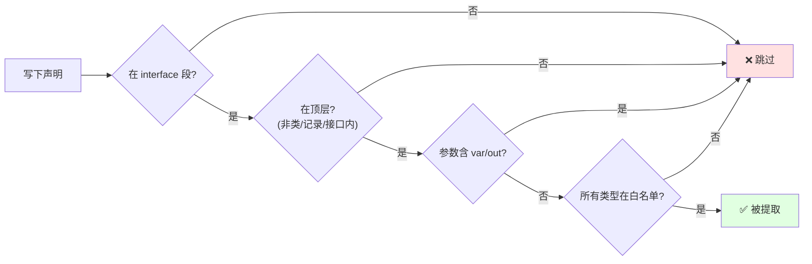
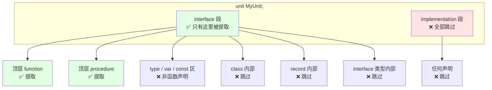
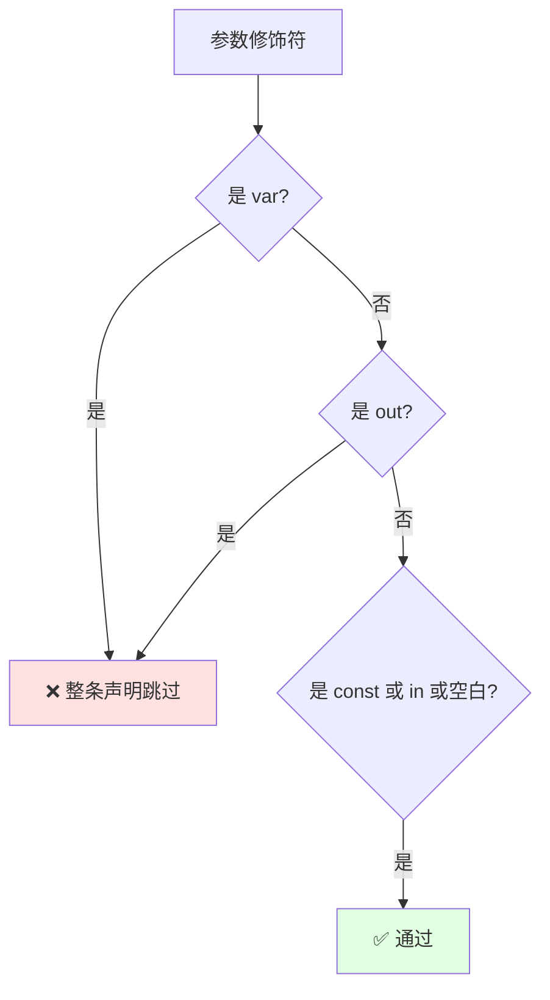
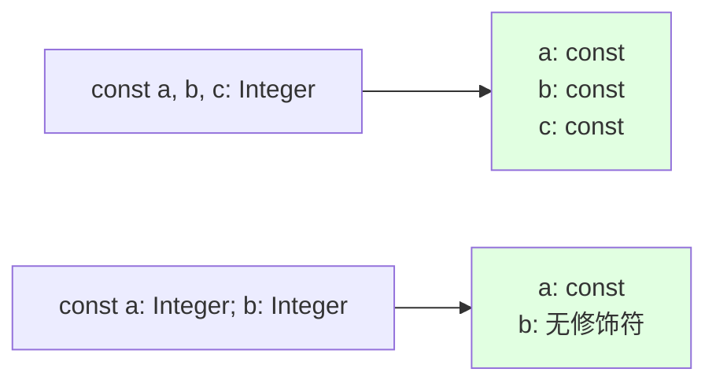
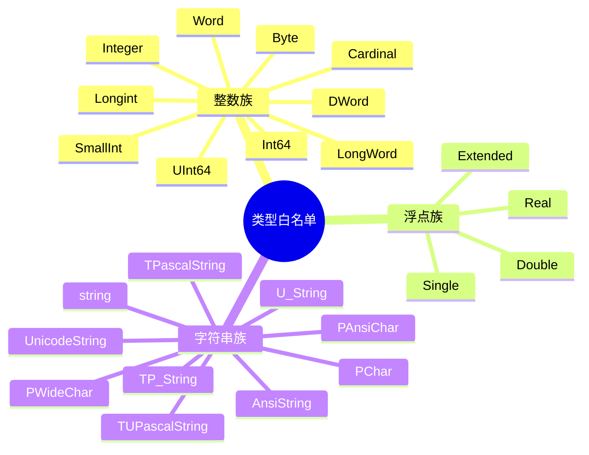
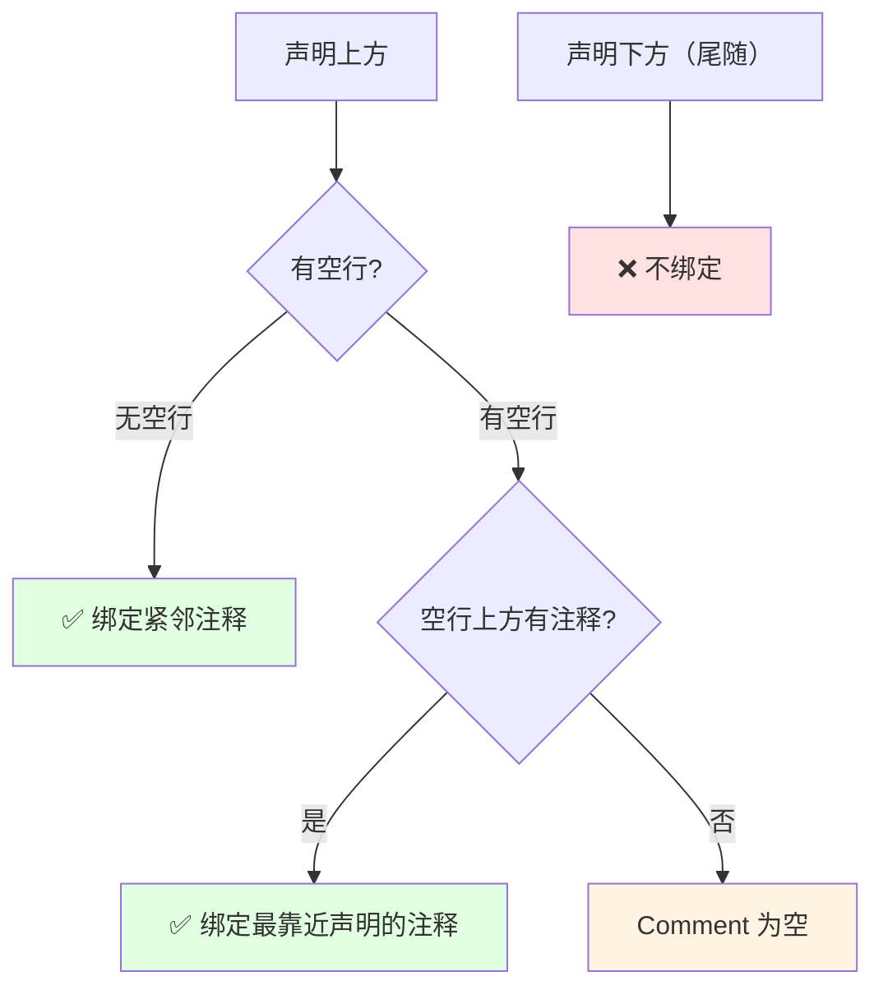
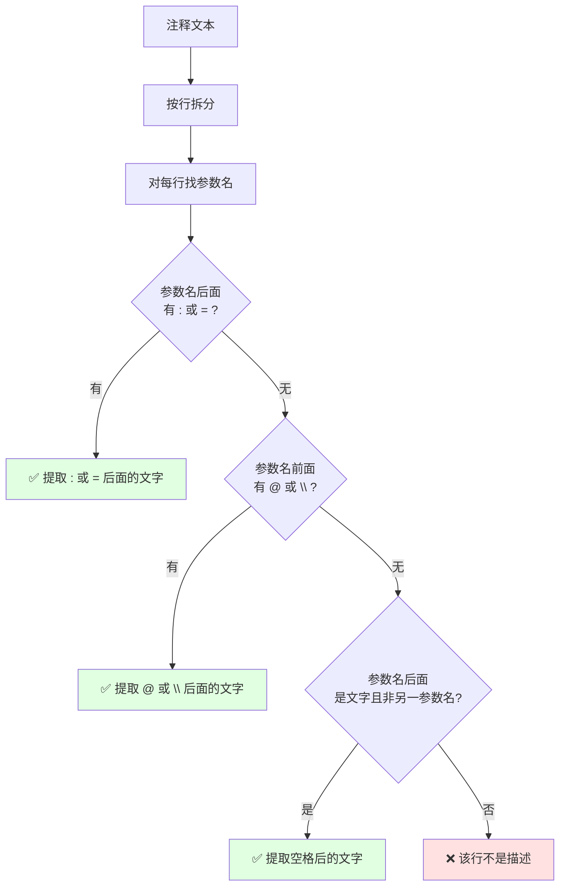
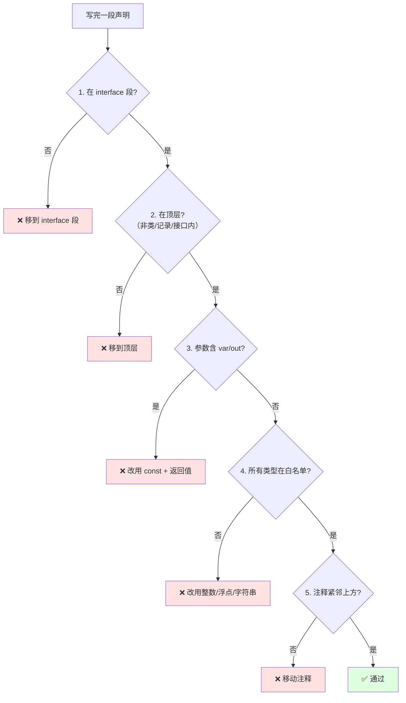
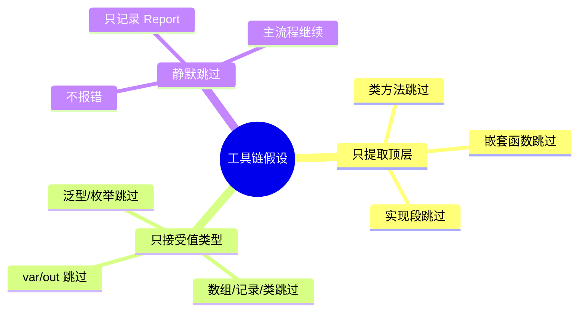

# Pascal 声明规范（Z.Pascal_Func_Tool 工具链兼容）

**版本**：4.0
**最后更新**：2026-09-10
**约束对象**：`Z.Pascal_Func_Tool` → `Z.Pascal_Func_Model` → `pas_mcp_generator_tool` 完整工具链
**文档定位**：本规范即**解析契约**。任何偏离都会导致声明被**静默跳过**。请严格按本规范书写。

---

## 0. 三十秒速览



**五条铁律**：

1. 位置：**`interface` 段 + 顶层**
2. 关键字：**`function` 或 `procedure`**
3. 修饰符：**只允许 `const`、`in`、空白**（禁 `var`、`out`）
4. 类型：**必须命中白名单**（整数族 / 浮点族 / 字符串族）
5. 注释：**紧邻上方**（允许空行）

**一条铁律违反 = 整条声明跳过**，不做局部忽略。

---

## 1. 声明位置规则

### 1.1 unit 的解剖图



### 1.2 会提取 vs 不会提取

| 位置 | 结果 | 示例 |
|------|------|------|
| `interface` 段顶层 | ✅ 提取 | `function Add(a, b: Integer): Integer;` |
| `interface` 段的 `class` 内部 | ❌ 跳过 | `TMyClass.Method` |
| `interface` 段的 `record` 内部 | ❌ 跳过 | `TMyRecord.Method` |
| `interface` 段的 `interface` 类型内部 | ❌ 跳过 | `IMyIntf.Method` |
| `implementation` 段任何位置 | ❌ 跳过 | 实现代码 |
| 嵌套在其他函数内部 | ❌ 跳过 | 局部函数 |

### 1.3 位置示例

```pascal
unit MyUnit;

interface

// ✅ 提取：顶层函数
function Add(a, b: Integer): Integer;

// ✅ 提取：顶层过程
procedure Log(const msg: string);

type
  TMyClass = class
    // ❌ 跳过：类方法
    function Multiply(x, y: Integer): Integer;

    // ❌ 跳过：构造函数
    constructor Create;
  end;

  TMyRecord = record
    // ❌ 跳过：记录方法
    procedure Reset;
  end;

  IMyIntf = interface
    // ❌ 跳过：接口方法
    procedure DoIt;
  end;

implementation

// ❌ 跳过：不在 interface 段
function InternalHelper: Boolean;
begin
  Result := True;
end;

end.
```

---

## 2. 参数修饰符规则

### 2.1 修饰符判定图



### 2.2 修饰符白名单

| 修饰符 | 是否允许 | 说明 |
|--------|----------|------|
| 空白（无修饰符） | ✅ 允许 | 默认值传递 |
| `const` | ✅ 允许 | 只读值传递 |
| `in` | ✅ 允许 | 只读值传递（Delphi 2009+） |
| `var` | ❌ 禁止 | **整条声明跳过** |
| `out` | ❌ 禁止 | **整条声明跳过** |

### 2.3 为什么禁止 `var` / `out`

`var` / `out` 是**引用传递**，无法映射到 JSON Schema 的**值类型**。工具链的设计前提是"参数可序列化"。

**正确做法**：改用 `const` + 返回值。

```pascal
// ❌ 禁止：引用传递
procedure Modify(var x: Integer);

// ✅ 正确：值传递 + 返回值
function Modify(const x: Integer): Integer;
```

### 2.4 修饰符组内广播

**同一参数组共享修饰符**：

```pascal
// const 作用于 a、b、c 全部
const a, b, c: Integer;
```

**跨组必须重写**：

```pascal
// const 只作用于 a
const a: Integer; b: Integer;
```

图示：



---

## 3. 类型白名单

### 3.1 类型分类图



### 3.2 类型归一化表

| 原始类型 | 归一化为 | 生成时映射为 |
|----------|----------|--------------|
| 整数族全部 | `Int64` | JSON `integer` |
| 浮点族全部 | `Double` | JSON `number` |
| 字符串族全部 | `string` | JSON `string` |

### 3.3 明确禁止的类型

**以下类型一律导致整条声明跳过**：

| 类别 | 禁止类型示例 |
|------|--------------|
| 布尔 | `Boolean`, `ByteBool`, `WordBool` |
| 变体 | `Variant`, `OleVariant` |
| 数组 | `array of X`, `TArray<X>` |
| 记录 | `TPoint`, `TRect`, `TDateTime` |
| 类 | `TObject`, `TStringList` |
| 接口 | `IInterface` |
| 枚举 | `TColor`, 自定义枚举 |
| 集合 | `set of X` |
| 泛型 | `TList<X>`, `TGenericList<X>` |
| 函数指针 | `TNotifyEvent`, `TIntFunc` |
| 过程类型 | `procedure`, `reference to procedure` |
| 指针 | `PInteger`, `Pointer` |
| 无类型参数 | `const X`（无类型声明） |

### 3.4 边界示例

```pascal
// ✅ 通过
function Add(a, b: Integer): Integer;
function Sqrt(x: Double): Double;
function Echo(const s: string): string;
function Sum(const a, b, c: Int64): Int64;

// ❌ 跳过：Boolean 返回
function IsEven(x: Integer): Boolean;

// ❌ 跳过：数组参数
function Total(const arr: array of Integer): Integer;

// ❌ 跳过：记录参数
function Distance(const p1, p2: TPoint): Double;

// ❌ 跳过：枚举参数
function SetColor(c: TColor): Integer;

// ❌ 跳过：泛型参数
function GetItem<T>(const list: TList<T>): Integer;

// ❌ 跳过：函数指针参数
procedure OnEvent(const handler: TNotifyEvent);

// ❌ 跳过：指针参数
function ReadInt(const p: PInteger): Integer;
```

---

## 4. 注释绑定规则

### 4.1 绑定规则图



### 4.2 绑定规则表

| 情形 | 是否绑定 | 说明 |
|------|----------|------|
| 注释 → 声明（紧邻） | ✅ 绑定 | 标准写法 |
| 注释 → 空行 → 声明 | ✅ 绑定 | **空行允许**（旧版误说"禁止"） |
| 注释1 → 注释2 → 声明 | ✅ 全部绑定 | 按顺序拼接 |
| 注释1 → 空行 → 注释2 → 声明 | ✅ 绑定注释2 | 最靠近声明的那条 |
| 声明 → 尾随注释 | ❌ 不绑定 | 尾随注释被忽略 |
| 无注释 | 允许 | `Comment` 为空 |

### 4.3 三种注释风格

```pascal
// 单行注释
function Foo: Integer;

{ 花括号注释 }
function Bar: Integer;

(* 圆括号星号注释 *)
function Baz: Integer;
```

三种可混用：

```pascal
// 第一行说明
{ 第二行说明 }
(* 第三行说明 *)
function Mixed: Integer;
```

多行注释：

```pascal
{
  多行花括号注释
  第二行
  第三行
}
function MultiLine: Integer;

(*
  多行圆括号注释
  第二行
*)
procedure MultiLineProc;
```

### 4.4 尾随注释不绑定（易错点）

```pascal
// ❌ 尾随注释不会绑定到函数
function Foo: Integer; // 这是尾随注释，被忽略

// ✅ 前置注释才会绑定
// 这是前置注释，会被绑定
function Bar: Integer;
```

---

## 5. 参数描述提取规则

### 5.1 描述提取流程图



### 5.2 四种描述格式

#### 格式 A：冒号分隔

```pascal
{
  计算两个整数的和。
  a: 第一个加数
  b: 第二个加数
}
function Add(a, b: Integer): Integer;
```

#### 格式 B：等号分隔

```pascal
{
  计算乘积。
  a = 乘数1
  b = 乘数2
}
function Mul(a, b: Integer): Integer;
```

#### 格式 C：Doxygen `@param` 或 `\param`

```pascal
{
  计算两个整数的和。
  @param a 第一个加数
  @param b 第二个加数
  @return 两数之和（被忽略）
}
function Add(a, b: Integer): Integer;
```

简化 `@` 前缀：

```pascal
{
  @ a 被除数
  @ b 除数
}
function DivInt(a, b: Integer): Integer;
```

反斜杠风格：

```pascal
{
  \param a 被除数
  \param b 除数
}
function ModInt(a, b: Integer): Integer;
```

#### 格式 D：空格分隔

```pascal
{
  计算差值。
  a  被减数
  b  减数
}
function Sub(a, b: Integer): Integer;
```

### 5.3 参数名匹配规则

| 规则 | 说明 |
|------|------|
| 大小写 | **不敏感**（`A` 匹配 `a`） |
| 位置 | 描述必须在参数名后（同一行） |
| 多行 | 自动用空格合并 |
| 一行只取一个 | 第一个匹配生效 |

**大小写不敏感示例**：

```pascal
{
  A: 第一个数
  B: 第二个数
}
function Sum(a, b: Integer): Integer;
// A 匹配 a，B 匹配 b
```

**多行描述自动合并**：

```pascal
{
  a: 第一个加数
     这是第二行描述
  b: 第二个加数
}
function Add(a, b: Integer): Integer;
// 提取结果：a → "第一个加数 这是第二行描述"
```

### 5.4 混用多种格式

```pascal
{
  @param x 横坐标
  y: 纵坐标
  z = 深度
}
function Point3D(x, y, z: Integer): Integer;
// x、y、z 都正确提取
```

### 5.5 无关行自动忽略

```pascal
{
  --------------------------------------------------------------------------
  高级计算函数。
  本函数执行复杂运算。
  @param a 第一个操作数
  @param b 第二个操作数
  @return 计算结果（被忽略）
  --------------------------------------------------------------------------
}
function ComplexCalc(a, b: Double): Double;
// 分隔线、说明文字、"@return" 都被自动忽略
```

---

## 6. 完整示例

### 6.1 正面示例（全部通过）

```pascal
unit SampleUnit;

interface

{
  计算两个整数的和。
  a: 第一个加数
  b: 第二个加数
}
function Add(a, b: Integer): Integer;

{
  计算乘积。
  @param a 乘数1
  @param b 乘数2
}
function Mul(a, b: Integer): Integer;

{
  字符串回显。
  \param s 待回显的字符串
}
function Echo(const s: string): string;

{
  无参数函数，仅用于演示。
}
function GetVersion: string;

{
  带默认参数的函数。
  x: 输入值（默认 0）
}
function WithDefault(x: Integer = 0): Integer;

implementation

function Add(a, b: Integer): Integer;
begin
  Result := a + b;
end;

// 其他实现...

end.
```

### 6.2 反面示例（全部跳过）

```pascal
unit BadUnit;

interface

// ❌ 跳过：参数含 var
procedure Modify(var x: Integer);

// ❌ 跳过：参数含 out
procedure GetValue(out x: Integer);

// ❌ 跳过：返回 Boolean
function IsEven(x: Integer): Boolean;

// ❌ 跳过：参数含数组
function Sum(const arr: array of Integer): Integer;

// ❌ 跳过：参数含记录
function Distance(const p1, p2: TPoint): Double;

// ❌ 跳过：参数含枚举
function SetColor(c: TColor): Integer;

// ❌ 跳过：泛型方法
function GetItem<T>(const list: TList<T>): Integer;

type
  TMyClass = class
    // ❌ 跳过：类方法
    function Multiply(x, y: Integer): Integer;

    // ❌ 跳过：构造函数
    constructor Create;
  end;

  TMyRecord = record
    // ❌ 跳过：记录方法
    procedure Reset;
  end;

implementation

// ❌ 跳过：不在 interface 段
function InternalHelper: Boolean;
begin
  Result := True;
end;

end.
```

---

## 7. 常见错误对照表

| 错误写法 | 后果 | 正确写法 |
|----------|------|----------|
| `procedure P(var x: Integer)` | 整条跳过 | `function P(const x: Integer): Integer` |
| `procedure P(out x: Integer)` | 整条跳过 | `function P: Integer` |
| `function F: Boolean` | 整条跳过 | `function F: Integer`（用 0/1 表示） |
| `function F(a: TPoint)` | 整条跳过 | 拆成 `Double`/`Integer` 参数 |
| `function F(a: array of Integer)` | 整条跳过 | 用 JSON 字符串或多次调用 |
| `function F(a: TColor)` | 整条跳过 | 用 `Integer` 传枚举值 |
| `function F<T>(x: T)` | 整条跳过 | 改为具体类型 |
| 类方法 `TClass.F` | 跳过 | 移到顶层 |
| `implementation` 段函数 | 跳过 | 移到 `interface` 段 |
| 注释与声明间**有其他声明** | 注释不绑定 | 注释紧邻声明 |
| 尾随注释 `function F; // 说明` | 注释被忽略 | 改为前置注释 |
| 参数描述里写成 `@param 参数名` 但中间有空格 | 仍支持 | `@ param 参数名` 也 OK |
| 参数描述用 `@参数名` 直接跟 | 支持 | `@a 描述` 也 OK |

---

## 8. 自检清单（写完声明后逐项核对）



**五项检查**：

| 序号 | 检查项 | 不通过的动作 |
|------|--------|--------------|
| 1 | 在 `interface` 段？ | 移到 `interface` 段 |
| 2 | 在顶层（非类/记录/接口内）？ | 移到顶层 |
| 3 | 参数不含 `var`/`out`？ | 改用 `const` + 返回值 |
| 4 | 所有类型在白名单？ | 改用整数/浮点/字符串 |
| 5 | 注释紧邻上方？ | 移动注释（可留空行） |

---

## 9. 最小可解析模板

**复制以下模板，替换占位符即可**：

```
unit <单元名>;

interface

{
  <函数的自然语言说明>。
  <参数1>: <参数1的说明>
  <参数2>: <参数2的说明>
}
function <函数名>(<参数1>: <类型1>; <参数2>: <类型2>): <返回类型>;

implementation

function <函数名>(<参数1>: <类型1>; <参数2>: <类型2>): <返回类型>;
begin
  // 实现
end;

end.
```

**填空规则**：

| 占位符 | 可选值 |
|--------|--------|
| `<单元名>` | 合法 Pascal 标识符 |
| `<函数名>` | 合法 Pascal 标识符 |
| `<参数N>` | 合法 Pascal 标识符 |
| `<类型N>` | 见 §3 白名单 |
| `<返回类型>` | 见 §3 白名单 |

---

## 10. 设计原则

### 10.1 工具链的三个硬性假设



### 10.2 使用者的三条铁律

1. **写声明前先查白名单**——参数、返回类型必须在 §3 列表中。
2. **写完声明的自检**——是否在 `interface` 段？是否在顶层？是否含 `var`/`out`？
3. **跑完工具看 Report**——跳过原因一目了然，不要猜。

### 10.3 本规范与旧版的关键差异

| 项目 | 旧版 | 新版 |
|------|------|------|
| 注释与声明间空行 | "禁止"（**错误**） | **允许**（已更正） |
| 参数类型白名单 | 未明确枚举 | **完整枚举** |
| `var`/`out` 后果 | 未说明 | **整条声明跳过** |
| 跳过机制 | 未说明 | **静默跳过 + Report** |
| 自检清单 | 无 | **五项检查** |
| 决策图 | 无 | **多张 Mermaid 图** |

---

## 11. 修订历史

- **v4.0（2026-09-10）**：重写。修正注释空行规则（旧版错误），明确类型白名单，明确 `var`/`out` 后果，增加最小模板、自检清单和决策图，统一术语。
- v3.0（2026-09-02）：实例驱动，新增大量注释写法示例。
- 早期版本：初版。

---

**本规范为解析契约。任何偏离本规范的声明将被工具链静默跳过。**