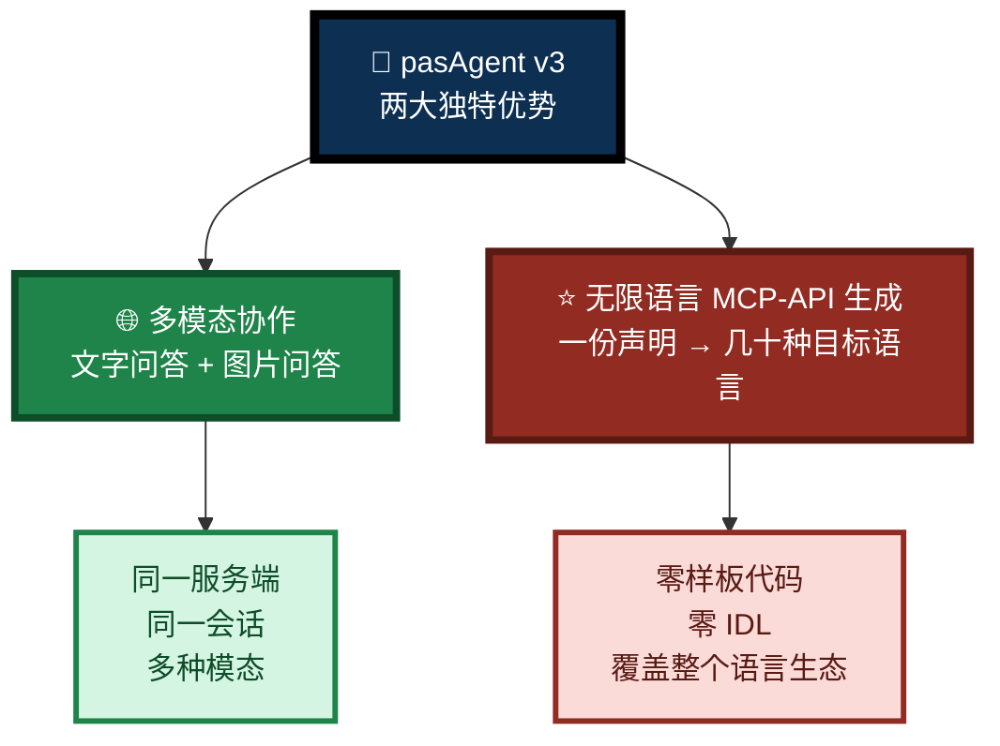
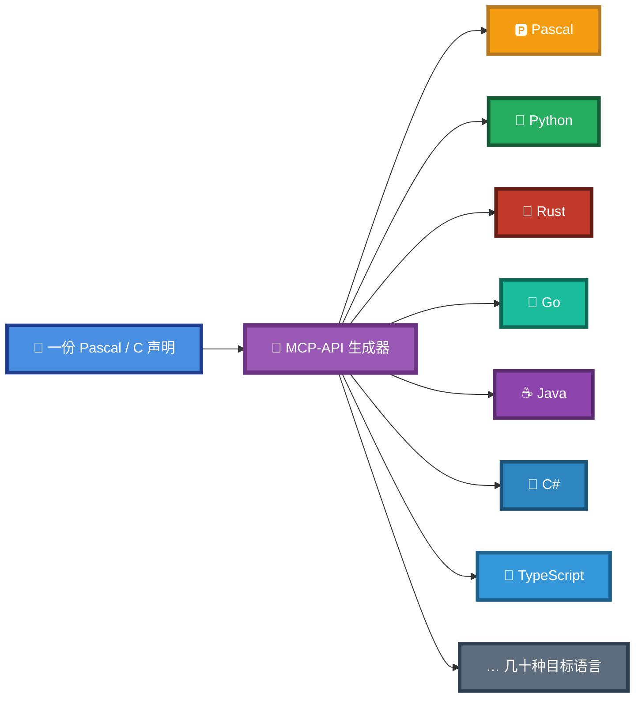
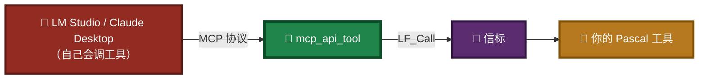
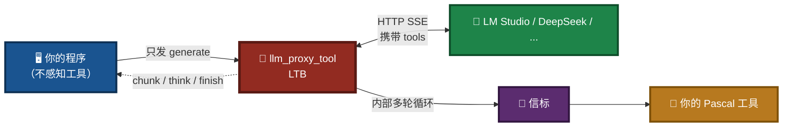
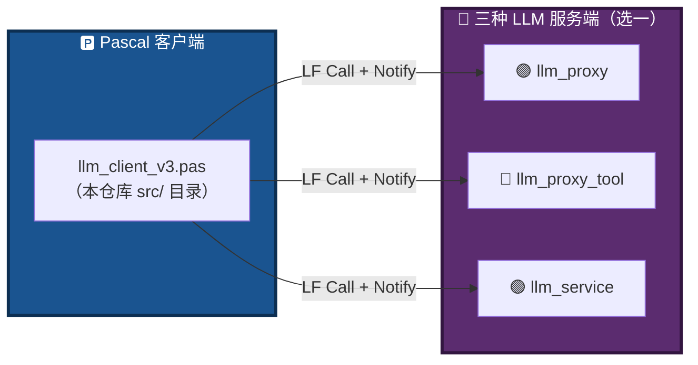
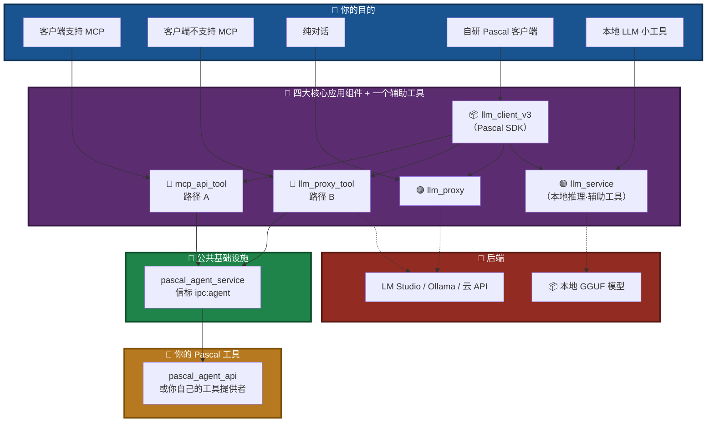
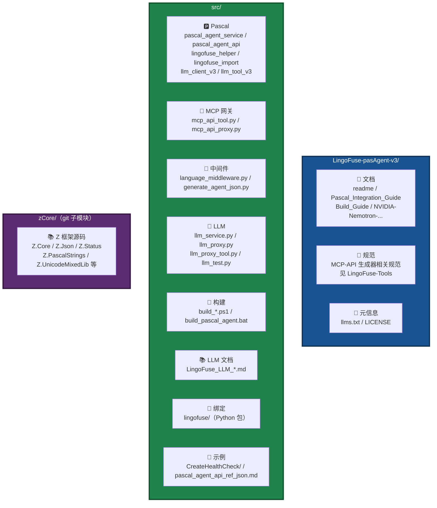

# pasAgent v3

**工业级 Pascal 智能体技术体系 —— 让 AI 学会用你的 Pascal 代码**

[](https://opensource.org/licenses/MIT)

---

> ## 📦 获取 v3
>
> 👉 **[下载预编译包（Pre-built Package）](https://github.com/PassByYou888/LingoFuse-pasAgent-v3/releases/tag/pre_build)**
>
> 解压后按 **[Pascal_Integration_Guide.md](Pascal_Integration_Guide.md)** 操作。

---

## 🆕 为什么会有 v3 新仓库？

v3 与 v2 的根本区别在于 **多模态（Multimodal）架构**。

> **多模态是一个衍生型机制**——它不是单个程序的升级，而是需要**周边程序协同支持**才能完整运转的架构级变革。

具体来说，引入多模态后：

- **`llm_service`** 需要同时驱动多个模型（文本模型 + 视觉模型），并把不同模态的输入路由到对应模型
- **`llm_proxy` / `llm_proxy_tool`** 需要支持多模态请求的转发、多模态能力矩阵的声明
- **`llm_client`** 需要支持多模态内容构建（文本 + 图片附件的组合）
- **客户端**需要理解“同一服务端、不同模态能力”的语义

这些改动**跨越多个独立组件**，彼此耦合紧密。为了避免 v2 主仓库的稳定性被破坏，**v3 独立开仓**，让多模态机制可以自由演进，同时不影响 v2 用户的既有部署。

> **v3 与 v2 的关系**：v3 是 v2 的**平行分支**，不是替代。v2 仍然可用、仍然维护；v3 面向**需要多模态协作**的场景。

---

## 🎯 一句话定位

> **让你用 Pascal 写的函数，被 AI 像内置功能一样直接调用。**

不需要懂 MCP 协议，不需要写 JSON Schema，不需要搭 HTTP 服务。

---

## 🆚 为什么选 pasAgent v3？—— 与 Pascal 生态其他方案的对比

Pascal 生态中已有多个 AI 智能体方案，它们在定位和适用场景上各有侧重。pasAgent v3 的独特价值在于：**它是唯一一个既能自动生成工具、又能服务端代管工具执行、还能跨语言通信、且原生支持多模态协作的完整闭环方案**。

### 方案能力矩阵

| 能力 | **pasAgent v3** | PasClaw | MCP server Delphi | MakerAI Suite | Tina4 Pascal MCP | Daofy |
|:---|:---:|:---:|:---:|:---:|:---:|:---:|
| **从声明自动生成工具** | ✅ | ❌ | ❌ | ❌ | ❌ | ❌ |
| **⭐ 无限语言 MCP-API 生成（一份声明 → 几十种目标语言）** | ✅ **v3 新增** | ❌ | ❌ | ❌ | ❌ | ❌ |
| **服务端代管工具执行** | ✅ | ❌ | ❌ | ✅ | ❌ | ❌ |
| **客户端零改动** | ✅ | ❌ | ❌ | ❌ | ❌ | ❌ |
| **跨语言通信层** | ✅ | ❌ | ❌ | ❌ | ❌ | ❌ |
| **多轮工具循环** | ✅ | ✅ | ✅ | ✅ | ❌ | ❌ |
| **会话持久化** | ✅ | ✅ | ❌ | ✅ | ❌ | ❌ |
| **🌐 多模态（Multimodal）** | ✅ **v3 新增** | ❌ | ❌ | ❌ | ❌ | ❌ |
| **250+ 后端兼容** | ✅ | ❌ | 有限 | ✅ | ❌ | ❌ |
| **预编译包** | ✅ | ❌ | ❌ | ❌ | ✅ | ✅ |
| **许可证** | **MIT** | 开源 | Apache 2.0 | 开源 | 开源 | 开源 |

### 一句话对比

| 方案 | 一句话 |
|:---|:---|
| **pasAgent v3** | 给你的**存量 Pascal 系统**装配 AI 神经中枢，**支持多模态协作**，客户端零改动 |
| **PasClaw** | 构建一个**全新的 Pascal 智能体**，从零开始 |
| **MCP server Delphi** | 给 Delphi 项目提供**全栈 MCP 工具包** |
| **MakerAI Suite** | Delphi 的**企业级 AI 应用开发生态** |
| **Tina4 Pascal MCP** | 让 AI **编译、运行、测试** Pascal 程序 |
| **Daofy** | 让 AI **编译 Delphi 项目并查询知识库** |

### v3 的两大独特优势



#### 优势 1：🌐 多模态协作 —— 文字问答 + 图片问答

**其他方案**：纯文本接口，无法理解图片。

**pasAgent v3**：
- **同一服务端、同一会话**：文字问答和图片问答可以混合进行
- **多模态内容构建**：客户端请求可携带文字 + 图片的**混合内容**
- **能力按模态声明**：客户端可查询服务端支持哪些模态
- **多模型底座**：文本模型 + 视觉模型协作完成多模态理解

```jsonc
// generate 请求中的多模态内容（示意）
{
  "session_id": "...",
  "content": "分析这张图",
  "attachments": [
    { "kind": "image", "name": "chart.png",
      "mime": "image/png", "data_b64": "..." }
  ]
}
```

#### 优势 2：⭐ 无限语言 MCP-API 生成 —— 一份声明，几十种目标语言

**其他方案**：需要手写回调、JSON 读写、工具注册，或只支持单一语言。

**pasAgent v3**：
- **一份声明，几十种输出**：Pascal / C 声明 → **任意目标语言**的 MCP-API 工具提供者
- **覆盖整个语言生态**：Pascal、Python、C、C++、Rust、Go、Java、C#、TypeScript、JavaScript、Ruby、PHP、Kotlin、Swift、Lua、Dart…… 语言越接越多
- **零样板代码**：`cdecl` 回调、JSON 序列化、工具注册全部自动生成
- **5 层透明模型**：每层 JSON 可看、可改、可回退
- **确定性**：主链路不依赖 LLM，可复现、可审计

### 结论

> 如果你需要**将 AI 能力快速、低成本、低侵入地注入到现有 Pascal 生产系统**，并且需要**多模态理解**或**无限语言 MCP-API 生成**能力，**pasAgent v3 是目前最具工程化价值的选择**。

---

## 🧩 四大核心应用组件 + 一个辅助工具

pasAgent v3 采用 **“四大核心应用组件 + 一个辅助工具”** 的架构叙事：

### 🌟 第一梯队：应用层组件（4 个）

| # | 组件 | 角色 | 适用场景 |
|:-:|------|------|----------|
| 1 | **[`mcp_api_tool`](src/mcp_api_tool.py)** | **MCP 协议网关**（路径 A） | 客户端**原生支持 MCP**（LM Studio / Claude Desktop / Continue.dev） |
| 2 | **[`llm_proxy_tool`](src/llm_proxy_tool.py)**（LTB） | **LLM 工具桥**（路径 B） | 客户端**不支持 MCP**，服务端**代管工具执行**，客户端零改动 |
| 3 | **[`llm_proxy`](src/llm_proxy.py)** | **纯文本转发代理** | 只需对话，**不需要工具** |
| 4 | **[`llm_client_v3`](src/llm_client_v3.pas)** | **Pascal 客户端 SDK**（含 GUI 演示 `llm_tool_v3.exe`） | 自研 Pascal 客户端，直接控制协议 |

### 🛠️ 第二梯队：辅助验证工具（1 个）

| # | 组件 | 角色 | 适用场景 |
|:-:|------|------|----------|
| 5 | **[`llm_service`](src/llm_service.py)** | **本地推理服务** | 断网环境 / 验证模型 / **封装成自己的 LLM 小工具** |

> 💡 `llm_service` 虽然排在第 5 位，但它有一个独特价值：**可以脱离整套 pasAgent 生态，单独作为一个“本地 LLM 小工具”嵌入到你自己的 Pascal 项目里使用**。详见“目的 5”。

### 🎨 开发工具（跨组件的关键基础设施）

| 工具 | 角色 | 为什么重要 |
|------|------|-----------|
| **[MCP-API 生成器](https://github.com/PassByYou888/LingoFuse-Tools)** | **无限语言代码生成器** | ⭐ **一份声明，生成几十种目标语言的 API 接口**（独立仓库，详见 LingoFuse-Tools） |
| **[`pascal_agent_service`](src/pascal_agent_service.lpr)** | 信标（工具注册中心） | 所有工具/网关的公共基础设施 |
| **[`pascal_agent_api`](src/pascal_agent_api.lpr)** | 工具提供者示例 | 你的项目原型 |
| **[`mcp_api_proxy`](src/mcp_api_proxy.py)** | MCP stdio 调试代理 | 排查 MCP 握手 |
| **[`bridge`](src/lingofuse/bridge.py)** | HTTP 桥接网关 | 让浏览器 / Node / PHP 访问 |
| **[`llm_test`](src/llm_test.py)** | 命令行 REPL 测试客户端 | 调试 LLM 服务 |
| **[`llm_tool_v3`](src/llm_tool_v3.lpr)** | **Pascal GUI 演示客户端** | 演示 `llm_client_v3.pas` 完整用法：多会话 / 流式输出 / 多模态 |
| **[`HealthCheck`](src/CreateHealthCheck/HealthCheck.lpr)** | 环境健康检查 | 首次部署验证 |

---

## ⭐ MCP-API 生成器：无限语言，一份声明

> **这是 pasAgent v3 最容易被低估、却最重要的一件工具。**
>
> ⚠️ **MCP-API 代码生成工具已独立到专用仓库，请一律访问：**
>
> ### 👉 [https://github.com/PassByYou888/LingoFuse-Tools](https://github.com/PassByYou888/LingoFuse-Tools)
>
> 包括生成器、声明规范、使用手册、生成器源码与预编译包等，**一律以该仓库为准**。

### 一份声明，几十种目标语言

MCP-API 生成器接受 **Pascal 声明** 或 **C 头文件原型**，自动生成 **几十种目标语言** 的 API 接口。

**这不再是“双语言”时代的定位** —— 早期版本只支持 Pascal + Python 双输出；**当前版本已成熟**，能覆盖主流语言生态：



### 为什么重要？

| 价值 | 说明 |
|------|------|
| **零样板代码** | 不需要手写 `cdecl` 回调、JSON 读写、工具注册——全部自动生成 |
| **零 IDL** | 直接从 Pascal / C 声明生成，不需要单独写接口定义文件 |
| **无限语言输出** | 同一份声明，**几十种目标语言**的工具提供者同时输出，语义完全一致 |
| **跨语言互操作** | 算法在 Pascal 里、集成在 Go / Rust / Python 里？生成多份，各取所需 |
| **确定性** | 主链路**不依赖 LLM**，可复现、可审计、可版本控制 |
| **5 层透明模型** | 每层 JSON 可看、可改、可回退，出错时能精确定位 |

### 获取方式

```
1. 打开 LingoFuse-Tools 仓库（下方链接）
2. 获取生成器（源码 / 预编译包）
3. 粘贴 Pascal / C 声明
4. 选择目标语言
5. 走完 5 层转换
6. 在「Final source」Tab 中复制生成的目标语言源码
```

> 📖 完整说明、声明规范与最新版本：**[https://github.com/PassByYou888/LingoFuse-Tools](https://github.com/PassByYou888/LingoFuse-Tools)**

---

## 🎯 你想干什么？（按目的选择）

### 目的 1：客户端原生支持 MCP（LM Studio / Claude Desktop）

**用 [`mcp_api_tool`](src/mcp_api_tool.py)** —— 把 Pascal 工具翻译成 MCP 协议，暴露给自带 MCP 支持的客户端。



**关键特征**：
- AI 客户端**自己决定**调哪个工具
- 工具执行由**客户端发起**
- 你只需要提供工具（信标 + 工具提供者）

**文档** → **[src/LingoFuse_LLM_Ecosystem_User_Guide.md](src/LingoFuse_LLM_Ecosystem_User_Guide.md)**

---

### 目的 2：客户端不支持 MCP，但想用工具（推荐 ⭐）

**用 [`llm_proxy_tool`](src/llm_proxy_tool.py)（LTB）** —— **服务端代管整个工具调用循环**。客户端只发 `generate`，完全不知道工具存在。



**关键特征**：
- 客户端**零改动**——只知道 `generate` / `create_session` 等基础 API
- **工具调用、结果回填、多轮循环**全在 LTB 内部
- 后端必须是 **OpenAI 兼容**且支持 `tool_calls` 的 API
- 与 `mcp_api_tool` **可以共存**（不同 `reg_agent` 名）
- **四重上限**保护：轮次 / 总调用数 / 单结果长度 / 总结果长度

**文档** → **[src/LingoFuse_LLM_Proxy_Tool_CLI_Guide.md](src/LingoFuse_LLM_Proxy_Tool_CLI_Guide.md)**
**兼容性** → **[src/LingoFuse_LLM_Proxy_Compatibility_Guide.md](src/LingoFuse_LLM_Proxy_Compatibility_Guide.md)**

---

### 目的 3：只和 AI 对话（不需要工具）

**用 [`llm_proxy`](src/llm_proxy.py)** —— 纯文本转发到 LM Studio / Ollama / 云 API。


**关键特征**：
- 无状态转发，`set_system_message` **明确拒绝**
- 支持 **250+ OpenAI 兼容后端**（LM Studio / Ollama / vLLM / DeepSeek / OpenRouter / Groq / 智谱 / Moonshot / …）
- 客户端代码一行不改，切换后端只改 `--backend-url`

**文档** → **[src/LingoFuse_LLM_Proxy_CLI_Guide.md](src/LingoFuse_LLM_Proxy_CLI_Guide.md)**
**兼容性** → **[src/LingoFuse_LLM_Proxy_Compatibility_Guide.md](src/LingoFuse_LLM_Proxy_Compatibility_Guide.md)**

---

### 目的 4：自研 Pascal 客户端 / 开发 SDK

**用 [`llm_client_v3`](src/llm_client_v3.pas)（Pascal 版）** —— Pascal 客户端 SDK，直接与 LingoFuse LLM 服务对话。GUI 演示见 [`llm_tool_v3`](src/llm_tool_v3.lpr)。



> **为什么只有 Pascal 版本？**
>
> Python **天生就能接入智能体生态**——LangChain、LlamaIndex、OpenAI SDK、Anthropic SDK 等都是 Python 原生，直接用即可，**不需要绕道 LingoFuse**。
>
> 而 **Pascal 生态缺乏这样的基础设施**，所以 pasAgent 为 Pascal 提供了 `llm_client_v3.pas` 作为标准客户端 SDK。

**关键特征**：
- **同时兼容 Delphi 7+ 和 FPC 3.0+**
- **能力发现**：`get_api_capabilities` 让客户端在运行时知道服务端支持什么
- **流式回调**：`OnChunk` / `OnThink` / `OnFinish` / `OnError` / `OnClosed`
- **会话过滤**：`FActiveSessionId` 防止多会话串台

**文档** → **[Pascal_Integration_Guide.md](Pascal_Integration_Guide.md)**
**SDK 文档** → **[src/llm_client_v3.md](src/llm_client_v3.md)**
**Structured Output 学习指南** → **[src/llm_client_v3_Structured_Output_Learning_Guide.md](src/llm_client_v3_Structured_Output_Learning_Guide.md)**

---

### 目的 5：把本地 LLM 封装成自己的小工具

**用 [`llm_service`](src/llm_service.py)** —— 本地加载 GGUF 模型，**可以脱离 pasAgent 生态单独使用**。


**关键特征**：
- **完全离线**——不需要联网、不需要外部 API、不需要 LM Studio
- **可嵌入**——你可以在自己的 Pascal 项目里只加载 `llm_service` + `llm_client_v3`，就得到一个“本地 LLM 小工具”
- **兼容 P2P 通信**——通过 LingoFuse 服务网格，天然支持跨进程、跨机器

**典型用途**：

| 场景 | 说明 |
|------|------|
| **离线环境** | 内网、无外网访问的工业现场 |
| **隐私敏感** | 数据不能出本地，必须全程离线 |
| **快速验证** | 检验某个 GGUF 模型是否适合你的任务 |
| **嵌入自研项目** | 只引入 `llm_service` + `llm_client_v3`，作为你的“AI 助手”模块 |

> 💡 **`llm_service` 是辅助验证工具，不是应用层核心**。生产环境更推荐用 `llm_proxy` / `llm_proxy_tool` 转发到 LM Studio 等成熟后端；但如果你需要**完全离线**或**深度嵌入**，`llm_service` 是最佳选择。

**文档** → **[src/LingoFuse_LLM_Service_CLI_guide.md](src/LingoFuse_LLM_Service_CLI_guide.md)**
**模型部署** → **[src/NVIDIA-Nemotron-3-Nano-Omni-30B-A3B-Reasoning-UD-IQ4_XS.md](src/NVIDIA-Nemotron-3-Nano-Omni-30B-A3B-Reasoning-UD-IQ4_XS.md)**

---

## 🗺️ 一图看懂组网



**共存规则**：

- `mcp_api_tool` 与 `llm_proxy_tool` **可以同时运行**（注册到信标的 `reg_agent` 名不同）
- `llm_proxy` / `llm_proxy_tool` / `llm_service` 默认**共用同一端点** `ipc:llm_service`，**同一时刻只能运行一个**
- 要共存必须为每个指定不同的 `--endpoint` + `--app-name`

---

## 🚀 快速上手

### 场景 A：客户端支持 MCP（路径 A）

```powershell
# 终端 1：信标
.\pascal_agent_service.exe

# 终端 2：工具提供者
.\pascal_agent_api.exe

# 终端 3：MCP 网关
.\mcp_api_tool.exe
```

然后配置 LM Studio / Claude Desktop 的 MCP 设置即可。

---

### 场景 B：客户端不支持 MCP（路径 B · 推荐）

```powershell
# 终端 1：信标
.\pascal_agent_service.exe

# 终端 2：工具提供者
.\pascal_agent_api.exe

# 终端 3：LTB（服务端代管工具）
.\llm_proxy_tool.exe `
  --backend-url http://127.0.0.1:1234/v1 `
  --mcp-reg-agent-app llm_proxy_agent `
  --mcp-tool-provider-app agent_main_app
```

**客户端只需**（SDK 见 [`src/llm_client_v3.pas`](src/llm_client_v3.pas)）：

```pascal
// Pascal 客户端（llm_client_v3.pas）
LLM := TLLMClient.Create('LLM_Service', 'ipc:llm_service', 10000);
LLM.OnChunk := Do_LLM_Chunk;
if not LLM.Connect(err) then Exit;
if not LLM.Generate('5 加 7 等于几？', '', sid, err) then Exit;
// 无需知道工具、MCP、tool_calls 的存在
```

---

### 场景 C：纯对话

```powershell
.\llm_proxy.exe --backend-url http://127.0.0.1:1234/v1
```

---

### 场景 D：本地验证模型

```powershell
.\llm_service.exe --model-path .\NVIDIA-Nemotron-3-Nano-Omni-30B-A3B-Reasoning-UD-IQ4_XS.gguf
```

---

## 📦 组件清单

### 应用层组件

| 组件 | 角色 | 谁关心 |
|------|------|--------|
| **[`mcp_api_tool`](src/mcp_api_tool.py)** | 🌉 **MCP 协议网关**（路径 A） | 用 MCP 客户端的你 |
| **[`llm_proxy_tool`](src/llm_proxy_tool.py)** | 🔴 **LLM 工具桥**（路径 B，服务端代管工具） | 客户端不支持 MCP 的你 |
| **[`llm_proxy`](src/llm_proxy.py)** | 🟣 **纯文本转发代理** | 只用对话的你 |
| **[`llm_client_v3`](src/llm_client_v3.pas)** | 📦 **Pascal 客户端 SDK**（含 GUI 演示 `llm_tool_v3`） | 自研 Pascal 客户端的你 |
| **[`llm_service`](src/llm_service.py)** | 🟢 **本地推理服务**（可封装成小工具） | 断网 / 验证模型 / 深度嵌入的你 |

### 开发工具

| 组件 | 角色 | 谁关心 |
|------|------|--------|
| **[MCP-API 生成器](https://github.com/PassByYou888/LingoFuse-Tools)** | ⭐ **无限语言代码生成器**（独立仓库） | 要生成工具提供者的你 |
| **[`pascal_agent_service`](src/pascal_agent_service.lpr)** | 📡 **信标**（工具注册中心） | 部署服务的你 |
| **[`pascal_agent_api`](src/pascal_agent_api.lpr)** | 🎯 **工具提供者示例** | 写 Pascal 的你 |
| **[`mcp_api_proxy`](src/mcp_api_proxy.py)** | 🕵️ **MCP stdio 调试代理** | 排查 MCP 握手的你 |
| **[`bridge`](src/lingofuse/bridge.py)** | 🌐 **HTTP 桥接网关** | Web 生态的你 |
| **[`llm_test`](src/llm_test.py)** | 🧪 **命令行 REPL** | 调试 LLM 的你 |
| **[`llm_tool_v3`](src/llm_tool_v3.lpr)** | 🖼️ **Pascal GUI 演示客户端** | 学习 SDK 用法的你 |
| **[`HealthCheck`](src/CreateHealthCheck/HealthCheck.lpr)** | ✅ **环境健康检查** | 首次部署的你 |

---

## 📁 项目结构



**你最需要关心的文件**：

- **[src/pascal_agent_api.lpr](src/pascal_agent_api.lpr)** —— 算术工具示例，你的项目原型
- **[src/pascal_agent_service.lpr](src/pascal_agent_service.lpr)** —— 信标源码
- **[src/lingofuse_helper.pas](src/lingofuse_helper.pas)** —— 写工具时的辅助函数
- **[src/llm_client_v3.pas](src/llm_client_v3.pas)** —— Pascal 客户端 SDK
- **[src/llm_tool_v3.lpr](src/llm_tool_v3.lpr)** —— SDK 的 GUI 演示程序
- **[src/lingofuse/](src/lingofuse/)** —— LingoFuse Python 绑定包
- **[zCore/src/Z.Core.pas](zCore/src/)** 等 —— 编译依赖的 Z 框架

---

## 📚 文档地图

### 根目录文档

| 文档 | 说明 |
|------|------|
| **[readme.md](readme.md)** | **本文档**——项目总览与四大核心应用组件 |
| **[Pascal_Integration_Guide.md](Pascal_Integration_Guide.md)** | **Pascal 开发者切入指南**——推荐起点 |
| **[Build_Guide.md](Build_Guide.md)** | 编译指南（Pascal + Python 组件） |
| **[llms.txt](llms.txt)** | 面向 AI 助手的项目速览 |
| **[LICENSE](LICENSE)** | MIT 许可证 |

### MCP-API 生成器文档

> ⚠️ **MCP-API 代码生成工具已独立到专用仓库，请一律访问：**
>
> ### 👉 [https://github.com/PassByYou888/LingoFuse-Tools](https://github.com/PassByYou888/LingoFuse-Tools)
>
> 包括生成器、声明规范、使用手册、生成器源码与预编译包等。

### `src/` 子目录文档（LLM 生态）

| 文档 | 说明 |
|------|------|
| **[src/LingoFuse_LLM_Ecosystem_User_Guide.md](src/LingoFuse_LLM_Ecosystem_User_Guide.md)** | **生态总览**——四大核心应用组件、两条路径、能力发现机制 |
| **[src/LingoFuse_LLM_Proxy_Tool_CLI_Guide.md](src/LingoFuse_LLM_Proxy_Tool_CLI_Guide.md)** | 🔴 **LTB 命令行手册**（路径 B 核心） |
| **[src/LingoFuse_LLM_Proxy_CLI_Guide.md](src/LingoFuse_LLM_Proxy_CLI_Guide.md)** | 🟣 **纯转发代理命令行手册** |
| **[src/LingoFuse_LLM_Proxy_Compatibility_Guide.md](src/LingoFuse_LLM_Proxy_Compatibility_Guide.md)** | **250+ 后端兼容清单**（LTB 亦适用） |
| **[src/LingoFuse_LLM_Service_CLI_guide.md](src/LingoFuse_LLM_Service_CLI_guide.md)** | 🟢 **本地推理服务命令行手册** |
| **[src/llm_client_v3.md](src/llm_client_v3.md)** | **Pascal 客户端 SDK 文档** |
| **[src/llm_client_v3_Structured_Output_Learning_Guide.md](src/llm_client_v3_Structured_Output_Learning_Guide.md)** | **Structured Output 完整学习指南** |
| **[src/QUICK_START_LLM_STACK.md](src/QUICK_START_LLM_STACK.md)** | **LLM 栈快速上手** |
| **[src/pascal_agent_api_ref_json.md](src/pascal_agent_api_ref_json.md)** | `agent_main` / `register_agent` JSON 结构详解 |
| **[src/lingofuse/Bridge_User_Guide.md](src/lingofuse/Bridge_User_Guide.md)** | HTTP 桥接网关使用指南 |
| **[src/LingoFuse_Pascal_Complete_Guide.md](src/LingoFuse_Pascal_Complete_Guide.md)** | Pascal 核心层完整指南（含踩坑知识库） |
| **[src/NVIDIA-Nemotron-3-Nano-Omni-30B-A3B-Reasoning-UD-IQ4_XS.md](src/NVIDIA-Nemotron-3-Nano-Omni-30B-A3B-Reasoning-UD-IQ4_XS.md)** | 推荐模型下载与部署 |

---

## 🛡️ 稳定性：为长时间运行而设计

pasAgent 的所有组件都针对**长时运行、高频调用**做了专门加固：

- **单 worker 串行推理**：llama.cpp 上下文不是线程安全的，所有推理通过 FIFO 队列串行化到单 worker 线程
- **双条件会话回收**：空闲超时 **AND** 客户端离线才回收（仅 `llm_service`），避免客户端临时断开导致对话历史丢失
- **异常隔离**：后台循环的任何异常都被捕获，不会杀死工作线程
- **句柄自动回收**：显式释放 + 超时回收，防止资源泄漏
- **能力矩阵自描述**：客户端可查询服务端支持哪些 API、哪些模态能力
- **LTB 四重上限**：轮次 / 总调用数 / 单结果长度 / 总结果长度，杜绝失控模型

**实测表现**：可稳定处理**数万条**连续的交互命令或 function call，长时间运行不掉线、不漏句柄、不串会话。

---

## 🔧 运行前准备

pasAgent 所有组件都依赖 **LingoFuse 动态库**（`LingoFuse64.dll` / `liblingofuse.so`）。

```bash
git clone --recursive https://github.com/PassByYou888/LingoFuse.git
# 然后将 LingoFuse/Binary 目录加入系统 PATH
```

> **提示**：预编译包已内置所需动态库，**无需单独安装**。预编译包内包含：
>
> | 类别 | 文件 |
> |------|------|
> | LingoFuse 核心 | `LingoFuse32.dll` / `LingoFuse64.dll` |
> | IPC 依赖 | `z_ipc_32.dll` / `z_ipc_64.dll`（及调试版 `z_ipc_32d.dll` / `z_ipc_64d.dll`） |
> | 内存分配器 | `mimalloc32.dll` / `mimalloc64.dll` / `mimalloc-redirect.dll` / `mimalloc-redirect32.dll` |
> | 应用 EXE | `mcp_api_tool.exe` / `llm_proxy_tool.exe` / `llm_proxy.exe` / `llm_client_v3`（GUI 为 `llm_tool_v3.exe`） / `llm_service.exe` / `llm_test.exe` / `pascal_agent_service.exe` / `pascal_agent_api.exe` / `mcp_api_proxy.exe` / `bridge.exe` / `HealthCheck.exe` |
>
> **MCP-API 生成器请从 [LingoFuse-Tools](https://github.com/PassByYou888/LingoFuse-Tools) 仓库获取。**

### ⚠️ 首次运行缺少 DLL？

如果提示找不到 `LingoFuse64.dll` / `z_ipc_64.dll`，**不想自己编译 LingoFuse**：

👉 **直接去预编译包发布页找现成的**：[releases/tag/pre_build](https://github.com/PassByYou888/LingoFuse-pasAgent-v3/releases/tag/pre_build)

**运行环境依赖**：预编译 DLL 使用 **Visual Studio 2022** 编译，运行时需要安装 **VS2022 可再发行组件（VC++ Redistributable）**：

- [VC++ Redistributable for Visual Studio 2022 (x86/x64)](https://learn.microsoft.com/en-us/cpp/windows/latest-supported-vc-redist?view=msvc-170)

---

## 🌟 关于开放性

**[pasAgent v3](https://github.com/PassByYou888/LingoFuse-pasAgent-v3) 是 [LingoFuse](https://github.com/PassByYou888/LingoFuse) 的分支项目**，两者均为完全开放、非商业性的开源项目。

- ✅ **永久免费**：MIT 许可证
- ✅ **无商业捆绑**：无收费功能、无付费订阅
- ✅ **社区驱动**：决策来自社区贡献者
- ✅ **透明开发**：源码全公开，构建可复现

---

## ❓ 常见问题

| 问题 | 回答 |
|------|------|
| 需要懂 MCP 协议吗？ | **不需要**，写 Pascal 就行 |
| 只支持豆包吗？ | **支持所有 MCP 客户端**：LM Studio / Claude / Continue.dev / Jan / DeepSeek |
| 只能做加减乘除吗？ | **任何 Pascal 函数**：数据库、文件、硬件、GUI…… |
| **v3 和 v2 什么关系？** | v3 是 v2 的**平行分支**——v2 仍维护，v3 面向多模态协作场景 |
| **为什么 v3 要独立开仓？** | 多模态是衍生型机制，需要周边程序协同支持，独立开仓不影响 v2 稳定性 |
| **什么是多模态？** | 让 AI 能同时处理**文字**和**图片**等多种输入形式，而不是只处理纯文本 |
| 我的客户端不支持 MCP，怎么办？ | **用 [`llm_proxy_tool`](src/llm_proxy_tool.py)（路径 B）**，服务端代管工具调用 |
| 我的客户端支持 MCP，怎么用？ | **用 [`mcp_api_tool`](src/mcp_api_tool.py)（路径 A）** |
| 我只要对话，不要工具 | **用 [`llm_proxy`](src/llm_proxy.py)** |
| 我想自己写 Pascal 客户端 | **用 [`llm_client_v3`](src/llm_client_v3.pas) SDK** |
| 我想把 LLM 塞进自己的项目 | **用 [`llm_service`](src/llm_service.py) + `llm_client_v3`**，就是一个本地 LLM 小工具 |
| 有 Python 客户端吗？ | **没有**——Python 天生能接智能体生态（LangChain / OpenAI SDK / …），不需要绕道 |
| **MCP-API 生成器支持哪些语言？** | **几十种目标语言**——不再局限于双语言，详见 **[LingoFuse-Tools](https://github.com/PassByYou888/LingoFuse-Tools)** |
| 需要联网吗？ | **不需要**（`llm_service` 完全离线）。用 `llm_proxy` / `llm_proxy_tool` 转发云端 API 时需联网 |
| 三种 LLM 服务端能同时跑吗？ | **默认不能**（共享同一端点）。要共存须改 `--endpoint` + `--app-name` |
| 缺 DLL 又不想编译？ | **去[预编译包发布页](https://github.com/PassByYou888/LingoFuse-pasAgent-v3/releases/tag/pre_build)下载，解压即用** |
| LLM 体系文档在哪里？ | 全部在 **[`src/`](src/)** 目录下 |
| 能长时间跑吗？ | **能**。专门做过加固：单 worker 串行、双条件回收、句柄自动回收、异常隔离、LTB 四重上限 |

---

## 👤 关于作者

**老张（QQ: 600585）**

看不惯跨语言调用得写一箩筐胶水代码，干脆撸了 LingoFuse；又看不惯 Pascal 老代码接不进 AI 时代，顺手撸了 pasAgent；还看不惯 AI 只能理解文字，于是 v3 走上了多模态之路。

欢迎反馈、建议、PR。

---

## 📄 许可证

**MIT** —— 自由使用、修改、分发。

---

*项目始于 2026 年，持续迭代中。有问题提 Issue，急事加 Q。*