# LingoFuse LLM 生态体系使用指南

> **文档版本**：v5.2（v3 架构重写版 · 目录对齐版）
> **最后更新**：2026-09-24
> **适用组件**：`mcp_api_tool`、`llm_proxy_tool`、`llm_proxy`、`llm_client_v3`、`llm_service`
> **相关文档**（同目录）：
> - [`LingoFuse_LLM_Proxy_Tool_CLI_Guide.md`](LingoFuse_LLM_Proxy_Tool_CLI_Guide.md) — LTB 命令行手册
> - [`LingoFuse_LLM_Proxy_CLI_Guide.md`](LingoFuse_LLM_Proxy_CLI_Guide.md) — 纯转发代理手册
> - [`LingoFuse_LLM_Proxy_Compatibility_Guide.md`](LingoFuse_LLM_Proxy_Compatibility_Guide.md) — 250+ 后端兼容清单
> - [`LingoFuse_LLM_Service_CLI_guide.md`](LingoFuse_LLM_Service_CLI_guide.md) — 本地推理服务手册
> - [`llm_client_v3.md`](llm_client_v3.md) — Pascal 客户端 SDK 文档
> - [`llm_client_v3_Structured_Output_Learning_Guide.md`](llm_client_v3_Structured_Output_Learning_Guide.md) — Structured Output 学习指南
> - [`pascal_agent_api_ref_json.md`](pascal_agent_api_ref_json.md) — `agent_main` / `register_agent` JSON 详解
> - [`lingofuse/Bridge_User_Guide.md`](lingofuse/Bridge_User_Guide.md) — HTTP 桥接网关
> - [`QUICK_START_LLM_STACK.md`](QUICK_START_LLM_STACK.md) — LLM 栈快速上手
> - [`LingoFuse_Pascal_Complete_Guide.md`](LingoFuse_Pascal_Complete_Guide.md) — Pascal 核心层完整指南

---

## 阅读引导

本文档是 LingoFuse LLM 生态的**全局参考**。建议按以下顺序阅读：

1. **想快速了解全貌** → 读第一章「体系全景」
2. **想选一个入口组件** → 读第二章「四大核心应用组件」
3. **想用工具（MCP / LTB）** → 读第四章「两条工具执行路径」
4. **想了解多模态** → 读第五章「多模态能力」
5. **想知道协议和能力发现** → 读第六、七章
6. **遇到问题** → 直接读第九章「故障排查」

---

## 一、体系全景

LingoFuse LLM 生态是一套**跨语言、流式、多会话、多模态**的大模型调用方案。它把大模型能力封装成 **LingoFuse 服务端**，任何支持 LingoFuse 的客户端都能像调用本地函数一样调用大模型，并实时接收流式输出。

### v3 的核心变化

v3 的定位不同于 v2：

| 维度 | v2 | v3 |
|------|:--:|:--:|
| **核心叙事** | 三种服务端（`llm_service` / `llm_proxy` / `llm_proxy_tool`） | **四大核心应用组件** + 一个辅助工具 |
| **`llm_service`** | 三种服务端之一（核心） | **辅助验证工具**（可嵌入，**纯文本**） |
| **多模态** | ❌ 不支持 | ✅ **架构级能力**（由 `llm_proxy` / LTB 转发到 VLM 后端） |
| **仓库** | `LingoFuse-pasAgent` | `LingoFuse-pasAgent-v3`（独立开仓） |

> **v3 与 v2 的关系**：v3 是 v2 的**平行分支**。v2 仍然可用、仍然维护；v3 面向**多模态协作**场景。
>
> **`llm_service` 的角色变化**：v2 中它是"三种服务端之一"，v3 中它**降级为辅助验证工具**。它仍然是**纯文本**推理服务——**不支持多模态**，这一边界在 v3 中保持不变。

### 图 1：生态全景（客户端 / 应用组件 / 信标 / 后端）

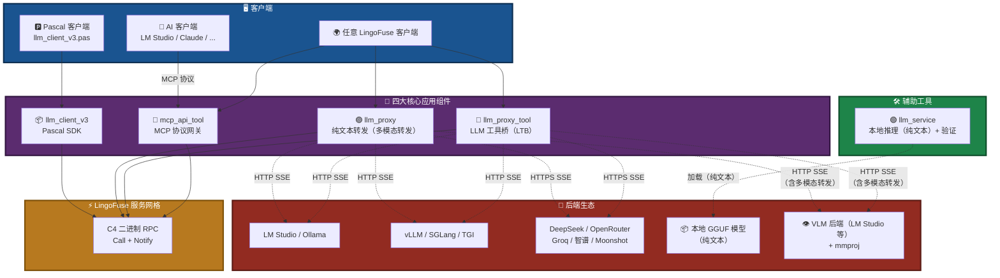

### 图 2：一次调用的完整链路

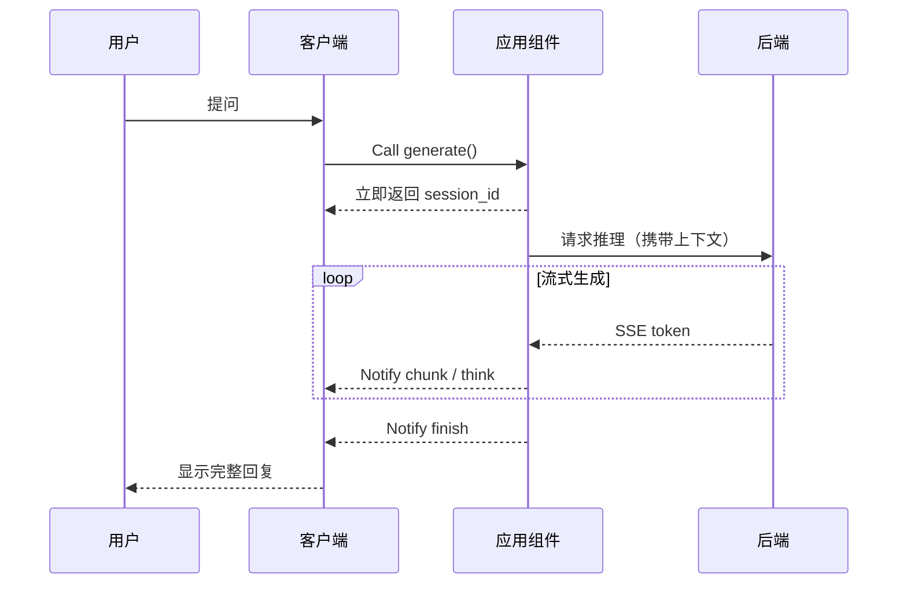

---

## 二、四大核心应用组件

pasAgent v3 的核心是 **4 个应用层组件**。它们分别对应 4 种典型集成场景，构成完整的"AI 调用 Pascal 工具"闭环。

### 图 3：四大组件对照

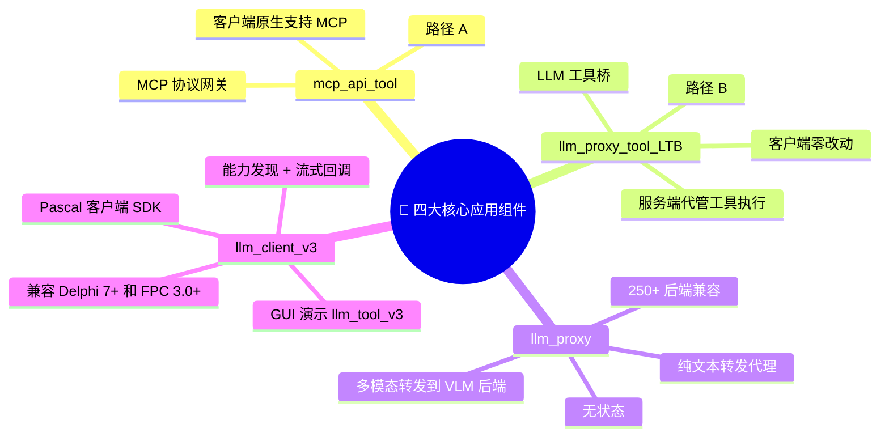

### 2.1 `mcp_api_tool` —— MCP 协议网关（路径 A）

| 属性 | 说明 |
|------|------|
| **角色** | 把 Pascal 工具翻译成 MCP 协议，暴露给自带 MCP 支持的客户端 |
| **工具执行位置** | **客户端侧**——AI 客户端自己决定调哪个工具、自己发起调用 |
| **适用客户端** | LM Studio / Claude Desktop / Continue.dev / Jan / DeepSeek |
| **传输模式** | stdio（默认）/ http（推荐）/ sse（已弃用） |
| **关键依赖** | `fastmcp`、`language_middleware`、信标 |

**核心特征**：
- 客户端**必须支持 MCP 协议**
- 工具列表由 `mcp_api_tool` 从信标动态拉取
- 与 `llm_proxy_tool` **可以共存**（`reg_agent` 名不同）

### 2.2 `llm_proxy_tool`（LTB）—— LLM 工具桥（路径 B · 推荐）

| 属性 | 说明 |
|------|------|
| **角色** | 服务端代管整个工具调用循环，客户端只发 `generate` |
| **工具执行位置** | **服务端侧**——LTB 内部完成多轮 tool_calls 循环 |
| **适用客户端** | **任何** LingoFuse 客户端（不要求支持 MCP） |
| **关键依赖** | `language_middleware`、信标、OpenAI 兼容后端 |
| **共存规则** | 与 `mcp_api_tool` **可共存**；与 `llm_proxy` / `llm_service` **默认共享端点**，需改 `--endpoint` + `--app-name` 才能共存 |
| **多模态** | ✅ **原样转发**图片附件到后端 |

**核心特征**：
- **客户端零改动**——只知道 `generate` / `create_session` / `close_session` 等基础 API
- 工具调用、结果回填、多轮循环全部在 LTB 内部完成
- **四重上限**保护：轮次 / 总调用数 / 单结果长度 / 总结果长度
- 工具不可用时**自动降级**为纯文本代理
- 后端必须支持 `tool_calls`（Function Calling）才能使用工具能力

**详细文档** → [`LingoFuse_LLM_Proxy_Tool_CLI_Guide.md`](LingoFuse_LLM_Proxy_Tool_CLI_Guide.md)

### 2.3 `llm_proxy` —— 纯文本转发代理

| 属性 | 说明 |
|------|------|
| **角色** | 无状态转发器，把 LingoFuse RPC 翻译成 OpenAI 兼容 HTTP |
| **适用场景** | 只需对话，**不需要工具** |
| **后端兼容** | **250+ OpenAI 兼容后端** |
| **`set_system_message`** | **明确拒绝**（无状态语义下无法实现） |
| **多模态** | ✅ **原样转发**图片附件到后端（是否支持取决于后端） |

**核心特征**：
- 每轮请求**重建** messages 数组，服务端**不持有** KV cache
- 支持 **250+ 后端**（LM Studio / Ollama / vLLM / DeepSeek / OpenRouter / Groq / 智谱 / Moonshot / …）
- 客户端代码一行不改，切换后端只改 `--backend-url`

**详细文档** → [`LingoFuse_LLM_Proxy_CLI_Guide.md`](LingoFuse_LLM_Proxy_CLI_Guide.md)
**兼容性清单** → [`LingoFuse_LLM_Proxy_Compatibility_Guide.md`](LingoFuse_LLM_Proxy_Compatibility_Guide.md)

### 2.4 `llm_client_v3` —— Pascal 客户端 SDK

| 属性 | 说明 |
|------|------|
| **角色** | Pascal 客户端 SDK，直接与 LingoFuse LLM 服务对话 |
| **源码位置** | **本仓库 `src\llm_client_v3.pas`** |
| **GUI 演示** | **`src\llm_tool_v3.lpi`**（完整可运行的多会话客户端） |
| **编译器兼容** | **Delphi 7+** 和 **Free Pascal 3.0+** |
| **Python 版本** | ❌ **不提供**——Python 天生能接智能体生态，不需要绕道 |

**核心特征**：
- 事件驱动：`OnChunk` / `OnThink` / `OnFinish` / `OnError` / `OnClosed`
- 能力发现：`get_api_capabilities` 让客户端在运行时查询服务端能力
- 会话过滤：`FActiveSessionId` 防止多会话串台
- 资源安全：`CleanupPartialConnect` 保证失败路径也释放资源

**详细文档** → [`llm_client_v3.md`](llm_client_v3.md)
**Structured Output 学习指南** → [`llm_client_v3_Structured_Output_Learning_Guide.md`](llm_client_v3_Structured_Output_Learning_Guide.md)
**开发者切入指南** → [`../../Pascal_Integration_Guide.md`](../../Pascal_Integration_Guide.md)

---

## 三、辅助工具：`llm_service`

`llm_service` 在 v3 中的定位**不同于 v2**。它不再是"三种核心服务端之一"，而是**辅助验证工具**。

### 3.1 定位

| 属性 | 说明 |
|------|------|
| **角色** | 本地推理服务 + 模型验证工具 |
| **核心价值** | **可以脱离 pasAgent 生态单独使用**——作为你项目里的"本地 LLM 小工具" |
| **能力边界** | ⚠️ **纯文本**——**不支持多模态**（本地 VLM 路径未实现） |
| **适用场景** | 断网环境 / 隐私敏感 / 快速验证模型 / 深度嵌入 |

### 3.2 独特之处

**可嵌入**：你可以在自己的 Pascal 项目里只引入 `llm_service` + `llm_client_v3`，就得到一个完全离线的"AI 助手"模块——不需要信标、不需要工具提供者、不需要 MCP。

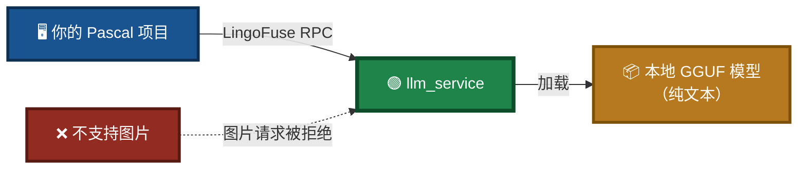

### 3.3 典型用途

| 场景 | 说明 |
|------|------|
| **离线环境** | 内网、无外网访问的工业现场 |
| **隐私敏感** | 数据不能出本地，必须全程离线 |
| **快速验证** | 检验某个 GGUF 模型是否适合你的任务 |
| **嵌入自研项目** | 只引入 `llm_service` + `llm_client_v3`，作为你的"AI 助手"模块 |
| **纯文本对话** | 日常问答、文本处理、代码生成 |

### 3.4 明确不支持的功能

| 功能 | 状态 | 替代方案 |
|------|:----:|----------|
| 图片问答 | ❌ | 用 `llm_proxy` / `llm_proxy_tool` 转发到 VLM 后端 |
| 语音输入 / 输出 | ❌ | 使用外部合规 ASR / TTS 服务 |
| 服务端工具执行 | ❌ | 用 `llm_proxy_tool`（LTB） |

> 💡 **生产环境推荐**：用 `llm_proxy` / `llm_proxy_tool` 转发到 LM Studio 等成熟后端。`llm_service` 是**验证和嵌入**场景的首选。

**详细文档** → [`LingoFuse_LLM_Service_CLI_guide.md`](LingoFuse_LLM_Service_CLI_guide.md)

---

## 四、两条工具执行路径

LingoFuse LLM 生态通过**两条路径**实现"AI 调用工具"。二者可以共存，服务不同的客户端类型。

### 图 4：两条路径对照

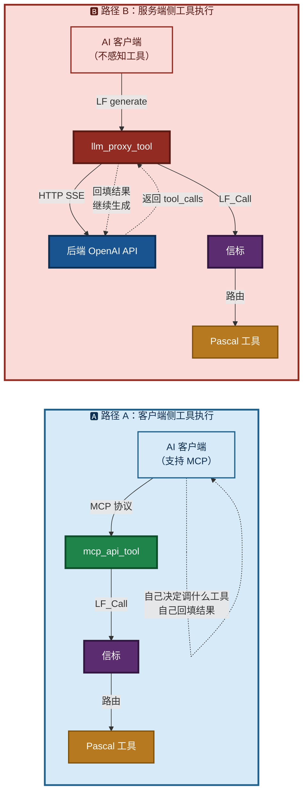

### 4.1 路径选择

| 你的情况 | 用哪条路径 | 组件 |
|----------|:----------:|------|
| 客户端**支持 MCP**（LM Studio / Claude Desktop） | 路径 A | `mcp_api_tool` |
| 客户端**不支持 MCP**（部分 Pascal GUI / 自研前端） | **路径 B（推荐）** | `llm_proxy_tool` |
| 只想对话，不需要工具 | — | `llm_proxy` |

### 4.2 路径 B 的关键设计

**服务端侧工具执行**——客户端完全**不知道**工具体系存在：

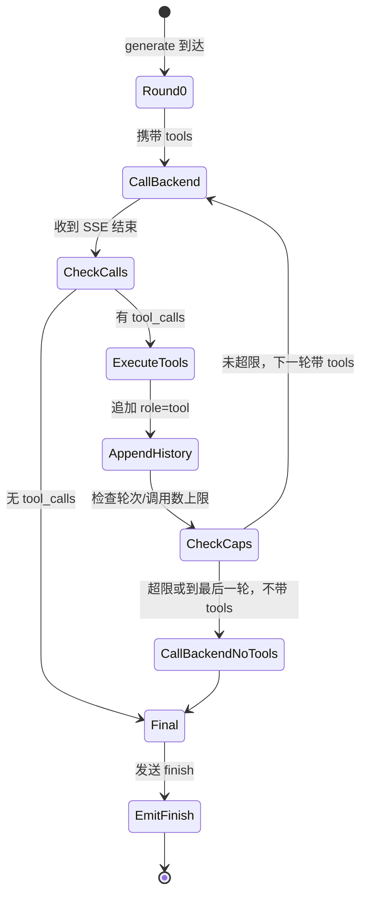

**四重上限**保护：

| 上限 | 默认值 | 作用 |
|------|:------:|------|
| `--max-tool-rounds` | 100 | 单次 `generate` 内最大往返轮次 |
| `--max-total-tool-calls` | 50 | 单次 `generate` 内最多执行工具次数 |
| `--max-tool-result-chars` | 8000 | 单条工具结果最大字符数 |
| `--max-total-tool-result-chars` | 200000 | 所有工具结果总和上限 |

**最后一轮强制不带 tools**——保证循环终止。

> **多模态与工具循环的组合**：图片只在**首轮**发送完整内容；后续工具调用轮次使用**历史占位符**（如 `[image: chart.png]`），避免 token 爆炸。详见第五章。

### 4.3 两条路径共存

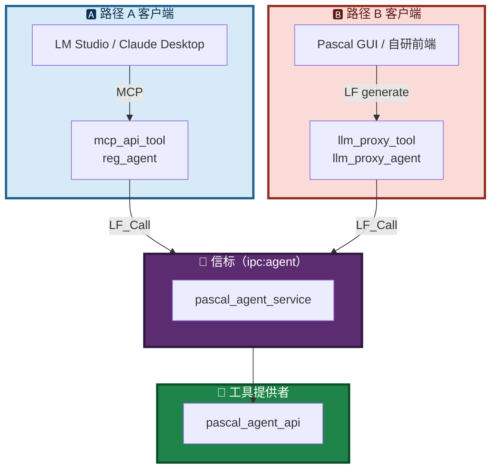

**共存关键**：`mcp_api_tool` 用 `reg_agent`，`llm_proxy_tool` 用 `llm_proxy_agent`——**二者注册名不同**，可同时运行，共享同一信标。

---

## 五、多模态能力

**多模态（Multimodal）是 v3 的核心能力**。它让 LingoFuse LLM 生态能处理**多种输入模态**——文字、图片——而不仅仅是纯文本。

> ⚠️ **重要边界**：多模态能力**由后端决定**。`llm_proxy` / LTB 只是**原样转发**图片附件；`llm_service` **完全不支持多模态**。

### 5.1 什么是多模态

传统 LLM 服务端只能处理文字。多模态架构让客户端能同时请求：

| 模态 | 说明 |
|------|------|
| **文字** | 用户提问、系统提示、多轮历史 |
| **图片** | 图表、截图、照片、扫描件 |

### 5.2 能力层面表述（**核心边界表**）

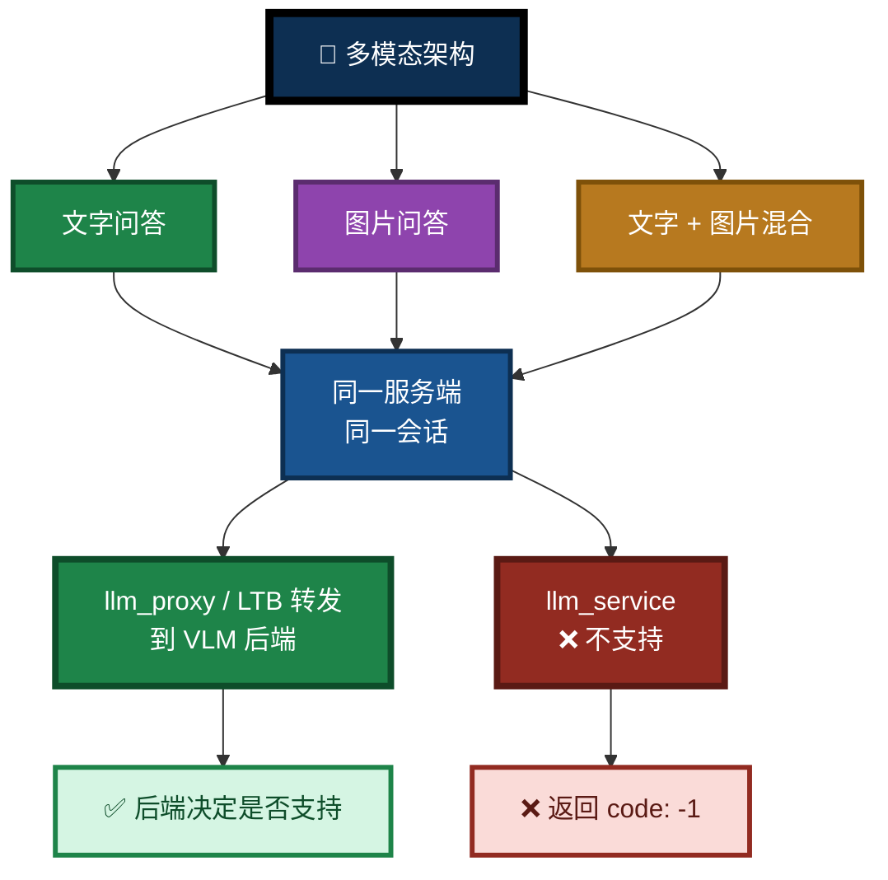

### 5.3 客户端视角

客户端通过 `generate` 请求携带多模态内容。不同客户端的支持程度不同：

| 客户端 | 多模态支持 | 说明 |
|--------|:----------:|------|
| `llm_client_v3.pas` | ✅ 通过 API 参数携带 | `GenerateWithAttachments` / `GenerateWithImageFile` |
| 自研客户端（LingoFuse RPC） | ✅ 通过 API 参数携带 | 需遵循 `attachments` 数组格式 |
| MCP 客户端（路径 A） | ⚠️ 由 MCP 协议 + 客户端自身支持决定 | 不同 MCP 客户端支持程度不同 |
| 纯文本客户端 | ❌ 仅文字 | — |

### 5.4 能力声明

多模态能力通过**能力矩阵**声明。客户端可在运行时通过 `get_api_capabilities` 查询服务端支持哪些模态：

| 服务端 | `vision` 字段 | 说明 |
|--------|:------------:|------|
| `llm_service` | **0** | **不支持**（本地 VLM 路径未实现） |
| `llm_proxy` | 取决于后端（**固定为 0**） | 服务端自身不做视觉处理；转发由后端决定 |
| `llm_proxy_tool` | 取决于后端（**固定为 0**） | 同上 |

> **关键点**：`llm_proxy` / LTB 的 `vision` 字段**固定为 0**——因为代理**自身不解析图片**，它只是转发者。图片能否被理解，**由后端决定**（后端有 VLM 就能处理，没有就会被忽略或报错）。详见第六章。

### 5.5 与其他能力的组合

多模态能力与工具执行路径**正交**：

- **路径 A + 多模态**：MCP 客户端自己携带图片（**如果**客户端支持，且后端支持）
- **路径 B + 多模态**：LTB 转发多模态请求到后端（**后端需支持**）
- **本地推理 + 多模态**：❌ **不支持**——`llm_service` 是纯文本服务

> 📖 多模态的具体参数、请求格式、后端配置，请参考：
> - [`NVIDIA-Nemotron-3-Nano-Omni-30B-A3B-Reasoning-UD-IQ4_XS.md`](NVIDIA-Nemotron-3-Nano-Omni-30B-A3B-Reasoning-UD-IQ4_XS.md)
> - [`LingoFuse_LLM_Proxy_CLI_Guide.md`](LingoFuse_LLM_Proxy_CLI_Guide.md) 第 5.5 节
> - [`LingoFuse_LLM_Proxy_Tool_CLI_Guide.md`](LingoFuse_LLM_Proxy_Tool_CLI_Guide.md) 第 4.5 节

---

## 六、API 能力发现机制

### 6.1 设计目的

LingoFuse 生态有**多个应用组件**，功能集不同：

- `llm_proxy` / `llm_proxy_tool` **不支持** `set_system_message`
- `llm_service` **支持** `set_system_message`
- 只有 `llm_service` 提供"进程内的本地推理"
- **多模态能力不属于服务端**——由后端决定

客户端需要一种机制**发现当前运行的服务端支持什么**，从而避免发出无效请求。

### 6.2 能力矩阵

通过 `get_api_capabilities` API 返回：

```json
{
  "code": 0,
  "server_kind": "service" | "proxy",
  "capabilities": {
    "generate": 1,
    "create_session": 1,
    "close_session": 1,
    "cancel_session": 1,
    "list_sessions": 1,
    "set_system_message": 0,
    "health": 1,
    "llm_stream": 1,
    "attachments": 1,
    "vision": 0
  }
}
```

**值语义**：`1` = 支持，`0` = 不支持。缺失条目按 `0` 处理。

> **注意**：`attachments=1` 表示**服务端接受附件字段**（不会拒绝请求），**不表示服务端能理解图片**。图片能否被理解，由**后端**决定。
>
> `vision=0` 在所有 LingoFuse LLM 服务端上**固定为 0**——因为服务端只做转发，不做视觉处理。

### 6.3 三种服务端的差异

| API | `llm_service` | `llm_proxy` | `llm_proxy_tool` |
|-----|:-------------:|:-----------:|:----------------:|
| `generate` | 1 | 1 | 1 |
| `create_session` | 1 | 1 | 1 |
| `close_session` | 1 | 1 | 1 |
| `cancel_session` | 1 | 1 | 1 |
| `list_sessions` | 1 | 1 | 1 |
| **`set_system_message`** | **1** | **0** | **0** |
| `health` | 1 | 1 | 1 |
| `llm_stream` | 1 | 1 | 1 |
| `attachments` | 1 | 1 | 1 |
| **`vision`** | **0** | **0** | **0** |
| **`tools`** | — | — | **1** |
| **`tool_calls`** | — | — | **1** |
| **`tool_results`** | — | — | **1** |
| `server_kind` | `service` | `proxy` | `proxy` |

> **关键点**：
> - `vision=0` 对**所有**服务端成立——它表达的是"服务端自身不做视觉处理"，而非"整个链路不支持多模态"。
> - `llm_proxy` 与 `llm_proxy_tool` 的 `server_kind` **都是** `"proxy"`。要区分二者，读 `tools` / `tool_calls` 等 LTB 特有字段。
> - `llm_service` 的 `set_system_message=1` 是它与两个代理的**唯一功能差异**。

### 6.4 客户端降级行为

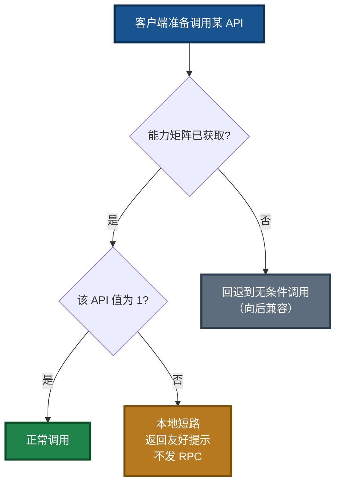

**向后兼容**：旧服务端不暴露 `get_api_capabilities` 时，客户端缓存保持为空，相关命令按"未知"处理，回退到无条件调用。

---

## 七、流式协议

### 7.1 消息类型

所有服务端向客户端推送的流式消息使用**统一的结构化 JSON 协议**：

| 类型 | 字段 | 含义 |
|------|------|------|
| `chunk` | `session_id`, `text` | 正文流 |
| `think` | `session_id`, `text` | 思考流（推理模型才有） |
| `finish` | `session_id`, `reason` | 生成结束 |
| `error` | `session_id`, `message` | 服务端错误 |
| `closed` | `session_id`, `reason` | 会话关闭 |

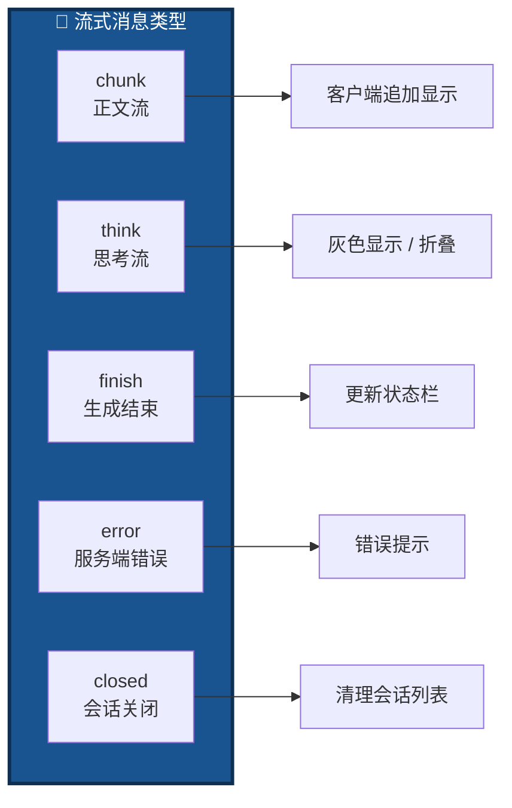

### 7.2 协议演进

| 版本 | 协议 | 特点 |
|:----:|------|------|
| **v1.0** | 字符串魔法 | `{"chunk": "__FINISH__"}`——用 `startswith` 判断 |
| **v3.0+** | 结构化 JSON | `{"type": "finish", "reason": "stop"}`——读 `type` 字段 |

**客户端只看 `type` 字段，不解析任何"魔法字符串"。**

### 7.3 thinking 流处理

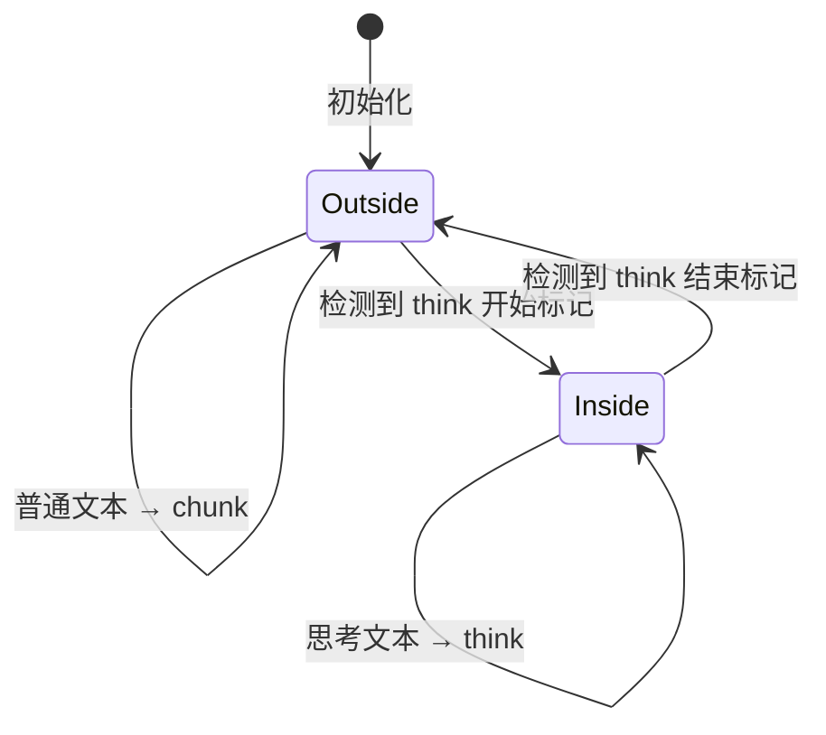

**三条路径**：

- **`llm_service`**：模板预置 thinking 标记或模型自发，`ThinkingParser` 状态机分流
- **`llm_proxy`**：后端 SSE 已分离 `reasoning_content` 和 `content`，代理**无策略转发**
- **`llm_proxy_tool`**：与 `llm_proxy` 相同——`reasoning_content` 直接转为 `think`

---

## 八、典型使用场景

### 场景 1：路径 A —— LM Studio + 支持 MCP 的客户端

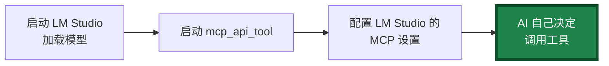

**步骤**：

1. 启动信标 `pascal_agent_service.exe`
2. 启动工具提供者 `pascal_agent_api.exe`（或你的工具）
3. 启动 `mcp_api_tool.exe`
4. 在 LM Studio 的 MCP 设置中填入配置
5. 提问 → AI 自动调用工具

### 场景 2：路径 B —— Pascal GUI + LM Studio（推荐）

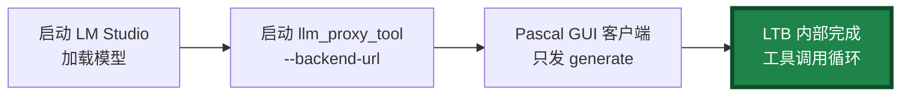

**步骤**：

1. 启动信标
2. 启动工具提供者
3. 启动 `llm_proxy_tool.exe --backend-url http://127.0.0.1:1234/v1`
4. Pascal GUI 客户端 `Connect` + `Generate`
5. LTB 内部完成工具调用，客户端收到完整回答

### 场景 3：纯对话

```powershell
.\llm_proxy.exe --backend-url http://127.0.0.1:1234/v1
```

### 场景 4：本地验证模型（纯文本）

```powershell
.\llm_service.exe --model-path .\NVIDIA-Nemotron-3-Nano-Omni-30B-A3B-Reasoning-UD-IQ4_XS.gguf
```

> ⚠️ **注意**：`llm_service` **不支持多模态**。加载 Omni 主模型后只能做**纯文本**推理；若需图片问答，请改用 LTB + VLM 后端。

### 场景 5：多模态图片问答（**v3 新增**）

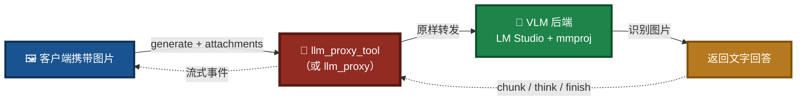

**步骤**：

1. 在 LM Studio 加载 **VLM（如 Qwen2-VL / Nemotron Omni + mmproj）**
2. 启动 `llm_proxy_tool.exe --backend-url http://127.0.0.1:1234/v1 --backend-model "your-vlm-id" --vision`
3. 客户端（`llm_client_v3`）用 `GenerateWithImageFile` 发图
4. LTB 转发到 VLM，返回识别结果

**关键点**：**不要把图片发给 `llm_service`**——它会返回 `code: -1`。

### 场景 6：路径 A 与路径 B 共存

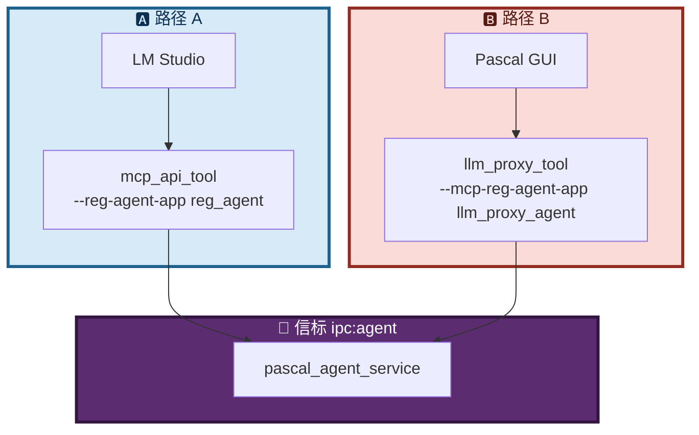

**要点**：二者 `reg_agent` 名字不同，可同时运行，共享同一信标。

### 场景 7：三种 LLM 服务端共存

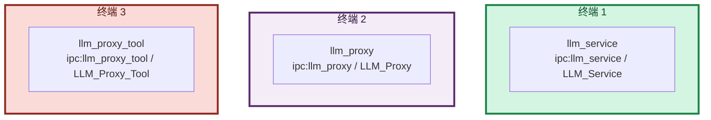

**要点**：三者**必须**使用不同的 `--endpoint` 和 `--app-name`。

---

## 九、故障排查

### 9.1 症状速查表

| 症状 | 可能原因 | 排查方向 |
|------|----------|:--------:|
| 服务端刷屏 `no found app` | `client_name` 不是真实注册的 App 名 | Pascal 核心层指南 `LF-APP-003` |
| 客户端延迟数秒才收到第一批 token | SSE 缓冲 | 检查后端 gzip / 反代 |
| 服务端启动后立即退出 | `main()` 缺少阻塞主循环 | 检查启动命令 |
| 思考阶段无输出，之后突然全部出现 | `reasoning_content` 被丢弃 | 检查后端 SSE 帧格式 |
| `set_system_message` 返回 `unsupported` | 当前是 `llm_proxy` 或 `llm_proxy_tool` | 用 `create_session` 传 `system_message` |
| 多会话输出串台 | 客户端未按 `session_id` 过滤 | 客户端 SDK 会话过滤 |
| 中文乱码 | 未使用 `TBytes` 全程 UTF-8 | Pascal 核心层指南 `LF-XLANG-002` |
| 关闭窗口时崩溃 | `FormClose` 直接 Shutdown | Pascal 核心层指南 `LF-CLEAN-001` |
| 新的 system prompt 不生效 | 未走 `CreateSession` 路径 | 改走 `CreateSession(system_message)` |
| **LTB 启动了但工具不执行** | `--enable-tools` 未开 / middleware 不可连 / 信标未启动 | LTB 手册 Q1 |
| **LTB 与 mcp_api_tool 同时启动冲突** | 二者 `reg_agent` 名字相同 | LTB 手册 Q3 |
| **LTB 启动时报 `LF_PrepareDone returned 0`** | middleware 与 Server.start 竞争 | LTB 手册 Q2 |
| **LTB 收到的 `tool_calls` 参数为空** | SSE 分片未按 `index` 拼接 `arguments` | LTB 手册 Q4 |
| **客户端发图片但后端不认** | 后端非 VLM / `--backend-model` 未指向 VLM | LTB 手册 Q11 |
| **客户端把图片发给 `llm_service`** | `llm_service` 不支持多模态 | Service 手册 Q14 |

完整排查指南请查阅对应的专项手册（`src/LingoFuse_LLM_Proxy_Tool_CLI_Guide.md` / `src/LingoFuse_LLM_Proxy_CLI_Guide.md` / `src/LingoFuse_LLM_Service_CLI_guide.md`）。

### 9.2 路径选择排查

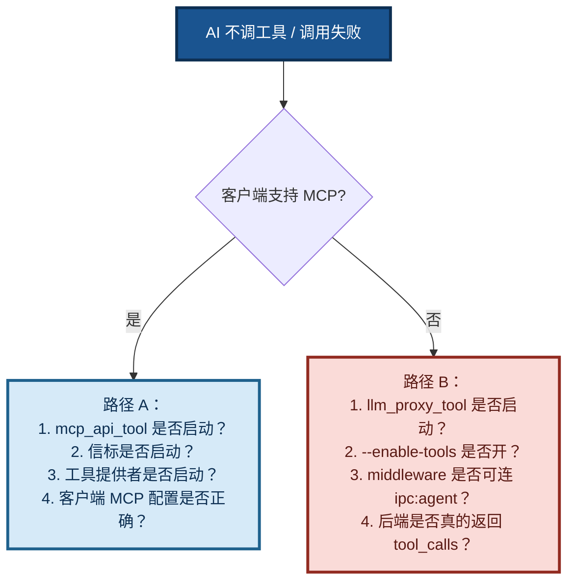

### 9.3 多模态排查

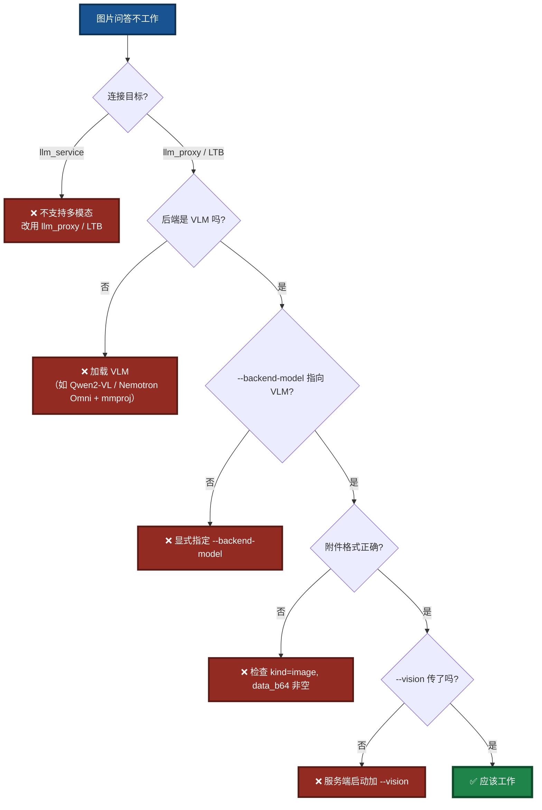

---

## 十、三条铁律

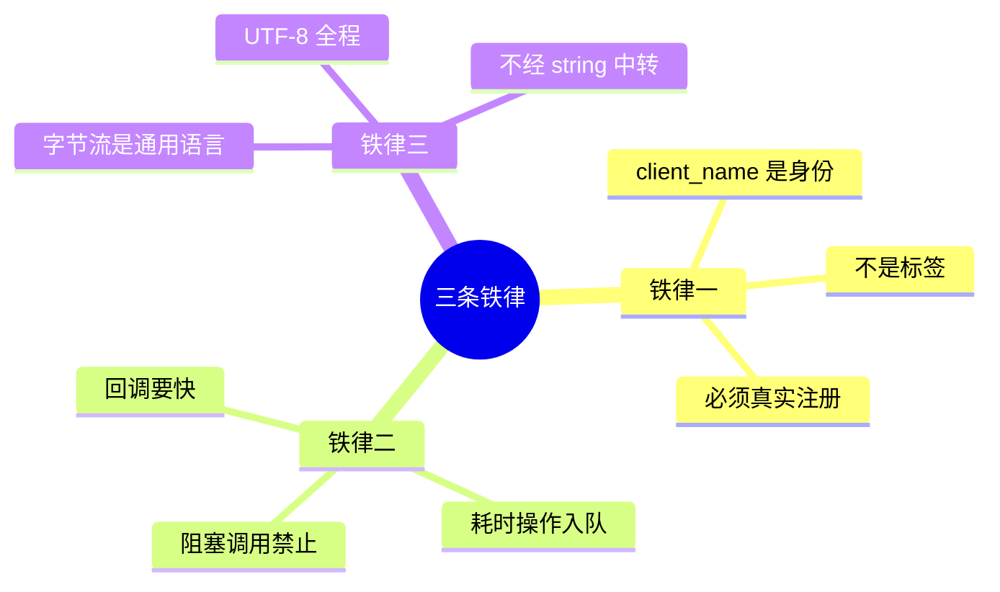

1. **`client_name` = LingoFuse 网络路由身份**，必须是 `generate_app_name()` 的返回值。
2. **回调只做"读输入 + 入队 + 立即返回"**。耗时操作放到工作线程。
3. **跨语言 JSON 走 `TBytes` / `bytes`**，UTF-8 全程一致。

---

## 十一、文档索引（同目录）

| 文档 | 说明 |
|------|------|
| [`LingoFuse_LLM_Proxy_Tool_CLI_Guide.md`](LingoFuse_LLM_Proxy_Tool_CLI_Guide.md) | 🔴 **LTB 命令行手册**（路径 B 核心） |
| [`LingoFuse_LLM_Proxy_CLI_Guide.md`](LingoFuse_LLM_Proxy_CLI_Guide.md) | 🟣 **纯转发代理命令行手册**（含多模态转发） |
| [`LingoFuse_LLM_Proxy_Compatibility_Guide.md`](LingoFuse_LLM_Proxy_Compatibility_Guide.md) | **250+ 后端兼容清单**（LTB 亦适用） |
| [`LingoFuse_LLM_Service_CLI_guide.md`](LingoFuse_LLM_Service_CLI_guide.md) | 🟢 **本地推理服务命令行手册**（纯文本） |
| [`llm_client_v3.md`](llm_client_v3.md) | **Pascal 客户端 SDK 文档** |
| [`llm_client_v3_Structured_Output_Learning_Guide.md`](llm_client_v3_Structured_Output_Learning_Guide.md) | **Structured Output 完整学习指南** |
| [`pascal_agent_api_ref_json.md`](pascal_agent_api_ref_json.md) | `agent_main` / `register_agent` JSON 结构详解 |
| [`lingofuse/Bridge_User_Guide.md`](lingofuse/Bridge_User_Guide.md) | HTTP 桥接网关使用指南 |
| [`LingoFuse_Pascal_Complete_Guide.md`](LingoFuse_Pascal_Complete_Guide.md) | Pascal 核心层完整指南（含踩坑知识库） |
| [`QUICK_START_LLM_STACK.md`](QUICK_START_LLM_STACK.md) | LLM 栈快速上手 |
| [`NVIDIA-Nemotron-3-Nano-Omni-30B-A3B-Reasoning-UD-IQ4_XS.md`](NVIDIA-Nemotron-3-Nano-Omni-30B-A3B-Reasoning-UD-IQ4_XS.md) | 推荐模型下载与部署 |

### 根目录相关文档

| 文档 | 说明 |
|------|------|
| [`../readme.md`](../readme.md) | 项目总览与四大核心应用组件 |
| [`../Pascal_Integration_Guide.md`](../Pascal_Integration_Guide.md) | **Pascal 开发者切入指南** |
| [`../Build_Guide.md`](../Build_Guide.md) | 编译指南（含 `llm_client_v3` / `llm_tool_v3`） |

### 代码生成器

> ⚠️ **MCP-API 代码生成工具已独立到专用仓库：**
>
> ### 👉 [https://github.com/PassByYou888/LingoFuse-Tools](https://github.com/PassByYou888/LingoFuse-Tools)
>
> 一份声明 → **几十种目标语言的 API 接口**。声明规范、使用手册、生成器源码与预编译包均以该仓库为准。

---

## 十二、核心要点速记

> 📌 **五句话记住本文档**：

1. **四大核心应用组件**——`mcp_api_tool`（路径 A）/ `llm_proxy_tool`（LTB，路径 B）/ `llm_proxy`（纯转发）/ `llm_client_v3`（Pascal SDK）；`llm_service` 是**辅助验证工具**（纯文本）。
2. **两条工具执行路径**——路径 A（客户端侧 MCP）/ 路径 B（服务端代管，**客户端零改动**）；二者可以共存。
3. **多模态由后端决定**——`llm_proxy` / LTB **原样转发**图片附件；`llm_service` **不支持多模态**。`vision=0` 是**所有服务端的固定值**（表达"服务端自身不做视觉处理"）。
4. **能力发现机制**——`get_api_capabilities` 让客户端在运行时知道服务端支持什么（`set_system_message` / `tools` / `attachments`）；不支持的能力本地短路，避免无效 RPC。
5. **流式协议结构化**——`chunk` / `think` / `finish` / `error` / `closed`；客户端只读 `type` 字段。

> 🎯 **记住这句话就够了**：
>
> **v3 的核心是"四大应用组件 + 两条工具执行路径 + 多模态转发"。`llm_service` 是纯文本辅助工具——图片问答请走 `llm_proxy` / LTB 转发到 VLM 后端。**

---

**文档版本**：v5.2（v3 架构重写版 · 目录对齐版——移除失效文档引用 `LingoFuse_LLM_Pitfalls_For_AI.md` / `LingoFuse_LLM_Service_Work_Summary.md` / `code_generate_mcp.md`；MCP-API 生成器统一指向 [LingoFuse-Tools](https://github.com/PassByYou888/LingoFuse-Tools)；新增 `llm_client_v3_Structured_Output_Learning_Guide.md` / `QUICK_START_LLM_STACK.md` 引用；对齐实际仓库文档清单）
**维护者**：LingoFuse-pasAgent 团队
**反馈**：问题提 Issue，急事加 Q（600585）