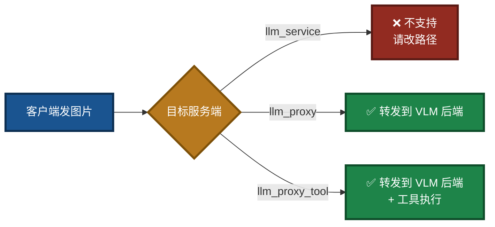
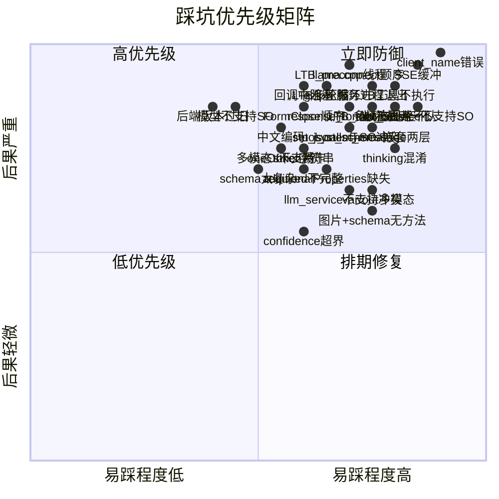
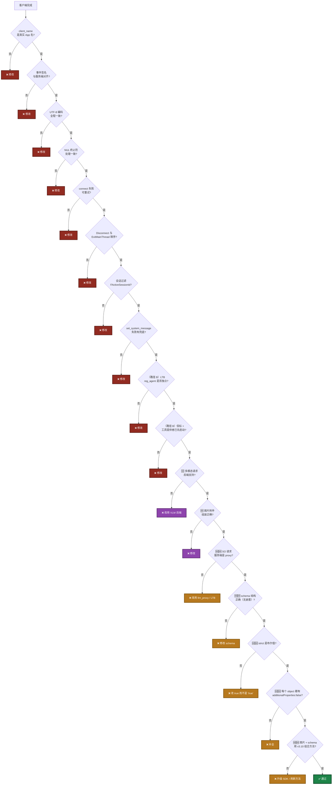
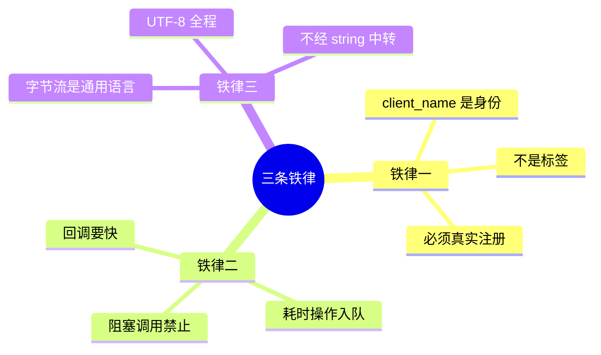
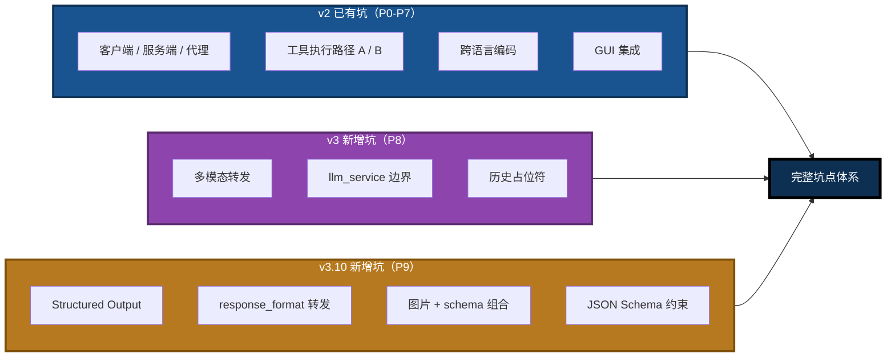

# LingoFuse LLM Pitfalls For AI

> **目标读者**：**AI 助手**
> **用途**：接手本项目时，快速避坑
> **覆盖范围**：服务端 / 代理层 / 客户端 / 协议 / 跨语言 / GUI / 多模态 / **结构化输出**
> **文档版本**：v5.0（v3 架构重写版 + Structured Output 合并版）
> **最后更新**：2026-09-17
> **相关文档**（同目录）：
> - [`LingoFuse_LLM_Ecosystem_User_Guide.md`](LingoFuse_LLM_Ecosystem_User_Guide.md) — 生态总览
> - [`LingoFuse_LLM_Service_CLI_guide.md`](LingoFuse_LLM_Service_CLI_guide.md) — 本地推理服务手册
> - [`LingoFuse_LLM_Proxy_CLI_Guide.md`](LingoFuse_LLM_Proxy_CLI_Guide.md) — 纯转发代理手册
> - [`LingoFuse_LLM_Proxy_Tool_CLI_Guide.md`](LingoFuse_LLM_Proxy_Tool_CLI_Guide.md) — LTB 命令行手册
> - [`LingoFuse_LLM_Proxy_Compatibility_Guide.md`](LingoFuse_LLM_Proxy_Compatibility_Guide.md) — 后端兼容清单
> - [`LingoFuse_LLM_Service_Work_Summary.md`](LingoFuse_LLM_Service_Work_Summary.md) — 版本演进
> - [`llm_client_v3.md`](llm_client_v3.md) — Pascal 客户端 SDK 文档（**含 §16 Structured Output**）
> - [`Structured_Output_Learning_Guide.md`](../Structured_Output_Learning_Guide.md) — **Structured Output 完整学习指南**

---

## 零、阅读指南

本文档**不解释原理**，只列**踩过的坑 + 正确做法**。
每条坑格式：**症状 → 根因 → 正确做法**。
AI 检索时可直接搜关键词（如 `client_name`、`var/out`、`Streaming stall`、`max_tool_rounds`、`多模态`、`P8`、`Structured Output`、`response_format`、`P9`）。

**优先级标识**：

- 🔴 **致命**：不修必崩
- 🟠 **严重**：逻辑错误 / 静默失败
- 🟡 **一般**：体验 / 可维护性

**版本标识**：

- 无标识：v2 已有坑，v3 继续适用
- 🆕 **v3 新增**：v3 架构变化引入的新坑
- 🆕🆕 **v3.10 新增**：Structured Output 引入的新坑（P9 系列）

**仓库归属说明**：

- 本文档中提到的 **Pascal GUI 客户端**（`llm_client.pas`、`llm_tool_frm.pas`、`llm_tool_frm.lfm`）属于 **LingoFuse 核心仓库**，**不在本仓库**（`LingoFuse-pasAgent-v3`）。
- 本文档中提到的 **`llm_client_v3.pas`**、**`llm_tool_v3_frm.pas`**、**`llm_tool_v3.lpi`** 属于 **本仓库**（`LingoFuse-pasAgent-v3`）。
- 本仓库还包含：Python 组件（`llm_*.py`）、MCP 网关（`mcp_api_tool.py`）、LTB（`llm_proxy_tool.py`）、Pascal 服务端示例（`pascal_agent_*.lpr`）。

---

## 一、通用踩坑地图

```mermaid
flowchart TB
    ROOT["🎯 LingoFuse + LLM 项目"]

    ROOT --> A["🟦 LingoFuse 框架坑"]
    ROOT --> B["🟩 Python 服务端坑"]
    ROOT --> P["🟪 llm_proxy 传输坑"]
    ROOT --> L["🔴 LTB 服务端工具执行坑"]
    ROOT --> M["🌐 多模态转发坑（v3 新增 · P8）"]
    ROOT --> SO["🎯 Structured Output 坑（v3.10 新增 · P9）"]
    ROOT --> C["🟫 Pascal 客户端坑"]
    ROOT --> D["🟧 跨语言协议坑"]
    ROOT --> E["🟥 GUI 集成坑"]

    A --> A1["client_name 必须是 App 名"]
    A --> A2["回调中不能调 LF_Call"]
    A --> A3["Sequenced Notify 目标"]
    A --> A4["Overlap_Connection 陷阱"]
    A --> A5["LF_ExitMainThread 全局副作用"]

    B --> B1["llama.cpp 单线程"]
    B --> B2["tokenize 计数"]
    B --> B3["system_message 竞态"]
    B --> B4["模板路径搜索"]

    P --> P1["requests 的 SSE 缓冲"]
    P --> P2["gzip 压缩破坏流式"]
    P --> P3["iter_content 参数陷阱"]
    P --> P4["http.client 是唯一可靠方案"]
    P --> P5["Accept-Encoding: identity"]

    L --> L1["LTB 工具不执行"]
    L --> L2["与 mcp_api_tool reg_agent 冲突"]
    L --> L3["预连接 middleware 顺序"]
    L --> L4["tool_calls 参数为空 {}"]
    L --> L5["多轮循环未终止"]

    M --> M1["客户端发图片后端不认"]
    M --> M2["历史占位符替换"]
    M --> M3["llm_service 不支持多模态"]

    SO --> SO1["llm_service 不支持 SO"]
    SO --> SO2["response_format 被静默丢弃"]
    SO --> SO3["json_schema 嵌套两层"]
    SO --> SO4["strict 用了字符串"]
    SO --> SO5["additionalProperties 缺失"]
    SO --> SO6["oneOf 等不支持的关键字"]
    SO --> SO7["图片 + schema 无单一方法"]
    SO --> SO8["坐标未归一化 / 顺序错"]
    SO --> SO9["tool_calls 与 SO 冲突"]

    C --> C1["var/out 同签名"]
    C --> C2["事件签名对齐"]
    C --> C3["Connect 部分失败"]

    D --> D1["字符串魔法协议"]
    D --> D2["NUL 终止符"]
    D --> D3["UTF-8 字节流"]

    E --> E1["后台线程读 UI"]
    E --> E2["关闭顺序"]
    E --> E3["LF_Sync 驱动"]

    style ROOT fill:#0D2F52,stroke:#000000,stroke-width:4px,color:#FFFFFF
    style A fill:#1A5490,stroke:#0D2F52,stroke-width:3px,color:#FFFFFF
    style B fill:#1E8449,stroke:#0E4D2A,stroke-width:3px,color:#FFFFFF
    style P fill:#5B2C6F,stroke:#321640,stroke-width:3px,color:#FFFFFF
    style L fill:#922B21,stroke:#5A1A14,stroke-width:3px,color:#FFFFFF
    style M fill:#8E44AD,stroke:#5B2C6F,stroke-width:3px,color:#FFFFFF
    style SO fill:#B7791F,stroke:#7E5109,stroke-width:4px,color:#FFFFFF
    style C fill:#7B241C,stroke:#4A1108,stroke-width:3px,color:#FFFFFF
    style D fill:#B7791F,stroke:#7E5109,stroke-width:3px,color:#FFFFFF
    style E fill:#C0392B,stroke:#641E16,stroke-width:3px,color:#FFFFFF
```



---

## 二、🔴 致命坑（必须避免）

### P0-1. **`client_name` 必须是真实注册的 App 名**

**症状**：

```
no found app("interactive") api("llm_stream")
no found app("interactive") api("llm_stream")
no found app("interactive") api("llm_stream")
...
```

服务端刷屏 `no found app`，客户端永远收不到任何消息，`finish_event` 永不置位，看起来"卡死"。

**根因**：
LLM 客户端的 `client_name` **不是**一个人可读的标签，而是 **LingoFuse 网络上真实存在的 App 名**。服务端通过 `LF_Sequenced_Notify(client_name, ...)` 推消息时，LingoFuse 会按这个名字去查找路由。名字不存在，消息被丢弃。

**反面示例**：

```python
# ❌ 错误：硬编码字符串作为 client_name
client_name = "interactive"
session = create_session(client_name=client_name)  # 服务端拿这个名字推送，找不到
```

**正确做法**：

```python
# ✅ 正确：先用 generate_app_name() 拿到真实 App 名
LF_PrepareClient(endpoint, nil)
LF_PrepareDone()
client_name = generate_app_name()   # 形如 @__generate__@ipc:llm_service:0&...
app = App(client_name)
app.register_notify("llm_stream", on_stream)
LF_BindApp(app.raw)
# 之后所有 client_name 都用这个真实值
```

**AI 检索关键词**：`client_name`、`generate_app_name`、`no found app`、`Sequenced_Notify`。

---

### P0-2. **llama.cpp 上下文不是线程安全的**

**症状**：

- 双开客户端时，会话串台（A 收到 B 的内容）
- 推理中途进程突然 abort，Python 层 try/except 抓不住
- `GGML_ASSERT` 崩溃

**根因**：
`llama_cpp.Llama` 内部的 `llama_context`（KV cache、采样器 RNG、tokenizer BPE）是**单线程状态机**。多线程并发调用 `create_chat_completion` 会互相污染。

**反面示例**：

```python
# ❌ 错误：多线程直接调用共享的 llm
def handle_request(data):
    threading.Thread(target=self.llm.create_chat_completion, args=(...)).start()
```

**正确做法**：

```python
# ✅ 正确：所有推理串行化到单 worker 线程
self._request_queue = queue.Queue()
self._worker_thread = threading.Thread(target=self._worker_loop)
self._worker_thread.start()

# 回调线程只入队，不做推理
def handle_request(data):
    self._request_queue.put_nowait(task)   # 立即返回
```

**AI 检索关键词**：`llama.cpp`、`线程安全`、`KV cache`、`worker thread`、`串行化`。

---

### P0-3. **回调中不能调用阻塞 LingoFuse 函数**

**症状**：

- 回调里调 `LF_Call` / `LF_LocalCall` / `LF_PrepareDone` → 死锁
- 回调线程持锁等待，网络线程无法推进

**根因**：
LingoFuse 的回调在库内部的线程池执行。回调期间持有内部锁。若在回调里再调阻塞函数（如 `LF_Call` 等同步调用），会尝试获取另一把锁/等待另一线程，与当前回调持锁形成死锁。

**反面示例**：

```python
# ❌ 错误：在回调里做远程调用
def on_stream(trigger, inp):
    data = inp.read_json()
    result = LF_Call("OtherApp", data, 5000)  # 死锁！
```

**正确做法**：

```python
# ✅ 正确：入队到工作线程，回调立即返回
def on_stream(trigger, inp):
    data = inp.read_json()
    self._work_queue.put_nowait(data)   # 立即返回
```

**AI 检索关键词**：`callback`、`deadlock`、`LF_Call`、回调阻塞。

---

### P0-4. **`requests` 的 SSE 响应缓冲（流式延迟的元凶）**

**症状**：

- `llm_proxy` / LTB 转发流式输出，客户端延迟几秒甚至十几秒才收到第一批 token
- LM Studio 日志显示 token 生成速率稳定（如 30 t/s），但客户端看不到
- 尝试过 `iter_lines()`、`iter_content(chunk_size=None)`、`iter_content(chunk_size=1)`、`Accept-Encoding: identity` **全部无效**

**根因**（三层叠加，缺一都无效）：

1. **`iter_lines()` 内部缓冲 512 字节**：`requests` 的 `iter_lines()` 底层用 `iter_content(chunk_size=512)`，短 SSE 行（如 50 字节）必须攒够 512 字节才 yield 一次。
2. **`iter_content(chunk_size=None)` 语义是"读到 EOF"**：整个响应必须结束才返回数据，一次性吐出全部。
3. **`urllib3` 层在 socket 之上还有内部预读**：即使换成 `chunk_size=1`，`urllib3` 也会预读 socket 缓冲。
4. **gzip 压缩**：`requests` 默认发 `Accept-Encoding: gzip, deflate`，gzip 解码器必须攒够完整 deflate 块才吐数据。

**正确做法**：

```python
# ✅ 换用 http.client 标准库
import http.client, socket, ssl
from urllib.parse import urlparse

parsed = urlparse(url)
if parsed.scheme == "https":
    conn = http.client.HTTPSConnection(parsed.hostname, parsed.port,
                                       timeout=300, context=ssl.create_default_context())
else:
    conn = http.client.HTTPConnection(parsed.hostname, parsed.port, timeout=300)

conn.putrequest("POST", parsed.path, skip_accept_encoding=True)
conn.putheader("Content-Type", "application/json")
conn.putheader("Accept", "text/event-stream")
conn.putheader("Accept-Encoding", "identity")   # SSE 不压缩
conn.putheader("Content-Length", str(len(body)))
conn.endheaders()
conn.send(body)

resp = conn.getresponse()
for raw_line in resp:                            # 每行一到就 yield
    ...
```

**AI 检索关键词**：`SSE buffering`、`iter_lines`、`iter_content`、`requests delay`、`streaming stall`、`http.client`。

---

### P0-5. **LLM 服务进程立即退出**

**症状**：

- 启动日志显示所有 API 注册成功
- 然后立刻 `Clean Framework` / `Server stopped`，进程退出
- 客户端连接时 `no found app`

**根因**：
`main()` 里 `service.start()` 只负责启动，**不阻塞**。启动完直接进入 `finally` 块调用 `service.stop()`，一切被立即清理。

**正确做法**：

```python
# ✅ 信号处理 + 主循环阻塞
_SHUTDOWN = threading.Event()

def _install_signal_handlers():
    def _handler(signum, frame):
        logger.info("Received signal %s; shutting down", signum)
        _SHUTDOWN.set()
    for sig in ("SIGINT", "SIGTERM"):
        s = getattr(signal, sig, None)
        if s is None: continue
        try:
            signal.signal(s, _handler)
        except (ValueError, OSError):
            pass

def main():
    service = LLMProxyService()  # 或 LLMProxyToolService / LLMService
    atexit.register(service.stop)
    _install_signal_handlers()
    try:
        service.start()
        logger.info("Press Ctrl+C to stop...")
        while not _SHUTDOWN.is_set():
            if _SHUTDOWN.wait(timeout=1.0):
                break
    except KeyboardInterrupt:
        logger.info("Interrupted by user")
    finally:
        service.stop()
```

**AI 检索关键词**：`服务进程退出`、`SIGINT`、`main loop`、`atexit`、`_SHUTDOWN`。

---

### P0-6. **thinking 阶段被误认为"网络延迟"**

**症状**：

- 客户端发送"你好"后，17 秒内完全没有任何输出
- 用户以为是网络卡死或代理缓冲
- 但 LM Studio 日志显示模型从 0 秒开始就在稳定输出 30 t/s
- 17 秒后，客户端**突然**一次性显示出完整的正文回复

**根因**：
Reasoning 模型（Nemotron、DeepSeek-R1、Qwen3-thinking、...）在 SSE 流里输出**两种字段**：

- `reasoning_content`：思考链（内部推理，占 10~20 秒）
- `content`：最终答案（思考结束后才开始）

如果代理只转发 `content` 丢弃 `reasoning_content`，客户端会在 17 秒内看不到任何输出，然后突然收到全部正文。

**正确做法**：

```python
# ✅ 无策略转发：reasoning_content 和 content 都发
for delta in self._backend.stream_chat(model, messages, options):
    if "reasoning_content" in delta:
        self._emit(sess, {"type": "think", "text": delta["reasoning_content"]})
    if "content" in delta:
        self._emit(sess, {"type": "chunk", "text": delta["content"]})
```

**是否产生 thinking 由模型决定，不由代理决定**：

- Nemotron / DeepSeek-R1：思考 10~20 秒
- Qwen3 / Llama3：通常无 thinking
- 客户端可选择显示 think 事件（暗色）或忽略

**AI 检索关键词**：`reasoning_content`、`thinking`、`delay`、`Nemotron`、`DeepSeek-R1`。

---

## 三、🌉 llm_proxy / LTB 传输专项坑

### P6-1. **`Accept-Encoding: identity` 必须显式设置**

**症状**：

- 即使换用 `http.client`，某些后端（如 nginx 反代的 vLLM）仍返回 gzip 压缩的 SSE
- 客户端仍看到批量输出

**根因**：
HTTP 客户端默认（或通过 `urllib3` / `requests`）发送 `Accept-Encoding: gzip, deflate`。任何支持 gzip 的后端会压缩 SSE 流。gzip 解码器必须攒够完整的 deflate 块才吐数据。

**正确做法**：

```python
# ✅ 显式要求不压缩
headers = {
    "Accept": "text/event-stream",
    "Accept-Encoding": "identity",   # SSE 标准实践
}
```

并且 `http.client.putrequest()` 要传 `skip_accept_encoding=True`，否则库会自动加上默认值。

**AI 检索关键词**：`Accept-Encoding`、`gzip`、`identity`、`SSE compression`。

---

### P6-2. **`TCP_NODELAY` 优化**

**症状**：

- 大部分情况下已经实时，但偶尔有 40ms 级别的抖动

**根因**：
Nagle 算法会合并小包。SSE 的每行很短（几十字节），如果 Nagle 开启会攒够 MSS 才发送。

**正确做法**：

```python
# ✅ 连接建立后立即禁用 Nagle
conn.connect()
conn.sock.setsockopt(socket.IPPROTO_TCP, socket.TCP_NODELAY, 1)
```

**AI 检索关键词**：`TCP_NODELAY`、`Nagle`、`SSE latency`。

---

### P6-3. **`llm_proxy` / `llm_proxy_tool` 中的 `set_system_message` 必须显式返回 unsupported**

**症状**：

- 客户端调用 `set_system_message`，收到 `{"code": 0}`，以为成功
- 但已存在会话的 system prompt 没有任何变化

**根因**：
`llm_proxy.py` 是无状态转发器，没有全局 state。若 `set_system_message` 返回 `{"code": 0}` 但实际什么都没做，客户端会误判。

**正确做法**：

```python
# ✅ 明确拒绝，给出替代方案
def _handle_set_system_message(self, data):
    logger.info("set_system_message rejected: not supported by "
                "llm_proxy (stateless forwarder)")
    return {
        "code": -1,
        "status": "unsupported",
        "error": (
            "set_system_message is not supported by llm_proxy. "
            "The system message is fixed at session creation. "
            "To change it, close the current session and create "
            "a new one with the desired system_message."
        ),
    }
```

**客户端必须准备接受失败**：

```pascal
// ✅ 温和处理失败
if not LLM.SetSystemMessage(new_sys, err) then
begin
  DoStatus('更新系统消息失败: ' + err);
  DoStatus('提示：点击"新建会话"可以让新的系统提示词生效。');
  Exit;
end;
```

> **`llm_proxy_tool.py`（LTB）同样是无状态转发器**，其 `set_system_message` 行为与 `llm_proxy.py` 一致——**明确返回 `unsupported`**。

**AI 检索关键词**：`set_system_message`、`unsupported`、`stateless`、`llm_proxy`。

---

### P6-4. **会话过滤：`FActiveSessionId` 必须生效**

**症状**：

- 客户端开了多个会话，某个会话的输出跑到了另一个会话的显示区
- 或者点击"新建会话"后，旧的会话还在往当前窗口输出

**根因**：
服务端支持多会话，每个会话有独立的 `session_id`。所有会话的流式消息**都通过同一个 `llm_stream` API 推送到客户端**。如果客户端不按 `session_id` 过滤，就会串台。

**正确做法**：

```pascal
// ✅ 所有 Do_LLM_* 事件处理器里，先做会话过滤
procedure Tllm_tool_form.Do_LLM_Chunk(const SessionId, Chunk: string);
begin
  if (FActiveSessionId <> '') and (SessionId <> FActiveSessionId) then
    Exit;
  ...
end;
```

**AI 检索关键词**：`FActiveSessionId`、`session_id filter`、`cross-session`、`session mixing`。

---

## 四、🔴 LTB 专项坑（llm_proxy_tool）

> LTB（LLM Tool Bridge，即 `llm_proxy_tool.py`）是路径 B 的服务端，负责在服务端代管 MCP 工具调用。它引入了一批**专属**的坑，与 `llm_proxy.py` 完全不同。

### P7-1. **LTB 启动了但工具不执行**

**症状**：

- `llm_proxy_tool.exe` 正常启动，`Server 'LLM_Service' running on ipc:llm_service` 打印成功
- 客户端调用 `generate` 也能收到流式回复
- 但模型明明在回复里说"我要调用 add 工具"，实际上工具**根本没被执行**
- 后端日志看不到任何 `tool_calls` 相关记录

**根因**（四种可能，逐项排查）：

1. **`--enable-tools` 被关闭**：默认是启用，但若用户显式传了 `--no-tools`，LTB 会退化为纯文本代理。
2. **`language_middleware` 未安装或导入失败**：`try/except ImportError` 静默降级。
3. **信标 (`pascal_agent_service.exe`) 未启动**：LTB 无法连接到 `ipc:agent`，工具列表为空。
4. **工具提供者 (`pascal_agent_api.exe`) 未启动**：信标在线，但没有任何工具注册。

**正确做法**：

1. 确认启动命令**没有** `--no-tools`。
2. 启动时观察日志：
   ```
   [INFO] MCP middleware ready: 8 tool(s) cached
   ```
   **看到 `8 tool(s) cached` 才说明工具加载成功**。
3. 按顺序启动：**信标 → 工具提供者 → LTB**。
4. 若工具提供者是动态上下线的，需**重启 LTB** 才能感知工具变化。

**AI 检索关键词**：`LTB`、`--enable-tools`、`--no-tools`、`language_middleware`、`tool(s) cached`、`信标未启动`。

---

### P7-2. **LTB 与 mcp_api_tool 同时启动冲突**

**症状**：

- 路径 A 和路径 B 想同时跑（LM Studio 走 A，Pascal GUI 走 B）
- 二者**只有一方能正常从信标拉取工具**，另一方始终拿到 0 个工具

**根因**：
`mcp_api_tool.exe` 与 `llm_proxy_tool.exe` 都需要在信标上注册一个"注册代理应用"来拉取工具列表。**若二者使用同一个 `reg_agent` 名字，信标无法区分**。

**正确做法**：

1. **保持默认**：`mcp_api_tool` 用 `reg_agent`，`llm_proxy_tool` 用 `llm_proxy_agent`。**不要修改**。
2. 若确实需要自定义，确保二者**永不相等**。

**AI 检索关键词**：`reg_agent`、`llm_proxy_agent`、`application mismatch`、`共存`。

---

### P7-3. **LTB 启动时报 `LF_PrepareDone returned 0`，工具缓存永久失效**

**症状**：

- LTB 启动时打印：
  ```
  [LanguageMiddleware] Connection failed: LF_PrepareDone failed
  [LanguageMiddleware] Failed to initialize MCP tools
  [WARNING] MCP middleware pre-connect did not yield any tools
  ```
- 之后**无论怎么重试都不会恢复**，即使信标、工具提供者都在线

**根因**：
LingoFuse 的 `LF_PrepareDone()` 是**一次性**的：**同一个进程内，只有第一次调用会返回 1**，之后**永远返回 0**。

- `Server.start()` 内部会调用 `LF_PrepareDone()` 来启动模拟主线程。
- `language_middleware._connect()` 也会调用 `LF_PrepareDone()`。

如果 `Server.start()` **先执行**，主线程已启动，`language_middleware._connect()` 后续调用 `LF_PrepareDone()` 会返回 0，`_connect()` 将其视为**硬失败**，**永久禁用工具缓存**。

**正确做法**：

LTB 必须在 `Server.start()` **之前**预连接 middleware：

```python
# start() 顺序（关键）
self.resolve_model()

# ---- CRITICAL: pre-connect MCP middleware BEFORE Server.start() ----
if CONFIG.enable_tools and _HAS_MIDDLEWARE:
    ok = self._ensure_tools_ready()   # 先赢这场竞争

threading.Thread(target=self._watchdog_loop, ...).start()
self.server.start(CONFIG.endpoint)    # Server.start() 检测到主线程已活动，走 Warning 分支
```

源码 `llm_proxy_tool.py` 的 `LLMProxyToolService.start()` 已按此顺序实现。**若你改动过此处，务必保持顺序**。

**AI 检索关键词**：`LF_PrepareDone returned 0`、`pre-connect`、`Server.start`、`middleware`、`一次性`。

---

### P7-4. **LTB 收到的 `tool_calls` 参数为空 `{}`**

**症状**：

- 后端（LM Studio / DeepSeek）返回了 `tool_calls`
- LTB 内部日志显示 `tool_calls` 解析出来了，但 `arguments` 字段是空字符串
- 进一步 `json.loads("")` 得到 `{}`，工具被以空参数调用

**根因**：
OpenAI SSE 流式协议中，`tool_calls` 是**分片到达**的：

```json
{"delta": {"tool_calls": [{"index": 0, "id": "call_1", "function": {"name": "add"}}]}}
{"delta": {"tool_calls": [{"index": 0, "function": {"arguments": "{\"a\":"}}]}}
{"delta": {"tool_calls": [{"index": 0, "function": {"arguments": "5,\"b\":"}}]}}
{"delta": {"tool_calls": [{"index": 0, "function": {"arguments": "3}"}}]}}
```

如果实现时**不按 `index` 聚合**，或**不把 `arguments` 当字符串拼接**，就会得到空或不完整的参数。

**正确做法**：

```python
# ✅ 按 index 累加 arguments 字符串
tool_calls_acc: Dict[int, Dict[str, Any]] = {}
for delta in ...:
    if "tool_calls" in delta:
        for tc in delta["tool_calls"]:
            idx = tc.get("index", 0)
            if idx not in tool_calls_acc:
                tool_calls_acc[idx] = {
                    "id": "",
                    "type": "function",
                    "function": {"name": "", "arguments": ""},
                }
            if tc.get("id"):
                tool_calls_acc[idx]["id"] = tc["id"]
            fn = tc.get("function") or {}
            if fn.get("name"):
                tool_calls_acc[idx]["function"]["name"] = fn["name"]
            if fn.get("arguments"):
                tool_calls_acc[idx]["function"]["arguments"] += fn["arguments"]  # ← 字符串拼接
```

**AI 检索关键词**：`tool_calls`、`arguments`、`分片`、`index`、`SSE 聚合`、`空 {}`。

---

### P7-5. **LTB 多轮 tool_calls 循环未终止**

**症状**：

- 客户端发起一次 `generate`，LTB 内部陷入无限循环，不断向后端请求
- 后端日志疯狂刷新，每次都是 `tool_calls`，从不停歇
- 客户端一直收不到 `finish` 事件，界面卡死

**根因**：
Reasoning 模型（尤其是能力不足时）可能**连续调用工具几十次**而不产出最终文本。如果 LTB 没有**轮次上限**，循环就永远不会终止。

**正确做法**：

LTB 内置**多重上限**：

1. **轮次上限**：`--max-tool-rounds`（默认 100）。达到后强制进入最终文本轮。
2. **总调用数上限**：`--max-total-tool-calls`（默认 50）。达到后立即切换到最终文本轮。
3. **单轮工具数上限**：`--max-tools-per-round`（默认 10）。
4. **最后一轮不带 tools**：`is_final_round` 判定后，`round_options.pop("tools")`。
5. **结果长度截断**：`--max-tool-result-chars` / `--max-total-tool-result-chars`。

若需放宽限制：

```powershell
.\llm_proxy_tool.exe --max-tool-rounds 200 --max-total-tool-calls 100
```

**AI 检索关键词**：`max_tool_rounds`、`max_total_tool_calls`、`无限循环`、`最后一轮不带 tools`、`终止`。

---

## 五、🌐 多模态转发坑（v3 新增 · P8 系列）

> 🆕 **v3 新增**。多模态是 v3 的核心能力，但**多模态本身由后端决定**——`llm_proxy` 和 LTB 只是**原样转发**图片附件，`llm_service` 完全不支持。这一节列出多模态路径上的坑。

### P8-1. 🆕 **客户端发图片但后端不认**

**症状**：

- 客户端通过 `generate` 请求携带了图片附件
- LTB / `llm_proxy` 日志显示请求已成功转发
- 但后端（LM Studio）回复"我没看到图片"或直接忽略图片

**根因**（三种可能）：

1. **后端不是 VLM**：纯文本模型（如 Nemotron、Qwen2.5-7B 等）**不认图片**。它们会忽略 `image_url` 内容部分，只处理文本。
2. **`--backend-model` 未指向 VLM**：若 `--backend-model` 为空，LTB / `llm_proxy` 从 `/v1/models` 拉第一个——**可能不是 VLM**。
3. **客户端未正确组装 `attachments`**：`kind` 字段不是 `"image"`，或 `data_b64` 为空。

**正确做法**：

```powershell
# ✅ 显式指定 VLM 模型
.\llm_proxy_tool.exe `
  --backend-url http://127.0.0.1:1234/v1 `
  --backend-model "qwen2-vl-7b-instruct" `
  --mcp-reg-agent-app llm_proxy_agent
```

**验证后端是否支持多模态**：

```bash
# 用 curl 直接测试后端
curl -X POST http://127.0.0.1:1234/v1/chat/completions \
  -H "Content-Type: application/json" \
  -d '{
    "model": "qwen2-vl-7b-instruct",
    "messages": [{
      "role": "user",
      "content": [
        {"type": "text", "text": "描述这张图"},
        {"type": "image_url", "image_url": {"url": "data:image/png;base64,iVBORw0..."}}
      ]
    }]
  }'
```

**AI 检索关键词**：`多模态`、`图片不认`、`VLM`、`--backend-model`、`attachments`。

---

### P8-2. 🆕 **多模态内容在工具链循环中被重复发送**

**症状**：

- LTB 内部工具循环运行时，图片附件**在每一轮都被重新发送到后端**
- 导致**token 消耗爆炸**——图片通常占几百到几千 token，多轮循环下来累积巨大

**根因**：
多模态内容如果不做**历史替换**，会在每轮的 messages 数组里被完整重发。

**正确做法**：

LTB 应该在**首轮**发送完整的多模态内容，**后续轮次**使用**历史占位符**：

```python
# 首轮：完整的多模态内容（含 image_url）
backend_content_r0 = build_user_content(
    text=user_text,
    attachments=attachments,
    vision_enabled=CONFIG.vision,
)

# 历史：图片替换为短占位符
history_text = _build_history_text(user_text, attachments)
# 例：'[image: chart.png]' 而不是完整的 base64
```

**验证方式**：

- `--log-level DEBUG` 观察每轮的 `msgs=N` 和 payload 大小
- 若第 2 轮以后的 payload 显著大于第 1 轮，可能图片被重复发送

**AI 检索关键词**：`多模态`、`工具循环`、`token 爆炸`、`历史占位符`、`image placeholder`。

---

### P8-3. 🆕 **`llm_service` 不支持多模态（明确边界）**

**症状**：

- 客户端把图片附件发给 `llm_service`，但服务端**完全不处理图片**
- 或返回 `code: -1` 表示不支持

**根因**：
`llm_service` 加载的是**本地 GGUF 文本模型**，**不支持 VLM 路径**。多模态（图片问答）需要视觉编码器（mmproj / 视觉塔），本地推理路径**未实现**。

**正确做法**：



**替代方案**：

```powershell
# ✅ 改用 llm_proxy_tool（LTB），后端为 VLM
.\llm_proxy_tool.exe `
  --backend-url http://127.0.0.1:1234/v1 `
  --backend-model "qwen2-vl-7b-instruct" `
  --mcp-reg-agent-app llm_proxy_agent
```

**AI 检索关键词**：`多模态`、`llm_service`、`VLM`、`图片问答`、`不支持`。

---

## 六、🎯 Structured Output 坑（v3.10 新增 · P9 系列）

> 🆕🆕 **v3.10 新增**。Structured Output（结构化输出）让模型**严格按照调用方提供的 JSON Schema 生成输出**。
>
> **目标读者**：需要让模型返回可靠 JSON 的开发者（检测器、信息抽取、分类、OCR、关键点检测等）。
>
> **能力边界速查**：
>
> | 服务端 | 是否支持 SO |
> |--------|:----------:|
> | `llm_service` | ❌ 不支持（本地推理路径无 response_format 转发） |
> | `llm_proxy` | ✅ 支持（原样转发到后端） |
> | `llm_proxy_tool` | ✅ 支持（同 llm_proxy） |
>
> **客户端入口**（`llm_client_v3.pas` v3.10）：
> - `GenerateStructured`：完整 response_format JSON
> - `GenerateWithJsonSchema`：纯 schema，无附件
> - **`GenerateWithImageFileAndSchema`**：**图片 + schema 一步到位**（**推荐**）
> - `GenerateWithAttachmentsAndSchema`：附件数组 + schema
>
> **完整学习**：见 [`Structured_Output_Learning_Guide.md`](../Structured_Output_Learning_Guide.md)。

### P9-1. 🆕🆕 **`llm_service` 不支持 Structured Output**

**症状**：

- 客户端调用 `GenerateWithJsonSchema` / `GenerateWithImageFileAndSchema`
- 返回 `code: 0`，没有报错
- 但模型回复的是**自由文本**，不是 JSON
- 或者根本没有任何结构化约束

**根因**：
`llm_service` 的本地推理路径（llama.cpp）**不转发** `options.response_format`。
代理层 `llm_proxy` / LTB 会把 `response_format` 原样传给后端，但**本地推理不走代理层**。

**正确做法**：

```pascal
// ✅ 调用前检查服务端类型
if LLM.ServerKind = 'service' then
begin
  ShowMessage('llm_service 不支持 Structured Output');
  ShowMessage('请改用 llm_proxy / llm_proxy_tool + LM Studio 等后端');
  Exit;
end;

// ✅ 或用能力发现（虽然能力矩阵里没有 response_format 字段）
if not LLM.HasAttachments then
begin
  ShowMessage('服务端不接受附件（SO 通常需要图片支持）');
  Exit;
end;
```

**正确链路**：

```
Pascal 客户端 → llm_proxy / LTB → LM Studio（VLM）→ 约束解码
                              ↑
                    这里必须走代理
```

**AI 检索关键词**：`Structured Output`、`llm_service`、`response_format 不生效`、`纯文本返回`。

---

### P9-2. 🆕🆕 **`response_format` 被代理层静默丢弃**

**症状**：

- 客户端发送了 `options.response_format`
- 后端 LM Studio 日志**根本没有** `response_format` 字段
- 代理层 DEBUG 日志里没有 `response_format=yes`

**根因**：
`llm_proxy` / LTB 的 `sanitize_options` 使用**白名单**机制。只有列在 passthrough 白名单里的字段才会被转发。如果代理层版本过旧（v3.1 之前），`response_format` **不在白名单**里，会被静默丢弃。

**正确做法**：

**步骤 1：确认代理层版本**

v3.2+ 的 `llm_proxy.py` / `llm_proxy_tool.py` 已在 `sanitize_options` 中显式加入 `response_format`：

```python
# llm_proxy.py
options = sanitize_options(
    options_raw,
    passthrough={
        "response_format": lambda v: isinstance(v, dict),   # ← 关键
    },
    ...
)

# llm_proxy_tool.py
options = sanitize_options(
    options_raw,
    scalar_specs=COMMON_SCALAR_SPECS,
    passthrough={
        "tools":           lambda v: isinstance(v, list),
        "tool_choice":     lambda v: isinstance(v, (str, dict)),
        "response_format": lambda v: isinstance(v, dict),   # ← 关键
    },
    ...
)
```

**步骤 2：确认 `sse_client.py` 转发**

`llm_common/sse_client.py` 的 `_FORWARDED_PASSTHROUGH_KEYS` 必须包含 `response_format`：

```python
_FORWARDED_PASSTHROUGH_KEYS = (
    "tools",
    "tool_choice",
    "response_format",   # ← v3.1 起加入
)
```

**步骤 3：观察 DEBUG 日志**

```powershell
.\llm_proxy.exe --log-level DEBUG --vision `
  --backend-url http://127.0.0.1:1234/v1 `
  --backend-model "qwen2-vl-7b-instruct"
```

观察日志中是否有：
```
[DEBUG] Backend request: url=... model=... msgs=N tools=no response_format=yes
```

- `response_format=yes` → 转发成功
- `response_format=no` → 客户端没传 / 被静默丢弃

**AI 检索关键词**：`response_format 被丢弃`、`sanitize_options`、`passthrough 白名单`、`_FORWARDED_PASSTHROUGH_KEYS`。

---

### P9-3. 🆕🆕 **`json_schema` 嵌套了两层**

**症状**：

- 后端返回 HTTP 400 或 422
- 错误信息含 `unrecognized type json_schema`
- 或 `invalid response_format structure`

**根因**：
`response_format` 的**正确结构**是：

```json
{
  "type": "json_schema",
  "json_schema": {          ← 只有这一层
    "name": "...",
    "strict": true,
    "schema": { ... }
  }
}
```

**错误结构**（多嵌套一层）：

```json
{
  "type": "json_schema",
  "json_schema": {
    "json_schema": {        ← ❌ 多了一层
      "name": "...",
      "schema": { ... }
    }
  }
}
```

**为什么会犯这个错**：
- 手写 JSON 字符串时容易复制粘贴错误。
- 从旧文档抄来的错误结构。

**正确做法**：

**方法 1（推荐）**：用 SDK 的高层方法，自动组装正确的结构：

```pascal
// ✅ 用 GenerateWithImageFileAndSchema 或 GenerateWithJsonSchema
// SDK 内部会正确组装 {"type":"json_schema","json_schema":{...}}
LLM.GenerateWithImageFileAndSchema(
  '检测图片', '', 'test.png',
  'object_detection',
  SchemaBody,      // 只传 schema 本体（不含外层包装）
  True,
  S, E);
```

**方法 2**：手写完整 JSON 时，严格对照正确结构：

```pascal
// 完整 response_format JSON（只有一层 json_schema）
RF := '{"type":"json_schema","json_schema":{' +
      '"name":"object_detection","strict":true,' +
      '"schema":{...}}}}';   // ← 注意右花括号数量

LLM.GenerateStructured('检测图片', '', RF, S, E);
```

**AI 检索关键词**：`unrecognized type json_schema`、`json_schema 嵌套`、`response_format 结构错误`。

---

### P9-4. 🆕🆕 **`strict` 用了字符串而非布尔值**

**症状**：

- 后端返回 400 或静默忽略 schema
- 或者模型可以输出 schema 之外的额外字段（严格模式没生效）

**根因**：
JSON Schema 中 `strict` 是**布尔值**，不是字符串：

```json
// ❌ 错误
"strict": "true"

// ✅ 正确
"strict": true
```

**为什么会犯这个错**：
- 手写 JSON 时把 `true` 写成 `"true"`。
- 从其他语言（如 Python 字典转字符串）复制时引入。

**正确做法**：

**方法 1（推荐）**：用 SDK 的 `AStrict: boolean` 参数：

```pascal
// ✅ AStrict 是 Pascal boolean 类型，天然不会出字符串问题
LLM.GenerateWithJsonSchema(
  '检测图片', '', 'object_detection', SchemaBody,
  True,          // ← Pascal boolean，SDK 内部序列化为 JSON true
  S, E);
```

**方法 2**：手写 JSON 时仔细检查：

```pascal
RF := '{"type":"json_schema","json_schema":{' +
      '"name":"x","strict":true,' +     // ← 不加引号
      '"schema":{...}}}';
```

**验证方式**：
- 打开 DEBUG 日志，观察代理层转发的 payload。
- 确认 payload 里是 `"strict": true` 而不是 `"strict": "true"`。

**AI 检索关键词**：`strict 字符串`、`strict 类型`、`严格模式不生效`。

---

### P9-5. 🆕🆕 **`additionalProperties: false` 缺失**

**症状**：

- 严格模式（`strict: true`）下，模型仍返回 schema 之外的额外字段
- 或者后端直接报错 `strict mode requires additionalProperties`

**根因**：
OpenAI Structured Outputs 的**严格模式**要求每个 object 都显式声明 `additionalProperties: false`。缺失会导致：
1. 后端拒绝请求（部分后端）。
2. 严格模式退化为宽松模式。

**正确做法**：

**每个** object schema 都要加 `additionalProperties: false`：

```json
{
  "type": "object",
  "properties": {
    "detections": {
      "type": "array",
      "items": {
        "type": "object",
        "properties": {
          "label": {"type": "string"},
          "bbox": {"type": "array", "items": {"type": "number"}}
        },
        "required": ["label", "bbox"],
        "additionalProperties": false      ← items 里的 object
      }
    }
  },
  "required": ["detections"],
  "additionalProperties": false            ← 顶层 object
}
```

**检查清单**：
- 顶层 object 有 `additionalProperties: false` ✅
- 每个 `items` 里的 object 有 `additionalProperties: false` ✅
- 每个嵌套的 object 都有 ✅

**AI 检索关键词**：`additionalProperties`、`严格模式`、`额外字段`、`strict mode requires`。

---

### P9-6. 🆕🆕 **`required` 列表不完整，模型省略字段**

**症状**：

- 模型返回的 JSON 里**缺少某些字段**
- 例如 schema 定义了 `label` / `bbox` / `confidence`，但模型只返回 `label` 和 `bbox`

**根因**：
JSON Schema 的 `required` 是**数组**，列出所有必填字段。**没列在 `required` 里的字段都是可选的**——模型可以选择不输出。

**错误示例**：

```json
{
  "type": "object",
  "properties": {
    "label": {"type": "string"},
    "bbox": {"type": "array", "items": {"type": "number"}},
    "confidence": {"type": "number"}
  }
  // ❌ 没有 required，所有字段都是可选的
}
```

**正确做法**：

```json
{
  "type": "object",
  "properties": {
    "label": {"type": "string"},
    "bbox": {"type": "array", "items": {"type": "number"}},
    "confidence": {"type": "number"}
  },
  "required": ["label", "bbox", "confidence"],   // ← 全部必填
  "additionalProperties": false
}
```

**注意**：
- **所有你想要模型输出的字段**都必须列入 `required`。
- **只有真正可选的字段**（如 `notes`、`comment`）才不列入。
- 严格模式下，`required` 中的每个字段都会出现在输出里。

**AI 检索关键词**：`required`、`字段缺失`、`必填字段`、`模型省略`。

---

### P9-7. 🆕🆕 **使用了不支持的关键字导致后端 400**

**症状**：

- 后端返回 HTTP 400
- 错误信息含 `unsupported keyword`、`invalid schema`、`oneOf is not supported`

**根因**：
OpenAI Structured Outputs **不支持完整的 JSON Schema 规范**，只支持一个**子集**。

**不支持的关键字**：

| 关键字 | 说明 |
|--------|------|
| `oneOf` | 需要更复杂的状态机 |
| `allOf` | 同上 |
| `not` | 同上 |
| `if` / `then` / `else` | 条件逻辑 |
| `patternProperties` | 正则属性名 |
| `minProperties` / `maxProperties` | 属性数量限制 |
| `propertyNames` | 属性名校验 |
| `dependencies` | 属性依赖 |
| `unevaluatedProperties` | 复杂校验 |

**正确做法**：

**替换方案 A**：用 `anyOf` 替代 `oneOf`（部分后端支持）：

```json
// ❌ 不支持
{"oneOf": [{"type": "string"}, {"type": "number"}]}

// ✅ 用 anyOf（如果后端支持）
{"anyOf": [{"type": "string"}, {"type": "number"}]}

// ✅ 或用 enum 限定取值
{"type": "string", "enum": ["option1", "option2"]}
```

**替换方案 B**：简化 schema，用 `description` 说明：

```json
{
  "type": "object",
  "properties": {
    "value": {
      "type": "string",
      "description": "Either a number-as-string or a category name"
    }
  }
}
```

**替换方案 C**：拆成多次请求：

```pascal
// 第一次：判断是哪种类型
// 第二次：按类型请求对应的 schema
```

**AI 检索关键词**：`oneOf`、`allOf`、`not`、`unsupported keyword`、`invalid schema`。

---

### P9-8. 🆕🆕 **图片 + schema 组合场景没有单一方法（v3.10 之前）**

**症状**：

- 需要同时发送**图片附件**和**response_format**
- v3.9 及更早的 SDK **没有**单一方法
- 手写组合请求容易漏字段或结构错误

**根因**：
v3.9 的 SDK 只有：
- `GenerateWithAttachments`：有附件，无 schema
- `GenerateWithJsonSchema`：有 schema，无附件

两者**不能组合**。用户只能手写 JSON 或调用底层 `CallAPI`。

**正确做法**：

**升级到 SDK v3.10**，使用新增的组合方法：

```pascal
// ✅ v3.10 推荐：图片 + schema 一步到位
LLM.GenerateWithImageFileAndSchema(
  '检测图片中的所有目标',
  '',
  'photo.png',
  'object_detection',
  SchemaBody,
  True,
  S, E);

// ✅ v3.10 也支持多附件 + schema
LLM.GenerateWithAttachmentsAndSchema(
  '根据 labels.txt 的类别映射检测图片',
  '',
  Texts, Images,        // 完整附件数组
  'object_detection',
  SchemaBody,
  True,
  S, E);
```

**不要手写组合请求**——`SendGenerateCombined` 内部已经正确处理了 session 解析、附件组装、response_format envelope 等细节。

**AI 检索关键词**：`图片 + schema`、`附件 + schema`、`GenerateWithImageFileAndSchema`、`GenerateWithAttachmentsAndSchema`、`v3.10`。

---

### P9-9. 🆕🆕 **坐标未归一化 / 顺序错误 / 上下颠倒**

**症状**：

- JSON 合法，`label` 也对
- 但 `bbox` 数值和图像中物体的实际位置不符
- 例如：`bbox` 是 `[123, 234, 456, 789]`（像素），而不是 `[0.12, 0.23, 0.45, 0.78]`（归一化）

**根因**（三种可能）：

**可能 1：坐标未归一化**
模型输出**像素坐标**（相对图像宽高），而不是 `0~1` 的相对值。

**可能 2：坐标顺序错误**
模型使用 `[y_min, x_min, y_max, x_max]`，但下游按 `[x_min, y_min, x_max, y_max]` 使用。

**可能 3：上下颠倒**
模型使用**图像坐标系**（左上为原点），某些模型使用**数学坐标系**（左下为原点）。

**正确做法**：

**步骤 1：schema 里加约束**

```json
"bbox": {
  "type": "array",
  "items": {"type": "number", "minimum": 0, "maximum": 1},
  "minItems": 4,
  "maxItems": 4
}
```

**步骤 2：提示词里明确约定**

```
返回归一化坐标（0~1），格式为 [x_min, y_min, x_max, y_max]，
其中 (x_min, y_min) 是左上角，(x_max, y_max) 是右下角。
```

**步骤 3：做单目标测试**

用一张只有一个明显物体的图（如一个苹果），验证：
- `bbox` 值是否都在 `[0, 1]` 之间。
- 苹果在图像左上角时，`bbox` 是否接近 `[0, 0, 0.5, 0.5]`。
- 苹果在图像右下角时，`bbox` 是否接近 `[0.5, 0.5, 1, 1]`。

**步骤 4：客户端做归一化兼容**

```pascal
// ✅ 客户端兼容像素坐标（如果模型不遵循归一化）
var
  X1, Y1, X2, Y2: double;
  ImgW, ImgH: double;
begin
  X1 := B.F[0];
  Y1 := B.F[1];
  X2 := B.F[2];
  Y2 := B.F[3];

  // 如果看起来是像素坐标，转换为归一化
  if (X1 > 1) or (Y1 > 1) or (X2 > 1) or (Y2 > 1) then
  begin
    ImgW := ImageWidth;   // 从图像元数据获取
    ImgH := ImageHeight;
    X1 := X1 / ImgW;
    Y1 := Y1 / ImgH;
    X2 := X2 / ImgW;
    Y2 := Y2 / ImgH;
  end;
end;
```

**AI 检索关键词**：`bbox 坐标`、`归一化`、`坐标顺序`、`像素坐标`、`坐标颠倒`。

---

### P9-10. 🆕🆕 **`confidence` 输出超出 `0~1` 范围**

**症状**：

- 模型返回 `confidence: 95` 而不是 `0.95`
- 或 `confidence: -1`（负值）

**根因**：
模型可能把置信度理解为**百分数**（`0~100`）。虽然 schema 里有 `minimum: 0, maximum: 1`，但**部分后端不强制** min/max 约束，模型仍可能输出超界值。

**正确做法**：

**步骤 1：schema 里加强说明**

```json
"confidence": {
  "type": "number",
  "minimum": 0,
  "maximum": 1,
  "description": "Confidence score as a decimal between 0.0 and 1.0 (e.g. 0.95, NOT 95)"
}
```

**步骤 2：提示词里明确**

```
confidence 必须是 0.0 ~ 1.0 之间的小数（例如 0.95，不是 95）。
```

**步骤 3：客户端做兼容**

```pascal
// ✅ 兼容百分数
var
  Conf: double;
begin
  Conf := D.O[I].F['confidence'];
  if Conf > 1 then
    Conf := Conf / 100;   // 95 → 0.95
  if Conf < 0 then
    Conf := 0;            // 负值 → 0
  if Conf > 1 then
    Conf := 1;            // 超过 100 的异常值 → 1
end;
```

**AI 检索关键词**：`confidence 超界`、`置信度百分数`、`minimum maximum 不生效`。

---

### P9-11. 🆕🆕 **schema 太复杂导致编译失败或超时**

**症状**：

- 后端返回 500 或超时
- 错误信息含 `schema compilation failed`、`timeout`、`too complex`
- 请求长时间无响应

**根因**：
JSON Schema 会被后端**编译成有限状态机**。如果 schema 太复杂：
- 状态数量指数爆炸。
- 编译时间过长。
- 内存占用过高。

**常见的"太复杂"信号**：

| 特征 | 阈值（建议） |
|------|:-----------:|
| 嵌套深度 | ≤ 5 层 |
| 字段总数 | ≤ 50 |
| `enum` 数量 | ≤ 100 个值 |
| 数组元素类型 | 尽量单一 |
| 递归引用 | 避免 |

**正确做法**：

**策略 1：简化 schema**

```json
// ❌ 深度 6 层，字段上百
{ ... }

// ✅ 扁平化，深度 ≤ 3
{
  "type": "object",
  "properties": {
    "items": {
      "type": "array",
      "items": { ... }   // 深度 2
    }
  }
}
```

**策略 2：拆分成多次请求**

```pascal
// 第一次：整体信息
LLM.GenerateWithImageFileAndSchema(..., 'image_summary', SimpleSchema1, ...);

// 第二次：局部信息（基于第一次的结果）
LLM.GenerateWithImageFileAndSchema(..., 'object_details', SimpleSchema2, ...);
```

**策略 3：用 `description` 替代复杂约束**

```json
// ❌ 用 $ref 定义共享子 schema
{"$defs": {...}, "$ref": "#/$defs/Point"}

// ✅ 直接展开，简单直白
{
  "type": "object",
  "properties": {
    "x": {"type": "number"},
    "y": {"type": "number"}
  }
}
```

**AI 检索关键词**：`schema 太复杂`、`编译失败`、`嵌套深度`、`状态机爆炸`。

---

### P9-12. 🆕🆕 **后端版本过旧，不支持 Structured Outputs**

**症状**：

- 后端返回 400 或直接忽略 `response_format`
- 错误信息含 `unknown parameter`、`unsupported`

**根因**：
Structured Outputs 是**较新的特性**，旧版本后端不支持。

**版本要求**：

| 后端 | 最低版本 |
|------|:--------:|
| LM Studio | **0.3.0+** |
| Ollama | **0.3.0+** |
| vLLM | **0.6.0+** |
| SGLang | 较新版本 |
| TGI | 部分支持 |

**正确做法**：

**步骤 1：查看后端版本**

```bash
# LM Studio
# 启动时，窗口标题/关于对话框显示版本

# Ollama
ollama --version

# vLLM
python -c "import vllm; print(vllm.__version__)"
```

**步骤 2：升级后端**

- LM Studio：从官网下载最新版。
- Ollama：`curl -fsSL https://ollama.com/install.sh | sh`（Linux/macOS）。
- vLLM：`pip install --upgrade vllm`。

**步骤 3：手工验证**

```bash
curl -N -X POST http://127.0.0.1:1234/v1/chat/completions \
  -H "Content-Type: application/json" \
  -d '{
    "model": "your-model",
    "messages": [{"role": "user", "content": "Say hi"}],
    "response_format": {
      "type": "json_schema",
      "json_schema": {
        "name": "greeting",
        "strict": true,
        "schema": {
          "type": "object",
          "properties": {"message": {"type": "string"}},
          "required": ["message"],
          "additionalProperties": false
        }
      }
    }
  }'
```

**成功**：返回合法 JSON。
**失败**：返回纯文本或 400。

**AI 检索关键词**：`后端版本`、`LM Studio 0.3.0`、`Ollama 0.3.0`、`vLLM 0.6.0`、`不支持 structured output`。

---

### P9-13. 🆕🆕 **模型不支持 Structured Outputs**

**症状**：

- 后端版本正确（如 LM Studio 0.3.0+）
- schema 结构也对
- 但模型**仍然返回纯文本**
- 或返回的 JSON 不符合 schema（缺字段、字段名错、类型错）

**根因**：
**不是所有模型都支持 Structured Outputs**。

**支持要求**：
1. 参数量 **≥ 7B**（小模型无法稳定遵循 schema）。
2. 经过**专门训练**或**微调**（支持 JSON Schema 约束解码）。
3. 是 **Chat 格式模型**（不是纯文本补全模型）。

**推荐的模型**：

| 模型 | 参数量 | 多模态 | 备注 |
|------|:------:|:------:|------|
| Qwen2.5 系列 | 7B+ | ❌ | 纯文本，Structured Outputs 表现优秀 |
| Qwen2.5-VL 系列 | 7B+ | ✅ | 视觉语言模型，支持图片 + SO |
| Nemotron Omni | 30B (激活 3B) | ✅ | LingoFuse 推荐模型 |
| GPT-4o | - | ✅ | OpenAI 云端 |
| Claude 3.5 | - | ✅ | Anthropic 云端 |

**不推荐的模型**：
- 参数量 < 7B（如 Phi-3-mini、Qwen2-1.5B）。
- 未针对 Structured Outputs 训练的模型。
- 纯文本补全模型（如 GPT-2、早期 LLaMA）。

**正确做法**：

**步骤 1：确认模型 ID**

```bash
curl http://127.0.0.1:1234/v1/models
```

**步骤 2：换更强的模型**

```powershell
# 从 Qwen2.5-1.5B 换成 Qwen2.5-7B
.\llm_proxy.exe `
  --backend-url http://127.0.0.1:1234/v1 `
  --backend-model "qwen2.5-7b-instruct" `
  --vision
```

**步骤 3：验证模型能遵循 schema**

用一个简单 schema 测试：
```json
{
  "type": "object",
  "properties": {
    "answer": {"type": "integer"},
    "explanation": {"type": "string"}
  },
  "required": ["answer", "explanation"],
  "additionalProperties": false
}
```

如果连这个都做不到，换模型。

**AI 检索关键词**：`模型不支持`、`参数量`、`Qwen2.5-VL`、`7B`、`遵循 schema 失败`。

---

### P9-14. 🆕🆕 **`tool_calls` 与 `response_format` 冲突（LTB 场景）**

**症状**：

- LTB 内部多轮工具调用时，**模型始终不返回 `tool_calls`**
- 每次都是符合 schema 的 JSON 文本
- 工具调用循环永远无法触发
- 或者：模型返回 `tool_calls`，但 `arguments` 是纯文本而非 JSON

**根因**：
**`response_format` 与 `tools` 是竞争关系**：
- 如果 `response_format` 强制模型输出某个 schema 的 JSON，模型就**无法返回 `tool_calls`**（因为 `tool_calls` 是特殊的响应结构）。
- 部分后端会**优先响应 `response_format`**，忽略 `tools`。

**LTB 的多轮协议**：

```
Round 0: [messages, tools, response_format?]  ← 冲突点
    ├─ 后端优先 tools → 返回 tool_calls → 执行工具 → Round 1
    └─ 后端优先 response_format → 返回 JSON 文本 → 循环结束（但工具没执行）
```

**正确做法**：

**策略 1（推荐）：检测器 + 工具分开调用**

把任务拆成**两次调用**：
1. **第一次**：用 `response_format` 做**检测**，返回 JSON（含框和标签）。
2. **第二次**：用 `tools` 做**后续动作**（如根据检测结果调用某个工具）。

```pascal
// 第一次：检测
LLM.GenerateWithImageFileAndSchema(..., SchemaBody, ...);

// 第二次：基于检测结果执行动作
LLM.Generate('把检测结果发给 xxx 工具', ...);   // 走 tools 路径
```

**策略 2：不用工具时纯 SO**

如果本次请求**不需要工具调用**：
```powershell
.\llm_proxy_tool.exe --no-tools --vision `
  --backend-url http://127.0.0.1:1234/v1 `
  --backend-model "qwen2-vl-7b-instruct"
```

此时 LTB 退化为 `llm_proxy`，纯转发 + SO。

**策略 3：schema 里包含 tool_call 字段**

让 schema 本身**允许模型输出 "我要调工具"**：

```json
{
  "type": "object",
  "properties": {
    "action": {
      "type": "string",
      "enum": ["answer", "call_tool"]
    },
    "answer": {"type": "string"},
    "tool_name": {"type": "string"},
    "tool_args": {"type": "object"}
  },
  "required": ["action", "answer", "tool_name", "tool_args"],
  "additionalProperties": false
}
```

**但这需要客户端解析并手动执行工具**——已经不是 LTB 的职责了。

**AI 检索关键词**：`tool_calls 冲突`、`response_format 与 tools`、`LTB 不执行工具`、`SO 场景用工具`。

---

### P9-15. 🆕🆕 **多轮工具循环中 `response_format` 未清除，模型无法返回 `tool_calls`**

**症状**：

- LTB 第一轮（Round 0）能返回 `tool_calls`
- 第二轮（Round 1+）开始，模型**始终返回纯 JSON 文本**，不再调用工具
- 工具链提前终止

**根因**：
`options.response_format` 被 `_run_generation` **每轮都原样转发**给后端。第二轮以后，模型被 `response_format` 约束，**失去了返回 `tool_calls` 的自由**。

**当前 v3.10 LTB 的行为**：

```python
# 每一轮都携带 response_format
round_options = dict(options)   # 包含 response_format
if tools_available and not is_final_round:
    round_options["tools"] = self._openai_tools_cache
```

**正确的策略**（未来版本改进方向）：

```python
# 只在最后一轮（或非工具调用轮）才加 response_format
round_options = dict(options)
round_options.pop("response_format", None)   # 工具轮不带 SO

if is_final_round:
    round_options["response_format"] = original_response_format   # 最后一轮才加
```

**当前 v3.10 的变通方法**：

**方法 1**：不用工具，用 SO
```powershell
.\llm_proxy_tool.exe --no-tools --vision `
  --backend-url http://127.0.0.1:1234/v1 `
  --backend-model "qwen2-vl-7b-instruct"
```

**方法 2**：不用 SO，用工具
```pascal
// 检测器不用 schema，靠提示词
LLM.GenerateWithImageFile(
  '检测图片中的所有目标。返回 JSON 数组，每项含 label 和 bbox',
  '', 'photo.png', S, E);
```

**方法 3**：**分开两次调用**（推荐）
- 第一次：SO 检测（`llm_proxy` + `--vision`）
- 第二次：工具调用（LTB + `--no-tools` 关闭 SO）

**AI 检索关键词**：`工具链 response_format 冲突`、`多轮循环不带 SO`、`SO 与 tools 共存`。

---

## 七、🟠 Python 服务端坑

### P1-1. **Chat template 搜索路径与脚本位置不一致**

**症状**：

- 启动日志显示 `No default chat template file; using model built-in template`
- 明明 `chat_template.jinja` 就在磁盘上

**根因**：
早期代码只在**脚本同目录**找模板。但实际布局可能不同。

**正确做法（现行）**：**v3 起已移除自动搜索**，只支持显式 `--chat-template`：

```bash
python llm_service.py --chat-template ./chat_template.jinja
```

**AI 检索关键词**：`chat_template.jinja`、`template not found`、`LoadTemplate`。

---

### P1-2. **`system_message` 竞态**

**症状**：

- 生成过程中 `set_system_message` 被调用 → 当前生成的 system prompt 被"半路换人"
- 输出语义混乱

**根因**：
`self.system_message` 被 `_stream_generate` 读取，同时被 `set_system_message` 写入。没有锁，读取时机不确定。

**正确做法**：

```python
# ✅ 在请求入口 snapshot
with self._system_message_lock:
    system_message_snapshot = self._system_message

session = Session(
    ...,
    system_message_snapshot=system_message_snapshot,  # 会话固化
)
```

**AI 检索关键词**：`system_message`、`race`、`snapshot`、`竞态`。

---

### P1-3. **上下文 token 预算算错**

**症状**：

- 请求通过了检查，但推理中途 `context length exceeded`
- 错误信息含糊

**根因**：

- 只算了 input，没算 `max_tokens` 输出预留
- 只算了 system + input，没算 chat template 的开销
- 用 `len//4` 估算，中文场景严重低估

**正确做法**：

```python
# ✅ 精确 token 计数
input_tokens = len(llm.tokenize(full_input.encode("utf-8"), add_bos=False, special=True))
sys_tokens   = len(llm.tokenize(system.encode("utf-8"), add_bos=False, special=True))
template_overhead = 32   # 经验值

total_needed = input_tokens + sys_tokens + max_tokens + template_overhead
if total_needed > n_ctx:
    return {"code": -1, "error": f"Request too large: ..."}
```

**AI 检索关键词**：`token budget`、`context length`、`tokenize`、`上下文`。

---

### P1-4. **字符串魔法协议**

**症状**：

- 客户端把服务端的 `__FINISH__` 前缀当结束标志
- 模型如果真输出 `__FINISH__` 字符串 → 客户端提前终止

**根因**：
v1.0 用 `{"chunk": "..."}` 协议，靠 `chunk == "__FINISH__"` 判断。字符串魔法，不可扩展。

**正确做法**：

```json
// ✅ 结构化协议
{"type": "chunk",  "session_id": "...", "text": "..."}
{"type": "think",  "session_id": "...", "text": "..."}
{"type": "finish", "session_id": "...", "reason": "stop"}
{"type": "error",  "session_id": "...", "message": "..."}
{"type": "closed", "session_id": "...", "reason": "timeout"}
```

**AI 检索关键词**：`__FINISH__`、`__ERROR__`、`type 字段`、`结构化协议`。

---

### P1-5. **FPC 下 `var` 和 `out` 签名冲突**

**症状**：

```
Error: (3029) function header doesn't match the previous declaration
```

**根因**：
Free Pascal 在重载决议时，`var` 和 `out` 编码为**相同的引用传递类别**。

**正确做法**：

```pascal
// ✅ 合并为一个（用 var 保留"读-改-写"语义）
function Generate(const AContent, APrompt: string;
                  var ASessionId: string;
                  out AError: string): boolean;

// 若需要便捷版，另取名字
function GenerateCurrent(const AContent, APrompt: string;
                         out AError: string): boolean;
```

**AI 检索关键词**：`var/out`、`overload`、`3029`、`function header doesn't match`。

---

### P1-6. **事件签名必须严格对齐**

**症状**：

```
Incompatible types: got "procedure(const AnsiString) of object"
expected "procedure(const AnsiString; const AnsiString) of object"
```

**根因**：
客户端把事件类型从单参数升级为双参数（加了 `SessionId`），但界面里的处理器还是旧的单参数签名。

**正确做法**：

```pascal
// ✅ 客户端事件类型
TLLMChunkEvent = procedure(const SessionId, Text: string) of object;

// ✅ 界面处理器必须严格对齐
procedure Do_LLM_Chunk(const SessionId, Chunk: string);
```

**AI 检索关键词**：`Incompatible types`、`procedure variable type`、事件签名。

---

### P1-7. **`Connect` 部分失败导致资源泄漏**

**症状**：

- `RegisterNotifySync` 或 `Bind` 失败后，`FApp` 已创建但未释放
- 用户重新点"连接"时创建新 `FApp`，旧的继续泄漏
- 更严重：主线程已启动，`Disconnect` 因 `FConnected = False` 直接跳过，主线程永不停

**正确做法**：

```pascal
// ✅ 统一清理函数 + 状态标志
FPrepared: boolean;   // PrepareDone 是否成功过

procedure CleanupPartialConnect(AExitMainThread: boolean);
begin
  if FApp <> nil then
  begin
    FApp.Free;
    FApp := nil;
  end;
  if AExitMainThread and FPrepared then
    LF.ExitMainThread;
  FPrepared := False;
  FConnected := False;
end;

// 每个失败分支统一调
if not FApp.RegisterNotifySync(...) then
begin
  ErrorMsg := '...';
  CleanupPartialConnect(True);   // ✅
  Exit;
end;
```

**AI 检索关键词**：`Connect`、`FApp leak`、`CleanupPartialConnect`、`FPrepared`。

---

## 八、🟡 编码相关坑

### P2-1. **JSON 经 `string` 中转导致中文乱码**

**症状**：

- 中文 `content` / `prompt` 到服务端变成 `????` 或乱码
- 英文完全正常

**根因**：
Pascal FPC 里 `string` 默认可能是 `AnsiString`。当 JSON 从 `TUPascalString`（内部 Unicode）赋给 `string` 时，会经过一次字符集转换。中文可能在转换中被替换为 `?`。

**正确做法**：

```pascal
// ✅ 全程走 TBytes，不经 string
var
  reqBytes, respBytes: TBytes;
begin
  reqBytes := joReq.ToBytes;                     // 直接拿 UTF-8 bytes
  LF_WriteStringBytes(hnd, reqBytes);            // 写入 bytes

  LF_ReadStringBytes(res, respBytes);            // 读取 bytes
  joResp.Parae(respBytes);                       // 直接解析 bytes
end;

// 只在给 UI 显示时才转 string
display := TEncoding.UTF8.GetString(respBytes);
```

**AI 检索关键词**：`中文乱码`、`AnsiString`、`TBytes`、`ToBytes`、`Parae`。

---

### P2-2. **NUL 终止符在不同语言间不一致**

**症状**：

- Pascal 收到 Python 发的 JSON，多一个 `\0` 导致解析失败
- HTTP 桥接返回的响应含 `\0`，浏览器 JSON 解析炸

**根因**：

- `LF_WriteString` **总是**追加 `\0`
- `LF_ReadString` 扫描到 `\0` 停止
- HTTP 桥接（如 `bridge.py`）必须**自动追加 `\0`** 请求，**自动剥离 `\0`** 响应

**正确做法**：

- **跨语言**：双方约定 `\0` 是终止符，读写时显式处理
- **HTTP 桥接**：进出时各处理一次
- **Python 侧**：`read_json` 前先检查尾部 `\0`，剥离后解析

**AI 检索关键词**：`NUL`、`\0`、`null terminator`、`bridge.py`。

---

### P2-3. **Windows 控制台 emoji 显示为 `?` 或乱码**

**症状**：

- 中文正常显示，但 emoji（🌍🚀🎉）显示为 `?` 或方块
- 或抛出 `UnicodeEncodeError: 'gbk' codec can't encode character ...`

**根因**：

1. **代码页**：Windows 控制台默认 CP936（GBK），无法表示 emoji
2. **Python 输出编码**：`sys.stdout` 默认用 `locale.getpreferredencoding()`
3. **字体**：Consolas/宋体等传统字体无 emoji 字形

**正确做法**：

```python
# ✅ 在任何输出之前配置控制台
def _setup_console_encoding():
    if sys.platform == "win32":
        try:
            import ctypes
            kernel32 = ctypes.windll.kernel32
            for handle_id in (-11, -12):   # stdout, stderr
                h = kernel32.GetStdHandle(handle_id)
                if not h or h == -1:
                    continue
                mode = ctypes.c_uint32()
                if kernel32.GetConsoleMode(h, ctypes.byref(mode)):
                    kernel32.SetConsoleMode(h, mode.value | 0x0001 | 0x0004)
            kernel32.SetConsoleOutputCP(65001)
            kernel32.SetConsoleCP(65001)
        except Exception:
            pass

    for name in ("stdout", "stderr", "stdin"):
        stream = getattr(sys, name, None)
        if stream is None:
            continue
        try:
            stream.reconfigure(encoding="utf-8", errors="replace")
        except Exception:
            pass

_setup_console_encoding()
```

**推荐终端**：

- Windows Terminal（Win10 1809+ / Win11 内置）：彩色 emoji
- VSCode 集成终端：彩色 emoji

**AI 检索关键词**：`emoji`、`UnicodeEncodeError`、`chcp 65001`、`SetConsoleOutputCP`、`reconfigure`。

---

## 九、🟠 多会话 / 生命周期坑

### P3-1. **Watchdog 误杀正在生成的会话**

**症状**：

- 长回答跑到一半突然中止
- 会话被意外关闭

**根因**：
早期实现从 `created_at` 计时，一个长生成超过 `session_timeout` 就被判定为"超时"。

**正确做法**：

```python
# ✅ 从 last_active_at 计时
if now - sess.last_active_at > CONFIG.session_timeout:
    cancel(sess)

# ✅ 只回收 idle 状态的会话
if sess.status != "idle":
    continue
```

**AI 检索关键词**：`watchdog`、`timeout`、`session_timeout`、`idle`。

---

### P3-2. **一次性会话 vs 持久会话的混淆**

**症状**：

- 老客户端调用 `generate` 每次都是新会话，历史丢失
- 新客户端调用 `generate` 不带 `session_id` 时以为会复用

**根因**：
v1.0 是"一次性"模式：一次生成 = 一次调用 = 生成完即销。
v3.0 是"持久化"模式：会话跨多次 `generate` 存在。

**正确做法**：

```python
# ✅ v3.0 语义
generate(content, prompt, client_name, session_id?, options?)
# - 有 session_id → 继续该会话（历史累积）
# - 无 session_id + FCurrentSessionId 非空 → 用当前会话
# - 无 session_id + FCurrentSessionId 空 → 新建会话

# ✅ 一次性兼容：options.ephemeral=true
```

**AI 检索关键词**：`session_id`、`持久会话`、`ephemeral`、`mode`。

---

### P3-3. **过期 `session_id` 未自动清理**

**症状**：

- 服务端 watchdog 关闭一个会话后，客户端仍持旧 `session_id`
- 用户继续 `generate` 收到 `Session not found`

**正确做法**：

```pascal
// ✅ 服务端返回 "Session not found" 时自动清空
if (code <> 0) and (Pos('Session not found', AError) > 0) then
begin
  ASessionId := '';
  FCurrentSessionId := '';
end;
```

**AI 检索关键词**：`Session not found`、`过期 session_id`、`自动清空`。

---

## 十、🟡 GUI 集成坑

> 以下坑同时适用于 **本仓库的 `llm_client_v3.pas` / `llm_tool_v3_frm.pas`** 和 **LingoFuse 核心仓库的 `llm_client.pas` / `llm_tool_frm.pas`**。

### P4-1. **后台线程直接读 UI 控件**

**症状**：

- 程序偶发崩溃
- 多核机器上概率更高

**根因**：
`TCompute.RunM_NP(Do_Thread_Connect)` 把任务丢到后台线程，但 `Do_Thread_Connect` 内部读 `llm_APP_Edit.Text`（UI 控件）。UI 控件不是线程安全的。

**正确做法**：

```pascal
// ✅ 主线程先抓值
procedure TForm.conn_ButtonClick(Sender: TObject);
var
  AppName, Endpoint: string;
begin
  AppName  := llm_APP_Edit.Text;      // 主线程读
  Endpoint := LLM_Service_Edit.Text;  // 主线程读
  TCompute.RunM_NP(
    procedure begin Do_Thread_Connect(AppName, Endpoint); end
  );
end;
```

**AI 检索关键词**：`RunM_NP`、`后台线程读 UI`、`TLabeledEdit.Text`。

---

### P4-2. **窗口关闭顺序错误**

**症状**：

- 生成过程中关闭窗口 → 崩溃
- `OnChunk` 回调访问已释放的 Form

**根因**：

```pascal
procedure TForm.FormClose(...);
begin
  CloseAction := caFree;
  LF_Shutdown;    // ❌ 直接 Shutdown，跳过 LLM.Disconnect
end;
```

`LF_Shutdown` 会强制清理 LingoFuse 的所有资源，但**不经过 `TLLMClient.Disconnect` 的优雅关闭路径**。

**正确做法**：

```pascal
// ✅ 先优雅关闭客户端，再 Shutdown
procedure TForm.FormClose(...);
begin
  CloseAction := caFree;
  if LLM <> nil then
  begin
    LLM.Disconnect;              // 内部：ExitMainThread + FreeApp
    disposeObjectAndNil(LLM);
  end;
  LF_Shutdown;                    // 最后才做全局清理
end;
```

**AI 检索关键词**：`FormClose`、`LF_Shutdown`、`Disconnect`、关闭顺序、`ExitMainThread`。

---

### P4-3. **`RegisterNotifySync` 依赖外部 `LF_Sync` 驱动**

**症状**：

- 流式输出延迟极大（每次等 1 秒才更新）
- 或者根本收不到

**根因**：
`RegisterNotifySync` 走 `TSoft_Synchronize_Tool`，需要主线程**定期调用** `LF_Sync` 或 `Check_Soft_Thread_Synchronize` 来驱动同步队列。

**正确做法**：

```pascal
// ✅ Timer 周期设小（10~50ms）
sysTimer.Interval := 30;
sysTimer.Enabled := True;

procedure TForm.sysTimerTimer(Sender: TObject);
begin
  while LF_GetStatusCount > 0 do
    DoStatus(LF_GetStatusEx);
  Check_Soft_Thread_Synchronize(0);
  LF_Sync;
end;
```

**AI 检索关键词**：`RegisterNotifySync`、`LF_Sync`、`sysTimer`、`Check_Soft_Thread_Synchronize`。

---

### P4-4. **连接失败后按钮永久禁用**

**症状**：

- 连接失败后，"连接"按钮变灰，无法重试

**正确做法**：

```pascal
// ✅ 失败时也 Sync 回主线程恢复 UI
procedure TForm.Do_Thread_Connect;
begin
  if not LLM.Connect(err) then
  begin
    DoStatus(err);
    disposeObjectAndNil(LLM);
    TCompute.SyncM(Do_Thread_Connect_Failed);   // ✅
    exit;
  end;
  TCompute.SyncM(Do_Thread_Connect_Done);
end;
```

**AI 检索关键词**：`Disable_All`、`Enabled_All`、连接失败、按钮禁用。

---

### P4-5. **`new_session` 按钮必须携带 system_message**

**症状**：

- 需要自定义 system prompt，但客户端调 `/sys` 命令设置全局默认，但已存在的会话没有任何变化

**根因**：
在 `llm_proxy` 模式（无状态转发）下：

- 不存在"全局默认 system message"
- `set_system_message` API 返回 `unsupported`
- 修改 system prompt 的**唯一有效路径**是 `create_session(system_message=...)`

**正确做法**：

```pascal
procedure Tllm_tool_form.new_session_ButtonClick(Sender: TObject);
var
  sid, err: string;
  sys_msg: TP_String;
begin
  // 1) 前置检查
  if LLM = nil then
  begin
    DoStatus('尚未连接 LLM 服务，请先点击"连接"按钮。');
    Exit;
  end;

  // 2) 读取系统提示词
  sys_msg := sys_prompt_Memo.Lines.Text;
  sys_msg := sys_msg.TrimChar(#13#10#32#9);

  // 3) 创建新会话（system_message 在此时固化到服务端）
  if not LLM.CreateSession(sys_msg, sid, err) then
  begin
    DoStatus('创建新会话失败: ' + err);
    Exit;
  end;

  // 4) 更新 UI 状态
  FActiveSessionId := sid;
  MainPageControl.ActivePage := Output_TabSheet;
  ResetOutputHeader(sid);
  sse_Edit.ReadOnly := True;
end;
```

**AI 检索关键词**：`new_session`、`CreateSession`、`system_message`、`FActiveSessionId`。

---

### P4-6. **`set_system_message` 失败的温和处理**

**症状**：

- 连接时同步默认 system message，在 `llm_proxy` 下报错 `unsupported`
- 如果按"连接失败"处理会导致连接无法建立

**正确做法**：

```pascal
(* Do_Thread_Connect 里的可选步骤 *)
n := sys_prompt_Memo.Lines.Text;
n := n.TrimChar(#13#10#32#9);
if not LLM.SetSystemMessage(n, err) then
  DoStatus('（可选）同步默认系统消息失败：' + err +
           '。请点击"新建会话"让系统提示词生效。')
else
  DoStatus('已同步默认系统消息');
```

**AI 检索关键词**：`set_system_message`、`graceful failure`、`optional step`、`unsupported`。

---

### P4-7. 🆕🆕 **GUI 结构化输出面板的常见误用**

**症状**：

- 在 `llm_tool_v3` GUI 里勾选了"启用 Structured Output"，但生成的是自由文本
- 或：附件 + schema 组合时，报告"当前 SDK 版本不支持"

**根因**：

- **误用 1**：连接的还是 `llm_service`（`ServerKind='service'`），SO 不生效。
- **误用 2**：SDK 版本过旧（v3.9 及更早），没有组合方法。
- **误用 3**：`SchemaMemo` 里填了"外层 envelope"而不是"schema 本体"。

**正确做法**：

**检查 1：服务端类型**

```pascal
if LLM.ServerKind = 'service' then
begin
  DoStatus('[WARN] llm_service 不支持 Structured Output');
  DoStatus('        请改用 llm_proxy / llm_proxy_tool');
  Exit;
end;
```

**检查 2：SDK 版本**

- `llm_client_v3.pas` **v3.10 或更高**才支持组合方法。
- 编译时确认 App 描述字符串是 `'Dynamic LLM Client (v3.10)'`。

**检查 3：SchemaMemo 的内容**

`SchemaMemo` 里填**schema 本体**，即：

```json
{
  "type": "object",
  "properties": {
    "detections": { ... }
  },
  "required": ["detections"],
  "additionalProperties": false
}
```

**不要**填外层包装：
```json
// ❌ 错误：这是 response_format 的外层
{
  "type": "json_schema",
  "json_schema": {
    "name": "object_detection",
    "strict": true,
    "schema": { ... }
  }
}
```

**GUI 的 workflow（v3.4）**：

1. 连接 → `llm_proxy` / `llm_proxy_tool`
2. 切到"结构化输出"页 → 点"加载检测器模板"
3. 勾选"启用 Structured Output" + "strict"
4. 切到"输入"页 → 添加图片
5. 点"生成"

**底层自动分流**（`DoGenerateWithCurrentSettings`）：

| 有 schema | 有附件 | 走的 API |
|:---------:|:------:|---------|
| ✅ | ✅ | `GenerateWithAttachmentsAndSchema` |
| ✅ | ❌ | `GenerateWithJsonSchema` |
| ❌ | ✅ | `GenerateWithAttachments` |
| ❌ | ❌ | `Generate` |

**AI 检索关键词**：`GUI 结构化输出`、`SchemaMemo 内容`、`llm_tool_v3`、`DoGenerateWithCurrentSettings`。

---

## 十一、🟡 递归 / 边界坑

### P5-1. **递归追加输出可能栈溢出**

**症状**：

- 大 chunk（含多个换行）时崩溃
- 栈深度超限

**根因**：

```pascal
// ❌ 错误：chunk 里有 N 个换行就递归 N 层
procedure AppendChunk(const Text: string);
begin
  if Pos(#10, s) > 0 then
    AppendChunk(rest);   // 递归
end;
```

**正确做法**：

```pascal
// ✅ 改循环：无论多少换行，栈深度始终为 1
procedure AppendChunk(const Text: string);
var
  p: integer;
  s, first, rest: string;
begin
  s := Text;
  while True do
  begin
    p := Pos(#10, s);
    if p = 0 then
    begin
      CurrentLine := CurrentLine + s;
      Break;
    end;
    CurrentLine := CurrentLine + Copy(s, 1, p - 1);
    NewLine;
    s := Copy(s, p + 1, MaxInt);
  end;
end;
```

**关键认知**：**能用循环的地方绝不用递归**——尤其是输入长度不受控的场景。

**AI 检索关键词**：`递归`、`栈溢出`、`stack overflow`、`AppendChunk`。

---

### P5-2. **`OnLLMStream` 未检查 buffer 有效性**

**症状**：

- 空消息时崩溃
- 消息刚好在边界时崩溃

**根因**：

```pascal
// ❌ 错误：没判空
jstr.ReadUTF8AnsiChar(LF_GetBuffer(Input_), LF_GetSize(Input_));
```

**正确做法**：

```pascal
// ✅ 先取变量再判空
var
  buf: Pointer;
  sz: int64;
begin
  if Input_ = nil then Exit;
  buf := LF_GetBuffer(Input_);
  sz  := LF_GetSize(Input_);
  if (buf = nil) or (sz <= 0) then Exit;

  jstr.ReadUTF8AnsiChar(buf, sz);
  ...
end;
```

**AI 检索关键词**：`LF_GetBuffer`、`nil`、`OnLLMStream`、buffer 检查。

---

## 十二、坑的优先级矩阵



---

## 十三、AI 检索速查表

| 症状关键词 | 对应坑 |
|-----------|--------|
| `no found app` | P0-1 client_name 错误 |
| `GGML_ASSERT` / 崩溃 | P0-2 llama.cpp 线程 |
| 死锁 / hang | P0-3 回调阻塞 |
| **流式延迟 / 静默几秒** | **P0-4 requests SSE 缓冲** |
| **服务进程启动后立即退出** | **P0-5 主循环缺失** |
| **thinking 期间无输出** | **P0-6 reasoning_content** |
| 模板未加载 | P1-1 路径搜索 |
| 语义混乱 | P1-2 system_message 竞态 |
| `context length exceeded` | P1-3 token 预算 |
| `__FINISH__` / `__ERROR__` | P1-4 字符串魔法 |
| `3029` / `function header doesn't match` | P1-5 var/out |
| `Incompatible types` | P1-6 事件签名 |
| `FApp leak` | P1-7 Connect 部分失败 |
| 中文乱码 | P2-1 AnsiString |
| `\0` 问题 | P2-2 NUL 终止符 |
| **emoji 显示为 `?`** | **P2-3 Windows 控制台** |
| 长会话被中止 | P3-1 Watchdog |
| 历史丢失 | P3-2 持久会话 |
| `Session not found` | P3-3 过期 session_id |
| 后台线程崩 | P4-1 读 UI |
| 关闭崩溃 | P4-2 关闭顺序 |
| 输出延迟 | P4-3 LF_Sync |
| 无法重试 | P4-4 按钮禁用 |
| **新的 system prompt 不生效** | **P4-5 new_session 实现** |
| **set_system_message 报错** | **P4-6 温和失败 / P6-3** |
| **GUI 结构化输出面板误用** | **P4-7 SchemaMemo 内容** |
| 大 chunk 崩 | P5-1 递归栈溢 |
| 边界崩溃 | P5-2 buffer 空 |
| **gzip / 压缩 / Accept-Encoding** | **P6-1 identity header** |
| **40ms 抖动** | **P6-2 TCP_NODELAY** |
| **多会话串台** | **P6-4 FActiveSessionId** |
| **LTB 启动了但工具不执行** | **P7-1 --enable-tools / 信标未启动** |
| **LTB 与 mcp_api_tool 冲突** | **P7-2 reg_agent 名字相同** |
| **LTB 报 `LF_PrepareDone returned 0`** | **P7-3 预连接顺序** |
| **LTB 收到的 `tool_calls` 参数为空 `{}`** | **P7-4 SSE 分片未按 index 聚合** |
| **LTB 多轮循环不终止** | **P7-5 多重上限未配置** |
| **🆕 客户端发图片后端不认** | **P8-1 后端非 VLM** |
| **🆕 多模态在工具循环中重复发送** | **P8-2 缺历史占位符** |
| **🆕 客户端发图片给 `llm_service`** | **P8-3 不支持多模态，改路径** |
| **🆕🆕 `llm_service` 不支持 SO** | **P9-1** |
| **🆕🆕 `response_format` 被静默丢弃** | **P9-2 passthrough 白名单** |
| **🆕🆕 `unrecognized type json_schema`** | **P9-3 嵌套两层** |
| **🆕🆕 `strict` 严格模式不生效** | **P9-4 字符串而非布尔** |
| **🆕🆕 `additionalProperties` 缺失** | **P9-5 每个 object 都要加** |
| **🆕🆕 模型省略必填字段** | **P9-6 required 不完整** |
| **🆕🆕 `oneOf` / `unsupported keyword`** | **P9-7 不支持的关键字** |
| **🆕🆕 图片 + schema 组合报错** | **P9-8 升级到 SDK v3.10** |
| **🆕🆕 bbox 坐标不对** | **P9-9 归一化 / 顺序 / 上下** |
| **🆕🆕 confidence 是 95 而非 0.95** | **P9-10 客户端做兼容** |
| **🆕🆕 schema 编译失败 / 超时** | **P9-11 简化 schema** |
| **🆕🆕 后端 400 但 schema 看起来对** | **P9-12 后端版本过旧** |
| **🆕🆕 返回纯文本而非 JSON** | **P9-13 模型不支持 SO** |
| **🆕🆕 LTB 有 SO 时工具不执行** | **P9-14 tool_calls 与 SO 冲突** |
| **🆕🆕 多轮工具链循环第二轮不带 SO** | **P9-15 每轮都带 SO 冲突** |

---

## 十四、跨语言一致性检查清单

写完任一语言的客户端，**上线前必查**：



---

## 十五、三条铁律



**铁律一**：`client_name` = LingoFuse 网络路由身份，必须是 `generate_app_name()` 的返回值，不能是自定义字符串。

**铁律二**：回调只做"读输入 + 入队 + 立即返回"，任何耗时操作都放 worker 线程。

**铁律三**：跨语言 JSON 走 `TBytes` / `bytes`，UTF-8 全程一致，只在显示层转 `string`。

---

## 十六、v3 架构变化的坑点概览



**v3 的坑点核心**：

- **`llm_service` 的能力边界**：不支持多模态 + **不支持 Structured Output**，客户端应改用 `llm_proxy` / LTB
- **多模态由后端决定**：`llm_proxy` / LTB **原样转发**，是否支持取决于后端
- **多模态 + 工具循环的组合**：图片只影响首轮，后续用历史占位符

**v3.10 的坑点核心**：

- **`response_format` 转发**：`llm_proxy` / LTB 的 passthrough 白名单必须包含 `response_format`
- **JSON Schema 子集**：只支持一部分 JSON Schema 关键字（无 `oneOf` / `allOf` / `not` 等）
- **严格模式 5 要求**：`strict: true`（布尔值） + `additionalProperties: false` + `required` 完整 + 无嵌套 `json_schema`
- **图片 + schema 组合**：v3.10 起有单一方法（`GenerateWithImageFileAndSchema`），不要再手写组合
- **工具 vs SO 冲突**：`tools` 和 `response_format` 竞争，需分开调用或特殊处理

---

## 十七、AI 接手建议

如果你是**第一次接手本项目**，按以下顺序读代码：


**重点关注**：

1. `llm_service.py` 的 `_worker_loop` 和 `_process_task`（推理串行化）
2. `llm_proxy.py` 的 `OpenAIStreamClient.stream_chat`（http.client 流式读取）
3. `llm_proxy.py` 的 `_handle_set_system_message`（明确拒绝而非静默失败）
4. `llm_proxy_tool.py` 的 `LLMProxyToolService.start()`（预连接 middleware 顺序）
5. `llm_proxy_tool.py` 的 `_run_generation`（多轮 tool_calls 循环与上限）
6. `llm_proxy_tool.py` 的多模态历史占位符处理
7. **`llm_common/sse_client.py` 的 `_FORWARDED_PASSTHROUGH_KEYS`（含 `response_format`）**
8. **`llm_proxy.py` / `llm_proxy_tool.py` 的 `sanitize_options`（passthrough 白名单）**
9. **`llm_client_v3.pas` 的 `GenerateWithImageFileAndSchema` / `BuildImageAttachmentFromFile` / `BuildSchemaResponseFormatJson` / `SendGenerateCombined`**
10. Pascal 客户端的 `OnLLMStream`（协议入口）
11. Pascal 客户端的 `CleanupPartialConnect`（资源安全）
12. GUI 窗体的 `new_session_ButtonClick`（system prompt 生效入口）
13. **GUI 窗体的 `DoGenerateWithCurrentSettings`（4 种组合分流）**

**不要碰**（除非明确要改）：

- `LF_Sequenced_Notify` 的使用方式
- `RegisterNotifySync` 的注册方式
- `TBytes` 编码路径
- `http.client` 流式读取循环
- `Accept-Encoding: identity` 与 `TCP_NODELAY`
- `LLMProxyToolService.start()` 中预连接 middleware 的**顺序**
- **`_FORWARDED_PASSTHROUGH_KEYS` 中的 key 列表**
- **`BuildSchemaResponseFormatJson` 的 envelope 结构**（改动影响 4 个公开方法）

**关键认知**：

- `llm_service.py` / `llm_proxy.py` / `llm_proxy_tool.py` 是**兄弟**关系
- 三者共享 Call API 面，只有 `set_system_message` 行为不同（service=支持，另两者=明确拒绝）
- 三者使用**同一个** `ipc:llm_service` 端点，**只能同时运行一个**
- 三者都是 LingoFuse 服务端，客户端不需要任何代码改动就能切换
- `llm_proxy_tool.py` 与 `mcp_api_tool.py` **可以同时运行**（不同 `reg_agent` 名）
- **多模态**由后端决定——`llm_proxy` / LTB **原样转发**，`llm_service` **不支持**
- **Structured Output** 由后端决定——`llm_proxy` / LTB **原样转发**，`llm_service` **不支持**
- **SO 严格模式 5 要求**：`strict: true` + `additionalProperties: false` + `required` 完整 + 无嵌套 `json_schema` + 不用 `oneOf` / `allOf` / `not`

---

## 十八、相关文档（同目录）

| 文档 | 说明 |
|------|------|
| [`LingoFuse_LLM_Ecosystem_User_Guide.md`](LingoFuse_LLM_Ecosystem_User_Guide.md) | 生态总览（四大核心组件 + 两条路径） |
| [`LingoFuse_LLM_Service_CLI_guide.md`](LingoFuse_LLM_Service_CLI_guide.md) | `llm_service.exe` 命令行手册 |
| [`LingoFuse_LLM_Proxy_CLI_Guide.md`](LingoFuse_LLM_Proxy_CLI_Guide.md) | `llm_proxy.exe` 命令行手册 |
| [`LingoFuse_LLM_Proxy_Tool_CLI_Guide.md`](LingoFuse_LLM_Proxy_Tool_CLI_Guide.md) | `llm_proxy_tool.exe`（LTB）命令行手册 |
| [`LingoFuse_LLM_Proxy_Compatibility_Guide.md`](LingoFuse_LLM_Proxy_Compatibility_Guide.md) | 支持的 250+ OpenAI 兼容后端清单 |
| [`LingoFuse_LLM_Service_Work_Summary.md`](LingoFuse_LLM_Service_Work_Summary.md) | LLM 工具链版本演进与架构决策 |
| [`llm_client_v3.md`](llm_client_v3.md) | Pascal 客户端 SDK 文档（**含 §16 Structured Output**） |

### 根目录相关文档

| 文档 | 说明 |
|------|------|
| [`../Pascal_Integration_Guide.md`](../Pascal_Integration_Guide.md) | Pascal 开发者切入指南 |
| [`../NVIDIA-Nemotron-3-Nano-Omni-30B-A3B-Reasoning-UD-IQ4_XS.md`](../NVIDIA-Nemotron-3-Nano-Omni-30B-A3B-Reasoning-UD-IQ4_XS.md) | 推荐模型下载与部署 |
| [`../Structured_Output_Learning_Guide.md`](../Structured_Output_Learning_Guide.md) | **Structured Output 完整学习指南** |

> **归属提醒**：`llm_client.pas`、`llm_tool_frm.pas` 等 **Pascal GUI 客户端源码**属于 **LingoFuse 核心仓库**（[github.com/PassByYou888/LingoFuse](https://github.com/PassByYou888/LingoFuse)），不在本仓库中。
>
> **`llm_client_v3.pas`**、**`llm_tool_v3_frm.pas`**、**`llm_tool_v3.lpi`** 属于**本仓库**。

---

**文档版本**：v5.0（v3 架构重写版 + Structured Output 合并版——新增 P9 系列 15 条 Structured Output 坑、更新通用踩坑地图、优先级矩阵、AI 检索速查表、跨语言一致性检查清单、v3 架构变化概览、相关文档索引）

**维护者**：LingoFuse-pasAgent 团队
**反馈**：问题提 Issue，急事加 Q（600585）
