# LingoFuse LLM Pitfalls For AI

> **目标读者**：**AI 助手**
> **用途**：接手本项目时，快速避坑
> **覆盖范围**：服务端 / 代理层 / 客户端 / 协议 / 跨语言 / GUI / 多模态 / 结构化输出 / Z.Json 使用
> **文档版本**：v5.1（v3 架构重写版 + Structured Output 合并版 + Z.Json 安全版）
> **最后更新**：2026-09-17
> **相关文档**（同目录）：
> - [`LingoFuse_LLM_Ecosystem_User_Guide.md`](LingoFuse_LLM_Ecosystem_User_Guide.md) — 生态总览
> - [`LingoFuse_LLM_Service_CLI_guide.md`](LingoFuse_LLM_Service_CLI_guide.md) — 本地推理服务手册
> - [`LingoFuse_LLM_Proxy_CLI_Guide.md`](LingoFuse_LLM_Proxy_CLI_Guide.md) — 纯转发代理手册
> - [`LingoFuse_LLM_Proxy_Tool_CLI_Guide.md`](LingoFuse_LLM_Proxy_Tool_CLI_Guide.md) — LTB 命令行手册
> - [`LingoFuse_LLM_Proxy_Compatibility_Guide.md`](LingoFuse_LLM_Proxy_Compatibility_Guide.md) — 后端兼容清单
> - [`LingoFuse_LLM_Service_Work_Summary.md`](LingoFuse_LLM_Service_Work_Summary.md) — 版本演进
> - [`llm_client_v3.md`](llm_client_v3.md) — Pascal 客户端 SDK 文档（含 §16 Structured Output）
> - [`Structured_Output_Learning_Guide.md`](../Structured_Output_Learning_Guide.md) — Structured Output 完整学习指南

---

## 零、阅读指南

本文档**不解释原理**，只列**踩过的坑 + 正确做法**。
每条坑格式：**症状 → 根因 → 正确做法**。
AI 检索时可直接搜关键词（如 `client_name`、`var/out`、`Streaming stall`、`max_tool_rounds`、`多模态`、`P8`、`Structured Output`、`response_format`、`P9`、`Parae`、`Z.Json`、`P10`）。

**优先级标识**：

- 🔴 **致命**：不修必崩
- 🟠 **严重**：逻辑错误 / 静默失败
- 🟡 **一般**：体验 / 可维护性

**版本标识**：

- 无标识：v2 已有坑，v3 继续适用
- 🆕 **v3 新增**：v3 架构变化引入的新坑
- 🆕🆕 **v3.10 新增**：Structured Output 引入的新坑（P9 系列）
- 🆕🆕🆕 **v3.11 新增**：Z.Json 使用与编码边界引入的新坑（P10 系列）

**仓库归属说明**：

- 本文档中提到的 **Pascal GUI 客户端**（`llm_client.pas`、`llm_tool_frm.pas`、`llm_tool_frm.lfm`）属于 **LingoFuse 核心仓库**，**不在本仓库**（`LingoFuse-pasAgent-v3`）。
- 本文档中提到的 **`llm_client_v3.pas`**、**`llm_tool_v3_frm.pas`**、**`llm_tool_v3.lpi`** 属于 **本仓库**（`LingoFuse-pasAgent-v3`）。
- 本仓库还包含：Python 组件（`llm_*.py`）、MCP 网关（`mcp_api_tool.py`）、LTB（`llm_proxy_tool.py`）、Pascal 服务端示例（`pascal_agent_*.lpr`）。

---

## 一、通用踩坑地图

坑点分为 **九大类别**。为避免单张大图过于复杂导致渲染出错，下面用**九张小图**分别展示每类的坑点。

### 1.1 LingoFuse 框架层

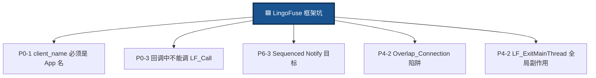

### 1.2 Python 服务端层

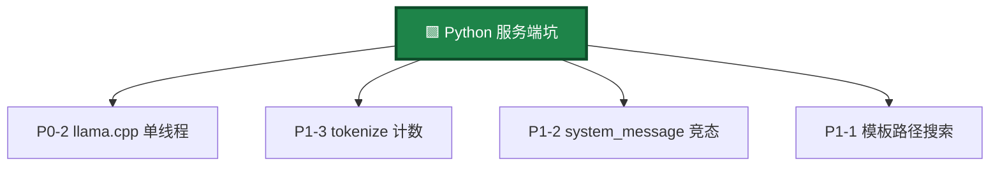

### 1.3 llm_proxy 传输层

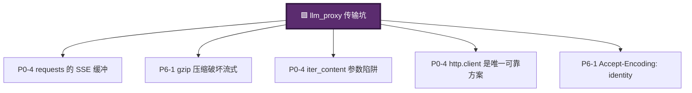

### 1.4 LTB 服务端工具执行层

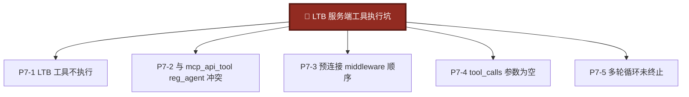

### 1.5 多模态转发层（P8 系列）

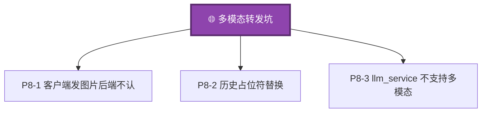

### 1.6 Structured Output 层（P9 系列）

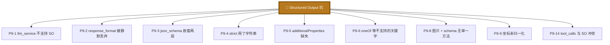

### 1.7 Z.Json 使用层（P10 系列）

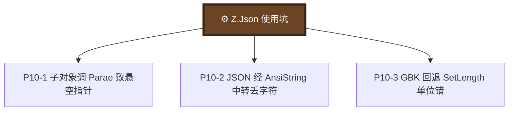

### 1.8 Pascal 客户端层

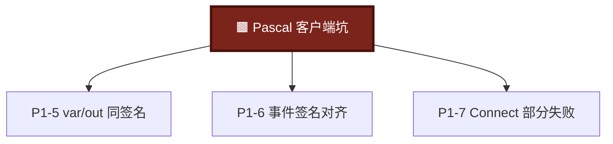

### 1.9 跨语言协议与 GUI 层

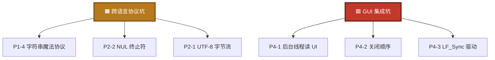

---

## 二、🔴 致命坑（必须避免）

### P0-1. **`client_name` 必须是真实注册的 App 名**

**症状**：服务端刷屏 `no found app("interactive") api("llm_stream")`，客户端永远收不到任何消息，`finish_event` 永不置位。

**根因**：LLM 客户端的 `client_name` **不是**人可读的标签，而是 **LingoFuse 网络上真实存在的 App 名**。服务端通过 `LF_Sequenced_Notify(client_name, ...)` 推消息时，名字不存在则消息被丢弃。

**正确做法**：

```python
LF_PrepareClient(endpoint, nil)
LF_PrepareDone()
client_name = generate_app_name()
app = App(client_name)
app.register_notify("llm_stream", on_stream)
LF_BindApp(app.raw)
```

**AI 检索关键词**：`client_name`、`generate_app_name`、`no found app`、`Sequenced_Notify`。

---

### P0-2. **llama.cpp 上下文不是线程安全的**

**症状**：双开客户端时会话串台；推理中途进程突然 abort；`GGML_ASSERT` 崩溃。

**根因**：`llama_cpp.Llama` 内部的 `llama_context`（KV cache、采样器 RNG、tokenizer BPE）是**单线程状态机**。

**正确做法**：所有推理串行化到单 worker 线程，回调线程只入队。

```python
self._request_queue = queue.Queue()
self._worker_thread = threading.Thread(target=self._worker_loop)
self._worker_thread.start()

def handle_request(data):
    self._request_queue.put_nowait(task)
```

**AI 检索关键词**：`llama.cpp`、`线程安全`、`KV cache`、`worker thread`。

---

### P0-3. **回调中不能调用阻塞 LingoFuse 函数**

**症状**：回调里调 `LF_Call` / `LF_LocalCall` / `LF_PrepareDone` → 死锁。

**根因**：LingoFuse 回调在库内部线程池执行，回调期间持有内部锁。再调阻塞函数会尝试获取另一把锁。

**正确做法**：回调入队到工作线程，立即返回。

**AI 检索关键词**：`callback`、`deadlock`、`LF_Call`、回调阻塞。

---

### P0-4. **`requests` 的 SSE 响应缓冲（流式延迟的元凶）**

**症状**：转发流式输出延迟几秒甚至十几秒；`iter_lines()` / `iter_content(chunk_size=None)` / `iter_content(chunk_size=1)` / `Accept-Encoding: identity` **全部无效**。

**根因**：四层叠加——`iter_lines` 缓冲 512 字节；`iter_content(chunk_size=None)` 语义是"读到 EOF"；`urllib3` 层有内部预读；gzip 压缩需要攒够完整 deflate 块。

**正确做法**：换用 `http.client`。

```python
conn.putrequest("POST", parsed.path, skip_accept_encoding=True)
conn.putheader("Accept-Encoding", "identity")
conn.endheaders()
conn.send(body)
resp = conn.getresponse()
for raw_line in resp:
    ...
```

**AI 检索关键词**：`SSE buffering`、`iter_lines`、`iter_content`、`http.client`。

---

### P0-5. **LLM 服务进程立即退出**

**症状**：启动日志显示 API 注册成功，然后立刻 `Clean Framework`。

**根因**：`main()` 里 `service.start()` 不阻塞，启动完直接进入 `finally` 调用 `service.stop()`。

**正确做法**：`_SHUTDOWN = threading.Event()`，主循环 `while not _SHUTDOWN.wait(timeout=1.0): pass`。

**AI 检索关键词**：`服务进程退出`、`SIGINT`、`main loop`、`atexit`。

---

### P0-6. **thinking 阶段被误认为"网络延迟"**

**症状**：客户端发送"你好"后 17 秒内无输出，17 秒后突然一次性显示完整正文。

**根因**：Reasoning 模型在 SSE 流里同时输出 `reasoning_content` 和 `content`，代理只转发 `content` 就看不到 thinking。

**正确做法**：两种字段都转发。

**AI 检索关键词**：`reasoning_content`、`thinking`、`Nemotron`、`DeepSeek-R1`。

---

## 三、🌉 llm_proxy / LTB 传输专项坑

### P6-1. **`Accept-Encoding: identity` 必须显式设置**

**症状**：即使换用 `http.client`，某些后端仍返回 gzip 压缩的 SSE。

**根因**：HTTP 客户端默认发送 `Accept-Encoding: gzip, deflate`。

**正确做法**：`http.client.putrequest()` 传 `skip_accept_encoding=True`，并显式加 `Accept-Encoding: identity`。

**AI 检索关键词**：`Accept-Encoding`、`gzip`、`identity`、`SSE compression`。

---

### P6-2. **`TCP_NODELAY` 优化**

**症状**：偶尔有 40ms 级别的抖动。

**根因**：Nagle 算法合并小包。

**正确做法**：连接建立后 `conn.sock.setsockopt(socket.IPPROTO_TCP, socket.TCP_NODELAY, 1)`。

**AI 检索关键词**：`TCP_NODELAY`、`Nagle`、`SSE latency`。

---

### P6-3. **`llm_proxy` / LTB 中的 `set_system_message` 必须显式返回 unsupported**

**症状**：客户端调用 `set_system_message` 收到 `{"code": 0}` 但实际未生效。

**根因**：`llm_proxy.py` 是无状态转发器，没有全局 state。

**正确做法**：明确返回 `{"code": -1, "status": "unsupported", "error": "..."}`。

**AI 检索关键词**：`set_system_message`、`unsupported`、`stateless`。

---

### P6-4. **会话过滤：`FActiveSessionId` 必须生效**

**症状**：多会话串台。

**根因**：所有会话的流式消息通过同一个 `llm_stream` API 推送，客户端不按 `session_id` 过滤。

**正确做法**：所有 `Do_LLM_*` 事件处理器里先做会话过滤。

**AI 检索关键词**：`FActiveSessionId`、`session_id filter`、`cross-session`。

---

## 四、🔴 LTB 专项坑（llm_proxy_tool）

### P7-1. **LTB 启动了但工具不执行**

**症状**：LTB 正常启动，客户端也能收流式回复，但工具**根本没被执行**。

**根因**（四种可能）：`--no-tools` 被关闭；`language_middleware` 导入失败；信标未启动；工具提供者未启动。

**正确做法**：确认启动命令**没有** `--no-tools`；观察日志里是否有 `8 tool(s) cached`；按**信标 → 工具提供者 → LTB** 顺序启动；工具变化后重启 LTB。

**AI 检索关键词**：`LTB`、`--enable-tools`、`tool(s) cached`、`信标未启动`。

---

### P7-2. **LTB 与 mcp_api_tool 同时启动冲突**

**症状**：路径 A 和路径 B 想同时跑，只有一方能正常拉取工具。

**根因**：二者都需要在信标上注册"注册代理应用"，用同一个 `reg_agent` 名字时无法区分。

**正确做法**：保持默认——`mcp_api_tool` 用 `reg_agent`，`llm_proxy_tool` 用 `llm_proxy_agent`。**不要修改**。

**AI 检索关键词**：`reg_agent`、`llm_proxy_agent`、`application mismatch`。

---

### P7-3. **LTB 启动时报 `LF_PrepareDone returned 0`，工具缓存永久失效**

**症状**：LTB 启动时打印 `Connection failed: LF_PrepareDone failed`，之后无论怎么重试都不恢复。

**根因**：`LF_PrepareDone()` 在同一个进程内**只有第一次返回 1**。`Server.start()` 内部会调用它，`language_middleware._connect()` 也会调用它。如果 `Server.start()` 先执行，后者会失败。

**正确做法**：LTB 必须在 `Server.start()` **之前**预连接 middleware。

**AI 检索关键词**：`LF_PrepareDone returned 0`、`pre-connect`、`Server.start`、`一次性`。

---

### P7-4. **LTB 收到的 `tool_calls` 参数为空 `{}`**

**症状**：`tool_calls` 解析出来但 `arguments` 是空字符串。

**根因**：OpenAI SSE 中 `tool_calls` 是**分片到达**的，`arguments` 需要按 `index` 累加字符串。

**正确做法**：用 `tool_calls_acc: Dict[int, ...]` 按 `index` 累加 `arguments` 字符串。

**AI 检索关键词**：`tool_calls`、`arguments`、`分片`、`index`、`SSE 聚合`。

---

### P7-5. **LTB 多轮 tool_calls 循环未终止**

**症状**：客户端发起一次 `generate`，LTB 陷入无限循环。

**根因**：Reasoning 模型可能连续调用工具几十次而不产出最终文本。

**正确做法**：LTB 内置多重上限：`--max-tool-rounds`（默认 100）、`--max-total-tool-calls`（默认 50）、`--max-tools-per-round`（默认 10）、最后一轮不带 tools。

**AI 检索关键词**：`max_tool_rounds`、`max_total_tool_calls`、`无限循环`。

---

## 五、🌐 多模态转发坑（v3 新增 · P8 系列）

### P8-1. **客户端发图片但后端不认**

**症状**：请求已转发，但后端回复"我没看到图片"。

**根因**：后端不是 VLM；`--backend-model` 未指向 VLM；`attachments` 组装错误。

**正确做法**：显式指定 VLM 模型。

```powershell
.\llm_proxy_tool.exe `
  --backend-url http://127.0.0.1:1234/v1 `
  --backend-model "qwen2-vl-7b-instruct" `
  --mcp-reg-agent-app llm_proxy_agent
```

**AI 检索关键词**：`多模态`、`图片不认`、`VLM`、`--backend-model`。

---

### P8-2. **多模态内容在工具链循环中被重复发送**

**症状**：LTB 工具循环时，图片附件在每一轮都被重新发送到后端，token 消耗爆炸。

**根因**：多模态内容未做历史替换。

**正确做法**：首轮发送完整多模态内容，后续轮次使用**历史占位符**（如 `[image: chart.png]`）。

**AI 检索关键词**：`多模态`、`工具循环`、`token 爆炸`、`历史占位符`。

---

### P8-3. **`llm_service` 不支持多模态（明确边界）**

**症状**：客户端把图片附件发给 `llm_service`，服务端完全不处理。

**根因**：`llm_service` 加载的是本地 GGUF 文本模型，不支持 VLM 路径。

**正确做法**：改用 `llm_proxy` / `llm_proxy_tool`。

**AI 检索关键词**：`多模态`、`llm_service`、`VLM`、`不支持`。

---

## 六、🎯 Structured Output 坑（v3.10 新增 · P9 系列）

> **能力边界速查**：
>
> | 服务端 | 是否支持 SO |
> |--------|:----------:|
> | `llm_service` | ❌ 不支持 |
> | `llm_proxy` | ✅ 支持 |
> | `llm_proxy_tool` | ✅ 支持 |

### P9-1. **`llm_service` 不支持 Structured Output**

**症状**：返回 `code: 0` 但模型回复自由文本。

**根因**：`llm_service` 本地推理路径不转发 `options.response_format`。

**正确做法**：用 `llm_proxy` / LTB + LM Studio 等后端。

**AI 检索关键词**：`Structured Output`、`llm_service`、`response_format 不生效`。

---

### P9-2. **`response_format` 被代理层静默丢弃**

**症状**：后端日志**根本没有** `response_format` 字段。

**根因**：代理层的 `sanitize_options` 使用白名单，旧版本（v3.1 之前）未包含 `response_format`。

**正确做法**：确认 v3.2+ 的 `sanitize_options` 已加入 `response_format`；确认 `sse_client.py` 的 `_FORWARDED_PASSTHROUGH_KEYS` 包含它；观察 DEBUG 日志里 `response_format=yes`。

**AI 检索关键词**：`response_format 被丢弃`、`sanitize_options`、`_FORWARDED_PASSTHROUGH_KEYS`。

---

### P9-3. **`json_schema` 嵌套了两层**

**症状**：后端返回 400，错误含 `unrecognized type json_schema`。

**根因**：`response_format` 里 `json_schema` 只应有一层。

**正确做法**：用 SDK 高层方法（`GenerateWithImageFileAndSchema` / `GenerateWithJsonSchema`），SDK 内部会正确组装。

**AI 检索关键词**：`unrecognized type json_schema`、`json_schema 嵌套`。

---

### P9-4. **`strict` 用了字符串而非布尔值**

**症状**：严格模式不生效。

**根因**：`"strict": "true"` 而非 `"strict": true`。

**正确做法**：用 SDK 的 `AStrict: boolean` 参数。

**AI 检索关键词**：`strict 字符串`、`严格模式不生效`。

---

### P9-5. **`additionalProperties: false` 缺失**

**症状**：模型返回 schema 之外的额外字段。

**根因**：严格模式要求每个 object 都显式声明 `additionalProperties: false`。

**正确做法**：**每个** object schema 都要加，包括嵌套。

**AI 检索关键词**：`additionalProperties`、`严格模式`、`额外字段`。

---

### P9-6. **`required` 列表不完整，模型省略字段**

**症状**：模型返回的 JSON 里缺少某些字段。

**根因**：未列入 `required` 的字段都是可选的。

**正确做法**：所有想要模型输出的字段都必须列入 `required`。

**AI 检索关键词**：`required`、`字段缺失`、`必填字段`。

---

### P9-7. **使用了不支持的关键字导致后端 400**

**症状**：错误含 `unsupported keyword`、`oneOf is not supported`。

**根因**：OpenAI Structured Outputs 只支持 JSON Schema 子集，**不支持** `oneOf` / `allOf` / `not` / `if` / `then` / `else` / `patternProperties` / `minProperties` / `maxProperties` / `propertyNames` / `dependencies` / `unevaluatedProperties`。

**正确做法**：用 `anyOf` 替代 `oneOf`；用 `enum` 限定取值；简化 schema；拆成多次请求。

**AI 检索关键词**：`oneOf`、`allOf`、`not`、`unsupported keyword`。

---

### P9-8. **图片 + schema 组合场景没有单一方法（v3.10 之前）**

**症状**：v3.9 及更早的 SDK 没有单一方法发送"图片 + schema"。

**正确做法**：升级到 SDK v3.10，用 `GenerateWithImageFileAndSchema` 或 `GenerateWithAttachmentsAndSchema`。**不要手写组合请求**。

**AI 检索关键词**：`图片 + schema`、`GenerateWithImageFileAndSchema`、`v3.10`。

---

### P9-9. **坐标未归一化 / 顺序错误 / 上下颠倒**

**症状**：`bbox` 数值和图像中物体的实际位置不符。

**根因**：模型输出像素坐标而非归一化；坐标顺序错误；上下颠倒。

**正确做法**：schema 里加 `minimum: 0, maximum: 1`；提示词里明确约定格式；用单目标测试图验证；客户端做归一化兼容。

**AI 检索关键词**：`bbox 坐标`、`归一化`、`坐标顺序`、`坐标颠倒`。

---

### P9-10. **`confidence` 输出超出 `0~1` 范围**

**症状**：模型返回 `confidence: 95` 而不是 `0.95`。

**正确做法**：schema 加 `description` 明确；提示词里明确；客户端做兼容。

**AI 检索关键词**：`confidence 超界`、`置信度百分数`。

---

### P9-11. **schema 太复杂导致编译失败或超时**

**症状**：后端 500 或超时，错误含 `schema compilation failed`。

**根因**：JSON Schema 编译成有限状态机，太复杂会指数爆炸。

**正确做法**：嵌套深度 ≤ 5 层；字段总数 ≤ 50；`enum` 数量 ≤ 100；避免递归引用；拆成多次请求。

**AI 检索关键词**：`schema 太复杂`、`编译失败`、`嵌套深度`。

---

### P9-12. **后端版本过旧，不支持 Structured Outputs**

**症状**：后端 400 或直接忽略 `response_format`。

**版本要求**：LM Studio 0.3.0+ / Ollama 0.3.0+ / vLLM 0.6.0+。

**AI 检索关键词**：`后端版本`、`LM Studio 0.3.0`、`Ollama 0.3.0`。

---

### P9-13. **模型不支持 Structured Outputs**

**症状**：后端版本正确、schema 结构也对，但模型仍返回纯文本。

**根因**：不是所有模型都支持 Structured Outputs。参数量 **≥ 7B**、经专门训练、Chat 格式模型。

**推荐模型**：Qwen2.5 (7B+) / Qwen2.5-VL / Nemotron Omni / GPT-4o / Claude 3.5。

**AI 检索关键词**：`模型不支持`、`参数量`、`Qwen2.5-VL`、`7B`。

---

### P9-14. **`tool_calls` 与 `response_format` 冲突（LTB 场景）**

**症状**：LTB 内部多轮工具调用时，模型始终不返回 `tool_calls`。

**根因**：`response_format` 与 `tools` 是竞争关系。

**正确做法**：**检测器 + 工具分开调用**（推荐）；或不用工具时纯 SO；或在 schema 里包含 `tool_call` 字段。

**AI 检索关键词**：`tool_calls 冲突`、`response_format 与 tools`。

---

### P9-15. **多轮工具循环中 `response_format` 未清除，模型无法返回 `tool_calls`**

**症状**：LTB 第一轮能返回 `tool_calls`，第二轮开始始终返回纯 JSON。

**根因**：`options.response_format` 被每轮都原样转发。

**正确策略**（未来改进方向）：只在最后一轮加 `response_format`。

**当前变通方法**：方法 1：不用工具用 SO（`--no-tools`）；方法 2：不用 SO 用工具；方法 3：**分开两次调用**（推荐）。

**AI 检索关键词**：`工具链 response_format 冲突`、`多轮循环不带 SO`。

---

## 七、🟠 Python 服务端坑

### P1-1. **Chat template 搜索路径与脚本位置不一致**

v3 起已移除自动搜索，只支持显式 `--chat-template`。

### P1-2. **`system_message` 竞态**

在请求入口 snapshot：

```python
with self._system_message_lock:
    system_message_snapshot = self._system_message
session = Session(..., system_message_snapshot=system_message_snapshot)
```

### P1-3. **上下文 token 预算算错**

精确 token 计数：

```python
input_tokens = len(llm.tokenize(full_input.encode("utf-8"), add_bos=False, special=True))
sys_tokens   = len(llm.tokenize(system.encode("utf-8"), add_bos=False, special=True))
total_needed = input_tokens + sys_tokens + max_tokens + 32
if total_needed > n_ctx:
    return {"code": -1, "error": f"Request too large: ..."}
```

### P1-4. **字符串魔法协议**

v1.0 的 `chunk == "__FINISH__"` 不可扩展。v3 用结构化协议：

```json
{"type": "chunk",  "session_id": "...", "text": "..."}
{"type": "think",  "session_id": "...", "text": "..."}
{"type": "finish", "session_id": "...", "reason": "stop"}
{"type": "error",  "session_id": "...", "message": "..."}
{"type": "closed", "session_id": "...", "reason": "timeout"}
```

### P1-5. **FPC 下 `var` 和 `out` 签名冲突**

FPC 在重载决议时 `var` 和 `out` 编码为相同的引用传递类别。**合并为一个用 `var`**，或另取名字。

### P1-6. **事件签名必须严格对齐**

```pascal
TLLMChunkEvent = procedure(const SessionId, Text: string) of object;
procedure Do_LLM_Chunk(const SessionId, Chunk: string);
```

### P1-7. **`Connect` 部分失败导致资源泄漏**

```pascal
procedure CleanupPartialConnect(AExitMainThread: boolean);
begin
  if FApp <> nil then
  begin
    FApp.Free;
    FApp := nil;
  end;
  if AExitMainThread and FPrepared then
    LF.ExitMainThread;
  FPrepared := False;
  FConnected := False;
end;
```

---

## 八、🟡 编码相关坑

### P2-1. **JSON 经 `string` 中转导致中文乱码**

全程走 `TBytes`：

```pascal
reqBytes := joReq.ToBytes;
LF_WriteStringBytes(hnd, reqBytes);
LF_ReadStringBytes(res, respBytes);
joResp.Parae(respBytes);
```

### P2-2. **NUL 终止符在不同语言间不一致**

跨语言约定 `\0` 是终止符；HTTP 桥接进出各处理一次。

### P2-3. **Windows 控制台 emoji 显示为 `?` 或乱码**

```python
def _setup_console_encoding():
    if sys.platform == "win32":
        try:
            import ctypes
            kernel32 = ctypes.windll.kernel32
            for handle_id in (-11, -12):
                h = kernel32.GetStdHandle(handle_id)
                if not h or h == -1: continue
                mode = ctypes.c_uint32()
                if kernel32.GetConsoleMode(h, ctypes.byref(mode)):
                    kernel32.SetConsoleMode(h, mode.value | 0x0001 | 0x0004)
            kernel32.SetConsoleOutputCP(65001)
            kernel32.SetConsoleCP(65001)
        except Exception:
            pass
    for name in ("stdout", "stderr", "stdin"):
        stream = getattr(sys, name, None)
        if stream is None: continue
        try:
            stream.reconfigure(encoding="utf-8", errors="replace")
        except Exception:
            pass
```

---

## 九、🟠 多会话 / 生命周期坑

### P3-1. **Watchdog 误杀正在生成的会话**

从 `last_active_at` 计时，只回收 idle 状态的会话。

### P3-2. **一次性会话 vs 持久会话的混淆**

v3.0 是"持久化"模式，会话跨多次 `generate` 存在。`options.ephemeral=true` 兼容一次性。

### P3-3. **过期 `session_id` 未自动清理**

服务端返回 `Session not found` 时自动清空 `FCurrentSessionId`。

---

## 十、🟡 GUI 集成坑

### P4-1. **后台线程直接读 UI 控件**

主线程先抓值，再传给后台线程：

```pascal
procedure TForm.conn_ButtonClick(Sender: TObject);
var
  AppName, Endpoint: string;
begin
  AppName  := llm_APP_Edit.Text;
  Endpoint := LLM_Service_Edit.Text;
  TCompute.RunM_NP(
    procedure begin Do_Thread_Connect(AppName, Endpoint); end
  );
end;
```

### P4-2. **窗口关闭顺序错误**

```pascal
procedure TForm.FormClose(...);
begin
  CloseAction := caFree;
  if LLM <> nil then
  begin
    LLM.Disconnect;
    disposeObjectAndNil(LLM);
  end;
  LF_Shutdown;
end;
```

### P4-3. **`RegisterNotifySync` 依赖外部 `LF_Sync` 驱动**

Timer 周期 10~50ms，主循环调 `Check_Soft_Thread_Synchronize(0)` 和 `LF_Sync`。

### P4-4. **连接失败后按钮永久禁用**

失败时也 Sync 回主线程恢复 UI。

### P4-5. **`new_session` 按钮必须携带 system_message**

`llm_proxy` 模式（无状态转发）下，修改 system prompt 的唯一有效路径是 `create_session(system_message=...)`。

### P4-6. **`set_system_message` 失败的温和处理**

当作可选步骤，失败只打印提示，不要当作连接失败。

### P4-7. **GUI 结构化输出面板的常见误用**

- 误用 1：连接的还是 `llm_service`，SO 不生效。
- 误用 2：SDK 版本过旧（v3.9 及更早），没有组合方法。
- 误用 3：`SchemaMemo` 里填了"外层 envelope"而不是"schema 本体"。

**GUI workflow（v3.4）**：

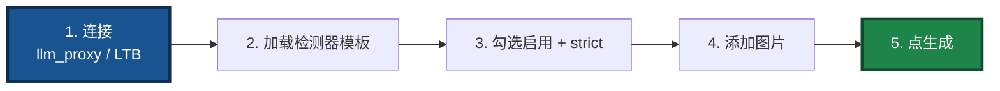

**底层自动分流**（`DoGenerateWithCurrentSettings`）：

| 有 schema | 有附件 | 走的 API |
|:---------:|:------:|---------|
| ✅ | ✅ | `GenerateWithAttachmentsAndSchema` |
| ✅ | ❌ | `GenerateWithJsonSchema` |
| ❌ | ✅ | `GenerateWithAttachments` |
| ❌ | ❌ | `Generate` |

---

## 十一、🟡 递归 / 边界坑

### P5-1. **递归追加输出可能栈溢出**

改循环：无论多少换行，栈深度始终为 1。

### P5-2. **`OnLLMStream` 未检查 buffer 有效性**

```pascal
if Input_ = nil then Exit;
buf := LF_GetBuffer(Input_);
sz  := LF_GetSize(Input_);
if (buf = nil) or (sz <= 0) then Exit;
jstr.ReadUTF8AnsiChar(buf, sz);
```

---

## 十二、⚙️ Z.Json 使用坑（v3.11 新增 · P10 系列）

### P10-1. 🔴 **对 `TZ_JsonObject` 子对象调用 `Parae` 导致父对象悬空指针**

**症状**：

- 调用 `BuildSchemaResponseFormatJson` / `GenerateStructured` / `SendGenerateCombined` 时**随机崩溃**（访问冲突）
- 或返回的 JSON 里 `options.response_format` **字段丢失**，服务端收到 `{}`
- 或不崩溃但 `schema` 字段内容是 `null`
- 错误可能延迟出现——在 `ToBytes` 序列化时才崩

**根因**：

`TZ_JsonObject` 是**树形容器**。子对象的 `FInstance` 是**指向父对象底层 `TJSONObject` 树中某个节点的指针**。`Parae` 内部执行 `DisposeObjectAndNil(FInstance)` 后创建全新对象，导致：

- 父对象底层树中留下**悬空指针**
- 新 `FInstance` **没有挂接回父树**

**反面示例**：

```pascal
// ❌ 错误：对子对象调用 Parae
joJsonSchema := joRoot.O['json_schema'];
joJsonSchema.O['schema'].Parae(ASchemaJsonBytes);   // 破坏 joRoot 的底层树
AResponseFormatJsonBytes := joRoot.ToBytes;         // 崩溃或丢字段
```

**正确做法**：

在独立根对象上解析，得到紧凑 JSON 字符串，再通过**字符串拼接**注入：

```pascal
// Step 1: 在独立根对象上解析 schema
joSchema := TZ_JsonObject.Create;
try
  if not joSchema.Parae(ASchemaJsonBytes) then ...;
  schemaJson := joSchema.ToJSONString(False);
finally
  DisposeObject(joSchema);
end;

// Step 2: 用 TZ_JsonObject 生成 name/strict 片段
joNameStrict := TZ_JsonObject.Create;
try
  joNameStrict.S['name'] := ASchemaName;
  joNameStrict.B['strict'] := AStrict;
  nameStrictJson := joNameStrict.ToJSONString(False);
finally
  DisposeObject(joNameStrict);
end;

// Step 3: 在 Unicode 空间拼接
```

**通用规则**：

| 操作 | 允许对象 | 禁止对象 |
|------|---------|---------|
| `Parae(TBytes)` | ✅ 根对象 | ❌ 任何子对象 / 孙对象 |
| `Assign(source)` | ✅ 目标为根对象 | ❌ 目标为子对象 |
| `LoadFromStream` | ✅ 目标为根对象 | ❌ 目标为子对象 |
| `S[...]` / `I[...]` / `B[...]` | ✅ 任意对象 | — |
| `O[...]` / `A[...]`（写字段） | ✅ 任意对象 | — |

**审计方法**：

- 搜索 `<child>.Parae(` → 一定是 bug
- 搜索 `<child>.Assign(` → 一定是 bug
- 搜索 `<child>.LoadFromStream` → 一定是 bug

**AI 检索关键词**：`Parae on child`、`悬空指针`、`dangling pointer`、`FInstance`、`Z.Json`、`ToBytes 崩溃`。

---

### P10-2. 🟠 **JSON 组装经 AnsiString 中转导致非 ASCII 字符丢失**

**症状**：

- Schema 里含 emoji / 韩文 / 生僻字 → 到达服务端时变成 `?` 或乱码
- **只在 Windows + FPC** 下出错，Linux / macOS 下正常
- 只在 `DefaultSystemCodePage ≠ CP_UTF8` 时出错

**根因**：

`TZ_JsonString.Text` 返回 **`USystemString`**（在 FPC 下是 `UnicodeString`）。若把它赋给 `string` 变量（在 FPC Delphi mode 下是 `AnsiString`），会走**系统代码页转换**——在中文 Windows（CP936）下，emoji、韩文等无法表示的字符会变成 `?`。

**反面示例**：

```pascal
// ❌ 错误：中间变量用 string（AnsiString）
var
  schemaJson, reqJsonStr: string;
begin
  schemaJson := joSchema.ToJSONString(False).Text;   // 非 ASCII 字符丢失
  reqBytes := TEncoding.UTF8.GetBytes(reqJsonStr);   // 再走一遍系统代码页
end;
```

**正确做法**：

**全程在 Unicode 空间拼接**，用 `TZ_JsonString` 作为中间容器，**最后一步**用 `.Bytes` 转 UTF-8：

```pascal
// ✅ 正确
var
  schemaJson, reqJson: TZ_JsonString;
  tmpReq: USystemString;
begin
  schemaJson := joSchema.ToJSONString(False);
  reqJson := joReq.ToJSONString(False);

  tmpReq := reqJson.Text;
  SetLength(tmpReq, Length(tmpReq) - 1);
  reqJson.Text := tmpReq + ',"options":{"response_format":' + schemaJson.Text + '}}';

  reqBytes := reqJson.Bytes;
end;
```

**命名规范**：

| 用途 | 推荐类型 | 避免类型 |
|------|---------|---------|
| JSON 中间容器 | `TZ_JsonString` | `string` |
| 短 ASCII 字段 | `string` 可接受 | — |
| 面向 UI 的显示字符串 | `string` 可接受 | — |
| 字节流 | `TBytes` | — |

**AI 检索关键词**：`AnsiString 中转`、`非 ASCII 丢失`、`emoji 丢失`、`CP936`、`TZ_JsonString`。

---

### P10-3. 🟡 **`GenerateWithTextFile` GBK 回退的 `SetLength` 单位错误**

**症状**：打开非 UTF-8、非 GBK 编码的文本文件（如 Latin-1、Shift-JIS）时输出乱码，或只显示前一半内容。

**根因**：UTF-8 和 GBK 都解码失败后走"Latin-1 兜底"。原实现用 `string`（AnsiString）配合 `SetLength` 和 `Move`，字节单位与 UTF-16 容器混用。

**正确做法**：`Decoded` 声明为 `USystemString`，用 `for` 循环逐字节映射为 `WideChar`：

```pascal
var
  Decoded: USystemString;
  i: integer;
begin
  try
    Decoded := TEncoding.UTF8.GetString(rawBytes);
  except
    try
      Decoded := TEncoding.GetEncoding(936).GetString(rawBytes);
    except
      SetLength(Decoded, Length(rawBytes));
      for i := 0 to Length(rawBytes) - 1 do
        Decoded[i + 1] := WideChar(rawBytes[i]);
    end;
  end;
end;
```

**AI 检索关键词**：`GBK 回退`、`Latin-1 兜底`、`SetLength 单位`、`USystemString`。

---

## 十三、坑的优先级（分组视图）

原文档使用 `quadrantChart` 呈现优先级矩阵，但该语法在多数 Mermaid 版本中兼容性不佳。这里改用**分组表格**呈现。

### 13.1 🔴 立即防御（易踩 + 后果严重）

| 坑 | 易踩 | 后果 |
|----|:----:|:----:|
| P0-1 client_name 错误 | ★★★★★ | ★★★★★ |
| P0-4 SSE 缓冲 | ★★★★☆ | ★★★★★ |
| P0-5 服务进程退出 | ★★★★☆ | ★★★★★ |
| P7-1 LTB 工具不执行 | ★★★★☆ | ★★★★★ |
| P7-3 LTB 预连接顺序 | ★★★★☆ | ★★★★★ |
| P10-1 子对象 Parae | ★★★★☆ | ★★★★★ |
| P9-1 llm_service 不支持 SO | ★★★★☆ | ★★★★☆ |

### 13.2 🟠 高优先级（后果严重）

| 坑 | 说明 |
|----|------|
| P0-2 llama.cpp 线程 | 会话串台、进程崩溃 |
| P0-3 回调中阻塞 | 死锁 |
| P0-6 thinking 混淆 | 用户以为卡死 |
| P6-1 gzip 压缩 | 破坏流式 |
| P7-4 tool_calls 空 | 工具空参调用 |
| P7-5 多轮循环 | 无限循环 |
| P8-1 多模态图片不认 | 功能失效 |
| P9-2 response_format 被丢弃 | SO 静默失效 |
| P9-9 坐标未归一化 | 结果不可用 |
| P9-14 tool_calls 与 SO 冲突 | 工具链断 |
| P10-2 AnsiString 中转 | 非 ASCII 丢失 |

### 13.3 🟡 一般优先级

P1-1 ~ P1-7、P2-1 ~ P2-3、P3-1 ~ P3-3、P4-1 ~ P4-7、P5-1 ~ P5-2、P6-2 ~ P6-4、P8-2 ~ P8-3、P9-3 ~ P9-8、P9-10 ~ P9-13、P9-15、P10-3。

---

## 十四、AI 检索速查表

### 14.1 框架与传输

| 症状关键词 | 对应坑 |
|-----------|--------|
| `no found app` | P0-1 client_name 错误 |
| `GGML_ASSERT` / 崩溃 | P0-2 llama.cpp 线程 |
| 死锁 / hang | P0-3 回调阻塞 |
| **流式延迟 / 静默几秒** | **P0-4 requests SSE 缓冲** |
| **服务进程启动后立即退出** | **P0-5 主循环缺失** |
| **thinking 期间无输出** | **P0-6 reasoning_content** |
| 模板未加载 | P1-1 路径搜索 |
| 语义混乱 | P1-2 system_message 竞态 |
| `context length exceeded` | P1-3 token 预算 |
| `__FINISH__` / `__ERROR__` | P1-4 字符串魔法 |
| `3029` / `function header doesn't match` | P1-5 var/out |
| `Incompatible types` | P1-6 事件签名 |
| `FApp leak` | P1-7 Connect 部分失败 |
| 中文乱码 | P2-1 AnsiString |
| `\0` 问题 | P2-2 NUL 终止符 |
| **emoji 显示为 `?`** | **P2-3 Windows 控制台** |
| 长会话被中止 | P3-1 Watchdog |
| 历史丢失 | P3-2 持久会话 |
| `Session not found` | P3-3 过期 session_id |

### 14.2 GUI 与边界

| 症状关键词 | 对应坑 |
|-----------|--------|
| 后台线程崩 | P4-1 读 UI |
| 关闭崩溃 | P4-2 关闭顺序 |
| 输出延迟 | P4-3 LF_Sync |
| 无法重试 | P4-4 按钮禁用 |
| **新的 system prompt 不生效** | **P4-5 new_session 实现** |
| **set_system_message 报错** | **P4-6 温和失败 / P6-3** |
| **GUI 结构化输出面板误用** | **P4-7 SchemaMemo 内容** |
| 大 chunk 崩 | P5-1 递归栈溢 |
| 边界崩溃 | P5-2 buffer 空 |
| **gzip / 压缩 / Accept-Encoding** | **P6-1 identity header** |
| **40ms 抖动** | **P6-2 TCP_NODELAY** |
| **多会话串台** | **P6-4 FActiveSessionId** |

### 14.3 LTB 与多模态

| 症状关键词 | 对应坑 |
|-----------|--------|
| **LTB 启动了但工具不执行** | **P7-1 --enable-tools / 信标未启动** |
| **LTB 与 mcp_api_tool 冲突** | **P7-2 reg_agent 名字相同** |
| **LTB 报 `LF_PrepareDone returned 0`** | **P7-3 预连接顺序** |
| **LTB 收到的 `tool_calls` 参数为空 `{}`** | **P7-4 SSE 分片未按 index 聚合** |
| **LTB 多轮循环不终止** | **P7-5 多重上限未配置** |
| **🆕 客户端发图片后端不认** | **P8-1 后端非 VLM** |
| **🆕 多模态在工具循环中重复发送** | **P8-2 缺历史占位符** |
| **🆕 客户端发图片给 `llm_service`** | **P8-3 不支持多模态，改路径** |

### 14.4 Structured Output

| 症状关键词 | 对应坑 |
|-----------|--------|
| **🆕🆕 `llm_service` 不支持 SO** | **P9-1** |
| **🆕🆕 `response_format` 被静默丢弃** | **P9-2 passthrough 白名单** |
| **🆕🆕 `unrecognized type json_schema`** | **P9-3 嵌套两层** |
| **🆕🆕 `strict` 严格模式不生效** | **P9-4 字符串而非布尔** |
| **🆕🆕 `additionalProperties` 缺失** | **P9-5 每个 object 都要加** |
| **🆕🆕 模型省略必填字段** | **P9-6 required 不完整** |
| **🆕🆕 `oneOf` / `unsupported keyword`** | **P9-7 不支持的关键字** |
| **🆕🆕 图片 + schema 组合报错** | **P9-8 升级到 SDK v3.10** |
| **🆕🆕 bbox 坐标不对** | **P9-9 归一化 / 顺序 / 上下** |
| **🆕🆕 confidence 是 95 而非 0.95** | **P9-10 客户端做兼容** |
| **🆕🆕 schema 编译失败 / 超时** | **P9-11 简化 schema** |
| **🆕🆕 后端 400 但 schema 看起来对** | **P9-12 后端版本过旧** |
| **🆕🆕 返回纯文本而非 JSON** | **P9-13 模型不支持 SO** |
| **🆕🆕 LTB 有 SO 时工具不执行** | **P9-14 tool_calls 与 SO 冲突** |
| **🆕🆕 多轮工具链循环第二轮不带 SO** | **P9-15 每轮都带 SO 冲突** |

### 14.5 Z.Json 使用

| 症状关键词 | 对应坑 |
|-----------|--------|
| **🆕🆕🆕 使用 Schema 时随机崩溃 / 丢字段** | **P10-1 子对象调 Parae** |
| **🆕🆕🆕 `options.response_format` 字段丢失** | **P10-1 子对象调 Parae** |
| **🆕🆕🆕 `ToBytes` 访问冲突** | **P10-1 子对象调 Parae** |
| **🆕🆕🆕 `FInstance` 悬空指针** | **P10-1 子对象调 Parae** |
| **🆕🆕🆕 JSON 里 emoji / 韩文变 `?`** | **P10-2 AnsiString 中转** |
| **🆕🆕🆕 Windows 下 JSON 非 ASCII 丢失** | **P10-2 AnsiString 中转** |
| **🆕🆕🆕 CP936 环境下 schema 损坏** | **P10-2 AnsiString 中转** |
| **🆕🆕🆕 GBK 回退输出乱码 / 截断** | **P10-3 SetLength 单位错** |

---

## 十五、跨语言一致性检查清单

为避免单张大图过于复杂，下面用**五张小图**分别检查不同维度。

### 15.1 身份与会话

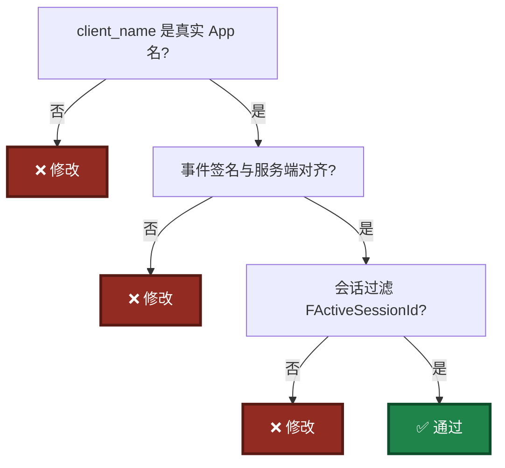

### 15.2 编码与协议

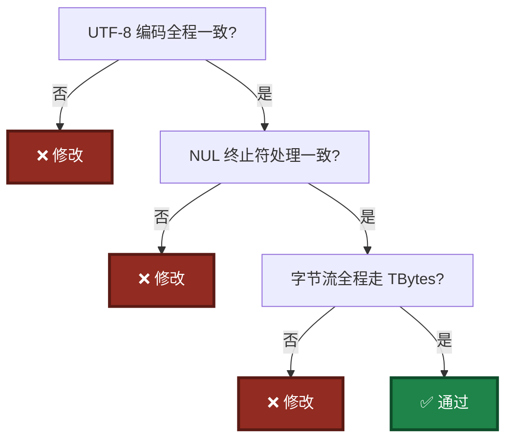

### 15.3 生命周期

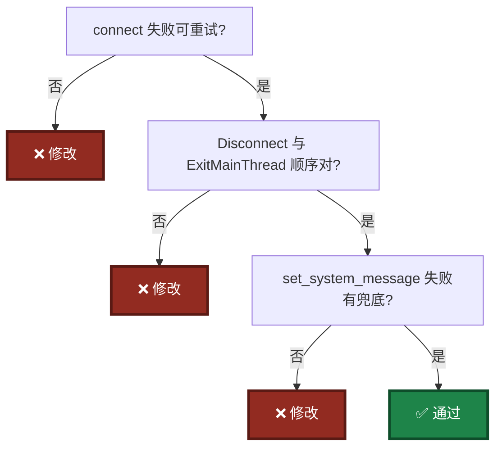

### 15.4 多模态与 Structured Output

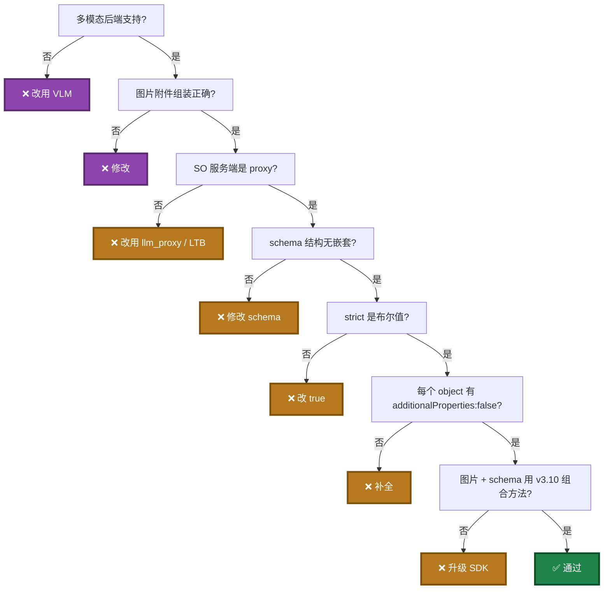

### 15.5 Z.Json 安全

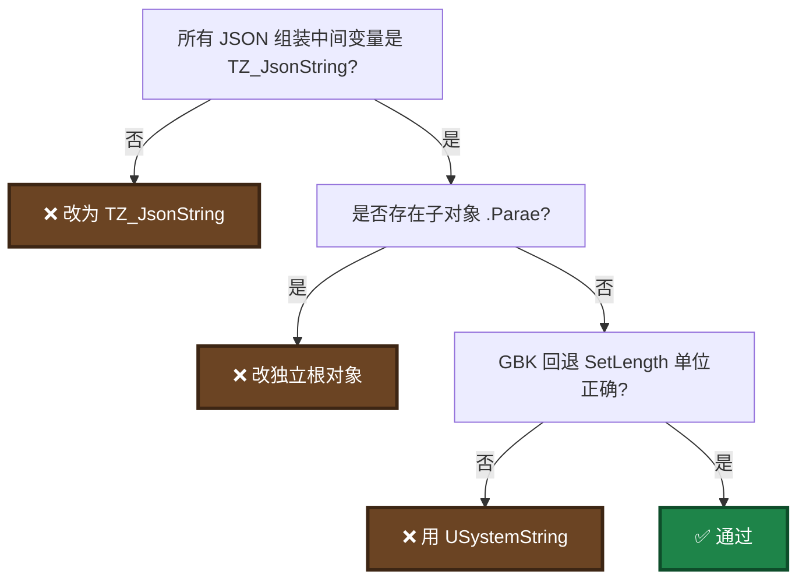

---

## 十六、四条铁律

原文档使用 `mindmap` 展示四条铁律，但该语法在多数 Mermaid 版本中兼容性不佳。这里改用**编号列表**呈现。

### 铁律一：`client_name` 是身份，不是标签

`client_name` = LingoFuse 网络路由身份，必须是 `generate_app_name()` 的返回值，不能是自定义字符串。

### 铁律二：回调要快，耗时操作入队

回调只做"读输入 + 入队 + 立即返回"，任何耗时操作都放 worker 线程。

### 铁律三：字节流是通用语言

跨语言 JSON 走 `TBytes` / `bytes`，UTF-8 全程一致，只在显示层转 `string`。

### 铁律四：`TZ_JsonObject` 是树

`Parae` / `Assign` / `LoadFromStream` **只能对根对象调用**；需要向子节点注入已解析的 JSON 时：

1. 在独立根对象上解析；
2. 取紧凑 JSON 字符串；
3. 用 `TZ_JsonString` 在 Unicode 空间拼接；
4. 最后 `.Bytes` 转 UTF-8。

---

## 十七、v3 架构变化的坑点概览

原文档使用单张大图展示版本演进，容易渲染失败。这里改用**分版本小节**呈现。

### 17.1 v2 已有坑（P0-P7）

客户端 / 服务端 / 代理、工具执行路径 A / B、跨语言编码、GUI 集成。

### 17.2 v3 新增坑（P8 系列）

- 多模态转发
- `llm_service` 不支持多模态的边界
- 历史占位符替换

### 17.3 v3.10 新增坑（P9 系列）

- Structured Output 引入
- `response_format` 转发白名单
- 图片 + schema 组合
- JSON Schema 约束

### 17.4 v3.11 新增坑（P10 系列）

- `TZ_JsonObject` 树形容器
- 子对象 `Parae` 悬空指针
- Unicode 拼接与字节转换

---

## 十八、本次工作（v3.11）修改摘要

### 18.1 修改的源文件

- `llm_client_v3.pas`（Pascal SDK，本仓库）

### 18.2 修复的崩溃级问题

| 函数 | 问题 | 修复 |
|------|------|------|
| `BuildSchemaResponseFormatJson` | 对孙对象调 `Parae`，破坏 `joRoot` 底层树 | 在独立根对象 `joSchema` 上解析，转字符串后拼接 |
| `SendGenerateCombined` | 对孙对象调 `Parae`，破坏 `joReq` 底层树 | 同上；用 `TZ_JsonString` 拼接后 `.Bytes` |
| `GenerateStructured` | 同 `SendGenerateCombined` | 同上 |

### 18.3 修复的编码边界问题

| 函数 | 问题 | 修复 |
|------|------|------|
| `BuildSchemaResponseFormatJson` | 中间变量 `string`（AnsiString）走系统代码页 | 改用 `TZ_JsonString` + `USystemString` 拼接 |
| `SendGenerateCombined` | 同上 | 同上 |
| `GenerateStructured` | 同上 | 同上 |
| `GenerateWithTextFile` | GBK 回退 `SetLength` 单位与索引语义不一致 | `Decoded` 声明为 `USystemString`，逐字节映射为 `WideChar` |

### 18.4 未改动（安全）

以下函数经审计确认**已经安全**：

- `SafeParseJson`（`AJson` 是新根）
- `HandleLLMNotify`（`jo` 是新根）
- `GetAPICapabilities`（`FCapabilities` 是新根）
- `PopulateAttachmentArray`（只用字段级 `S[...]`）
- 所有 `joReq` / `joResp` 的其他用法（子节点只读）

### 18.5 通用规则（写入项目约定）

1. `TZ_JsonObject` 的 `Parae` / `Assign` / `LoadFromStream` 只能对根对象调用。
2. 需要向子节点注入已解析的 JSON 时：在独立根对象上解析 → 取紧凑 JSON 字符串 → 用 `TZ_JsonString` 在 Unicode 空间拼接 → 最后 `.Bytes` 转 UTF-8。
3. JSON 组装的中间变量声明为 `TZ_JsonString`，绝不用 `string`。
4. 需要正确转义字段值时，仍用 `TZ_JsonObject.S[...]` 写入。
5. GBK / Latin-1 回退时，目标变量声明为 `USystemString`，逐字节映射为 `WideChar`。

### 18.6 审计清单（每次提交前自查）

- [ ] 搜索 `<对象>.Parae(`，确认 `.` 左侧对象是**根**（`Parent = nil`）
- [ ] 搜索 `<对象>.Assign(`，确认 `.` 左侧对象是**根**
- [ ] 搜索 `<对象>.LoadFromStream(`，确认 `.` 左侧对象是**根**
- [ ] 搜索 `:= ...ToJSONString(...).Text;` 后赋给 `string` 的位置，改为 `TZ_JsonString`
- [ ] 搜索 `TEncoding.UTF8.GetBytes(<非字面量 string>)`，确认其来源不受代码页影响
- [ ] 搜索 GBK / Latin-1 回退分支，确认 `SetLength` 单位与索引语义一致

---

## 十九、AI 接手建议

### 19.1 阅读顺序

按以下顺序读代码：

```mermaid
flowchart LR
    R1["1. 本文档"] --> R2["2. llm_service.py<br/>worker 线程模型"]
    R2 --> R3["3. llm_proxy.py<br/>传输层 / 无状态语义"]
    R3 --> R4["4. llm_proxy_tool.py<br/>工具循环 / 多模态转发"]
    R4 --> R5["5. llm_common/sse_client.py<br/>passthrough 白名单"]
    R5 --> R6["6. llm_client_v3.pas<br/>SO 4 个入口 / Z.Json 安全"]
    R6 --> R7["7. llm_test.py<br/>客户端交互模式"]

    style R1 fill:#922B21,stroke:#5A1A14,stroke-width:4px,color:#FFFFFF
    style R2 fill:#1A5490,stroke:#0D2F52,stroke-width:3px,color:#FFFFFF
    style R3 fill:#5B2C6F,stroke:#321640,stroke-width:3px,color:#FFFFFF
    style R4 fill:#922B21,stroke:#5A1A14,stroke-width:3px,color:#FFFFFF
    style R5 fill:#B7791F,stroke:#7E5109,stroke-width:3px,color:#FFFFFF
    style R6 fill:#6B4423,stroke:#3D2614,stroke-width:4px,color:#FFFFFF
    style R7 fill:#1E8449,stroke:#0E4D2A,stroke-width:3px,color:#FFFFFF
```

### 19.2 重点关注

1. `llm_service.py` 的 `_worker_loop` 和 `_process_task`（推理串行化）
2. `llm_proxy.py` 的 `OpenAIStreamClient.stream_chat`（http.client 流式读取）
3. `llm_proxy.py` 的 `_handle_set_system_message`（明确拒绝）
4. `llm_proxy_tool.py` 的 `LLMProxyToolService.start()`（预连接 middleware 顺序）
5. `llm_proxy_tool.py` 的 `_run_generation`（多轮 tool_calls 循环与上限）
6. `llm_proxy_tool.py` 的多模态历史占位符处理
7. `llm_common/sse_client.py` 的 `_FORWARDED_PASSTHROUGH_KEYS`
8. `llm_proxy.py` / `llm_proxy_tool.py` 的 `sanitize_options`
9. `llm_client_v3.pas` 的 `BuildSchemaResponseFormatJson` / `SendGenerateCombined` / `GenerateStructured` / `BuildImageAttachmentFromFile` / `GenerateWithTextFile`
10. Pascal 客户端的 `OnLLMStream`（协议入口）
11. Pascal 客户端的 `CleanupPartialConnect`（资源安全）
12. GUI 窗体的 `new_session_ButtonClick`（system prompt 生效入口）
13. GUI 窗体的 `DoGenerateWithCurrentSettings`（4 种组合分流）

### 19.3 不要碰（除非明确要改）

- `LF_Sequenced_Notify` 的使用方式
- `RegisterNotifySync` 的注册方式
- `TBytes` 编码路径
- `http.client` 流式读取循环
- `Accept-Encoding: identity` 与 `TCP_NODELAY`
- `LLMProxyToolService.start()` 中预连接 middleware 的**顺序**
- `_FORWARDED_PASSTHROUGH_KEYS` 中的 key 列表
- `BuildSchemaResponseFormatJson` 的 envelope 结构与 Z.Json 安全规则
- `TZ_JsonObject` 上的 `Parae` / `Assign` / `LoadFromStream` 调用对象限制

### 19.4 关键认知

- `llm_service.py` / `llm_proxy.py` / `llm_proxy_tool.py` 是**兄弟**关系
- 三者共享 Call API 面，只有 `set_system_message` 行为不同（service=支持，另两者=明确拒绝）
- 三者使用**同一个** `ipc:llm_service` 端点，**只能同时运行一个**
- `llm_proxy_tool.py` 与 `mcp_api_tool.py` **可以同时运行**（不同 `reg_agent` 名）
- **多模态**由后端决定——`llm_proxy` / LTB **原样转发**，`llm_service` **不支持**
- **Structured Output** 由后端决定——`llm_proxy` / LTB **原样转发**，`llm_service` **不支持**
- **SO 严格模式 5 要求**：`strict: true` + `additionalProperties: false` + `required` 完整 + 无嵌套 `json_schema` + 不用 `oneOf` / `allOf` / `not`
- **`TZ_JsonObject` 是树**：`Parae` / `Assign` / `LoadFromStream` **只对根对象**；JSON 组装中间变量用 `TZ_JsonString`；最后 `.Bytes` 一步转 UTF-8

---

## 二十、相关文档（同目录）

| 文档 | 说明 |
|------|------|
| [`LingoFuse_LLM_Ecosystem_User_Guide.md`](LingoFuse_LLM_Ecosystem_User_Guide.md) | 生态总览 |
| [`LingoFuse_LLM_Service_CLI_guide.md`](LingoFuse_LLM_Service_CLI_guide.md) | `llm_service.exe` 命令行手册 |
| [`LingoFuse_LLM_Proxy_CLI_Guide.md`](LingoFuse_LLM_Proxy_CLI_Guide.md) | `llm_proxy.exe` 命令行手册 |
| [`LingoFuse_LLM_Proxy_Tool_CLI_Guide.md`](LingoFuse_LLM_Proxy_Tool_CLI_Guide.md) | `llm_proxy_tool.exe`（LTB）命令行手册 |
| [`LingoFuse_LLM_Proxy_Compatibility_Guide.md`](LingoFuse_LLM_Proxy_Compatibility_Guide.md) | 支持的 250+ OpenAI 兼容后端清单 |
| [`LingoFuse_LLM_Service_Work_Summary.md`](LingoFuse_LLM_Service_Work_Summary.md) | LLM 工具链版本演进与架构决策 |
| [`llm_client_v3.md`](llm_client_v3.md) | Pascal 客户端 SDK 文档 |

### 根目录相关文档

| 文档 | 说明 |
|------|------|
| [`../Pascal_Integration_Guide.md`](../Pascal_Integration_Guide.md) | Pascal 开发者切入指南 |
| [`../NVIDIA-Nemotron-3-Nano-Omni-30B-A3B-Reasoning-UD-IQ4_XS.md`](../NVIDIA-Nemotron-3-Nano-Omni-30B-A3B-Reasoning-UD-IQ4_XS.md) | 推荐模型下载与部署 |
| [`../Structured_Output_Learning_Guide.md`](../Structured_Output_Learning_Guide.md) | Structured Output 完整学习指南 |

> **归属提醒**：`llm_client.pas`、`llm_tool_frm.pas` 等 **Pascal GUI 客户端源码**属于 **LingoFuse 核心仓库**（[github.com/PassByYou888/LingoFuse](https://github.com/PassByYou888/LingoFuse)），不在本仓库中。
>
> **`llm_client_v3.pas`**、**`llm_tool_v3_frm.pas`**、**`llm_tool_v3.lpi`** 属于**本仓库**。

---

**文档版本**：v5.1（v3 架构重写版 + Structured Output 合并版 + Z.Json 安全版；图表已拆分为多张小图 + 分组表格 + 编号列表，避免大型制图渲染问题）

**维护者**：LingoFuse-pasAgent 团队
**反馈**：问题提 Issue，急事加 Q（600585）