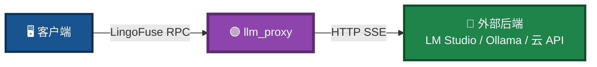
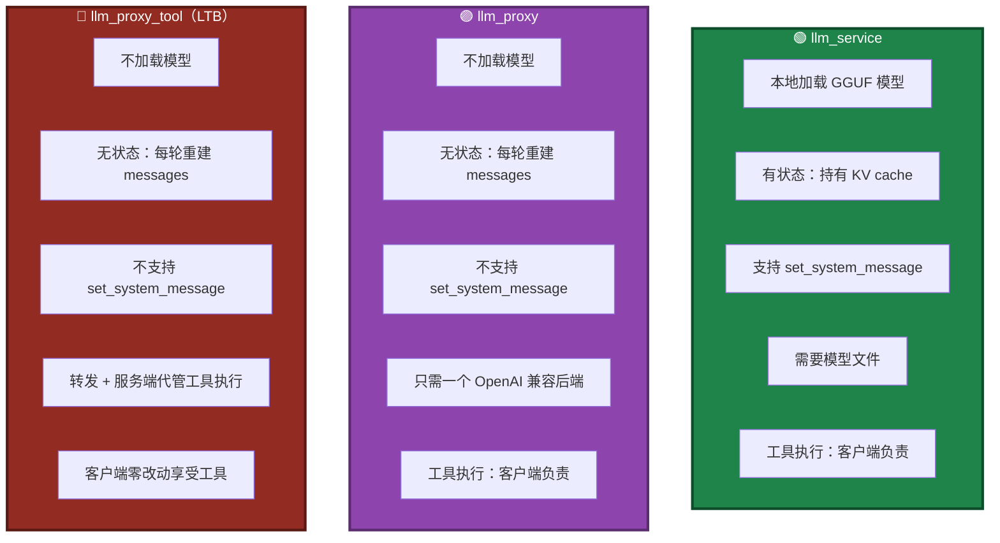
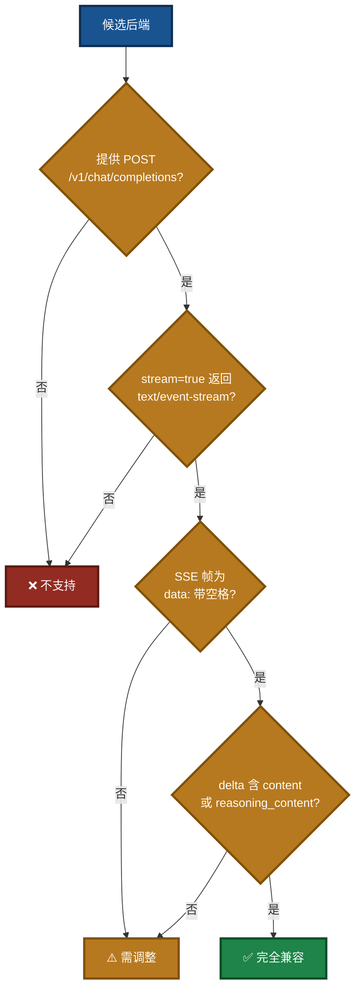
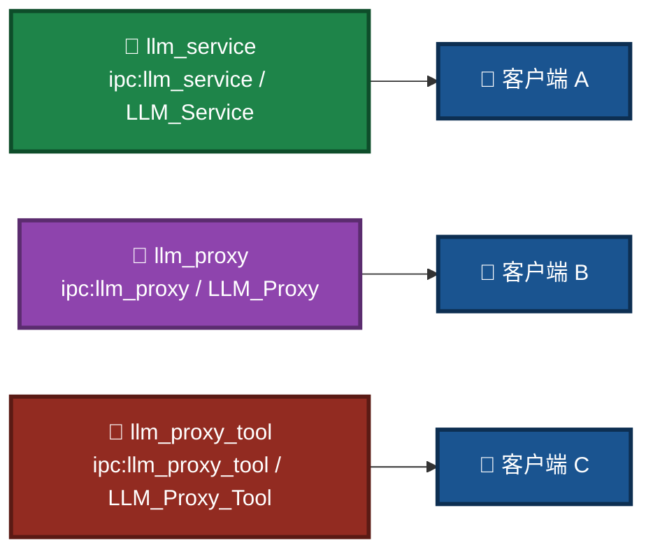

# LingoFuse LLM Proxy 命令行使用手册

> **适用程序**：`llm_proxy.exe`（Windows）/ `llm_proxy`（Linux）
> **文档版本**：v4.0（v3 架构重写版）
> **最后更新**：2026-09-17
> **相关文档**（同目录）：
> - [`LingoFuse_LLM_Ecosystem_User_Guide.md`](LingoFuse_LLM_Ecosystem_User_Guide.md) — 生态总览
> - [`LingoFuse_LLM_Proxy_Tool_CLI_Guide.md`](LingoFuse_LLM_Proxy_Tool_CLI_Guide.md) — LTB 命令行手册
> - [`LingoFuse_LLM_Service_CLI_guide.md`](LingoFuse_LLM_Service_CLI_guide.md) — 本地推理服务手册
> - [`LingoFuse_LLM_Proxy_Compatibility_Guide.md`](LingoFuse_LLM_Proxy_Compatibility_Guide.md) — 后端兼容清单
> - [`LingoFuse_LLM_Pitfalls_For_AI.md`](LingoFuse_LLM_Pitfalls_For_AI.md) — 踩坑大全
> - [`LingoFuse_LLM_Service_Work_Summary.md`](LingoFuse_LLM_Service_Work_Summary.md) — 版本演进

---

## 一、程序定位

`llm_proxy.exe` 是一个 **LingoFuse 服务端**，但它的内部逻辑与 `llm_service.exe` 完全不同：**它不加载模型，只做协议翻译**。

它把 LingoFuse 的二进制 RPC 翻译成 OpenAI 兼容的 HTTP 请求，转发给任意支持 `/v1/chat/completions` + SSE 流式的后端（LM Studio、Ollama、vLLM、DeepSeek、OpenRouter 等），再把流式响应翻译回 LingoFuse 的 Notify 事件。

它是 pasAgent 闭环中 **`llm_service.exe` 的替代方案**：当你不想在本地加载大模型，或者已经部署了 LM Studio / 云端 API 时，用 `llm_proxy.exe` 就能让 AI 客户端拥有"大脑"。

### 与 LTB（llm_proxy_tool.exe）的关系

`llm_proxy_tool.exe`（**LTB**，LLM Tool Bridge）是 `llm_proxy.exe` 的**超集**：

- **`llm_proxy.exe`**：纯文本转发。工具执行由**客户端负责**（客户端需自己支持 MCP）。
- **`llm_proxy_tool.exe`**：转发 + **服务端代管工具执行**。客户端**完全不需要**支持 MCP，只要会调 `generate` 就能享受工具能力。

二者**共享相同的 SSE 客户端实现**，因此本手册中所有关于**后端接入**（`--backend-url` / `--backend-model` / `--backend-key` / 认证头 / SSE 流解析）的说明，**对 LTB 同样适用**。

LTB 独有参数（`--mcp-*`、`--max-tool-*`、`--enable-tools` 等）见 [`LingoFuse_LLM_Proxy_Tool_CLI_Guide.md`](LingoFuse_LLM_Proxy_Tool_CLI_Guide.md)。

### 图 1：llm_proxy 在生态中的位置



**运行环境**：Windows / Linux。
**依赖**：`LingoFuse64.dll` / `liblingofuse.so`（位于系统 PATH 或 exe 同目录）。

---

## 二、三个服务端的兄弟关系

三者是**兄弟服务端**，共享同一套 Call API 面，但**不能同时运行**（默认共用同一个 endpoint 和 app 名）。

### 图 2：三种服务端对比



**能力矩阵对比**：

| API | `llm_service` | `llm_proxy` | `llm_proxy_tool`（LTB） |
|-----|:-------------:|:-----------:|:----------------------:|
| `generate` | ✅ 1 | ✅ 1 | ✅ 1 |
| `create_session` | ✅ 1 | ✅ 1 | ✅ 1 |
| `close_session` | ✅ 1 | ✅ 1 | ✅ 1 |
| `cancel_session` | ✅ 1 | ✅ 1 | ✅ 1 |
| `list_sessions` | ✅ 1 | ✅ 1 | ✅ 1 |
| **`set_system_message`** | ✅ **1** | ❌ **0** | ❌ **0** |
| `health` | ✅ 1 | ✅ 1 | ✅ 1 |
| `llm_stream` | ✅ 1 | ✅ 1 | ✅ 1 |
| **`tools`** | — | — | ✅ **1** |
| **`tool_calls`** | — | — | ✅ **1** |
| **`tool_results`** | — | — | ✅ **1** |
| **`server_kind`** | `service` | `proxy` | `proxy` |

> **共存规则**：若三者都想运行，**必须**为每个设置不同的 `--endpoint` 和 `--app-name`。详见场景 8。

---

## 三、快速开始

### 3.1 最小启动

**Windows（PowerShell）**：

```powershell
# 使用默认端点 ipc:llm_service 与默认后端 http://127.0.0.1:12345/v1
.\llm_proxy.exe
```

**Linux（Shell）**：

```bash
# 使用默认端点 ipc:llm_service 与默认后端 http://127.0.0.1:12345/v1
./llm_proxy
```

### 3.2 连接 LM Studio 本地服务器

**Windows（PowerShell）**：

```powershell
.\llm_proxy.exe --backend-url http://127.0.0.1:1234/v1
```

**Linux（Shell）**：

```bash
./llm_proxy --backend-url http://127.0.0.1:1234/v1
```

### 3.3 连接 DeepSeek 云 API

**Windows（PowerShell）**：

```powershell
.\llm_proxy.exe `
  --backend-url https://api.deepseek.com/v1 `
  --backend-key sk-xxxxxxxxxxxxxxxx `
  --backend-model deepseek-chat
```

**Linux（Shell）**：

```bash
./llm_proxy \
  --backend-url https://api.deepseek.com/v1 \
  --backend-key sk-xxxxxxxxxxxxxxxx \
  --backend-model deepseek-chat
```

### 图 3：启动后的状态横幅（示例）

启动成功后会打印一段状态横幅，然后进入监听状态：

```
======================================================================
 LINGOFUSE LLM PROXY
======================================================================
  Service kind            : proxy
  Service endpoint        : ipc:llm_service
  Service app name        : LLM_Service
  Notify API name         : llm_stream
  Backend URL             : http://127.0.0.1:1234/v1
  Backend model           : (auto-discover)
  Backend auth            : Authorization: Bearer <redacted, 9 chars>
  Backend transport       : http.client
  Session idle timeout(s) : 1800
  set_system_message      : unsupported (llm_service-only)
  Multimodal support      : 由后端决定（llm_proxy 会原样转发图片附件）
  ...
  Supported APIs          : generate, create_session, close_session, ...
  Unsupported APIs        : set_system_message
======================================================================
[INFO] LLM Proxy service 'LLM_Service' running on ipc:llm_service
[INFO] Press Ctrl+C to stop...
```

---

## 四、在线 API 接入规则（重点）

`llm_proxy` 对接在线 API 的核心机制是 **OpenAI 兼容协议 + SSE 流式**。任何在线服务，只要满足以下全部条件，即可通过 `--backend-url` 无缝接入。

### 4.1 硬性条件

| # | 条件 | 说明 |
|:-:|------|------|
| 1 | 提供 `POST /v1/chat/completions` 端点 | 路径硬编码，不支持自定义 |
| 2 | 支持 `stream=true` 并返回 `text/event-stream` | SSE 流式推送 |
| 3 | SSE 帧格式为 `data: {...}\n\n`（`data:` 后带空格） | 无空格会丢帧 |
| 4 | delta 中含 `choices[0].delta.content` 或 `reasoning_content` | 否则解析为空 |
| 5 | 不强制 gzip 压缩 | 代理已设置 `Accept-Encoding: identity` |

> **重要**：上述 5 条判据**对 LTB 同样适用**。LTB 的 `OpenAIStreamClient` 与 `llm_proxy` 完全一致。唯一的区别是：LTB 会在请求中额外注入 `tools` 字段（来自 MCP 工具列表），并要求后端能返回 `tool_calls`。

### 图 4：接入验证流程



### 4.2 认证规则

| 参数 | 作用 | 常见取值 |
|------|------|----------|
| `--backend-key` | API 密钥 | `sk-xxx`、`gsk_xxx`、`Bearer xxx` |
| `--backend-key-file` | 从文件读取密钥（覆盖 `--backend-key`） | 路径 |
| `--backend-auth-header` | 认证头名称 | `Authorization`（默认）、`api-key`（Azure） |
| `--backend-auth-scheme` | 认证前缀 | `Bearer`（默认）、空字符串（裸 token） |
| `--backend-extra-headers` | 额外 HTTP 头（JSON） | `{"HTTP-Referer":"..."}` |

### 4.3 Base URL 拼接规则

`--backend-url` 的值必须是**不含 `/chat/completions` 的 base 路径**。代理会在其后自动拼接 `/chat/completions`：

| 传入 `--backend-url` 的值 | 代理拼接后的实际请求 URL |
|---------------------------|--------------------------|
| `https://api.deepseek.com/v1` | `https://api.deepseek.com/v1/chat/completions` |
| `http://127.0.0.1:1234/v1` | `http://127.0.0.1:1234/v1/chat/completions` |
| `https://api.groq.com/openai/v1` | `https://api.groq.com/openai/v1/chat/completions` |

**特例**：Azure OpenAI 的路径格式特殊，需要手工拼接 deployment 与 api-version。详见场景 5。

### 4.4 典型在线 API 接入速查

#### DeepSeek

```powershell
.\llm_proxy.exe --backend-url https://api.deepseek.com/v1 --backend-key sk-xxx --backend-model deepseek-chat
```

#### 硅基流动 (SiliconFlow)

```powershell
.\llm_proxy.exe --backend-url https://api.siliconflow.cn/v1 --backend-key sk-xxx --backend-model deepseek-ai/DeepSeek-V3
```

#### Groq

```powershell
.\llm_proxy.exe --backend-url https://api.groq.com/openai/v1 --backend-key gsk_xxx --backend-model llama-3.3-70b-versatile
```

#### OpenRouter

```powershell
.\llm_proxy.exe `
  --backend-url https://openrouter.ai/api/v1 `
  --backend-key sk-or-xxx `
  --backend-extra-headers '{\"HTTP-Referer\":\"https://example.com\"}'
```

#### Together AI

```powershell
.\llm_proxy.exe --backend-url https://api.together.xyz/v1 --backend-key xxx --backend-model meta-llama/Llama-3.3-70B-Instruct-Turbo
```

#### 智谱 GLM

```powershell
.\llm_proxy.exe --backend-url https://open.bigmodel.cn/api/paas/v4 --backend-key xxx --backend-model glm-4-plus
```

#### Moonshot (Kimi)

```powershell
.\llm_proxy.exe --backend-url https://api.moonshot.cn/v1 --backend-key sk-xxx --backend-model moonshot-v1-8k
```

#### Fireworks AI

```powershell
.\llm_proxy.exe --backend-url https://api.fireworks.ai/inference/v1 --backend-key xxx --backend-model accounts/fireworks/models/llama-v3p3-70b-instruct
```

#### Mistral

```powershell
.\llm_proxy.exe --backend-url https://api.mistral.ai/v1 --backend-key xxx --backend-model mistral-large-latest
```

#### xAI Grok

```powershell
.\llm_proxy.exe --backend-url https://api.x.ai/v1 --backend-key xai-xxx --backend-model grok-2-latest
```

> **完整清单**：129+ OpenAI 兼容后端清单见 [`LingoFuse_LLM_Proxy_Compatibility_Guide.md`](LingoFuse_LLM_Proxy_Compatibility_Guide.md)。

### 4.5 密钥安全建议

推荐使用 `--backend-key-file`，避免密钥出现在命令行历史或进程列表中。

**Windows（PowerShell）**：

```powershell
# 将密钥保存到文件
"sk-xxxxxxxxxxxxxxxx" | Out-File -Encoding utf8 api_key.txt

# 启动代理时从文件读取
.\llm_proxy.exe `
  --backend-url https://api.deepseek.com/v1 `
  --backend-key-file ./api_key.txt `
  --backend-model deepseek-chat
```

**Linux（Shell）**：

```bash
# 将密钥保存到文件，并限制为仅属主可读
echo "sk-xxxxxxxxxxxxxxxx" > api_key.txt
chmod 600 api_key.txt

# 启动代理时从文件读取
./llm_proxy \
  --backend-url https://api.deepseek.com/v1 \
  --backend-key-file ./api_key.txt \
  --backend-model deepseek-chat
```

---

## 五、参数详解

### 5.1 LingoFuse 服务参数

#### `--endpoint ADDRESS`

- **作用**：LingoFuse 服务端点。IPC 用于同机通信，TCP 用于跨机通信。
- **默认**：`ipc:llm_service`
- **环境变量**：`LLM_PROXY_ENDPOINT`

**Windows（PowerShell）**：

```powershell
# 同机 IPC（默认）
.\llm_proxy.exe --endpoint ipc:llm_service

# 跨机 TCP（监听所有网卡）
.\llm_proxy.exe --endpoint 0.0.0.0:9898

# 换用其他 IPC 名（避免与 llm_service 冲突）
.\llm_proxy.exe --endpoint ipc:llm_proxy
```

**Linux（Shell）**：

```bash
# 同机 IPC（默认）
./llm_proxy --endpoint ipc:llm_service

# 跨机 TCP（监听所有网卡）
./llm_proxy --endpoint 0.0.0.0:9898

# 换用其他 IPC 名（避免与 llm_service 冲突）
./llm_proxy --endpoint ipc:llm_proxy
```

#### `--app-name NAME`

- **作用**：LingoFuse 应用名。客户端通过这个名字查找服务。
- **默认**：`LLM_Service`
- **环境变量**：`LLM_PROXY_APP_NAME`
- **注意**：若要与 `llm_service` 同机共存，**必须**同时改 `--endpoint` 与 `--app-name`。

**Windows（PowerShell）**：

```powershell
.\llm_proxy.exe --app-name LLM_Proxy --endpoint ipc:llm_proxy
```

**Linux（Shell）**：

```bash
./llm_proxy --app-name LLM_Proxy --endpoint ipc:llm_proxy
```

#### `--notify-api NAME`

- **作用**：流式 token 推送使用的 Notify API 名。
- **默认**：`llm_stream`
- **环境变量**：`LLM_PROXY_NOTIFY_API`
- **注意**：客户端必须用**同一个名字**注册 Notify 回调才能收到流。除非有特殊需求，一般不改。

### 5.2 后端连接参数

#### `--backend-url URL`

- **作用**：OpenAI 兼容后端的 base URL。代理会自动拼接 `/chat/completions`。
- **默认**：`http://127.0.0.1:12345/v1`
- **环境变量**：`LLM_PROXY_BACKEND_URL`
- **注意**：末尾的 `/v1` 必须带；末尾斜杠会被自动剥离。

**Windows（PowerShell）**：

```powershell
# 本地 LM Studio
.\llm_proxy.exe --backend-url http://127.0.0.1:1234/v1

# 本地 Ollama
.\llm_proxy.exe --backend-url http://127.0.0.1:11434/v1

# 云 API
.\llm_proxy.exe --backend-url https://api.deepseek.com/v1
```

**Linux（Shell）**：

```bash
# 本地 LM Studio
./llm_proxy --backend-url http://127.0.0.1:1234/v1

# 本地 Ollama
./llm_proxy --backend-url http://127.0.0.1:11434/v1

# 云 API
./llm_proxy --backend-url https://api.deepseek.com/v1
```

#### `--backend-model ID`

- **作用**：发送给后端的模型标识。
- **默认**：（空）自动从 `/v1/models` 拉取第一个模型
- **环境变量**：`LLM_PROXY_BACKEND_MODEL`
- **注意**：模型 ID 含 `@`、空格、大小写都必须与后端 `/v1/models` 返回值完全一致。

**Windows（PowerShell）**：

```powershell
# 明确指定模型
.\llm_proxy.exe `
  --backend-url http://127.0.0.1:1234/v1 `
  --backend-model "nvidia-nemotron-3.5-lightning-30b-a3b@q4_k_m"

# 空值即自动发现
.\llm_proxy.exe --backend-url http://127.0.0.1:1234/v1
```

**Linux（Shell）**：

```bash
# 明确指定模型
./llm_proxy \
  --backend-url http://127.0.0.1:1234/v1 \
  --backend-model "nvidia-nemotron-3.5-lightning-30b-a3b@q4_k_m"

# 空值即自动发现
./llm_proxy --backend-url http://127.0.0.1:1234/v1
```

#### `--backend-key KEY`

- **作用**：后端 API 密钥 / token。
- **默认**：`lm-studio`
- **环境变量**：`LLM_PROXY_BACKEND_KEY`
- **注意**：本地 LM Studio / Ollama 不校验密钥，填 `lm-studio` 即可；云端 API 必须填真实密钥。

**Windows（PowerShell）**：

```powershell
.\llm_proxy.exe --backend-key sk-xxxxxxxxxxxx
```

**Linux（Shell）**：

```bash
./llm_proxy --backend-key sk-xxxxxxxxxxxx
```

#### `--backend-key-file PATH`

- **作用**：从文件读取 API 密钥，覆盖 `--backend-key`。
- **默认**：（空）
- **环境变量**：`LLM_PROXY_BACKEND_KEY_FILE`
- **安全建议**：生产环境推荐使用此方式，避免密钥出现在命令行历史与进程列表中。

**Windows（PowerShell）**：

```powershell
"sk-xxxxxxxxxxxx" | Out-File -Encoding utf8 api_key.txt
.\llm_proxy.exe --backend-key-file ./api_key.txt
```

**Linux（Shell）**：

```bash
echo "sk-xxxxxxxxxxxx" > api_key.txt
chmod 600 api_key.txt
./llm_proxy --backend-key-file ./api_key.txt
```

#### `--backend-auth-header NAME`

- **作用**：承载 token 的 HTTP 头名称。
- **默认**：`Authorization`
- **环境变量**：`LLM_PROXY_BACKEND_AUTH_HEADER`

**Windows（PowerShell）**：

```powershell
# Azure OpenAI 使用 api-key 头
.\llm_proxy.exe --backend-auth-header api-key
```

**Linux（Shell）**：

```bash
# Azure OpenAI 使用 api-key 头
./llm_proxy --backend-auth-header api-key
```

#### `--backend-auth-scheme PREFIX`

- **作用**：token 前缀（scheme）。
- **默认**：`Bearer`
- **环境变量**：`LLM_PROXY_BACKEND_AUTH_SCHEME`

**Windows（PowerShell）**：

```powershell
# 标准 Bearer（默认）
.\llm_proxy.exe --backend-auth-scheme "Bearer"

# Azure 需要裸 token，无前缀
.\llm_proxy.exe --backend-auth-header api-key --backend-auth-scheme ""
```

**Linux（Shell）**：

```bash
# 标准 Bearer（默认）
./llm_proxy --backend-auth-scheme "Bearer"

# Azure 需要裸 token，无前缀
./llm_proxy --backend-auth-header api-key --backend-auth-scheme ""
```

#### `--backend-extra-headers JSON`

- **作用**：附加 HTTP 头，以 JSON 对象格式传入。
- **默认**：（空）
- **环境变量**：`LLM_PROXY_BACKEND_EXTRA_HEADERS`

**Windows（PowerShell）**：

```powershell
# OpenRouter 需要 HTTP-Referer 头
.\llm_proxy.exe `
  --backend-extra-headers '{\"HTTP-Referer\":\"https://example.com\",\"X-Title\":\"MyApp\"}'
```

**Linux（Shell）**：

```bash
# OpenRouter 需要 HTTP-Referer 头
./llm_proxy \
  --backend-extra-headers '{"HTTP-Referer":"https://example.com","X-Title":"MyApp"}'
```

#### `--backend-timeout SECONDS`

- **作用**：后端流式读取的 HTTP 超时（秒）。
- **默认**：`300`
- **环境变量**：`LLM_PROXY_BACKEND_TIMEOUT`

**Windows（PowerShell）**：

```powershell
# 长推理场景，调大超时到 10 分钟
.\llm_proxy.exe --backend-timeout 600
```

**Linux（Shell）**：

```bash
# 长推理场景，调大超时到 10 分钟
./llm_proxy --backend-timeout 600
```

### 5.3 会话管理参数

#### `--max-history N`

- **作用**：每个会话保留的最大 (user, assistant) 消息对数。超出的最老消息会被丢弃。
- **默认**：`512`
- **环境变量**：`LLM_PROXY_MAX_HISTORY`

**Windows（PowerShell）**：

```powershell
# 长对话场景，调大历史
.\llm_proxy.exe --max-history 1024

# 节省内存
.\llm_proxy.exe --max-history 128
```

**Linux（Shell）**：

```bash
# 长对话场景，调大历史
./llm_proxy --max-history 1024

# 节省内存
./llm_proxy --max-history 128
```

#### `--max-sessions N`

- **作用**：同时活跃的最大会话数。达到上限后新建会话会被拒绝。
- **默认**：`1024`
- **环境变量**：`LLM_PROXY_MAX_SESSIONS`

**Windows（PowerShell）**：

```powershell
# 单机限流
.\llm_proxy.exe --max-sessions 64
```

**Linux（Shell）**：

```bash
# 单机限流
./llm_proxy --max-sessions 64
```

#### `--session-timeout SECONDS`

- **作用**：会话空闲超时（秒）。超过此时间无活动且客户端已离线的会话会被 watchdog 回收。
- **默认**：`1800`（30 分钟）
- **环境变量**：`LLM_PROXY_SESSION_TIMEOUT`

**Windows（PowerShell）**：

```powershell
# 快速回收
.\llm_proxy.exe --session-timeout 300

# 长驻会话
.\llm_proxy.exe --session-timeout 7200
```

**Linux（Shell）**：

```bash
# 快速回收
./llm_proxy --session-timeout 300

# 长驻会话
./llm_proxy --session-timeout 7200
```

> **注意**：`llm_proxy` 的会话回收为**单条件**（仅判断空闲超时），与 `llm_service` 的**双条件**（空闲超时 + 客户端离线）不同。原因：代理不持有模型 KV cache，会话仅持有消息历史，回收成本低。

### 5.4 日志参数

#### `--log-level {DEBUG,INFO,WARNING,ERROR}`

- **作用**：日志详细程度。
- **默认**：`INFO`
- **环境变量**：`LLM_PROXY_LOG_LEVEL`

**Windows（PowerShell）**：

```powershell
# 调试：打印每个后端请求、SSE 帧、被丢弃的 options key
.\llm_proxy.exe --log-level DEBUG

# 生产：只记录警告与错误
.\llm_proxy.exe --log-level WARNING
```

**Linux（Shell）**：

```bash
# 调试：打印每个后端请求、SSE 帧、被丢弃的 options key
./llm_proxy --log-level DEBUG

# 生产：只记录警告与错误
./llm_proxy --log-level WARNING
```

### 5.5 多模态转发说明

`llm_proxy` 本身**不解析图片内容**，但它会**原样转发**客户端请求中的多模态内容（图片附件）到后端。

| 环节 | 行为 |
|------|------|
| **客户端** | 通过 `generate` 请求携带 `attachments` 数组 |
| **`llm_proxy`** | 原样转发 `attachments` 到后端（不做解析） |
| **后端** | 必须是**支持多模态的 VLM**（如 LM Studio 加载 Qwen2-VL） |

**示例**：

```powershell
.\llm_proxy.exe `
  --backend-url http://127.0.0.1:1234/v1 `
  --backend-model "qwen2-vl-7b-instruct"
```

**关键点**：

- **后端决定是否支持多模态**——`llm_proxy` 只是转发者
- **与 LTB 行为一致**——LTB 也原样转发图片附件
- **与 `llm_service` 不同**——`llm_service` 不支持多模态

### 5.6 环境变量一览

所有命令行参数均可用同名环境变量替代。适合在启动脚本或系统服务中统一配置。

| 环境变量 | 对应参数 | 示例值 |
|----------|----------|--------|
| `LLM_PROXY_ENDPOINT` | `--endpoint` | `ipc:llm_service` |
| `LLM_PROXY_APP_NAME` | `--app-name` | `LLM_Service` |
| `LLM_PROXY_NOTIFY_API` | `--notify-api` | `llm_stream` |
| `LLM_PROXY_BACKEND_URL` | `--backend-url` | `http://127.0.0.1:1234/v1` |
| `LLM_PROXY_BACKEND_MODEL` | `--backend-model` | `qwen2.5-7b-instruct` |
| `LLM_PROXY_BACKEND_KEY` | `--backend-key` | `sk-xxx` |
| `LLM_PROXY_BACKEND_KEY_FILE` | `--backend-key-file` | `./api_key.txt` |
| `LLM_PROXY_BACKEND_AUTH_HEADER` | `--backend-auth-header` | `Authorization` |
| `LLM_PROXY_BACKEND_AUTH_SCHEME` | `--backend-auth-scheme` | `Bearer` |
| `LLM_PROXY_BACKEND_EXTRA_HEADERS` | `--backend-extra-headers` | `{"X-Title":"App"}` |
| `LLM_PROXY_BACKEND_TIMEOUT` | `--backend-timeout` | `300` |
| `LLM_PROXY_MAX_HISTORY` | `--max-history` | `512` |
| `LLM_PROXY_MAX_SESSIONS` | `--max-sessions` | `1024` |
| `LLM_PROXY_SESSION_TIMEOUT` | `--session-timeout` | `1800` |
| `LLM_PROXY_LOG_LEVEL` | `--log-level` | `INFO` |

**Windows（PowerShell）**：

```powershell
$env:LLM_PROXY_BACKEND_URL   = "https://api.deepseek.com/v1"
$env:LLM_PROXY_BACKEND_KEY   = "sk-xxxxxxxxxxxx"
$env:LLM_PROXY_BACKEND_MODEL = "deepseek-chat"
.\llm_proxy.exe
```

**Linux（Shell）**：

```bash
export LLM_PROXY_BACKEND_URL="https://api.deepseek.com/v1"
export LLM_PROXY_BACKEND_KEY="sk-xxxxxxxxxxxx"
export LLM_PROXY_BACKEND_MODEL="deepseek-chat"
./llm_proxy
```

**优先级**：命令行参数 > 环境变量 > 内置默认值。

---

## 六、完整使用场景

### 场景 1：连接 LM Studio

**Windows（PowerShell）**：

```powershell
.\llm_proxy.exe `
  --backend-url http://127.0.0.1:12345/v1 `
  --backend-model "nvidia-nemotron-3.5-lightning-30b-a3b@q4_k_m" `
  --backend-key lm-studio `
  --endpoint ipc:llm_service `
  --app-name LLM_Service `
  --log-level INFO
```

**Linux（Shell）**：

```bash
./llm_proxy \
  --backend-url http://127.0.0.1:12345/v1 \
  --backend-model "nvidia-nemotron-3.5-lightning-30b-a3b@q4_k_m" \
  --backend-key lm-studio \
  --endpoint ipc:llm_service \
  --app-name LLM_Service \
  --log-level INFO
```

**要点**：

- LM Studio 本地服务器默认端口 `12345`（或 `1234`，取决于版本）。
- `--backend-model` 必须与 LM Studio 的模型标识一致。
- 本地服务器不校验密钥，`lm-studio` 即可。

### 场景 2：连接 Ollama

**Windows（PowerShell）**：

```powershell
.\llm_proxy.exe `
  --backend-url http://127.0.0.1:11434/v1 `
  --backend-model qwen2.5:7b `
  --backend-key ollama
```

**Linux（Shell）**：

```bash
./llm_proxy \
  --backend-url http://127.0.0.1:11434/v1 \
  --backend-model qwen2.5:7b \
  --backend-key ollama
```

**要点**：

- Ollama 默认端口 `11434`。
- 模型名使用 Ollama 的 `name:tag` 格式。

### 场景 3：连接 DeepSeek 云 API

**Windows（PowerShell）**：

```powershell
.\llm_proxy.exe `
  --backend-url https://api.deepseek.com/v1 `
  --backend-key sk-xxxxxxxxxxxxxxxx `
  --backend-model deepseek-chat `
  --log-level WARNING
```

**Linux（Shell）**：

```bash
./llm_proxy \
  --backend-url https://api.deepseek.com/v1 \
  --backend-key sk-xxxxxxxxxxxxxxxx \
  --backend-model deepseek-chat \
  --log-level WARNING
```

**要点**：

- 云 API 需要真实密钥。
- `--log-level WARNING` 减少生产环境日志量。

### 场景 4：连接 OpenRouter

**Windows（PowerShell）**：

```powershell
.\llm_proxy.exe `
  --backend-url https://openrouter.ai/api/v1 `
  --backend-key sk-or-xxxxxxxxxxxx `
  --backend-model "anthropic/claude-3.5-sonnet" `
  --backend-extra-headers '{\"HTTP-Referer\":\"https://your-site.com\",\"X-Title\":\"MyApp\"}'
```

**Linux（Shell）**：

```bash
./llm_proxy \
  --backend-url https://openrouter.ai/api/v1 \
  --backend-key sk-or-xxxxxxxxxxxx \
  --backend-model "anthropic/claude-3.5-sonnet" \
  --backend-extra-headers '{"HTTP-Referer":"https://your-site.com","X-Title":"MyApp"}'
```

**要点**：

- OpenRouter 要求 `HTTP-Referer` 头。
- 模型名使用 `provider/model` 格式。
- Windows 下 JSON 字符串中的双引号需要用反斜杠转义，Linux 下不需要。

### 场景 5：连接 Azure OpenAI

**Windows（PowerShell）**：

```powershell
.\llm_proxy.exe `
  --backend-url "https://my-resource.openai.azure.com/openai/deployments/gpt-4?api-version=2024-08-01-preview" `
  --backend-key xxxxxxxxxxxxxxxx `
  --backend-auth-header api-key `
  --backend-auth-scheme "" `
  --backend-model gpt-4
```

**Linux（Shell）**：

```bash
./llm_proxy \
  --backend-url "https://my-resource.openai.azure.com/openai/deployments/gpt-4?api-version=2024-08-01-preview" \
  --backend-key xxxxxxxxxxxxxxxx \
  --backend-auth-header api-key \
  --backend-auth-scheme "" \
  --backend-model gpt-4
```

**要点**：

- 认证头是 `api-key`，且无 scheme 前缀。
- Azure 路径格式特殊，需先确认代理拼出的最终 URL 是否符合 Azure 规范。

> ⚠️ **Azure 特别说明**：当前版本代理硬编码拼接 `/chat/completions`。若 Azure 部署路径与 api-version 拼接方式不匹配，建议通过反向代理或修改源码适配。

### 场景 6：通过 LiteLLM 网关统一路由

**Windows（PowerShell）**：

```powershell
.\llm_proxy.exe `
  --backend-url http://127.0.0.1:4000/v1 `
  --backend-key any-value `
  --backend-model gpt-4o
```

**Linux（Shell）**：

```bash
./llm_proxy \
  --backend-url http://127.0.0.1:4000/v1 \
  --backend-key any-value \
  --backend-model gpt-4o
```

**要点**：

- LiteLLM 网关在后端统一路由到多个提供商。
- `--backend-key` 由 LiteLLM 配置决定是否校验。

### 场景 7：跨机部署（GPU 主机 + 弱机客户端）

**GPU 主机（服务端）**：

```powershell
.\llm_proxy.exe `
  --endpoint 0.0.0.0:9898 `
  --app-name LLM_Service `
  --backend-url http://127.0.0.1:12345/v1 `
  --backend-model "nvidia-nemotron-3.5-lightning-30b-a3b@q4_k_m"
```

**弱机（客户端）**：

```powershell
.\llm_test.exe --endpoint 192.168.1.100:9898 --server-app LLM_Service
```

**要点**：

- `--endpoint` 使用 TCP 监听所有网卡。
- 客户端通过 `--endpoint` 指定远程 IP。
- 防火墙需放行 `9898` 端口。

### 场景 8：三种服务端同机共存（全部改端点）

**Windows（PowerShell）**：

```powershell
# 终端 1：llm_service 用默认端点
.\llm_service.exe

# 终端 2：llm_proxy 换用其他端点
.\llm_proxy.exe `
  --endpoint ipc:llm_proxy `
  --app-name LLM_Proxy `
  --backend-url http://127.0.0.1:1234/v1

# 终端 3：llm_proxy_tool 换用其他端点
.\llm_proxy_tool.exe `
  --endpoint ipc:llm_proxy_tool `
  --app-name LLM_Proxy_Tool `
  --backend-url http://127.0.0.1:1234/v1 `
  --mcp-reg-agent-app llm_proxy_agent
```

**Linux（Shell）**：

```bash
# 终端 1：llm_service 用默认端点
./llm_service

# 终端 2：llm_proxy 换用其他端点
./llm_proxy \
  --endpoint ipc:llm_proxy \
  --app-name LLM_Proxy \
  --backend-url http://127.0.0.1:1234/v1

# 终端 3：llm_proxy_tool 换用其他端点
./llm_proxy_tool \
  --endpoint ipc:llm_proxy_tool \
  --app-name LLM_Proxy_Tool \
  --backend-url http://127.0.0.1:1234/v1 \
  --mcp-reg-agent-app llm_proxy_agent
```

**要点**：

- 三者**必须**使用不同的 `--endpoint` 和 `--app-name`。
- 客户端连接时相应调整 `--endpoint` 与 `--server-app`。

### 图 5：同机共存的三个服务端



### 场景 9：调试模式

**Windows（PowerShell）**：

```powershell
.\llm_proxy.exe `
  --backend-url http://127.0.0.1:1234/v1 `
  --log-level DEBUG
```

**Linux（Shell）**：

```bash
./llm_proxy \
  --backend-url http://127.0.0.1:1234/v1 \
  --log-level DEBUG
```

**要点**：

- `DEBUG` 会打印每个后端请求、SSE 帧、被丢弃的 options key。
- 用于排查"客户端收不到流"、"返回为空"等问题。

### 场景 10：使用密钥文件

**Windows（PowerShell）**：

```powershell
# 保存密钥
New-Item -ItemType Directory -Force -Path ./secrets | Out-Null
"sk-xxxxxxxxxxxxxxxx" | Out-File -Encoding utf8 ./secrets/deepseek.key

# 启动
.\llm_proxy.exe `
  --backend-url https://api.deepseek.com/v1 `
  --backend-key-file ./secrets/deepseek.key `
  --backend-model deepseek-chat
```

**Linux（Shell）**：

```bash
# 保存密钥并限制权限
mkdir -p ./secrets
echo "sk-xxxxxxxxxxxxxxxx" > ./secrets/deepseek.key
chmod 600 ./secrets/deepseek.key

# 启动
./llm_proxy \
  --backend-url https://api.deepseek.com/v1 \
  --backend-key-file ./secrets/deepseek.key \
  --backend-model deepseek-chat
```

**要点**：

- 避免密钥出现在命令行历史。
- Linux 下建议设置文件权限为 `600`。

### 场景 11：多模态图片问答（后端为 VLM）

**目标**：客户端发送带图片的 `generate` 请求，`llm_proxy` 转发到 LM Studio 的 VLM。

**前置准备**：LM Studio 加载 **Qwen2-VL / Llava 等多模态模型**。

**启动（Windows / PowerShell）**：

```powershell
.\llm_proxy.exe `
  --backend-url http://127.0.0.1:1234/v1 `
  --backend-model "qwen2-vl-7b-instruct"
```

**启动（Linux / Shell）**：

```bash
./llm_proxy \
  --backend-url http://127.0.0.1:1234/v1 \
  --backend-model "qwen2-vl-7b-instruct"
```

**关键点**：

- **后端必须是 VLM**——`llm_proxy` 只是转发者，不解析图片
- **客户端**：通过 `generate` 的 `attachments` 数组携带图片

**客户端示例（Pascal）**：

```pascal
var
  images: TLLMImageAttachmentArray;
  sid, err: string;
begin
  SetLength(images, 1);
  images[0].Name.Text := 'chart.png';
  images[0].Mime.Text := 'image/png';
  images[0].DataB64.Text := LoadBase64('chart.png');

  LLM.GenerateWithAttachments('分析这张图', '', images, sid, err);
end;
```

---

## 七、故障排查

### Q1：启动时报 `--backend-extra-headers is not valid JSON`

**原因**：JSON 格式错误，或 shell 转义问题。

**Windows（PowerShell）**：

```powershell
# 用单引号包裹，内部双引号用反斜杠转义
.\llm_proxy.exe --backend-extra-headers '{\"X-Title\":\"App\"}'
```

**Linux（Shell）**：

```bash
# 用单引号包裹，内部无需转义
./llm_proxy --backend-extra-headers '{"X-Title":"App"}'
```

**建议**：用环境变量传递，避免 shell 转义。

**Windows（PowerShell）**：

```powershell
$env:LLM_PROXY_BACKEND_EXTRA_HEADERS = '{"X-Title":"App"}'
.\llm_proxy.exe
```

**Linux（Shell）**：

```bash
export LLM_PROXY_BACKEND_EXTRA_HEADERS='{"X-Title":"App"}'
./llm_proxy
```

### Q2：启动后日志显示 `Could not auto-discover backend model`

**原因**：`--backend-model` 为空且后端 `/v1/models` 不可达。

**排查**：

```powershell
# 明确指定模型
.\llm_proxy.exe --backend-model "your-model-id"

# 验证 /v1/models 可用
curl.exe http://127.0.0.1:1234/v1/models
```

### Q3：客户端收到流但一个字都没有

**原因**：SSE 帧格式不匹配（`data:{...}` 无空格）或后端未真流式。

**排查**：

```powershell
curl.exe -N -X POST http://127.0.0.1:1234/v1/chat/completions `
  -H "Content-Type: application/json" `
  -d '{\"model\":\"<id>\",\"messages\":[{\"role\":\"user\",\"content\":\"hi\"}],\"stream\":true}'
```

**判据**：输出应逐行实时，且每行以 `data: `（带空格）开头。

### Q4：客户端 `/sys` 命令失败

**原因**：`llm_proxy` / `llm_proxy_tool` 不支持 `set_system_message`。

**解决**：使用"新建会话"路径，把 system message 通过 `create_session` 的 `system_message` 字段传入。详见 [`LingoFuse_LLM_Pitfalls_For_AI.md`](LingoFuse_LLM_Pitfalls_For_AI.md) 中 P6-3。

### Q5：启动时提示 `Queue "llm_service0" is already occupied`

**原因**：同机已有 `llm_service` 或另一个 `llm_proxy` / `llm_proxy_tool` 在监听 `ipc:llm_service`。

**解决**：

**Windows（PowerShell）**：

```powershell
.\llm_proxy.exe --endpoint ipc:llm_proxy --app-name LLM_Proxy
```

**Linux（Shell）**：

```bash
./llm_proxy --endpoint ipc:llm_proxy --app-name LLM_Proxy
```

### Q6：后端返回 401 / 403

**原因**：密钥错误，或认证头配置不匹配。

**排查**：

```powershell
curl.exe -X POST https://api.deepseek.com/v1/chat/completions `
  -H "Authorization: Bearer sk-xxx" `
  -H "Content-Type: application/json" `
  -d '{\"model\":\"deepseek-chat\",\"messages\":[{\"role\":\"user\",\"content\":\"hi\"}]}'
```

**对应参数**：

- 401：检查 `--backend-key`
- 403：检查 `--backend-auth-header` 与 `--backend-auth-scheme`

### Q7：后端起不来，日志显示 `Backend auth: disabled (no token)`

**原因**：`--backend-key` 为空。

**解决**：

```powershell
.\llm_proxy.exe --backend-key "your-key"
```

### Q8：流式输出延迟数秒才收到第一批 token

**原因**：这是 `requests` 的 SSE 缓冲问题，`llm_proxy` 已改用 `http.client` 规避。若仍出现：

1. 检查后端是否强制 gzip 压缩（代理已设置 `Accept-Encoding: identity`）。
2. 检查是否经过 nginx 反代，某些反代会缓冲 SSE。
3. 用 `--log-level DEBUG` 观察 SSE 帧到达时间。

详见 [`LingoFuse_LLM_Pitfalls_For_AI.md`](LingoFuse_LLM_Pitfalls_For_AI.md) 中 P0-4。

### Q9：客户端发图片但后端不认

**症状**：客户端携带图片附件，但后端回复"我没看到图片"。

**排查顺序**：

1. **后端是否加载了 VLM？** 纯文本模型不认图片。
2. **`--backend-model` 是否指向 VLM？** 若为空，`llm_proxy` 从 `/v1/models` 拉第一个——可能不是 VLM。
3. **客户端是否正确组装 `attachments`？** 检查 `kind` 字段是 `"image"`、`data_b64` 非空。

### Q10：需要工具调用怎么办？

**明确回答**：`llm_proxy` **不支持工具调用**。它是纯文本转发代理。

**替代方案**：

- 需要**服务端代管工具执行** → 用 [`llm_proxy_tool.exe`](LingoFuse_LLM_Proxy_Tool_CLI_Guide.md)（LTB）
- 需要**客户端侧工具执行** → 客户端需支持 MCP，配合 [`mcp_api_tool`](LingoFuse_LLM_Ecosystem_User_Guide.md)

---

## 八、启动参数速查

```
llm_proxy.exe [OPTIONS]          # Windows
./llm_proxy [OPTIONS]            # Linux

LingoFuse 服务
  --endpoint ADDRESS      服务端点 (默认: ipc:llm_service)
  --app-name NAME         应用名 (默认: LLM_Service)
  --notify-api NAME       流式通知 API 名 (默认: llm_stream)

后端连接
  --backend-url URL       后端 base URL (默认: http://127.0.0.1:12345/v1)
  --backend-model ID      后端模型 ID (空=自动发现)
  --backend-key KEY       API 密钥 (默认: lm-studio)
  --backend-key-file PATH 从文件读取密钥
  --backend-auth-header   认证头名称 (默认: Authorization)
  --backend-auth-scheme   认证前缀 (默认: Bearer)
  --backend-extra-headers 额外 HTTP 头 (JSON)
  --backend-timeout SEC   HTTP 超时秒 (默认: 300)

会话管理
  --max-history N         每会话最大消息对数 (默认: 512)
  --max-sessions N        最大并发会话数 (默认: 1024)
  --session-timeout SEC   会话空闲超时秒 (默认: 1800)

日志
  --log-level LEVEL       DEBUG / INFO / WARNING / ERROR (默认: INFO)

环境变量与参数一一对应 (前缀 LLM_PROXY_*)

⚠️ llm_proxy 不支持工具调用。需要工具请用 llm_proxy_tool（LTB）。
多模态：llm_proxy 原样转发图片附件到后端。是否支持取决于后端。
```

---

## 九、相关文档（同目录）

| 文档 | 说明 |
|------|------|
| [`LingoFuse_LLM_Ecosystem_User_Guide.md`](LingoFuse_LLM_Ecosystem_User_Guide.md) | 生态总览（四大核心组件 + 两条路径） |
| [`LingoFuse_LLM_Proxy_Tool_CLI_Guide.md`](LingoFuse_LLM_Proxy_Tool_CLI_Guide.md) | `llm_proxy_tool.exe`（LTB）命令行手册 |
| [`LingoFuse_LLM_Service_CLI_guide.md`](LingoFuse_LLM_Service_CLI_guide.md) | `llm_service.exe` 命令行手册 |
| [`LingoFuse_LLM_Proxy_Compatibility_Guide.md`](LingoFuse_LLM_Proxy_Compatibility_Guide.md) | 支持的 129+ OpenAI 兼容后端清单 |
| [`LingoFuse_LLM_Pitfalls_For_AI.md`](LingoFuse_LLM_Pitfalls_For_AI.md) | 踩坑大全，症状-根因-正确做法 |
| [`LingoFuse_LLM_Service_Work_Summary.md`](LingoFuse_LLM_Service_Work_Summary.md) | LLM 工具链版本演进与架构决策 |

### 根目录相关文档

| 文档 | 说明 |
|------|------|
| [`../Pascal_Integration_Guide.md`](../Pascal_Integration_Guide.md) | Pascal 开发者切入指南 |
| [`../NVIDIA-Nemotron-3-Nano-Omni-30B-A3B-Reasoning-UD-IQ4_XS.md`](../NVIDIA-Nemotron-3-Nano-Omni-30B-A3B-Reasoning-UD-IQ4_XS.md) | 推荐模型下载与部署 |

---

**文档版本**：v4.0（v3 架构重写版——新增多模态转发说明，更新文档索引，移除已删除文档链接）  
**维护者**：LingoFuse-pasAgent 团队  
**反馈**：问题提 Issue，急事加 Q（600585）
