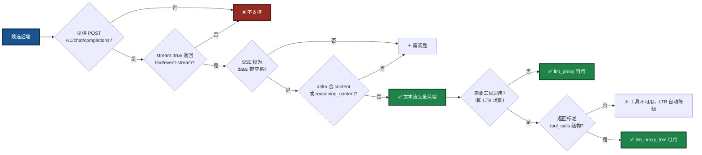
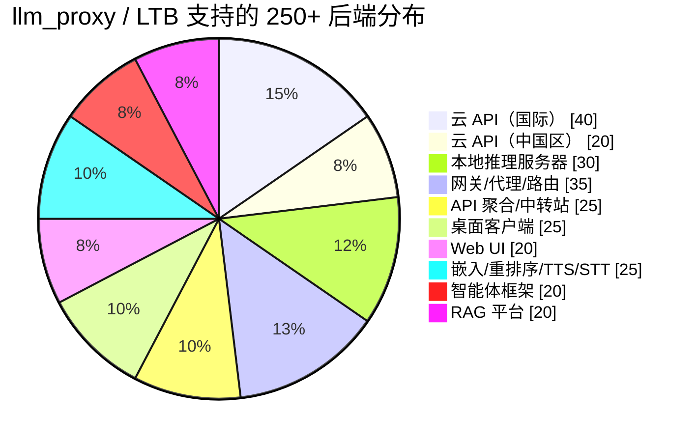

# LingoFuse LLM Proxy 兼容性指南

> **适用组件**：`llm_proxy.exe`、`llm_proxy_tool.exe`（LTB）
> **文档版本**：v4.0（v3 架构重写版 · 250+ 条目扩充）
> **最后更新**：2026-09-17
> **相关文档**（同目录）：
> - [`LingoFuse_LLM_Ecosystem_User_Guide.md`](LingoFuse_LLM_Ecosystem_User_Guide.md) — 生态总览
> - [`LingoFuse_LLM_Proxy_CLI_Guide.md`](LingoFuse_LLM_Proxy_CLI_Guide.md) — 纯转发代理命令行手册
> - [`LingoFuse_LLM_Proxy_Tool_CLI_Guide.md`](LingoFuse_LLM_Proxy_Tool_CLI_Guide.md) — LTB 命令行手册
> - [`LingoFuse_LLM_Service_CLI_guide.md`](LingoFuse_LLM_Service_CLI_guide.md) — 本地推理服务手册
> - [`LingoFuse_LLM_Pitfalls_For_AI.md`](LingoFuse_LLM_Pitfalls_For_AI.md) — 踩坑大全
> - [`LingoFuse_LLM_Service_Work_Summary.md`](LingoFuse_LLM_Service_Work_Summary.md) — 版本演进

---

## 一、核心支持逻辑

`llm_proxy.exe` 的兼容性判据**极其单一**——它只认一个端点模式：`POST /v1/chat/completions` 配合 `stream=true` 返回 `text/event-stream`。任何符合此协议的服务，无论它是云 API、本地服务器、网关还是桌面应用，均可通过 `--backend-url` 无缝接入。

`llm_proxy_tool.exe`（**LTB**）在此判据之上**额外要求**：当请求中携带 `tools` 字段时，后端需能返回**标准 OpenAI 格式的 `tool_calls`**。二者的**基础接入规则完全一致**，因此本文档所有关于**后端兼容性**的说明，**对 LTB 同样适用**。

### 图 1：兼容性判定流程



**为什么只有这一条基础判据？** 因为 `llm_proxy.exe` 的实现只做三件事：解析 URL 路径提取 `app` 和 `api`、将请求体原样转发给后端、将后端的 SSE 流逐行解析并映射为 LingoFuse 的 Notify 事件。它不解析业务数据、不校验 `Content-Type`、不关心后端的具体实现。因此，**只要后端在协议层面是 OpenAI 兼容的，`llm_proxy.exe` 就能透传它**。

**关键匹配点**：

| 匹配点 | llm_proxy / LTB 的对应实现 | 说明 |
|--------|---------------------------|------|
| `POST /v1/chat/completions` | `OpenAIStreamClient.stream_chat()` | 硬编码路径，不支持自定义 |
| `Authorization: Bearer <key>` | `_build_headers()` | 支持自定义 header 名与 scheme |
| `stream=true` → `text/event-stream` | `Accept-Encoding: identity` + `http.client` | 强制不压缩，禁用 Nagle |
| `data: {...}\n\n` SSE 帧 | `for raw_line in resp:` | 只认 `data: `（带空格）前缀 |
| `choices[0].delta.content` | `_extract_delta()` | 映射为 `chunk` 事件 |
| `choices[0].delta.reasoning_content` | `_extract_delta()` | 映射为 `think` 事件 |
| `data: [DONE]` | `stream_chat()` 的 `return` | 流结束标记 |
| `choices[0].delta.tool_calls`（LTB 专属） | `stream_chat()` 的累加器 | 按 `index` 拼接 `arguments` 字符串 |

---

## 二、云 API 提供商（国际）—— 40+ 家

### 2.1 主流云 API

| 平台 | Base URL | 路径 | 多模态 | 链接 |
|------|----------|------|:------:|------|
| OpenAI 官方 | `https://api.openai.com` | `/v1/chat/completions` | ✅ | [platform.openai.com](https://platform.openai.com) |
| Azure OpenAI | `<resource>.openai.azure.com` | `/openai/deployments/<name>/chat/completions` | ✅ | [azure.microsoft.com](https://azure.microsoft.com/en-us/products/ai-services/openai-service) |
| Anthropic Claude | `https://api.anthropic.com` | 通过兼容层 | ✅ | [anthropic.com](https://www.anthropic.com) |
| Google Vertex AI | `https://<region>-aiplatform.googleapis.com` | 通过兼容层 | ✅ | [cloud.google.com/vertex-ai](https://cloud.google.com/vertex-ai) |
| Mistral AI | `https://api.mistral.ai` | `/v1/chat/completions` | ❌ | [mistral.ai](https://mistral.ai) |
| Groq | `https://api.groq.com` | `/openai/v1/chat/completions` | ❌ | [groq.com](https://groq.com) |
| Together AI | `https://api.together.xyz` | `/v1/chat/completions` | ✅ | [together.ai](https://www.together.ai) |
| DeepInfra | `https://api.deepinfra.com` | `/v1/openai/chat/completions` | ✅ | [deepinfra.com](https://deepinfra.com) |
| Cerebras | `https://api.cerebras.ai` | `/v1/chat/completions` | ❌ | [cerebras.ai](https://cerebras.ai) |
| Fireworks AI | `https://api.fireworks.ai` | `/inference/v1/chat/completions` | ✅ | [fireworks.ai](https://fireworks.ai) |
| Baseten | `https://inference.baseten.co` | `/v1/chat/completions` | ❌ | [baseten.co](https://www.baseten.co) |
| Cohere | `https://api.cohere.ai` | `/compatibility/v1/chat/completions` | ❌ | [cohere.com](https://cohere.com) |
| xAI (Grok) | `https://api.x.ai` | `/v1/chat/completions` | ✅ | [x.ai](https://x.ai) |
| Nebius Token Factory | 有 OpenAI 兼容端点 | `/v1/chat/completions` | ❌ | [nebius.com](https://nebius.com) |
| DigitalOcean Serverless Inference | 有 OpenAI 兼容端点 | `/v1/chat/completions` | ❌ | [digitalocean.com](https://www.digitalocean.com) |
| Perplexity | `https://api.perplexity.ai` | `/chat/completions` | ❌ | [perplexity.ai](https://www.perplexity.ai) |
| Hugging Face Inference | `https://router.huggingface.co` | `/v1/chat/completions` | ✅ | [huggingface.co](https://huggingface.co) |
| OpenRouter | `https://openrouter.ai` | `/api/v1/chat/completions` | ✅ | [openrouter.ai](https://openrouter.ai) |
| Cloudflare Workers AI | `https://api.cloudflare.com/client/v4/accounts/<id>/ai/v1` | `/chat/completions` | ✅ | [cloudflare.com](https://developers.cloudflare.com/workers-ai/) |
| GitHub Models | `https://models.inference.ai.azure.com` | `/chat/completions` | ✅ | [github.com](https://github.com/marketplace/models) |
| SambaNova | 有 OpenAI 兼容端点 | `/v1/chat/completions` | ❌ | [sambanova.ai](https://sambanova.ai) |
| Hyperbolic | 有 OpenAI 兼容端点 | `/v1/chat/completions` | ❌ | [hyperbolic.xyz](https://hyperbolic.xyz) |
| Novita AI | 有 OpenAI 兼容端点 | `/v1/chat/completions` | ✅ | [novita.ai](https://novita.ai) |
| Anyscale Endpoints | 有 OpenAI 兼容端点 | `/v1/chat/completions` | ❌ | [anyscale.com](https://www.anyscale.com) |
| Replicate | 有 OpenAI 兼容端点 | `/v1/chat/completions` | ✅ | [replicate.com](https://replicate.com) |
| AI21 Labs | 有 OpenAI 兼容端点 | `/v1/chat/completions` | ❌ | [ai21.com](https://www.ai21.com) |
| Writer | 有 OpenAI 兼容端点 | `/v1/chat/completions` | ❌ | [writer.com](https://writer.com) |
| GMI Cloud | `https://api.gmi-serving.com/v1` | `/chat/completions` | ❌ | [gmicloud.ai](https://www.gmicloud.ai) |
| LLM7.io | `https://api.llm7.io/v1` | `/chat/completions` | ❌ | [llm7.io](https://llm7.io) |
| DeepSeek | `https://api.deepseek.com` | `/v1/chat/completions` | ❌ | [deepseek.com](https://www.deepseek.com) |
| Moonshot (Kimi) | `https://api.moonshot.cn/v1` | `/chat/completions` | ❌ | [moonshot.cn](https://www.moonshot.cn) |
| Voyage AI | 嵌入为主 | `/v1/embeddings` | — | [voyageai.com](https://www.voyageai.com) |
| Jina AI | 嵌入为主 | `/v1/embeddings` | — | [jina.ai](https://jina.ai) |
| Mixedbread AI | 嵌入 / 重排序 | `/v1/embeddings` | — | [mixedbread.ai](https://www.mixedbread.ai) |
| Nomic AI | 嵌入为主 | `/v1/embeddings` | — | [nomic.ai](https://www.nomic.ai) |
| Cohere（嵌入） | `https://api.cohere.ai` | `/v1/embed` | — | [cohere.com](https://cohere.com) |
| Voyage AI（重排序） | 重排序为主 | `/v1/rerank` | — | [voyageai.com](https://www.voyageai.com) |
| Jina AI（重排序） | 重排序为主 | `/v1/rerank` | — | [jina.ai](https://jina.ai) |

### 2.2 云 API 提供商（中国区）—— 20+ 家

| 平台 | Base URL | 路径 | 链接 |
|------|----------|------|------|
| DeepSeek | `https://api.deepseek.com` | `/v1/chat/completions` | [deepseek.com](https://www.deepseek.com) |
| 硅基流动 (SiliconFlow) | `https://api.siliconflow.cn` | `/v1/chat/completions` | [siliconflow.cn](https://www.siliconflow.cn) |
| 阿里云 DashScope (百炼) | `https://dashscope.aliyuncs.com/compatible-mode` | `/v1/chat/completions` | [dashscope.aliyun.com](https://dashscope.aliyun.com) |
| 火山引擎 (豆包) | `https://ark.cn-beijing.volces.com/api/v3` | `/chat/completions` | [volcengine.com](https://www.volcengine.com/product/doubao) |
| 智谱 (GLM) | `https://open.bigmodel.cn/api/paas/v4` | `/chat/completions` | [bigmodel.cn](https://open.bigmodel.cn) |
| MiniMax | `https://api.minimax.chat/v1` | `/chat/completions` | [minimax.chat](https://www.minimax.chat) |
| 月之暗面 (Moonshot) | `https://api.moonshot.cn/v1` | `/chat/completions` | [moonshot.cn](https://www.moonshot.cn) |
| 零一万物 (Yi) | `https://api.lingyiwanwu.com/v1` | `/chat/completions` | [lingyiwanwu.com](https://www.lingyiwanwu.com) |
| 百川智能 | `https://api.baichuan-ai.com/v1` | `/chat/completions` | [baichuan-ai.com](https://www.baichuan-ai.com) |
| 腾讯混元 | `https://api.hunyuan.cloud.tencent.com/v1` | `/chat/completions` | [hunyuan.tencent.com](https://hunyuan.tencent.com) |
| 百度文心 | `https://qianfan.baidubce.com/v2` | `/chat/completions` | [qianfan.baidubce.com](https://qianfan.baidubce.com) |
| 讯飞星火 | `https://spark-api-open.xf-yun.com/v1` | `/chat/completions` | [xfyun.cn](https://www.xfyun.cn) |
| 阶跃星辰 | `https://api.stepfun.com/v1` | `/chat/completions` | [stepfun.com](https://www.stepfun.com) |
| 商汤日日新 | 有 OpenAI 兼容端点 | `/v1/chat/completions` | [sensetime.com](https://www.sensetime.com) |
| 昆仑万维天工 | 有 OpenAI 兼容端点 | `/v1/chat/completions` | [tiangong.cn](https://www.tiangong.cn) |
| 优刻得星图 AstraFlow | 有 OpenAI 兼容端点 | `/v1/chat/completions` | [ucloud.cn](https://www.ucloud.cn) |
| TokenRhythm | 对标 OpenRouter | `/v1/chat/completions` | [tokenrhythm.ai](https://www.tokenrhythm.ai) |
| 腾讯云第三方大模型 | `https://api.cloud.tencent.com` | `/v1/chat/completions` | [cloud.tencent.cn](https://cloud.tencent.cn) |

---

## 三、本地推理服务器 —— 30+ 个

| 服务器 | 默认端点 | 多模态 | 链接 |
|--------|----------|:------:|------|
| **LM Studio** | `http://localhost:1234/v1/chat/completions` | ✅ | [lmstudio.ai](https://lmstudio.ai) |
| **llama.cpp (llama-server)** | `http://localhost:8080/v1/chat/completions` | ✅ | [github.com/ggml-org/llama.cpp](https://github.com/ggml-org/llama.cpp) |
| **vLLM** | `http://localhost:8000/v1/chat/completions` | ✅ | [github.com/vllm-project/vllm](https://github.com/vllm-project/vllm) |
| **Ollama** | `http://localhost:11434/v1/chat/completions` | ✅ | [ollama.com](https://ollama.com) |
| **LocalAI** | `http://localhost:8080/v1/chat/completions` | ✅ | [github.com/mudler/LocalAI](https://github.com/mudler/LocalAI) |
| **TGI (Text Generation Inference)** | `http://localhost:8080/v1/chat/completions` | ✅ | [github.com/huggingface/text-generation-inference](https://github.com/huggingface/text-generation-inference) |
| **SGLang** | `http://localhost:30000/v1/chat/completions` | ✅ | [github.com/sgl-project/sglang](https://github.com/sgl-project/sglang) |
| **TabbyAPI** | 有 OpenAI 兼容端点 | ❌ | [github.com/theroyallab/tabbyAPI](https://github.com/theroyallab/tabbyAPI) |
| **KoboldCPP** | 有 OpenAI 兼容端点 | ❌ | [github.com/LostRuins/koboldcpp](https://github.com/LostRuins/koboldcpp) |
| **text-generation-webui** | 有 OpenAI 兼容扩展 | ❌ | [github.com/oobabooga/text-generation-webui](https://github.com/oobabooga/text-generation-webui) |
| **MLX Omni Server** | Apple Silicon 专用 | ❌ | [github.com/ml-explore/mlx](https://github.com/ml-explore/mlx) |
| **Kronk** | 基于 llama.cpp | ✅ | [github.com/gpuopen/kronk](https://github.com/gpuopen/kronk) |
| **Shimmy** | 纯 Rust WebGPU | ❌ | [github.com/Michael-A-Kuykendall/shimmy](https://github.com/Michael-A-Kuykendall/shimmy) |
| **Lemonade Server** | `http://localhost:13305/api/v1` | ✅ | [lemonade-server.ai](https://lemonade-server.ai) |
| **OpenLLM (BentoML)** | 一键部署 | ❌ | [github.com/bentoml/OpenLLM](https://github.com/bentoml/OpenLLM) |
| **MLC LLM** | 有 OpenAI 兼容端点 | ✅ | [github.com/mlc-ai/mlc-llm](https://github.com/mlc-ai/mlc-llm) |
| **LitGPT** | 有 OpenAI 兼容端点 | ❌ | [github.com/Lightning-AI/litgpt](https://github.com/Lightning-AI/litgpt) |
| **xinfer** | 纯 Rust 推理 | ❌ | [github.com/xinfer-ai/xinfer](https://github.com/xinfer-ai/xinfer) |
| **paddock** | NVIDIA GPU 原生 Rust | ❌ | [github.com/paddock-ai/paddock](https://github.com/paddock-ai/paddock) |
| **Kolosal Server** | 有 OpenAI 兼容端点 | ❌ | [github.com/KolosalAI/kolosal-server](https://github.com/KolosalAI/kolosal-server) |
| **HybridInfer** | 本地 OpenAI 兼容 | ❌ | [github.com/SimranKoul2026/HybridInfer](https://github.com/SimranKoul2026/HybridInfer) |
| **Rapid-MLX** | Apple Silicon 专用 | ❌ | [github.com/cline/cline](https://github.com/cline/cline) |
| **Dify 本地部署** | 有 OpenAI 兼容端点 | ✅ | [dify.ai](https://dify.ai) |
| **LLM-Proxy (Nayjest)** | 有 OpenAI 兼容端点 | ❌ | [github.com/Nayjest/LLM-Proxy](https://github.com/Nayjest/LLM-Proxy) |
| **Fake OpenAI Server** | 嵌入 / 重排序 | — | [github.com/fake-openai-server](https://github.com) |
| **Furiosa-LLM** | 有 OpenAI 兼容端点 | ❌ | [developer.furiosa.ai](https://developer.furiosa.ai) |
| **Xinference** | 有 OpenAI 兼容端点 | ✅ | [github.com/xorbitsai/inference](https://github.com/xorbitsai/inference) |
| **MLX-VLM** | Apple Silicon 多模态 | ✅ | [github.com/Blaizzy/mlx-vlm](https://github.com/Blaizzy/mlx-vlm) |
| **Candle** | Rust 推理框架 | ❌ | [github.com/huggingface/candle](https://github.com/huggingface/candle) |
| **llamafile** | 单文件推理 | ✅ | [github.com/Mozilla-Ocho/llamafile](https://github.com/Mozilla-Ocho/llamafile) |

---

## 四、网关 / 代理 / 路由 —— 35+ 个

| 网关 | 语言 | 链接 |
|------|------|------|
| **LiteLLM** | Python | [github.com/BerriAI/litellm](https://github.com/BerriAI/litellm) |
| **Portkey Gateway** | TypeScript | [github.com/Portkey-AI/gateway](https://github.com/Portkey-AI/gateway) |
| **Helicone AI Gateway** | Rust | [github.com/Helicone/helicone](https://github.com/Helicone/helicone) |
| **OmniRoute** | TypeScript | [github.com/diegosouzapw/OmniRoute](https://github.com/diegosouzapw/OmniRoute) |
| **New API** | Go | [github.com/Calcium-Ion/new-api](https://github.com/Calcium-Ion/new-api) |
| **One API** | Go | [github.com/songquanpeng/one-api](https://github.com/songquanpeng/one-api) |
| **GoModel** | Go | [github.com/gomodel/gomodel](https://github.com/gomodel/gomodel) |
| **Bifrost** | Go | [github.com/maximhq/bifrost](https://github.com/maximhq/bifrost) |
| **Vercel AI Gateway** | 云服务 | [vercel.com/ai](https://vercel.com/ai) |
| **Cloudflare AI Gateway** | 云服务 | [developers.cloudflare.com/ai-gateway](https://developers.cloudflare.com/ai-gateway) |
| **Braintrust** | 云服务 | [braintrust.dev](https://www.braintrust.dev) |
| **AISIX** | 云服务 | [aisix.ai](https://aisix.ai) |
| **Higress** | Go | [github.com/alibaba/higress](https://github.com/alibaba/higress) |
| **LLM0 Gateway** | — | [github.com/llm0](https://github.com/llm0) |
| **freellmapi-proxy** | — | [github.com/freellmapi](https://github.com) |
| **ProxyGateLLM** | — | [github.com/proxygategate](https://github.com) |
| **neurogate** | — | [github.com/neurogate](https://github.com) |
| **Brick** | — | [github.com/brick-ai](https://github.com) |
| **venagate** | TypeScript | [github.com/venagate](https://github.com) |
| **CLIProxyAPI** | — | [github.com/cliproxyapi](https://github.com) |
| **gptoss-proxy** | JavaScript | [github.com/gptoss-proxy](https://github.com) |
| **Kong AI Gateway** | Lua | [konghq.com](https://konghq.com) |
| **APIClaw** | — | [apiclaw.io](https://apiclaw.io) |
| **A3M Router** | Node.js | [npmjs.com/package/adaptive-memory-multi-model-router](https://www.npmjs.com/package/adaptive-memory-multi-model-router) |
| **LateDev Router** | Node.js | [npmjs.com/package/ldrouter](https://www.npmjs.com/package/ldrouter) |
| **OrcaRouter** | 云服务 | [docs.orcarouter.ai](https://docs.orcarouter.ai) |
| **FreeRouter Gateway** | Node.js | [npmjs.com/@freerouter/gateway](https://www.npmjs.com/package/@freerouter/gateway) |
| **EURouter** | — | [github.com/eurouter](https://github.com) |
| **JAiRouter** | Java | [github.com/Lincoln-cn/JAiRouter](https://github.com/Lincoln-cn/JAiRouter) |
| **freeport** | Node.js | [socket.dev/npm/package/@reallyartificial/freeport](https://socket.dev/npm/package/@reallyartificial/freeport) |
| **ai-api-gateway** | Node.js | [npmjs.com/package/ai-api-gateway](https://www.npmjs.com/package/ai-api-gateway) |
| **Tetrate Agent Router** | 云服务 | [tetrate.io](https://tetrate.io) |
| **TokenMix** | 聚合服务 | [tokenmix.ai](https://tokenmix.ai) |
| **Apiário** | 聚合服务 | [api.apiario.dev](https://api.apiario.dev) |
| **RouteLLM** | Python | [github.com/lm-sys/RouteLLM](https://github.com/lm-sys/RouteLLM) |

---

## 五、API 聚合 / 中转站 —— 25+ 家

| 平台 | 说明 | 链接 |
|------|------|------|
| **OpenRouter** | 500+ 模型聚合 | [openrouter.ai](https://openrouter.ai) |
| **Ollama Cloud** | 400+ 模型，云端 GPU | [ollama.com/cloud](https://ollama.com/cloud) |
| **Kluster AI** | 有免费额度 | [kluster.ai](https://www.kluster.ai) |
| **Free-The-Ai** | 50+ 模型，免费 | [free-the-ai.com](https://free-the-ai.com) |
| **FreeLLMAPI** | 14 家平台免费额度聚合 | [github.com/FreeLLMAPI](https://github.com) |
| **proaiapi.tech** | 企业级首选 | [proaiapi.tech](https://proaiapi.tech) |
| **n1n.ai** | 企业级专线 | [n1n.ai](https://n1n.ai) |
| **PoloAPI** | 老牌，折扣力度大 | [poloapi.com](https://poloapi.com) |
| **星链 4SAPI** | 边缘节点优化 | [4sapi.com](https://4sapi.com) |
| **云雾 API (YUNWU)** | 国内中转 | [yunwu.ai](https://yunwu.ai) |
| **玄枢 API (XuanShu API)** | 国内中转 | [xuanshuapi.com](https://xuanshuapi.com) |
| **TeamoRouter** | OpenAI / Anthropic / Gemini 兼容 | [teamorouter.com](https://teamorouter.com) |
| **CometAPI** | 多模型路由 | [cometapi.com](https://cometapi.com) |
| **OfoxAI** | 100+ LLM 统一网关 | [ofoxai.com](https://ofoxai.com) |
| **Eden AI** | 多模态聚合 | [edenai.co](https://www.edenai.co) |
| **RouterBase** | 200+ 前沿模型 | [routerbase.ai](https://routerbase.ai) |
| **Apiário** | 巴西开发者聚合 | [api.apiario.dev](https://api.apiario.dev) |
| **TokenMix** | 171 模型，14 提供商 | [tokenmix.ai](https://tokenmix.ai) |
| **TokenRhythm** | 中国版 OpenRouter | [tokenrhythm.ai](https://www.tokenrhythm.ai) |
| **AI/ML API** | 300+ 模型聚合 | [aimlapi.com](https://aimlapi.com) |
| **Nano-GPT** | 多模型聚合 | [nano-gpt.com](https://nano-gpt.com) |
| **Requesty** | LLM 路由聚合 | [requesty.ai](https://requesty.ai) |
| **Unify AI** | 智能路由聚合 | [unify.ai](https://unify.ai) |
| **Martian** | 模型路由聚合 | [withmartian.com](https://withmartian.com) |
| **Not Diamond** | 智能模型路由 | [notdiamond.ai](https://www.notdiamond.ai) |

---

## 六、桌面客户端（自带 OpenAI 兼容 Server）—— 25+ 个

| 工具 | 平台 | 多模态 | 链接 |
|------|------|:------:|------|
| **LM Studio** | Windows / macOS / Linux | ✅ | [lmstudio.ai](https://lmstudio.ai) |
| **GPT4All** | Windows / Linux / macOS | ❌ | [gpt4all.io](https://gpt4all.io) |
| **Jan** | Windows / macOS / Linux | ❌ | [jan.ai](https://jan.ai) |
| **Ollama** | Windows / macOS / Linux | ✅ | [ollama.com](https://ollama.com) |
| **Lobe Chat** | Windows / macOS / Linux | ✅ | [lobechat.com](https://lobechat.com) |
| **PyGPT** | Windows / Linux / macOS | ✅ | [pygpt.net](https://pygpt.net) |
| **OOLIS** | 桌面 | ❌ | [github.com/AlexandreBrillant/oolis](https://github.com/AlexandreBrillant/oolis) |
| **Msty** | macOS / Windows / Linux | ❌ | [msty.app](https://msty.app) |
| **Elvean** | macOS | ❌ | [elvean.ai](https://elvean.ai) |
| **LLM FX** | 桌面客户端 | ❌ | [llmfx.com](https://llmfx.com) |
| **TurboLLM** | 桌面 | ❌ | [turbollm.ai](https://turbollm.ai) |
| **RWKV Runner** | 桌面 | ❌ | [github.com/josStorer/RWKV-Runner](https://github.com/josStorer/RWKV-Runner) |
| **ChatQT** | Linux (Flatpak) | ❌ | [flathub.org](https://flathub.org) |
| **Sigma Oasis** | macOS / Windows / Linux | ❌ | [sigmaoasis.ai](https://sigmaoasis.ai) |
| **local-chat** | 跨平台 | ✅ | [github.com/local-chat](https://github.com) |
| **Delta** | 离线优先 | ❌ | [delta.chat](https://delta.chat) |
| **AI Server Studio** | 桌面 | ✅ | [aiserverstudio.com](https://aiserverstudio.com) |
| **Atomic Chat** | 跨平台 | ✅ | [everydev.ai](https://www.everydev.ai) |
| **openchat-llm** | Windows 预览 | ❌ | [github.com/openchat-llm](https://github.com) |
| **AQBot** | 跨平台 | ✅ | [aqbot.ai](https://aqbot.ai) |
| **Fello** | macOS / Windows / Linux | ❌ | [npmjs.com/@zythum02/fello-server](https://www.npmjs.com/package/@zythum02/fello-server) |
| **Chatbox** | Windows / macOS / Linux | ✅ | [chatboxai.app](https://chatboxai.app) |
| **Cherry Studio** | Windows / macOS / Linux | ✅ | [cherry-ai.com](https://cherry-ai.com) |
| **NextChat** | Windows / macOS / Linux | ✅ | [github.com/ChatGPTNextWeb/NextChat](https://github.com/ChatGPTNextWeb/NextChat) |
| **ChatGPT-Next-Web** | Web / 桌面 | ✅ | [github.com/ChatGPTNextWeb/ChatGPT-Next-Web](https://github.com/ChatGPTNextWeb/ChatGPT-Next-Web) |

---

## 七、Web UI（OpenAI 兼容前端）—— 20+ 个

| Web UI | 说明 | 链接 |
|--------|------|------|
| **Open WebUI** | 最佳 HomeLab 界面 | [github.com/open-webui/open-webui](https://github.com/open-webui/open-webui) |
| **NextChat** | 轻量响应式 | [github.com/ChatGPTNextWeb/NextChat](https://github.com/ChatGPTNextWeb/NextChat) |
| **Lobe Chat** | 现代 AI 聊天界面 | [github.com/lobehub/lobe-chat](https://github.com/lobehub/lobe-chat) |
| **ChuanhuChatGPT** | 轻快好用 | [github.com/GaiZhenbiao/ChuanhuChatGPT](https://github.com/GaiZhenbiao/ChuanhuChatGPT) |
| **ChatGPT-web** | 单页简洁界面 | [github.com/Niek/chatgpt-web](https://github.com/Niek/chatgpt-web) |
| **Chatbot UI** | 开源聊天界面 | [github.com/mckaywrigley/chatbot-ui](https://github.com/mckaywrigley/chatbot-ui) |
| **LibreChat** | 多提供商聊天 | [github.com/danny-avila/LibreChat](https://github.com/danny-avila/LibreChat) |
| **Hollama** | 轻量 Ollama 前端 | [github.com/fmaclen/hollama](https://github.com/fmaclen/hollama) |
| **Lite WebUI** | 浏览器本地运行 | [github.com/AXERA-TECH/lite_webui](https://github.com/AXERA-TECH/lite_webui) |
| **llampart** | llama-server 专用 | [github.com/mchowy-troll/llampart](https://github.com/mchowy-troll/llampart) |
| **AuraPro UI** | 可扩展离线平台 | [github.com/aurapro](https://github.com) |
| **Chat UI** | TypeScript/SvelteKit | [github.com/huggingface/chat-ui](https://github.com/huggingface/chat-ui) |
| **BetterChatGPT** | 增强版 ChatGPT | [github.com/ztjhz/BetterChatGPT](https://github.com/ztjhz/BetterChatGPT) |
| **TypingMind** | 商业级聊天 UI | [typingmind.com](https://www.typingmind.com) |
| **ChatALL** | 同时问多个 AI | [github.com/sunner/ChatALL](https://github.com/sunner/ChatALL) |
| **Big-AGI** | 智能体 Web UI | [github.com/enricoros/big-agi](https://github.com/enricoros/big-agi) |
| **Dify** | LLMOps 平台 | [dify.ai](https://dify.ai) |
| **FastGPT** | 知识库问答平台 | [fastgpt.in](https://fastgpt.in) |
| **AnythingLLM** | 全栈 RAG 应用 | [anythingllm.com](https://anythingllm.com) |
| **Open WebUI Lite** | 轻量版 | [github.com/open-webui/open-webui](https://github.com/open-webui/open-webui) |

---

## 八、嵌入 / 重排序 / TTS / STT（部分支持）—— 25+ 个

以下服务暴露 OpenAI 兼容端点，但 `llm_proxy.exe`（以及 LTB）**只转发 `/v1/chat/completions`**。如需要这些能力，客户端需直连。

### 8.1 嵌入 / 重排序

| 服务器 | 端点 | 链接 |
|--------|------|------|
| **Hugging Face TEI** | `/v1/embeddings` | [github.com/huggingface/text-embeddings-inference](https://github.com/huggingface/text-embeddings-inference) |
| **docker-embeddings** | `/v1/embeddings` + `/rerank` | [github.com/hwdsl2/docker-embeddings](https://github.com/hwdsl2/docker-embeddings) |
| **Superlinked Inference Engine** | `/v1/embeddings` | [github.com/Hmbown/sie](https://github.com/Hmbown/sie) |
| **Qwen3 Retrieval Server** | `/v1/embeddings` + `/v1/rerank` | [github.com/Scisaga/qwen3-retrieval-server](https://github.com/Scisaga/qwen3-retrieval-server) |
| **Xinference** | `/v1/embeddings` + `/v1/rerank` | [github.com/xorbitsai/inference](https://github.com/xorbitsai/inference) |
| **Furiosa-LLM** | `/v1/embeddings` + `/v1/rerank` | [developer.furiosa.ai](https://developer.furiosa.ai) |
| **vLLM（嵌入/重排序）** | `/v1/embeddings` + `/v1/rerank` | [github.com/vllm-project/vllm](https://github.com/vllm-project/vllm) |
| **api-embedding** | `/v1/embeddings` | [github.com/api-embedding](https://github.com) |
| **jina-embeddings-v4 server** | `/v1/embeddings` | [github.com/jina-ai](https://github.com/jina-ai) |

### 8.2 TTS / STT

| 服务器 | 端点 | 链接 |
|--------|------|------|
| **Speaches** | `/v1/audio/transcriptions` + `/v1/audio/speech` | [github.com/speaches-ai/speaches](https://github.com/speaches-ai/speaches) |
| **VoiceStudio** | `/v1/audio/*` | [github.com/debpalash/VoiceStudio](https://github.com/debpalash/VoiceStudio) |
| **kokoro-fastapi** | `/v1/audio/speech` | [github.com/remsky/Kokoro-FastAPI](https://github.com/remsky/Kokoro-FastAPI) |
| **tts-server** | `/v1/audio/speech` | [github.com/tts-server](https://github.com) |
| **omnivoice-server** | `/v1/audio/speech` | [github.com/omnivoice](https://github.com) |
| **supertonic-server** | `/v1/audio/speech` | [github.com/supertonic](https://github.com) |
| **ChatTTS-OpenAI-API** | `/v1/audio/speech` | [github.com/ChatTTS](https://github.com) |
| **bootlegger-voice** | `/v1/audio/*` | [pypi.org/project/bootlegger-voice](https://pypi.org/project/bootlegger-voice) |
| **OpenMusicx** | Realtime WebSocket | [pypi.org/project/OpenMusicx](https://pypi.org/project/OpenMusicx) |
| **faster-whisper** | `/v1/audio/transcriptions` | [github.com/SYSTRAN/faster-whisper](https://github.com/SYSTRAN/faster-whisper) |
| **Whisper.cpp** | `/v1/audio/transcriptions` | [github.com/ggerganov/whisper.cpp](https://github.com/ggerganov/whisper.cpp) |
| **museq** | 23 种模态 | [github.com/museq](https://github.com) |

---

## 九、智能体框架（OpenAI 兼容）—— 20+ 个

| 框架 | 语言 | 链接 |
|------|------|------|
| **LightAgent** | Python | [github.com/wanxingai/LightAgent](https://github.com/wanxingai/LightAgent) |
| **loong-agent** | Python | [pypi.org/project/loong-agent](https://pypi.org/project/loong-agent) |
| **paean-ai/agents** | TypeScript | [github.com/paean-ai/agents](https://github.com/paean-ai/agents) |
| **openai-agents-rust** | Rust | [github.com/MaxParisotto/openai-agents-rust](https://github.com/MaxParisotto/openai-agents-rust) |
| **OGX** | Python | [arxiv.org](https://arxiv.org) |
| **Nekora AI** | TypeScript | [npmjs.com/@nekora-ai/core](https://www.npmjs.com/package/@nekora-ai/core) |
| **agentknit** | Python | [piwheels.org/project/agentknit](https://piwheels.org/project/agentknit) |
| **nagents** | Python | [pypi.org/project/nagents](https://pypi.org/project/nagents) |
| **LangChain** | Python / JS | [langchain.com](https://www.langchain.com) |
| **LlamaIndex** | Python / TS | [llamaindex.ai](https://www.llamaindex.ai) |
| **CrewAI** | Python | [crewai.com](https://www.crewai.com) |
| **AutoGen** | Python | [github.com/microsoft/autogen](https://github.com/microsoft/autogen) |
| **Semantic Kernel** | C# / Python | [github.com/microsoft/semantic-kernel](https://github.com/microsoft/semantic-kernel) |
| **Haystack** | Python | [haystack.deepset.ai](https://haystack.deepset.ai) |
| **DSPy** | Python | [github.com/stanfordnlp/dspy](https://github.com/stanfordnlp/dspy) |
| **PromptFlow** | Python | [github.com/microsoft/promptflow](https://github.com/microsoft/promptflow) |
| **Flowise** | TypeScript | [flowiseai.com](https://flowiseai.com) |
| **n8n** | TypeScript | [n8n.io](https://n8n.io) |
| **OpenSquilla** | 多平台 | [github.com/OpenSquilla](https://github.com) |
| **MCP Gateway** | Docker | [github.com/hwdsl2/docker-mcp-gateway](https://github.com/hwdsl2/docker-mcp-gateway) |

---

## 十、RAG 平台（OpenAI 兼容）—— 20+ 个

| 平台 | 说明 | 链接 |
|------|------|------|
| **rwiki** | SQLite RAG | [github.com/timzaak/rwiki](https://github.com/timzaak/rwiki) |
| **rag.computer** | 自托管 RAG | [github.com/bigint/rag.computer](https://github.com/bigint/rag.computer) |
| **Ragworks** | 低代码 RAG 工作台 | [github.com/Neeeser/Ragworks](https://github.com/Neeeser/Ragworks) |
| **OpenRAG** | 多租户 RAG | [github.com/linagora/openrag](https://github.com/linagora/openrag) |
| **RAGLight** | 模块化 Python RAG | [dev.co](https://dev.co) |
| **Pi Coding Agent** | Qdrant/pgvector RAG | [pi.dev](https://pi.dev) |
| **Dify** | LLMOps + RAG | [dify.ai](https://dify.ai) |
| **FastGPT** | 知识库问答 | [fastgpt.in](https://fastgpt.in) |
| **AnythingLLM** | 全栈 RAG | [anythingllm.com](https://anythingllm.com) |
| **RAGFlow** | 深度文档理解 RAG | [ragflow.io](https://ragflow.io) |
| **Quivr** | 个人知识库 | [github.com/QuivrHQ/quivr](https://github.com/QuivrHQ/quivr) |
| **Verba** | Weaviate RAG | [github.com/weaviate/Verba](https://github.com/weaviate/Verba) |
| **PrivateGPT** | 本地文档问答 | [github.com/zylon-ai/private-gpt](https://github.com/zylon-ai/private-gpt) |
| **LocalGPT** | 本地 GPT 文档问答 | [github.com/PromtEngineer/localGPT](https://github.com/PromtEngineer/localGPT) |
| **Khoj** | 个人 AI 知识库 | [khoj.dev](https://khoj.dev) |
| **Morphik** | 多模态 RAG | [github.com/morphik-org/morphik-core](https://github.com/morphik-org/morphik-core) |
| **RAGatouille** | 轻量 RAG 库 | [github.com/bclavie/RAGatouille](https://github.com/bclavie/RAGatouille) |
| **Canopy** | Pinecone RAG | [github.com/pinecone-io/canopy](https://github.com/pinecone-io/canopy) |
| **Chroma** | 向量数据库 + RAG | [trychroma.com](https://www.trychroma.com) |
| **Qdrant** | 向量数据库 + RAG | [qdrant.tech](https://qdrant.tech) |

---

## 十一、接入验证

在将任何后端接入 `llm_proxy.exe`（或 LTB）前，用以下命令验证：

```bash
curl -N -X POST http://127.0.0.1:1234/v1/chat/completions \
  -H "Content-Type: application/json" \
  -d '{"model":"<模型 id>","messages":[{"role":"user","content":"hi"}],"stream":true}'
```

| 检查项 | 通过条件 | 不通过的应对 |
|--------|----------|--------------|
| HTTP 状态 | `200 OK` | 检查 `--backend-url` 与 `--backend-model` |
| Content-Type | `text/event-stream` | 后端未开启流式 |
| 帧前缀 | `data: `（含尾随空格） | 若为 `data:{...}` 需扩展 |
| 输出节奏 | 逐 token 逐行实时 | 若整段输出，检查 gzip |
| delta 字段 | 含 `content` 或 `reasoning_content` | 若否则扩展 `_extract_delta` |
| 结束标记 | `data: [DONE]` | 若缺失，后端未完整实现 SSE |

### 11.1 LTB 额外验证（需要工具调用时）

```bash
curl -N -X POST http://127.0.0.1:1234/v1/chat/completions \
  -H "Content-Type: application/json" \
  -d '{
    "model":"<模型 id>",
    "messages":[{"role":"user","content":"5+7 等于几？"}],
    "stream":true,
    "tools":[{
      "type":"function",
      "function":{
        "name":"add",
        "description":"Add two integers",
        "parameters":{
          "type":"object",
          "properties":{
            "a":{"type":"integer"},
            "b":{"type":"integer"}
          },
          "required":["a","b"]
        }
      }
    }]
  }'
```

**判据**：

- SSE 流中应出现 `delta.tool_calls` 字段。
- 所有分片的 `arguments` 应按 `index` 拼接后形成合法 JSON（如 `{"a":5,"b":7}`）。
- 若后端**始终返回纯文本而不触发 `tool_calls`**，说明模型不支持 Function Calling，或未正确配置 `tool_choice`。

---

## 十二、已知限制

| 限制 | 说明 |
|------|------|
| **`llm_proxy.exe` 不支持 Function Calling** | 纯文本透传模式，`_extract_delta` 只识别 `content` / `reasoning_content`。**需要 Function Calling 时请用 `llm_proxy_tool.exe`（LTB）**，它在服务端代管工具调用。 |
| **LTB 要求后端在 `tool_calls` 时返回标准 OpenAI 结构** | 即每个 `tool_call` 包含 `index` / `id` / `type: "function"` / `function.name` / `function.arguments`（字符串）。非标准结构需修改 `OpenAIStreamClient.stream_chat` 适配。 |
| 不支持 `set_system_message` | 代理为无状态转发器，会话中途无法切换 system prompt。LTB 同理。 |
| 只认 `/v1/chat/completions` | 不支持 `/completions`、`/responses`、`/embeddings`、`/audio/*` |
| options 白名单 | 仅转发 5 个字段（`max_tokens` / `temperature` / `top_p` / `top_k` / `repeat_penalty`），`seed` / `stop` / `response_format` 等被静默丢弃。LTB 额外转发 `tools` / `tool_choice`。 |
| Azure OpenAI | 路径含 deployment + api-version，需手工拼接到 `--backend-url` |
| 非标准 SSE 帧 | `data:{...}` 无空格会丢帧，反代需保留原格式 |
| 未校验 Content-Type | 后端返回非 SSE 时静默结束，客户端收到空 `finish` |
| 不支持并发工具执行 | LTB 按顺序执行 `tool_calls`，不并发。单轮多工具场景下，串行等待可能增加延迟。 |
| LTB 工具列表不支持运行时刷新 | 启动时拉取一次，运行期间不感知后端工具变化。需重启 LTB 才能感知。 |
| 多模态 | `llm_proxy` / LTB **原样转发**图片附件到后端；**是否支持取决于后端**。`llm_service` 不支持多模态。 |

---

## 十三、支持统计

### 图 2：后端分布



| 类别 | 数量 |
|------|:----:|
| 云 API 提供商（国际） | **40+** |
| 云 API 提供商（中国区） | **20+** |
| 本地推理服务器 | **30+** |
| 网关 / 代理 / 路由 | **35+** |
| API 聚合 / 中转站 | **25+** |
| 桌面客户端（自带 Server） | **25+** |
| Web UI（OpenAI 兼容前端） | **20+** |
| 嵌入 / 重排序 / TTS / STT（部分支持） | **25+** |
| 智能体框架 | **20+** |
| RAG 平台 | **20+** |
| **合计** | **250+** |

> **说明**：该清单对 **`llm_proxy.exe`（纯文本代理）与 `llm_proxy_tool.exe`（LTB，服务端工具执行）均适用**。LTB 的核心差异仅在于它会在请求中注入 `tools` 字段，并要求后端在需要时返回标准 `tool_calls` 结构。基础 SSE 客户端完全一致。

---

## 十四、相关文档（同目录）

| 文档 | 说明 |
|------|------|
| [`LingoFuse_LLM_Ecosystem_User_Guide.md`](LingoFuse_LLM_Ecosystem_User_Guide.md) | 生态总览（四大核心组件 + 两条路径） |
| [`LingoFuse_LLM_Proxy_CLI_Guide.md`](LingoFuse_LLM_Proxy_CLI_Guide.md) | `llm_proxy.exe` 命令行手册 |
| [`LingoFuse_LLM_Proxy_Tool_CLI_Guide.md`](LingoFuse_LLM_Proxy_Tool_CLI_Guide.md) | `llm_proxy_tool.exe`（LTB）命令行手册 |
| [`LingoFuse_LLM_Service_CLI_guide.md`](LingoFuse_LLM_Service_CLI_guide.md) | `llm_service.exe` 命令行手册 |
| [`LingoFuse_LLM_Pitfalls_For_AI.md`](LingoFuse_LLM_Pitfalls_For_AI.md) | 踩坑大全，症状-根因-正确做法 |
| [`LingoFuse_LLM_Service_Work_Summary.md`](LingoFuse_LLM_Service_Work_Summary.md) | LLM 工具链版本演进与架构决策 |

### 根目录相关文档

| 文档 | 说明 |
|------|------|
| [`../Pascal_Integration_Guide.md`](../Pascal_Integration_Guide.md) | Pascal 开发者切入指南 |
| [`../NVIDIA-Nemotron-3-Nano-Omni-30B-A3B-Reasoning-UD-IQ4_XS.md`](../NVIDIA-Nemotron-3-Nano-Omni-30B-A3B-Reasoning-UD-IQ4_XS.md) | 推荐模型下载与部署 |

---

**文档版本**：v4.0（v3 架构重写版 · 250+ 条目扩充 · 全部条目附链接）  
**维护者**：LingoFuse-pasAgent 团队  
**反馈**：问题提 Issue，急事加 Q（600585）
