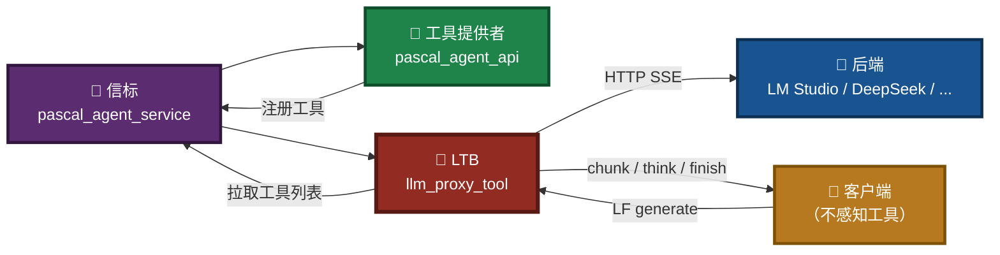
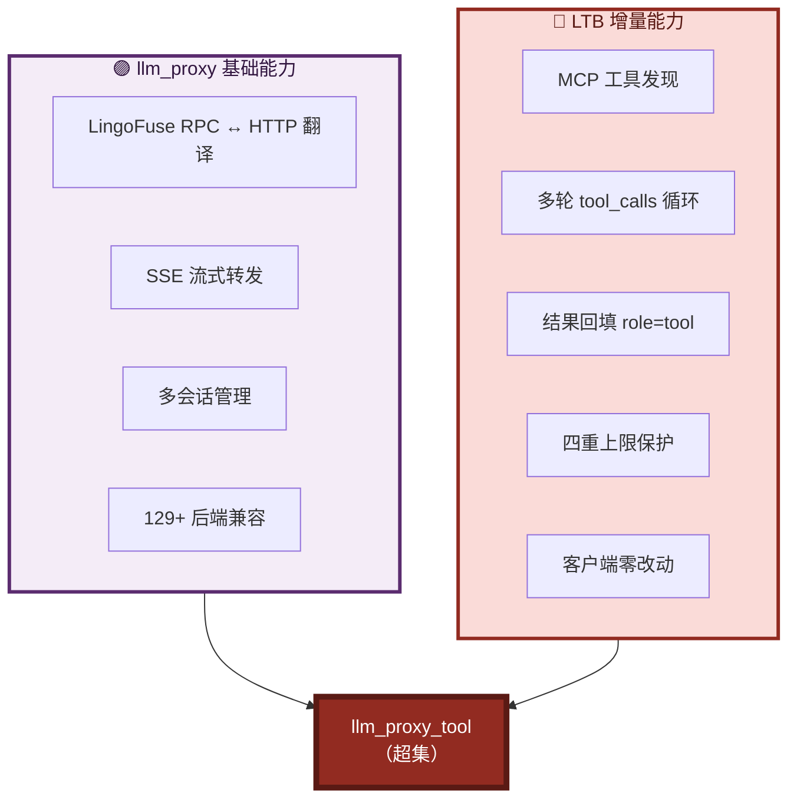
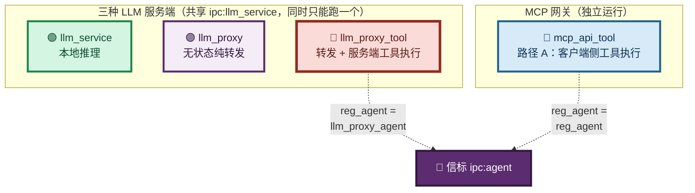
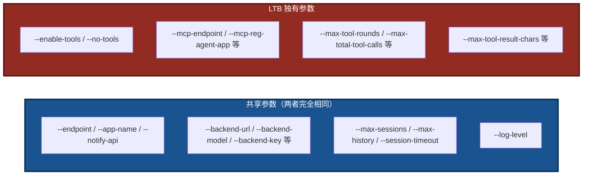
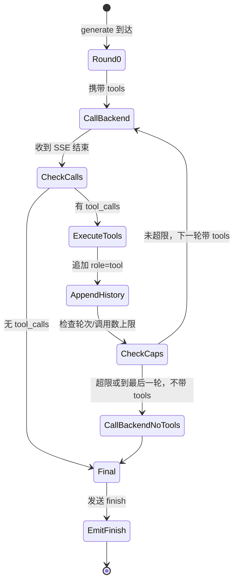

# LingoFuse LLM Tool Bridge (LTB) 命令行使用手册

> **适用程序**：`llm_proxy_tool.exe`（Windows）/ `llm_proxy_tool`（Linux）
> **文档版本**：v3.0（v3 架构重写版）
> **最后更新**：2026-09-17
> **相关文档**（同目录）：
> - [`LingoFuse_LLM_Ecosystem_User_Guide.md`](LingoFuse_LLM_Ecosystem_User_Guide.md) — 生态总览
> - [`LingoFuse_LLM_Proxy_CLI_Guide.md`](LingoFuse_LLM_Proxy_CLI_Guide.md) — 纯转发代理手册
> - [`LingoFuse_LLM_Service_CLI_guide.md`](LingoFuse_LLM_Service_CLI_guide.md) — 本地推理服务手册
> - [`LingoFuse_LLM_Proxy_Compatibility_Guide.md`](LingoFuse_LLM_Proxy_Compatibility_Guide.md) — 后端兼容清单
> - [`LingoFuse_LLM_Pitfalls_For_AI.md`](LingoFuse_LLM_Pitfalls_For_AI.md) — 踩坑大全
> - [`LingoFuse_LLM_Service_Work_Summary.md`](LingoFuse_LLM_Service_Work_Summary.md) — 版本演进

---

## 一、程序定位

`llm_proxy_tool.exe`（内部代号 **LTB**，LLM Tool Bridge）是 `llm_proxy.exe` 的**超集**。它在纯文本转发的基础上，增加了 **服务端侧工具执行** 能力：

- **`llm_proxy.exe`**：纯文本转发。工具执行由**客户端负责**（客户端必须自己支持 MCP）。
- **`llm_proxy_tool.exe`**：转发 + **服务端代管工具执行**。客户端**完全不需要**支持 MCP，只要会调 `generate` 就能享受工具能力。

LTB 的典型使用场景：

- **Pascal GUI 客户端**（不支持 MCP）想调用 Pascal 工具
- **自研前端**（只发 `generate`）需要 AI 帮它调用后端工具
- 希望把工具调用循环**统一收敛到服务端**，客户端保持简单

### 图 1：LTB 在生态中的位置



**运行环境**：Windows / Linux。
**依赖**：`LingoFuse64.dll` / `liblingofuse.so`（位于系统 PATH 或 exe 同目录）。
**可选依赖**：`language_middleware.py`（若缺失，LTB 自动降级为纯文本代理，行为等价 `llm_proxy.exe`）。

### 图 2：LTB 相对 llm_proxy 的增量



---

## 二、与三个兄弟组件的关系

LTB 与 `llm_service`、`llm_proxy`、`mcp_api_tool` 的关系如下：

### 图 3：四个组件的对照



**共存规则**：

| 组合 | 能否同时运行 | 说明 |
|------|:------------:|------|
| `llm_proxy_tool` + `mcp_api_tool` | ✅ **可以** | 二者 `reg_agent` 名不同（`llm_proxy_agent` vs `reg_agent`），共享同一信标 |
| `llm_proxy_tool` + `llm_proxy` | ❌ 不能 | 默认共享 `ipc:llm_service` 端点 |
| `llm_proxy_tool` + `llm_service` | ❌ 不能 | 默认共享 `ipc:llm_service` 端点 |
| `llm_proxy_tool` + `llm_service`（改端点后） | ✅ 可以 | 给 LTB 指定 `--endpoint ipc:llm_proxy_tool --app-name LLM_Proxy_Tool` |

### 图 4：与 llm_proxy.py 的参数差异



---

## 三、快速开始

### 3.1 前置准备

1. **信标已启动**：`pascal_agent_service.exe` 监听 `ipc:agent`。
2. **工具提供者已启动**：`pascal_agent_api.exe`（或你自己的工具）已注册到信标。
3. **后端已启动**：LM Studio / Ollama / DeepSeek 等，且支持 `tool_calls` 返回。
4. **动态库可加载**：`LingoFuse64.dll` 在 PATH 或 exe 同目录。

### 3.2 最小启动

**Windows（PowerShell）**：

```powershell
.\llm_proxy_tool.exe --backend-url http://127.0.0.1:1234/v1
```

**Linux（Shell）**：

```bash
./llm_proxy_tool --backend-url http://127.0.0.1:1234/v1
```

### 3.3 连接 LM Studio 并启用工具

**Windows（PowerShell）**：

```powershell
.\llm_proxy_tool.exe `
  --backend-url http://127.0.0.1:1234/v1 `
  --backend-model "nvidia-nemotron-3.5-lightning-30b-a3b@q4_k_m" `
  --mcp-reg-agent-app llm_proxy_agent `
  --mcp-tool-provider-app agent_main_app
```

**Linux（Shell）**：

```bash
./llm_proxy_tool \
  --backend-url http://127.0.0.1:1234/v1 \
  --backend-model "nvidia-nemotron-3.5-lightning-30b-a3b@q4_k_m" \
  --mcp-reg-agent-app llm_proxy_agent \
  --mcp-tool-provider-app agent_main_app
```

### 图 5：启动后的状态横幅（示例）

```
======================================================================
 LINGOFUSE LLM PROXY TOOL BRIDGE (LTB)
======================================================================
  Service kind            : proxy
  Service endpoint        : ipc:llm_service
  Service app name        : LLM_Service
  Notify API name         : llm_stream
  Backend URL             : http://127.0.0.1:1234/v1
  Backend model           : (auto-discover)
  Backend auth            : Authorization: Bearer <redacted, 9 chars>
  Backend extra headers   : (none)
  Backend timeout (s)     : 300
  Backend transport       : http.client
  Max history per session : 512 messages / 200000 chars
  Max sessions            : 1024
  Session idle timeout(s) : 1800
  set_system_message      : unsupported (llm_service-only)
  Multimodal support      : 由后端决定（LTB 会原样转发图片附件）
  Log level               : INFO
----------------------------------------------------------------------
  Tools enabled           : True
  Tool execution mode     : server-side (client-transparent)
  MCP endpoint            : ipc:agent
  MCP reg agent app       : llm_proxy_agent
  MCP tool provider app   : agent_main_app
  Max tool rounds         : 100
  Max total tool calls    : 50
  Max tools per round     : 10
  Max tool result chars   : 8000
  Max total tool-result   : 200000 chars
----------------------------------------------------------------------
  Supported APIs          : generate, create_session, close_session, ...
  Unsupported APIs        : set_system_message
======================================================================
[INFO] LLM Tool Bridge service 'LLM_Service' running on ipc:llm_service
[INFO] Press Ctrl+C to stop...
```

---

## 四、参数详解

### 4.1 LingoFuse 服务参数

#### `--endpoint ADDRESS`

- **作用**：LingoFuse 服务端点。IPC 用于同机通信，TCP 用于跨机通信。
- **默认**：`ipc:llm_service`
- **环境变量**：`LLM_PROXY_ENDPOINT`

**Windows（PowerShell）**：

```powershell
# 同机 IPC（默认）
.\llm_proxy_tool.exe --endpoint ipc:llm_service

# 跨机 TCP（监听所有网卡）
.\llm_proxy_tool.exe --endpoint 0.0.0.0:9898

# 与 llm_service 共存时，改用其他端点
.\llm_proxy_tool.exe `
  --endpoint ipc:llm_proxy_tool `
  --app-name LLM_Proxy_Tool
```

**Linux（Shell）**：

```bash
# 同机 IPC（默认）
./llm_proxy_tool --endpoint ipc:llm_service

# 跨机 TCP（监听所有网卡）
./llm_proxy_tool --endpoint 0.0.0.0:9898

# 与 llm_service 共存时，改用其他端点
./llm_proxy_tool \
  --endpoint ipc:llm_proxy_tool \
  --app-name LLM_Proxy_Tool
```

#### `--app-name NAME`

- **作用**：LingoFuse 应用名。客户端通过这个名字查找服务。
- **默认**：`LLM_Service`
- **环境变量**：`LLM_PROXY_APP_NAME`

**Windows（PowerShell）**：

```powershell
.\llm_proxy_tool.exe --app-name LLM_Proxy_Tool --endpoint ipc:llm_proxy_tool
```

**Linux（Shell）**：

```bash
./llm_proxy_tool --app-name LLM_Proxy_Tool --endpoint ipc:llm_proxy_tool
```

#### `--notify-api NAME`

- **作用**：流式 token 推送使用的 Notify API 名。
- **默认**：`llm_stream`
- **环境变量**：`LLM_PROXY_NOTIFY_API`
- **注意**：客户端必须用**同一个名字**注册 Notify 回调才能收到流。除非有特殊需求，一般不改。

### 4.2 后端连接参数

> **本节参数与 `llm_proxy.exe` 完全一致**。LTB 的 SSE 客户端实现与 `llm_proxy.exe` 相同，因此所有后端接入规则同样适用。

#### `--backend-url URL`

- **作用**：OpenAI 兼容后端的 base URL。LTB 会自动拼接 `/chat/completions`。
- **默认**：`http://127.0.0.1:12345/v1`
- **环境变量**：`LLM_PROXY_BACKEND_URL`

**Windows（PowerShell）**：

```powershell
# 本地 LM Studio
.\llm_proxy_tool.exe --backend-url http://127.0.0.1:1234/v1

# 本地 Ollama
.\llm_proxy_tool.exe --backend-url http://127.0.0.1:11434/v1

# 云 API
.\llm_proxy_tool.exe --backend-url https://api.deepseek.com/v1
```

**Linux（Shell）**：

```bash
# 本地 LM Studio
./llm_proxy_tool --backend-url http://127.0.0.1:1234/v1

# 本地 Ollama
./llm_proxy_tool --backend-url http://127.0.0.1:11434/v1

# 云 API
./llm_proxy_tool --backend-url https://api.deepseek.com/v1
```

#### `--backend-model ID`

- **作用**：发送给后端的模型标识。为空时自动从 `/v1/models` 拉取第一个模型。
- **默认**：（空）
- **环境变量**：`LLM_PROXY_BACKEND_MODEL`

**Windows（PowerShell）**：

```powershell
.\llm_proxy_tool.exe `
  --backend-url http://127.0.0.1:1234/v1 `
  --backend-model "nvidia-nemotron-3.5-lightning-30b-a3b@q4_k_m"
```

**Linux（Shell）**：

```bash
./llm_proxy_tool \
  --backend-url http://127.0.0.1:1234/v1 \
  --backend-model "nvidia-nemotron-3.5-lightning-30b-a3b@q4_k_m"
```

> **注意**：模型 ID 必须支持 **Function Calling / Tool Calls**，否则 LTB 无法触发工具执行。推荐使用 Nemotron、DeepSeek-V3、Qwen2.5 等原生支持 `tools` 的模型。

#### `--backend-key KEY`

- **作用**：后端 API 密钥 / token。
- **默认**：`lm-studio`
- **环境变量**：`LLM_PROXY_BACKEND_KEY`

**Windows（PowerShell）**：

```powershell
.\llm_proxy_tool.exe --backend-key sk-xxxxxxxxxxxx
```

**Linux（Shell）**：

```bash
./llm_proxy_tool --backend-key sk-xxxxxxxxxxxx
```

#### `--backend-key-file PATH`

- **作用**：从文件读取 API 密钥，覆盖 `--backend-key`。
- **环境变量**：`LLM_PROXY_BACKEND_KEY_FILE`

**Windows（PowerShell）**：

```powershell
"sk-xxxxxxxxxxxx" | Out-File -Encoding utf8 api_key.txt
.\llm_proxy_tool.exe --backend-key-file ./api_key.txt
```

**Linux（Shell）**：

```bash
echo "sk-xxxxxxxxxxxx" > api_key.txt
chmod 600 api_key.txt
./llm_proxy_tool --backend-key-file ./api_key.txt
```

#### `--backend-auth-header NAME`

- **作用**：承载 token 的 HTTP 头名称。
- **默认**：`Authorization`
- **环境变量**：`LLM_PROXY_BACKEND_AUTH_HEADER`

**Windows（PowerShell）**：

```powershell
# Azure OpenAI 使用 api-key 头
.\llm_proxy_tool.exe --backend-auth-header api-key
```

**Linux（Shell）**：

```bash
# Azure OpenAI 使用 api-key 头
./llm_proxy_tool --backend-auth-header api-key
```

#### `--backend-auth-scheme PREFIX`

- **作用**：token 前缀（scheme）。空字符串表示裸 token。
- **默认**：`Bearer`
- **环境变量**：`LLM_PROXY_BACKEND_AUTH_SCHEME`

**Windows（PowerShell）**：

```powershell
# 标准 Bearer（默认）
.\llm_proxy_tool.exe --backend-auth-scheme "Bearer"

# Azure 需要裸 token
.\llm_proxy_tool.exe --backend-auth-header api-key --backend-auth-scheme ""
```

**Linux（Shell）**：

```bash
# 标准 Bearer（默认）
./llm_proxy_tool --backend-auth-scheme "Bearer"

# Azure 需要裸 token
./llm_proxy_tool --backend-auth-header api-key --backend-auth-scheme ""
```

#### `--backend-extra-headers JSON`

- **作用**：附加 HTTP 头，以 JSON 对象格式传入。
- **环境变量**：`LLM_PROXY_BACKEND_EXTRA_HEADERS`

**Windows（PowerShell）**：

```powershell
.\llm_proxy_tool.exe `
  --backend-extra-headers '{\"HTTP-Referer\":\"https://example.com\",\"X-Title\":\"MyApp\"}'
```

**Linux（Shell）**：

```bash
./llm_proxy_tool \
  --backend-extra-headers '{"HTTP-Referer":"https://example.com","X-Title":"MyApp"}'
```

#### `--backend-timeout SECONDS`

- **作用**：后端流式读取的 HTTP 超时（秒）。注意：**单位是秒，不是毫秒**。
- **默认**：`300`
- **环境变量**：`LLM_PROXY_BACKEND_TIMEOUT`

**Windows（PowerShell）**：

```powershell
# 长推理场景，调大超时到 10 分钟
.\llm_proxy_tool.exe --backend-timeout 600
```

**Linux（Shell）**：

```bash
# 长推理场景，调大超时到 10 分钟
./llm_proxy_tool --backend-timeout 600
```

### 4.3 会话管理参数

> **本节参数与 `llm_proxy.exe` 共享大部分**。LTB 额外增加 `--max-history-chars`（见 4.4）。

#### `--max-sessions N`

- **作用**：同时活跃的最大会话数。
- **默认**：`1024`
- **环境变量**：`LLM_PROXY_MAX_SESSIONS`

**Windows（PowerShell）**：

```powershell
.\llm_proxy_tool.exe --max-sessions 64
```

**Linux（Shell）**：

```bash
./llm_proxy_tool --max-sessions 64
```

#### `--max-history N`

- **作用**：每个会话保留的最大消息数（含 user / assistant / tool 消息）。
- **默认**：`512`
- **环境变量**：`LLM_PROXY_MAX_HISTORY`

**Windows（PowerShell）**：

```powershell
.\llm_proxy_tool.exe --max-history 1024
```

**Linux（Shell）**：

```bash
./llm_proxy_tool --max-history 1024
```

> **LTB 特有行为**：`_trim_locked` 保证 **不切断 `assistant.tool_calls` 消息与其对应的 `role=tool` 回复**。若最老的消息是 `role=tool`，会一并丢弃其前面的 `assistant.tool_calls`。

#### `--max-history-chars N`

- **作用**：单个会话消息历史的**总字符数上限**。超过后从最老的消息开始丢弃。
- **默认**：`200000`
- **环境变量**：`LLM_PROXY_MAX_HISTORY_CHARS`

**Windows（PowerShell）**：

```powershell
# 长工具链场景，调大字符预算
.\llm_proxy_tool.exe --max-history-chars 500000
```

**Linux（Shell）**：

```bash
# 长工具链场景，调大字符预算
./llm_proxy_tool --max-history-chars 500000
```

> **为什么需要这个参数**：工具执行结果可能非常长（例如读取一个大文件），累积起来会撑爆消息历史。`--max-history-chars` 提供一个基于字符数的硬上限，防止内存无限增长。

#### `--session-timeout SECONDS`

- **作用**：会话空闲超时（秒）。超过此时间无活动的会话会被 watchdog 回收。
- **默认**：`1800`（30 分钟）
- **环境变量**：`LLM_PROXY_SESSION_TIMEOUT`

**Windows（PowerShell）**：

```powershell
.\llm_proxy_tool.exe --session-timeout 300
```

**Linux（Shell）**：

```bash
./llm_proxy_tool --session-timeout 300
```

> **注意**：LTB 的会话回收为**单条件**（仅判断空闲超时），与 `llm_service.exe` 的**双条件**（空闲超时 + 客户端离线）不同。原因：LTB 不持有模型 KV cache，会话仅持有消息历史，回收成本低。

### 4.4 工具（MCP）参数

> **本节参数是 LTB 独有的**，`llm_proxy.exe` 没有这些参数。

#### `--enable-tools` / `--no-tools`

- **作用**：是否启用工具相关行为。
  - `--enable-tools`（默认）：启用工具发现和工具执行。
  - `--no-tools`：禁用所有工具行为，LTB 退化为纯文本代理，行为与 `llm_proxy.exe` 完全一致。
- **环境变量**：`LLM_PROXY_ENABLE_TOOLS`（`1` / `true` / `yes` 为启用）

**Windows（PowerShell）**：

```powershell
# 明确禁用工具（退化为纯文本代理）
.\llm_proxy_tool.exe --backend-url http://127.0.0.1:1234/v1 --no-tools
```

**Linux（Shell）**：

```bash
# 明确禁用工具（退化为纯文本代理）
./llm_proxy_tool --backend-url http://127.0.0.1:1234/v1 --no-tools
```

#### `--mcp-endpoint ADDRESS`

- **作用**：信标（工具注册中心）的 LingoFuse 端点。
- **默认**：`ipc:agent`
- **环境变量**：`LLM_PROXY_MCP_ENDPOINT`

**Windows（PowerShell）**：

```powershell
.\llm_proxy_tool.exe --mcp-endpoint ipc:agent
```

**Linux（Shell）**：

```bash
./llm_proxy_tool --mcp-endpoint ipc:agent
```

#### `--mcp-timeout MS`

- **作用**：MCP 工具发现和工具调用的超时（毫秒）。注意：**单位是毫秒**。
- **默认**：`5000`
- **环境变量**：`LLM_PROXY_MCP_TIMEOUT`

**Windows（PowerShell）**：

```powershell
.\llm_proxy_tool.exe --mcp-timeout 10000
```

**Linux（Shell）**：

```bash
./llm_proxy_tool --mcp-timeout 10000
```

#### `--mcp-reg-agent-app NAME`

- **作用**：LTB 在信标上注册的"注册代理应用名"。
- **默认**：`llm_proxy_agent`
- **环境变量**：`LLM_PROXY_MCP_REG_AGENT_APP`

> **⚠️ 关键约束**：`--mcp-reg-agent-app` **必须**与 `mcp_api_tool.exe` 的 `--reg-agent-app`（默认 `reg_agent`）不同。二者若相同，会导致信标无法区分两个客户端，工具拉取错乱。**建议保持默认值**。

**Windows（PowerShell）**：

```powershell
# 保持默认，与 mcp_api_tool 共存
.\llm_proxy_tool.exe --mcp-reg-agent-app llm_proxy_agent
```

**Linux（Shell）**：

```bash
# 保持默认，与 mcp_api_tool 共存
./llm_proxy_tool --mcp-reg-agent-app llm_proxy_agent
```

#### `--mcp-tool-provider-app NAME`

- **作用**：工具提供者的 LingoFuse 应用名。LTB 会向这个 App 请求工具列表。
- **默认**：`agent_main_app`
- **环境变量**：`LLM_PROXY_MCP_TOOL_PROVIDER_APP`

**Windows（PowerShell）**：

```powershell
.\llm_proxy_tool.exe --mcp-tool-provider-app agent_main_app
```

**Linux（Shell）**：

```bash
./llm_proxy_tool --mcp-tool-provider-app agent_main_app
```

#### `--max-tool-rounds N`

- **作用**：单次 `generate` 内**最大往返轮次**（model → tool_calls → tool_result → model → ...）。
- **默认**：`100`
- **环境变量**：`LLM_PROXY_MAX_TOOL_ROUNDS`
- **注意**：**最后一轮强制不带 `tools`**，保证循环终止。

**Windows（PowerShell）**：

```powershell
# 放宽限制（长工具链场景）
.\llm_proxy_tool.exe --max-tool-rounds 200

# 收紧限制（防止失控模型）
.\llm_proxy_tool.exe --max-tool-rounds 20
```

**Linux（Shell）**：

```bash
# 放宽限制（长工具链场景）
./llm_proxy_tool --max-tool-rounds 200

# 收紧限制（防止失控模型）
./llm_proxy_tool --max-tool-rounds 20
```

#### `--max-total-tool-calls N`

- **作用**：单次 `generate` 内**最多执行多少次工具**（跨所有轮次累计）。
- **默认**：`50`
- **环境变量**：`LLM_PROXY_MAX_TOTAL_TOOL_CALLS`
- **注意**：达到此上限后，LTB 立即切换到"最终文本轮"（不带 tools），强制模型产出文本。

**Windows（PowerShell）**：

```powershell
.\llm_proxy_tool.exe --max-total-tool-calls 100
```

**Linux（Shell）**：

```bash
./llm_proxy_tool --max-total-tool-calls 100
```

#### `--max-tools-per-round N`

- **作用**：单轮内**最多处理多少个 tool_calls**。OpenAI 允许一次响应返回多个 `tool_calls`（批量调用），此参数限制单轮处理的个数。
- **默认**：`10`
- **环境变量**：`LLM_PROXY_MAX_TOOLS_PER_ROUND`

**Windows（PowerShell）**：

```powershell
.\llm_proxy_tool.exe --max-tools-per-round 20
```

**Linux（Shell）**：

```bash
./llm_proxy_tool --max-tools-per-round 20
```

#### `--max-tool-result-chars N`

- **作用**：**单条**工具结果的最大字符数。超过后截断，并附加 `...(truncated)`。
- **默认**：`8000`
- **环境变量**：`LLM_PROXY_MAX_TOOL_RESULT_CHARS`

**Windows（PowerShell）**：

```powershell
# 工具返回大文本（如日志）时调大
.\llm_proxy_tool.exe --max-tool-result-chars 32000
```

**Linux（Shell）**：

```bash
# 工具返回大文本（如日志）时调大
./llm_proxy_tool --max-tool-result-chars 32000
```

#### `--max-total-tool-result-chars N`

- **作用**：单次 `generate` 内**所有工具结果的字符数总和上限**。超过后新工具结果被截断。
- **默认**：`200000`
- **环境变量**：`LLM_PROXY_MAX_TOTAL_TOOL_RESULT_CHARS`

**Windows（PowerShell）**：

```powershell
.\llm_proxy_tool.exe --max-total-tool-result-chars 500000
```

**Linux（Shell）**：

```bash
./llm_proxy_tool --max-total-tool-result-chars 500000
```

### 4.5 多模态支持说明

LTB 本身**不解析图片内容**，但它会**原样转发**客户端请求中的多模态内容（图片附件）到后端。因此：

| 环节 | 行为 |
|------|------|
| **客户端** | 通过 `generate` 请求携带 `attachments` 数组 |
| **LTB** | 原样转发 `attachments` 到后端（不做解析） |
| **后端** | 必须是**支持多模态的 VLM**（如 LM Studio 加载 Qwen2-VL） |
| **工具循环** | 多模态内容只影响**首轮**；后续工具调用轮次沿用历史 |

**示例**：

```powershell
# 后端加载多模态模型
.\llm_proxy_tool.exe `
  --backend-url http://127.0.0.1:1234/v1 `
  --backend-model "qwen2-vl-7b-instruct" `
  --mcp-reg-agent-app llm_proxy_agent
```

**关键点**：

- **后端决定是否支持多模态**——LTB 只是转发者
- **工具链循环中，图片只发送一次**——后续轮次使用历史中的占位符
- **客户端不需要感知多模态**——协议保持一致

> **与 `llm_service` 的差异**：`llm_service` **不支持多模态**（本地推理路径未实现）；LTB 通过**转发**绕过此限制——只要后端支持，LTB 就能传递。

### 4.6 日志参数

#### `--log-level LEVEL`

- **作用**：日志详细程度。
  - `DEBUG`：打印每个后端请求、SSE 帧、每轮工具调用详情、每轮消息数。
  - `INFO`（默认）：仅打印启动、关闭、会话生命周期、错误。
  - `WARNING`：只打印警告和错误。
  - `ERROR`：只打印错误。
- **默认**：`INFO`
- **环境变量**：`LLM_PROXY_LOG_LEVEL`

**Windows（PowerShell）**：

```powershell
# 调试：看每轮工具调用详情
.\llm_proxy_tool.exe --log-level DEBUG

# 生产：减少日志量
.\llm_proxy_tool.exe --log-level WARNING
```

**Linux（Shell）**：

```bash
# 调试：看每轮工具调用详情
./llm_proxy_tool --log-level DEBUG

# 生产：减少日志量
./llm_proxy_tool --log-level WARNING
```

---

## 五、环境变量一览

所有命令行参数均可用环境变量替代。适合在启动脚本或系统服务中统一配置。

### 5.1 共享环境变量（与 llm_proxy.py 相同）

| 环境变量 | 对应参数 | 示例值 |
|----------|----------|--------|
| `LLM_PROXY_ENDPOINT` | `--endpoint` | `ipc:llm_service` |
| `LLM_PROXY_APP_NAME` | `--app-name` | `LLM_Service` |
| `LLM_PROXY_NOTIFY_API` | `--notify-api` | `llm_stream` |
| `LLM_PROXY_BACKEND_URL` | `--backend-url` | `http://127.0.0.1:1234/v1` |
| `LLM_PROXY_BACKEND_MODEL` | `--backend-model` | `qwen2.5-7b-instruct` |
| `LLM_PROXY_BACKEND_KEY` | `--backend-key` | `sk-xxx` |
| `LLM_PROXY_BACKEND_KEY_FILE` | `--backend-key-file` | `./api_key.txt` |
| `LLM_PROXY_BACKEND_AUTH_HEADER` | `--backend-auth-header` | `Authorization` |
| `LLM_PROXY_BACKEND_AUTH_SCHEME` | `--backend-auth-scheme` | `Bearer` |
| `LLM_PROXY_BACKEND_EXTRA_HEADERS` | `--backend-extra-headers` | `{"X-Title":"App"}` |
| `LLM_PROXY_BACKEND_TIMEOUT` | `--backend-timeout` | `300` |
| `LLM_PROXY_MAX_HISTORY` | `--max-history` | `512` |
| `LLM_PROXY_MAX_HISTORY_CHARS` | `--max-history-chars` | `200000` |
| `LLM_PROXY_MAX_SESSIONS` | `--max-sessions` | `1024` |
| `LLM_PROXY_SESSION_TIMEOUT` | `--session-timeout` | `1800` |
| `LLM_PROXY_LOG_LEVEL` | `--log-level` | `INFO` |

### 5.2 LTB 独有环境变量

| 环境变量 | 对应参数 | 示例值 |
|----------|----------|--------|
| `LLM_PROXY_ENABLE_TOOLS` | `--enable-tools` / `--no-tools` | `1` / `0` |
| `LLM_PROXY_MCP_ENDPOINT` | `--mcp-endpoint` | `ipc:agent` |
| `LLM_PROXY_MCP_TIMEOUT` | `--mcp-timeout` | `5000` |
| `LLM_PROXY_MCP_REG_AGENT_APP` | `--mcp-reg-agent-app` | `llm_proxy_agent` |
| `LLM_PROXY_MCP_TOOL_PROVIDER_APP` | `--mcp-tool-provider-app` | `agent_main_app` |
| `LLM_PROXY_MAX_TOOL_ROUNDS` | `--max-tool-rounds` | `100` |
| `LLM_PROXY_MAX_TOTAL_TOOL_CALLS` | `--max-total-tool-calls` | `50` |
| `LLM_PROXY_MAX_TOOLS_PER_ROUND` | `--max-tools-per-round` | `10` |
| `LLM_PROXY_MAX_TOOL_RESULT_CHARS` | `--max-tool-result-chars` | `8000` |
| `LLM_PROXY_MAX_TOTAL_TOOL_RESULT_CHARS` | `--max-total-tool-result-chars` | `200000` |

### 5.3 使用示例

**Windows（PowerShell）**：

```powershell
$env:LLM_PROXY_BACKEND_URL = "http://127.0.0.1:1234/v1"
$env:LLM_PROXY_BACKEND_MODEL = "nvidia-nemotron-3.5-lightning-30b-a3b@q4_k_m"
$env:LLM_PROXY_MCP_REG_AGENT_APP = "llm_proxy_agent"
$env:LLM_PROXY_MAX_TOOL_ROUNDS = "200"
.\llm_proxy_tool.exe
```

**Linux（Shell）**：

```bash
export LLM_PROXY_BACKEND_URL="http://127.0.0.1:1234/v1"
export LLM_PROXY_BACKEND_MODEL="nvidia-nemotron-3.5-lightning-30b-a3b@q4_k_m"
export LLM_PROXY_MCP_REG_AGENT_APP="llm_proxy_agent"
export LLM_PROXY_MAX_TOOL_ROUNDS="200"
./llm_proxy_tool
```

**优先级**：命令行参数 > 环境变量 > 内置默认值。

---

## 六、完整使用场景

### 场景 1：Pascal GUI 客户端 + LM Studio 后端

**目标**：Pascal GUI 客户端（不支持 MCP）通过 LTB 调用 Pascal 工具。

**前置准备**：

1. 启动信标：`pascal_agent_service.exe`
2. 启动工具提供者：`pascal_agent_api.exe`
3. 启动 LM Studio 并加载模型，开启本地服务器（端口 1234）

**启动 LTB（Windows / PowerShell）**：

```powershell
.\llm_proxy_tool.exe `
  --backend-url http://127.0.0.1:1234/v1 `
  --backend-model "nvidia-nemotron-3.5-lightning-30b-a3b@q4_k_m" `
  --mcp-reg-agent-app llm_proxy_agent `
  --mcp-tool-provider-app agent_main_app `
  --log-level INFO
```

**启动 LTB（Linux / Shell）**：

```bash
./llm_proxy_tool \
  --backend-url http://127.0.0.1:1234/v1 \
  --backend-model "nvidia-nemotron-3.5-lightning-30b-a3b@q4_k_m" \
  --mcp-reg-agent-app llm_proxy_agent \
  --mcp-tool-provider-app agent_main_app \
  --log-level INFO
```

**客户端行为**：客户端只调 `generate(content, client_name)`，完全不知道工具体系。LTB 内部完成工具调用循环。

**预期日志**：

```
[INFO] MCP middleware ready: 8 tool(s) cached
[DEBUG] Task xxx round 0/100: msgs=2 tools=yes
[DEBUG] Task xxx round 0: executing 1 of 1 tool call(s)
[DEBUG]   -> add({"a":5,"b":7})
[DEBUG]   <- {"result": 12}
[DEBUG] Task xxx round 1/100: msgs=4 tools=yes
[DEBUG] Task xxx round 1: final answer (5 chars)
```

### 场景 2：连接 DeepSeek 云 API

**启动 LTB（Windows / PowerShell）**：

```powershell
.\llm_proxy_tool.exe `
  --backend-url https://api.deepseek.com/v1 `
  --backend-key sk-xxxxxxxxxxxxxxxx `
  --backend-model deepseek-chat `
  --mcp-reg-agent-app llm_proxy_agent `
  --log-level WARNING
```

**启动 LTB（Linux / Shell）**：

```bash
./llm_proxy_tool \
  --backend-url https://api.deepseek.com/v1 \
  --backend-key sk-xxxxxxxxxxxxxxxx \
  --backend-model deepseek-chat \
  --mcp-reg-agent-app llm_proxy_agent \
  --log-level WARNING
```

**要点**：

- `deepseek-chat` 支持 Function Calling。
- 云 API 需真实密钥。
- `--log-level WARNING` 减少生产日志。

### 场景 3：与 mcp_api_tool 共存（路径 A + 路径 B）

**目标**：LM Studio 走路径 A（MCP），Pascal GUI 走路径 B（LTB），**共享同一信标**。

**启动顺序（Windows / PowerShell）**：

```powershell
# 终端 1：信标
.\pascal_agent_service.exe

# 终端 2：工具提供者
.\pascal_agent_api.exe

# 终端 3：路径 A 网关（用默认 reg_agent）
.\mcp_api_tool.exe

# 终端 4：路径 B 网关（用 llm_proxy_agent）
.\llm_proxy_tool.exe `
  --backend-url http://127.0.0.1:1234/v1 `
  --mcp-reg-agent-app llm_proxy_agent `
  --mcp-tool-provider-app agent_main_app
```

**启动顺序（Linux / Shell）**：

```bash
# 终端 1：信标
./pascal_agent_service

# 终端 2：工具提供者
./pascal_agent_api

# 终端 3：路径 A 网关（用默认 reg_agent）
./mcp_api_tool

# 终端 4：路径 B 网关（用 llm_proxy_agent）
./llm_proxy_tool \
  --backend-url http://127.0.0.1:1234/v1 \
  --mcp-reg-agent-app llm_proxy_agent \
  --mcp-tool-provider-app agent_main_app
```

**要点**：

- 二者 `reg_agent` 名字不同（`reg_agent` vs `llm_proxy_agent`），可同时运行。
- 二者共享同一信标 `ipc:agent`。
- 二者**不能**与 `llm_service.exe` / `llm_proxy.exe` 同时运行（默认共享 `ipc:llm_service`）。

### 场景 4：与 llm_service 共存（改端点）

**目标**：本地 `llm_service.exe` 用于一个客户端，LTB 用于另一个客户端（走路径 B）。

**启动顺序（Windows / PowerShell）**：

```powershell
# 终端 1：llm_service 用默认端点
.\llm_service.exe

# 终端 2：LTB 换用其他端点
.\llm_proxy_tool.exe `
  --endpoint ipc:llm_proxy_tool `
  --app-name LLM_Proxy_Tool `
  --backend-url http://127.0.0.1:1234/v1 `
  --mcp-reg-agent-app llm_proxy_agent
```

**启动顺序（Linux / Shell）**：

```bash
# 终端 1：llm_service 用默认端点
./llm_service

# 终端 2：LTB 换用其他端点
./llm_proxy_tool \
  --endpoint ipc:llm_proxy_tool \
  --app-name LLM_Proxy_Tool \
  --backend-url http://127.0.0.1:1234/v1 \
  --mcp-reg-agent-app llm_proxy_agent
```

**客户端连接时**：

- 连 `llm_service`：`--endpoint ipc:llm_service --server-app LLM_Service`
- 连 LTB：`--endpoint ipc:llm_proxy_tool --server-app LLM_Proxy_Tool`

### 场景 5：多模态图片问答（后端为 VLM）

**目标**：客户端发送带图片的 `generate` 请求，LTB 转发到 LM Studio 的 VLM。

**前置准备**：

1. LM Studio 加载 **Qwen2-VL / Llava 等多模态模型**
2. 信标和工具提供者已启动（**注意**：VLM 后端本身可能不支持 tool_calls，此时 LTB 会退化为纯转发）

**启动 LTB（Windows / PowerShell）**：

```powershell
.\llm_proxy_tool.exe `
  --backend-url http://127.0.0.1:1234/v1 `
  --backend-model "qwen2-vl-7b-instruct" `
  --mcp-reg-agent-app llm_proxy_agent
```

**要点**：

- **后端必须是 VLM**——LTB 只是转发者，不解析图片
- **工具循环**：图片只影响首轮；后续工具调用轮次沿用历史占位符
- **客户端**：通过 `generate` 的 `attachments` 数组携带图片

**客户端示例（Pascal）**：

```pascal
var
  images: TLLMImageAttachmentArray;
  sid, err: string;
begin
  SetLength(images, 1);
  images[0].Name.Text := 'chart.png';
  images[0].Mime.Text := 'image/png';
  images[0].DataB64.Text := LoadBase64('chart.png');

  LLM.GenerateWithAttachments('分析这张图', '', images, sid, err);
end;
```

### 场景 6：跨机部署（GPU 主机 + 弱机客户端）

**GPU 主机（服务端，Windows / PowerShell）**：

```powershell
.\llm_proxy_tool.exe `
  --endpoint 0.0.0.0:9898 `
  --app-name LLM_Service `
  --backend-url http://127.0.0.1:1234/v1 `
  --mcp-reg-agent-app llm_proxy_agent `
  --mcp-tool-provider-app agent_main_app
```

**GPU 主机（服务端，Linux / Shell）**：

```bash
./llm_proxy_tool \
  --endpoint 0.0.0.0:9898 \
  --app-name LLM_Service \
  --backend-url http://127.0.0.1:1234/v1 \
  --mcp-reg-agent-app llm_proxy_agent \
  --mcp-tool-provider-app agent_main_app
```

**弱机（客户端，Windows / PowerShell）**：

```powershell
.\llm_test.exe --endpoint 192.168.1.100:9898 --server-app LLM_Service
```

**弱机（客户端，Linux / Shell）**：

```bash
./llm_test --endpoint 192.168.1.100:9898 --server-app LLM_Service
```

**要点**：

- 防火墙放行 `9898`。
- 信标和工具提供者也需要在 GPU 主机上启动（跨机时，客户端只需连接到 LTB，不需要直连信标）。

### 场景 7：禁用工具（退化为纯文本代理）

**目标**：临时验证 LTB 的纯文本转发行为是否正常，排除工具层干扰。

**Windows（PowerShell）**：

```powershell
.\llm_proxy_tool.exe `
  --backend-url http://127.0.0.1:1234/v1 `
  --no-tools
```

**Linux（Shell）**：

```bash
./llm_proxy_tool \
  --backend-url http://127.0.0.1:1234/v1 \
  --no-tools
```

**要点**：

- 此时 LTB 行为等价 `llm_proxy.exe`。
- 客户端调用 `generate` 只收到文本回复，不涉及任何工具。

### 场景 8：调试模式（排查工具不执行）

**目标**：查看每轮的工具调用详情，定位"工具不执行"问题。

**Windows（PowerShell）**：

```powershell
.\llm_proxy_tool.exe `
  --backend-url http://127.0.0.1:1234/v1 `
  --mcp-reg-agent-app llm_proxy_agent `
  --log-level DEBUG
```

**Linux（Shell）**：

```bash
./llm_proxy_tool \
  --backend-url http://127.0.0.1:1234/v1 \
  --mcp-reg-agent-app llm_proxy_agent \
  --log-level DEBUG
```

**观察重点**：

- `MCP middleware ready: N tool(s) cached`：N 应 > 0。若为 0，说明信标或工具提供者未就绪。
- `Task xxx round N/M: msgs=K tools=yes`：确认每轮是否携带 tools。
- `Task xxx round N: executing X of Y tool call(s)`：确认是否真的在执行工具。
- `-> tool_name(args)` 与 `<- result`：确认工具调用的入参和出参。

---

## 七、故障排查

### Q1：启动后工具不执行，客户端只收到文本

**症状**：客户端调用 `generate`，AI 在回复里说"我将调用工具"，但后端日志看不到任何 `tool_calls`。

**排查顺序**：

1. **日志中是否有 `MCP middleware ready: N tool(s) cached`？** 若没有该行，或 N = 0，说明工具环境未就绪：
   - 检查信标 `pascal_agent_service.exe` 是否已启动。
   - 检查工具提供者 `pascal_agent_api.exe` 是否已启动并注册到信标。
   - 检查 `--mcp-endpoint` 是否为 `ipc:agent`（信标的实际端点）。
2. **是否误传了 `--no-tools`？** 启动命令中若含 `--no-tools`，LTB 会退化为纯文本代理。
3. **后端模型是否支持 Function Calling？** 部分模型（如纯文本补全模型）不支持 `tools` 参数，需换用支持 Function Calling 的模型（如 Nemotron、DeepSeek-V3、Qwen2.5）。

### Q2：LTB 启动时报 `LF_PrepareDone returned 0`

**症状**：

```
[LanguageMiddleware] Connection failed: LF_PrepareDone failed
[WARNING] MCP middleware pre-connect did not yield any tools
```

**原因**：LingoFuse 的 `LF_PrepareDone()` 在同一进程内**只有第一次调用返回 1**。`Server.start()` 先执行会启动主线程，导致 `language_middleware._connect()` 的 `LF_PrepareDone()` 永久失败。

**解决**：LTB 源码 `LLMProxyToolService.start()` 已按正确顺序（**先 `_ensure_tools_ready()`，后 `self.server.start()`**）实现。**不要改动此顺序**。详见 [`LingoFuse_LLM_Pitfalls_For_AI.md`](LingoFuse_LLM_Pitfalls_For_AI.md) 中 P7-3。

### Q3：LTB 与 mcp_api_tool 同时启动时冲突

**症状**：二者只有一方能拉取到工具列表，另一方始终为 0。

**原因**：二者使用了相同的 `reg_agent` 名字。

**解决**：

- `mcp_api_tool` 用 `--reg-agent-app reg_agent`（默认）。
- `llm_proxy_tool` 用 `--mcp-reg-agent-app llm_proxy_agent`（默认）。
- **保持默认值，不要修改**。

### Q4：工具能调用但参数为空 `{}`

**症状**：LTB 日志显示 `-> add({})`，Pascal 端收到 `args={}` 抛异常。

**原因**：SSE 分片中的 `tool_calls` 未按 `index` 累加 `arguments` 字符串。

**解决**：LTB 的 `OpenAIStreamClient.stream_chat` 已按 `index` 累加。**若你修改过该方法，请恢复按 `index` 聚合的逻辑**。详见 [`LingoFuse_LLM_Pitfalls_For_AI.md`](LingoFuse_LLM_Pitfalls_For_AI.md) 中 P7-4。

### Q5：LTB 陷入无限循环，客户端收不到 `finish`

**症状**：后端日志疯狂刷新，每轮都是 `tool_calls`，从不停歇。

**原因**：Reasoning 模型可能连续调用工具几十次而不产出最终文本。若 LTB 没有轮次上限，循环就永远不会终止。

**解决**：LTB 已内置多重上限：

- `--max-tool-rounds`（默认 100）
- `--max-total-tool-calls`（默认 50）
- `--max-tools-per-round`（默认 10）
- **最后一轮强制不带 tools**

若仍失控，说明是模型问题。可**收紧**上限：

**Windows（PowerShell）**：

```powershell
.\llm_proxy_tool.exe `
  --max-tool-rounds 20 `
  --max-total-tool-calls 10
```

**Linux（Shell）**：

```bash
./llm_proxy_tool \
  --max-tool-rounds 20 \
  --max-total-tool-calls 10
```

### Q6：客户端 `/sys` 命令失败

**原因**：LTB 不支持 `set_system_message`（与 `llm_proxy.exe` 一致）。

**解决**：使用"新建会话"路径，把 system message 通过 `create_session` 的 `system_message` 字段传入。详见 [`LingoFuse_LLM_Pitfalls_For_AI.md`](LingoFuse_LLM_Pitfalls_For_AI.md) 中 P6-3。

### Q7：启动时提示 `Queue "llm_service0" is already occupied`

**原因**：同机已有 `llm_service` / `llm_proxy` / 另一个 `llm_proxy_tool` 占用 `ipc:llm_service`。

**解决（Windows / PowerShell）**：

```powershell
.\llm_proxy_tool.exe `
  --endpoint ipc:llm_proxy_tool `
  --app-name LLM_Proxy_Tool `
  --backend-url http://127.0.0.1:1234/v1
```

**解决（Linux / Shell）**：

```bash
./llm_proxy_tool \
  --endpoint ipc:llm_proxy_tool \
  --app-name LLM_Proxy_Tool \
  --backend-url http://127.0.0.1:1234/v1
```

### Q8：流式输出延迟数秒才收到第一批 token

**原因**：这是 `requests` 的 SSE 缓冲问题。LTB 已改用 `http.client` 规避（与 `llm_proxy.exe` 相同）。

**若仍出现**：

1. 检查后端是否强制 gzip 压缩（LTB 已设置 `Accept-Encoding: identity`）。
2. 检查是否经过 nginx 反代，某些反代会缓冲 SSE。
3. 用 `--log-level DEBUG` 观察 SSE 帧到达时间。

详见 [`LingoFuse_LLM_Pitfalls_For_AI.md`](LingoFuse_LLM_Pitfalls_For_AI.md) 中 P0-4。

### Q9：工具结果被截断

**症状**：工具返回的完整内容被替换为 `...(truncated)`。

**原因**：LTB 默认单条工具结果最大 `8000` 字符，总结果最大 `200000` 字符。

**解决**：调大限制（Windows / PowerShell）：

```powershell
.\llm_proxy_tool.exe `
  --max-tool-result-chars 32000 `
  --max-total-tool-result-chars 500000
```

**Linux（Shell）**：

```bash
./llm_proxy_tool \
  --max-tool-result-chars 32000 \
  --max-total-tool-result-chars 500000
```

### Q10：切换工具提供者后 LTB 不感知变化

**原因**：LTB 在启动时**一次性拉取工具列表**，运行期间不刷新。

**解决**：**重启 LTB**。当前版本不支持运行时刷新工具列表。

### Q11：客户端发图片但后端不认

**症状**：客户端携带图片附件，但后端回复"我没看到图片"。

**排查顺序**：

1. **后端是否加载了 VLM？** 纯文本模型不认图片。检查 LM Studio 的模型是否为 Qwen2-VL / Llava 等。
2. **`--backend-model` 是否指向 VLM？** 若为空，LTB 从 `/v1/models` 拉第一个——可能不是 VLM。
3. **客户端是否正确组装 `attachments`？** 检查 `kind` 字段是 `"image"`、`data_b64` 非空。
4. **是否在工具调用轮次后发送图片？** LTB 只在首轮传递图片；后续轮次使用历史占位符。

---

## 八、LTB 独有行为说明

### 8.1 多轮 tool_calls 循环



### 8.2 客户端看到的协议（工具完全透明）

客户端**只收到** `chunk` / `think` / `finish` / `error` / `closed` 五种消息，**看不到任何工具调用过程**：

```json
{"type":"think","session_id":"...","text":"用户想知道 5+7 的结果，我需要调用 add 工具。"}
{"type":"chunk","session_id":"...","text":"5 + 7 = 12"}
{"type":"finish","session_id":"...","reason":"stop"}
```

**没有** `tool_calls` / `tool_result` 消息类型。

### 8.3 自动降级

当以下任一条件不满足时，LTB **自动降级为纯文本代理**，行为与 `llm_proxy.exe` 完全一致：

- `--enable-tools` 被关闭（即传了 `--no-tools`）
- `language_middleware` 无法导入（如源目录未在 PYTHONPATH 中）
- 信标不可连接
- 工具列表为空

**降级过程是静默的**（除启动时的 WARNING 日志外），客户端无感。

### 8.4 会话回收（单条件）

LTB 的会话回收为**单条件**（仅判断空闲超时），与 `llm_service.exe` 的**双条件**不同。原因：LTB 不持有模型 KV cache，会话仅持有消息历史，回收成本低。

| 服务端 | 回收条件 |
|--------|----------|
| `llm_service.exe` | 空闲超时 **AND** 客户端离线 |
| `llm_proxy.exe` | 空闲超时 |
| `llm_proxy_tool.exe` | 空闲超时 |

### 8.5 `set_system_message` 明确拒绝

LTB 与 `llm_proxy.exe` 一致，**明确拒绝** `set_system_message`：

```json
{
  "code": -1,
  "status": "unsupported",
  "error": "set_system_message is not supported by llm_proxy_tool.\n..."
}
```

**原因**：LTB 是无状态转发器，"全局默认 system message"这个概念在其语义下不存在。

### 8.6 多模态转发（不做解析）

LTB 对多模态内容的处理：


**关键**：LTB **不解析图片内容**，只是把 `attachments` 原样传递给后端。是否支持多模态，**取决于后端**。

---

## 九、启动参数速查

```
llm_proxy_tool.exe [OPTIONS]          # Windows
./llm_proxy_tool [OPTIONS]            # Linux

LingoFuse 服务
  --endpoint ADDRESS      服务端点 (默认: ipc:llm_service)
  --app-name NAME         应用名 (默认: LLM_Service)
  --notify-api NAME       流式通知 API 名 (默认: llm_stream)

后端连接
  --backend-url URL       后端 base URL (默认: http://127.0.0.1:12345/v1)
  --backend-model ID      后端模型 ID (空=自动发现)
  --backend-key KEY       API 密钥 (默认: lm-studio)
  --backend-key-file PATH 从文件读取密钥
  --backend-auth-header   认证头名称 (默认: Authorization)
  --backend-auth-scheme   认证前缀 (默认: Bearer)
  --backend-extra-headers 额外 HTTP 头 (JSON)
  --backend-timeout SEC   HTTP 超时秒 (默认: 300)

会话管理
  --max-history N         每会话最大消息数 (默认: 512)
  --max-history-chars N   每会话最大字符数 (默认: 200000)
  --max-sessions N        最大并发会话数 (默认: 1024)
  --session-timeout SEC   会话空闲超时秒 (默认: 1800)

工具（MCP）—— LTB 独有
  --enable-tools          启用工具 (默认)
  --no-tools              禁用工具 (退化为纯文本代理)
  --mcp-endpoint ADDRESS  信标端点 (默认: ipc:agent)
  --mcp-timeout MS        MCP 调用超时毫秒 (默认: 5000)
  --mcp-reg-agent-app NAME 注册应用名 (默认: llm_proxy_agent)
  --mcp-tool-provider-app NAME 工具提供者 App 名 (默认: agent_main_app)

多轮循环上限
  --max-tool-rounds N     单次 generate 最大往返轮次 (默认: 100)
  --max-total-tool-calls N 单次 generate 最多执行工具次数 (默认: 50)
  --max-tools-per-round N 单轮最多处理多少个 tool_calls (默认: 10)

结果长度截断
  --max-tool-result-chars N 单条工具结果最大字符数 (默认: 8000)
  --max-total-tool-result-chars N 所有工具结果总和上限 (默认: 200000)

日志
  --log-level LEVEL       DEBUG / INFO / WARNING / ERROR (默认: INFO)

环境变量与参数一一对应 (前缀 LLM_PROXY_*)

多模态：LTB 原样转发图片附件到后端。是否支持取决于后端。
```

---

## 十、相关文档（同目录）

| 文档 | 说明 |
|------|------|
| [`LingoFuse_LLM_Ecosystem_User_Guide.md`](LingoFuse_LLM_Ecosystem_User_Guide.md) | 生态总览（四大核心组件 + 两条路径） |
| [`LingoFuse_LLM_Proxy_CLI_Guide.md`](LingoFuse_LLM_Proxy_CLI_Guide.md) | `llm_proxy.exe` 命令行手册（纯文本代理） |
| [`LingoFuse_LLM_Service_CLI_guide.md`](LingoFuse_LLM_Service_CLI_guide.md) | `llm_service.exe` 命令行手册（本地推理） |
| [`LingoFuse_LLM_Proxy_Compatibility_Guide.md`](LingoFuse_LLM_Proxy_Compatibility_Guide.md) | 支持的 129+ OpenAI 兼容后端清单（**LTB 同样适用**） |
| [`LingoFuse_LLM_Pitfalls_For_AI.md`](LingoFuse_LLM_Pitfalls_For_AI.md) | 踩坑大全，症状-根因-正确做法（含 LTB 专项 P7 系列） |
| [`LingoFuse_LLM_Service_Work_Summary.md`](LingoFuse_LLM_Service_Work_Summary.md) | LLM 工具链版本演进与架构决策（历史参考） |

### 根目录相关文档

| 文档 | 说明 |
|------|------|
| [`../Pascal_Integration_Guide.md`](../Pascal_Integration_Guide.md) | Pascal 开发者切入指南 |
| [`../NVIDIA-Nemotron-3-Nano-Omni-30B-A3B-Reasoning-UD-IQ4_XS.md`](../NVIDIA-Nemotron-3-Nano-Omni-30B-A3B-Reasoning-UD-IQ4_XS.md) | 推荐模型下载与部署 |

---

**文档版本**：v3.0（v3 架构重写版——新增多模态转发说明，更新文档索引，移除已删除文档链接）  
**维护者**：LingoFuse-pasAgent 团队  
**反馈**：问题提 Issue，急事加 Q（600585）
