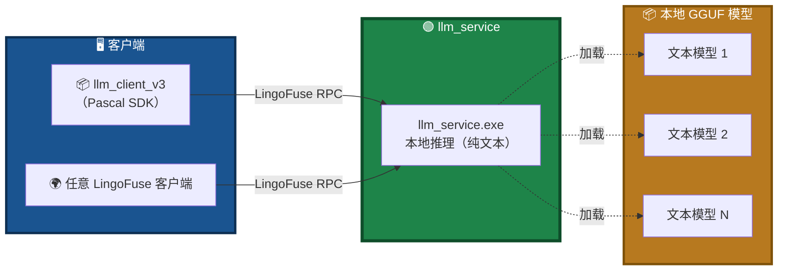
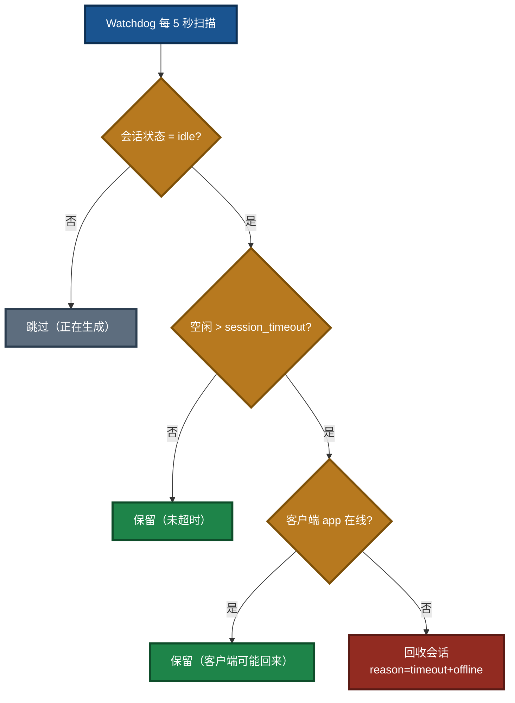
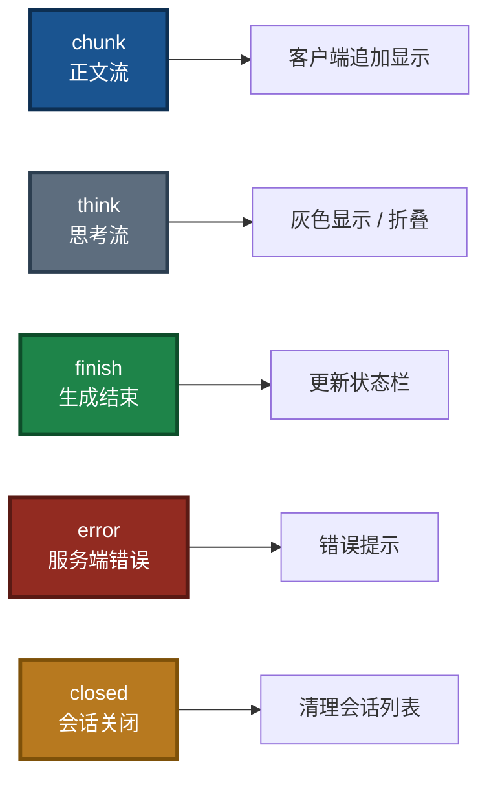

# LingoFuse LLM Service 命令行使用手册

> **适用程序**：`llm_service.exe`（Windows）/ `llm_service`（Linux）
> **文档版本**：v3.2（v3 架构重写版 · 目录对齐版）
> **最后更新**：2026-09-24
> **相关文档**（同目录）：
> - [`LingoFuse_LLM_Ecosystem_User_Guide.md`](LingoFuse_LLM_Ecosystem_User_Guide.md) — 生态总览
> - [`LingoFuse_LLM_Proxy_CLI_Guide.md`](LingoFuse_LLM_Proxy_CLI_Guide.md) — 代理命令行手册
> - [`LingoFuse_LLM_Proxy_Tool_CLI_Guide.md`](LingoFuse_LLM_Proxy_Tool_CLI_Guide.md) — LTB 命令行手册
> - [`LingoFuse_LLM_Proxy_Compatibility_Guide.md`](LingoFuse_LLM_Proxy_Compatibility_Guide.md) — 后端兼容清单
> - [`LingoFuse_Pascal_Complete_Guide.md`](LingoFuse_Pascal_Complete_Guide.md) — Pascal 核心层完整指南
> - [`NVIDIA-Nemotron-3-Nano-Omni-30B-A3B-Reasoning-UD-IQ4_XS.md`](NVIDIA-Nemotron-3-Nano-Omni-30B-A3B-Reasoning-UD-IQ4_XS.md) — 推荐模型下载

---

## ⚠️ 阅读前必读：能力边界

**在阅读本文之前，请先理解以下三条关键事实**：

| # | 事实 | 说明 |
|:-:|------|------|
| 1 | **`llm_service` 是纯文本推理服务** | 本地推理路径（llama.cpp）**不支持多模态**。**没有** `--mmproj` 参数。 |
| 2 | **多模态请用 `llm_proxy` / `llm_proxy_tool`** | 由 **VLM 后端**（如 LM Studio）加载多模态模型 + mmproj，代理**原样转发**图片附件。 |
| 3 | **`llm_service` 是 v3 的辅助验证工具** | 它仍然可以**独立使用**（不需要信标、不需要工具提供者、不需要 MCP），但不再是"三种核心服务端之一"。 |

> **为什么 `llm_service` 不支持多模态？** 本地推理路径的视觉编码器加载尚未实现。这是 v3 的已知边界。图片问答请改用 `llm_proxy` / LTB 转发到 VLM 后端（见 [`LingoFuse_LLM_Proxy_CLI_Guide.md`](LingoFuse_LLM_Proxy_CLI_Guide.md) 第 5.5 节与 [`LingoFuse_LLM_Proxy_Tool_CLI_Guide.md`](LingoFuse_LLM_Proxy_Tool_CLI_Guide.md) 第 4.5 节）。

---

## 一、程序定位

`llm_service.exe` 是一个 **基于 LingoFuse 服务网格的多会话流式本地推理服务**。它加载本地 GGUF 模型，暴露标准 LingoFuse API，供客户端或网关调用。

### v3 中的定位变化

v3 中，`llm_service` **不再是"三种核心服务端之一"**，而是：

| 角色 | 说明 |
|------|------|
| **辅助验证工具** | 用于**验证某个 GGUF 模型是否适合你的任务** |
| **可嵌入的小工具** | 可以**脱离整个 pasAgent 生态**，单独作为"本地 LLM 助手"嵌入到你的 Pascal 项目 |

> 💡 **生产环境推荐**：用 `llm_proxy` / `llm_proxy_tool` 转发到 LM Studio 等成熟后端。
> **`llm_service` 的价值在于**：完全离线、深度嵌入、快速验证、纯文本任务。

### 图 1：llm_service 在生态中的位置



### 与其他 LLM 服务端的关系

`llm_service`、`llm_proxy`、`llm_proxy_tool` 是**兄弟服务端**，默认都注册在 `ipc:llm_service` / `LLM_Service` 上。

> **三者同一时刻只能运行一个**。若要共存，必须为每个设置不同的 `--endpoint` 和 `--app-name`。

**运行环境**：Windows / Linux。
**依赖**：`LingoFuse64.dll` / `liblingofuse.so`（位于系统 PATH 或 exe 同目录）。

---

## 二、快速开始

### 2.1 最小启动

前提：当前工作目录下有 `NVIDIA-Nemotron-3.5-Lightning-30B-A3B-UD-IQ4_NL.gguf` 模型文件，或通过 `--model-path` 指定。

**Windows（PowerShell）**：

```powershell
cd C:\Temp\temp2
.\llm_service.exe
```

**Linux（Shell）**：

```bash
cd /opt/llm
./llm_service
```

### 2.2 显存/内存不足时的替代方案

若本地加载 20 GB 模型资源不足，可改用 `llm_proxy.exe` 转发到 LM Studio：

```powershell
.\llm_proxy.exe --backend-url http://127.0.0.1:1234/v1
```

此时无需 `llm_service.exe` 和模型文件。详见 [`LingoFuse_LLM_Proxy_CLI_Guide.md`](LingoFuse_LLM_Proxy_CLI_Guide.md)。

---

## 三、运行前提

### 3.1 模型文件必须就位

服务默认从**当前工作目录**加载**固定路径**：

```
NVIDIA-Nemotron-3.5-Lightning-30B-A3B-UD-IQ4_NL.gguf
```

**要求**：

- 文件名大小写严格匹配，不要重命名。
- 文件必须与 `llm_service.exe` 位于同一目录（或通过 `--model-path` 指定路径）。
- 文件完整，约 **19.7 GB**。

未找到时服务将报错退出：

```
[ERROR] Model file not found: ./NVIDIA-Nemotron-3.5-Lightning-30B-A3B-UD-IQ4_NL.gguf
```

> **注意**：
>
> - `llm_service.exe` **不会扫描同目录下的所有 gguf 文件**。默认只加载上述固定文件名；如使用其他模型，**必须**通过 `--model-path` 显式指定。
> - 若要用**推荐的多模态 Omni 模型**（`NVIDIA-Nemotron-3-Nano-Omni-30B-A3B-Reasoning-UD-IQ4_XS.gguf`）做**纯文本**推理，**必须显式传 `--model-path`**。
> - **模型下载**：请参考 [`NVIDIA-Nemotron-3-Nano-Omni-30B-A3B-Reasoning-UD-IQ4_XS.md`](NVIDIA-Nemotron-3-Nano-Omni-30B-A3B-Reasoning-UD-IQ4_XS.md)。

### 3.2 动态库必须可加载

启动时首先加载 LingoFuse 动态库。成功时打印：

```
[INFO] Successfully loaded from system PATH: LingoFuse64.dll
```

失败时请检查：

- `LingoFuse64.dll` / `liblingofuse.so` 是否在系统 `PATH`，或在 exe 同目录。
- 动态库位数与 exe 一致（64 位 vs 32 位）。
- 依赖的 `z_ipc_64.dll` 是否可被找到。
- 是否安装了 **VC++ Redistributable（VS2022）**（预编译 DLL 需要）。

### 3.3 工作目录建议

建议在**放模型和 exe 的目录**里打开命令行，这样默认路径就能生效。

**Windows（PowerShell）**：

```powershell
cd C:\Temp\temp2
.\llm_service.exe
```

**Linux（Shell）**：

```bash
cd /opt/llm
./llm_service
```

---

## 四、启动流程一览

### 图 2：启动阶段


### 图 3：请求处理流程


启动成功后打印状态横幅（字段与源码 `print_service_status()` 一致）：

```
======================================================================
 LINGOFUSE LLM SERVICE STATUS
======================================================================
  Server kind             : service
  Backend                 : llama_cpp
  Model path              : ./NVIDIA-Nemotron-3.5-Lightning-30B-A3B-UD-IQ4_NL.gguf
  Context size requested  : auto (model maximum)
  Context size actual     : 32768
  Default max tokens      : 4096
  CPU threads             : 6
  GPU layers offloaded    : -1
  Thinking (global)       : False
  Thinking (DEFAULT_)     : False
----------------------------------------------------------------------
  LingoFuse endpoint      : ipc:llm_service
  Service app name        : LLM_Service
  Notify API name         : llm_stream
  Session idle timeout(s) : 600
  Queue max size          : 256
  Max sessions            : 1024
  Max history per session : 512
  Log level               : 1
----------------------------------------------------------------------
  Chat template           : (none - create_chat_completion fallback)
  Reasoning budget msg    : "(empty)"
  Attachments             : text only (image requires VLM)
  Vision                  : disabled (local VLM path not implemented - V2 TODO)
----------------------------------------------------------------------
  Watchdog policy         : reclaim only when idle past the timeout AND the
                            client app is offline
----------------------------------------------------------------------
  Supported APIs          : generate, create_session, close_session, ...
  Unsupported APIs        : (none)
======================================================================
[INFO] LLM Service is running on ipc:llm_service
[INFO] Press Ctrl+C to stop...
```

---

## 五、参数详解

### 5.1 模型与推理参数

#### `--model-path PATH`

- **作用**：指定 GGUF 模型文件路径。
- **默认**：`./NVIDIA-Nemotron-3.5-Lightning-30B-A3B-UD-IQ4_NL.gguf`
- **环境变量**：`LLM_MODEL_PATH`

**Windows（PowerShell）**：

```powershell
.\llm_service.exe --model-path D:\models\qwen2.5-7b.gguf
```

**Linux（Shell）**：

```bash
./llm_service --model-path /data/models/qwen2.5-7b.gguf
```

#### `--context-size N`

- **作用**：上下文窗口大小（token 数）。
- **默认**：`0`（使用模型最大支持上下文）
- **环境变量**：`LLM_CONTEXT_SIZE`

**取值说明**：

- `0`：使用模型的最大上下文，具体值由模型元数据决定，并在启动横幅中显示为 `Context size actual`。
- 正数 `N`：强制使用 N tokens 的上下文窗口。可降低内存占用，但会限制对话长度。

**Windows（PowerShell）**：

```powershell
# 使用模型最大上下文（默认）
.\llm_service.exe --context-size 0

# 显式指定 8192
.\llm_service.exe --context-size 8192
```

**Linux（Shell）**：

```bash
# 使用模型最大上下文（默认）
./llm_service --context-size 0

# 显式指定 8192
./llm_service --context-size 8192
```

#### `--max-tokens N`

- **作用**：单次生成的最大 token 数（默认上限，可被请求级 `options.max_tokens` 覆盖）。
- **默认**：`4096`
- **环境变量**：`LLM_MAX_TOKENS`

**Windows（PowerShell）**：

```powershell
.\llm_service.exe --max-tokens 2048
```

**Linux（Shell）**：

```bash
./llm_service --max-tokens 2048
```

#### `--threads N`

- **作用**：CPU 推理线程数。
- **默认**：`6`
- **环境变量**：`LLM_THREADS`
- **建议**：设为**物理核心数的一半**（避免风扇狂转/温度过高）。

**Windows（PowerShell）**：

```powershell
.\llm_service.exe --threads 8
```

**Linux（Shell）**：

```bash
./llm_service --threads 8
```

#### `--gpu-layers N`

- **作用**：卸载到 GPU 的模型层数。
- **默认**：`-1`（全部卸载到 GPU；GPU 不可用时回退 CPU）
- **环境变量**：`LLM_GPU_LAYERS`
- **取值**：
  - `-1` = 全部层卸载到 GPU（有独显时性能最佳）
  - `0` = 纯 CPU 模式
  - `N > 0` = 卸载前 N 层到 GPU（显存不足时逐步下调）

**Windows（PowerShell）**：

```powershell
# 纯 CPU
.\llm_service.exe --gpu-layers 0

# 全部卸载到 GPU
.\llm_service.exe --gpu-layers -1

# 显存不足时逐步下调
.\llm_service.exe --gpu-layers 20
```

**Linux（Shell）**：

```bash
# 纯 CPU
./llm_service --gpu-layers 0

# 全部卸载到 GPU
./llm_service --gpu-layers -1

# 显存不足时逐步下调
./llm_service --gpu-layers 20
```

#### `--system-message "MESSAGE"`

- **作用**：设置默认 system message（对新会话生效，可在运行时通过 `set_system_message` 修改）。
- **默认**：`Before answering, briefly list your reasoning steps using numbered bullets. Then give the final answer. Do not use Markdown.`
- **环境变量**：`LLM_SYSTEM_MESSAGE`

**Windows（PowerShell）**：

```powershell
.\llm_service.exe --system-message "You are a helpful assistant."
```

**Linux（Shell）**：

```bash
./llm_service --system-message "You are a helpful assistant."
```

### 5.2 多模态支持状态

> ⚠️ **`llm_service` 当前不支持多模态（图片问答）**。

**原因**：多模态需要视觉编码器（mmproj / 视觉塔）的支持，本地推理路径尚未实现。`llm_service` **没有** `--mmproj` 参数。

**替代方案**：

| 需求 | 推荐路径 |
|------|---------|
| 需要**图片问答** | 用 `llm_proxy` / `llm_proxy_tool` 转发到支持多模态的后端（如 LM Studio 加载 VLM） |
| 需要**纯文本离线** | 继续用 `llm_service` |

**示例**：用 `llm_proxy_tool` 转发到 LM Studio 的多模态模型：

```powershell
.\llm_proxy_tool.exe `
  --backend-url http://127.0.0.1:1234/v1 `
  --backend-model "qwen2-vl-7b-instruct" `
  --vision
```

> **客户端行为**：若 `llm_service` 收到携带 `attachments` 数组的请求，其中**只有文本附件**会被接受并合并到用户消息；**图片附件会被明确拒绝**（返回 `code: -1`，错误信息提示本地 VLM 路径未实现）。
>
> 这与 `llm_proxy` / LTB 的行为不同：后者**原样转发**图片，由后端决定是否支持。

### 5.3 LingoFuse 服务参数

#### `--endpoint ADDRESS`

- **作用**：LingoFuse 服务端点。IPC 用于同机通信，TCP 用于跨机通信。
- **默认**：`ipc:llm_service`
- **环境变量**：`LINGOFUSE_ENDPOINT`

**Windows（PowerShell）**：

```powershell
# 同机 IPC（默认）
.\llm_service.exe --endpoint ipc:llm_service

# 跨机 TCP（监听所有网卡）
.\llm_service.exe --endpoint 0.0.0.0:9898
```

**Linux（Shell）**：

```bash
# 同机 IPC（默认）
./llm_service --endpoint ipc:llm_service

# 跨机 TCP（监听所有网卡）
./llm_service --endpoint 0.0.0.0:9898
```

#### `--app-name NAME`

- **作用**：LingoFuse 应用名（客户端通过这个名字查找服务）。
- **默认**：`LLM_Service`
- **环境变量**：`LINGOFUSE_APP_NAME`
- **注意**：若要与 `llm_proxy` / `llm_proxy_tool` 同机共存，**必须**同时改 `--endpoint` 与 `--app-name`。

**Windows（PowerShell）**：

```powershell
.\llm_service.exe --app-name LLM_Service --endpoint ipc:llm_service
```

**Linux（Shell）**：

```bash
./llm_service --app-name LLM_Service --endpoint ipc:llm_service
```

#### `--notify-api NAME`

- **作用**：流式 token 推送使用的 Notify API 名。
- **默认**：`llm_stream`
- **环境变量**：`LINGOFUSE_NOTIFY_API`
- **注意**：客户端必须用**同一个名字**注册 Notify 回调才能收到流。除非有特殊需求，一般不改。

#### `--timeout MS`

- **作用**：Call API 的超时（毫秒），**不影响流式推送**。
- **默认**：`5000`
- **环境变量**：`LINGOFUSE_TIMEOUT_MS`

**Windows（PowerShell）**：

```powershell
.\llm_service.exe --timeout 10000
```

**Linux（Shell）**：

```bash
./llm_service --timeout 10000
```

### 5.4 服务行为参数

#### `--session-timeout SECONDS`

- **作用**：会话空闲超时（秒）。**同时满足**以下两个条件时，会话才被 watchdog 回收：
  1. 空闲时长超过此值；
  2. 会话所属的客户端应用已离线。
- **默认**：`600`（10 分钟）
- **环境变量**：`LLM_SESSION_TIMEOUT`

**Windows（PowerShell）**：

```powershell
# 快速回收
.\llm_service.exe --session-timeout 300

# 长驻会话
.\llm_service.exe --session-timeout 3600
```

**Linux（Shell）**：

```bash
# 快速回收
./llm_service --session-timeout 300

# 长驻会话
./llm_service --session-timeout 3600
```

> **双条件回收策略说明**：客户端偶尔会断开重连（笔记本休眠、网络抖动、客户端重启）。如果仅按空闲时长回收，客户端只要暂停超过阈值就会丢失整个对话历史。加上"客户端离线"这一条件后，只要客户端还在线，会话就一直保留；只有当客户端真正离线（进程被杀、机器关机）且空闲超时，会话才被回收。

### 图 4：会话回收双条件判断



> **对比**：`llm_proxy.exe` / `llm_proxy_tool.exe` 使用**单条件**回收（仅超时）。原因：代理不持有模型 KV cache，会话仅持有消息历史，回收成本低。

#### `--queue-max-size N`

- **作用**：待处理生成任务的最大排队数。达到上限后新请求会被拒绝。
- **默认**：`256`
- **环境变量**：`LLM_QUEUE_MAX_SIZE`

**Windows（PowerShell）**：

```powershell
.\llm_service.exe --queue-max-size 512
```

**Linux（Shell）**：

```bash
./llm_service --queue-max-size 512
```

#### `--max-sessions N`

- **作用**：最大并发会话数。达到上限后新建会话会被拒绝。
- **默认**：`1024`
- **环境变量**：`LLM_MAX_SESSIONS`

**Windows（PowerShell）**：

```powershell
# 单机限流
.\llm_service.exe --max-sessions 64
```

**Linux（Shell）**：

```bash
# 单机限流
./llm_service --max-sessions 64
```

#### `--max-history N`

- **作用**：每个会话保留的最大消息数。超出的最老消息会被丢弃。
- **默认**：`512`
- **环境变量**：`LLM_MAX_HISTORY`

**Windows（PowerShell）**：

```powershell
.\llm_service.exe --max-history 1024
```

**Linux（Shell）**：

```bash
./llm_service --max-history 1024
```

### 5.5 聊天模板与推理参数

#### `--chat-template PATH`

- **作用**：指定 Jinja2 聊天模板文件路径。
- **默认**：（空）使用模型内置模板
- **环境变量**：`LLM_CHAT_TEMPLATE`

**行为说明**：

1. 若指定此参数 / 环境变量为**非空路径**，则**加载该文件**。文件不存在时，**报错退出**。
2. 若为空（默认），**不加载任何模板文件**，使用**模型内置的 chat template**。**不再自动搜索目录**。

> **历史变化**：v2 早期版本会在脚本目录、父目录、当前工作目录中自动搜索 `chat_template.jinja`。**现已移除自动搜索**，仅支持显式路径。这是为了避免"磁盘上有同名文件，但用户并不想用它"造成的混淆。

**Windows（PowerShell）**：

```powershell
.\llm_service.exe --chat-template .\chat_template.jinja
```

**Linux（Shell）**：

```bash
./llm_service --chat-template ./chat_template.jinja
```

#### `--reasoning-budget-message "TEXT"`

- **作用**：在思考段开头插入的引导文本，用于引导模型用特定语言思考。
- **默认**：`""`（**空字符串**）
- **环境变量**：`LLM_REASONING_BUDGET_MESSAGE`
- **模板变量名**：`reasoning_budget_message`

> **重要**：此参数**仅在提供了自定义 `--chat-template`** 且模板中引用了 `reasoning_budget_message` 变量时才生效。使用模型内置模板时，该参数会被忽略。
>
> **默认是空字符串**——如果你希望模型用特定语言思考，请显式传入该参数，例如：
>
> ```powershell
> .\llm_service.exe --chat-template .\chat_template.jinja --reasoning-budget-message "好的，我用简体中文来思考。禁止使用英文。"
> ```

### 5.6 Thinking 模式

**默认行为**：**不启用 thinking**（`DEFAULT_THINKING = False`）。

**优先级**（从高到低）：

1. **单次请求**：`generate` 的 `options.thinking`
2. **命令行**：`--thinking` / `--no-thinking`
3. **环境变量**：`LLM_THINKING`（`1` / `true` / `yes` / `0` / `false` / `no` / `on` / `off`）
4. **模块常量**：`DEFAULT_THINKING`

**Windows（PowerShell）**：

```powershell
# 显式启用（覆盖一切低优先级设置）
.\llm_service.exe --thinking

# 显式禁用（覆盖环境变量）
.\llm_service.exe --no-thinking
```

**Linux（Shell）**：

```bash
# 显式启用
./llm_service --thinking

# 显式禁用
./llm_service --no-thinking
```

> **Thinking 由提示词层面控制**：`llm_service` 在渲染 prompt 时，根据 effective thinking 值，在 prompt 末尾强制拼接 `<think>` / `</think>` 标记。这是与 `llm_proxy` / LTB 的关键区别——**后者不做策略，只转发后端的 `reasoning_content`**。

### 5.7 日志参数

#### `--log-level {0,1,2}`

- **作用**：日志详细程度。
  - `0` = quiet：抑制 chunk 日志和警告
  - `1` = normal：显示每个 chunk 的推送日志，抑制警告（默认）
  - `2` = debug：显示所有日志，包括"目标客户端不可达"等警告
- **默认**：`1`
- **环境变量**：`LLM_LOG_LEVEL`

**Windows（PowerShell）**：

```powershell
.\llm_service.exe --log-level 1
```

**Linux（Shell）**：

```bash
./llm_service --log-level 1
```

#### `--debug`

- **作用**：等价于 `--log-level 2`。
- **环境变量**：`LLM_DEBUG`（`1` / `true` / `yes`）

**Windows（PowerShell）**：

```powershell
.\llm_service.exe --debug
```

**Linux（Shell）**：

```bash
./llm_service --debug
```

#### `--quiet`

- **作用**：等价于 `--log-level 0`。
- **环境变量**：`LLM_QUIET`（`1` / `true` / `yes`）

**Windows（PowerShell）**：

```powershell
.\llm_service.exe --quiet
```

**Linux（Shell）**：

```bash
./llm_service --quiet
```

**优先级**：`--debug` > `--quiet` > `--log-level`。

---

## 六、环境变量一览

所有命令行参数均可用同名环境变量替代。适合在启动脚本或系统服务中统一配置。

| 环境变量 | 对应参数 | 示例值 |
|----------|----------|--------|
| `LLM_MODEL_PATH` | `--model-path` | `D:\models\qwen.gguf` |
| `LLM_CONTEXT_SIZE` | `--context-size` | `8192` |
| `LLM_MAX_TOKENS` | `--max-tokens` | `2048` |
| `LLM_THREADS` | `--threads` | `8` |
| `LLM_GPU_LAYERS` | `--gpu-layers` | `0` |
| `LLM_SYSTEM_MESSAGE` | `--system-message` | `You are...` |
| `LINGOFUSE_ENDPOINT` | `--endpoint` | `ipc:llm_service` |
| `LINGOFUSE_APP_NAME` | `--app-name` | `LLM_Service` |
| `LINGOFUSE_NOTIFY_API` | `--notify-api` | `llm_stream` |
| `LINGOFUSE_TIMEOUT_MS` | `--timeout` | `10000` |
| `LLM_SESSION_TIMEOUT` | `--session-timeout` | `120` |
| `LLM_QUEUE_MAX_SIZE` | `--queue-max-size` | `256` |
| `LLM_MAX_SESSIONS` | `--max-sessions` | `1024` |
| `LLM_MAX_HISTORY` | `--max-history` | `512` |
| `LLM_CHAT_TEMPLATE` | `--chat-template` | `./chat_template.jinja` |
| `LLM_REASONING_BUDGET_MESSAGE` | `--reasoning-budget-message` | `Think in Chinese.` |
| `LLM_THINKING` | `--thinking` / `--no-thinking` | `1` / `0` |
| `LLM_LOG_LEVEL` | `--log-level` | `1` |
| `LLM_DEBUG` | `--debug` | `1` / `true` / `yes` |
| `LLM_QUIET` | `--quiet` | `1` / `true` / `yes` |

### 6.1 Windows（PowerShell）

```powershell
$env:LLM_GPU_LAYERS = "0"
$env:LLM_THREADS = "8"
.\llm_service.exe
```

**永久生效**（写入用户环境变量）：

```powershell
[System.Environment]::SetEnvironmentVariable("LLM_GPU_LAYERS", "0", "User")
```

### 6.2 Linux（Shell）

```bash
export LLM_GPU_LAYERS=0
export LLM_THREADS=8
./llm_service
```

**永久生效**（写入 `~/.bashrc`）：

```bash
echo 'export LLM_GPU_LAYERS=0' >> ~/.bashrc
echo 'export LLM_THREADS=8' >> ~/.bashrc
source ~/.bashrc
```

**优先级**：命令行参数 > 环境变量 > 内置默认值。

---

## 七、完整使用场景

### 场景 1：CPU 纯离线启动（无独显）

**Windows（PowerShell）**：

```powershell
.\llm_service.exe `
  --gpu-layers 0 `
  --threads 8 `
  --context-size 8192 `
  --quiet
```

**Linux（Shell）**：

```bash
./llm_service \
  --gpu-layers 0 \
  --threads 8 \
  --context-size 8192 \
  --quiet
```

**要点**：

- 6~14 tokens/s（取决于 CPU）。
- 20 GB 模型需 32 GB 以上内存，可适当降低上下文。

### 场景 2：GPU 加速（默认全卸载）

**Windows（PowerShell）**：

```powershell
.\llm_service.exe `
  --gpu-layers -1 `
  --threads 4
```

**Linux（Shell）**：

```bash
./llm_service \
  --gpu-layers -1 \
  --threads 4
```

**要点**：

- 20~40 tokens/s（取决于显卡）。
- `--threads 4`：GPU 推理时 CPU 线程数影响不大。

### 场景 3：显存不足时的渐进式调整

**Windows（PowerShell）**：

```powershell
# 先试 20 层
.\llm_service.exe --gpu-layers 20

# 若仍 OOM，降到 10 层
.\llm_service.exe --gpu-layers 10

# 最后回退纯 CPU
.\llm_service.exe --gpu-layers 0
```

**Linux（Shell）**：

```bash
# 先试 20 层
./llm_service --gpu-layers 20

# 若仍 OOM，降到 10 层
./llm_service --gpu-layers 10

# 最后回退纯 CPU
./llm_service --gpu-layers 0
```

### 场景 4：与 llm_proxy 同机共存

**Windows（PowerShell）**：

```powershell
# 终端 1：llm_service 用默认端点
.\llm_service.exe `
  --endpoint ipc:llm_service `
  --app-name LLM_Service

# 终端 2：llm_proxy 换用其他端点
.\llm_proxy.exe `
  --endpoint ipc:llm_proxy `
  --app-name LLM_Proxy `
  --backend-url http://127.0.0.1:1234/v1
```

**Linux（Shell）**：

```bash
# 终端 1：llm_service 用默认端点
./llm_service \
  --endpoint ipc:llm_service \
  --app-name LLM_Service

# 终端 2：llm_proxy 换用其他端点
./llm_proxy \
  --endpoint ipc:llm_proxy \
  --app-name LLM_Proxy \
  --backend-url http://127.0.0.1:1234/v1
```

**要点**：

- 二者**不能**共享同一个 `--endpoint` 和 `--app-name`。
- 客户端连接时相应调整 `--endpoint` 与 `--server-app`。

### 场景 5：跨机部署（TCP 模式）

**GPU 工作站（服务端）**：

```powershell
.\llm_service.exe `
  --endpoint 0.0.0.0:9898 `
  --app-name LLM_Service
```

**弱机笔记本（客户端）**：

```powershell
.\llm_test.exe --endpoint 192.168.1.100:9898 --server-app LLM_Service
```

**要点**：

- 防火墙需放行 `9898` 端口。
- 客户端通过 `--endpoint` 指定远程 IP。

### 场景 6：日志调试

```powershell
.\llm_service.exe --debug
```

- 打印每个 chunk 的 JSON、客户端可达性警告、watchdog 决策日志。
- 仅用于排查，生产环境请用 `--quiet`。

### 场景 7：自定义系统提示词

```powershell
.\llm_service.exe --system-message "你是一个代码声明转换助手，只转换声明部分，禁止 markdown 输出。"
```

### 场景 8：把 llm_service 嵌入自己的项目

`llm_service` 可以**脱离 pasAgent 生态单独使用**。典型用法：

```
1. 只引入 llm_service.exe + llm_client_v3.pas
2. 在你的 Pascal 项目中：
   - 启动 llm_service 进程（或让它常驻）
   - 通过 TLLMClient 连接 ipc:llm_service
   - 调 Generate / CreateSession 与 AI 对话
3. 不需要信标、不需要工具提供者、不需要 MCP
```

**Pascal 客户端代码**：

```pascal
var
  LLM: TLLMClient;
  sid, err: string;
begin
  LLM := TLLMClient.Create('LLM_Service', 'ipc:llm_service', 10000);
  LLM.OnChunk := Do_LLM_Chunk;
  if not LLM.Connect(err) then Exit;
  if not LLM.Generate('你好', '', sid, err) then Exit;
  // 异步接收流式输出
end;
```

> **SDK 位置**：`src\llm_client_v3.pas`（本仓库）。详见 [`llm_client_v3.md`](llm_client_v3.md)。

### 场景 9：验证 LLM 服务是否正常

启动 `llm_service.exe` 后，在另一个窗口执行：

```powershell
.\llm_test.exe
```

进入交互式命令行，输入问题测试，`/quit` 退出。

### 场景 10：自定义聊天模板

**Windows（PowerShell）**：

```powershell
.\llm_service.exe `
  --chat-template .\chat_template.jinja `
  --reasoning-budget-message "好的，我用简体中文来思考。"
```

**Linux（Shell）**：

```bash
./llm_service \
  --chat-template ./chat_template.jinja \
  --reasoning-budget-message "好的，我用简体中文来思考。"
```

**要点**：

- 模板文件必须**显式提供**，不再自动搜索。
- `--reasoning-budget-message` 只在模板中引用了 `reasoning_budget_message` 变量时才生效。

---

## 八、运行时行为说明

### 8.1 多会话并发

每个 `generate` 请求独立 `session_id`、独立线程。多客户端并发**互不干扰**。每个会话的状态（`client_name`、`start_time`、`status`）由内部字典跟踪。

### 8.2 流式消息协议

服务端通过 `llm_stream` Notify API 推送以下结构化 JSON：

| 类型 | 字段 | 含义 |
|------|------|------|
| `chunk` | `session_id`, `text` | 正文流 |
| `think` | `session_id`, `text` | 思考流 |
| `finish` | `session_id`, `reason` | 生成结束 |
| `error` | `session_id`, `message` | 服务端错误 |
| `closed` | `session_id`, `reason` | 会话关闭 |

### 图 5：消息类型与客户端行为



### 8.3 退出

- 按 `Ctrl+C`：优雅退出，打印 `[Service] Shutting down...`，清理资源。
- 通过 `atexit` 确保 `cleanup()` 被调用。
- **不建议**直接关窗口或 `kill -9`，可能残留 IPC 队列。

---

## 九、故障排查

### Q1：启动报 `Model file not found`

**排查**：

**Windows（PowerShell）**：

```powershell
# 检查当前目录
Get-ChildItem *.gguf

# 或用绝对路径启动
.\llm_service.exe --model-path D:\models\NVIDIA-Nemotron-3.5-Lightning-30B-A3B-UD-IQ4_NL.gguf
```

**Linux（Shell）**：

```bash
# 检查当前目录
ls -lh *.gguf

# 或用绝对路径启动
./llm_service --model-path /data/models/NVIDIA-Nemotron-3.5-Lightning-30B-A3B-UD-IQ4_NL.gguf
```

### Q2：启动报 `Failed to load LingoFuse64.dll`

**解决**：

**Windows（PowerShell）**：

```powershell
# 把动态库所在目录加入临时 PATH
$env:PATH = "D:\LingoFuse\Binary;$env:PATH"
.\llm_service.exe
```

**Linux（Shell）**：

```bash
# 把动态库所在目录加入临时 LD_LIBRARY_PATH
export LD_LIBRARY_PATH=/opt/LingoFuse/Binary:$LD_LIBRARY_PATH
./llm_service
```

### Q3：显存不足（`CUDA out of memory`）

**解决**：

**Windows（PowerShell）**：

```powershell
# 逐步降低 GPU 层数
.\llm_service.exe --gpu-layers 20
.\llm_service.exe --gpu-layers 10
.\llm_service.exe --gpu-layers 0

# 或降低上下文
.\llm_service.exe --context-size 4096
```

**Linux（Shell）**：

```bash
# 逐步降低 GPU 层数
./llm_service --gpu-layers 20
./llm_service --gpu-layers 10
./llm_service --gpu-layers 0

# 或降低上下文
./llm_service --context-size 4096
```

### Q4：内存不足（纯 CPU 场景）

20 GB 模型 + KV cache 需要 32 GB 以上内存。若内存不足：

- 降低 `--context-size`（如 4096）。
- 改用 `llm_proxy.exe` 转发到 LM Studio（LM Studio 可在有独显的机器上运行）。

### Q5：CPU 太慢 / 风扇狂转

**解决**：

**Windows（PowerShell）**：

```powershell
# 减到物理核心数的一半
.\llm_service.exe --threads 4
```

**Linux（Shell）**：

```bash
# 减到物理核心数的一半
./llm_service --threads 4
```

### Q6：客户端收不到流

**排查顺序**：

1. 客户端是否用 `llm_stream` 注册了 Notify 回调？
2. `client_name` 是否在 `PrepareDone` 之后生成？
3. 服务端 `--notify-api` 是否被改过？
4. 服务端日志是否出现 `no found app(...)`？

**用 debug 日志排查**：

```powershell
.\llm_service.exe --debug
```

### Q7：`Context length exceeded`

**解决**：

```powershell
# 降低单次最大生成 token
.\llm_service.exe --max-tokens 2048

# 或调大上下文（注意内存占用）
.\llm_service.exe --context-size 16384
```

### Q8：端口 / IPC 队列被占用

**现象**：日志报 `Queue "llm_service0" is already occupied`。

**解决**：

```powershell
.\llm_service.exe --endpoint ipc:llm_service_2
```

### Q9：会话被意外回收

**排查**：检查 `--session-timeout` 设置是否过小，以及客户端是否长时间离线。

**日志特征**：

```
[Session xxx] Idle for 601.3s (> 600s) and client app '@__generate__@...' is offline; reclaiming session
[Session xxx] Closed (reason=timeout+offline)
```

若客户端实际在线但会话仍被回收，可能是 `check_app` 缓存延迟（约 3 秒）导致误判。可调大 `--session-timeout` 缓解。

### Q10：`llm_service` 启动后立刻退出

**排查**：

- 是否缺少模型文件（见 Q1）。
- 是否有另一个 `llm_service` / `llm_proxy` / `llm_proxy_tool` 已占用 `ipc:llm_service`（见 Q8）。
- 查看窗口中的错误信息。

### Q11：自定义 chat template 未生效

**排查**：

- 确认 `--chat-template` 路径非空且文件确实存在（缺文件会报错退出）。
- 确认**没有**依赖自动搜索功能（已移除）。
- 启动横幅的 `Chat template` 字段应显示你的模板路径；若显示 `(none - create_chat_completion fallback)`，说明模板未被加载。

### Q12：`--reasoning-budget-message` 未生效

**排查**：

- 该参数**只在提供了自定义 `--chat-template` 且模板中引用了 `reasoning_budget_message` 变量时才生效**。
- 使用模型内置模板时，该参数会被忽略。
- 默认值是**空字符串**——不传该参数时，模板中 `reasoning_budget_message` 变量为空。

### Q13：多模态图片问答怎么办？

**明确回答**：`llm_service` **不支持多模态**。

**替代方案**：

- 用 `llm_proxy` 或 `llm_proxy_tool`（LTB）转发到支持多模态的后端（如 LM Studio 加载 VLM）。
- LTB 额外支持**服务端工具执行**——如果你需要"看图 + 调工具"的组合能力，用 LTB。
- 参见 [`LingoFuse_LLM_Proxy_Tool_CLI_Guide.md`](LingoFuse_LLM_Proxy_Tool_CLI_Guide.md)。

### Q14：客户端把图片发给 `llm_service` 会怎样？

**行为**：`llm_service` **明确拒绝**携带**图片附件**的请求，返回 `code: -1`，错误信息提示"Image attachments are not supported by llm_service in this revision..."。

**原因**：能力矩阵 `vision=0`，且服务端在 `_handle_generate` 中主动检查并拒绝。

**客户端应该如何**：

- 若客户端连接的是 `llm_service`，不要发送图片附件。
- 若需要图片功能，切换到 `llm_proxy` / `llm_proxy_tool`。

---

## 十、启动参数速查

```
llm_service.exe [OPTIONS]        # Windows
./llm_service [OPTIONS]          # Linux

模型与推理
  --model-path PATH           GGUF 模型路径 (默认: ./NVIDIA-Nemotron-3.5-Lightning-...gguf)
  --context-size N            上下文窗口 token 数 (默认: 0=使用模型最大)
  --max-tokens N              单次最大生成 token 数 (默认: 4096)
  --threads N                 CPU 线程数 (默认: 6)
  --gpu-layers N              GPU 层数, -1=全部, 0=纯CPU (默认: -1)
  --system-message "MSG"      默认系统提示词

LingoFuse 服务
  --endpoint ADDR             服务端点 (默认: ipc:llm_service)
  --app-name NAME             应用名 (默认: LLM_Service)
  --notify-api NAME           流式通知 API 名 (默认: llm_stream)
  --timeout MS                Call 超时 ms (默认: 5000)

服务行为
  --session-timeout SEC       会话空闲超时秒 (默认: 600)
  --queue-max-size N          最大排队任务数 (默认: 256)
  --max-sessions N            最大并发会话数 (默认: 1024)
  --max-history N             每会话最大消息数 (默认: 512)

聊天模板与思考
  --chat-template PATH        自定义 Jinja2 聊天模板 (默认: 空, 使用模型内置)
  --reasoning-budget-message  思考段引导文本 (默认: 空; 仅在自定义模板中生效)
  --thinking / --no-thinking  显式启用/禁用 thinking (默认: False)

日志与调试
  --log-level {0,1,2}         日志级别 (默认: 1)
  --debug                     等价 --log-level 2
  --quiet                     等价 --log-level 0

环境变量与参数一一对应 (前缀 LLM_* 和 LINGOFUSE_*)

⚠️ 多模态（图片问答）不支持。请用 llm_proxy / llm_proxy_tool 转发到支持多模态的后端。
⚠️ 没有 --mmproj 参数；没有多模型配置功能。
```

---

## 十一、相关文档（同目录）

| 文档 | 说明 |
|------|------|
| [`LingoFuse_LLM_Ecosystem_User_Guide.md`](LingoFuse_LLM_Ecosystem_User_Guide.md) | 生态总览（四大核心应用组件 + 两条路径） |
| [`LingoFuse_LLM_Proxy_CLI_Guide.md`](LingoFuse_LLM_Proxy_CLI_Guide.md) | `llm_proxy.exe` 命令行手册（多模态转发） |
| [`LingoFuse_LLM_Proxy_Tool_CLI_Guide.md`](LingoFuse_LLM_Proxy_Tool_CLI_Guide.md) | `llm_proxy_tool.exe`（LTB）命令行手册（多模态转发 + 工具） |
| [`LingoFuse_LLM_Proxy_Compatibility_Guide.md`](LingoFuse_LLM_Proxy_Compatibility_Guide.md) | 支持的 250+ OpenAI 兼容后端清单 |
| [`LingoFuse_Pascal_Complete_Guide.md`](LingoFuse_Pascal_Complete_Guide.md) | Pascal 核心层完整指南（含踩坑知识库） |
| [`llm_client_v3.md`](llm_client_v3.md) | Pascal 客户端 SDK 文档 |

### 根目录相关文档

| 文档 | 说明 |
|------|------|
| [`../Pascal_Integration_Guide.md`](../Pascal_Integration_Guide.md) | Pascal 开发者切入指南 |
| [`../Build_Guide.md`](../Build_Guide.md) | 编译指南 |
| [`../readme.md`](../readme.md) | 项目总览 |

### 代码生成器

> ⚠️ **MCP-API 代码生成工具已独立到专用仓库：**
>
> ### 👉 [https://github.com/PassByYou888/LingoFuse-Tools](https://github.com/PassByYou888/LingoFuse-Tools)
>
> 一份声明 → **几十种目标语言的 API 接口**。声明规范、使用手册、生成器源码与预编译包均以该仓库为准。

---

**文档版本**：v3.2（v3 架构重写版 · 目录对齐版——移除失效引用 `LingoFuse_LLM_Pitfalls_For_AI.md` / `LingoFuse_LLM_Service_Work_Summary.md`；P8-3 引用改为直接指向 `LingoFuse_LLM_Proxy_CLI_Guide.md` 第 5.5 节与 `LingoFuse_LLM_Proxy_Tool_CLI_Guide.md` 第 4.5 节；MCP-API 生成器统一指向 [LingoFuse-Tools](https://github.com/PassByYou888/LingoFuse-Tools)；对齐实际仓库文档清单）

**维护者**：LingoFuse-pasAgent 团队
**反馈**：问题提 Issue，急事加 Q（600585）