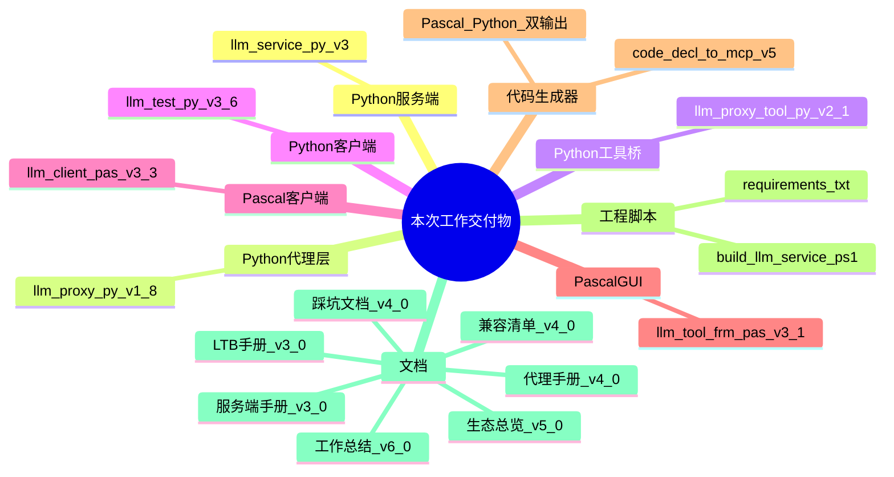
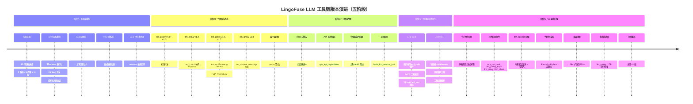
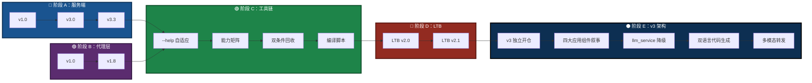
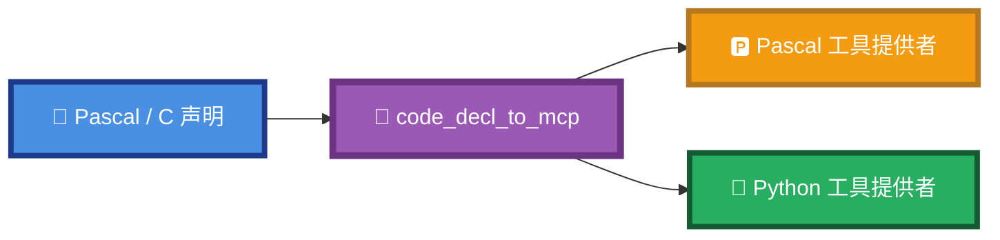
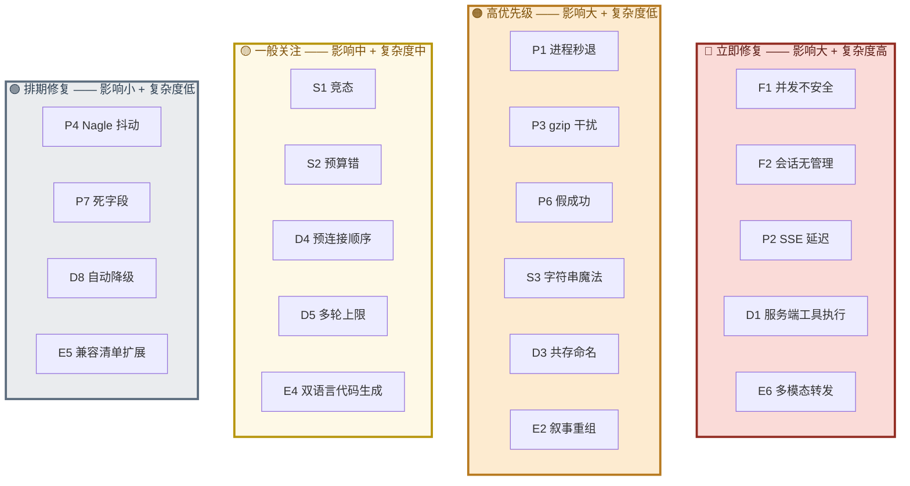
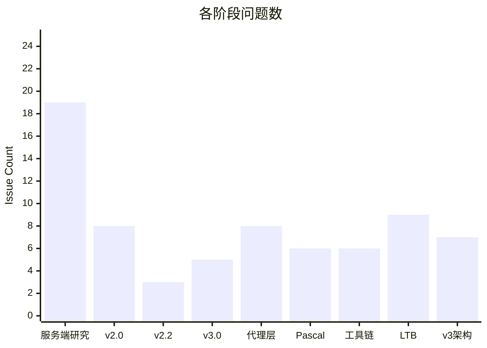
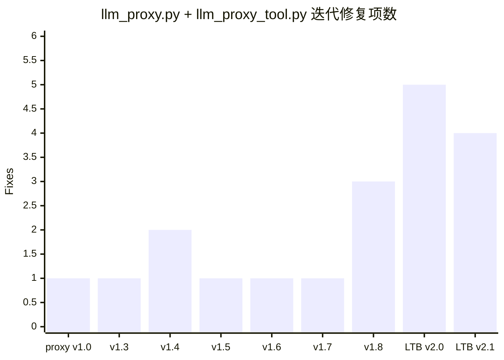
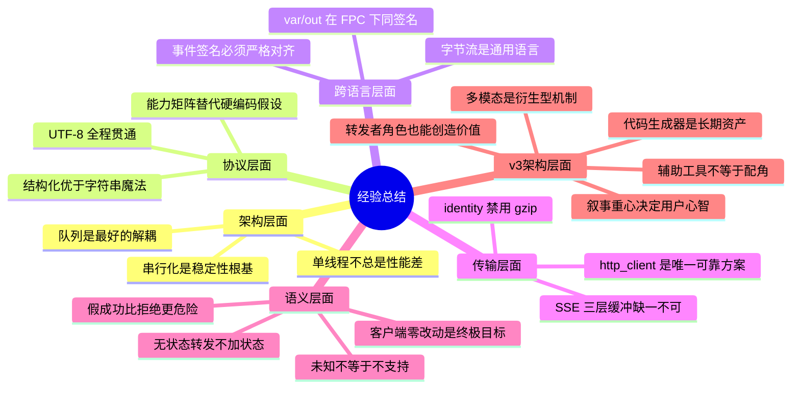
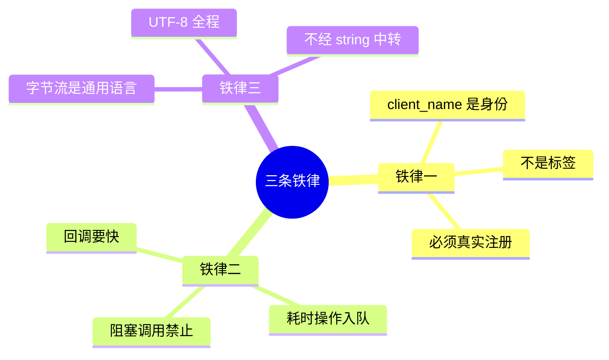
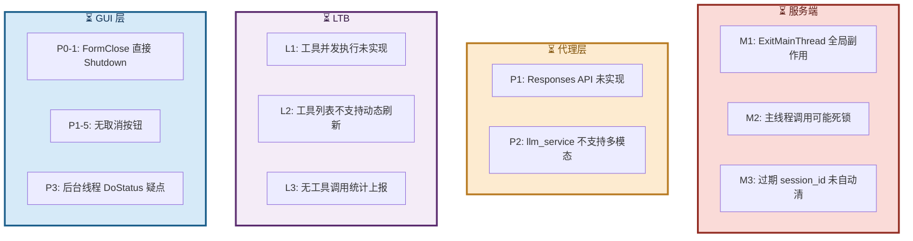

# LingoFuse LLM 工具链工作总结

> **文档路径**：`src/LingoFuse_LLM_Service_Work_Summary.md`
> **文档版本**：v6.0（v3 架构重写版）
> **涵盖周期**：2026-08-31 ~ 2026-09-17
> **涉及组件**：Python 服务端、Python 代理层、Python 工具桥（LTB）、Python 客户端、Pascal 客户端、Pascal GUI、工程脚本、全套文档
> **相关文档**（同目录）：
> - [`LingoFuse_LLM_Ecosystem_User_Guide.md`](LingoFuse_LLM_Ecosystem_User_Guide.md) — 生态总览
> - [`LingoFuse_LLM_Service_CLI_guide.md`](LingoFuse_LLM_Service_CLI_guide.md) — 本地推理服务手册
> - [`LingoFuse_LLM_Proxy_CLI_Guide.md`](LingoFuse_LLM_Proxy_CLI_Guide.md) — 纯转发代理手册
> - [`LingoFuse_LLM_Proxy_Tool_CLI_Guide.md`](LingoFuse_LLM_Proxy_Tool_CLI_Guide.md) — LTB 命令行手册
> - [`LingoFuse_LLM_Proxy_Compatibility_Guide.md`](LingoFuse_LLM_Proxy_Compatibility_Guide.md) — 后端兼容清单
> - [`LingoFuse_LLM_Pitfalls_For_AI.md`](LingoFuse_LLM_Pitfalls_For_AI.md) — 踩坑大全

**本次更新（v6.0）** 修正内容：
- **新增阶段 E**（v3 架构升级）：2026-09-14 ~ 2026-09-17，覆盖 v3 独立开仓、四大应用组件叙事、`llm_service` 定位调整、代码生成器双语言输出、兼容清单扩展、多模态转发路径。
- **时间线**从四阶段扩展为**五阶段**。
- **经验总结**新增 v3 架构决策相关条目。
- **交付物清单**更新为 v3 最终状态。
- **移除**：`mcp_api_tool_doubao_guide.md`、`Dependency_Installation_Guide.md`、代码生成器文档、Pascal 完整指南的引用。
- **移除**："保姆级"字样。
- 全文版本号统一至 2026-09-17 实际值。

---

## 阅读引导

本文档是**版本演进与架构决策的历史记录**。如果你是：

- **想了解工具链全貌** → 读第一章「工作概览」和第二章「时间线」
- **想知道每个阶段做了什么** → 读第三、四、五、六章（服务端 / 代理层 / 工具执行 / v3 架构）
- **想了解缺陷修复历程** → 读第七章
- **想了解协议演进** → 读第八章
- **想了解遗留问题** → 读第十九章
- **想直接上手** → 请转向 [`LingoFuse_LLM_Ecosystem_User_Guide.md`](LingoFuse_LLM_Ecosystem_User_Guide.md)

---

## 一、工作概览

本次工作围绕 **LingoFuse LLM 工具链** 展开，覆盖 **Python 服务端 / 代理层 / 工具桥 / 客户端** 与 **Pascal 客户端 / GUI** 两大语言生态，经历**五个主要阶段**：

1. **阶段 A（8/31 ~ 9/10）—— 服务端重构**
   把最初一个**单会话、无状态、串行**的 LLM 网关，升级为**多会话、持久化、结构化协议**的工业级组件（`llm_service.py` v3.0）。
2. **阶段 B（9/11 ~ 9/13）—— 代理层与生态**
   新增 **`llm_proxy.py`** —— 一个无状态转发器，把 LingoFuse 二进制 RPC 桥接到任何 OpenAI 兼容 HTTP 后端，并同步升级所有客户端与文档。
3. **阶段 C（9/13 ~ 9/14）—— 工具链收尾**
   统一四个 Python 工具的 `--help` 自适应；引入**跨语言 API 能力矩阵机制**；升级会话回收为**双条件判断**；一次性编译 EXE 的脚本；补齐依赖清单与兼容性指南；对所有交付文件做交叉审查。
4. **阶段 D（9/14）—— 代理层工具执行（LTB 引入）**
   新增 **`llm_proxy_tool.py`（LLM Tool Bridge，LTB）** —— 在代理层基础上增加**服务端侧工具执行**能力：MCP 工具发现、多轮 `tool_calls` 循环、结果回填，**客户端对工具完全无感知**。与 `mcp_api_tool.py` 使用不同 `reg_agent` 名字，可同时运行。
5. **阶段 E（9/14 ~ 9/17）—— v3 架构升级** 🆕
   **v3 独立开仓**。核心叙事从"三种服务端"改为"**四大应用组件 + 一个辅助工具**"；`llm_service` 从核心服务端降级为辅助验证工具；代码生成器支持**双语言输出（Pascal + Python）**；后端兼容清单从 129+ 扩展到 **250+**；**多模态转发**路径明确——`llm_proxy` / LTB 原样转发图片附件，是否支持取决于后端；`llm_service` **不支持多模态**（本地推理路径未实现）。

### 一句话总结

> **从"能跑"到"能扛"，再到"能对接全世界"，再到"全生态对齐"，再到"客户端零改动即可享受工具能力"，最后到"四大应用组件叙事 + 双语言代码生成 + 多模态转发路径"：19 项服务端缺陷修复 + 8 次代理层迭代 + 一套跨语言 API 能力矩阵 + 服务端侧工具执行闭环 + v3 架构重组 + 250+ 后端兼容 + 双语言代码生成 + 全栈文档重写。**

### 图 1：交付物一览



---

## 二、时间线与版本演进

### 2.1 五阶段时间轴



### 2.2 版本编号对照



---

## 三、服务端架构演进（阶段 A）

### 3.1 架构对比：v1.0 与 v3.0

**v1.0 原始架构**：多线程直调共享 `llm` 实例，KV cache 污染 → 崩溃。

**v3.0 重构架构**：单 worker 串行化，回调只入队，Worker 独占调用 `llm`，通过 Sequenced Notify 分发。

**核心洞察**：llama.cpp 的 `llama_context` 是**单线程状态机**，v1.0 的多线程直调会导致进程级 abort。v3.0 用**单 worker 串行化**彻底消除这个类别的问题。

### 3.2 组件分层

接入层（Call API）→ 并发层（回调线程 / Queue / Worker / Watchdog）→ 推理层（Jinja2 模板 / ThinkingParser / llama_cpp.Llama）→ 通信层（LF_Sequenced_Notify）。

---

## 四、代理层架构（阶段 B + 阶段 D）

### 4.1 llm_proxy 的角色定位（阶段 B）

`llm_proxy.py` 是一个 **LingoFuse 服务端**，但它的内部逻辑与 `llm_service.py` 完全不同：它不加载模型，只做协议翻译。

### 4.2 无状态语义下的会话处理

代理**不持有**模型 KV cache，每轮请求都**重新组装**完整 messages 数组发给后端。

### 4.3 SSE 传输层的发现之旅（阶段 B 核心攻坚）

**三层缓冲，缺一不可**：

| 层 | 缓冲源 | 症状 | 修复 |
|----|--------|------|------|
| 1 | `iter_lines()` 内部 512 字节缓冲 | 短 SSE 行攒够才 yield | 换 `iter_content` |
| 2 | `iter_content(None)` = "读直到 EOF" | 整个响应才一次性返回 | 换 `chunk_size=1` |
| 3 | gzip 解码器攒够 deflate 块才吐 | 又是批量输出 | `Accept-Encoding: identity` |
| 4 | `urllib3` 内部预读 socket | 换了前面也还是延迟 | 换 `http.client` |

**最终方案**：`http.client` + `Accept-Encoding: identity` + `TCP_NODELAY`。

### 4.4 thinking 流的处理

**核心决策：代理不做任何策略**。是否产生 thinking 由**模型**决定，不由代理决定。

### 4.5 set_system_message 的拒绝机制

**从"假成功"到"明确拒绝"**。理由：代理是无状态转发器，"全局默认 system message"这个概念在其语义下不存在。**撒谎比拒绝更危险**。

### 4.6 LTB 的引入（阶段 D 核心）

#### 设计动机

阶段 B/C 完成后，代理层可以对接外部后端了，但存在一个死角：**很多客户端不支持 MCP**。LTB 的目标：让**任何** LingoFuse 客户端（哪怕只知道 `generate`）都能享受工具能力。

#### LTB 内部架构

客户端 → `generate` → LTB → （携带 tools 请求后端）→ （执行 tool_calls）→ 结果回填 → 后端继续生成 → 最终文本 → 客户端。

#### 多轮 tool_calls 循环（LTB 独有）

**关键设计**：

- **最后一轮不带 tools**：强制模型产出最终文本，保证循环终止
- **两重上限**：`max_tool_rounds`（轮次）+ `max_total_tool_calls`（总调用数）
- **两重截断**：`max_tool_result_chars`（单条结果）+ `max_total_tool_result_chars`（总结果）

#### 预连接 middleware（顺序敏感）

**关键发现**：`Server.start()` 内部会调用 `LF_PrepareDone()`，一旦主线程启动，`language_middleware._connect()` 再调用 `LF_PrepareDone()` 会返回 0 而非 1，从而**永久禁用工具缓存**。

**修复**：LTB 在 `Server.start()` **之前**先调 `_ensure_tools_ready()`。

---

## 五、v3 架构升级（阶段 E · 新增）

> 🆕 **v3 独立开仓**。这一阶段不是简单的版本迭代，而是**架构级重组**。核心变化在于"叙事重心"的转移——从"三种服务端"改为"四大应用组件 + 一个辅助工具"。

### 5.1 为什么 v3 要独立开仓

**多模态（Multimodal）是一个衍生型机制**——它不是单个程序的升级，而是需要**周边程序协同支持**才能完整运转的架构级变革。

具体来说，引入多模态后：

- **`llm_service`** 需要同时驱动多个模型，并把不同模态的输入路由到对应模型
- **`llm_proxy` / `llm_proxy_tool`** 需要支持多模态请求的转发、多模态能力矩阵的声明
- **`llm_client`** 需要支持多模态内容构建（文本 + 图片附件的组合）
- **客户端**需要理解"同一服务端、不同模态能力"的语义

这些改动**跨越多个独立组件**，彼此耦合紧密。为了避免 v2 主仓库的稳定性被破坏，**v3 独立开仓**。

### 5.2 核心叙事重组

**v2 的叙事**：三种服务端（`llm_service` / `llm_proxy` / `llm_proxy_tool`）。

**v3 的叙事**：四大应用组件 + 一个辅助工具。

| 层级 | 组件 | 角色 |
|------|------|------|
| **第一梯队（应用层）** | `mcp_api_tool` | MCP 协议网关（路径 A） |
| | `llm_proxy_tool`（LTB） | LLM 工具桥（路径 B） |
| | `llm_proxy` | 纯文本转发代理 |
| | `llm_client` | Pascal 客户端 SDK |
| **第二梯队（辅助工具）** | `llm_service` | 本地推理服务 + 可嵌入的小工具 |
| **开发工具** | `code_decl_to_mcp` | 代码生成器（Pascal + Python 双输出） |

### 5.3 llm_service 定位调整

v2 中 `llm_service` 是"三种服务端之一"；v3 中它**降级为辅助验证工具**，因为它有**两个独特价值**：

1. **可脱离 pasAgent 生态单独使用**——作为你项目里的"本地 LLM 小工具"
2. **完全离线**——不需要联网、不需要外部 API

**生产环境推荐**：用 `llm_proxy` / `llm_proxy_tool` 转发到 LM Studio 等成熟后端。

### 5.4 代码生成器双语言输出

**v3 新增能力**：`code_decl_to_mcp` 从单语言输出扩展为**双语言输出**。

一份 Pascal / C 声明 → **Pascal 工具提供者 + Python 工具提供者**。



**关键价值**：

- **Pascal ↔ Python 互操作**——算法在 Pascal 里、集成在 Python 里？生成两份，各取所需
- **零样板代码**——`cdecl` 回调、JSON 序列化、工具注册全部自动生成
- **5 层透明模型**——每层 JSON 可看、可改、可回退，出错时能精确定位

### 5.5 后端兼容清单扩展

兼容清单从 **129+** 扩展到 **250+ 条目**，覆盖 **10 大类**：

| 类别 | v2 数量 | v3 数量 |
|------|:-------:|:-------:|
| 云 API（国际） | 30+ | **40+** |
| 云 API（中国区） | 15+ | **20+** |
| 本地推理服务器 | 20+ | **30+** |
| 网关 / 代理 / 路由 | 20+ | **35+** |
| API 聚合 / 中转站 | 15+ | **25+** |
| 桌面客户端 | 17+ | **25+** |
| Web UI | — | **20+** |
| 嵌入 / 重排序 / TTS / STT | 12+ | **25+** |
| 智能体框架 | — | **20+** |
| RAG 平台 | — | **20+** |
| **合计** | **129+** | **250+** |

### 5.6 多模态转发路径

**关键设计决策**：多模态能力**由后端决定**——`llm_proxy` 和 LTB 只是**原样转发**图片附件。

| 组件 | 多模态行为 |
|------|-----------|
| **`llm_service`** | ❌ **不支持**——本地推理路径未实现视觉编码器 |
| **`llm_proxy`** | 原样转发图片附件，能力取决于后端 |
| **`llm_proxy_tool`（LTB）** | 原样转发图片附件，能力取决于后端 |

**多模态的架构定位**：


### 5.7 v3 文档体系重写

**完整重写的文档**：

| 文档 | 变化 |
|------|------|
| `readme.md` | 🔴 重写——四大应用组件叙事 |
| `LingoFuse_LLM_Ecosystem_User_Guide.md` | 🔴 重写——v5.0 |
| `LingoFuse_LLM_Service_CLI_guide.md` | 🟠 大改——v3.0 |
| `LingoFuse_LLM_Proxy_CLI_Guide.md` | 🟠 大改——v4.0 |
| `LingoFuse_LLM_Proxy_Tool_CLI_Guide.md` | 🟠 大改——v3.0 |
| `LingoFuse_LLM_Proxy_Compatibility_Guide.md` | 🟠 大改——v4.0（129+ → 250+） |
| `LingoFuse_LLM_Pitfalls_For_AI.md` | 🟠 大改——v4.0（新增 P8 系列） |
| `Pascal_Integration_Guide.md` | 🟡 中改 |
| `Build_Guide.md` | 🟡 中改 |
| `NVIDIA-Nemotron-...md` | 🟡 中改 |

**移除的文档**：

- `mcp_api_tool_doubao_guide.md`（无需交付）
- `Dependency_Installation_Guide.md`（v3 不再维护）

**未交付的文档**（用户明确不需要）：

- `LingoFuse_Pascal_Complete_Guide.md`
- `code_generate_mcp.md`
- `pascal_code_mcp_rule.md`
- `C_code_mcp_rule.md`

---

## 六、API 能力矩阵机制（阶段 C 引入，阶段 D/E 扩展）

### 6.1 设计背景

`llm_service.py` / `llm_proxy.py` / `llm_proxy_tool.py` 是**兄弟服务端**，共用同一端点，但功能集不同。客户端需要一种机制发现"当前运行的是哪一个"。

### 6.2 能力矩阵结构

```json
{
  "code": 0,
  "server_kind": "service" | "proxy",
  "capabilities": {
    "generate": 1,
    "create_session": 1,
    "close_session": 1,
    "cancel_session": 1,
    "list_sessions": 1,
    "set_system_message": 0,
    "health": 1,
    "llm_stream": 1,
    "tools": 0,
    "tool_calls": 0,
    "tool_results": 0
  }
}
```

**三种服务端的差异**：

| API | `llm_service` | `llm_proxy` | `llm_proxy_tool`（LTB） |
|-----|:-------------:|:-----------:|:----------------------:|
| `set_system_message` | **1** | **0** | **0** |
| `tools` / `tool_calls` / `tool_results` | — | — | **1** |
| `server_kind` | `"service"` | `"proxy"` | `"proxy"` |

> **注意**：`llm_proxy` 与 `llm_proxy_tool` 的 `server_kind` 都是 `"proxy"`；要区分二者，读 `tools` / `tool_calls` 等 LTB 特有字段。

### 6.3 客户端降级行为

**关键设计**：`HasCapabilityInfo` 与 `LLMSupported` 分离——前者回答"信息可靠吗"，后者回答"支持吗"。这个分离让"未知"与"不支持"得以区分。

---

## 七、缺陷修复历程

### 7.1 阶段 A：19 项服务端缺陷

| 分类 | 数量 |
|------|:----:|
| 致命 P0 | 2 |
| 严重 P1 | 6 |
| 一般 P2 | 11 |

### 7.2 严重缺陷修复对照

| ID | 缺陷 | 修复策略 | 版本 |
|----|------|----------|------|
| **F1** | LLM 并发不安全 | 单 worker 线程串行化 | v2.0 |
| **F2** | 会话无管理 | Session 对象 + Watchdog | v3.0 |
| **S1** | system_message 竞态 | 请求时 snapshot | v2.0 |
| **S2** | 上下文预算算错 | tokenize 精确计数 | v2.0 |
| **S3** | 字符串魔法协议 | `type` 字段结构化 | v2.0 |
| **S4** | 双轨错误协议 | 统一 `{code, error}` | v2.0 |
| **S5** | 每 token 新句柄 | 保留（API 约束） | v2.0 |
| **S6** | 双重 cleanup | `_cleaned_up` 幂等标志 | v2.0 |

### 7.3 阶段 B：代理层 8 次迭代的缺陷

| ID | 缺陷 | 症状 | 修复 | 版本 |
|----|------|------|------|------|
| **P1** | 进程秒退 | 启动后立即退出 | 加主循环 + 信号处理 | v1.3 |
| **P2** | SSE 延迟 | 客户端 17 秒才收到 | `http.client` 替换 `requests` | v1.4 |
| **P3** | gzip 干扰 | 批量输出 | `Accept-Encoding: identity` | v1.5 |
| **P4** | Nagle 抖动 | 40ms 级别抖动 | `TCP_NODELAY` | v1.6 |
| **P5** | thinking 开关 | 代理替客户端做策略 | 移除开关，无策略转发 | v1.7 |
| **P6** | set_system_message 假成功 | 返回 code:0 但无效果 | 明确返回 unsupported | v1.8 |
| **P7** | 死字段残留 | `_default_system_message` 无用 | 删除字段 | v1.8 |
| **P8** | 未支持选项静默丢弃 | `thinking`/`ephemeral` 被忽略无记录 | DEBUG 日志记录 | v1.8 |

### 7.4 阶段 C：工具链收尾改动

| ID | 改动 | 组件 | 影响 |
|----|------|------|------|
| **T1** | `--help` 自适应 | 四个 Python 工具 | 用户体验 |
| **T2** | API 能力矩阵机制 | 服务端 + 双客户端 | 协议一致性 |
| **T3** | 会话双条件回收 | `llm_service.py` | 会话稳定性 |
| **T4** | 编译脚本一次性编译 EXE | `build_llm_service.ps1` | 构建效率 |
| **T5** | 依赖清单分场景 | `requirements.txt` | 安装便利性 |
| **T6** | 文档高对比配色 + 同目录链接 | 全部 LingoFuse_LLM*.md | 可读性、可维护性 |

### 7.5 阶段 D：LTB 引入的关键设计点

| ID | 设计点 | 动机 | 实现 |
|----|--------|------|------|
| **D1** | 服务端侧工具执行 | 客户端不支持 MCP 时也能用工具 | `_run_generation` 多轮循环 |
| **D2** | 客户端零改动 | 客户端只发 `generate` | 所有 tool_calls 内部消化 |
| **D3** | 与 mcp_api_tool 共存 | 两条路径并行 | 用不同的 `reg_agent` 名 |
| **D4** | 预连接 middleware | 避免 `Server.start()` 竞争 | 在 `Server.start()` 前调 `_ensure_tools_ready()` |
| **D5** | 多轮循环上限 | 防止模型无限循环 | `max_tool_rounds` + `max_total_tool_calls` |
| **D6** | 结果长度截断 | 防止消息历史爆炸 | `max_tool_result_chars` + `max_total_tool_result_chars` + `max_history_chars` |
| **D7** | 最后一轮不带 tools | 保证循环终止 | `is_final_round` 判定 |
| **D8** | 自动降级 | 工具不可用时行为等价 `llm_proxy` | `--enable-tools` / `_HAS_MIDDLEWARE` / 连接失败判定 |
| **D9** | INFO 级别静默 | 生产部署不刷屏 | 每轮/每工具细节走 DEBUG |
| **D10** | `reg_agent` 名隔离 | 与 `mcp_api_tool` 共存 | 默认 `llm_proxy_agent`（vs `mcp_api_tool` 的 `reg_agent`） |

### 7.6 阶段 E：v3 架构升级的关键设计点 🆕

| ID | 设计点 | 动机 | 实现 |
|----|--------|------|------|
| **E1** | v3 独立开仓 | 多模态是衍生型机制，需要周边程序协同 | `LingoFuse-pasAgent-v3` 新仓库 |
| **E2** | 四大应用组件叙事 | 叙事重心从"服务端"转移到"应用组件" | `mcp_api_tool` / `llm_proxy_tool` / `llm_proxy` / `llm_client` |
| **E3** | `llm_service` 降级 | 它是辅助验证工具，不是应用核心 | 定位改为"辅助 + 可嵌入" |
| **E4** | 代码生成器双语言 | 让 Pascal 声明可用于 Python 生态 | `code_decl_to_mcp` 输出 Pascal + Python |
| **E5** | 兼容清单扩展 | 让用户看到更广的接入可能性 | 129+ → 250+ 条目（10 大类） |
| **E6** | 多模态转发 | 让 Pascal 客户端也能处理图片 | `llm_proxy` / LTB 原样转发，后端决定 |
| **E7** | 文档体系重写 | 与 v3 叙事对齐 | 8 份文档全部重写或大改 |

### 7.7 缺陷修复可视化（象限图）



---

## 八、协议演进

### 8.1 流式消息协议对比

| 版本 | 协议 | 特点 |
|:----:|------|------|
| **v1.0** | 字符串魔法 | `{"chunk": "__FINISH__"}`——用 `startswith` 判断 |
| **v3.0+** | 结构化 JSON | `{"type": "finish", "reason": "stop"}`——读 `type` 字段 |

**注意**：LTB 对客户端**只发送** `chunk` / `think` / `finish` / `error` / `closed`。**工具调用过程完全不暴露给客户端**——没有 `tool_calls` / `tool_result` 消息类型。

### 8.2 消息类型矩阵

所有服务端向客户端推送的流式消息使用**统一的结构化 JSON 协议**：`chunk` / `think` / `finish` / `error` / `closed`。

### 8.3 三种服务端行为对照

| 维度 | `llm_service.py` | `llm_proxy.py` | `llm_proxy_tool.py` |
|------|:----------------:|:--------------:|:-------------------:|
| **模型加载** | 本地 llama.cpp | 无 | 无 |
| **推理线程** | 单 worker 串行 | 无推理 | 无推理 |
| **上下文管理** | 服务端持有 KV cache | 每轮重建 messages | 每轮重建 messages |
| **set_system_message** | ✅ 支持 | ❌ 明确拒绝 | ❌ 明确拒绝 |
| **工具执行** | 无 | 无 | ✅ 服务端代管 |
| **tool_calls 循环** | 无 | 无 | ✅ 内置多轮 |
| **会话回收** | 双条件（超时 + 离线） | 单条件（超时） | 单条件（超时） |
| **多模态** | ❌ 不支持 | ✅ 原样转发 | ✅ 原样转发 |
| **端点 / App 名** | `ipc:llm_service` / `LLM_Service` | 同左 | 同左 |
| **同时运行** | ❌ | ❌ | ❌ |

---

## 九、多会话状态机

### 9.1 会话生命周期（三端一致）

会话在 `queued` / `running` / `idle` / `cancelled` / `error` / `closing` 状态间流转。

### 9.2 会话对象结构对照

| 类型 | 使用方 | 特殊能力 |
|------|--------|----------|
| `SessionState_Service` | `llm_service` | 三值 status + current_cancel_event |
| `SessionState_Proxy` | `llm_proxy` | running + cancel_event |
| `SessionState_LTB` | `llm_proxy_tool` | + `add_assistant_tool_calls` + `add_tool_result` + `_trim_locked` 保 tool_calls 组完整 |

---

## 十、Thinking 分流机制

### 10.1 状态机原理

`Outside` ↔ `Inside` 两态机，遇 `<think>` 进，遇 `</think>` 出。`Outside` 文本 → `chunk`；`Inside` 文本 → `think`。

### 10.2 三条路径

- **`llm_service`**：模板预置 thinking 标记或模型自发，`ThinkingParser` 状态机分流
- **`llm_proxy`**：后端 SSE 已分离 `reasoning_content` 和 `content`，代理无策略转发
- **`llm_proxy_tool`**：与 `llm_proxy` 相同——`reasoning_content` 直接转为 `think`

### 10.3 关键差异

| 维度 | `llm_service` | `llm_proxy` | `llm_proxy_tool` |
|------|:-------------:|:-----------:|:----------------:|
| **thinking 判断** | 模板预置 + 状态机 | 后端已分离字段 | 后端已分离字段 |
| **是否可关** | 模板变量控制 | 无开关 | 无开关 |
| **tool_calls 处理** | 无 | 无 | **内部消化** |

---

## 十一、Chat Template 加载机制

### 11.1 加载路径

**v3.3 起简化**：不再搜索目录，只有显式指定时才加载模板文件。

| 版本 | 行为 |
|------|------|
| v3.2 及之前 | 默认搜索脚本目录、父目录、CWD，找到 `chat_template.jinja` 就加载 |
| **v3.3 起** | **默认空，不搜索**。只认显式 `--chat-template` 路径 |

**注意**：代理层（`llm_proxy` / `llm_proxy_tool`）**不加载模板**。后端（LM Studio 等）自己处理。

---

## 十二、客户端对接

### 12.1 Pascal 客户端修复历程

> **注意**：Pascal 客户端源码（`llm_client.pas`、`llm_tool_frm.pas`）位于 **LingoFuse 核心仓库**，**不在本仓库**（`LingoFuse-pasAgent-v3`）中。

从 v3.0 到 v3.3，Pascal 客户端经历了四轮修复：

1. `var/out` 签名冲突 → 合并为单个 Generate
2. 事件签名不匹配 → 升级所有 `Do_LLM_*` 处理器
3. 代码审计发现 S1-S4 严重问题
4. 新增能力发现机制

### 12.2 Pascal 客户端严重问题

| ID | 问题 | 后果 | 修复 |
|----|------|------|------|
| **S1** | `Connect` 失败路径泄漏 `FApp` | 内存泄漏 + 无法重连 | `CleanupPartialConnect` |
| **S2** | `Disconnect` 早退导致主线程泄漏 | LingoFuse 主线程常驻 | `FPrepared` 追踪状态 |
| **S3** | JSON 经 `string` 中转 | 中文乱码 | 全程 `TBytes` |
| **S4** | `OnLLMStream` 未检 buffer | 空消息崩溃 | 判空 `buf` / `sz` |

### 12.3 GUI 层新增功能

**`new_session` 按钮**：让新的 system message 生效的唯一路径。

**Pascal GUI 推荐**：直接连 `llm_proxy_tool.exe`（路径 B），客户端不需要任何 MCP 相关代码。

---

## 十三、配置模型统一

### 13.1 三级优先级的统一模式

**四种**工具（`llm_service` / `llm_proxy` / `llm_proxy_tool` / `llm_test`）都遵循**完全一致**的配置模型：

```
命令行参数 > 环境变量 > 内置默认值
```

**统一点**：

1. 所有配置项有 `DEFAULT_*` 模块级常量
2. 初始化时创建全局 `CONFIG` 对象
3. `parse_args()` 从 env + argv 读取
4. `_init_global_config(args)` 写回 CONFIG
5. 运行时**只读 CONFIG**，不再重读 env / argv

**四个文件的实现对照**：

| 文件 | CONFIG 类 | 初始化函数 | 配置项数 |
|------|-----------|-----------|:--------:|
| `llm_service.py` | `ServiceConfig` | `_init_global_config` | 16 |
| `llm_proxy.py` | `ProxyConfig` | `_init_global_config` | 12 |
| `llm_proxy_tool.py` | `ProxyConfig` | `_init_global_config` | **24** |
| `llm_test.py` | 使用 argparse 局部变量 | — | 8 |

---

## 十四、编译与工程交付

### 14.1 一次性编译四个 EXE

**`build_llm_service.ps1`** 一次性编译：

| 源文件 | 输出 | 特殊依赖 |
|--------|------|----------|
| `llm_service.py` | `llm_service.exe` | `llama_cpp`、`jinja2` |
| `llm_proxy.py` | `llm_proxy.exe` | `requests`、`http.client`、`ssl` |
| **`llm_proxy_tool.py`** | **`llm_proxy_tool.exe`** | `requests`、`http.client`、`ssl`、**`language_middleware`** |
| `llm_test.py` | `llm_test.exe` | 仅 `lingofuse` |

**关键区别**：`llm_proxy_tool.exe` 必须带 `--hidden-import language_middleware`（源码里是 `try/except` 导入，静态分析不可见）。

### 14.2 依赖清单分场景

`requirements.txt` 按组件分场景组织：

| 段落 | 依赖 | 用途 |
|------|------|------|
| 必需 | `requests` | `llm_proxy` / `llm_proxy_tool` 探测 `/v1/models` |
| HTTP 桥接 | `flask` | `bridge.py` |
| 本地推理 | `llama-cpp-python` | `llm_service.py` |
| 聊天模板 | `jinja2` | 自定义模板 |
| 打包 | `pyinstaller` | 生成 EXE |
| 开发 | `pytest`、`black`、`flake8` | 可选 |

---

## 十五、代码审查结论

### 15.1 通过项

- API 名称一致性：全部对齐
- 能力矩阵键集：全部对齐
- 请求响应字段：全部对齐
- 流式消息字段：全部对齐
- `--help` 自适应：四个 Python 工具统一
- 会话双条件回收：`llm_service` 专用
- Pascal 能力发现：完整
- LTB 与 `mcp_api_tool` 共存：`reg_agent` 不同
- 文档同目录链接：全部指向同目录

### 15.2 待优化项（不阻塞）

| 编号 | 严重度 | 文件 | 简述 |
|:----:|:------:|------|------|
| 1 | 🟠 P3 | Pascal 客户端 | `Connect` 中 `FetchCapabilities` 会覆盖 out 参数 |
| 2 | 🟠 P3 | `llm_test.py` | `llm_supported` 缓存未命中缺键时会重复 fetch |
| 3 | 🟠 P3 | GUI 窗体 | 后台线程调用 `DoStatus` 存在 UI 线程安全疑点 |
| 4 | 🟡 P4 | GUI 窗体 | `FormClose` 跳过 `Disconnect`（已知问题） |
| 5 | 🟡 P4 | `llm_service.py` | 未使用的导入 |

---

## 十六、数据统计

### 16.1 各阶段问题数



### 16.2 代理层迭代修复项数



### 16.3 支持的后端统计

| 类别 | v2 数量 | v3 数量 |
|------|:-------:|:-------:|
| 云 API 提供商（国际） | 30+ | **40+** |
| 云 API 提供商（中国区） | 15+ | **20+** |
| 本地推理服务器 | 20+ | **30+** |
| 网关 / 代理 / 路由 | 20+ | **35+** |
| API 聚合 / 中转站 | 15+ | **25+** |
| 桌面客户端（自带 Server） | 17+ | **25+** |
| Web UI | — | **20+** |
| 嵌入 / TTS / STT（部分支持） | 12+ | **25+** |
| 智能体框架 | — | **20+** |
| RAG 平台 | — | **20+** |
| **合计** | **129+** | **250+** |

> **该清单对 `llm_proxy.py` 和 `llm_proxy_tool.py` 均适用**（两者底层 SSE 客户端完全一致）。

---

## 十七、交付物清单

### 17.1 服务端（Python，本仓库 `src/`）

| 文件 | 版本 | 说明 |
|------|------|------|
| `llm_service.py` | **v3.3** | 持久化多会话流式服务端（本地推理，辅助验证工具） |
| `llm_proxy.py` | **v1.8** | 无状态转发器（OpenAI 兼容后端） |
| **`llm_proxy_tool.py`** | **v2.1** | **转发器 + 服务端侧工具执行（LTB）** |

### 17.2 客户端（Python，本仓库 `src/`）

| 文件 | 版本 | 说明 |
|------|------|------|
| `llm_test.py` | **v3.6** | 交互式多会话 REPL，emoji 支持，能力发现 |

### 17.3 客户端（Pascal，**LingoFuse 核心仓库**）

| 文件 | 版本 | 说明 |
|------|------|------|
| `llm_client.pas` | **v3.3** | 完整英文注释，S1-S4 修复，能力发现 |
| `llm_tool_frm.pas` | **v3.1** | new_session 实现，能力检查，全中文注释 |

### 17.4 MCP 网关与工具桥（Python，本仓库 `src/`）

| 文件 | 版本 | 说明 |
|------|------|------|
| `mcp_api_tool.py` | **v2.42** | MCP 网关，stdio 主进程 + 参数类型注解 + ConsoleOutput 抑制 |
| `language_middleware.py` | **v7.3** | `_read_string` 容错 + `ensure_ascii=False` + `reg_tool` 字段名对齐 |
| `mcp_api_proxy.py` | **v2.5** | stdio 通信代理 |
| `generate_agent_json.py` | **v2.5** | 配置生成器 |
| `_lf_native.py` | v1.x | 加载信息走 stderr |

### 17.5 代码生成器（**LingoFuse 核心仓库**）

| 文件 | 版本 | 说明 |
|------|------|------|
| `code_decl_to_mcp` | **v5.0** | 双语言代码生成（Pascal + Python） |

### 17.6 工程脚本（本仓库 `src/`）

| 文件 | 说明 |
|------|------|
| `build_mcp_api_tool.ps1` | 编译 `mcp_api_tool.exe` + `mcp_api_proxy.exe` |
| `build_llm_service.ps1` | 一次性编译**四个** LLM EXE |
| `build_bridge.ps1` | 编译 `bridge.exe` |
| `build_pascal_agent.bat` | Lazarus 一键编译 Pascal 项目 |
| `requirements.txt` | 按组件分场景的依赖清单 |

### 17.7 文档（本仓库）

| 文件 | 版本 | 说明 |
|------|------|------|
| `readme.md` | **v3.0** | 项目总览（四大应用组件叙事） |
| `Pascal_Integration_Guide.md` | **v3.0** | Pascal 开发者切入指南 |
| `Build_Guide.md` | **v3.0** | 编译指南 |
| `NVIDIA-Nemotron-...md` | **v3.0** | 推荐模型下载与部署 |
| `src/LingoFuse_LLM_Ecosystem_User_Guide.md` | **v5.0** | 生态总览 |
| `src/LingoFuse_LLM_Service_CLI_guide.md` | **v3.0** | 本地推理服务手册 |
| `src/LingoFuse_LLM_Proxy_CLI_Guide.md` | **v4.0** | 纯转发代理手册 |
| `src/LingoFuse_LLM_Proxy_Tool_CLI_Guide.md` | **v3.0** | LTB 命令行手册 |
| `src/LingoFuse_LLM_Proxy_Compatibility_Guide.md` | **v4.0** | 250+ 后端兼容清单 |
| `src/LingoFuse_LLM_Pitfalls_For_AI.md` | **v4.0** | 踩坑大全（P0–P8 系列） |
| `src/LingoFuse_LLM_Service_Work_Summary.md` | **v6.0** | 本文档 |

---

## 十八、经验总结

### 18.1 核心经验



### 18.2 v3 架构决策的经验

**经验 7：叙事重心决定用户心智**

v2 的叙事是"三种服务端"，用户心智是"选一个服务端"。v3 的叙事是"四大应用组件 + 一个辅助工具"，用户心智是"选一个场景的解决方案"。**同样的代码，不同的叙事，用户的选择路径完全不同**。

**经验 8：辅助工具不等于配角**

`llm_service` 在 v3 中降级为"辅助验证工具"，但它有**两个独特价值**：完全离线、可嵌入。把它从"核心服务端"挪出来，反而让它的定位更清晰——**它就是那个你不需要整个生态就能单独使用的本地 LLM 小工具**。

**经验 9：代码生成器是长期资产**

`code_decl_to_mcp` 的双语言输出让 Pascal 声明可以无缝进入 Python 生态。这是**跨语言协作的关键基础设施**——一份声明，两种工具提供者，语义完全一致。

**经验 10：转发者角色也能创造价值**

`llm_proxy` / LTB 在多模态路径上只是"转发者"——它们不解析图片，只是把 `attachments` 原样传给后端。但这**恰恰是正确的设计**：代理层不应该有业务逻辑，能力由后端决定。

**经验 11：兼容清单是生态的"心"

一个 250+ 条目的兼容清单，让用户看到"我的后端能不能用"。**兼容清单的丰富程度，直接反映了生态的开放程度**。

### 18.3 三条铁律



---

## 十九、遗留问题与后续建议

### 19.1 尚未处理的问题



### 19.2 建议优先级

| 优先级 | 项目 | 理由 |
|:------:|------|------|
| 🔴 P0 | GUI `FormClose` 顺序 | 关闭时可能崩溃 |
| 🟠 P1 | 加取消按钮 | 长回答无法中止 |
| 🟠 P1 | 中文端到端验证 | 未实测 |
| 🟠 P1 | Pascal 侧离线检查补丁 | `check_api` 误报 |
| 🟠 P2 | LTB 工具并发执行 | 单轮多工具串行效率低 |
| 🟠 P2 | LTB 工具列表动态刷新 | 目前需重启 LTB |
| 🟡 P3 | `llm_service` 多模态路径 | 架构方向，待定 |
| 🟡 P4 | 清理未使用导入 | 顺手清理 |

---

## 二十、结语

本次工作从**一个单会话 LLM 网关的缺陷修补**出发，历经**五个阶段**，最终演进为一套**四组件、多路径、全栈文档、全生态对齐**的完整解决方案：

- **服务端**：19 项缺陷清零，单 worker 串行化，持久多会话，双条件回收
- **代理层**：从 0 到 1 打通外部后端，8 次迭代解决实时性问题，支持 250+ 后端
- **工具桥（LTB）**：客户端零改动即可享受工具能力，与 `mcp_api_tool` 共存
- **协议**：字符串魔法 → 结构化 JSON → 无策略转发 → 能力矩阵 → 双路径
- **跨语言**：Python 与 Pascal 双端对齐，字节流全程贯通，协议三方一致
- **GUI**：new_session 实现，能力检查，温和失败处理
- **工具链**：`--help` 自适应，四 EXE 一键编译，依赖清单
- **文档**：全部改为高对比配色 + 同目录链接
- **v3 架构**：四大应用组件叙事、`llm_service` 降级、代码生成器双语言、250+ 兼容、多模态转发路径

**核心成果**：把一个"能跑"的 demo，变成了一个**能承受三开、能承受多会话、能承受跨语言、能对接 LM Studio 等主流后端、能自我描述能力、能让客户端零改动享受工具、能优雅降级、能通过代理转发多模态、能用一份声明生成两种语言工具提供者**的工业级组件。

---

## 二十一、相关文档（同目录）

| 文档 | 说明 |
|------|------|
| [`LingoFuse_LLM_Ecosystem_User_Guide.md`](LingoFuse_LLM_Ecosystem_User_Guide.md) | 闭环架构与生态总览 |
| [`LingoFuse_LLM_Service_CLI_guide.md`](LingoFuse_LLM_Service_CLI_guide.md) | `llm_service.exe` 命令行手册 |
| [`LingoFuse_LLM_Proxy_CLI_Guide.md`](LingoFuse_LLM_Proxy_CLI_Guide.md) | `llm_proxy.exe` 命令行手册 |
| [`LingoFuse_LLM_Proxy_Tool_CLI_Guide.md`](LingoFuse_LLM_Proxy_Tool_CLI_Guide.md) | `llm_proxy_tool.exe`（LTB）命令行手册 |
| [`LingoFuse_LLM_Proxy_Compatibility_Guide.md`](LingoFuse_LLM_Proxy_Compatibility_Guide.md) | 支持的 250+ OpenAI 兼容后端清单 |
| [`LingoFuse_LLM_Pitfalls_For_AI.md`](LingoFuse_LLM_Pitfalls_For_AI.md) | 踩坑大全，症状-根因-正确做法 |

> **归属提醒**：`llm_client.pas`、`llm_tool_frm.pas` 等 **Pascal GUI 客户端源码**属于 **LingoFuse 核心仓库**（[github.com/PassByYou888/LingoFuse](https://github.com/PassByYou888/LingoFuse)），不在本仓库中。

---

**文档完成**

*v6.0 在 v5.1 基础上新增阶段 E（v3 架构升级）、E1–E7 设计点、经验 7–11、多模态转发路径说明、250+ 兼容清单统计；移除已删除文档的引用；全文对齐 v3 四大应用组件叙事。所有图表使用 Mermaid 绘制，采用高对比配色方案。*
