# LingoFuse HTTP Bridge 知识库（Bridge Knowledge Base）

**文档版本**：v4.0
**组件版本**：`lingofuse/bridge.py`（双向 POST 桥接器版本）
**文档性质**：知识库（Knowledge Base），面向 AI 与人类
**阅读目标**：**不看源码**，即可精通 `bridge.py` 的使用、修改、升级、对接

---

> **本知识库的自我声明**
>
> 1. 本文档的每一条契约，都可以追溯到 `bridge.py` 的具体实现。凡标 🟢 的条目，均可在源码中逐字核对。
> 2. 本文档**取代** v3.1 版本。v3.1 描述的"单向 HTTP → LF 网关"已过时；当前 `bridge.py` 是**双向**的。
> 3. 若源码与本文档冲突，**以源码为准**，并按 §13.4 的流程提交文档修订。
> 4. 所有图表使用 Mermaid。所有状态/日志输出使用英文（这是源码契约的一部分，见 `BR-CFG-011`）。

---

## 目录

**第一部分：认知**
- [第 0 章 — 30 秒掌握](#第-0-章--30-秒掌握)
- [第 1 章 — 双向桥接器的本质](#第-1-章--双向桥接器的本质)
- [第 2 章 — 关键术语与 ID 体系](#第-2-章--关键术语与-id-体系)

**第二部分：契约**
- [第 3 章 — 入站 HTTP 方向（BR-IN-*）](#第-3-章--入站-http-方向)
- [第 4 章 — 出站 LingoFuse 方向（BR-OUT-*）](#第-4-章--出站-lingofuse-方向)
- [第 5 章 — JSON 规范化子系统（BR-JSON-*）](#第-5-章--json-规范化子系统)
- [第 6 章 — 配置系统（BR-CFG-*）](#第-6-章--配置系统)
- [第 7 章 — 错误与诊断（BR-ERR-*）](#第-7-章--错误与诊断)

**第三部分：运维与演进**
- [第 8 章 — 部署与运维（BR-DEP-*）](#第-8-章--部署与运维)
- [第 9 章 — 扩展与修改（BR-EXT-*）](#第-9-章--扩展与修改)
- [第 10 章 — 坑与陷阱（BR-PIT-*）](#第-10-章--坑与陷阱)

**第四部分：对接与升级**
- [第 11 章 — 对接指南（BR-INT-*）](#第-11-章--对接指南)
- [第 12 章 — 升级指南（BR-UP-*）](#第-12-章--升级指南)

**第五部分：元信息**
- [第 13 章 — 自审与索引](#第-13-章--自审与索引)
- [附录 A — ID 总览](#附录-a--id-总览)
- [附录 B — 配置速查表](#附录-b--配置速查表)
- [附录 C — 给 AI 的检索规则](#附录-c--给-ai-的检索规则)

---

# 第 0 章 — 30 秒掌握

## 0.1 一句话定义

> **`bridge.py` 是一个双向 POST 桥接器：对外监听 HTTP，把请求转发给 LingoFuse；同时自己也注册为一个 LingoFuse App，接受 LingoFuse 调用者的请求，向外发送 HTTP POST。两个方向共享同一个 LingoFuse 端点。**

## 0.2 双向能力一览

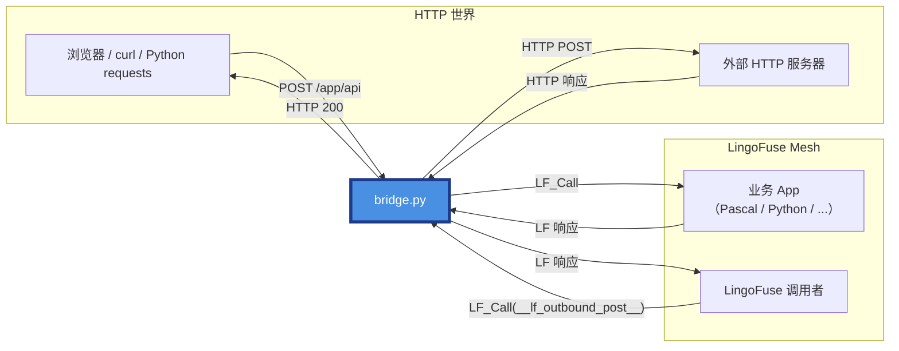

| 方向 | 触发方 | 通道 | 目的 |
|------|--------|------|------|
| **A：入站** | HTTP 客户端 | HTTP POST → `LF_Call` | 把 HTTP 请求送进 LingoFuse |
| **B：出站** | LingoFuse 调用者 | `LF_Call` → HTTP POST | 把 LingoFuse 请求发到外部 HTTP |

## 0.3 三条铁律

| # | 铁律 | 违反后果 | 相关 ID |
|:-:|------|---------|---------|
| 1 | **URL 路径决定入站路由**：`/<app>/<api>` 或 `/<api>`+`--app` | 返回 `-2`（HTTP 400） | `BR-IN-003` |
| 2 | **`--endpoint` 必须与后端一致**，默认值几乎总是错 | 返回 `-3` | `BR-ERR-003`, `BR-PIT-001` |
| 3 | **JSON 规范化只对可识别为 JSON 的载荷生效**，其余字节原样透传 | 不会损坏二进制 | `BR-JSON-001` |

## 0.4 我应该读哪一章？

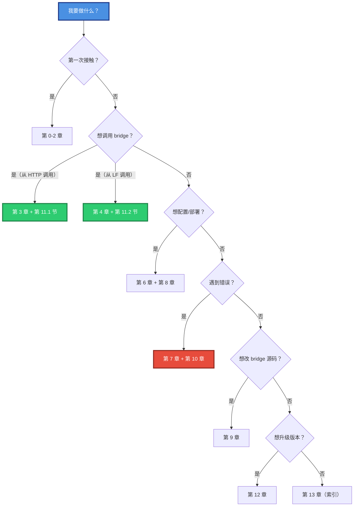

---

# 第 1 章 — 双向桥接器的本质

## 1.1 一图看清 bridge 的两种身份

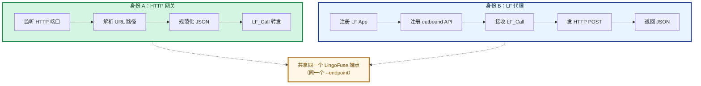

## 1.2 为什么是"同一个端点"

`--endpoint ipc:compute_grid` 这个参数**同时**用于两件事：

1. **入站方向**：bridge 作为**客户端**连接到该端点，以便 `LF_Call` 业务 App。
2. **出站方向**：bridge 作为**服务**在该端点上注册自己的 App（默认 `__lf_http_bridge__`），以便被其他 LingoFuse 调用者发现。

这不是巧合，而是设计选择：让 bridge 在 C4 网格里既是普通节点，又是可被寻址的服务。

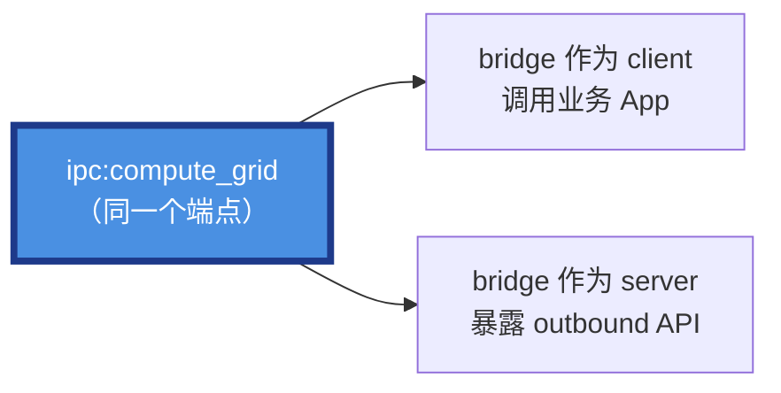

## 1.3 三种部署拓扑

### 拓扑 A — 单实例（开发/低流量）

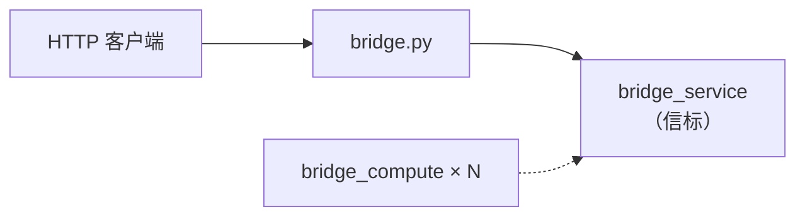

### 拓扑 B — 多实例 + 负载均衡（生产）

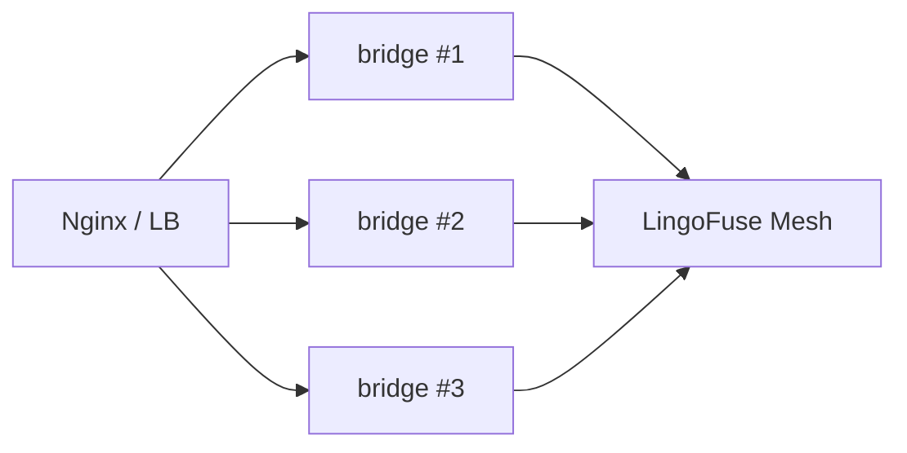

### 拓扑 C — 反向代理的 sidecar

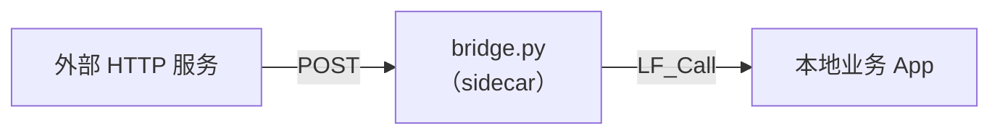

## 1.4 关键设计原则（源码级）

| 原则 | 实现方式 | ID |
|------|---------|-----|
| **配置只读** | 启动时写一次 `config`，运行时只读 | `BR-CFG-001` |
| **线程安全** | 无可变共享状态；`requests` 每次新连接 | `BR-GEN-002` |
| **异常隔离** | 所有回调捕获异常并转 JSON 错误响应 | `BR-OUT-005` |
| **JSON 策略单一化** | 所有序列化走 `lf_io.dumps_json` | `BR-JSON-007` |
| **命名空间隔离** | 出站 API 名用双下划线包裹 | `BR-OUT-001` |
| **回滚安全** | `_setup_network` 失败时释放所有已创建资源 | `BR-GEN-003` |

---

# 第 2 章 — 关键术语与 ID 体系

## 2.1 术语表

| 术语 | 定义 | 对应实现 |
|------|------|---------|
| **入站**（inbound） | HTTP → bridge → LingoFuse 方向 | `handle_call()` |
| **出站**（outbound） | LingoFuse → bridge → HTTP 方向 | `_bridge_post_callback()` |
| **规范化**（normalization） | 把字节载荷转为 canonical UTF-8 JSON | `normalize_json_bytes()` |
| **透传**（passthrough） | 无法识别为 JSON 时，字节原样转发 | `STATUS_PASSTHROUGH` |
| **Canonical JSON** | `json.dumps(obj, ensure_ascii=False, default=str)` 的结果 | `lf_io.dumps_json` |
| **BridgeConfig** | 全局唯一配置对象 | `config` 单例 |
| **bridge App** | bridge 自己的 LingoFuse App | 默认名 `__lf_http_bridge__` |
| **outbound API** | bridge 暴露给 LF 调用者的 API | 默认名 `__lf_outbound_post__` |
| **信标**（Beacon） | LingoFuse 服务注册中心 | `bridge_service` |

## 2.2 ID 命名规则

格式：`BR-<子系统>-<三位序号>`

| 前缀 | 子系统 | 章节 |
|------|--------|------|
| `BR-GEN` | 通用/架构 | 第 1 章 |
| `BR-IN` | 入站 HTTP | 第 3 章 |
| `BR-OUT` | 出站 LF | 第 4 章 |
| `BR-JSON` | JSON 规范化 | 第 5 章 |
| `BR-CFG` | 配置系统 | 第 6 章 |
| `BR-ERR` | 错误与诊断 | 第 7 章 |
| `BR-DEP` | 部署运维 | 第 8 章 |
| `BR-EXT` | 扩展修改 | 第 9 章 |
| `BR-PIT` | 陷阱坑 | 第 10 章 |
| `BR-INT` | 对接 | 第 11 章 |
| `BR-UP` | 升级 | 第 12 章 |

## 2.3 证据等级

| 等级 | 含义 |
|:----:|------|
| 🟢 | 已核实源码（`bridge.py` 有直接实现） |
| 🟡 | 仅文档转录（未逐行核对） |
| 🔴 | 推测（使用前请回查源码） |

**本知识库所有条目均为 🟢，因为描述的是当前 `bridge.py` 版本本身。**

## 2.4 引用格式

- 引用其他 ID：`BR-IN-003`
- 引用源码函数：`` `handle_call()` ``
- 引用配置字段：`` `config.endpoint` ``
- 引用源码行（可选）：`bridge.py:1234`

---

# 第 3 章 — 入站 HTTP 方向

> **一句话**：`POST /<app>/<api>` 被路由到 LingoFuse App `<app>` 的 API `<api>`，请求体（可规范化）通过 `LF_Call` 转发，响应体（可规范化）返回给 HTTP 客户端。

## 3.1 ID: `BR-IN-001` — 路由模式

- **证据等级**：🟢
- **触发条件**：任何 HTTP POST 到达 bridge
- **行为**：URL 路径决定路由目标
- **规则**：

| 路径 | `--app` | 路由结果 |
|------|---------|---------|
| `/pas/exp` | 任意 | `app='pas'`, `api='exp'` |
| `/exp` | `pas` | `app='pas'`, `api='exp'` |
| `/exp` | 未设置 | **错误 `-2`（HTTP 400）** |
| `/a/b/c` | 任意 | `app='a'`, `api='b/c'`（多段尾部合并为 api） |
| `/` | 任意 | **错误 `-2`** |

- **源码依据**：`handle_call()` 中的 `parts = path.strip('/').split('/')` 及后续分支

## 3.2 ID: `BR-IN-002` — 请求体处理

- **证据等级**：🟢
- **行为**：
  1. 读取 HTTP body 的原始字节（`request.get_data()`）
  2. 若 `config.normalize_json=True`，调用 `normalize_json_bytes()` 规范化
  3. 通过 `write_string_bytes()` 写入 DataHandle（含 NUL 结尾）
- **注意**：**无论是否 JSON，都会追加 NUL 结尾**（这是 LingoFuse 线协议约定）

## 3.3 ID: `BR-IN-003` — 路径解析错误（`-2`）

- **证据等级**：🟢
- **触发场景**：
  - 单段路径但未配置 `--app`
  - 路径为空（`/`）
- **响应**：HTTP 400，body 为 `{"code": -2, "error": "..."}`
- **修复**：
  - 使用两段路径 `/<app>/<api>`
  - 或设置 `--app <default_app>`

## 3.4 ID: `BR-IN-004` — 可选预检（`check_api`）

- **证据等级**：🟢
- **触发条件**：`config.no_precheck=False`（默认）
- **行为**：调用 `check_api(app, api)`，最多重试 3 次，每次间隔 200ms
- **命中失败**：返回 `-3`（HTTP 200）
- **绕过**：`--no-precheck` 或 `LINGOFUSE_NO_PRECHECK=1`
- **应用场景**：广播延迟（~3 秒）导致 `check_api` 假阴性时，通过重试或绕过解决

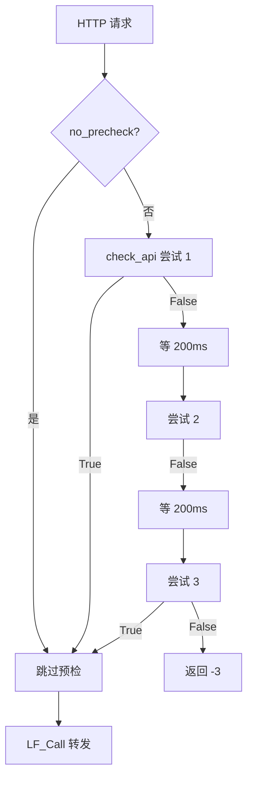

## 3.5 ID: `BR-IN-005` — 转发到 LingoFuse

- **证据等级**：🟢
- **流程**：
  1. `LF_CreateData(cstr(api_name))` 创建句柄
  2. `write_string_bytes(hnd, body)` 写入 body（追加 NUL）
  3. `LF_Call(cstr(app_name), hnd, config.timeout_ms)` 同步调用
  4. `LF_FreeData(hnd)` 释放输入句柄（finally）
  5. 检查返回句柄，若为 NULL 则抛异常
  6. `read_string_bytes(res)` 读取响应（读到 NUL 停止）
  7. `LF_FreeData(res)` 释放响应句柄（finally）
- **关键约束**：
  - 所有句柄释放都在 `finally` 中，异常路径不泄漏
  - `LF_Call` 的超时单位是毫秒

## 3.6 ID: `BR-IN-006` — 响应内容类型映射

- **证据等级**：🟢
- **规则**：由 `response_status` 决定 `Content-Type`

| 规范化状态 | Content-Type |
|-----------|--------------|
| `canonical` | `application/json; charset=utf-8` |
| `recoded` | `application/json; charset=utf-8` |
| `repaired` | `application/json; charset=utf-8` |
| `passthrough` | `application/octet-stream` |

## 3.7 ID: `BR-IN-007` — 入站错误码一览

| 错误码 | HTTP 状态 | 触发 |
|:------:|:---------:|------|
| `-1` | 200 | 远程调用失败（超时、空句柄、后端异常） |
| `-2` | **400** | 请求形状错误（路径无法解析） |
| `-3` | 200 | 预检失败（`check_api` 返回 False） |

## 3.8 ID: `BR-IN-008` — CORS 支持

- **证据等级**：🟢
- **行为**：所有响应附带
  - `Access-Control-Allow-Origin: *`
  - `Access-Control-Allow-Headers: Content-Type`
  - `Access-Control-Allow-Methods: POST, GET, OPTIONS`
- **OPTIONS 预检**：直接返回 `('', 200)`，不进入业务逻辑
- **异常保护**：CORS 头注入在 try/except 中，失败不影响响应返回

## 3.9 ID: `BR-IN-009` — 调试日志

- **证据等级**：🟢
- **触发**：`config.debug=True` 或 `--debug`
- **日志内容**：
  - 请求：`app`, `api`, `bytes`, `normalize`, `status`
  - 请求体（<1024 字节：完整文本；≥1024 字节：hex 前 64 字节）
  - 响应：`bytes`, `status`
  - 响应体（同上）
  - 空响应时：drain 3 条 LF 状态消息

---

# 第 4 章 — 出站 LingoFuse 方向

> **一句话**：bridge 注册了一个 Call API（默认 `__lf_http_bridge__.__lf_outbound_post__`），LingoFuse 调用者发送 JSON 请求描述 HTTP POST，bridge 执行并返回响应 JSON。

## 4.1 ID: `BR-OUT-001` — 命名空间隔离

- **证据等级**：🟢
- **默认 App 名**：`__lf_http_bridge__`
- **默认 API 名**：`__lf_outbound_post__`
- **为什么用双下划线**：
  - 正常 URL 路径无法包含未经编码的 `__`
  - 因此 bridge 的 API 名不可能与入站业务 API 撞名
  - 这是**结构性隔离**，不依赖命名约定
- **覆盖方式**：
  - 命令行：`--bridge-app <name> --bridge-api <name>`
  - 环境变量：`LINGOFUSE_BRIDGE_APP`, `LINGOFUSE_BRIDGE_API`

## 4.2 ID: `BR-OUT-002` — 请求 JSON 契约

- **证据等级**：🟢
- **格式**：

```json
{
    "url":     "http://example.com/api",
    "method":  "POST",
    "headers": { "X-Foo": "Bar" },
    "body":    { "any": "json" },
    "timeout": 10
}
```

- **字段约束**：

| 字段 | 类型 | 必需 | 默认值 | 约束 |
|------|------|:----:|--------|------|
| `url` | string | ✅ | — | 非空 |
| `method` | string | ❌ | `"POST"` | 必须在白名单内（见 `BR-OUT-003`） |
| `headers` | object | ❌ | `{}` | JSON 对象 |
| `body` | any | ❌ | `null` | 任意 JSON 值；null 表示不发送 body |
| `timeout` | number | ❌ | `config.timeout_ms / 1000.0` | >0 且 ≤ `MAX_OUTBOUND_TIMEOUT_S`（300s） |

## 4.3 ID: `BR-OUT-003` — HTTP 方法白名单

- **证据等级**：🟢
- **白名单**：`GET`, `POST`, `PUT`, `PATCH`, `DELETE`, `HEAD`, `OPTIONS`
- **超出白名单**：返回 `{"error": "Unsupported HTTP method: ..."}`
- **为什么用白名单**：防止调用者传入任意字符串（潜在的方法注入）

## 4.4 ID: `BR-OUT-004` — 请求体序列化政策

- **证据等级**：🟢
- **关键实现**：**不使用 `requests.json=` 快捷方式**
- **原因**：`requests.json=` 内部使用 `json.dumps(ensure_ascii=True)`，会引入 `\uXXXX` 转义
- **正确做法**：显式 `dumps_json(obj).encode(ENCODING)` + `data=body_bytes`
- **Content-Type 注入**：
  - 若调用者未提供 Content-Type，bridge 注入 `application/json; charset=utf-8`
  - 检查时不区分大小写

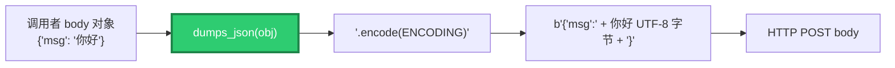

## 4.5 ID: `BR-OUT-005` — 异常隔离

- **证据等级**：🟢
- **契约**：**任何异常都不允许逃逸到 C 栈**
- **分类处理**：

| 异常类型 | 处理 |
|---------|------|
| `requests.Timeout` | 返回 `{"error": "HTTP request timed out"}` |
| `requests.RequestException` | 返回 `{"error": "HTTP request failed: ..."}` |
| 其他 `Exception` | 返回 `{"error": "Internal error: ..."}` |
| 写响应也失败 | 最后兜底：静默忽略 |

- **对齐**：与 Pascal 核心 `TLF_Engine.Execute_Call` 的行为一致（见 Pascal 指南 `LF-CB-002`）

## 4.6 ID: `BR-OUT-006` — 响应 JSON 契约

- **证据等级**：🟢
- **成功响应**：

```json
{
    "status_code": 200,
    "headers":     { "content-type": "application/json", ... },
    "body":        { ... } | "raw string if not JSON"
}
```

- **字段说明**：

| 字段 | 类型 | 说明 |
|------|------|------|
| `status_code` | int | HTTP 状态码 |
| `headers` | object | **所有键小写化**（见 `BR-OUT-007`） |
| `body` | any | 若响应体可解析为 JSON：嵌套对象；否则：字符串 |

- **错误响应**：

```json
{ "error": "description" }
```

## 4.7 ID: `BR-OUT-007` — 响应头规范化

- **证据等级**：🟢
- **实现**：`_normalize_headers_dict()`
- **规则**：
  - 键统一转小写（HTTP 规范）
  - 值统一转字符串
  - 输入非 mapping 时：返回 `{"_raw": str(headers)}`（理论不可达）
- **为什么**：`requests` 的 `CaseInsensitiveDict` 无法直接 JSON 序列化

## 4.8 ID: `BR-OUT-008` — 超时保护

- **证据等级**：🟢
- **上限**：`MAX_OUTBOUND_TIMEOUT_S = 300.0`（5 分钟）
- **越界处理**：调用者传入 >300 时，被**钳制到 300**，不报错
- **理由**：防止调用者误传巨大超时，长时间占用 LF worker 线程

## 4.9 ID: `BR-OUT-009` — 回调线程模型

- **证据等级**：🟢
- **执行线程**：LingoFuse 的 worker 线程（**不是** Flask 线程，**不是**主线程）
- **禁止**：在回调中调用阻塞型 LF 函数（如 `LF_Call`）——会死锁
- **允许**：`requests.request()`（本身线程安全，每次新连接）
- **对齐**：Pascal 指南 `LF-CB-002`

---

# 第 5 章 — JSON 规范化子系统

> **一句话**：bridge 对**可识别为 JSON** 的字节载荷做"规范化"——转成 canonical UTF-8，无 `\uXXXX` 转义；对**不可识别**的载荷按字节原样透传。

## 5.1 ID: `BR-JSON-001` — 核心规则

- **证据等级**：🟢
- **规则**：
  - 能识别为 JSON → 输出 canonical 形式
  - 不能识别 → 原始字节**不变**
- **二进制安全**：**硬保证**，绝不猜测、绝不修改

## 5.2 ID: `BR-JSON-002` — 七个规范化步骤

- **证据等级**：🟢
- **函数**：`normalize_json_bytes(raw) -> (bytes, status)`

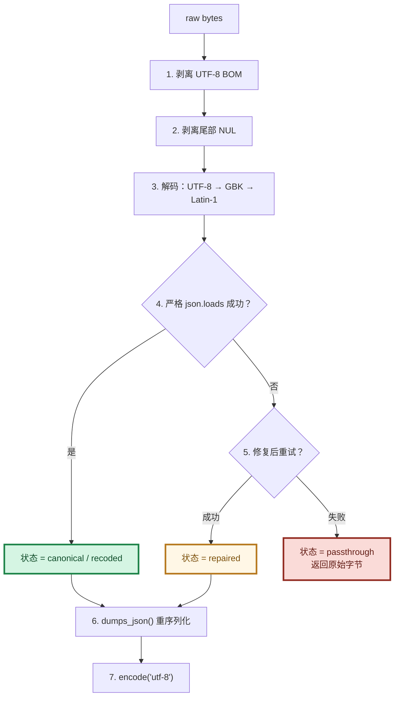

## 5.3 ID: `BR-JSON-003` — 四个状态码

| 状态 | 含义 | 输出 | 用于 Content-Type |
|------|------|------|-------------------|
| `canonical` | 输入已是合法 UTF-8 JSON | 紧凑 JSON | `application/json` |
| `recoded` | 输入是其他编码的合法 JSON | 转 UTF-8 | `application/json` |
| `repaired` | 输入需修复后才合法 | 紧凑 JSON | `application/json` |
| `passthrough` | 不识别为 JSON | **原始字节** | `application/octet-stream` |

## 5.4 ID: `BR-JSON-004` — 允许的修复

- **证据等级**：🟢
- **保守修复**（绝不改变语义）：
  1. 剥离 UTF-8 BOM（字节级，步骤 1）
  2. 剥离尾部 NUL 字节（步骤 2）
  3. 剥离字符串开头的 U+FEFF（字符级）
  4. **移除尾随逗号**（`{"a":1,}` → `{"a":1}`）
- **不做的事**：
  - 不修复缺失的引号
  - 不转换单引号为双引号
  - 不推断缺失的括号
  - **不修改任何二进制载荷**

## 5.5 ID: `BR-JSON-005` — 状态分类的真值表

| 输入 | 输出 | 状态 |
|------|------|------|
| `{"a":1}` | `{"a":1}` | canonical |
| `{"a":1,}` | `{"a":1}` | repaired |
| `EF BB BF{"a":1}` | `{"a":1}` | canonical |
| `{"a":"\u4f60\u597d"}` | `{"a":"你好"}` | canonical |
| `{"a":1}\x00` | `{"a":1}` | canonical |
| GBK `{"a":"你好"}` | UTF-8 `{"a":"你好"}` | recoded |
| `\x89PNG\r\n...` | 不变 | passthrough |
| `not json at all` | 不变 | passthrough |
| 空字节 | 不变 | passthrough |
| UTF-16 BOM | 不变 | passthrough |

## 5.6 ID: `BR-JSON-006` — 幂等性

- **证据等级**：🟢
- **契约**：`normalize_json_bytes(normalize_json_bytes(x)) == normalize_json_bytes(x)`
- **理由**：第一次产生 canonical 后，第二次识别为 canonical 并重新序列化为相同字节

## 5.7 ID: `BR-JSON-007` — 序列化政策单一来源

- **证据等级**：🟢
- **唯一来源**：`lingofuse.lf_io.dumps_json`
- **政策**：`json.dumps(obj, ensure_ascii=False, default=str)`
- **所有使用点**（共 3 处）：
  1. `normalize_json_bytes()` 步骤 6
  2. `_bridge_post_callback()` 出站 body 序列化
  3. `_json_error_response()` 错误响应体
- **为什么重要**：任何一处改用 `json.dumps` 都会引入 `\uXXXX` 转义，违反全工具链契约

## 5.8 ID: `BR-JSON-008` — 编码回退顺序

- **证据等级**：🟢
- **尝试顺序**：UTF-8 → GBK → Latin-1
- **为什么**：
  - UTF-8 是现代标准
  - GBK 覆盖中文 Windows 默认编码
  - Latin-1 永不失败（任何字节都能解码），作为终极兜底

## 5.9 ID: `BR-JSON-009` — 二进制安全的边界

- **证据等级**：🟢
- **安全场景**：
  - 任何字节序列
  - 包含 NUL 字节的载荷
  - 非 UTF-8 编码的文本（作为 passthrough 处理）
- **不安全场景**：**不存在**（这是硬保证）

---

# 第 6 章 — 配置系统

> **一句话**：所有配置加载一次后冻结在 `config` 单例；优先级是"命令行 > 环境变量 > 内置默认"；运行时任何代码只读 `config`，不碰 `os.environ` 或 `sys.argv`。

## 6.1 ID: `BR-CFG-001` — 配置加载模型

- **证据等级**：🟢

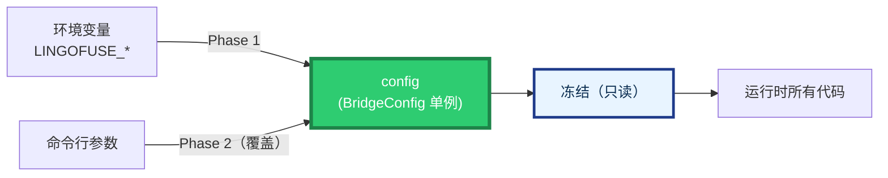

- **唯一入口**：`main()` 调用 `_apply_environment_defaults(config)` 然后 `_apply_command_line(config, argv)`
- **唯一 `os.environ` 访问点**：`_env_str`, `_env_int`, `_env_bool`
- **唯一 `sys.argv` 访问点**：`main()` 的 `sys.argv[1:]`

## 6.2 ID: `BR-CFG-002` — 完整配置表

| 字段 | 环境变量 | 命令行 | 默认 | 备注 |
|------|---------|--------|------|------|
| `host` | `LINGOFUSE_HOST` | `--host` | `0.0.0.0` | 入站监听地址 |
| `port` | `LINGOFUSE_PORT` | `--port` | `8081` | 入站监听端口 |
| `endpoint` | `LINGOFUSE_ENDPOINT` | `--endpoint` | `ipc:lingofuse_bridge` | **双向共享**的 LF 端点 |
| `timeout_ms` | `LINGOFUSE_TIMEOUT` | `--timeout` | `5000` | 默认 LF 调用超时 |
| `default_app` | `LINGOFUSE_APP` | `--app` | `None` | 单段路径默认 app |
| `threaded` | `LINGOFUSE_THREADED` | `--threaded` / `--no-threaded` | `True` | Flask 多线程 |
| `debug` | `LINGOFUSE_DEBUG` | `--debug` / `--no-debug` | `False` | 详细日志 |
| `no_precheck` | `LINGOFUSE_NO_PRECHECK` | `--no-precheck` / `--precheck` | `False` | 跳过 `check_api` |
| `normalize_json` | `LINGOFUSE_NORMALIZE_JSON` | `--normalize-json` / `--no-normalize-json` | `True` | 入站 JSON 规范化 |
| `log_file` | `LINGOFUSE_LOG_FILE` | `--log-file` | `None` | 日志文件路径 |
| `bridge_app_name` | `LINGOFUSE_BRIDGE_APP` | `--bridge-app` | `__lf_http_bridge__` | 出站 App 名 |
| `bridge_api_name` | `LINGOFUSE_BRIDGE_API` | `--bridge-api` | `__lf_outbound_post__` | 出站 API 名 |

## 6.3 ID: `BR-CFG-003` — 布尔环境变量格式

- **证据等级**：🟢
- **真值**：`1`, `true`, `yes`, `on`（大小写不敏感）
- **假值**：`0`, `false`, `no`, `off`（大小写不敏感）
- **非法值**：**记录 warning 并使用默认值**，不中断启动

## 6.4 ID: `BR-CFG-004` — 命令行 `--help`

- **证据等级**：🟢
- **支持**：`python bridge.py --help` / `-h`
- **行为**：argparse 打印完整用法（含 `epilog` 中列出的所有环境变量名）并退出状态 0
- **理由**：AI 或人类可以通过 `--help` 一次获得所有配置项

## 6.5 ID: `BR-CFG-005` — 配置优先级


- **来源**：argparse 的 `default=cfg.<field>` 机制
- **效果**：命令行未指定时，argparse 保留环境变量设置；指定时覆盖

## 6.6 ID: `BR-CFG-006` — 配置冻结契约

- **证据等级**：🟢
- **契约**：`main()` 返回后，`config` 的任何字段**不再被写入**
- **如何保证**：
  - 只有 `_apply_environment_defaults` 和 `_apply_command_line` 写 `config`
  - 这两个函数只在 `main()` 中被调用
  - 所有其他函数**只读** `config`
- **为什么重要**：多线程并发读同一份不可变数据无需锁

## 6.7 ID: `BR-CFG-007` — `log_file` 的 None vs 空字符串

- **证据等级**：🟢
- **`None`**：未设置 → 只输出到 stderr
- **空字符串**：显式"不写文件" → 也只输出到 stderr
- **实现**：`raw if raw else None`

## 6.8 ID: `BR-CFG-008` — `default_app` 的 None vs 空字符串

- **证据等级**：🟢
- **`None`**：单段路径时报错 `-2`
- **空字符串**：等同 `None`（不推荐）

## 6.9 ID: `BR-CFG-009` — `Overlap_Connection` 的隐式设置

- **证据等级**：🟢
- **位置**：`_setup_network()` 内部
- **时机**：在 `LF_PrepareClient` 之前
- **值**：`True`
- **理由**：允许 bridge 与已存在的 client 共享同一端点（见 `BR-PIT-005`）

## 6.10 ID: `BR-CFG-010` — `Wait_Connection_ReadyOk` 的隐式设置

- **证据等级**：🟢
- **位置**：`_setup_network()` 内部
- **值**：`False`（部署模式）
- **效果**：`LF_PrepareDone` 不阻塞等待所有客户端就绪，允许弹性集群启动顺序不确定

## 6.11 ID: `BR-CFG-011` — 日志和注释语言

- **证据等级**：🟢
- **契约**：**所有日志、注释、docstring 必须使用英文**
- **理由**：便于标准日志管道处理、跨语言团队协作
- **覆盖**：logger 消息、异常消息、模块 docstring、行内注释

---

# 第 7 章 — 错误与诊断

## 7.1 ID: `BR-ERR-001` — 错误响应格式

- **证据等级**：🟢
- **格式**：

```json
{ "code": -3, "error": "API 'exp' not available for app 'pas'" }
```

- **生成方式**：`_json_error_response(code, msg, http_status)`
- **序列化**：通过 `dumps_json`（无 `\uXXXX` 转义）

## 7.2 ID: `BR-ERR-002` — 入站错误码全景

| 代码 | HTTP | 含义 | 触发 | 修复 |
|:----:|:----:|------|------|------|
| `-1` | 200 | 远程调用失败 | 超时 / 空句柄 / 后端异常 | 增加 `--timeout`，检查后端 |
| `-2` | **400** | 请求形状错误 | 路径无法解析 / 无 default app | 用 `/<app>/<api>` 或 `--app` |
| `-3` | 200 | 预检失败 | `check_api` 3 次均返回 False | `--no-precheck` 或启动后端 |

## 7.3 ID: `BR-ERR-003` — 出站错误格式

- **证据等级**：🟢
- **格式**：

```json
{ "error": "description" }
```

- **触发场景**：
  - 请求 JSON 无效
  - URL 缺失
  - HTTP 方法不在白名单
  - HTTP 请求超时
  - HTTP 请求失败（网络、DNS、TLS 等）
  - 内部异常

## 7.4 ID: `BR-ERR-004` — 错误消息索引

| 消息 | 代码 | 触发 | 修复 |
|------|:----:|------|------|
| `No default app set (use --app)` | `-2` | 单段路径 + 无 `--app` | `--app <name>` 或两段路径 |
| `Missing API name in path` | `-2` | 路径仅 `/` | 检查 URL |
| `API 'X' not available for app 'Y'` | `-3` | `check_api` 失败 | `--no-precheck` 或后端上线 |
| `Call timeout` | `-1` | `LF_Call` 超时 | `--timeout` 增大 |
| `Remote call returned a null handle` | `-1` | `LF_Call` 返回 NULL | 检查后端健康 |
| `Failed to create DataHandle` | `-1` | `LF_CreateData` 失败 | 罕见，重启 bridge |
| `Internal error: ...` | `-1` | 意外异常 | `--debug` 重启排查 |
| `Empty or invalid JSON request` | out | 出站请求空/无效 | 检查 LF 调用者 |
| `Request must be a JSON object` | out | 出站请求非对象 | 检查 LF 调用者 |
| `Missing or invalid 'url' field` | out | 出站缺 URL | 补 `url` |
| `Unsupported HTTP method: ...` | out | 方法不在白名单 | 用白名单内的方法 |
| `'headers' must be a JSON object` | out | headers 非对象 | 检查 LF 调用者 |
| `'timeout' must be a positive number of seconds` | out | timeout ≤0 或非数字 | 修正 |
| `HTTP request timed out` | out | `requests.Timeout` | 增大 timeout |
| `HTTP request failed: ...` | out | 网络/DNS/TLS 错误 | 检查目标 URL |
| `Internal error: ...` | out | 回调内意外异常 | 检查 bridge 日志 |

## 7.5 ID: `BR-ERR-005` — 诊断决策树

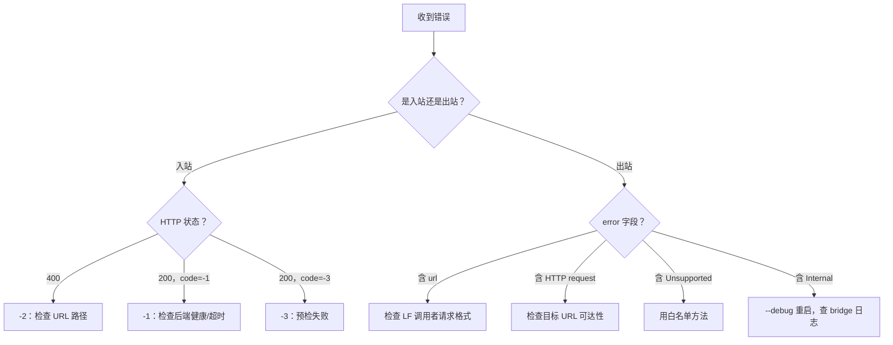

## 7.6 ID: `BR-ERR-006` — 状态队列辅助诊断

- **证据等级**：🟢
- **触发**：入站响应为空且 `--debug`
- **行为**：`_drain_status(3)` 读取最多 3 条 LF 内部日志并转发到 bridge logger
- **用途**：当入站返回空响应时，LingoFuse 内部可能记录了根因

---

# 第 8 章 — 部署与运维

## 8.1 ID: `BR-DEP-001` — 三阶段启动

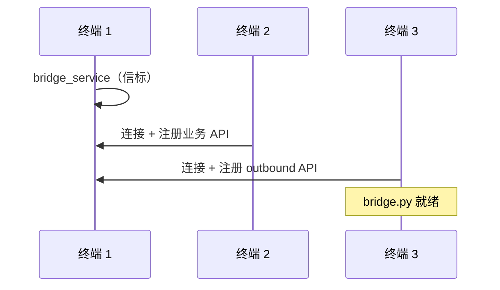

- **顺序要求**：信标必须先启动
- **等待时间**：bridge_compute 启动后，建议等 1-2 秒再启动 bridge.py（广播传播）

## 8.2 ID: `BR-DEP-002` — 三个终端命令

```bash
# 终端 1：信标
./bridge_service

# 终端 2：业务节点（等终端 1 打印 OK）
./bridge_compute

# 终端 3：bridge（等终端 2 打印 OK）
python3 lingofuse/bridge.py \
    --endpoint ipc:compute_grid \
    --no-precheck \
    --debug \
    --port 8081
```

## 8.3 ID: `BR-DEP-003` — 生产部署模板

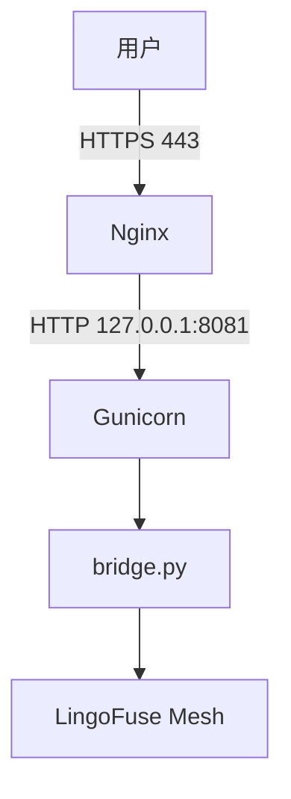

**关键参数**：

| 参数 | 值 | 理由 |
|------|-----|------|
| `--host` | `127.0.0.1` | 仅本机 |
| `--log-file` | `/var/log/bridge.log` | 日志轮转 |
| `--endpoint` | 与后端一致 | 避免 -3 |
| `--no-precheck` | 视需要 | 若广播延迟不可接受 |
| Nginx | 反向代理 + HTTPS | 安全 |

## 8.4 ID: `BR-DEP-004` — 容器化配置

```yaml
services:
  bridge:
    image: lingofuse-bridge
    environment:
      LINGOFUSE_HOST: "0.0.0.0"
      LINGOFUSE_PORT: "8081"
      LINGOFUSE_ENDPOINT: "ipc:compute_grid"
      LINGOFUSE_TIMEOUT: "10000"
      LINGOFUSE_DEBUG: "0"
      LINGOFUSE_NO_PRECHECK: "1"
      LINGOFUSE_NORMALIZE_JSON: "1"
      LINGOFUSE_BRIDGE_APP: "__lf_http_bridge__"
      LINGOFUSE_BRIDGE_API: "__lf_outbound_post__"
    ports:
      - "8081:8081"
```

## 8.5 ID: `BR-DEP-005` — 横向扩展

- **加实例**：直接启动更多 `bridge.py` 进程
- **无需改配置**：所有实例连同一个 `--endpoint`
- **无需改后端**：LingoFuse 自动发现
- **无需会话保持**：无状态

## 8.6 ID: `BR-DEP-006` — 清理顺序

`cleanup()` 中严格执行：


- **幂等**：通过 `_cleanup_done` 标志保证只执行一次
- **触发**：`atexit.register(cleanup)` + `_run_bridge` 的 finally

## 8.7 ID: `BR-DEP-007` — `_setup_network` 的失败回滚

- **证据等级**：🟢
- **契约**：任何步骤失败都**释放已创建的资源**
- **顺序**：
  1. `LF_ExitMainThread()`（先停主线程）
  2. `LF_FreeApp(app_handle)`（再释放 App）
- **全局变量**：只在所有步骤成功后写入 `_bridge_app_handle` 和 `_bridge_app_callbacks`

---

# 第 9 章 — 扩展与修改

## 9.1 ID: `BR-EXT-001` — 三个扩展插入点

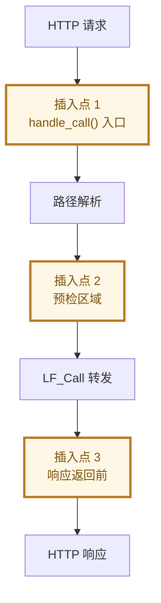

## 9.2 ID: `BR-EXT-002` — 常见扩展模式

| 需求 | 插入点 | 实现 |
|------|:------:|------|
| API Key 鉴权 | 1 | 检查 `request.headers.get('X-API-Key')` |
| JWT 鉴权 | 1 | 用 `PyJWT` 校验 `Authorization` |
| 限流 | 1 | `flask-limiter` |
| 结构化日志 | 1 + 3 | 生成 `request_id` 并在前后记录 |
| Prometheus 指标 | 3 | `prometheus_client` |
| 响应过滤 | 3 | 修改 `result_bytes` 后再返回 |

## 9.3 ID: `BR-EXT-003` — 新增错误码的约定

- **证据等级**：🟡（约定，非源码）
- **现有范围**：`-1`, `-2`, `-3`
- **扩展规则**：
  - 从 `-4` 开始，递减分配
  - **必须在文档中明确记录**
  - HTTP 状态码语义：
    - 4xx 用于客户端错误
    - 5xx 用于服务端错误
    - 200 用于业务层错误（延续现有 -1/-3 的惯例）

## 9.4 ID: `BR-EXT-004` — 修改 JSON 政策的唯一位置

- **证据等级**：🟢
- **位置**：`lingofuse/lf_io.py` 中的 `dumps_json`
- **不要做的事**：
  - 不要在任何 bridge 代码中直接 `import json` 后调用 `json.dumps`
  - 不要使用 `requests.json=` 快捷方式
  - 不要手动 `str.encode()` 后再接 JSON
- **正确做法**：永远调用 `dumps_json(obj).encode(ENCODING)`

## 9.5 ID: `BR-EXT-005` — 新增出站 HTTP 客户端

- **证据等级**：🟢
- **当前**：`requests`
- **替换为 `httpx` / `aiohttp` 的注意事项**：
  - 保持异步不阻塞 LF worker 线程
  - 保持超时钳制 `MAX_OUTBOUND_TIMEOUT_S`
  - 保持异常分类处理（Timeout / 网络错误 / 其他）
  - 保持响应头小写化（`_normalize_headers_dict`）

## 9.6 ID: `BR-EXT-006` — 修改回调 API 名

- **证据等级**：🟢
- **命令行**：`--bridge-app` / `--bridge-api`
- **环境变量**：`LINGOFUSE_BRIDGE_APP` / `LINGOFUSE_BRIDGE_API`
- **注意**：
  - **两端都要改**（bridge 侧 + LF 调用者侧）
  - 若改为可能撞名的名字（如 `post`），会失去 namespace 隔离

## 9.7 ID: `BR-EXT-007` — 修改入站路由

- **证据等级**：🟢
- **位置**：`handle_call()` 中的 `parts = path.strip('/').split('/')` 分支
- **扩展方式**：
  - 若需 header 路由：在 `parts` 解析前插入 header 检查
  - 若需 query 路由：使用 `request.args.get(...)`
  - 若需 body 路由：**不推荐**（必须先读 body，会破坏 normalize 前的检查）
- **警告**：修改后必须更新本文档 §3.1

---

# 第 10 章 — 坑与陷阱

## 10.1 ID: `BR-PIT-001` — 端点用默认值

- **证据等级**：🟢
- **症状**：`-3: API 'exp' not available for app 'pas'`
- **根因**：默认 `--endpoint` 是 `ipc:lingofuse_bridge`，与后端不匹配
- **修复**：显式指定 `--endpoint ipc:compute_grid`
- **频率**：**90% 的"API 不可用"根因**

## 10.2 ID: `BR-PIT-002` — 广播延迟误判为"API 缺失"

- **证据等级**：🟢
- **症状**：`bridge_compute` 刚启动，`bridge.py` 立即调用 → `-3`
- **根因**：`check_api` 依赖 ~3 秒的广播
- **修复 A**：`--no-precheck`
- **修复 B**：等 1-2 秒后再启动 bridge.py

## 10.3 ID: `BR-PIT-003` — 单段路径未配置 default app

- **证据等级**：🟢
- **症状**：`-2: No default app set (use --app)`
- **修复 A**：`--app pas`
- **修复 B**：用两段路径 `POST /pas/exp`

## 10.4 ID: `BR-PIT-004` — 期望 JSON schema 校验

- **证据等级**：🟢
- **误区**：以为 bridge 校验业务字段
- **真相**：bridge 只保证**合法 JSON 字节**，不保证**业务有效数据**
- **正确心智模型**：bridge 是字节层网关，业务层由后端负责

## 10.5 ID: `BR-PIT-005` — 二进制载荷被"损坏"

- **证据等级**：🟢
- **误区**：以为 bridge 会把一切转换为 JSON
- **真相**：非 JSON 载荷**原样透传**（PNG、Protobuf、自定义协议都安全）
- **契约**：见 `BR-JSON-001`

## 10.6 ID: `BR-PIT-006` — 超时太短

- **证据等级**：🟢
- **症状**：`-1: Call timeout`
- **修复**：`--timeout 30000` 或更大（单位毫秒）
- **注意**：出站方向的超时上限是 300 秒（`BR-OUT-008`）

## 10.7 ID: `BR-PIT-007` — 出站 body 出现 `\uXXXX` 转义

- **证据等级**：🟢
- **症状**：外部 HTTP 服务器收到的 body 中含 `\u4f60\u597d` 而非 `你好`
- **根因**：如果使用 `requests.json=`，会触发 `ensure_ascii=True`
- **修复**：已在源码中修正为 `dumps_json().encode(ENCODING)` + `data=`
- **回归保护**：见 `BR-JSON-007`

## 10.8 ID: `BR-PIT-008` — 出站 API 撞名

- **证据等级**：🟢
- **症状**：LF 调用者调用 `post`，结果路由到了业务 App
- **根因**：如果 `--bridge-api` 设为一个普通名字（如 `post`），可能与业务 API 冲突
- **修复**：保持默认双下划线名 `__lf_outbound_post__`，或确保自定义名字全局唯一

## 10.9 ID: `BR-PIT-009` — 在出站回调中调用阻塞 LF 函数

- **证据等级**：🟢
- **症状**：整个 LingoFuse 死锁
- **根因**：回调运行在 LF worker 线程，调 `LF_Call` 会自锁
- **修复**：若出站回调需要调用 LF，用 `TThread.CreateAnonymousThread` 异步化
- **对齐**：Pascal 指南 `LF-CB-002`

## 10.10 ID: `BR-PIT-010` — 配置文件被并发修改

- **证据等级**：🟢
- **症状**：多 worker 下行为不一致
- **根因**：若在运行中修改 `config.*`，无锁保护
- **修复**：**不要修改**。所有配置通过命令行/环境变量，启动时加载一次

## 10.11 ID: `BR-PIT-011` — `atexit` 触发时机不确定

- **证据等级**：🟢
- **症状**：`cleanup()` 在某些退出路径下不执行
- **根因**：`atexit` 不覆盖 `os._exit`、`SIGKILL`
- **修复**：`_run_bridge` 的 `finally` 已调用 `cleanup()`，覆盖正常路径

## 10.12 ID: `BR-PIT-012` — `LF_PrepareDone` 只能返回 1 一次

- **证据等级**：🟢
- **症状**：同一进程第二次 `LF_PrepareDone` 返回 0
- **根因**：LingoFuse 主线程已启动
- **对齐**：Pascal 指南 `LF-NET-003`
- **桥接场景**：`bridge.py` 生命周期内只调用一次，无影响

---

# 第 11 章 — 对接指南

## 11.1 ID: `BR-INT-001` — HTTP 客户端对接

### Python（推荐写法）

```python
import requests
from lingofuse.lf_io import dumps_json, ENCODING

# 使用 dumps_json 保证无 \uXXXX 转义
body = dumps_json({"args": ["1+2*3"]}).encode(ENCODING)

resp = requests.post(
    "http://127.0.0.1:8081/pas/exp",
    data=body,                              # 显式 data=，不用 json=
    headers={"Content-Type": "application/json"},
    timeout=5,
)
result = resp.json()
```

**为什么不用 `requests.post(json=...)`**：
- `requests` 会调用 `json.dumps(ensure_ascii=True)`，引入 `\uXXXX`
- 显式 `data=dumps_json(...).encode(ENCODING)` 与工具链一致

### curl

```bash
curl -X POST http://127.0.0.1:8081/pas/exp \
  -H "Content-Type: application/json" \
  -d '{"args": ["1+2*3"]}'
```

### 浏览器（fetch）

```javascript
const resp = await fetch('http://127.0.0.1:8081/pas/exp', {
    method: 'POST',
    headers: { 'Content-Type': 'application/json' },
    body: JSON.stringify({ args: [expr] })   // fetch 侧转义后，bridge 会规范化
});
const data = await resp.json();
```

**注意**：浏览器侧 `JSON.stringify` 会引入 `\uXXXX`，但 bridge 的规范化会**解转义**（`\u4f60` → `你`），最终后端收到的是无转义形式。

## 11.2 ID: `BR-INT-002` — LingoFuse 调用者对接

### Python（使用 C4 客户端）

```python
from lingofuse.client import C4

client = C4(
    "__lf_http_bridge__",     # bridge 的 App 名
    "ipc:compute_grid",       # bridge 连接的端点
    timeout=15000,
)

result = client.json_call("__lf_outbound_post__", {
    "url": "https://api.example.com/v1/echo",
    "method": "POST",
    "headers": {"X-Request-Id": "abc-123"},
    "body": {"message": "你好,世界 🌍"},   # 无 \uXXXX 转义,UTF-8 直出
    "timeout": 10,
})

# result = {
#     "status_code": 200,
#     "headers": {"content-type": "application/json", ...},
#     "body": {...}
# }
```

### Pascal（使用 lingofuse_helper）

```pascal
// 假设 C4 client 已连接,app 名 __lf_http_bridge__
var
  Data, Res: TDataHnd;
  RequestJson, ResponseJson: string;
begin
  RequestJson :=
    '{"url":"https://api.example.com/v1/echo",' +
    '"method":"POST",' +
    '"headers":{"X-Request-Id":"abc-123"},' +
    '"body":{"message":"你好,世界 🌍"},' +
    '"timeout":10}';

  Data := LF_CreateDataEx('__lf_outbound_post__');
  try
    LF_WriteString(Data, RequestJson);   // 追加 NUL
    Res := LF_CallEx('__lf_http_bridge__', Data, 15000);
  finally
    LF_FreeData(Data);
  end;

  if Assigned(Res) and (LF_GetSize(Res) > 0) then
  begin
    ResponseJson := LF_ReadString(Res);
    // 解析 ResponseJson...
    LF_FreeData(Res);
  end;
end;
```

## 11.3 ID: `BR-INT-003` — 与 web_demo.html 对接

`web_demo.html` 硬编码：

```javascript
const API_URL = 'http://127.0.0.1:8081/pas/exp';
```

**要求**：
- bridge 监听 `127.0.0.1:8081`
- 后端 App 名为 `pas`，API 名为 `exp`
- 若改名，需修改 HTML

## 11.4 ID: `BR-INT-004` — 与其他 bridge 实例对接

**场景**：bridge A 想通过 bridge B 发送 HTTP POST

**做法**：A 使用 C4 客户端，调用 B 的 `__lf_outbound_post__` API

```python
# 在 bridge A 的扩展代码中
from lingofuse.client import C4
c4_to_b = C4("__lf_http_bridge__", "ipc:bridge_b_endpoint")
c4_to_b.json_call("__lf_outbound_post__", {...})
```

**注意**：这会形成一条链 `A → LF → B → HTTP → 外部`，链路越长延迟越高

## 11.5 ID: `BR-INT-005` — 与 Pascal 服务对接

参考 Pascal 指南 §6.5 的 JSON 处理示例。要点：

- Pascal 回调从 `LF_ReadString` 读取请求（自动剥离 NUL）
- Pascal 用 `TZ_JsonObject` 构造响应（天然 UTF-8）
- Pascal 用 `LF_WriteString` 写响应（自动追加 NUL）
- bridge 会自动规范化

## 11.6 ID: `BR-INT-006` — 对接清单

| 对接方 | 需要知道 | 参考章节 |
|--------|---------|---------|
| HTTP 客户端 | URL 格式、错误码 | §3.1, §7.2 |
| LF 调用者 | outbound API 名、请求/响应 JSON 格式 | §4.1, §4.2, §4.6 |
| 后端 Pascal 服务 | 无特殊要求（标准 LF 回调） | Pascal 指南 |
| 浏览器 | CORS 已自动处理 | §3.8 |
| 反向代理 | 监听 127.0.0.1，代理 HTTP | §8.3 |

---

# 第 12 章 — 升级指南

## 12.1 ID: `BR-UP-001` — 版本历史

| 版本 | 核心变化 |
|------|---------|
| v3.1 及以前 | 单向 HTTP → LingoFuse 网关 |
| **v4.0（当前）** | **双向**；新增 outbound Call API |

## 12.2 ID: `BR-UP-002` — v3.1 → v4.0 的兼容性

| 方面 | 兼容性 | 说明 |
|------|:------:|------|
| 命令行参数 | ✅ 兼容 | 所有 v3.1 参数保留 |
| 环境变量 | ✅ 兼容 | 所有 v3.1 变量保留 |
| 入站路由 | ✅ 兼容 | URL 格式不变 |
| 入站错误码 | ✅ 兼容 | `-1`/`-2`/`-3` 不变 |
| 入站 Content-Type 映射 | ✅ 兼容 | 四状态不变 |
| **新增** App/API 注册 | ⚠️ 行为变化 | bridge 现在**也**占用一个 App 名 |
| **新增** Overlap_Connection | ⚠️ 隐式设置 | 自动设 True，允许与其他 client 共享端点 |
| **新增** `--bridge-app`/`--bridge-api` | 🆕 | 可选参数，有默认值 |

**升级建议**：
- **无破坏性变更**。直接替换 bridge.py 即可
- 若同一端点上已有旧版 bridge 运行，新版 bridge 因 `Overlap_Connection=True` 可与之共存

## 12.3 ID: `BR-UP-003` — 从 v3.1 升级的步骤

1. **备份**旧 bridge.py
2. **替换**为新版 bridge.py
3. **重启**：停止旧 bridge，启动新 bridge（会注册自己的 App）
4. **验证**：
   - 入站：`curl -X POST http://127.0.0.1:8081/<app>/<api> -d '{...}'`
   - 出站：从 LF 调用者调用 `__lf_http_bridge__.__lf_outbound_post__`
5. **检查日志**：确认注册了 outbound API

## 12.4 ID: `BR-UP-004` — 未来版本的兼容契约

- **承诺**：
  - 入站 URL 格式不变
  - 入站错误码 `-1`/`-2`/`-3` 的语义不变
  - JSON 规范化规则只会扩展，不会收窄
  - 现有配置字段不会删除（可能标记 deprecated）
  - 出站 API 名默认值不变
- **可能变化**：
  - 新增配置字段（有默认值）
  - 新增错误码（从 `-4` 递减）
  - 新增规范化修复规则
  - 新增 outbound 请求字段（向后兼容）

## 12.5 ID: `BR-UP-005` — 自定义分支的升级策略

若你对 bridge.py 做了修改（见第 9 章），升级时：

1. **记录**：你在哪些插入点做了什么改动（写进你的内部文档）
2. **对比**：新版与旧版逐段 diff
3. **重放**：把改动重放到新版
4. **回归**：跑一遍所有验证清单
5. **提交**：如果改动有通用价值，考虑上游

## 12.6 ID: `BR-UP-006` — 回滚步骤

1. 停止当前 bridge
2. 恢复备份的 bridge.py
3. 重启
4. **注意**：如果新版 bridge 已注册 App，停止后其 App 会随 `LF_Shutdown` 销毁
5. 若旧版与新版的 `--bridge-app` 名不同，无冲突

---

# 第 13 章 — 自审与索引

## 13.1 契约完整性自审

| 类别 | 覆盖 | 章节 |
|------|:----:|------|
| 入站路由 | ✅ | §3.1 |
| 入站错误码 | ✅ | §3.7 |
| 入站 JSON 规范化 | ✅ | §5 |
| 出站 API 契约 | ✅ | §4 |
| 出站错误处理 | ✅ | §4.5, §7.3 |
| 配置模型 | ✅ | §6 |
| 配置优先级 | ✅ | §6.5 |
| `--help` | ✅ | §6.4 |
| 环境变量表 | ✅ | §6.2 |
| 部署 | ✅ | §8 |
| 扩展点 | ✅ | §9 |
| 陷阱 | ✅ | §10 |
| 对接 | ✅ | §11 |
| 升级 | ✅ | §12 |

## 13.2 AI 引用测试

AI 阅读本文档后应能回答：

| 问题 | 出处 |
|------|------|
| `POST /a/b/c` 怎么路由？ | §3.1 |
| bridge 会修改二进制载荷吗？ | §5.1, §5.9 |
| `-3` 怎么排查？ | §7.5, §10.1, §10.2 |
| `--no-normalize-json` 影响出站吗？ | §6.2 |
| 环境变量和命令行谁赢？ | §6.5 |
| 出站 API 的默认名是什么？ | §4.1 |
| 出站请求 JSON 怎么写？ | §4.2 |
| 出站 body 会不会被 `\uXXXX` 转义？ | §4.4, §10.7 |
| 出站回调在哪个线程执行？ | §4.9, §10.9 |
| 怎么加鉴权？ | §9.2 |
| 怎么部署到生产？ | §8.3 |
| 怎么升级到 v4.0？ | §12.3 |
| 为什么 bridge 需要注册一个 App？ | §1.2 |

## 13.3 与 v3.1 文档的差异

| v3.1 说法 | v4.0 现实 |
|-----------|-----------|
| "bridge 是单向 HTTP → LF 网关" | bridge 是**双向**的 |
| "bridge 不做 outbound" | bridge 注册了 outbound Call API |
| 配置表 10 项 | 配置表 12 项（新增 `bridge_app_name`、`bridge_api_name`） |
| 无 outbound 章节 | 新增第 4 章 |
| 无对接/升级章节 | 新增第 11、12 章 |

## 13.4 文档维护契约

- 本文档描述**当前源码**。若源码变化，至少更新：
  - §4（出站契约）
  - §5（JSON 规范化）
  - §6（配置表）
  - §7（错误码）
  - §12.1（版本历史）
- 所有图表使用 Mermaid，不用字符画
- 每个契约必须能追溯到源码

## 13.5 明确排除的范围

| 排除项 | 去哪看 |
|--------|--------|
| `lingofuse` Python 包内部实现 | `lingofuse/*.py` 源码 |
| LingoFuse C4 网格原理 | `Z.LingoFuse.md` |
| Pascal 回调写法 | `LingoFuse_Pascal_Complete_Guide.md` |
| Flask / Gunicorn 部署机制 | Flask 官方文档 |
| Nginx 配置 | Nginx 官方文档 |

---

# 附录 A — ID 总览

## A.1 全量 ID 索引

| ID | 标题 | 章节 |
|----|------|------|
| `BR-GEN-001` | 双向桥接器的本质 | §1.1 |
| `BR-GEN-002` | 线程安全模型 | §1.4 |
| `BR-GEN-003` | 回滚安全 | §8.7 |
| `BR-IN-001` | 路由模式 | §3.1 |
| `BR-IN-002` | 请求体处理 | §3.2 |
| `BR-IN-003` | 路径解析错误（-2） | §3.3 |
| `BR-IN-004` | 可选预检 | §3.4 |
| `BR-IN-005` | 转发到 LingoFuse | §3.5 |
| `BR-IN-006` | 响应内容类型映射 | §3.6 |
| `BR-IN-007` | 入站错误码一览 | §3.7 |
| `BR-IN-008` | CORS 支持 | §3.8 |
| `BR-IN-009` | 调试日志 | §3.9 |
| `BR-OUT-001` | 命名空间隔离 | §4.1 |
| `BR-OUT-002` | 请求 JSON 契约 | §4.2 |
| `BR-OUT-003` | HTTP 方法白名单 | §4.3 |
| `BR-OUT-004` | 请求体序列化政策 | §4.4 |
| `BR-OUT-005` | 异常隔离 | §4.5 |
| `BR-OUT-006` | 响应 JSON 契约 | §4.6 |
| `BR-OUT-007` | 响应头规范化 | §4.7 |
| `BR-OUT-008` | 超时保护 | §4.8 |
| `BR-OUT-009` | 回调线程模型 | §4.9 |
| `BR-JSON-001` | 核心规则 | §5.1 |
| `BR-JSON-002` | 七个规范化步骤 | §5.2 |
| `BR-JSON-003` | 四个状态码 | §5.3 |
| `BR-JSON-004` | 允许的修复 | §5.4 |
| `BR-JSON-005` | 状态分类真值表 | §5.5 |
| `BR-JSON-006` | 幂等性 | §5.6 |
| `BR-JSON-007` | 序列化政策单一来源 | §5.7 |
| `BR-JSON-008` | 编码回退顺序 | §5.8 |
| `BR-JSON-009` | 二进制安全的边界 | §5.9 |
| `BR-CFG-001` | 配置加载模型 | §6.1 |
| `BR-CFG-002` | 完整配置表 | §6.2 |
| `BR-CFG-003` | 布尔环境变量格式 | §6.3 |
| `BR-CFG-004` | 命令行 --help | §6.4 |
| `BR-CFG-005` | 配置优先级 | §6.5 |
| `BR-CFG-006` | 配置冻结契约 | §6.6 |
| `BR-CFG-007` | log_file 的 None vs 空串 | §6.7 |
| `BR-CFG-008` | default_app 的 None vs 空串 | §6.8 |
| `BR-CFG-009` | Overlap_Connection 隐式设置 | §6.9 |
| `BR-CFG-010` | Wait_Connection_ReadyOk 隐式设置 | §6.10 |
| `BR-CFG-011` | 日志和注释语言 | §6.11 |
| `BR-ERR-001` | 错误响应格式 | §7.1 |
| `BR-ERR-002` | 入站错误码全景 | §7.2 |
| `BR-ERR-003` | 出站错误格式 | §7.3 |
| `BR-ERR-004` | 错误消息索引 | §7.4 |
| `BR-ERR-005` | 诊断决策树 | §7.5 |
| `BR-ERR-006` | 状态队列辅助诊断 | §7.6 |
| `BR-DEP-001` | 三阶段启动 | §8.1 |
| `BR-DEP-002` | 三个终端命令 | §8.2 |
| `BR-DEP-003` | 生产部署模板 | §8.3 |
| `BR-DEP-004` | 容器化配置 | §8.4 |
| `BR-DEP-005` | 横向扩展 | §8.5 |
| `BR-DEP-006` | 清理顺序 | §8.6 |
| `BR-DEP-007` | 回滚安全 | §8.7 |
| `BR-EXT-001` | 三个扩展插入点 | §9.1 |
| `BR-EXT-002` | 常见扩展模式 | §9.2 |
| `BR-EXT-003` | 新增错误码的约定 | §9.3 |
| `BR-EXT-004` | 修改 JSON 政策的唯一位置 | §9.4 |
| `BR-EXT-005` | 新增出站 HTTP 客户端 | §9.5 |
| `BR-EXT-006` | 修改回调 API 名 | §9.6 |
| `BR-EXT-007` | 修改入站路由 | §9.7 |
| `BR-PIT-001` | 端点用默认值 | §10.1 |
| `BR-PIT-002` | 广播延迟误判 | §10.2 |
| `BR-PIT-003` | 单段路径未配置 default | §10.3 |
| `BR-PIT-004` | 期望 JSON schema 校验 | §10.4 |
| `BR-PIT-005` | 二进制载荷被"损坏" | §10.5 |
| `BR-PIT-006` | 超时太短 | §10.6 |
| `BR-PIT-007` | 出站 body 出现 `\uXXXX` | §10.7 |
| `BR-PIT-008` | 出站 API 撞名 | §10.8 |
| `BR-PIT-009` | 出站回调中调阻塞函数 | §10.9 |
| `BR-PIT-010` | 配置文件被并发修改 | §10.10 |
| `BR-PIT-011` | atexit 触发时机不确定 | §10.11 |
| `BR-PIT-012` | LF_PrepareDone 只返回 1 一次 | §10.12 |
| `BR-INT-001` | HTTP 客户端对接 | §11.1 |
| `BR-INT-002` | LingoFuse 调用者对接 | §11.2 |
| `BR-INT-003` | 与 web_demo.html 对接 | §11.3 |
| `BR-INT-004` | 与其他 bridge 实例对接 | §11.4 |
| `BR-INT-005` | 与 Pascal 服务对接 | §11.5 |
| `BR-INT-006` | 对接清单 | §11.6 |
| `BR-UP-001` | 版本历史 | §12.1 |
| `BR-UP-002` | v3.1 → v4.0 兼容性 | §12.2 |
| `BR-UP-003` | 从 v3.1 升级步骤 | §12.3 |
| `BR-UP-004` | 未来版本兼容契约 | §12.4 |
| `BR-UP-005` | 自定义分支升级策略 | §12.5 |
| `BR-UP-006` | 回滚步骤 | §12.6 |

## A.2 关联 ID（跨知识库）

| 本知识库 ID | 关联 ID | 关联文档 |
|------------|---------|---------|
| `BR-OUT-005` | `LF-CB-002` | Pascal 指南（回调禁止阻塞） |
| `BR-OUT-009` | `LF-CB-004` | Pascal 指南（回调线程） |
| `BR-PIT-009` | `LF-CB-002` | Pascal 指南 |
| `BR-PIT-012` | `LF-NET-003` | Pascal 指南 |
| `BR-CFG-009` | `LF-NET-001` | Pascal 指南（Overlap_Connection） |
| `BR-JSON-007` | `LF-JSON-002` | Pascal 指南（UTF-8 全程） |

---

# 附录 B — 配置速查表

## B.1 全部配置项（按字母序）

| 字段 | 环境变量 | 命令行 | 默认 | 单位 |
|------|---------|--------|------|------|
| `bridge_api_name` | `LINGOFUSE_BRIDGE_API` | `--bridge-api` | `__lf_outbound_post__` | — |
| `bridge_app_name` | `LINGOFUSE_BRIDGE_APP` | `--bridge-app` | `__lf_http_bridge__` | — |
| `debug` | `LINGOFUSE_DEBUG` | `--debug` / `--no-debug` | `False` | — |
| `default_app` | `LINGOFUSE_APP` | `--app` | `None` | — |
| `endpoint` | `LINGOFUSE_ENDPOINT` | `--endpoint` | `ipc:lingofuse_bridge` | — |
| `host` | `LINGOFUSE_HOST` | `--host` | `0.0.0.0` | — |
| `log_file` | `LINGOFUSE_LOG_FILE` | `--log-file` | `None` | — |
| `no_precheck` | `LINGOFUSE_NO_PRECHECK` | `--no-precheck` / `--precheck` | `False` | — |
| `normalize_json` | `LINGOFUSE_NORMALIZE_JSON` | `--normalize-json` / `--no-normalize-json` | `True` | — |
| `port` | `LINGOFUSE_PORT` | `--port` | `8081` | — |
| `threaded` | `LINGOFUSE_THREADED` | `--threaded` / `--no-threaded` | `True` | — |
| `timeout_ms` | `LINGOFUSE_TIMEOUT` | `--timeout` | `5000` | ms |

## B.2 三种典型启动命令

```bash
# 开发调试
python3 bridge.py \
    --endpoint ipc:compute_grid \
    --no-precheck \
    --debug

# 生产部署
python3 bridge.py \
    --endpoint ipc:compute_grid \
    --host 127.0.0.1 \
    --log-file /var/log/bridge.log

# 关闭 JSON 规范化（纯字节透传）
python3 bridge.py \
    --endpoint ipc:compute_grid \
    --no-normalize-json
```

## B.3 环境变量批量配置示例

```bash
export LINGOFUSE_ENDPOINT=ipc:compute_grid
export LINGOFUSE_TIMEOUT=10000
export LINGOFUSE_NO_PRECHECK=1
export LINGOFUSE_DEBUG=1
export LINGOFUSE_BRIDGE_APP=__my_bridge__
export LINGOFUSE_BRIDGE_API=__my_outbound_post__
python3 bridge.py
```

---

# 附录 C — 给 AI 的检索规则

## C.1 检索优先级

AI 处理 bridge 相关问题时：

1. **先查本知识库**：用 ID（`BR-XXX-NNN`）或关键词
2. **配置问题**：查 §6 和附录 B
3. **错误问题**：查 §7 和 §10
4. **对接问题**：查第 11 章
5. **升级问题**：查第 12 章
6. **修改源码**：查第 9 章
7. **跨知识库**：查附录 A.2 的关联 ID
8. **无法回答**：明确说"当前材料不足"，建议查源码

## C.2 回答时必带元信息

AI 回答 bridge 问题时，应主动标注：

- **依据的 ID**（如 `BR-OUT-004`）
- **证据等级**（本知识库全部 🟢）
- **是否命中"陷阱清单"**（第 10 章）

**示例回答**：

> 根据 **BR-OUT-004（证据等级：🟢）**，出站 HTTP body 的序列化**不能**使用 `requests.json=`，因为它内部使用 `json.dumps(ensure_ascii=True)`，会引入 `\uXXXX` 转义。
>
> **正确做法**：`dumps_json(obj).encode(ENCODING)` + `requests.request(..., data=body_bytes)`。
>
> **相关陷阱**：`BR-PIT-007`。
>
> **相关契约**：`BR-JSON-007`（序列化政策单一来源）。

## C.3 禁止行为

AI 不应：

- ❌ 编造不存在的 ID 或章节
- ❌ 混淆 v3.1 与 v4.0 的行为
- ❌ 声称 bridge 是"单向"的（v4.0 是双向）
- ❌ 建议直接用 `requests.json=`
- ❌ 建议在 bridge 代码中直接 `json.dumps`
- ❌ 建议在 LF 回调中调用 `LF_Call`
- ❌ 忽略 `--endpoint` 与后端一致的要求

## C.4 结构化输出模板

```
【ID】BR-XXX-NNN
【证据等级】🟢
【契约/症状】
【根因/依据】
【修复/正确做法】
【验证】
【相关 ID】
```

## C.5 双向能力的回答要点

当被问"bridge 能做什么"时：

- 明确说明**双向**：
  - 入站：HTTP → LF（`BR-IN-001`）
  - 出站：LF → HTTP（`BR-OUT-001`）
- 强调**共享同一端点**（`BR-GEN-001`）
- 强调**JSON 规范化双向一致**（`BR-JSON-007`）

---

*文档版本：v4.0（双向桥接器知识库）*
*本文档取代 Bridge_User_Guide.md v3.1*
*最后更新：2026-09-21*
*维护：LingoFuse 团队*