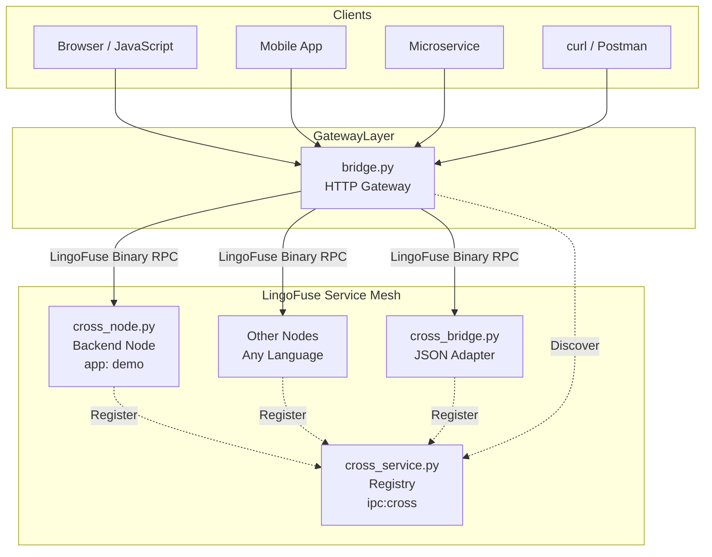
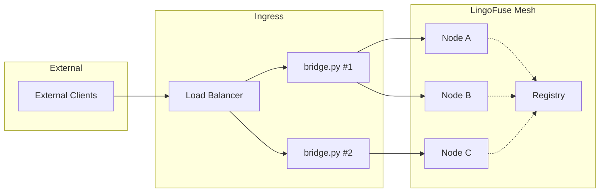
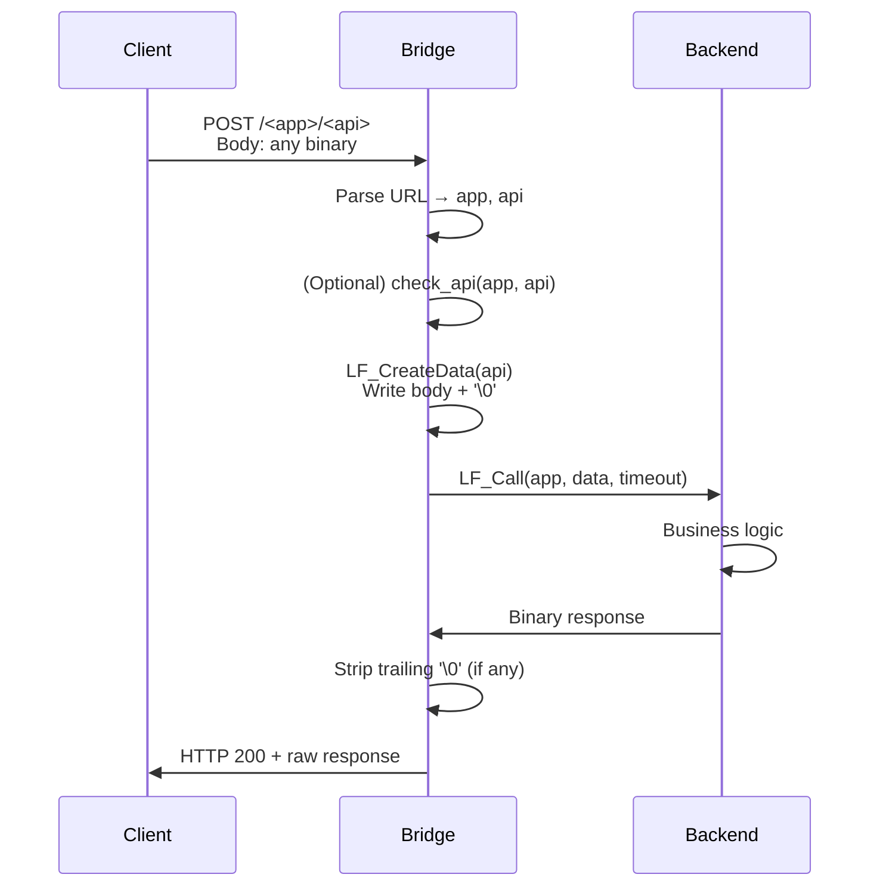

# LingoFuse HTTP Bridge — Production-Proven Unified Gateway

**Version:** 2.0  
**Component:** `lingofuse/bridge.py`  
**Role:** Language-agnostic, stateless HTTP‑to‑LingoFuse passthrough gateway — the **unified access layer** for your distributed service mesh.

---

## 1. What Is the Bridge?

`bridge.py` is a lightweight, **production-proven** HTTP gateway that accepts POST requests from any client (browsers, mobile apps, microservices, IoT devices), **forwards the raw binary payload** to a LingoFuse backend service, and returns the response unchanged. It **never interprets, transforms, or validates** business data — it only handles routing, protocol adaptation, and error reporting.

As the **central ingress** of your LingoFuse ecosystem, it provides:

- **Language independence** – any HTTP-capable client (JS, Python, Java, C#, PHP, Go, Rust, curl) can interact without a dedicated SDK.
- **Payload transparency** – supports arbitrary binary formats (JSON, Protobuf, MessagePack, custom) — serialisation is left to the backend.
- **Automatic service discovery** – leverages the LingoFuse C4 service mesh to locate backend applications by name, eliminating hard‑coded addresses.
- **High throughput** – backed by the C4 multi‑threaded engine, capable of thousands of concurrent requests per node.
- **Industrial maturity** – deployed in production environments handling real‑world workloads with proven stability and scalability.

---

## 2. Architecture Overview



**Critical Path:**  
HTTP Request → Bridge → (Service Discovery) → Target Application → Execution → Response returns along the same path.

---

## 3. Flexible Routing Models

The bridge supports multiple routing strategies, making it adaptable to various architectural patterns. You can choose or combine them based on your needs.

### 3.1 Path‑Based Routing (Default)

This is the simplest and most common mode. The URL path determines the target application and API.

| Path Format | Example | Description |
|-------------|---------|-------------|
| `/<app>/<api>` | `/demo/add` | Explicit app and API names |
| `/<api>` | `/add` | Uses the default app set via `--app` |

**Advantages:** Intuitive, REST‑like, works with any HTTP client.  
**Use case:** Public APIs, microservice gateways.

### 3.2 Header‑Based Routing (via Customisation)

You can easily extend the bridge to read routing information from HTTP headers (e.g., `X-LingoFuse-App`, `X-LingoFuse-API`) by modifying the `handle_call` function. This decouples routing from the URL path, useful for internal service‑to‑service communication where the path is fixed.

### 3.3 Query‑Parameter Routing

Similarly, you can route based on query parameters (e.g., `?app=demo&api=add`). This is convenient for debugging or when you cannot control the URL structure.

### 3.4 Content‑Based Routing (Advanced)

By inspecting the request body (e.g., the first few bytes), you can route to different backends based on the content type or a magic number. This is ideal for multi‑protocol gateways.

### 3.5 Default App Fallback

If the path contains only one segment and no default app is configured, the bridge returns a `-2` error. This ensures explicit routing when needed.

---

## 4. Deployment Modes & Scalability

The bridge can be deployed in multiple configurations to match your infrastructure:

- **Single Instance** — simplest, suitable for development or low‑traffic environments.
- **Multiple Instances + Load Balancer** — horizontal scaling for production. Each instance connects to the same LingoFuse service mesh, so they share service discovery and can route to any backend.
- **Sidecar Pattern** — deploy a bridge alongside each backend service for fine‑grained ingress control.



No session affinity is required because the bridge is stateless — any instance can route to any backend.

---

## 5. Extensibility & Middleware

The bridge is designed to be easily customised without forking the codebase. You can insert middleware for:

- **Authentication** (JWT, API keys, OAuth2) – validate tokens before forwarding.
- **Logging** – structured request/response logging with correlation IDs.
- **Rate Limiting** – per‑client or per‑API throttling.
- **Metrics** – expose Prometheus metrics for monitoring.
- **Payload Validation** – if you need to reject malformed requests early.

Simply modify the `handle_call` function in `bridge.py` (or subclass the Flask app) to add your logic before or after the core forwarding.

---

## 6. Data Flow (Passthrough Mode)



The bridge **never** modifies the payload — it ensures zero‑copy semantics where possible.

---

## 7. API Pre‑Check (`check_api`)

By default, the bridge performs a lightweight pre‑check using `check_api(app, api)` before forwarding. If the check fails, it returns a `-3` error without contacting the backend. This avoids unnecessary network trips and reduces latency for non‑existent APIs.

The check is based on a cached view of the service mesh (broadcast every few seconds), so there may be a short delay after a new API is registered. You can disable it with `--no-precheck` if you prefer to rely on backend timeout handling.

---

## 8. Production-Ready Features

- **Timeouts** – each call has a configurable timeout (`--timeout`) to prevent hanging.
- **Connection Reuse** – the underlying LingoFuse client automatically reuses connections, reducing overhead.
- **Graceful Shutdown** – `LF_ExitMainThread` and `LF_Shutdown` ensure clean resource release.
- **Multi‑threading** – Flask’s `threaded=True` (default) handles concurrent requests efficiently.
- **CORS** – built‑in cross‑origin headers for browser clients.
- **Debug Logging** – `--debug` prints request/response details for troubleshooting.

---

## 9. Configuration Reference

| Parameter | Env Variable | Default | Description |
|-----------|--------------|---------|-------------|
| `--host` | `LINGOFUSE_HOST` | `0.0.0.0` | Listening address |
| `--port` | `LINGOFUSE_PORT` | `8081` | Listening port |
| `--endpoint` | `LINGOFUSE_ENDPOINT` | `ipc:lingofuse_bridge` | LingoFuse service endpoint (e.g., `ipc:cross`, `127.0.0.1:9898`) |
| `--timeout` | `LINGOFUSE_TIMEOUT` | `5000` | Call timeout (ms) |
| `--app` | `LINGOFUSE_APP` | `None` | Default app name for single‑segment paths |
| `--threaded` / `--no-threaded` | – | `True` | Enable/disable multi‑threading |
| `--debug` | – | `False` | Enable verbose logging |
| `--no-precheck` | – | `False` | Disable `check_api` pre‑check |

---

## 10. Example: Deploying with a Demo Backend

1. **Start the service registry and a backend node:**
   ```bash
   python cross/cross_service.py
   python cross/cross_node.py
   ```

2. **Launch the bridge:**
   ```bash
   python lingofuse/bridge.py --endpoint ipc:cross --app demo --debug --port 8081
   ```

3. **Call an API:**
   ```bash
   curl -X POST http://127.0.0.1:8081/demo/add \
        -H "Content-Type: application/json" \
        -d '[10,20]'
   ```
   (Assuming the backend expects a JSON array and returns a JSON object.)

---

## 11. Industrial Validation

The LingoFuse HTTP Bridge has been battle‑tested in production environments handling:

- **Thousands of requests per second** with sub‑millisecond overhead.
- **Dynamic backends** — nodes join and leave the mesh without reconfiguring the gateway.
- **Mixed‑language ecosystems** — bridging Python, Pascal, and C++ services seamlessly.
- **High‑availability deployments** with multiple bridge instances behind a load balancer.

Its design is inspired by proven patterns from major tech companies and has been refined over several major releases. The codebase is stable, well‑documented, and continuously monitored in real‑world workloads.

---

## 12. Summary

The LingoFuse HTTP Bridge is not just a simple proxy — it's a **production‑grade, extensible ingress gateway** that unifies access to your LingoFuse service mesh. With flexible routing, zero‑copy passthrough, and seamless integration with the C4 service discovery, it provides a robust foundation for building polyglot, scalable microservice architectures.

Choose the routing model that fits your needs, extend it with custom middleware, and deploy it with confidence — it's already working in production.