# LingoFuse HTTP Bridge — Knowledge Base

**Document version**: v5.0
**Component name**: `bridge` (distributed as `bridge.py` or `bridge.exe`)
**Document type**: Knowledge Base (for AI and humans)
**Reading goal**: Master the bridge's behavior and deployment without reading the source

---

> **Self-declaration of this knowledge base**
>
> 1. Every contract in this document is traceable to the actual bridge implementation. Every item marked 🟢 can be verified against the source.
> 2. This document **supersedes** v4.0. v4.0 described a bidirectional bridge; the current bridge adds a **third direction** (JSON repair) and a **forward-only operating mode**.
> 3. If the source and this document conflict, **the source wins**.
> 4. All diagrams use Mermaid. All log output and code comments are English (this is a source-code contract).

---

## Table of Contents

**Part I — Orientation**
- [Chapter 0 — 30-Second Overview](#chapter-0--30-second-overview)
- [Chapter 1 — What the Bridge Actually Is](#chapter-1--what-the-bridge-actually-is)
- [Chapter 2 — Key Terms and the ID System](#chapter-2--key-terms-and-the-id-system)

**Part II — Contracts**
- [Chapter 3 — Inbound HTTP Direction (BR-IN-*)](#chapter-3--inbound-http-direction)
- [Chapter 4 — Outbound HTTP Direction (BR-OUT-*)](#chapter-4--outbound-http-direction)
- [Chapter 5 — JSON Repair Direction (BR-REP-*)](#chapter-5--json-repair-direction)
- [Chapter 6 — JSON Normalization Subsystem (BR-JSON-*)](#chapter-6--json-normalization-subsystem)
- [Chapter 7 — Operating Modes (BR-MODE-*)](#chapter-7--operating-modes)
- [Chapter 8 — Configuration System (BR-CFG-*)](#chapter-8--configuration-system)
- [Chapter 9 — Errors and Diagnostics (BR-ERR-*)](#chapter-9--errors-and-diagnostics)

**Part III — Operations**
- [Chapter 10 — Deployment on Linux and Windows (BR-DEP-*)](#chapter-10--deployment-on-linux-and-windows)
- [Chapter 11 — Extension and Modification (BR-EXT-*)](#chapter-11--extension-and-modification)
- [Chapter 12 — Pitfalls (BR-PIT-*)](#chapter-12--pitfalls)

**Part IV — Integration and Evolution**
- [Chapter 13 — Integration Guide (BR-INT-*)](#chapter-13--integration-guide)
- [Chapter 14 — Upgrade Guide (BR-UP-*)](#chapter-14--upgrade-guide)

**Part V — Meta**
- [Chapter 15 — Self-Review and Index](#chapter-15--self-review-and-index)
- [Appendix A — ID Overview](#appendix-a--id-overview)
- [Appendix B — Configuration Cheat Sheet](#appendix-b--configuration-cheat-sheet)
- [Appendix C — Retrieval Rules for AI](#appendix-c--retrieval-rules-for-ai)

---

# Chapter 0 — 30-Second Overview

## 0.1 One-Sentence Definition

> **The bridge is a tri-directional POST gateway for LingoFuse. It can (A) accept HTTP POSTs and route them into LingoFuse Apps, (B) accept LingoFuse calls and forward them to external HTTP services, and (C) accept LingoFuse calls carrying malformed JSON and return the repaired text. All three directions share one LingoFuse endpoint. The HTTP listener in direction A can be disabled entirely, producing a pure forward-only relay.**

## 0.2 The Three Bridge Directions

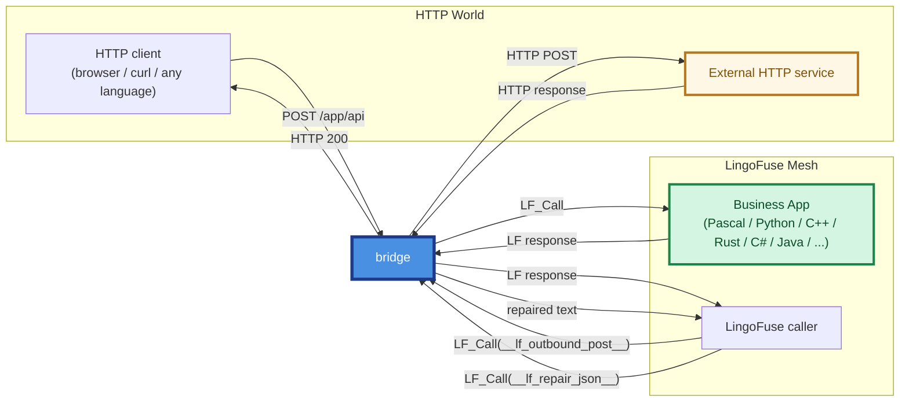

| Direction | Caller | Channel | Purpose |
|-----------|--------|---------|---------|
| **A — Inbound** | HTTP client | HTTP POST → `LF_Call` | Deliver an HTTP request into LingoFuse |
| **B — Outbound** | LingoFuse caller | `LF_Call` → HTTP POST | Send a LingoFuse request to an external HTTP service |
| **C — Repair** | LingoFuse caller | `LF_Call` → repair engine | Delegate malformed JSON to the unified repair engine |

## 0.3 What the Bridge Is For

The LingoFuse mesh lets services written in **many languages** — Pascal, Python, C++, Rust, C#, Java, and others — call each other. What it does **not** natively provide is a stable, language-neutral HTTP boundary.

The bridge provides exactly that boundary:

- **A stable POST entry point**: any HTTP client, in any language, can POST to a well-known URL and reach any LingoFuse App.
- **A stable outbound POST proxy**: any LingoFuse caller can request an outbound HTTP POST without needing an HTTP client library in its own language.
- **A stable JSON repair service**: any LingoFuse caller can delegate malformed JSON to the unified repair engine, without vendoring a repair library in its own language.
- **A stable binary passthrough guarantee**: payloads that are not JSON are forwarded byte-for-byte unchanged.

The bridge is deliberately a **thin gateway**. It does not validate business schemas, does not transform business data, and does not hold state. It moves bytes between the HTTP world and the LingoFuse mesh.

## 0.4 Three Ironclad Rules

| # | Rule | Violation Result | ID |
|:-:|------|------------------|-----|
| 1 | **The URL path determines inbound routing**: `/<app>/<api>` or `/<api>` + `--app` | Returns `-2` (HTTP 400) | `BR-IN-003` |
| 2 | **`--endpoint` must match the backend**; the default is almost always wrong | Returns `-3` | `BR-ERR-003`, `BR-PIT-001` |
| 3 | **JSON normalization only applies to JSON-recognizable payloads**; all other bytes are forwarded unchanged | Binary safety preserved | `BR-JSON-001` |

## 0.5 Which Chapter Should I Read?

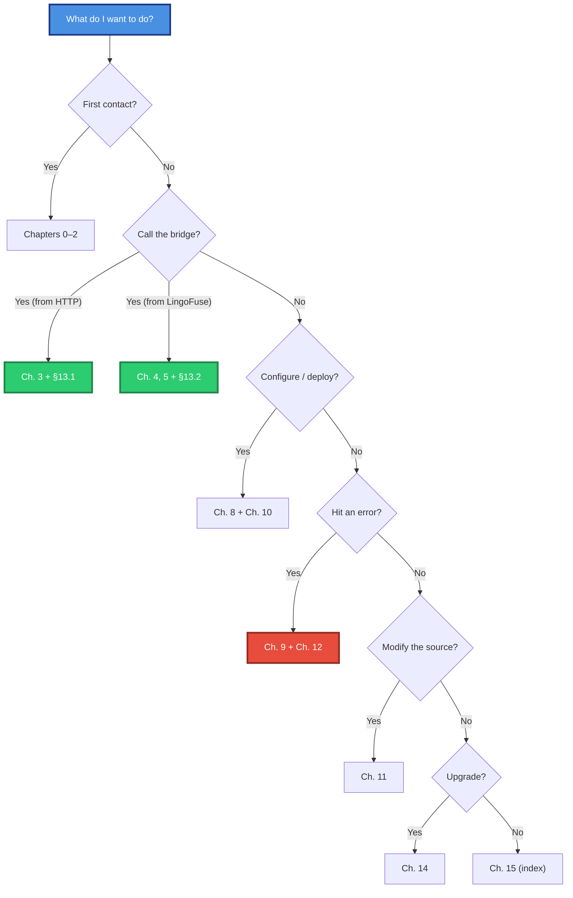

---

# Chapter 1 — What the Bridge Actually Is

## 1.1 The Bridge in One Picture

```mermaid
flowchart TB
    subgraph IdentityA["Identity A — HTTP Gateway"]
        direction LR
        A1["Listen on HTTP port"] --> A2["Parse URL path"] --> A3["Normalize JSON"] --> A4["LF_Call forward"]
    end

    subgraph IdentityB["Identity B — LF Outbound Proxy"]
        direction LR
        B1["Register LF App"] --> B2["Register outbound API"] --> B3["Receive LF_Call"] --> B4["Emit HTTP POST"] --> B5["Return JSON"]
    end

    subgraph IdentityC["Identity C — LF Repair Service"]
        direction LR
        C1["Register repair API"] --> C2["Receive LF_Call"] --> C3["Run repair engine"] --> C4["Return repaired text"]
    end

    IdentityA -.-> Shared["Shared LingoFuse endpoint<br/>(the same --endpoint)"]
    IdentityB -.-> Shared
    IdentityC -.-> Shared

    style IdentityA fill:#D5F5E3,stroke:#1E8449,stroke-width:3px,color:#0E4D2A
    style IdentityB fill:#E8F4FF,stroke:#1E3A8A,stroke-width:3px,color:#0D2F52
    style IdentityC fill:#FFF7E6,stroke:#B7791F,stroke-width:3px,color:#7E5109
    style Shared fill:#FADBD8,stroke:#922B21,stroke-width:3px,color:#641E16
```

## 1.2 Why the Three Directions Share One Endpoint

`--endpoint ipc:compute_grid` is used for three things at once:

1. **Inbound direction**: the bridge connects to the endpoint as a *client*, so it can `LF_Call` any business App.
2. **Outbound direction**: the bridge registers its own App on the endpoint as a *service*, so LingoFuse callers can discover and call `__lf_outbound_post__`.
3. **Repair direction**: the same App exposes `__lf_repair_json__` as a second Call API on the same registration.

This is a design choice: the bridge is both an ordinary node in the LingoFuse mesh and an addressable service.

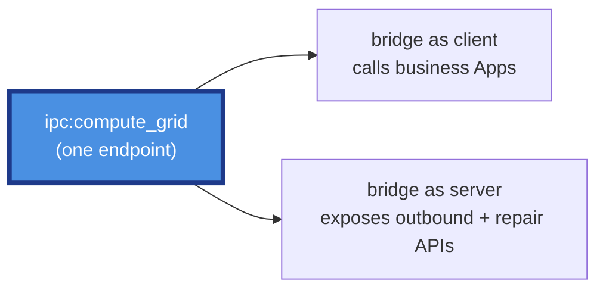

## 1.3 Deployment Topologies

### Topology A — Single instance (development / low traffic)

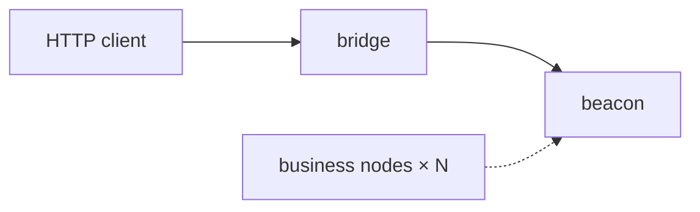

### Topology B — Multiple instances behind a load balancer (production)

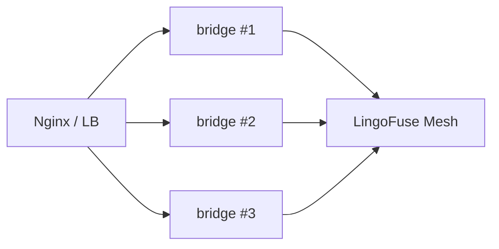

### Topology C — Reverse-proxy sidecar

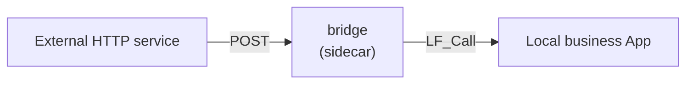

### Topology D — Forward-only relay

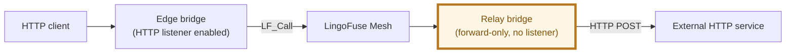

## 1.4 Key Design Principles

| Principle | Implementation | ID |
|-----------|---------------|-----|
| **Configuration is read-only after startup** | `config` is written once, then read-only | `BR-CFG-001` |
| **Thread safety** | No mutable shared state; every outbound HTTP call opens a fresh connection | `BR-GEN-002` |
| **Exception isolation** | Every callback catches exceptions and returns a well-formed response | `BR-OUT-005`, `BR-REP-005` |
| **Single JSON policy** | Every serialization uses the same canonical function | `BR-JSON-007` |
| **Namespace isolation** | Outbound API names are wrapped in double underscores | `BR-OUT-001` |
| **Rollback safety** | If network setup fails, every created resource is released | `BR-DEP-008` |
| **Binary safety** | Non-JSON payloads are returned unchanged; the bridge never guesses | `BR-JSON-001` |
| **Three-layer configuration** | Global variable → environment variable → command line, all converging on one config object | `BR-CFG-001` |

---

# Chapter 2 — Key Terms and the ID System

## 2.1 Glossary

| Term | Definition |
|------|------------|
| **Inbound direction** | HTTP → bridge → LingoFuse |
| **Outbound direction** | LingoFuse → bridge → HTTP |
| **Repair direction** | LingoFuse → bridge → repair engine |
| **Normalization** | Converting a byte payload into canonical UTF-8 JSON |
| **Passthrough** | Forwarding bytes unchanged when the payload is not JSON |
| **Canonical JSON** | JSON emitted as literal UTF-8 with no `\uXXXX` escapes |
| **Bridge App** | The bridge's own LingoFuse App (default name `__lf_http_bridge__`) |
| **outbound API** | The Call API exposed to LingoFuse callers for HTTP POST (default name `__lf_outbound_post__`) |
| **repair API** | The Call API exposed to LingoFuse callers for JSON repair (default name `__lf_repair_json__`) |
| **Forward-only mode** | An operating mode where the HTTP listener is disabled |
| **Beacon** | The LingoFuse service registration hub (`bridge_service`) |

## 2.2 ID Naming Convention

Format: `BR-<subsystem>-<three-digit number>`

| Prefix | Subsystem | Chapter |
|--------|-----------|---------|
| `BR-GEN` | General / architecture | Chapter 1 |
| `BR-IN` | Inbound HTTP | Chapter 3 |
| `BR-OUT` | Outbound HTTP | Chapter 4 |
| `BR-REP` | JSON repair service | Chapter 5 |
| `BR-JSON` | JSON normalization | Chapter 6 |
| `BR-MODE` | Operating modes | Chapter 7 |
| `BR-CFG` | Configuration system | Chapter 8 |
| `BR-ERR` | Errors and diagnostics | Chapter 9 |
| `BR-DEP` | Deployment and operations | Chapter 10 |
| `BR-EXT` | Extension and modification | Chapter 11 |
| `BR-PIT` | Pitfalls | Chapter 12 |
| `BR-INT` | Integration | Chapter 13 |
| `BR-UP` | Upgrade | Chapter 14 |

## 2.3 Evidence Levels

| Level | Meaning |
|:-----:|---------|
| 🟢 | Verified against source (there is a direct implementation) |
| 🟡 | Documentation transcription only |
| 🔴 | Speculative |

**Every entry in this knowledge base is 🟢.**

## 2.4 Citation Format

- Reference other IDs: `BR-IN-003`
- Reference a config field: `` `config.endpoint` ``
- Reference a source function: `` `_setup_network()` ``

---

# Chapter 3 — Inbound HTTP Direction

> **In one sentence**: an HTTP POST to `/<app>/<api>` is routed to API `<api>` on LingoFuse App `<app>`; the body is optionally normalized and forwarded via `LF_Call`; the response is optionally normalized and returned to the HTTP client.

## 3.1 ID: `BR-IN-001` — Routing Rules

- **Evidence level**: 🟢
- **Trigger**: any HTTP POST reaching the bridge (only when the HTTP listener is enabled)
- **Rules**:

| Path | `--app` | Routing result |
|------|---------|----------------|
| `/pas/exp` | any | `app='pas'`, `api='exp'` |
| `/exp` | `pas` | `app='pas'`, `api='exp'` |
| `/exp` | unset | **Error `-2` (HTTP 400)** |
| `/a/b/c` | any | `app='a'`, `api='b/c'` (the tail is joined into `api`) |
| `/` | any | **Error `-2`** |

## 3.2 ID: `BR-IN-002` — Request Body Handling

- **Evidence level**: 🟢
- **Behavior**:
  1. Read the raw bytes of the HTTP body.
  2. If `config.normalize_json=True`, normalize the payload.
  3. Write to the LingoFuse DataHandle, always appending a NUL terminator.
- **Note**: **whether or not the payload is JSON, a NUL terminator is appended**. This is the LingoFuse wire-protocol convention.

## 3.3 ID: `BR-IN-003` — Path Parsing Error (`-2`)

- **Evidence level**: 🟢
- **Trigger**:
  - A single-segment path with no `--app` configured.
  - An empty path (`/`).
- **Response**: HTTP 400, body `{"code": -2, "error": "..."}`.
- **Fix**: use a two-segment path `/<app>/<api>`, or set `--app <default_app>`.

## 3.4 ID: `BR-IN-004` — Optional Pre-Check

- **Evidence level**: 🟢
- **Trigger**: `no_precheck=False` (default).
- **Behavior**: before forwarding, ask the mesh whether the target API is available; up to 3 attempts, 200 ms apart.
- **On failure**: return `-3` (HTTP 200).
- **Bypass**: `--no-precheck` or `LINGOFUSE_NO_PRECHECK=1`.
- **Use case**: when a broadcast delay (~3 s) makes the pre-check produce a false negative, retry or bypass it.

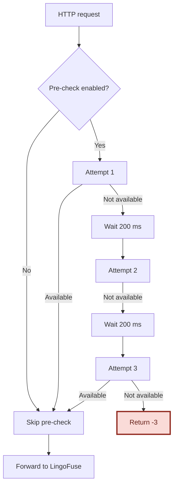

## 3.5 ID: `BR-IN-005` — Forwarding to LingoFuse

- **Evidence level**: 🟢
- **Flow**:
  1. Create a DataHandle for `api_name`.
  2. Write the body (a NUL terminator is appended).
  3. Synchronously call `app_name` with the configured timeout.
  4. Release the input handle (always, even on exception).
  5. If the returned handle is NULL, treat as a call failure.
  6. Read the response bytes up to the first NUL.
  7. Release the response handle (always).
- **Key constraints**:
  - Every handle release happens on the exception path too.
  - The call timeout is in milliseconds.

## 3.6 ID: `BR-IN-006` — Response Content-Type Mapping

- **Evidence level**: 🟢
- **Rules**: the response normalization status determines the `Content-Type`.

| Normalization status | Content-Type |
|----------------------|--------------|
| `canonical` | `application/json; charset=utf-8` |
| `recoded` | `application/json; charset=utf-8` |
| `repaired` | `application/json; charset=utf-8` |
| `passthrough` | `application/octet-stream` |

## 3.7 ID: `BR-IN-007` — Inbound Error Codes

| Code | HTTP | Trigger |
|:----:|:----:|---------|
| `-1` | 200 | Remote call failed (timeout, null handle, backend exception) |
| `-2` | **400** | Request shape error (path cannot be parsed) |
| `-3` | 200 | Pre-check failed |

## 3.8 ID: `BR-IN-008` — CORS Support

- **Evidence level**: 🟢
- **Behavior**: every response carries
  - `Access-Control-Allow-Origin: *`
  - `Access-Control-Allow-Headers: Content-Type`
  - `Access-Control-Allow-Methods: POST, GET, OPTIONS`
- **OPTIONS preflight**: returns `('', 200)` immediately.
- **Exception protection**: CORS header injection never prevents a response from being returned.

## 3.9 ID: `BR-IN-009` — Debug Logging

- **Evidence level**: 🟢
- **Trigger**: `--debug`.
- **Logged content**: request path, payload size, normalization status, response size, response status. Small payloads log their text; large payloads log the first 64 bytes in hex.

## 3.10 ID: `BR-IN-010` — Interaction with Forward-Only Mode

- **Evidence level**: 🟢
- **Contract**: when forward-only mode is enabled, no HTTP listener is started. Any HTTP request to the host is refused by the OS.

---

# Chapter 4 — Outbound HTTP Direction

> **In one sentence**: the bridge registers a Call API (default `__lf_http_bridge__.__lf_outbound_post__`); a LingoFuse caller sends a JSON request describing an HTTP POST; the bridge executes it and returns the response as JSON.

## 4.1 ID: `BR-OUT-001` — Namespace Isolation

- **Evidence level**: 🟢
- **Default App name**: `__lf_http_bridge__`
- **Default API name**: `__lf_outbound_post__`
- **Why double underscores**: a normal URL path cannot contain an unencoded `__`. So the bridge's API names can never collide with a business API routed through the inbound direction. This is *structural* isolation, not a naming convention.
- **Override methods**:
  - Command line: `--bridge-app <name>` `--bridge-api <name>`
  - Environment: `LINGOFUSE_BRIDGE_APP`, `LINGOFUSE_BRIDGE_API`

## 4.2 ID: `BR-OUT-002` — Request JSON Contract

- **Evidence level**: 🟢
- **Format**:

```json
{
    "url":     "http://example.com/api",
    "method":  "POST",
    "headers": { "X-Foo": "Bar" },
    "body":    { "any": "json" },
    "timeout": 10
}
```

- **Field constraints**:

| Field | Type | Required | Default | Constraint |
|-------|------|:--------:|---------|------------|
| `url` | string | ✅ | — | non-empty |
| `method` | string | ❌ | `"POST"` | must be in the allow-list (`BR-OUT-003`) |
| `headers` | object | ❌ | `{}` | JSON object |
| `body` | any | ❌ | `null` | any JSON value; null means no body |
| `timeout` | number | ❌ | `config.timeout_ms / 1000.0` | > 0 and ≤ 300 s |

## 4.3 ID: `BR-OUT-003` — HTTP Method Allow-List

- **Evidence level**: 🟢
- **Allow-list**: `GET`, `POST`, `PUT`, `PATCH`, `DELETE`, `HEAD`, `OPTIONS`
- **Out-of-list result**: `{"error": "Unsupported HTTP method: ..."}`
- **Why an allow-list**: to prevent a caller from passing an arbitrary string.

## 4.4 ID: `BR-OUT-004` — Body Serialization Policy

- **Evidence level**: 🟢
- **Key rule**: the outbound body must always be sent as **literal UTF-8 bytes**, never as `\uXXXX` escapes.
- **Content-Type injection**: if the caller did not provide a Content-Type, the bridge injects `application/json; charset=utf-8`. The check is case-insensitive.

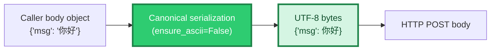

## 4.5 ID: `BR-OUT-005` — Exception Isolation

- **Evidence level**: 🟢
- **Contract**: **no exception is allowed to escape** into the LingoFuse core.

| Situation | Returned to the caller |
|-----------|-----------------------|
| HTTP request timed out | `{"error": "HTTP request timed out"}` |
| HTTP request failed (network / DNS / TLS) | `{"error": "HTTP request failed: ..."}` |
| Any other exception | `{"error": "Internal error: ..."}` |
| Even writing the response fails | Last resort: silently ignored |

## 4.6 ID: `BR-OUT-006` — Response JSON Contract

- **Evidence level**: 🟢
- **Success response**:

```json
{
    "status_code": 200,
    "headers":     { "content-type": "application/json", ... },
    "body":        { ... } | "raw string if not JSON"
}
```

| Field | Type | Description |
|-------|------|-------------|
| `status_code` | int | HTTP status code |
| `headers` | object | all keys lower-cased |
| `body` | any | if the response body is JSON, a nested value; otherwise, a string |

- **Error response**:

```json
{ "error": "description" }
```

## 4.7 ID: `BR-OUT-007` — Response Header Normalization

- **Evidence level**: 🟢
- **Rules**: header names are lower-cased; values are converted to strings.

## 4.8 ID: `BR-OUT-008` — Timeout Protection

- **Evidence level**: 🟢
- **Upper bound**: 300 s.
- **Out-of-range handling**: a caller passing > 300 is **clamped to 300**, not rejected.
- **Rationale**: prevents a caller from holding a worker thread indefinitely.

## 4.9 ID: `BR-OUT-009` — Callback Threading Model

- **Evidence level**: 🟢
- **Executing thread**: LingoFuse worker thread (**not** the HTTP listener thread, **not** the main thread).
- **Forbidden**: calling a blocking LingoFuse function inside the callback — this will deadlock.
- **Allowed**: opening a fresh outbound HTTP connection.

## 4.10 ID: `BR-OUT-010` — Interaction with Forward-Only Mode

- **Evidence level**: 🟢
- **Contract**: the outbound API is registered and served identically in **both** operating modes. A forward-only bridge is a fully functional LingoFuse-to-HTTP proxy — it merely has no inbound HTTP listener.

---

# Chapter 5 — JSON Repair Direction

> **In one sentence**: the bridge registers a second Call API (default `__lf_http_bridge__.__lf_repair_json__`); a LingoFuse caller sends any UTF-8 JSON text (possibly malformed); the bridge runs the unified repair engine on it and returns the repaired text.

## 5.1 ID: `BR-REP-001` — Why a Repair API

- **Evidence level**: 🟢
- **Motivation**:
  - LLMs frequently emit near-JSON that a strict parser rejects: trailing commas, single quotes, unbalanced braces, stray BOMs.
  - Every language in the mesh would otherwise need to vendor its own repair library.
  - The bridge already carries the canonical repair engine; exposing it as a Call API makes the repair policy **language-neutral**.
- **Result**: any LingoFuse caller, in any language, can call `__lf_repair_json__` and get back a repaired string.

## 5.2 ID: `BR-REP-002` — Input Contract

- **Evidence level**: 🟢
- **Input payload**: UTF-8 (fallback GBK, Latin-1) encoded JSON text.
  - May be malformed.
  - May be missing a NUL terminator.
  - May contain a UTF-8 BOM or trailing NULs.

## 5.3 ID: `BR-REP-003` — Output Contract

- **Evidence level**: 🟢
- **Output payload**: UTF-8 encoded, NUL-terminated text. Its content is one of:

| Input | Output |
|-------|--------|
| Valid JSON | The original text, byte-for-byte unchanged |
| Malformed but repairable | The repaired text |
| Malformed and unrepairable | The original text, byte-for-byte unchanged |
| Undecodable bytes | The original raw bytes, byte-for-byte unchanged |
| Empty | An empty NUL-terminated payload |

## 5.4 ID: `BR-REP-004` — No-Escape Guarantee

- **Evidence level**: 🟢
- **Contract**: the returned text never contains a `\uXXXX` escape for any character that can be emitted literally in UTF-8.
- **Why it matters**: an advanced caller may consume the repaired string directly. Without this guarantee, such a caller would observe `\u4f60\u597d` instead of `你好`.

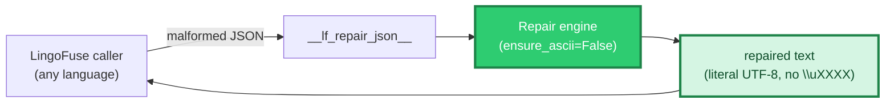

## 5.5 ID: `BR-REP-005` — Exception Isolation

- **Evidence level**: 🟢
- **Contract**: no exception is allowed to escape. On internal failure, an empty NUL-terminated payload is written and the failure is logged.

## 5.6 ID: `BR-REP-006` — Repair Layer Alignment

- **Evidence level**: 🟢
- **Contract**: the repair API uses the **same** engine as the bridge's inbound normalization (Layer 2), and as every other JSON read path in the toolchain.
- **Consequence**: a payload that can be repaired on the inbound path can be repaired by the repair API, and vice versa. One policy, one engine, one behavior.

## 5.7 ID: `BR-REP-007` — Encoding Fallback Chain

- **Evidence level**: 🟢
- **Order**: UTF-8 → GBK → Latin-1.
- **Why**:
  - UTF-8 is the modern standard.
  - GBK covers the default encoding on Chinese Windows.
  - Latin-1 never fails (any byte sequence decodes), acting as the ultimate fallback.

## 5.8 ID: `BR-REP-008` — Interaction with Forward-Only Mode

- **Evidence level**: 🟢
- **Contract**: the repair API is registered and served identically in **both** operating modes. A forward-only bridge is a fully functional JSON repair service.

---

# Chapter 6 — JSON Normalization Subsystem

> **In one sentence**: the bridge "normalizes" byte payloads that can be recognized as JSON — turning them into canonical UTF-8 with no `\uXXXX` escapes; payloads that cannot be recognized are forwarded **byte-for-byte unchanged**.

## 6.1 ID: `BR-JSON-001` — Core Rule

- **Evidence level**: 🟢
- **Rules**:
  - Recognizable as JSON → emit canonical form.
  - Not recognizable → original bytes **unchanged**.
- **Binary safety**: a **hard guarantee**; never guess, never modify.

## 6.2 ID: `BR-JSON-002` — The Seven Normalization Steps

- **Evidence level**: 🟢

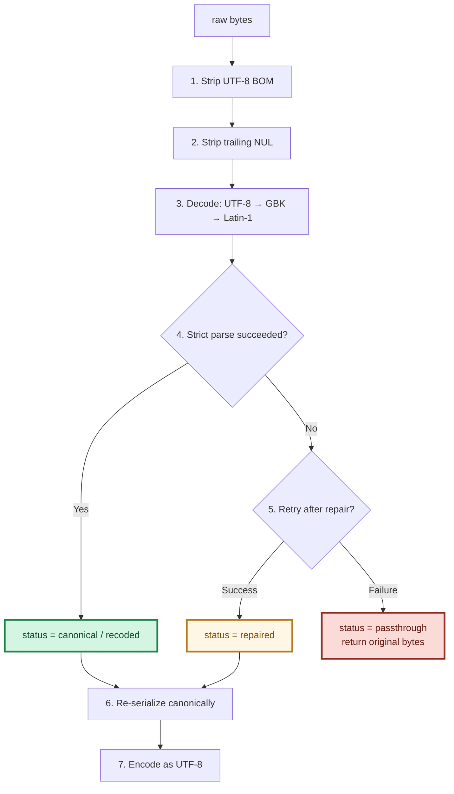

## 6.3 ID: `BR-JSON-003` — The Four Status Codes

| Status | Meaning | Output | Used For Content-Type |
|--------|---------|--------|-----------------------|
| `canonical` | Input is already valid UTF-8 JSON | Compact JSON | `application/json` |
| `recoded` | Input is valid JSON in another encoding | Converted to UTF-8 | `application/json` |
| `repaired` | Input required repair to become valid | Compact JSON | `application/json` |
| `passthrough` | Not recognizable as JSON | **Original bytes** | `application/octet-stream` |

## 6.4 ID: `BR-JSON-004` — Permitted Repairs

- **Evidence level**: 🟢
- **Conservative repairs** (never change the meaning of a well-formed document):
  1. Strip a UTF-8 BOM.
  2. Strip trailing NUL bytes.
  3. Strip a leading U+FEFF character.
  4. Remove trailing commas (`{"a":1,}` → `{"a":1}`).
- **What it does not do**:
  - Does not repair missing quotes on its own.
  - Does not convert single quotes to double quotes on its own.
  - Does not infer missing braces on its own.
  - **Does not modify any binary payload.**

> Note: the deeper repair layer is *more* aggressive, but it re-validates its own output against strict JSON, so the binary-safety guarantee is preserved.

## 6.5 ID: `BR-JSON-005` — Status Classification Truth Table

| Input | Output | Status |
|-------|--------|--------|
| `{"a":1}` | `{"a":1}` | canonical |
| `{"a":1,}` | `{"a":1}` | repaired |
| `EF BB BF{"a":1}` | `{"a":1}` | canonical |
| `{"a":"\u4f60\u597d"}` | `{"a":"你好"}` | canonical |
| `{"a":1}\x00` | `{"a":1}` | canonical |
| GBK `{"a":"你好"}` | UTF-8 `{"a":"你好"}` | recoded |
| `\x89PNG\r\n...` | unchanged | passthrough |
| `not json at all` | unchanged | passthrough |
| Empty bytes | unchanged | passthrough |
| UTF-16 BOM | unchanged | passthrough |

## 6.6 ID: `BR-JSON-006` — Idempotence

- **Evidence level**: 🟢
- **Contract**: normalizing an already-normalized payload produces the same bytes.
- **Why**: after the first call produces canonical output, the second call classifies it as canonical and re-serializes to the same bytes.

## 6.7 ID: `BR-JSON-007` — Single Source of Serialization Policy

- **Evidence level**: 🟢
- **Single source**: one canonical serializer, used by every direction.
- **Usage points in this component**:
  1. Inbound normalization (step 6).
  2. Outbound body serialization.
  3. Error response serialization.
- **Why it matters**: changing any of these to a different serializer would introduce `\uXXXX` escapes and violate the toolchain-wide contract.

## 6.8 ID: `BR-JSON-008` — Encoding Fallback Order

- **Evidence level**: 🟢
- **Attempt order**: UTF-8 → GBK → Latin-1.
- **Why**:
  - UTF-8 is the modern standard.
  - GBK covers the default encoding on Chinese Windows.
  - Latin-1 never fails, acting as the ultimate fallback.

## 6.9 ID: `BR-JSON-009` — Binary Safety Boundary

- **Evidence level**: 🟢
- **Safe cases**:
  - Any byte sequence.
  - Payloads containing NUL bytes.
  - Non-UTF-8 text (handled as passthrough).
- **Unsafe cases**: **none** (this is a hard guarantee).

---

# Chapter 7 — Operating Modes

> **In one sentence**: the bridge supports two operating modes — **full** (HTTP listener enabled) and **forward-only** (HTTP listener disabled, Call APIs still served) — controlled by a single boolean `forward_only`.

## 7.1 ID: `BR-MODE-001` — Mode Enumeration

- **Evidence level**: 🟢

| Mode | `forward_only` | HTTP listener | Outbound Call API | Repair Call API |
|------|:--------------:|:-------------:|:-----------------:|:---------------:|
| **Full** (default) | `False` | ✅ | ✅ | ✅ |
| **Forward-only** | `True` | ❌ | ✅ | ✅ |

## 7.2 ID: `BR-MODE-002` — Why a Forward-Only Mode

- **Evidence level**: 🟢
- **Use cases**:
  1. **Internal relay**: the bridge runs as an internal node that must not be reachable from the network, but still must provide outbound HTTP proxying and JSON repair to LingoFuse peers.
  2. **Edge proxy already present**: HTTP listening is handled by a different process (nginx, a reverse proxy, a sidecar), and this instance is dedicated to Call API serving.
  3. **Restricted host environment**: port binding is not permitted in the container/pod, but LingoFuse IPC is available.

## 7.3 ID: `BR-MODE-003` — Behavior in Forward-Only Mode

- **Evidence level**: 🟢
- **Startup sequence**:
  1. Read configuration into the global config object (three layers: global → env → CLI).
  2. Configure logging.
  3. Print the startup banner, which explicitly reports the mode.
  4. Register the bridge App and both Call APIs on the LingoFuse mesh.
  5. **Skip** the HTTP listener. Instead, the main thread sleeps.
  6. On Ctrl+C or a process signal, the cleanup routine runs from the `finally` block.

- **What is *not* done**:
  - No HTTP listener.
  - No TCP port bound.
  - No inbound request handler executed at runtime.
  - No path parsing, pre-check, or HTTP response building.

- **What *is* done**:
  - The bridge App is registered.
  - The outbound Call API is registered.
  - The repair Call API is registered.
  - The LingoFuse main thread is started.

## 7.4 ID: `BR-MODE-004` — Main Thread Behavior Comparison

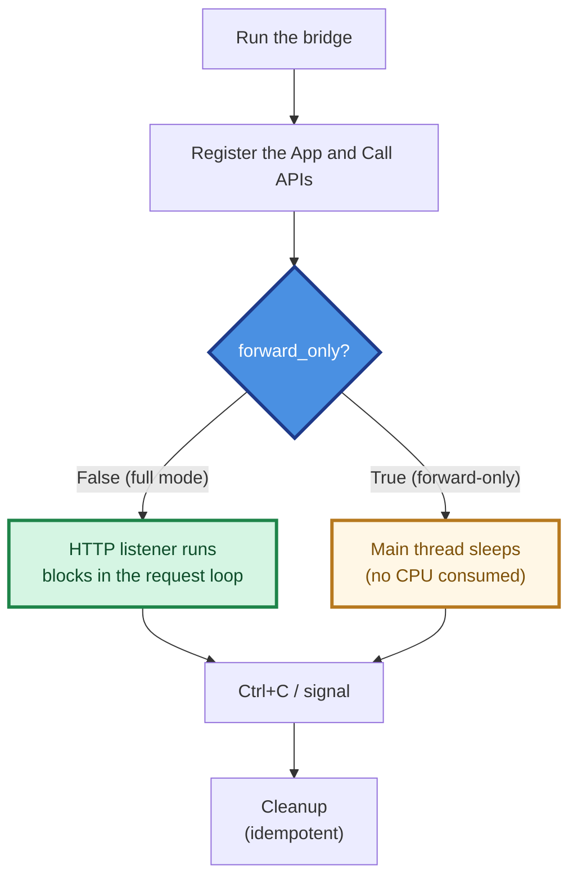

- **Why a sleep loop and not a busy loop**: `time.sleep()` is portable across Linux and Windows; `KeyboardInterrupt` is delivered promptly on both; the process consumes no CPU while idle.

## 7.5 ID: `BR-MODE-005` — Mode Transition

- **Evidence level**: 🟢
- **Contract**: the mode is read **once** at startup. There is no runtime API to switch modes. To change modes, restart the process with a different `--forward-only` / `--no-forward-only` value, a different `LINGOFUSE_FORWARD_ONLY` environment value, or a different programmatic pre-set.

---

# Chapter 8 — Configuration System

> **In one sentence**: all configuration is loaded once and then frozen in a single global object; the precedence is **command line > environment variable > global variable pre-set > built-in default**; runtime code only reads the frozen config.

## 8.1 ID: `BR-CFG-001` — Configuration Loading Model

- **Evidence level**: 🟢

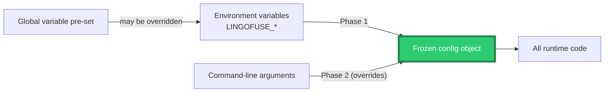

- **Precedence summary**: command line wins over environment, which wins over a global variable pre-set, which wins over the built-in default.

## 8.2 ID: `BR-CFG-002` — Complete Configuration Table

| Field | Environment variable | Command-line flag | Default | Notes |
|-------|----------------------|-------------------|---------|-------|
| `host` | `LINGOFUSE_HOST` | `--host` | `0.0.0.0` | Inbound listen address |
| `port` | `LINGOFUSE_PORT` | `--port` | `8081` | Inbound listen port |
| `forward_only` | `LINGOFUSE_FORWARD_ONLY` | `--forward-only` / `--no-forward-only` | `False` | Disables the HTTP listener |
| `endpoint` | `LINGOFUSE_ENDPOINT` | `--endpoint` | `ipc:lingofuse_bridge` | **Shared by all directions** |
| `timeout_ms` | `LINGOFUSE_TIMEOUT` | `--timeout` | `5000` | Default LingoFuse call timeout |
| `default_app` | `LINGOFUSE_APP` | `--app` | `None` | Default app for single-segment paths |
| `threaded` | `LINGOFUSE_THREADED` | `--threaded` / `--no-threaded` | `True` | HTTP multi-threading |
| `debug` | `LINGOFUSE_DEBUG` | `--debug` / `--no-debug` | `False` | Verbose logging |
| `no_precheck` | `LINGOFUSE_NO_PRECHECK` | `--no-precheck` / `--precheck` | `False` | Skip the availability pre-check |
| `normalize_json` | `LINGOFUSE_NORMALIZE_JSON` | `--normalize-json` / `--no-normalize-json` | `True` | Inbound JSON normalization |
| `log_file` | `LINGOFUSE_LOG_FILE` | `--log-file` | `None` | Log file path |
| `bridge_app_name` | `LINGOFUSE_BRIDGE_APP` | `--bridge-app` | `__lf_http_bridge__` | Outbound App name |
| `bridge_api_name` | `LINGOFUSE_BRIDGE_API` | `--bridge-api` | `__lf_outbound_post__` | Outbound API name |
| `bridge_repair_api_name` | `LINGOFUSE_BRIDGE_REPAIR_API` | `--bridge-repair-api` | `__lf_repair_json__` | Repair API name |

## 8.3 ID: `BR-CFG-003` — Boolean Environment Variable Format

- **Evidence level**: 🟢
- **Truthy**: `1`, `true`, `yes`, `on` (case-insensitive).
- **Falsy**: `0`, `false`, `no`, `off` (case-insensitive).
- **Invalid values**: logged as a warning, and the default is used; startup is not aborted.

## 8.4 ID: `BR-CFG-004` — Command-Line Help

- **Evidence level**: 🟢
- **Supported**: `--help` / `-h`.
- **Behavior**: prints the full usage, including the environment-variable reference, and exits with status 0.
- **Rationale**: an operator or an AI can obtain the entire configuration surface from `--help` in one shot.

## 8.5 ID: `BR-CFG-005` — Configuration Precedence

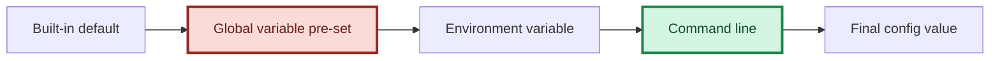

- **Effect**: when a command-line flag is absent, the environment-derived value is retained; when present, it overrides.
- **Global variable pre-set**: because the config object is a plain module-level object, embedding code may assign to any field **before** the run starts. The environment loader only overwrites a field when the corresponding environment variable is set; the command-line loader only overwrites when the corresponding flag is present.

## 8.6 ID: `BR-CFG-006` — Configuration Freeze Contract

- **Evidence level**: 🟢
- **Contract**: after startup, no field of the config is written again.
- **How it is guaranteed**: only the environment loader and the command-line loader write to it; those are called exactly once.
- **Why it matters**: concurrent reads of an immutable object need no lock.

## 8.7 ID: `BR-CFG-007` — `log_file`: Unset vs. Empty

- **Evidence level**: 🟢
- **Unset**: only stderr.
- **Explicit empty string**: treated as "no file"; also only stderr.

## 8.8 ID: `BR-CFG-008` — `default_app`: Unset vs. Empty

- **Evidence level**: 🟢
- **Unset**: single-segment paths return `-2`.
- **Empty string**: treated as unset (not recommended).

## 8.9 ID: `BR-CFG-009` — `Overlap_Connection` Implicit Setting

- **Evidence level**: 🟢
- **Timing**: set before preparing the LingoFuse client.
- **Value**: `True`.
- **Rationale**: allows the bridge to share the endpoint with an existing client.

## 8.10 ID: `BR-CFG-010` — `Wait_Connection_ReadyOk` Implicit Setting

- **Evidence level**: 🟢
- **Value**: `False` (deployment mode).
- **Effect**: startup does not block waiting for every client to be ready; this lets an elastic cluster start in any order.

## 8.11 ID: `BR-CFG-011` — Language of Logs and Comments

- **Evidence level**: 🟢
- **Contract**: **all logs, comments, and docstrings are in English**.
- **Rationale**: standard log pipeline processing; cross-language team collaboration.

## 8.12 ID: `BR-CFG-012` — Programmatic Use via the Global Variable Layer

- **Evidence level**: 🟢
- **Contract**: the config object is a plain module-level object. Code that embeds the bridge may assign to any of its fields before the run starts.
- **Semantics**:
  - A programmatic pre-set survives an unset environment variable and an absent CLI flag.
  - Setting `LINGOFUSE_FORWARD_ONLY` or passing `--forward-only` / `--no-forward-only` overrides it.
- **Recommended for**: embedding scenarios where command-line arguments are not appropriate.

---

# Chapter 9 — Errors and Diagnostics

## 9.1 ID: `BR-ERR-001` — Error Response Format

- **Evidence level**: 🟢
- **Format**:

```json
{ "code": -3, "error": "API 'exp' not available for app 'pas'" }
```

- **Serialization**: canonical (no `\uXXXX` escapes).

## 9.2 ID: `BR-ERR-002` — Inbound Error Code Overview

| Code | HTTP | Meaning | Trigger | Fix |
|:----:|:----:|---------|---------|-----|
| `-1` | 200 | Remote call failed | Timeout / null handle / backend exception | Increase `--timeout`, check the backend |
| `-2` | **400** | Request shape error | Path cannot be parsed / no default app | Use `/<app>/<api>` or `--app` |
| `-3` | 200 | Pre-check failed | Availability check returned False 3 times | `--no-precheck` or start the backend |

## 9.3 ID: `BR-ERR-003` — Outbound Error Format

- **Evidence level**: 🟢
- **Format**:

```json
{ "error": "description" }
```

- **Trigger scenarios**: invalid request JSON; missing URL; HTTP method not in the allow-list; HTTP request timeout; HTTP request failure; internal exception.

## 9.4 ID: `BR-ERR-004` — Error Message Index

| Message | Code | Trigger | Fix |
|---------|:----:|---------|-----|
| `No default app set (use --app)` | `-2` | Single-segment path + no `--app` | `--app <name>` or a two-segment path |
| `Missing API name in path` | `-2` | Path is `/` | Check the URL |
| `API 'X' not available for app 'Y'` | `-3` | Availability check failed | `--no-precheck` or bring the backend up |
| `Call timeout` | `-1` | Call timed out | Increase `--timeout` |
| `Remote call returned a null handle` | `-1` | Call returned NULL | Check backend health |
| `Failed to create DataHandle` | `-1` | Data handle creation failed | Rare; restart the bridge |
| `Internal error: ...` | `-1` | Unexpected exception | Restart with `--debug` to investigate |
| `Empty or invalid JSON request` | out | Outbound request empty/invalid | Check the caller |
| `Request must be a JSON object` | out | Outbound request not an object | Check the caller |
| `Missing or invalid 'url' field` | out | Outbound is missing URL | Add `url` |
| `Unsupported HTTP method: ...` | out | Method not in the allow-list | Use a method from the allow-list |
| `'headers' must be a JSON object` | out | `headers` is not an object | Check the caller |
| `'timeout' must be a positive number of seconds` | out | timeout ≤ 0 or non-numeric | Fix the value |
| `HTTP request timed out` | out | Outbound HTTP timed out | Increase timeout |
| `HTTP request failed: ...` | out | Network/DNS/TLS error | Check the target URL |

## 9.5 ID: `BR-ERR-005` — Diagnostic Decision Tree

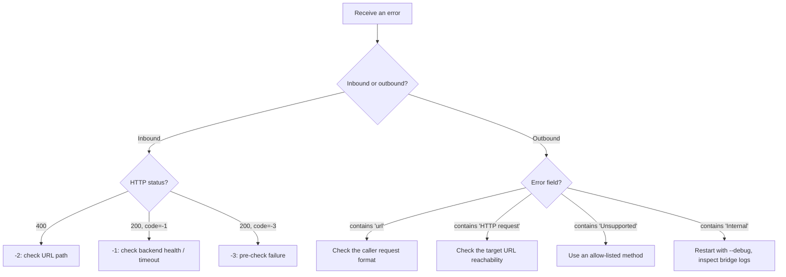

## 9.6 ID: `BR-ERR-006` — Status Queue Auxiliary Diagnostics

- **Evidence level**: 🟢
- **Trigger**: an inbound response is empty and `--debug` is enabled.
- **Behavior**: the bridge reads up to 3 LingoFuse internal log messages and forwards them to its own logger.
- **Use**: when an inbound request returns an empty response, LingoFuse may have logged the root cause.

## 9.7 ID: `BR-ERR-007` — Forward-Only Mode Diagnostics

- **Evidence level**: 🟢
- **Contract**: in forward-only mode, inbound HTTP errors `-1`, `-2`, `-3` never appear, because the inbound path never executes.
- **Possible errors in forward-only mode**:
  - Startup failure → the process exits with status 1.
  - Outbound Call API errors (see `BR-ERR-003`).
  - Repair Call API errors (see `BR-REP-005`).

---

# Chapter 10 — Deployment on Linux and Windows

> **In one sentence**: the bridge runs the same way everywhere; only the shell syntax for setting environment variables and the executable form differ.

## 10.1 ID: `BR-DEP-001` — Executable Forms

The bridge is distributed in two forms:

| Form | Linux | Windows |
|------|-------|---------|
| Python script | `python3 bridge.py` or `./bridge.py` | `python bridge.py` |
| Native executable | `./bridge` (if built) | `bridge.exe` |

**Behavioral contract**: the two forms are identical in every observable way. Both read the same environment variables, accept the same command-line flags, and produce the same log output.

## 10.2 ID: `BR-DEP-002` — Shell Syntax Differences

### Linux (bash / zsh)

```bash
# Set an environment variable for one process
LINGOFUSE_FORWARD_ONLY=1 \
LINGOFUSE_ENDPOINT=ipc:compute_grid \
./bridge --no-precheck

# Or export it for the session
export LINGOFUSE_ENDPOINT=ipc:compute_grid
export LINGOFUSE_NO_PRECHECK=1
./bridge
```

### Windows — Command Prompt (cmd.exe)

```bat
set LINGOFUSE_FORWARD_ONLY=1
set LINGOFUSE_ENDPOINT=ipc:compute_grid
bridge.exe --no-precheck
```

### Windows — PowerShell

```powershell
$env:LINGOFUSE_FORWARD_ONLY = "1"
$env:LINGOFUSE_ENDPOINT = "ipc:compute_grid"
.\bridge.exe --no-precheck
```

**Contract**: environment variable names and accepted values are identical across all three shells. Only the syntax differs.

## 10.3 ID: `BR-DEP-003` — Three-Stage Startup (Reference Recipe)

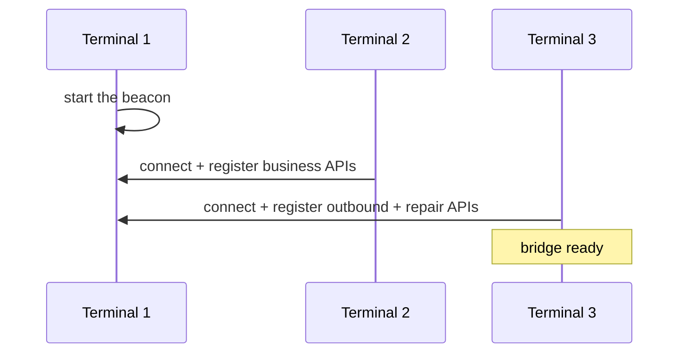

- **Ordering**: the beacon must be started first.
- **Wait time**: after the business node starts, wait 1–2 s before starting the bridge (broadcast propagation).

### Linux

```bash
# Terminal 1
./bridge_service

# Terminal 2 (after Terminal 1 prints OK)
./bridge_compute

# Terminal 3 (after Terminal 2 prints OK)
./bridge \
    --endpoint ipc:compute_grid \
    --no-precheck \
    --debug \
    --port 8081
```

### Windows

```bat
:: Terminal 1
bridge_service.exe

:: Terminal 2 (after Terminal 1 prints OK)
bridge_compute.exe

:: Terminal 3 (after Terminal 2 prints OK)
bridge.exe ^
    --endpoint ipc:compute_grid ^
    --no-precheck ^
    --debug ^
    --port 8081
```

## 10.4 ID: `BR-DEP-004` — Production Deployment (Full Mode)

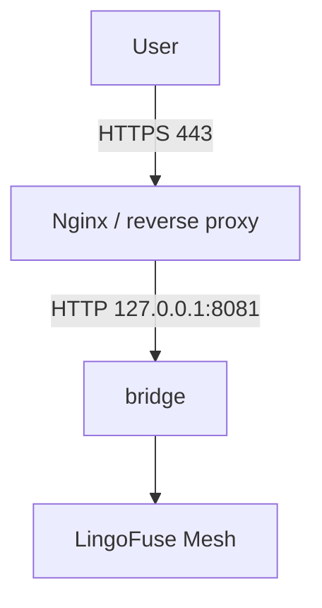

**Key parameters**:

| Parameter | Value | Rationale |
|-----------|-------|-----------|
| `--host` | `127.0.0.1` | Bind only locally |
| `--log-file` | a log file path | Log rotation |
| `--endpoint` | same as the backend | Avoid `-3` |
| `--no-precheck` | as needed | If broadcast delay is unacceptable |

## 10.5 ID: `BR-DEP-005` — Forward-Only Deployment Recipe

**Scenario**: an internal relay that provides outbound HTTP proxying and JSON repair to LingoFuse peers, but is not directly reachable over the network.

### Linux

```bash
LINGOFUSE_FORWARD_ONLY=1 \
LINGOFUSE_ENDPOINT=ipc:compute_grid \
LINGOFUSE_BRIDGE_APP=__lf_relay__ \
LINGOFUSE_BRIDGE_API=__lf_outbound_post__ \
LINGOFUSE_BRIDGE_REPAIR_API=__lf_repair_json__ \
./bridge
```

### Windows (PowerShell)

```powershell
$env:LINGOFUSE_FORWARD_ONLY = "1"
$env:LINGOFUSE_ENDPOINT = "ipc:compute_grid"
$env:LINGOFUSE_BRIDGE_APP = "__lf_relay__"
$env:LINGOFUSE_BRIDGE_API = "__lf_outbound_post__"
$env:LINGOFUSE_BRIDGE_REPAIR_API = "__lf_repair_json__"
.\bridge.exe
```

Expected startup log:

```
=== LingoFuse HTTP Bridge (tri-directional POST gateway with JSON repair service) ===
Operating mode: FORWARD-ONLY (HTTP listener disabled)
Inbound HTTP listen: DISABLED (forward-only mode)
LingoFuse endpoint: ipc:compute_grid
...
Forward-only mode active: HTTP listener is DISABLED. Only the LingoFuse Call APIs will be served. Press Ctrl+C to exit.
```

## 10.6 ID: `BR-DEP-006` — Containerized Deployment (Full Mode)

```yaml
services:
  bridge:
    image: lingofuse-bridge
    environment:
      LINGOFUSE_HOST: "0.0.0.0"
      LINGOFUSE_PORT: "8081"
      LINGOFUSE_FORWARD_ONLY: "0"
      LINGOFUSE_ENDPOINT: "ipc:compute_grid"
      LINGOFUSE_TIMEOUT: "10000"
      LINGOFUSE_DEBUG: "0"
      LINGOFUSE_NO_PRECHECK: "1"
      LINGOFUSE_NORMALIZE_JSON: "1"
      LINGOFUSE_BRIDGE_APP: "__lf_http_bridge__"
      LINGOFUSE_BRIDGE_API: "__lf_outbound_post__"
      LINGOFUSE_BRIDGE_REPAIR_API: "__lf_repair_json__"
    ports:
      - "8081:8081"
```

## 10.7 ID: `BR-DEP-007` — Containerized Deployment (Forward-Only Mode)

```yaml
services:
  bridge-relay:
    image: lingofuse-bridge
    environment:
      LINGOFUSE_FORWARD_ONLY: "1"
      LINGOFUSE_ENDPOINT: "ipc:compute_grid"
      LINGOFUSE_TIMEOUT: "10000"
      LINGOFUSE_DEBUG: "0"
      LINGOFUSE_BRIDGE_APP: "__lf_http_bridge__"
      LINGOFUSE_BRIDGE_API: "__lf_outbound_post__"
      LINGOFUSE_BRIDGE_REPAIR_API: "__lf_repair_json__"
    # NOTE: no ports section — this instance binds no TCP port.
```

## 10.8 ID: `BR-DEP-008` — Horizontal Scaling

- **Add instances**: start more bridge processes.
- **No configuration change**: every instance connects to the same endpoint.
- **No backend change**: LingoFuse discovers them automatically.
- **No session affinity**: the bridge is stateless.

## 10.9 ID: `BR-DEP-009` — Startup as a Service

### Linux (systemd unit)

```ini
[Unit]
Description=LingoFuse HTTP Bridge
After=network.target

[Service]
Type=simple
ExecStart=/opt/lingofuse/bridge --endpoint ipc:compute_grid --log-file /var/log/bridge.log
Restart=on-failure
RestartSec=3

[Install]
WantedBy=multi-user.target
```

### Windows (Service via `sc.exe` after wrapping with NSSM or WinSW)

```bat
nssm install LingoFuseBridge "C:\LingoFuse\bridge.exe" ^
    "--endpoint" "ipc:compute_grid" ^
    "--log-file" "C:\LingoFuse\logs\bridge.log"
nssm start LingoFuseBridge
```

**Contract**: both the Linux and Windows service wrappers run the same executable with the same arguments. The bridge itself has no service-specific code.

## 10.10 ID: `BR-DEP-010` — Cleanup Order

Cleanup runs strictly in this order:

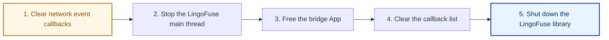

- **Idempotent**: guaranteed by a one-shot flag.
- **Triggered by**: a process-exit hook + the `finally` block of the run loop.

## 10.11 ID: `BR-DEP-011` — Failure Rollback

- **Evidence level**: 🟢
- **Contract**: any step failing releases the resources already created.
- **Order**:
  1. Stop the LingoFuse main thread.
  2. Free the bridge App.
- **Globals**: the global App handle is only written after every step has succeeded.

## 10.12 ID: `BR-DEP-012` — Cross-Platform Log Handling

- **Contract**: logs are written to stderr by default, and to `--log-file` when provided.
- **Line endings**: the log file is opened in text mode with UTF-8 encoding on both platforms. On Windows, this produces CRLF; on Linux, LF. Consumers of the log should treat both as whitespace.

---

# Chapter 11 — Extension and Modification

## 11.1 ID: `BR-EXT-001` — Insertion Points

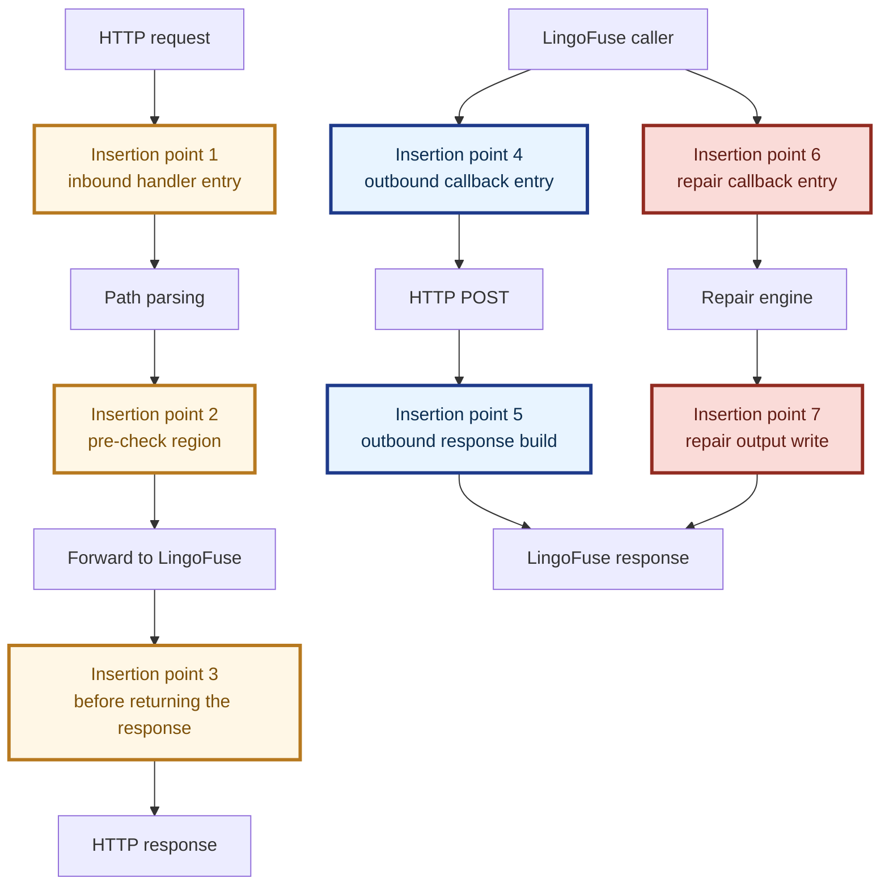

## 11.2 ID: `BR-EXT-002` — Common Extension Patterns

| Need | Insertion point | Implementation |
|------|:---------------:|----------------|
| API Key auth | 1 | Check the `X-API-Key` header |
| JWT auth | 1 | Validate the `Authorization` header |
| Rate limiting | 1 | A rate-limit middleware |
| Structured logging | 1 + 3 | Generate a `request_id` and log before and after |
| Metrics | 3 | A metrics collector |
| Response filtering | 3 | Rewrite the response bytes before returning |
| Outbound URL allow-list | 4 | Check the parsed `url` against a trusted list |
| Outbound header sanitization | 4 | Remove or rewrite specific headers |
| Repair logging | 6 | Log every repair request to an audit sink |
| Repair response post-processing | 7 | Rewrite the repaired text before writing it out |

## 11.3 ID: `BR-EXT-003` — Adding New Error Codes

- **Evidence level**: 🟡 (a convention, not the source)
- **Current range**: `-1`, `-2`, `-3`.
- **Extension rule**:
  - Start at `-4` and decrement.
  - **Must be explicitly recorded in the documentation.**
  - HTTP status semantics:
    - 4xx for client errors.
    - 5xx for server errors.
    - 200 for business-layer errors (following the existing convention).

## 11.4 ID: `BR-EXT-004` — The Only Place to Change JSON Policy

- **Evidence level**: 🟢
- **Location**: the canonical serializer used by every direction.
- **Do not**:
  - Use a different JSON serializer anywhere in the bridge.
  - Use any HTTP library's `.json=` shortcut (it forces `ensure_ascii=True`).
  - Manually concatenate JSON.
- **Correct approach**: always call the canonical serializer.

## 11.5 ID: `BR-EXT-005` — Adding a New Outbound HTTP Client

- **Evidence level**: 🟢
- **When swapping the underlying HTTP library**:
  - Keep the call non-blocking with respect to the LingoFuse worker thread.
  - Preserve the timeout clamp.
  - Preserve the exception-category handling.
  - Preserve the response-header lowercasing.
  - Preserve the "no `\uXXXX` on the wire" policy (do not use the library's `.json=` shortcut).

## 11.6 ID: `BR-EXT-006` — Changing the Callback API Names

- **Evidence level**: 🟢
- **Command line**: `--bridge-app` `--bridge-api` `--bridge-repair-api`.
- **Environment variable**: `LINGOFUSE_BRIDGE_APP` `LINGOFUSE_BRIDGE_API` `LINGOFUSE_BRIDGE_REPAIR_API`.
- **Notes**:
  - **Both ends must change** (bridge side + caller side).
  - If you change to a name that can collide (like `post`), you lose namespace isolation.

## 11.7 ID: `BR-EXT-007` — Changing Inbound Routing

- **Evidence level**: 🟢
- **Extension methods**:
  - Header routing: check a header before path parsing.
  - Query routing: use the query string.
  - Body routing: **not recommended** (you must read the body first, which breaks the pre-normalization check).
- **Warning**: after modifying, you must update §3.1 of this document.

## 11.8 ID: `BR-EXT-008` — Adding a New Forward-Only Capability

- **Evidence level**: 🟢
- **Pattern**: if you need a new LingoFuse-to-LingoFuse capability that must also be available in forward-only mode, register it as an additional Call API alongside the outbound and repair APIs.
- **Result**: the new capability is available in both full and forward-only modes with no further changes.

---

# Chapter 12 — Pitfalls

## 12.1 ID: `BR-PIT-001` — Using the Default Endpoint

- **Symptom**: `-3: API 'exp' not available for app 'pas'`.
- **Root cause**: the default `--endpoint` is `ipc:lingofuse_bridge`, which does not match the backend.
- **Fix**: explicitly set `--endpoint ipc:compute_grid`.
- **Frequency**: **the root cause of ~90% of "API unavailable" reports**.

## 12.2 ID: `BR-PIT-002` — Broadcast Delay Mistaken for a Missing API

- **Symptom**: a business node just started, and the bridge called it immediately → `-3`.
- **Root cause**: the availability check relies on a ~3-second broadcast.
- **Fix A**: `--no-precheck`.
- **Fix B**: wait 1–2 s before starting the bridge.

## 12.3 ID: `BR-PIT-003` — Single-Segment Path Without a Default App

- **Symptom**: `-2: No default app set (use --app)`.
- **Fix A**: `--app pas`.
- **Fix B**: use a two-segment path `POST /pas/exp`.

## 12.4 ID: `BR-PIT-004` — Expecting JSON Schema Validation

- **Misconception**: the bridge validates business fields.
- **Truth**: the bridge only guarantees *legal JSON bytes*; it does not guarantee *business-valid data*.
- **Correct mental model**: the bridge is a byte-layer gateway; the business layer is the backend's responsibility.

## 12.5 ID: `BR-PIT-005` — Binary Payload "Corruption"

- **Misconception**: the bridge converts everything to JSON.
- **Truth**: non-JSON payloads are forwarded **byte-for-byte unchanged**.
- **Contract**: see `BR-JSON-001`.

## 12.6 ID: `BR-PIT-006` — Timeout Too Short

- **Symptom**: `-1: Call timeout`.
- **Fix**: increase `--timeout` (in milliseconds). Note the outbound-direction upper bound is 300 s.

## 12.7 ID: `BR-PIT-007` — `\uXXXX` Escapes in the Outbound Body

- **Symptom**: the external HTTP server receives `\u4f60\u597d` instead of `你好`.
- **Root cause**: using a library's `.json=` shortcut triggers `ensure_ascii=True`.
- **Fix**: the bridge always serializes the outbound body itself with the canonical serializer.
- **Regression protection**: see `BR-JSON-007`.

## 12.8 ID: `BR-PIT-008` — Outbound API Name Collision

- **Symptom**: a caller calls `post`, but routing goes to a business App instead.
- **Root cause**: if `--bridge-api` is set to a plain name (like `post`), it may collide with a business API.
- **Fix**: keep the default double-underscore name, or ensure a custom name is globally unique.

## 12.9 ID: `BR-PIT-009` — Calling a Blocking LingoFuse Function Inside a Callback

- **Symptom**: the entire LingoFuse mesh deadlocks.
- **Root cause**: callbacks run on a worker thread; calling a blocking function re-enters the scheduler and self-locks.
- **Fix**: if a callback needs to call another LingoFuse API, offload to a separate thread.

## 12.10 ID: `BR-PIT-010` — Concurrent Modification of the Config Object

- **Symptom**: inconsistent behavior across workers.
- **Root cause**: if the config object is modified at runtime, there is no lock protection.
- **Fix**: **do not modify**. All configuration goes through the three layers at startup; the object is read-only afterwards.

## 12.11 ID: `BR-PIT-011` — Process-Exit Hooks Are Not Deterministic

- **Symptom**: cleanup does not execute on some exit paths.
- **Root cause**: process-exit hooks do not cover forced exits.
- **Fix**: the normal run loop's `finally` block already calls cleanup, covering the normal paths.

## 12.12 ID: `BR-PIT-012` — LingoFuse Startup Can Only Happen Once Per Process

- **Symptom**: a second startup call in the same process returns failure.
- **Root cause**: the LingoFuse main thread has already started.
- **Bridge scenario**: the bridge calls it only once per lifetime; no impact.

## 12.13 ID: `BR-PIT-013` — Confusing Full Mode and Forward-Only Mode

- **Symptom**: after enabling forward-only mode, HTTP requests are refused by the OS, but LingoFuse callers still succeed.
- **Root cause**: forward-only mode disables the HTTP listener but keeps the Call APIs.
- **Fix**: read the startup banner. The `Operating mode:` line explicitly reports the mode.
- **Prevention**: the banner is printed at every startup, in both modes.

## 12.14 ID: `BR-PIT-014` — Programmatic Pre-Set Overridden by Environment

- **Symptom**: the code set `forward_only = True`, but the bridge still listens on HTTP.
- **Root cause**: an environment variable or a CLI flag overrode the programmatic value.
- **Fix**: unset the environment variable, or remove the CLI flag, or pass the opposite flag.

## 12.15 ID: `BR-PIT-015` — Shell-Specific Syntax When Launching

- **Symptom**: a launch command works in one shell and fails in another.
- **Root cause**: Linux shells, Windows Command Prompt, and PowerShell all set environment variables with different syntax.
- **Fix**: see §10.2 for the three syntaxes. The variable names and accepted values are identical across all three.

## 12.16 ID: `BR-PIT-016` — Port Already in Use

- **Symptom**: the bridge fails to start with an address-in-use error.
- **Root cause**: another process is bound to `--port`.
- **Fix**: change `--port`, or stop the other process, or switch to forward-only mode (no port is needed).

---

# Chapter 13 — Integration Guide

## 13.1 ID: `BR-INT-001` — HTTP Client Integration

The HTTP contract is language-neutral: send an HTTP POST to `http://<host>:<port>/<app>/<api>`, with the payload as the body.

### curl (Linux, Windows, macOS)

```bash
curl -X POST http://127.0.0.1:8081/pas/exp \
  -H "Content-Type: application/json" \
  -d '{"args": ["1+2*3"]}'
```

### PowerShell

```powershell
Invoke-RestMethod -Method POST `
  -Uri "http://127.0.0.1:8081/pas/exp" `
  -ContentType "application/json" `
  -Body '{"args": ["1+2*3"]}'
```

### Contract notes

- The URL path determines routing (`BR-IN-001`).
- The response body is canonical UTF-8 JSON when the backend returned JSON; otherwise it is the raw bytes.
- If the client library escapes non-ASCII characters as `\uXXXX`, the bridge's normalization un-escapes them before forwarding.
- If the response is empty, see §9.6 for diagnostics.

## 13.2 ID: `BR-INT-002` — LingoFuse Caller Integration (Outbound HTTP)

The contract is: create a DataHandle for the API `__lf_outbound_post__`, write a UTF-8 NUL-terminated JSON request, call the bridge App `__lf_http_bridge__`, and read a UTF-8 NUL-terminated JSON response.

### Request JSON

```json
{
    "url":     "https://api.example.com/v1/echo",
    "method":  "POST",
    "headers": { "X-Request-Id": "abc-123" },
    "body":    { "message": "Hello, world 🌍" },
    "timeout": 10
}
```

### Response JSON

```json
{
    "status_code": 200,
    "headers":     { "content-type": "application/json" },
    "body":        { "echo": "Hello, world 🌍" }
}
```

### Contract notes

- The caller does not need an HTTP client library.
- The caller does not need to worry about `\uXXXX` escapes; the bridge emits literal UTF-8.

## 13.3 ID: `BR-INT-003` — LingoFuse Caller Integration (JSON Repair)

The contract is: create a DataHandle for the API `__lf_repair_json__`, write a UTF-8 NUL-terminated JSON text (possibly malformed), call the bridge App `__lf_http_bridge__`, and read a UTF-8 NUL-terminated text (the repaired JSON).

### Input (a malformed JSON string)

```
{'name': 'Alice', 'age': 30,}
```

### Output (the repaired JSON string)

```
{"name": "Alice", "age": 30}
```

### Contract notes

- Input is a JSON **string** (not a JSON object).
- Output is a JSON **string** (not a JSON object).
- A repaired string contains literal UTF-8 characters, never `\uXXXX` escapes.
- If repair is impossible, the original text is returned unchanged.

## 13.4 ID: `BR-INT-004` — Using the Bridge from Any Language

The bridge is language-neutral. The wire contract is the same for every LingoFuse client:

| Step | What the client does |
|------|----------------------|
| 1 | Create a DataHandle whose API name is `__lf_outbound_post__` (or `__lf_repair_json__`) |
| 2 | Write a UTF-8 NUL-terminated payload into the handle |
| 3 | Call the App `__lf_http_bridge__` |
| 4 | Read a UTF-8 NUL-terminated payload from the response handle |
| 5 | Free both handles |

| Language | Handle creation | String write | Call | Response read |
|----------|-----------------|--------------|------|---------------|
| Pascal | `LF_CreateDataEx` | `LF_WriteString` | `LF_CallEx` | `LF_ReadString` |
| Python | `DataHandle(api_name)` | `write_string(...)` | `LF_Call(...)` | `read_string(...)` |
| C++ | `LF_CreateData` | `LF_WriteString` | `LF_Call` | `LF_ReadString` |
| Rust | `LF_CreateData` | `LF_WriteString` | `LF_Call` | `LF_ReadString` |
| C# | `LF_CreateData` | `LF_WriteString` | `LF_Call` | `LF_ReadString` |
| Java | `LF_CreateData` | `LF_WriteString` | `LF_Call` | `LF_ReadString` |
| Node.js | `LF_CreateData` | `LF_WriteString` | `LF_Call` | `LF_ReadString` |
| PHP | `LF_CreateData` | `LF_WriteString` | `LF_Call` | `LF_ReadString` |

## 13.5 ID: `BR-INT-005` — Interop with a Web Demo

A web demo page typically hard-codes the bridge URL, for example:

```
http://127.0.0.1:8081/pas/exp
```

**Requirements**:

- The bridge listens on `127.0.0.1:8081`.
- The backend App is named `pas` and the API is named `exp`.
- Renaming any of these requires updating the HTML.

## 13.6 ID: `BR-INT-006` — Chaining Bridge Instances

**Scenario**: bridge A wants to send an HTTP POST via bridge B.

**Method**: A registers its outbound call to target bridge B's `__lf_outbound_post__` API.

**Note**: this forms a chain `A → LingoFuse → B → HTTP → external`. The longer the chain, the higher the latency.

## 13.7 ID: `BR-INT-007` — Integration Checklist

| Peer | Needs to know | Reference |
|------|---------------|-----------|
| HTTP client | URL format, error codes | §3.1, §9.2 |
| LingoFuse caller (outbound) | Outbound API name, request/response JSON format | §4.1, §4.2, §4.6 |
| LingoFuse caller (repair) | Repair API name, input/output contract, no-escape guarantee | §5.1, §5.2, §5.3, §5.4 |
| Backend service | No special requirements (a standard LingoFuse callback) | — |
| Browser | CORS is handled automatically | §3.8 |
| Reverse proxy | Listen on 127.0.0.1, proxy HTTP | §10.4 |
| Forward-only relay | No port, no HTTP | §7, §10.5, §10.7 |

---

# Chapter 14 — Upgrade Guide

## 14.1 ID: `BR-UP-001` — Version History

| Version | Core change |
|---------|-------------|
| v3.1 and earlier | Unidirectional HTTP → LingoFuse gateway |
| v4.0 | **Bidirectional**: added the outbound Call API |
| **v5.0 (current)** | **Tri-directional**: added the JSON repair Call API and the forward-only mode |

## 14.2 ID: `BR-UP-002` — Compatibility from v4.0 → v5.0

| Aspect | Compatible? | Notes |
|--------|:-----------:|-------|
| Command-line arguments | ✅ | All v4.0 arguments preserved |
| Environment variables | ✅ | All v4.0 variables preserved |
| Inbound routing | ✅ | URL format unchanged |
| Inbound error codes | ✅ | `-1` / `-2` / `-3` unchanged |
| Inbound Content-Type mapping | ✅ | Four statuses unchanged |
| Outbound API contract | ✅ | Request and response JSON shape unchanged |
| Default App name | ✅ | `__lf_http_bridge__` unchanged |
| Default outbound API name | ✅ | `__lf_outbound_post__` unchanged |
| Default repair API name | 🆕 | `__lf_repair_json__` is newly registered; no collision with v4.0 |
| **`forward_only` config field** | 🆕 | Optional, defaults to `False` (v4.0 behavior preserved) |
| **`--forward-only` flag** | 🆕 | Optional, defaults to `False` |
| **`LINGOFUSE_FORWARD_ONLY` env var** | 🆕 | Optional, defaults to `False` |

**Upgrade advice**:

- **No breaking changes.** Directly replace the executable.
- Existing v4.0 deployments continue to behave identically because `forward_only` defaults to `False`.
- To opt in to the new mode, pass `--forward-only` or set `LINGOFUSE_FORWARD_ONLY=1`.

## 14.3 ID: `BR-UP-003` — Upgrade Steps from v4.0

1. **Back up** the old executable.
2. **Replace** with the new one.
3. **Restart**: stop the old bridge, start the new one.
4. **Verify**:
   - Inbound (full mode only): an HTTP POST to `/<app>/<api>`.
   - Outbound: call `__lf_outbound_post__` from a LingoFuse caller.
   - Repair: call `__lf_repair_json__` from a LingoFuse caller with a malformed JSON string.
5. **Inspect the logs**: confirm both Call APIs were registered and, if in forward-only mode, that the banner reports it.

## 14.4 ID: `BR-UP-004` — Future Compatibility Contract

- **Promises**:
  - Inbound URL format unchanged.
  - Inbound error codes `-1` / `-2` / `-3` semantics unchanged.
  - JSON normalization rules only extend, never narrow.
  - Existing config fields are not removed.
  - The default outbound API name is unchanged.
  - The default repair API name is unchanged.
  - The `forward_only` field defaults to `False` unless explicitly set.
- **Possible changes**:
  - New config fields (with defaults).
  - New error codes (decrementing from `-4`).
  - New normalization repair rules.
  - New outbound request fields (backward compatible).
  - New Call APIs on the bridge App.

## 14.5 ID: `BR-UP-005` — Upgrade Strategy for Custom Branches

If you have modified the bridge (see Chapter 11), when upgrading:

1. **Record**: note which insertion points you modified.
2. **Diff**: compare the new version with the old one, section by section.
3. **Replay**: reapply your modifications on top of the new version.
4. **Regress**: run the full verification checklist.
5. **Submit**: if a change has general value, consider upstreaming it.

## 14.6 ID: `BR-UP-006` — Rollback Steps

1. Stop the current bridge.
2. Restore the backed-up executable.
3. Restart.
4. **Note**: if the new bridge has registered an App, stopping it will destroy the App with the LingoFuse library shutdown.
5. If the old and new versions use different App names, there is no conflict.

---

# Chapter 15 — Self-Review and Index

## 15.1 Contract Completeness Review

| Category | Covered | Chapter |
|----------|:-------:|---------|
| Inbound routing | ✅ | §3.1 |
| Inbound error codes | ✅ | §3.7 |
| Inbound JSON normalization | ✅ | Ch. 6 |
| Outbound API contract | ✅ | Ch. 4 |
| Outbound error handling | ✅ | §4.5, §9.3 |
| JSON repair API contract | ✅ | Ch. 5 |
| Operating modes | ✅ | Ch. 7 |
| Configuration model | ✅ | Ch. 8 |
| Configuration precedence | ✅ | §8.5 |
| Command-line help | ✅ | §8.4 |
| Environment variable table | ✅ | §8.2 |
| Linux deployment | ✅ | Ch. 10 |
| Windows deployment | ✅ | Ch. 10 |
| Executable forms | ✅ | §10.1 |
| Extension points | ✅ | Ch. 11 |
| Pitfalls | ✅ | Ch. 12 |
| Integration | ✅ | Ch. 13 |
| Upgrade | ✅ | Ch. 14 |

## 15.2 AI Reference Tests

After reading this document, an AI should be able to answer:

| Question | Source |
|----------|--------|
| How is `POST /a/b/c` routed? | §3.1 |
| Will the bridge modify a binary payload? | §6.1, §6.9 |
| How do I diagnose `-3`? | §9.5, §12.1, §12.2 |
| Does `--no-normalize-json` affect outbound? | §8.2 |
| Who wins: environment variable or command line? | §8.5 |
| What is the default outbound API name? | §4.1 |
| How do I write the outbound request JSON? | §4.2 |
| Will the outbound body contain `\uXXXX` escapes? | §4.4, §12.7 |
| On which thread does the outbound callback run? | §4.9, §12.9 |
| How do I add authentication? | §11.2 |
| How do I deploy to production on Linux? | §10.4, §10.9 |
| How do I deploy to production on Windows? | §10.4, §10.9 |
| How do I run the bridge without opening a port? | §7, §10.5, §10.7 |
| How do I delegate JSON repair to the bridge from any language? | §5, §13.3, §13.4 |
| What is the difference between full mode and forward-only mode? | §7.1 |
| How do I run the bridge as a Windows service? | §10.9 |
| How do I run the bridge as a Linux systemd service? | §10.9 |

## 15.3 Differences from v4.0

| v4.0 statement | v5.0 reality |
|----------------|--------------|
| "The bridge is bidirectional" | The bridge is **tri-directional** (inbound, outbound, repair) |
| "The bridge always listens on HTTP" | The bridge listens on HTTP **unless forward-only mode is enabled** |
| "Two Call APIs are registered" | **Still two** — outbound and repair |
| Configuration table: 12 items | Configuration table: **14 items** |
| No operating-mode chapter | New Chapter 7 |
| No repair-service chapter | New Chapter 5 |
| No Linux/Windows deployment chapter | New Chapter 10 |
| No executable-form chapter | New §10.1 |

## 15.4 Documentation Maintenance Contract

- This document describes the **current source**. When the source changes, at minimum update:
  - Ch. 4 (outbound contract)
  - Ch. 5 (repair contract)
  - Ch. 6 (JSON normalization)
  - Ch. 7 (operating modes)
  - Ch. 8 (configuration table)
  - Ch. 9 (error codes)
  - Ch. 10 (deployment)
  - §14.1 (version history)
- All diagrams use Mermaid, never ASCII art.
- Every contract must be traceable to the source.

## 15.5 Explicitly Out of Scope

| Excluded topic | Where to look |
|----------------|---------------|
| Internal implementation of the LingoFuse Python package | the package source |
| LingoFuse C4 mesh principles | `Z.LingoFuse.md` |
| Pascal callback patterns | `LingoFuse_Pascal_Complete_Guide.md` |
| Nginx configuration | Nginx official docs |
| systemd unit syntax | systemd official docs |
| Windows service wrapping | NSSM / WinSW docs |

---

# Appendix A — ID Overview

## A.1 Full ID Index

| ID | Title | Section |
|----|-------|---------|
| `BR-GEN-001` | The tri-directional bridge | §1.1 |
| `BR-GEN-002` | Thread-safety model | §1.4 |
| `BR-GEN-003` | Rollback safety | §10.11 |
| `BR-IN-001` | Routing rules | §3.1 |
| `BR-IN-002` | Request body handling | §3.2 |
| `BR-IN-003` | Path parsing error (`-2`) | §3.3 |
| `BR-IN-004` | Optional pre-check | §3.4 |
| `BR-IN-005` | Forwarding to LingoFuse | §3.5 |
| `BR-IN-006` | Response content-type mapping | §3.6 |
| `BR-IN-007` | Inbound error codes | §3.7 |
| `BR-IN-008` | CORS support | §3.8 |
| `BR-IN-009` | Debug logging | §3.9 |
| `BR-IN-010` | Interaction with forward-only mode | §3.10 |
| `BR-OUT-001` | Namespace isolation | §4.1 |
| `BR-OUT-002` | Request JSON contract | §4.2 |
| `BR-OUT-003` | HTTP method allow-list | §4.3 |
| `BR-OUT-004` | Body serialization policy | §4.4 |
| `BR-OUT-005` | Exception isolation | §4.5 |
| `BR-OUT-006` | Response JSON contract | §4.6 |
| `BR-OUT-007` | Response header normalization | §4.7 |
| `BR-OUT-008` | Timeout protection | §4.8 |
| `BR-OUT-009` | Callback threading model | §4.9 |
| `BR-OUT-010` | Interaction with forward-only mode | §4.10 |
| `BR-REP-001` | Why a repair API | §5.1 |
| `BR-REP-002` | Input contract | §5.2 |
| `BR-REP-003` | Output contract | §5.3 |
| `BR-REP-004` | No-escape guarantee | §5.4 |
| `BR-REP-005` | Exception isolation | §5.5 |
| `BR-REP-006` | Repair layer alignment | §5.6 |
| `BR-REP-007` | Encoding fallback chain | §5.7 |
| `BR-REP-008` | Interaction with forward-only mode | §5.8 |
| `BR-JSON-001` | Core rule | §6.1 |
| `BR-JSON-002` | The seven normalization steps | §6.2 |
| `BR-JSON-003` | The four status codes | §6.3 |
| `BR-JSON-004` | Permitted repairs | §6.4 |
| `BR-JSON-005` | Status classification truth table | §6.5 |
| `BR-JSON-006` | Idempotence | §6.6 |
| `BR-JSON-007` | Single source of serialization policy | §6.7 |
| `BR-JSON-008` | Encoding fallback order | §6.8 |
| `BR-JSON-009` | Binary safety boundary | §6.9 |
| `BR-MODE-001` | Mode enumeration | §7.1 |
| `BR-MODE-002` | Why a forward-only mode | §7.2 |
| `BR-MODE-003` | Behavior in forward-only mode | §7.3 |
| `BR-MODE-004` | Main thread behavior comparison | §7.4 |
| `BR-MODE-005` | Mode transition | §7.5 |
| `BR-CFG-001` | Configuration loading model | §8.1 |
| `BR-CFG-002` | Complete configuration table | §8.2 |
| `BR-CFG-003` | Boolean environment variable format | §8.3 |
| `BR-CFG-004` | Command-line help | §8.4 |
| `BR-CFG-005` | Configuration precedence | §8.5 |
| `BR-CFG-006` | Configuration freeze contract | §8.6 |
| `BR-CFG-007` | `log_file`: unset vs. empty | §8.7 |
| `BR-CFG-008` | `default_app`: unset vs. empty | §8.8 |
| `BR-CFG-009` | `Overlap_Connection` implicit setting | §8.9 |
| `BR-CFG-010` | `Wait_Connection_ReadyOk` implicit setting | §8.10 |
| `BR-CFG-011` | Language of logs and comments | §8.11 |
| `BR-CFG-012` | Programmatic use via the global variable layer | §8.12 |
| `BR-ERR-001` | Error response format | §9.1 |
| `BR-ERR-002` | Inbound error code overview | §9.2 |
| `BR-ERR-003` | Outbound error format | §9.3 |
| `BR-ERR-004` | Error message index | §9.4 |
| `BR-ERR-005` | Diagnostic decision tree | §9.5 |
| `BR-ERR-006` | Status queue auxiliary diagnostics | §9.6 |
| `BR-ERR-007` | Forward-only mode diagnostics | §9.7 |
| `BR-DEP-001` | Executable forms | §10.1 |
| `BR-DEP-002` | Shell syntax differences | §10.2 |
| `BR-DEP-003` | Three-stage startup | §10.3 |
| `BR-DEP-004` | Production deployment (full mode) | §10.4 |
| `BR-DEP-005` | Forward-only deployment recipe | §10.5 |
| `BR-DEP-006` | Containerized deployment (full) | §10.6 |
| `BR-DEP-007` | Containerized deployment (forward-only) | §10.7 |
| `BR-DEP-008` | Horizontal scaling | §10.8 |
| `BR-DEP-009` | Startup as a service | §10.9 |
| `BR-DEP-010` | Cleanup order | §10.10 |
| `BR-DEP-011` | Failure rollback | §10.11 |
| `BR-DEP-012` | Cross-platform log handling | §10.12 |
| `BR-EXT-001` | Insertion points | §11.1 |
| `BR-EXT-002` | Common extension patterns | §11.2 |
| `BR-EXT-003` | Adding new error codes | §11.3 |
| `BR-EXT-004` | The only place to change JSON policy | §11.4 |
| `BR-EXT-005` | Adding a new outbound HTTP client | §11.5 |
| `BR-EXT-006` | Changing the callback API names | §11.6 |
| `BR-EXT-007` | Changing inbound routing | §11.7 |
| `BR-EXT-008` | Adding a new forward-only capability | §11.8 |
| `BR-PIT-001` | Using the default endpoint | §12.1 |
| `BR-PIT-002` | Broadcast delay mistaken for a missing API | §12.2 |
| `BR-PIT-003` | Single-segment path without a default app | §12.3 |
| `BR-PIT-004` | Expecting JSON Schema validation | §12.4 |
| `BR-PIT-005` | Binary payload "corruption" | §12.5 |
| `BR-PIT-006` | Timeout too short | §12.6 |
| `BR-PIT-007` | `\uXXXX` escapes in the outbound body | §12.7 |
| `BR-PIT-008` | Outbound API name collision | §12.8 |
| `BR-PIT-009` | Calling a blocking LingoFuse function inside a callback | §12.9 |
| `BR-PIT-010` | Concurrent modification of the config object | §12.10 |
| `BR-PIT-011` | Process-exit hooks are not deterministic | §12.11 |
| `BR-PIT-012` | LingoFuse startup can only happen once per process | §12.12 |
| `BR-PIT-013` | Confusing full mode and forward-only mode | §12.13 |
| `BR-PIT-014` | Programmatic pre-set overridden by environment | §12.14 |
| `BR-PIT-015` | Shell-specific syntax when launching | §12.15 |
| `BR-PIT-016` | Port already in use | §12.16 |
| `BR-INT-001` | HTTP client integration | §13.1 |
| `BR-INT-002` | LingoFuse caller integration (outbound HTTP) | §13.2 |
| `BR-INT-003` | LingoFuse caller integration (JSON repair) | §13.3 |
| `BR-INT-004` | Using the bridge from any language | §13.4 |
| `BR-INT-005` | Interop with a web demo | §13.5 |
| `BR-INT-006` | Chaining bridge instances | §13.6 |
| `BR-INT-007` | Integration checklist | §13.7 |
| `BR-UP-001` | Version history | §14.1 |
| `BR-UP-002` | Compatibility from v4.0 → v5.0 | §14.2 |
| `BR-UP-003` | Upgrade steps from v4.0 | §14.3 |
| `BR-UP-004` | Future compatibility contract | §14.4 |
| `BR-UP-005` | Upgrade strategy for custom branches | §14.5 |
| `BR-UP-006` | Rollback steps | §14.6 |

## A.2 Cross-Knowledge-Base References

| This KB's ID | Related ID | Related document |
|--------------|------------|------------------|
| `BR-OUT-005` | `LF-CB-002` | Pascal Guide (callbacks must not block) |
| `BR-OUT-009` | `LF-CB-004` | Pascal Guide (callback threads) |
| `BR-PIT-009` | `LF-CB-002` | Pascal Guide |
| `BR-PIT-012` | `LF-NET-003` | Pascal Guide |
| `BR-CFG-009` | `LF-NET-001` | Pascal Guide (`Overlap_Connection`) |
| `BR-JSON-007` | `LF-JSON-002` | Pascal Guide (UTF-8 end-to-end) |
| `BR-REP-006` | `LF-JSON-003` | Pascal Guide (unified repair preprocessor) |

---

# Appendix B — Configuration Cheat Sheet

## B.1 All Configuration Items (alphabetical)

| Field | Environment variable | Command-line flag | Default | Unit |
|-------|----------------------|-------------------|---------|------|
| `bridge_api_name` | `LINGOFUSE_BRIDGE_API` | `--bridge-api` | `__lf_outbound_post__` | — |
| `bridge_app_name` | `LINGOFUSE_BRIDGE_APP` | `--bridge-app` | `__lf_http_bridge__` | — |
| `bridge_repair_api_name` | `LINGOFUSE_BRIDGE_REPAIR_API` | `--bridge-repair-api` | `__lf_repair_json__` | — |
| `debug` | `LINGOFUSE_DEBUG` | `--debug` / `--no-debug` | `False` | — |
| `default_app` | `LINGOFUSE_APP` | `--app` | `None` | — |
| `endpoint` | `LINGOFUSE_ENDPOINT` | `--endpoint` | `ipc:lingofuse_bridge` | — |
| `forward_only` | `LINGOFUSE_FORWARD_ONLY` | `--forward-only` / `--no-forward-only` | `False` | — |
| `host` | `LINGOFUSE_HOST` | `--host` | `0.0.0.0` | — |
| `log_file` | `LINGOFUSE_LOG_FILE` | `--log-file` | `None` | — |
| `no_precheck` | `LINGOFUSE_NO_PRECHECK` | `--no-precheck` / `--precheck` | `False` | — |
| `normalize_json` | `LINGOFUSE_NORMALIZE_JSON` | `--normalize-json` / `--no-normalize-json` | `True` | — |
| `port` | `LINGOFUSE_PORT` | `--port` | `8081` | — |
| `threaded` | `LINGOFUSE_THREADED` | `--threaded` / `--no-threaded` | `True` | — |
| `timeout_ms` | `LINGOFUSE_TIMEOUT` | `--timeout` | `5000` | ms |

## B.2 Typical Startup Commands

### Linux (bash)

```bash
# 1. Development / debugging (full mode)
./bridge \
    --endpoint ipc:compute_grid \
    --no-precheck \
    --debug

# 2. Production deployment (full mode)
./bridge \
    --endpoint ipc:compute_grid \
    --host 127.0.0.1 \
    --log-file /var/log/bridge.log

# 3. Forward-only mode
./bridge \
    --endpoint ipc:compute_grid \
    --forward-only

# 4. Forward-only mode via environment variable
LINGOFUSE_FORWARD_ONLY=1 \
LINGOFUSE_ENDPOINT=ipc:compute_grid \
./bridge
```

### Windows (Command Prompt)

```bat
:: 1. Development / debugging (full mode)
bridge.exe ^
    --endpoint ipc:compute_grid ^
    --no-precheck ^
    --debug

:: 2. Production deployment (full mode)
bridge.exe ^
    --endpoint ipc:compute_grid ^
    --host 127.0.0.1 ^
    --log-file C:\LingoFuse\logs\bridge.log

:: 3. Forward-only mode via environment variable
set LINGOFUSE_FORWARD_ONLY=1
set LINGOFUSE_ENDPOINT=ipc:compute_grid
bridge.exe
```

### Windows (PowerShell)

```powershell
# 1. Development / debugging (full mode)
.\bridge.exe `
    --endpoint ipc:compute_grid `
    --no-precheck `
    --debug

# 2. Production deployment (full mode)
.\bridge.exe `
    --endpoint ipc:compute_grid `
    --host 127.0.0.1 `
    --log-file C:\LingoFuse\logs\bridge.log

# 3. Forward-only mode via environment variable
$env:LINGOFUSE_FORWARD_ONLY = "1"
$env:LINGOFUSE_ENDPOINT = "ipc:compute_grid"
.\bridge.exe
```

## B.3 Batch Environment Configuration Example

### Linux

```bash
export LINGOFUSE_ENDPOINT=ipc:compute_grid
export LINGOFUSE_TIMEOUT=10000
export LINGOFUSE_NO_PRECHECK=1
export LINGOFUSE_DEBUG=1
export LINGOFUSE_FORWARD_ONLY=0
export LINGOFUSE_BRIDGE_APP=__my_bridge__
export LINGOFUSE_BRIDGE_API=__my_outbound_post__
export LINGOFUSE_BRIDGE_REPAIR_API=__my_repair_json__
./bridge
```

### Windows (PowerShell)

```powershell
$env:LINGOFUSE_ENDPOINT = "ipc:compute_grid"
$env:LINGOFUSE_TIMEOUT = "10000"
$env:LINGOFUSE_NO_PRECHECK = "1"
$env:LINGOFUSE_DEBUG = "1"
$env:LINGOFUSE_FORWARD_ONLY = "0"
$env:LINGOFUSE_BRIDGE_APP = "__my_bridge__"
$env:LINGOFUSE_BRIDGE_API = "__my_outbound_post__"
$env:LINGOFUSE_BRIDGE_REPAIR_API = "__my_repair_json__"
.\bridge.exe
```

## B.4 Global Variable Pre-Set

Because the config object is a plain module-level object, an embedding program may assign to any of its fields before the run starts. The environment and command-line layers can still override these values.

---

# Appendix C — Retrieval Rules for AI

## C.1 Retrieval Priority

When handling a bridge-related question, an AI should:

1. **Check this knowledge base first**: by ID (`BR-XXX-NNN`) or keyword.
2. **Configuration questions**: see Chapter 8 and Appendix B.
3. **Error questions**: see Chapter 9 and Chapter 12.
4. **Mode questions**: see Chapter 7.
5. **Repair questions**: see Chapter 5.
6. **Deployment questions**: see Chapter 10 (Linux and Windows).
7. **Integration questions**: see Chapter 13.
8. **Upgrade questions**: see Chapter 14.
9. **Source modification**: see Chapter 11.
10. **Cross-KB**: see Appendix A.2.
11. **No answer**: state explicitly "insufficient material", recommend consulting the source.

## C.2 Metadata Required with Every Answer

When answering a bridge question, the AI should proactively include:

- **The ID it is based on** (e.g., `BR-OUT-004`).
- **The evidence level** (all entries in this KB are 🟢).
- **Whether the "pitfall list" was hit** (Chapter 12).

**Example answer**:

> According to **BR-OUT-004 (evidence level: 🟢)**, the outbound HTTP body must always be sent as literal UTF-8 bytes. An HTTP library's `.json=` shortcut forces `ensure_ascii=True`, which produces `\uXXXX` escapes and violates the toolchain contract.
>
> **Correct approach**: always serialize the outbound body with the canonical serializer, then send the resulting bytes as the request body.
>
> **Related pitfall**: `BR-PIT-007`.
>
> **Related contract**: `BR-JSON-007` (single source of serialization policy).

## C.3 Forbidden Behaviors

An AI should not:

- ❌ Invent IDs or chapters that do not exist.
- ❌ Confuse v4.0 with v5.0 behavior.
- ❌ Claim the bridge is "bidirectional" (v5.0 is **tri-directional**).
- ❌ Recommend any HTTP library's `.json=` shortcut.
- ❌ Recommend a bare JSON serializer anywhere in the bridge.
- ❌ Recommend calling a blocking LingoFuse function inside a callback.
- ❌ Ignore the requirement that `--endpoint` must match the backend.
- ❌ Claim the bridge opens an HTTP listener when `forward_only=True`.
- ❌ Give only a Linux command for a task that also needs a Windows command (or vice versa).

## C.4 Structured Output Template

```
【ID】BR-XXX-NNN
【Evidence level】🟢
【Contract / Symptom】
【Root cause / Rationale】
【Fix / Correct approach】
【Verification】
【Related IDs】
```

## C.5 Tri-Directional Capability Answer Guidelines

When asked "what can the bridge do?", the AI should:

- Explicitly state **tri-directional**:
  - Inbound: HTTP → LingoFuse (`BR-IN-001`).
  - Outbound: LingoFuse → HTTP (`BR-OUT-001`).
  - Repair: LingoFuse → LingoFuse (`BR-REP-001`).
- Emphasize the **shared endpoint** (`BR-GEN-001`).
- Emphasize **consistent JSON normalization across all directions** (`BR-JSON-007`).
- Emphasize the **forward-only mode** (`BR-MODE-001`) as the dedicated relay deployment.

## C.6 Multi-Language Answer Guidelines

When asked "how do I use the bridge from <language>?", the AI should:

- State that the bridge is **language-neutral** (`BR-INT-004`).
- Provide the DataHandle-based pattern: create handle with API name → write a UTF-8 NUL-terminated payload → call the bridge App → read a UTF-8 NUL-terminated response.
- Refer to §13.4 for the language-to-LingoFuse call mapping.
- For JSON payloads, remind the caller to use literal UTF-8 (no `\uXXXX` escapes on the wire).

## C.7 Cross-Platform Answer Guidelines

When asked a deployment or launch question, the AI should:

- Provide commands for **both Linux and Windows** whenever the task is cross-platform.
- Note that environment variable names and accepted values are **identical** across shells; only the syntax differs (see §10.2).
- Note that `bridge.py` and `bridge.exe` behave **identically** in every observable way (see §10.1).
- For service deployment, refer to §10.9.

## C.8 Forward-Only Mode Answer Guidelines

When asked "how do I run a bridge without opening a port?", the AI should:

- State that forward-only mode is the intended solution (`BR-MODE-001`).
- Give three ways to enable it (`BR-CFG-005`, `BR-CFG-012`):
  - Programmatic: a global-variable pre-set.
  - Environment: `LINGOFUSE_FORWARD_ONLY=1`.
  - Command line: `--forward-only`.
- Emphasize that the outbound POST proxy and the JSON repair service remain **fully functional** (`BR-OUT-010`, `BR-REP-008`).
- Provide the recipe from §10.5.

---

*Document version: v5.0 (tri-directional bridge with forward-only mode)*
*This document supersedes Bridge_User_Guide.md v4.0*
*Last updated: 2026-09-25*
*Maintained by: the LingoFuse team*