# code_decl_to_mcp 使用手册

**版本**：V4.0  
**最后更新**：2026-09-12  
**适用工具**：`code_decl_to_mcp.exe`（LingoFuse-pasAgent 工具链）

---

## 0. 一图总览

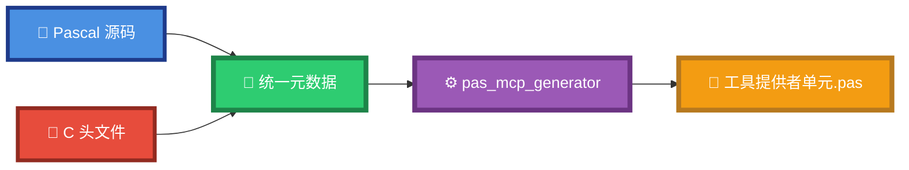

**一句话**：把 Pascal/C 的函数声明，自动变成 AI 可调用的 MCP 工具。

---

## 1. 工具使命

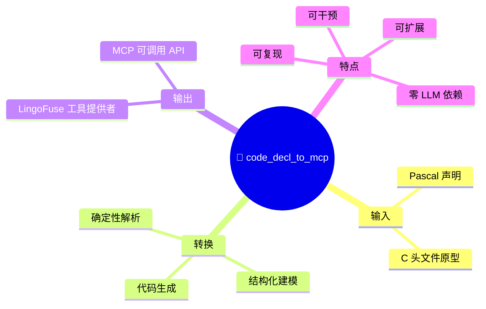

> ⚠️ **不是"AI 帮你写代码"**——主链路完全确定性，不依赖 LLM 随机性。

---

## 2. 5 层透明转换模型

### 2.1 全景

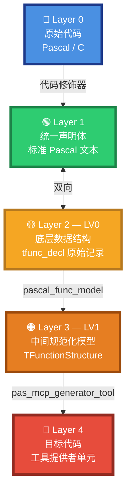

### 2.2 每层可导出、可编辑

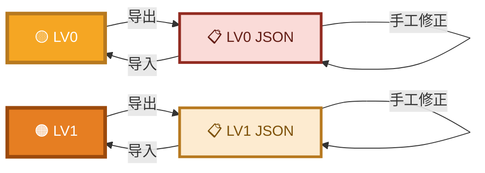

### 2.3 双语言统一化

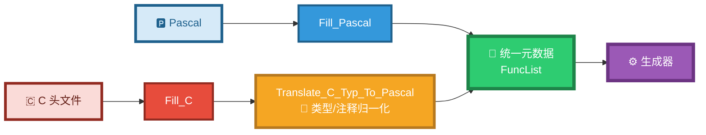

### 2.4 核心哲学

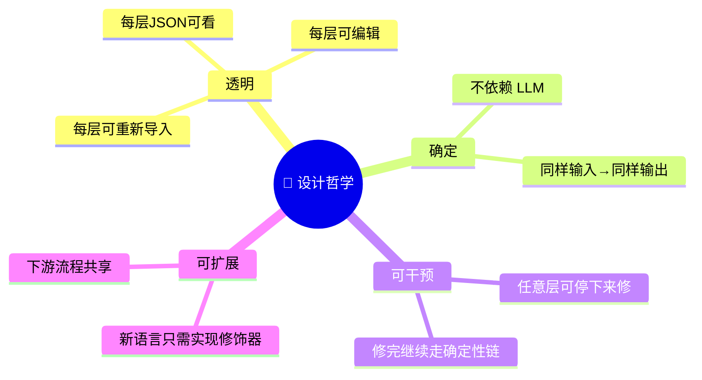

---

## 3. 界面结构

### 3.1 五个 Tab


### 3.2 底部日志区

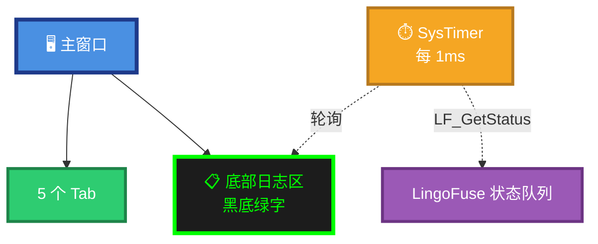

### 3.3 语言选择控件

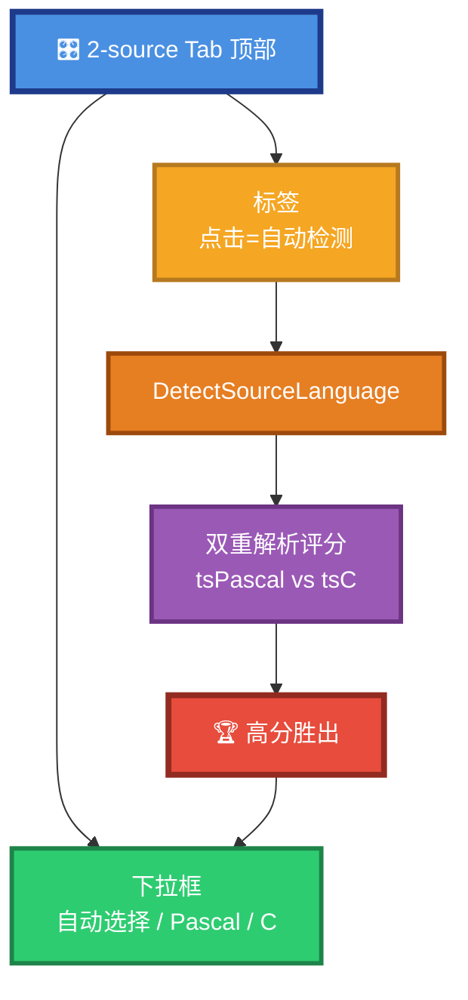

### 3.4 语法高亮自动切换

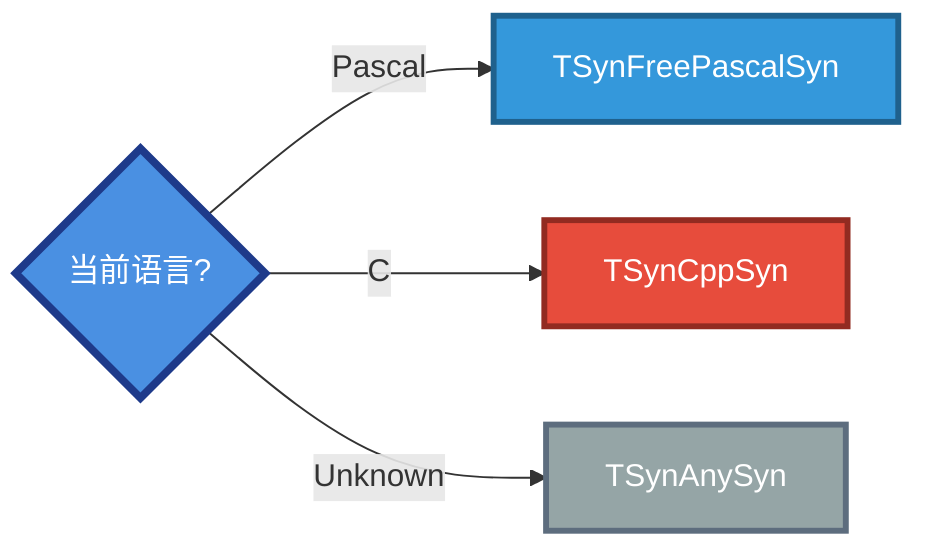

---

## 4. 完整工作流程

### 4.1 五步流程

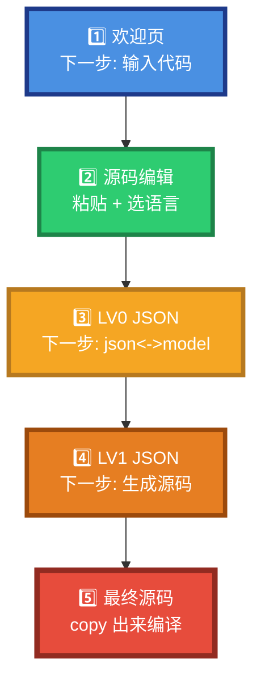

### 4.2 第 2 步：源码编辑按钮

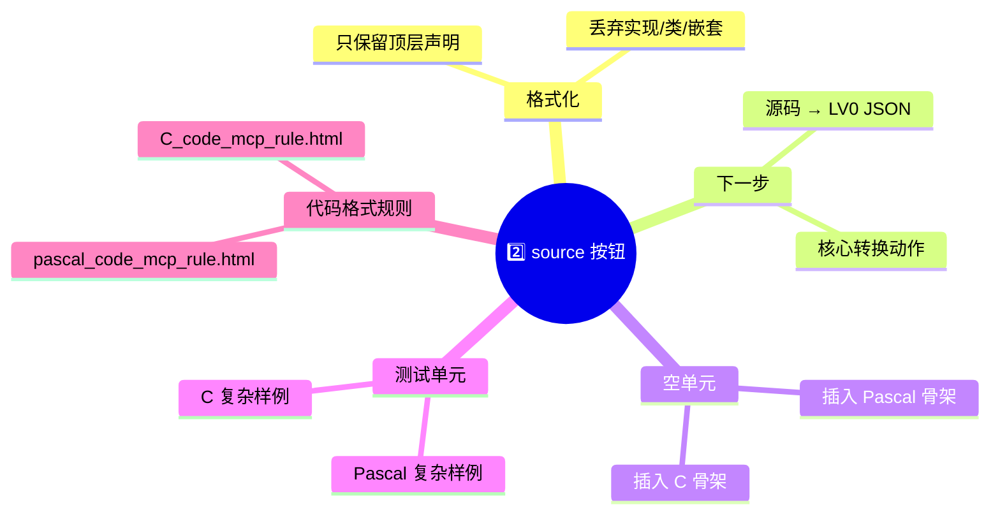

### 4.3 第 3 步：LV0 JSON 双向转换

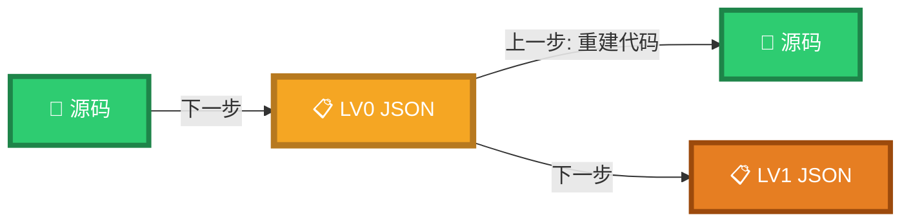

### 4.4 第 4 步：LV1 模型 JSON 功能

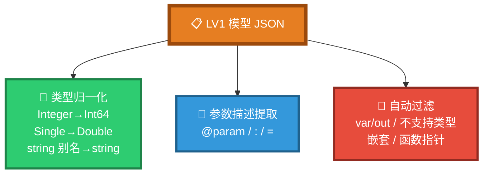

### 4.5 第 5 步：生成的文件名规则

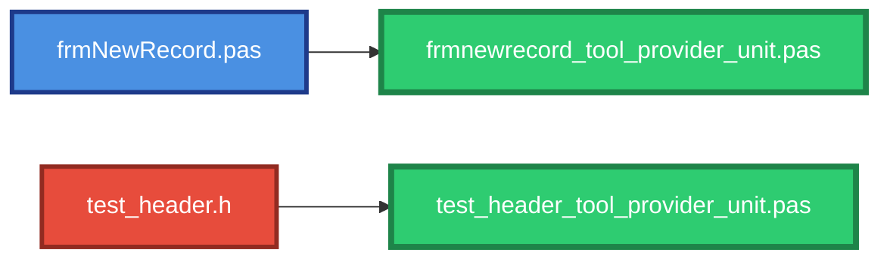

---

## 5. 各层数据结构

### 5.1 Layer 1：Pascal 声明体

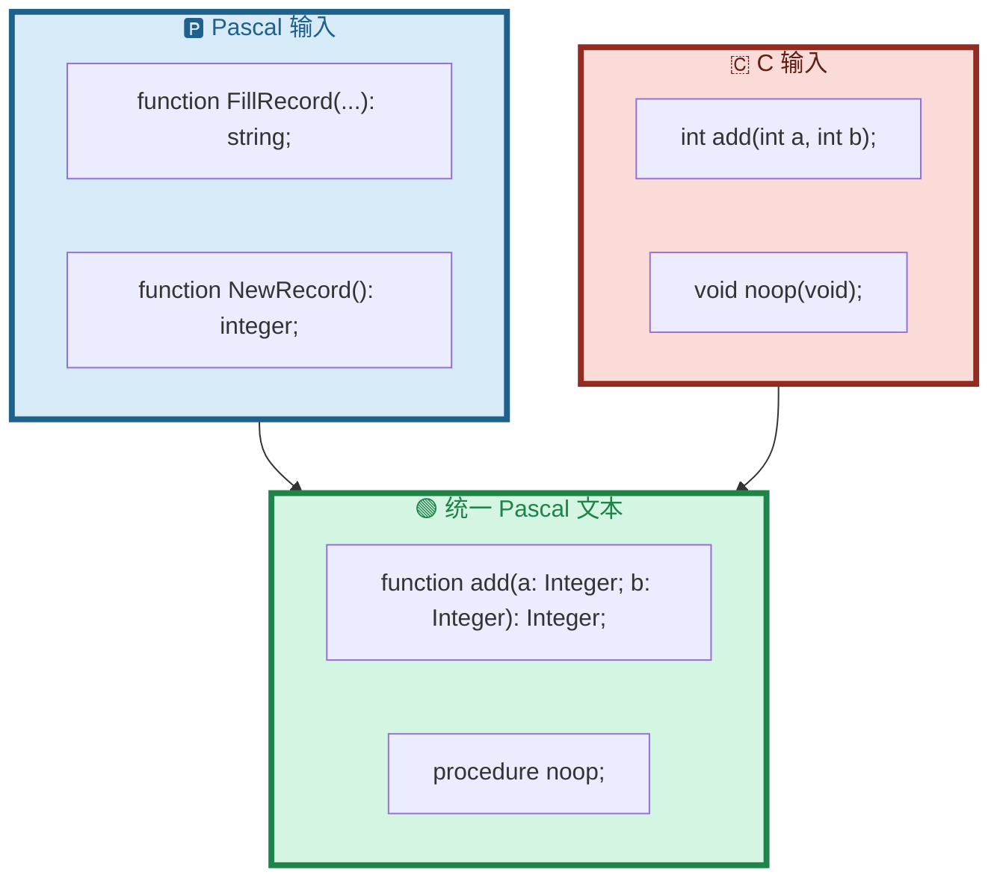

### 5.2 Layer 2：LV0 JSON 结构

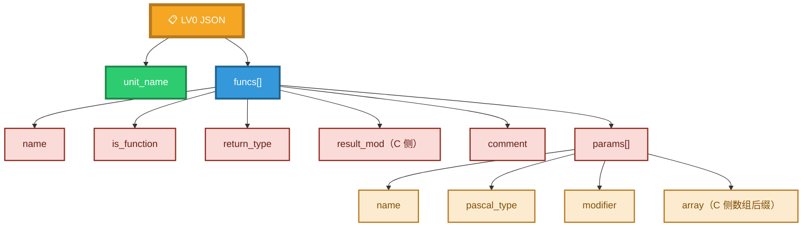

### 5.3 Layer 3：LV1 规范化

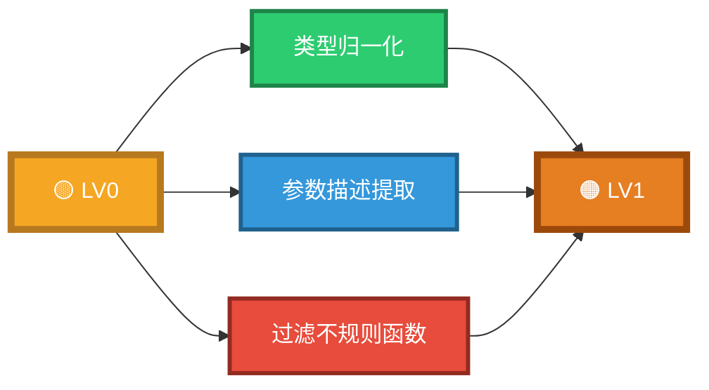

---

## 6. 生成代码结构

### 6.1 单元骨架（一图总览）

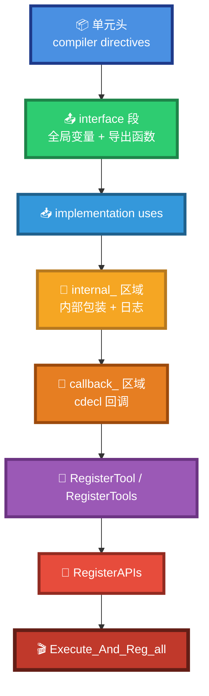

### 6.2 全局变量（interface 段）

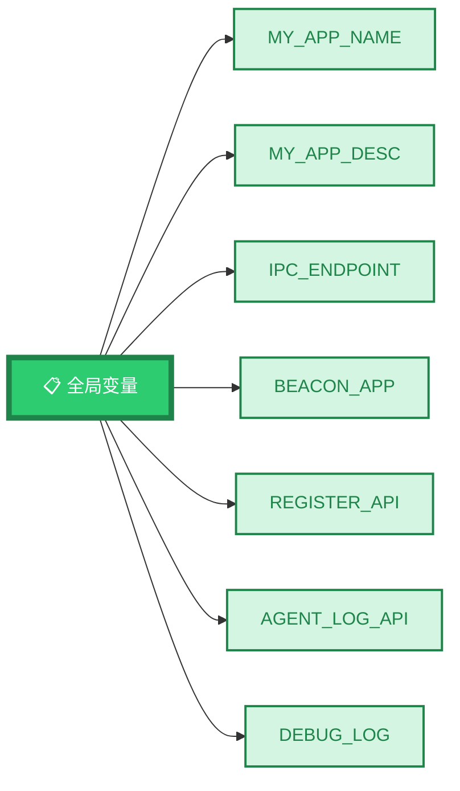

### 6.3 导出函数

```mermaid
flowchart LR
    E["📤 interface 导出"] --> F1["RegisterAPIs<br/>创建 App + 注册 Call"]
    E --> F2["RegisterTools<br/>连接信标 + 注册 Tool"]
    E --> F3["Execute_And_Reg_all<br/>一站式启动"]

    style E fill:#2ECC71,stroke:#1E8449,stroke-width:5px,color:#FFFFFF
    style F1 fill:#3498DB,stroke:#1F618D,stroke-width:4px,color:#FFFFFF
    style F2 fill:#9B59B6,stroke:#6C3483,stroke-width:4px,color:#FFFFFF
    style F3 fill:#E74C3C,stroke:#922B21,stroke-width:5px,color:#FFFFFF
```

### 6.4 三个函数的调用链

```mermaid
flowchart TB
    E["Execute_And_Reg_all"] --> RA["RegisterAPIs"]
    E --> RP["LF_ResetPrepare"]
    E --> PC["LF_PrepareClientEx"]
    E --> PD["LF_PrepareDone"]
    E --> RT["RegisterTools"]

    RA --> C1["LF_CreateAppEx"]
    RA --> C2["LF_RegisterCallEx × N"]

    RT --> T1["LF_CheckApiEx<br/>信标可用性"]
    RT --> T2["RegisterTool × N"]

    style E fill:#E74C3C,stroke:#922B21,stroke-width:5px,color:#FFFFFF
    style RA fill:#3498DB,stroke:#1F618D,stroke-width:4px,color:#FFFFFF
    style RP fill:#95A5A6,stroke:#5D6D7E,stroke-width:3px,color:#FFFFFF
    style PC fill:#95A5A6,stroke:#5D6D7E,stroke-width:3px,color:#FFFFFF
    style PD fill:#95A5A6,stroke:#5D6D7E,stroke-width:3px,color:#FFFFFF
    style RT fill:#9B59B6,stroke:#6C3483,stroke-width:4px,color:#FFFFFF
    style C1 fill:#F5A623,stroke:#B7791F,stroke-width:3px,color:#FFFFFF
    style C2 fill:#F5A623,stroke:#B7791F,stroke-width:3px,color:#FFFFFF
    style T1 fill:#E67E22,stroke:#9C4A0C,stroke-width:3px,color:#FFFFFF
    style T2 fill:#E67E22,stroke:#9C4A0C,stroke-width:3px,color:#FFFFFF
```

### 6.5 每个 API 的生成结构

```mermaid
flowchart TB
    API["🎯 单个 API"] --> W["internal_call_*<br/>内部包装"]
    API --> CB["Callback_*<br/>cdecl 回调"]
    API --> FWD["forward 声明"]
    API --> REG["RegisterCallEx"]

    W --> W1["默认被注释的<br/>TCompute.Sync 块"]
    CB --> CB1["读 JSON 输入"]
    CB --> CB2["提取参数"]
    CB --> CB3["调用 internal"]
    CB --> CB4["写 JSON 输出"]
    CB --> CB5["异常处理"]

    style API fill:#4A90E2,stroke:#1E3A8A,stroke-width:5px,color:#FFFFFF
    style W fill:#F5A623,stroke:#B7791F,stroke-width:4px,color:#FFFFFF
    style CB fill:#E67E22,stroke:#9C4A0C,stroke-width:4px,color:#FFFFFF
    style FWD fill:#3498DB,stroke:#1F618D,stroke-width:3px,color:#FFFFFF
    style REG fill:#9B59B6,stroke:#6C3483,stroke-width:3px,color:#FFFFFF
    style W1 fill:#FDEBD0,stroke:#B7791F,stroke-width:2px,color:#7E5109
    style CB1 fill:#FDEBD0,stroke:#B7791F,stroke-width:2px,color:#7E5109
    style CB2 fill:#FDEBD0,stroke:#B7791F,stroke-width:2px,color:#7E5109
    style CB3 fill:#FDEBD0,stroke:#B7791F,stroke-width:2px,color:#7E5109
    style CB4 fill:#FDEBD0,stroke:#B7791F,stroke-width:2px,color:#7E5109
    style CB5 fill:#FDEBD0,stroke:#B7791F,stroke-width:2px,color:#7E5109
```

### 6.6 内部包装的 UI 同步决策

```mermaid
flowchart TB
    Q{"原函数会操作 UI?"}
    Q -->|是| A["✅ 取消注释<br/>TCompute.Sync"]
    Q -->|否| B["❌ 保持注释"]
    Q -->|内部已同步| B

    A --> R1["主线程安全"]
    B --> R2["后台线程执行"]

    style Q fill:#F5A623,stroke:#B7791F,stroke-width:5px,color:#FFFFFF
    style A fill:#2ECC71,stroke:#1E8449,stroke-width:5px,color:#FFFFFF
    style B fill:#95A5A6,stroke:#5D6D7E,stroke-width:5px,color:#FFFFFF
    style R1 fill:#D5F5E3,stroke:#1E8449,stroke-width:3px,color:#1E8449
    style R2 fill:#EAECEE,stroke:#5D6D7E,stroke-width:3px,color:#5D6D7E
```

---

## 7. 未来规划：多语言扩展

### 7.1 演进路线

```mermaid
timeline
    title 多语言 MCP 代码生成器演进
    section 已实现 v3.0
        Pascal 输入 : Fill_Pascal
        C 输入 : Fill_C + Translate
        Pascal 输出 : pas_mcp_generator
    section 短期 v3.1-3.4
        C++ 输入 : 类方法 + 命名空间
        Rust 输入 : 所有权 + 生命周期
        Go 输入 : 多返回值 + 接口
        Python 输入 : 动态类型 + 装饰器
    section 中期 v4.0
        Java / C# 输入 : 泛型 + 反射
        Python 输出
        JavaScript 输出
    section 长期
        Rust 输出
        Go 输出
        任意语言 → 任意语言
```

### 7.2 架构扩展点

```mermaid
flowchart TB
    subgraph Input["📥 输入层（可插拔）"]
        I1["Pascal 修饰器"]
        I2["C 修饰器"]
        I3["Rust 修饰器"]
        I4["Go 修饰器"]
        I5["..."]
    end

    M["💎 统一元数据<br/>LV0 / LV1"]

    subgraph Output["📤 输出层（可插拔）"]
        O1["Pascal 生成器"]
        O2["Python 生成器"]
        O3["JS/TS 生成器"]
        O4["Rust 生成器"]
        O5["..."]
    end

    I1 --> M
    I2 --> M
    I3 --> M
    I4 --> M
    I5 --> M
    M --> O1
    M --> O2
    M --> O3
    M --> O4
    M --> O5

    style M fill:#2ECC71,stroke:#1E8449,stroke-width:6px,color:#FFFFFF
    style Input fill:#D6EAF8,stroke:#1F618D,stroke-width:3px,color:#1F618D
    style Output fill:#FADBD8,stroke:#922B21,stroke-width:3px,color:#641E16
    style I1 fill:#4A90E2,stroke:#1E3A8A,stroke-width:2px,color:#FFFFFF
    style I2 fill:#4A90E2,stroke:#1E3A8A,stroke-width:2px,color:#FFFFFF
    style I3 fill:#4A90E2,stroke:#1E3A8A,stroke-width:2px,color:#FFFFFF
    style I4 fill:#4A90E2,stroke:#1E3A8A,stroke-width:2px,color:#FFFFFF
    style I5 fill:#4A90E2,stroke:#1E3A8A,stroke-width:2px,color:#FFFFFF
    style O1 fill:#E74C3C,stroke:#922B21,stroke-width:2px,color:#FFFFFF
    style O2 fill:#E74C3C,stroke:#922B21,stroke-width:2px,color:#FFFFFF
    style O3 fill:#E74C3C,stroke:#922B21,stroke-width:2px,color:#FFFFFF
    style O4 fill:#E74C3C,stroke:#922B21,stroke-width:2px,color:#FFFFFF
    style O5 fill:#E74C3C,stroke:#922B21,stroke-width:2px,color:#FFFFFF
```

### 7.3 目标：任意语言 → 任意语言

```mermaid
flowchart LR
    Any["🌍 任意输入语言"] --> Meta["💎 统一元数据"]
    Meta --> Out["🌌 任意输出语言"]

    style Any fill:#4A90E2,stroke:#1E3A8A,stroke-width:5px,color:#FFFFFF
    style Meta fill:#2ECC71,stroke:#1E8449,stroke-width:6px,color:#FFFFFF
    style Out fill:#E74C3C,stroke:#922B21,stroke-width:5px,color:#FFFFFF
```

---

## 8. 编译与部署

### 8.1 三步部署

```mermaid
flowchart LR
    S1["1️⃣ lazbuild<br/>编译生成的单元"] --> S2["2️⃣ 复制 DLL<br/>LingoFuse64.dll"]
    S2 --> S3["3️⃣ 启动信标<br/>pascal_agent_service.exe"]

    style S1 fill:#4A90E2,stroke:#1E3A8A,stroke-width:4px,color:#FFFFFF
    style S2 fill:#F5A623,stroke:#B7791F,stroke-width:4px,color:#FFFFFF
    style S3 fill:#2ECC71,stroke:#1E8449,stroke-width:4px,color:#FFFFFF
```

### 8.2 运行时拓扑

```mermaid
flowchart LR
    EXE["🎯 工具提供者 EXE"] -->|连接| Beacon["📡 信标<br/>pascal_agent_service"]
    Beacon -->|注册工具| EXE
    MCP["🌉 mcp_server.exe"] -->|Call API| Beacon
    AI["🤖 AI 客户端<br/>LM Studio / Claude"] -->|MCP 协议| MCP

    style EXE fill:#E74C3C,stroke:#922B21,stroke-width:5px,color:#FFFFFF
    style Beacon fill:#2ECC71,stroke:#1E8449,stroke-width:5px,color:#FFFFFF
    style MCP fill:#9B59B6,stroke:#6C3483,stroke-width:5px,color:#FFFFFF
    style AI fill:#F5A623,stroke:#B7791F,stroke-width:5px,color:#FFFFFF
```

### 8.3 完整调用链

```mermaid
sequenceDiagram
    participant AI as 🤖 AI 客户端
    participant MCP as 🌉 mcp_server
    participant Beacon as 📡 信标
    participant EXE as 🎯 工具提供者

    AI->>MCP: MCP 工具调用
    MCP->>Beacon: LF_Call (Call API)
    Beacon->>EXE: 路由到目标 App
    EXE->>EXE: Callback 执行
    EXE-->>Beacon: JSON 响应
    Beacon-->>MCP: 返回结果
    MCP-->>AI: MCP 响应
```

---

## 9. 常见问题（一图速查）

### 9.1 为什么函数被跳过

```mermaid
mindmap
  root(("❓ 函数被跳过"))
    类型不支持
      Boolean
      Variant
      数组 / 记录 / 类
      枚举 / 集合
      泛型
    修饰符问题
      Pascal: var / out
      C: 函数指针
      C: 变参
    位置问题
      嵌套函数
      类方法
      实现段
    返回类型
      不支持的返回类型
```

### 9.2 UI 同步决策

```mermaid
flowchart TB
    Q1{"原函数直接操作 UI?"}
    Q1 -->|是| A1["✅ 取消 TCompute.Sync 注释"]
    Q1 -->|否| Q2{"内部已用 Synchronize?"}
    Q2 -->|是| A2["❌ 保持注释"]
    Q2 -->|否| A2

    style Q1 fill:#F5A623,stroke:#B7791F,stroke-width:5px,color:#FFFFFF
    style A1 fill:#2ECC71,stroke:#1E8449,stroke-width:5px,color:#FFFFFF
    style Q2 fill:#E67E22,stroke:#9C4A0C,stroke-width:5px,color:#FFFFFF
    style A2 fill:#95A5A6,stroke:#5D6D7E,stroke-width:5px,color:#FFFFFF
```

### 9.3 信标不可用排查

```mermaid
flowchart TB
    E["❌ RegisterTool<br/>Beacon not available"]
    E --> C1{"pascal_agent_service<br/>已启动?"}
    C1 -->|否| F1["启动信标"]
    C1 -->|是| C2{"监听 ipc:agent?"}
    C2 -->|否| F2["检查配置"]
    C2 -->|是| C3["LF_CheckApiEx<br/>单独测试"]
    C3 --> F3["检查网络/防火墙"]

    style E fill:#E74C3C,stroke:#922B21,stroke-width:5px,color:#FFFFFF
    style C1 fill:#F5A623,stroke:#B7791F,stroke-width:3px,color:#FFFFFF
    style C2 fill:#F5A623,stroke:#B7791F,stroke-width:3px,color:#FFFFFF
    style C3 fill:#E67E22,stroke:#9C4A0C,stroke-width:3px,color:#FFFFFF
    style F1 fill:#2ECC71,stroke:#1E8449,stroke-width:3px,color:#FFFFFF
    style F2 fill:#2ECC71,stroke:#1E8449,stroke-width:3px,color:#FFFFFF
    style F3 fill:#2ECC71,stroke:#1E8449,stroke-width:3px,color:#FFFFFF
```

---

## 10. 语法白名单速查

### 10.1 Pascal 侧

```mermaid
flowchart TB
    P["🅿️ Pascal 输入"] --> OK["✅ 允许"]
    P --> NO["❌ 禁止"]

    OK --> OK1["interface 段顶层"]
    OK --> OK2["const / in / 空白"]
    OK --> OK3["整数族"]
    OK --> OK4["浮点族"]
    OK --> OK5["字符串族"]
    OK --> OK6["紧邻上方注释"]

    NO --> NO1["implementation 段"]
    NO --> NO2["类/记录/接口内"]
    NO --> NO3["var / out"]
    NO --> NO4["Boolean / Variant"]
    NO --> NO5["数组 / 记录 / 类"]
    NO --> NO6["枚举 / 集合 / 泛型"]
    NO --> NO7["函数指针 / 指针"]
    NO --> NO8["尾随注释"]

    style P fill:#4A90E2,stroke:#1E3A8A,stroke-width:5px,color:#FFFFFF
    style OK fill:#2ECC71,stroke:#1E8449,stroke-width:5px,color:#FFFFFF
    style NO fill:#E74C3C,stroke:#922B21,stroke-width:5px,color:#FFFFFF
```

### 10.2 C 侧

```mermaid
flowchart TB
    C["🇨 C 输入"] --> OK["✅ 允许"]
    C --> NO["❌ 禁止"]

    OK --> OK1["顶层原型以 ; 结尾"]
    OK --> OK2["extern C 块内"]
    OK --> OK3["const"]
    OK --> OK4["restrict（剥离）"]
    OK --> OK5["整数/浮点/字符串/指针"]
    OK --> OK6["紧邻上方注释"]

    NO --> NO1["函数定义带 {}"]
    NO --> NO2["变量 / 类型定义"]
    NO --> NO3["预处理指令"]
    NO --> NO4["函数指针参数"]
    NO --> NO5["变参 ..."]
    NO --> NO6["struct / union / enum"]
    NO --> NO7["_Bool / wchar_t"]
    NO --> NO8["尾随注释"]

    style C fill:#E74C3C,stroke:#922B21,stroke-width:5px,color:#FFFFFF
    style OK fill:#2ECC71,stroke:#1E8449,stroke-width:5px,color:#FFFFFF
    style NO fill:#922B21,stroke:#641E16,stroke-width:5px,color:#FFFFFF
```

### 10.3 类型归一化对照

```mermaid
flowchart LR
    subgraph IN["输入类型"]
        I1["Integer / Int64<br/>Cardinal / Longint"]
        I2["Double / Single<br/>Extended / Real"]
        I3["string / AnsiString<br/>UnicodeString"]
    end

    subgraph OUT["归一化"]
        O1["Int64"]
        O2["Double"]
        O3["string"]
    end

    I1 --> O1
    I2 --> O2
    I3 --> O3

    style I1 fill:#4A90E2,stroke:#1E3A8A,stroke-width:3px,color:#FFFFFF
    style I2 fill:#E74C3C,stroke:#922B21,stroke-width:3px,color:#FFFFFF
    style I3 fill:#9B59B6,stroke:#6C3483,stroke-width:3px,color:#FFFFFF
    style O1 fill:#2ECC71,stroke:#1E8449,stroke-width:4px,color:#FFFFFF
    style O2 fill:#F5A623,stroke:#B7791F,stroke-width:4px,color:#FFFFFF
    style O3 fill:#E67E22,stroke:#9C4A0C,stroke-width:4px,color:#FFFFFF
```

### 10.4 C → Pascal 精确映射

```mermaid
flowchart LR
    subgraph CS["🇨 C 类型"]
        C1["signed char / int8_t"]
        C2["short / int16_t"]
        C3["int / int32_t"]
        C4["long long / int64_t"]
        C5["unsigned int"]
        C6["float"]
        C7["double"]
        C8["char *"]
        C9["int *"]
    end

    subgraph PS["🅿️ Pascal"]
        P1["ShortInt"]
        P2["SmallInt"]
        P3["Integer"]
        P4["Int64"]
        P5["Cardinal"]
        P6["Single"]
        P7["Double"]
        P8["string"]
        P9["Pointer"]
    end

    C1 --> P1
    C2 --> P2
    C3 --> P3
    C4 --> P4
    C5 --> P5
    C6 --> P6
    C7 --> P7
    C8 --> P8
    C9 --> P9

    style C1 fill:#FADBD8,stroke:#922B21,stroke-width:2px,color:#641E16
    style C2 fill:#FADBD8,stroke:#922B21,stroke-width:2px,color:#641E16
    style C3 fill:#FADBD8,stroke:#922B21,stroke-width:2px,color:#641E16
    style C4 fill:#FADBD8,stroke:#922B21,stroke-width:2px,color:#641E16
    style C5 fill:#FADBD8,stroke:#922B21,stroke-width:2px,color:#641E16
    style C6 fill:#FADBD8,stroke:#922B21,stroke-width:2px,color:#641E16
    style C7 fill:#FADBD8,stroke:#922B21,stroke-width:2px,color:#641E16
    style C8 fill:#FADBD8,stroke:#922B21,stroke-width:2px,color:#641E16
    style C9 fill:#FADBD8,stroke:#922B21,stroke-width:2px,color:#641E16
    style P1 fill:#D6EAF8,stroke:#1F618D,stroke-width:2px,color:#1F618D
    style P2 fill:#D6EAF8,stroke:#1F618D,stroke-width:2px,color:#1F618D
    style P3 fill:#D6EAF8,stroke:#1F618D,stroke-width:2px,color:#1F618D
    style P4 fill:#D6EAF8,stroke:#1F618D,stroke-width:2px,color:#1F618D
    style P5 fill:#D6EAF8,stroke:#1F618D,stroke-width:2px,color:#1F618D
    style P6 fill:#D6EAF8,stroke:#1F618D,stroke-width:2px,color:#1F618D
    style P7 fill:#D6EAF8,stroke:#1F618D,stroke-width:2px,color:#1F618D
    style P8 fill:#D6EAF8,stroke:#1F618D,stroke-width:2px,color:#1F618D
    style P9 fill:#D6EAF8,stroke:#1F618D,stroke-width:2px,color:#1F618D
```

---

## 11. 一图收束

```mermaid
flowchart TB
    START["🚀 粘源码"] --> SEL["🎛️ 选语言"]
    SEL --> NEXT["➡️ 下一步"]
    NEXT --> LV0["📋 LV0 JSON"]
    LV0 --> LV1["📋 LV1 JSON"]
    LV1 --> GEN["⚙️ 生成"]
    GEN --> PAS["📄 .pas 单元"]
    PAS --> BUILD["🔨 lazbuild"]
    BUILD --> EXE["🎯 EXE"]
    EXE --> MCP["🌉 MCP 可调用"]

    style START fill:#4A90E2,stroke:#1E3A8A,stroke-width:4px,color:#FFFFFF
    style SEL fill:#3498DB,stroke:#1F618D,stroke-width:4px,color:#FFFFFF
    style NEXT fill:#2ECC71,stroke:#1E8449,stroke-width:4px,color:#FFFFFF
    style LV0 fill:#F5A623,stroke:#B7791F,stroke-width:4px,color:#FFFFFF
    style LV1 fill:#E67E22,stroke:#9C4A0C,stroke-width:4px,color:#FFFFFF
    style GEN fill:#9B59B6,stroke:#6C3483,stroke-width:5px,color:#FFFFFF
    style PAS fill:#E74C3C,stroke:#922B21,stroke-width:4px,color:#FFFFFF
    style BUILD fill:#C0392B,stroke:#641E16,stroke-width:4px,color:#FFFFFF
    style EXE fill:#F39C12,stroke:#B7791F,stroke-width:4px,color:#FFFFFF
    style MCP fill:#1ABC9C,stroke:#0E6251,stroke-width:5px,color:#FFFFFF
```

---

**文档版本**：V4.0  
**维护者**：LingoFuse-pasAgent 团队  
**反馈**：问题提 Issue，急事加 Q（600585）